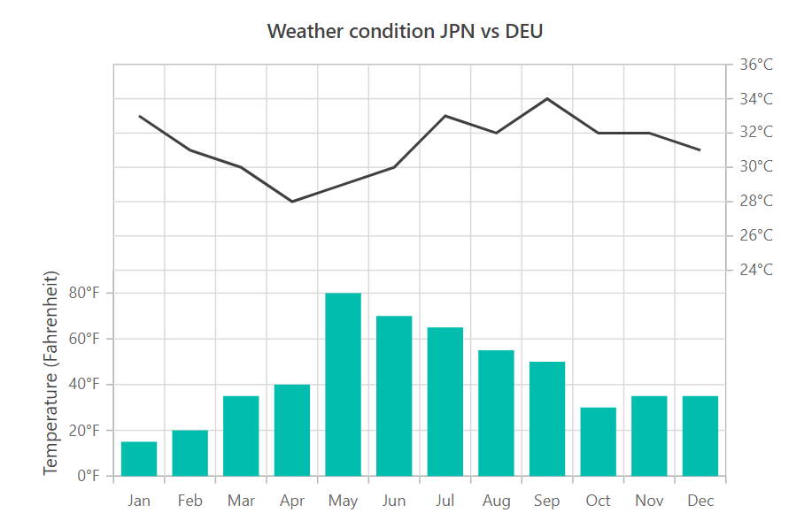
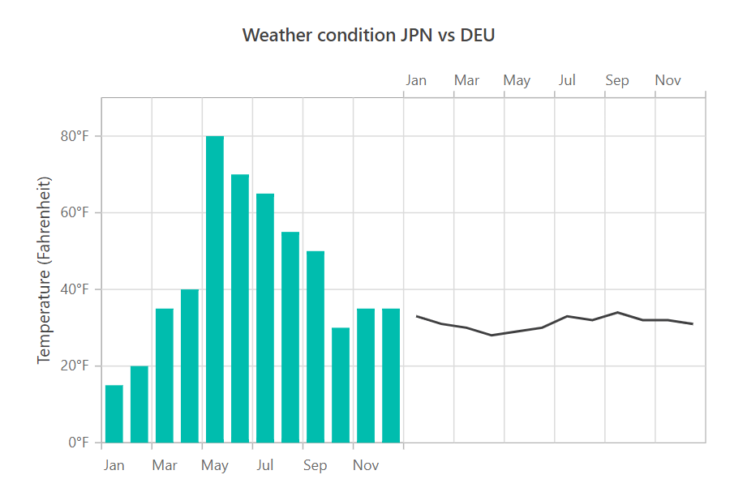
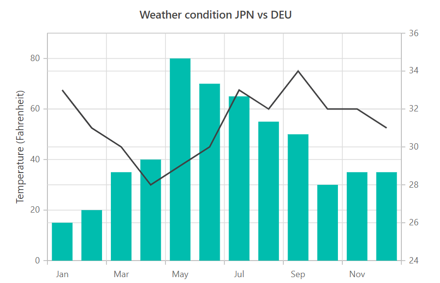

# Multiple Panes in Blazor Charts Component

The chart area can be divided into multiple panes using [Rows](https://help.syncfusion.com/cr/blazor/Syncfusion.Blazor.Charts.ChartRow.html) and [Columns](https://help.syncfusion.com/cr/blazor/Syncfusion.Blazor.Charts.ChartColumn.html) settings.

## Rows

Use the chart's [Rows](https://help.syncfusion.com/cr/blazor/Syncfusion.Blazor.Charts.ChartRow.html) property to divide the chart area vertically into any number of rows.

* The [Height](https://help.syncfusion.com/cr/blazor/Syncfusion.Blazor.Charts.ChartRow.html#Syncfusion_Blazor_Charts_ChartRow_Height) property can be used to allocate space for each row. The value can be expressed either in percentage or pixel.

* To bind a vertical axis to a specific row, set the axis's [RowIndex](https://help.syncfusion.com/cr/blazor/Syncfusion.Blazor.PivotView.AxisSet.html#Syncfusion_Blazor_PivotView_AxisSet_RowIndex) property to that row's index.

* The bottom line of each row can be customized by specified in [ChartBorder](https://help.syncfusion.com/cr/blazor/Syncfusion.Blazor.Charts.ChartBorder.html).

```cshtml

@using Syncfusion.Blazor.Charts

<SfChart Title="Weather condition JPN vs DEU">
    <ChartPrimaryXAxis ValueType="Syncfusion.Blazor.Charts.ValueType.Category"/>    

    <ChartPrimaryYAxis Title="Temperature (Fahrenheit)" LabelFormat="{value}°F" Minimum="0" Maximum="90" Interval="20"/>    

    <ChartRows>
        <ChartRow Height="50%"/>
        <ChartRow Height="50%"/>
    </ChartRows>

    <ChartAxes>
        <ChartAxis Minimum="24" Maximum="36" Interval="2" OpposedPosition="true" RowIndex="1" Name="YAxis" LabelFormat="{value}°C"/>        
    </ChartAxes>

    <ChartSeriesCollection>

        <ChartSeries DataSource="@WeatherReports" XName="X" YName="Y" Type="ChartSeriesType.Column"/>
        
        <ChartSeries DataSource="@WeatherReports" XName="X" YName="Y1" YAxisName="YAxis"/>
        
    </ChartSeriesCollection>
</SfChart>

@code{
    public class ChartData
    {
        public string X { get; set; }
        public double Y { get; set; }
        public double Y1 { get; set; }
    }

	public List<ChartData> WeatherReports = new List<ChartData>
	{
		new ChartData{ X= "Jan", Y= 15, Y1= 33 },
		new ChartData{ X= "Feb", Y= 20, Y1= 31 },
		new ChartData{ X= "Mar", Y= 35, Y1= 30 },
		new ChartData{ X= "Apr", Y= 40, Y1= 28 },
		new ChartData{ X= "May", Y= 80, Y1= 29 },
		new ChartData{ X= "Jun", Y= 70, Y1= 30 },
		new ChartData{ X= "Jul", Y= 65, Y1= 33 },
		new ChartData{ X= "Aug", Y= 55, Y1= 32 },
		new ChartData{ X= "Sep", Y= 50, Y1= 34 },
		new ChartData{ X= "Oct", Y= 30, Y1= 32 },
		new ChartData{ X= "Nov", Y= 35, Y1= 32 },
		new ChartData{ X= "Dec", Y= 35, Y1= 31 }
	};
}

```




The [Span](https://help.syncfusion.com/cr/blazor/Syncfusion.Blazor.Charts.StockChartCommonAxis.html#Syncfusion_Blazor_Charts_StockChartCommonAxis_Span) property of the axis can be used to span the vertical axis across multiple rows.

```cshtml

@using Syncfusion.Blazor.Charts

<SfChart Title="Weather condition JPN vs DEU">
    <ChartPrimaryXAxis ValueType="Syncfusion.Blazor.Charts.ValueType.Category"/>    

    <ChartPrimaryYAxis Span="2" Title="Temperature (Fahrenheit)" LabelFormat="{value}°F" Minimum="0" Maximum="90" Interval="20"/>    

    <ChartRows>
        <ChartRow Height="50%"/>
        <ChartRow Height="50%"/>
    </ChartRows>

    <ChartAxes>
        <ChartAxis Minimum="24" Maximum="36" Interval="2" OpposedPosition="true" RowIndex="1" Name="YAxis" LabelFormat="{value}°C"/>        
    </ChartAxes>

    <ChartSeriesCollection>

        <ChartSeries DataSource="@WeatherReports" XName="X" YName="Y" Type="ChartSeriesType.Column"/>
        
        <ChartSeries DataSource="@WeatherReports" XName="X" YName="Y1" YAxisName="YAxis"/>
        
    </ChartSeriesCollection>
</SfChart>

@code{
    public class ChartData
    {
        public string X { get; set; }
        public double Y { get; set; }
        public double Y1 { get; set; }
    }

	public List<ChartData> WeatherReports = new List<ChartData>
	{
		new ChartData{ X= "Jan", Y= 15, Y1= 33 },
		new ChartData{ X= "Feb", Y= 20, Y1= 31 },
		new ChartData{ X= "Mar", Y= 35, Y1= 30 },
		new ChartData{ X= "Apr", Y= 40, Y1= 28 },
		new ChartData{ X= "May", Y= 80, Y1= 29 },
		new ChartData{ X= "Jun", Y= 70, Y1= 30 },
		new ChartData{ X= "Jul", Y= 65, Y1= 33 },
		new ChartData{ X= "Aug", Y= 55, Y1= 32 },
		new ChartData{ X= "Sep", Y= 50, Y1= 34 },
		new ChartData{ X= "Oct", Y= 30, Y1= 32 },
		new ChartData{ X= "Nov", Y= 35, Y1= 32 },
		new ChartData{ X= "Dec", Y= 35, Y1= 31 }
	};
}


```



## Columns

Use the chart's [Columns](https://help.syncfusion.com/cr/blazor/Syncfusion.Blazor.Charts.ChartColumn.html) property to divide the chart area horizontally into any number of columns.

* The [Width](https://help.syncfusion.com/cr/blazor/Syncfusion.Blazor.Charts.ChartColumn.html#Syncfusion_Blazor_Charts_ChartColumn_Width) property can be used to allocate space for each column. The value can be expressed either in percentage or pixel.

* To bind a horizontal axis to a specific column, set the axis's [ColumnIndex](https://help.syncfusion.com/cr/blazor/Syncfusion.Blazor.Charts.ChartAxis.html#Syncfusion_Blazor_Charts_ChartAxis_ColumnIndex) property to that column's index.

* The left line of each column can be customized by specified in [ChartBorder](https://help.syncfusion.com/cr/blazor/Syncfusion.Blazor.Charts.ChartBorder.html).

```cshtml

@using Syncfusion.Blazor.Charts

<SfChart Title="Weather condition JPN vs DEU">

    <ChartPrimaryXAxis ValueType="Syncfusion.Blazor.Charts.ValueType.Category"/>    

    <ChartPrimaryYAxis Title="Temperature (Fahrenheit)" LabelFormat="{value}°F" Minimum="0" Maximum="90" Interval="20"/>
    
    <ChartColumns>
        <ChartColumn Width="50%"/>        
        <ChartColumn Width="50%"/>        
    </ChartColumns>

    <ChartAxes>
        <ChartAxis Interval="2" OpposedPosition="true" ColumnIndex="1" Name="XAxis" ValueType="Syncfusion.Blazor.Charts.ValueType.Category"/>
       
    </ChartAxes>

    <ChartSeriesCollection>
        <ChartSeries DataSource="@WeatherReports" XName="X" YName="Y" Type="ChartSeriesType.Column"/>
        <ChartSeries DataSource="@WeatherReports" XName="X" YName="Y1" XAxisName="XAxis" />       
    </ChartSeriesCollection>
</SfChart>

@code{
    public class ChartData
    {
        public string X { get; set; }
        public double Y { get; set; }
        public double Y1 { get; set; }
    }

	public List<ChartData> WeatherReports = new List<ChartData>
	{
		new ChartData{ X= "Jan", Y= 15, Y1= 33 },
		new ChartData{ X= "Feb", Y= 20, Y1= 31 },
		new ChartData{ X= "Mar", Y= 35, Y1= 30 },
		new ChartData{ X= "Apr", Y= 40, Y1= 28 },
		new ChartData{ X= "May", Y= 80, Y1= 29 },
		new ChartData{ X= "Jun", Y= 70, Y1= 30 },
		new ChartData{ X= "Jul", Y= 65, Y1= 33 },
		new ChartData{ X= "Aug", Y= 55, Y1= 32 },
		new ChartData{ X= "Sep", Y= 50, Y1= 34 },
		new ChartData{ X= "Oct", Y= 30, Y1= 32 },
		new ChartData{ X= "Nov", Y= 35, Y1= 32 },
		new ChartData{ X= "Dec", Y= 35, Y1= 31 }
	};
}

```




The [Span](https://help.syncfusion.com/cr/blazor/Syncfusion.Blazor.Charts.StockChartCommonAxis.html#Syncfusion_Blazor_Charts_StockChartCommonAxis_Span) property of the axis can be used to span the horizontal axis across multiple column.

```cshtml

@using Syncfusion.Blazor.Charts

<SfChart Title="Weather condition JPN vs DEU">

    <ChartPrimaryXAxis Span="2" ValueType="Syncfusion.Blazor.Charts.ValueType.Category"/>    

    <ChartPrimaryYAxis Title="Temperature (Fahrenheit)" LabelFormat="{value}°F" Minimum="0" Maximum="90" Interval="20"/>
    
    <ChartColumns>
        <ChartColumn Width="50%"/>        
        <ChartColumn Width="50%"/>        
    </ChartColumns>

    <ChartAxes>
        <ChartAxis Interval="2" OpposedPosition="true" ColumnIndex="1" Name="XAxis" ValueType="Syncfusion.Blazor.Charts.ValueType.Category"/>
       
    </ChartAxes>

    <ChartSeriesCollection>
        <ChartSeries DataSource="@WeatherReports" XName="X" YName="Y" Type="ChartSeriesType.Column"/>
        <ChartSeries DataSource="@WeatherReports" XName="X" YName="Y1" XAxisName="XAxis" />       
    </ChartSeriesCollection>
</SfChart>

@code{
    public class ChartData
    {
        public string X { get; set; }
        public double Y { get; set; }
        public double Y1 { get; set; }
    }

    public List<ChartData> WeatherReports = new List<ChartData>
	{
		new ChartData{ X= "Jan", Y= 15, Y1= 33 },
		new ChartData{ X= "Feb", Y= 20, Y1= 31 },
		new ChartData{ X= "Mar", Y= 35, Y1= 30 },
		new ChartData{ X= "Apr", Y= 40, Y1= 28 },
		new ChartData{ X= "May", Y= 80, Y1= 29 },
		new ChartData{ X= "Jun", Y= 70, Y1= 30 },
		new ChartData{ X= "Jul", Y= 65, Y1= 33 },
		new ChartData{ X= "Aug", Y= 55, Y1= 32 },
		new ChartData{ X= "Sep", Y= 50, Y1= 34 },
		new ChartData{ X= "Oct", Y= 30, Y1= 32 },
		new ChartData{ X= "Nov", Y= 35, Y1= 32 },
		new ChartData{ X= "Dec", Y= 35, Y1= 31 }
	};
}

```




N> Refer to our [Blazor Charts](https://www.syncfusion.com/blazor-components/blazor-charts) feature tour page for its groundbreaking feature representations and also explore our [Blazor Chart Example](https://blazor.syncfusion.com/demos/chart/line?theme=bootstrap5) to know various chart types and how to represent time-dependent data, showing trends at equal intervals.

## See also

* [Data label](./data-labels)
* [Tooltip](./tool-tip)
* [Marker](./data-markers)