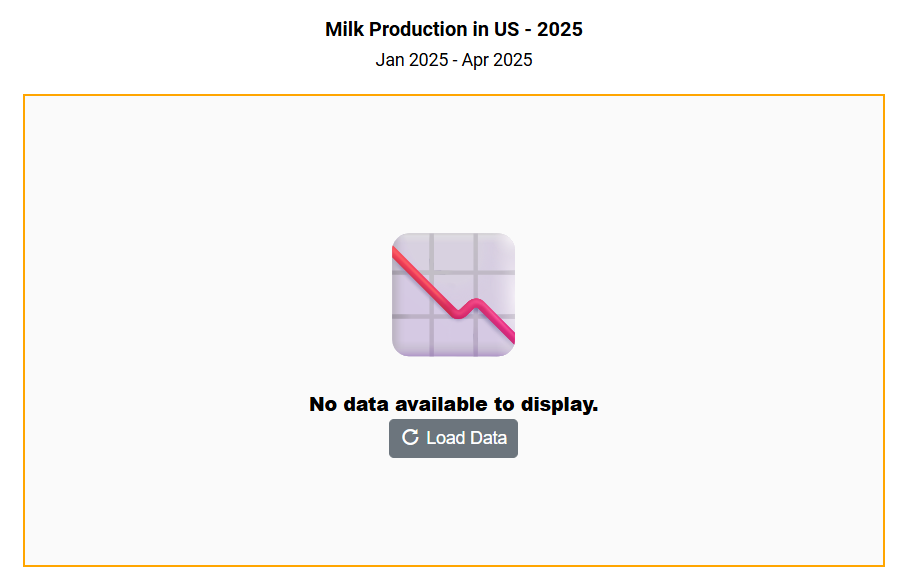
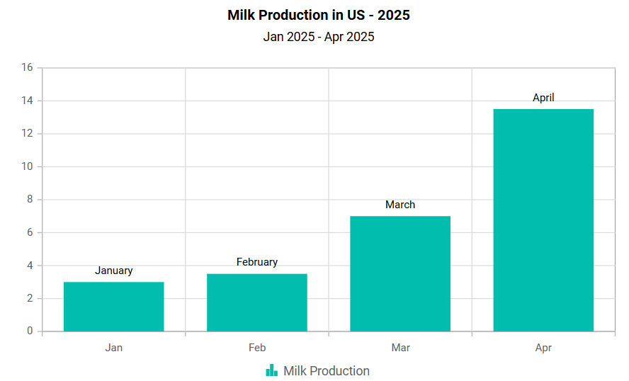

# No Data Template in Blazor Charts Component

In the Blazor Chart component, when there is no data to render, a customizable layout is displayed within the chart area. This is managed using the `NoDataTemplate` property, which supports styled text, images, and interactive elements to align with the application's design and provide meaningful feedback to users.

This template is especially helpful in empty data scenarios. It can show a message indicating that no data is available, display a relevant image, and include a button to load or refresh data. Once data is available, the chart automatically updates to render the appropriate visualization.

```cshtml

@using Syncfusion.Blazor.Charts
@using Syncfusion.Blazor.Buttons

<SfChart @ref="chart" Width="80%" Title="Milk Production in US - 2025" SubTitle="Jan 2025 - Apr 2025">
    <NoDataTemplate>
        <div class="noDataTemplateContainerStyle" style=" border: 2px solid orange; display: row-flex; align-items: center; justify-content: center; align-content: center; white-space: normal; text-align: center; width: inherit; height: inherit; font-weight: bolder; font-size: medium;">
            <span style="font-size: 100px;">📉</span>
            <div style="font-size:15px;"><strong>No data available to display.</strong></div>
            <SfButton IconCss="e-icons e-refresh" OnClick="LoadData">Load Data</SfButton>
        </div>
    </NoDataTemplate>
    <ChildContent>
        <ChartPrimaryXAxis ValueType="Syncfusion.Blazor.Charts.ValueType.Category" />
        <ChartSeriesCollection>
            <ChartSeries DataSource="@SalesReports" XName="Month" YName="Value" Type="ChartSeriesType.Column" Name="Milk Production">
                <ChartMarker>
                    <ChartDataLabel Visible="true" Name="Text"/>
                </ChartMarker>
            </ChartSeries>
        </ChartSeriesCollection>
    </ChildContent>
</SfChart>

<style>
    .noDataTemplateContainerStyle {
        background-color: #fafafa;
        color: #000000;
    }
</style>

@code {
    private SfChart chart;
    public class Data
    {
        public string Month { get; set; }
        public double Value { get; set; }
        public string Text { get; set; }
    }
    public List<Data> SalesReports = new List<Data>();
    private void LoadData()
    {
        SalesReports = new List<Data>
        {
            new Data { Month = "Jan", Value = 3, Text = "January" },
            new Data { Month = "Feb", Value = 3.5, Text = "February" },
            new Data { Month = "Mar", Value = 7, Text = "March" },
            new Data { Month = "Apr", Value = 13.5, Text = "April" }
        };
        if (chart != null)
        chart.RefreshAsync();
    }
}

```




N> Refer to our [Blazor Charts](https://www.syncfusion.com/blazor-components/blazor-charts) feature tour page for its groundbreaking feature representations and also explore our [Blazor Chart Example](https://blazor.syncfusion.com/demos/chart/line?theme=bootstrap5) to know various chart types and how to represent time-dependent data, showing trends at equal intervals.

## See also

* [Data label](./data-labels)
* [Tooltip](./tool-tip)
* [Marker](./data-markers)