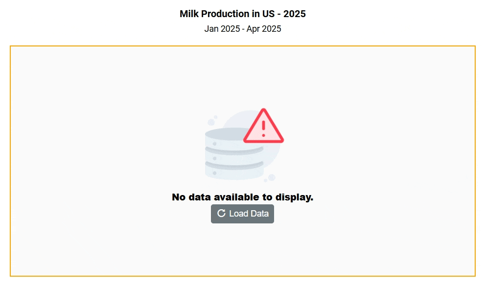

# No Data Template in Blazor Charts Component

When there is no data available to render in the chart, the `NoDataTemplate` property allows you to display a custom layout within the chart area. This layout can include a message indicating the absence of data, a relevant image, or a button to initiate data loading. You can incorporate styled text, images, or interactive elements to maintain design consistency and enhance user guidance.

Once data becomes available, the chart automatically updates to display the appropriate visualization.

```cshtml

@using Syncfusion.Blazor.Charts
@using Syncfusion.Blazor.Buttons

<SfChart @ref="chart" Width="80%" Title="Milk Production in US - 2025" SubTitle="Jan 2025 - Apr 2025">
    <NoDataTemplate>
    <div class="noDataTemplateContainerStyle" style="border: 2px solid orange; display: row-flex; align-items: center; justify-content: center; align-content: center; white-space: normal; text-align: center; width: inherit; height: inherit; font-weight: bolder; font-size: medium;">
        <div></div>
        <div style="font-size:15px;"><strong>No data available to display.</strong></div>
        <SfButton IconCss="e-icons e-refresh" OnClick="LoadData">Load Data</SfButton>
    </div>
</NoDataTemplate>
    <ChildContent>
        <ChartPrimaryXAxis ValueType="Syncfusion.Blazor.Charts.ValueType.Category" />
        <ChartSeriesCollection>
            <ChartSeries DataSource="@SalesReports" XName="Month" YName="Value" Type="ChartSeriesType.Column">
                <ChartMarker>
                    <ChartDataLabel Visible="true" Name="Text"/>
                </ChartMarker>
            </ChartSeries>
        </ChartSeriesCollection>
    </ChildContent>
</SfChart>

<style>
    .noDataTemplateContainerStyle {
        background-color: #fafafa;
        color: #000000;
    }
</style>

@code {
    private SfChart chart;
    public class Data
    {
        public string Month { get; set; }
        public double Value { get; set; }
        public string Text { get; set; }
    }
    public List<Data> SalesReports = new List<Data>();
    private void LoadData()
    {
        SalesReports = new List<Data>
        {
            new Data { Month = "Jan", Value = 3, Text = "January" },
            new Data { Month = "Feb", Value = 3.5, Text = "February" },
            new Data { Month = "Mar", Value = 7, Text = "March" },
            new Data { Month = "Apr", Value = 13.5, Text = "April" }
        };
        if (chart != null)
        chart.RefreshAsync();
    }
}

```



N> Refer to our [Blazor Charts](https://www.syncfusion.com/blazor-components/blazor-charts) feature tour page for its groundbreaking feature representations and also explore our [Blazor Chart Example](https://blazor.syncfusion.com/demos/chart/line?theme=bootstrap5) to know various chart types and how to represent time-dependent data, showing trends at equal intervals.

## See also

* [Data label](./data-labels)
* [Tooltip](./tool-tip)
* [Marker](./data-markers)