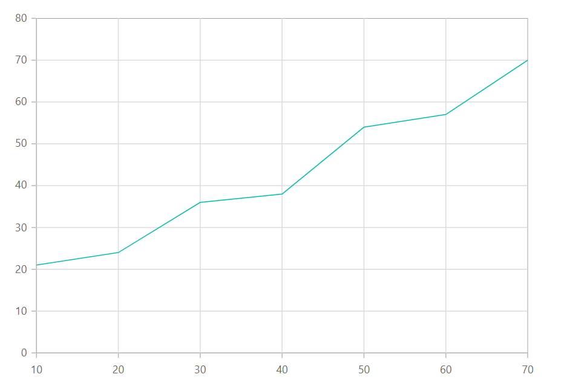
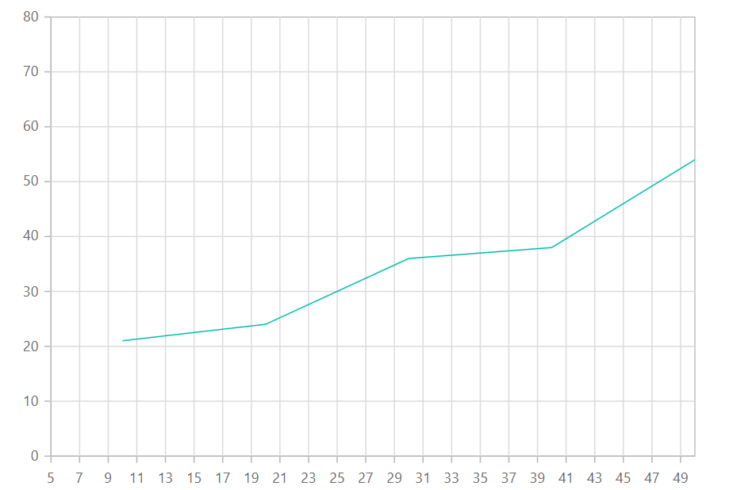

<!-- markdownlint-disable MD036 -->

# Numeric Axis

You can use numeric axis to represent numeric values of data in chart. By default, the [`ValueType`](https://help.syncfusion.com/cr/blazor/Syncfusion.Blazor.Charts.AxisModel.html#Syncfusion_Blazor_Charts_AxisModel_ValueType) of an axis is `Double`.





## Range and Interval

Range for the axis, will be calculated automatically based on the provided data, you can also customize the range
of the axis using [`Minimum`](https://help.syncfusion.com/cr/blazor/Syncfusion.Blazor.Charts.AxisModel.html#Syncfusion_Blazor_Charts_AxisModel_Minimum),
[`Maximum`](https://help.syncfusion.com/cr/blazor/Syncfusion.Blazor.Charts.AxisModel.html#Syncfusion_Blazor_Charts_AxisModel_Maximum) and [`Interval`](https://help.syncfusion.com/cr/blazor/Syncfusion.Blazor~Syncfusion.Blazor.Charts.AxisModel~Interval.html) property of
the axis.





## Range Padding

Padding can be applied to the minimum and maximum extremes of the axis range by using the
[`RangePadding`](https://help.syncfusion.com/cr/blazor/Syncfusion.Blazor.Charts.AxisModel.html#Syncfusion_Blazor_Charts_AxisModel_RangePadding) property. Numeric axis supports following types of padding.

* None
* Round
* Additional
* Normal
* Auto

**Numeric - None**

When the [`RangePadding`](https://help.syncfusion.com/cr/blazor/Syncfusion.Blazor.Charts.AxisModel.html#Syncfusion_Blazor_Charts_AxisModel_RangePadding) is set to **None**, minimum and maximum of an axis is based on the data.





**Numeric - Round**

When the [`RangePadding`](https://help.syncfusion.com/cr/blazor/Syncfusion.Blazor.Charts.AxisModel.html#Syncfusion_Blazor_Charts_AxisModel_RangePadding) is set to **Round**, minimum and maximum will be
rounded to the nearest possible value divisible by interval. For example, when the minimum is 3.5 and the interval
is 1, then the minimum will be rounded to 3.





**Numeric - Additional**

When the [`RangePadding`](https://help.syncfusion.com/cr/blazor/Syncfusion.Blazor.Charts.AxisModel.html#Syncfusion_Blazor_Charts_AxisModel_RangePadding) is set to **Additional**, interval of an axis will
be padded to the minimum and maximum of the axis.





**Numeric - Normal**

When the [`RangePadding`](https://help.syncfusion.com/cr/blazor/Syncfusion.Blazor.Charts.AxisModel.html#Syncfusion_Blazor_Charts_AxisModel_RangePadding) is set to **Normal**, padding is applied to the axis
based on default range calculation.





**Numeric - Auto**

When the [`RangePadding`](https://help.syncfusion.com/cr/blazor/Syncfusion.Blazor.Charts.AxisModel.html#Syncfusion_Blazor_Charts_AxisModel_RangePadding) is set to **Auto**, horizontal numeric axis takes
None as padding calculation, while the vertical numeric axis takes Normal as padding calculation.





## Label Format

**Numeric Label Format**

Numeric labels can be formatted by using the [`LabelFormat`](https://help.syncfusion.com/cr/blazor/Syncfusion.Blazor.Charts.AxisModel.html#Syncfusion_Blazor_Charts_AxisModel_LabelFormat) property.
Numeric labels supports all globalize format.





The following table describes the result of applying some commonly used label formats on numeric values.

<!-- markdownlint-disable MD033 -->

<table>
<tr>
<td><b>Label Value</b></td>
<td><b>Label Format property value</b></td>
<td><b>Result </b></td>
<td><b>Description </b></td>
</tr>
<tr>
<td>1000</td>
<td>n1</td>
<td>1000.0</td>
<td>The Number is rounded to 1 decimal place</td>
</tr>
<tr>
<td>1000</td>
<td>n2</td>
<td>1000.00</td>
<td>The Number is rounded to 2 decimal place</td>
</tr>
<tr>
<td>1000</td>
<td>n3</td>
<td>1000.000</td>
<td>The Number is rounded to 3 decimal place</td>
</tr>
<tr>
<td>0.01</td>
<td>p1</td>
<td>1.0%</td>
<td>The Number is converted to percentage with 1 decimal place</td>
</tr>
<tr>
<td>0.01</td>
<td>p2</td>
<td>1.00%</td>
<td>The Number is converted to percentage with 2 decimal place</td>
</tr>
<tr>
<td>0.01</td>
<td>p3</td>
<td>1.000%</td>
<td>The Number is converted to percentage with 3 decimal place</td>
</tr>
<tr>
<td>1000</td>
<td>c1</td>
<td>$1000.0</td>
<td>The Currency symbol is appended to number and number is rounded to 1 decimal place</td>
</tr>
<tr>
<td>1000</td>
<td>c2</td>
<td>$1000.00</td>
<td>The Currency symbol is appended to number and number is rounded to 2 decimal place</td>
</tr>
</table>

## Custom Label Format

Axis also supports custom label format using placeholder like {value}°C, in which the value represent the axis
label e.g 20°C.





> Note: You can refer to our [`Blazor Charts`](https://www.syncfusion.com/blazor-components/blazor-charts) feature tour page for its groundbreaking feature representations. You can also explore our [`Blazor Chart example`](https://blazor.syncfusion.com/demos/chart/line?theme=bootstrap4) to knows various chart types and how to represent time-dependent data, showing trends in data at equal intervals.

## See Also

* [Data label](./data-labels)
* [Tooltip](./tool-tip)
* [Marker](./data-markers)