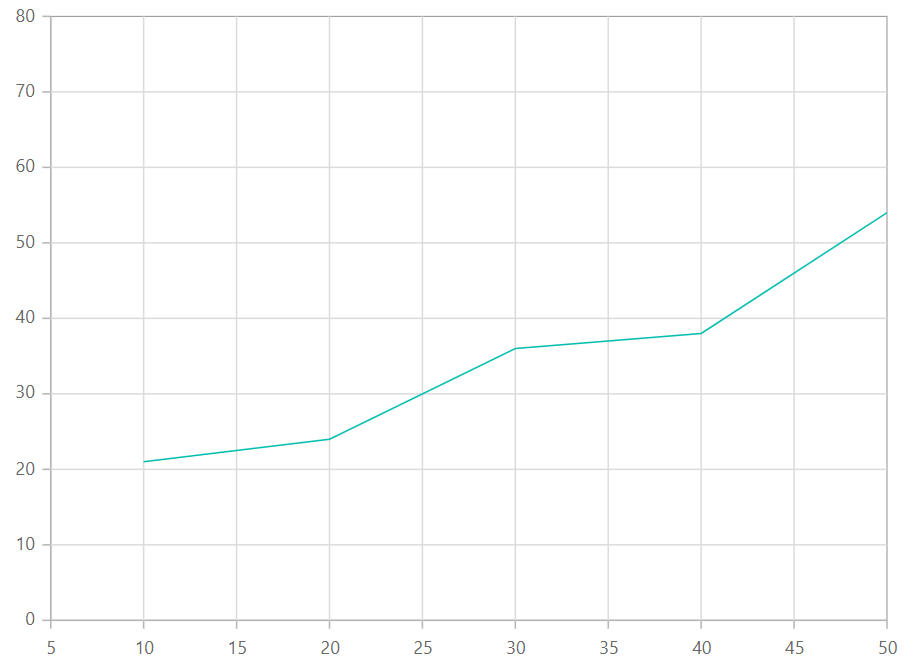
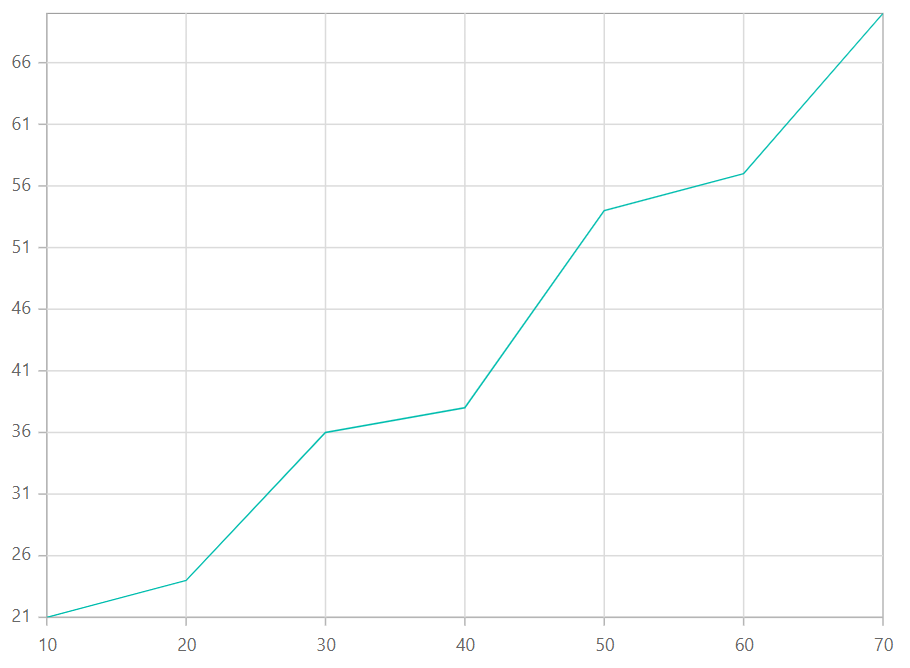
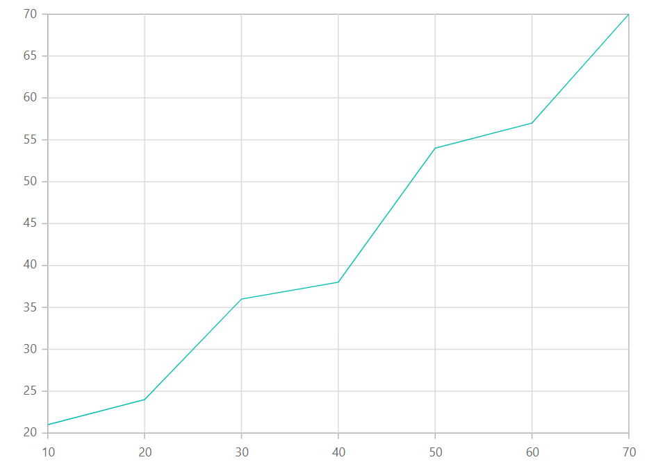
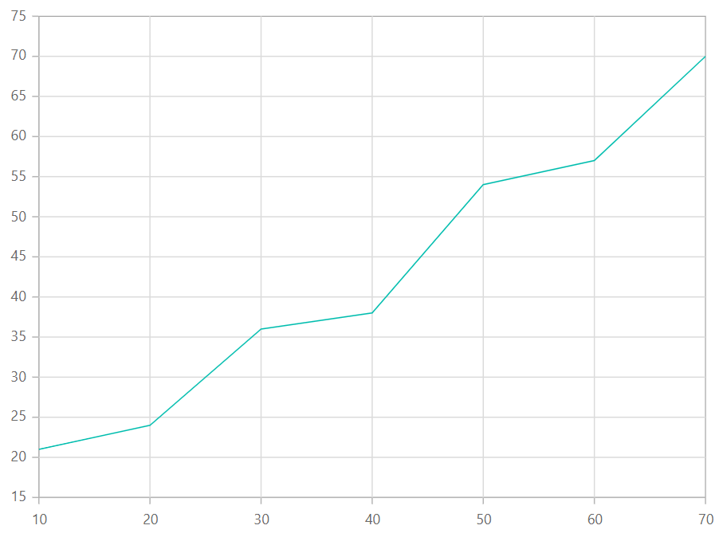
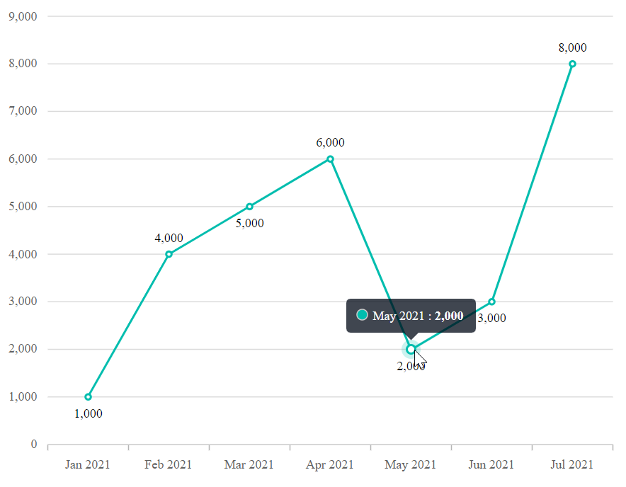

<!-- markdownlint-disable MD036 -->

# Numeric axis in Blazor Charts

The numeric axis is used to plot numeric values along an axis. By default, the axis [ValueType](https://help.syncfusion.com/cr/blazor/Syncfusion.Blazor.Charts.ChartAxis.html#Syncfusion_Blazor_Charts_ChartAxis_ValueType) is [Double](https://help.syncfusion.com/cr/blazor/Syncfusion.Blazor.Charts.ValueType.html#Syncfusion_Blazor_Charts_ValueType_Double).

You can learn how to customize the numeric axis by watching the video below.



```cshtml

@using Syncfusion.Blazor.Charts

<SfChart>
    <ChartSeriesCollection>
        <ChartSeries DataSource="@Data" XName="XValue" YName="YValue" />
    </ChartSeriesCollection>
</SfChart>

@code {
    public class ChartData
    {
        public double XValue { get; set; }
        public double YValue { get; set; }
    }

    public List<ChartData> Data = new()
    {
        new ChartData { XValue = 10, YValue = 21 },
        new ChartData { XValue = 20, YValue = 24 },
        new ChartData { XValue = 30, YValue = 36 },
        new ChartData { XValue = 40, YValue = 38 },
        new ChartData { XValue = 50, YValue = 54 },
        new ChartData { XValue = 60, YValue = 57 },
        new ChartData { XValue = 70, YValue = 70 }
    };
}

```



## Range and interval

The axis range is calculated automatically based on the bound data. You can override it using the [Minimum](https://help.syncfusion.com/cr/blazor/Syncfusion.Blazor.Charts.ChartAxis.html#Syncfusion_Blazor_Charts_ChartAxis_Minimum), [Maximum](https://help.syncfusion.com/cr/blazor/Syncfusion.Blazor.Charts.ChartAxis.html#Syncfusion_Blazor_Charts_ChartAxis_Maximum), and [Interval](https://help.syncfusion.com/cr/blazor/Syncfusion.Blazor.Charts.ChartAxis.html#Syncfusion_Blazor_Charts_ChartAxis_Interval) properties.

```cshtml

@using Syncfusion.Blazor.Charts

<SfChart>
    <ChartPrimaryXAxis Minimum="5" Maximum="50" Interval="2" />

    <ChartSeriesCollection>
        <ChartSeries DataSource="@Data" XName="XValue" YName="YValue" />
    </ChartSeriesCollection>
</SfChart>

@code {
    public class ChartData
    {
        public double XValue { get; set; }
        public double YValue { get; set; }
    }

    public List<ChartData> Data = new()
    {
        new ChartData { XValue = 10, YValue = 21 },
        new ChartData { XValue = 20, YValue = 24 },
        new ChartData { XValue = 30, YValue = 36 },
        new ChartData { XValue = 40, YValue = 38 },
        new ChartData { XValue = 50, YValue = 54 },
        new ChartData { XValue = 60, YValue = 57 },
        new ChartData { XValue = 70, YValue = 70 }
    };
}

```




## Range padding

Use [RangePadding](https://help.syncfusion.com/cr/blazor/Syncfusion.Blazor.Charts.ChartAxis.html#Syncfusion_Blazor_Charts_ChartAxis_RangePadding) to add padding at the minimum and maximum ends of the calculated range. Numeric axis supports:

* None
* Round
* Additional
* Normal
* Auto

### Numeric – None

When [RangePadding](https://help.syncfusion.com/cr/blazor/Syncfusion.Blazor.Charts.ChartAxis.html#Syncfusion_Blazor_Charts_ChartAxis_RangePadding) is **None**, the axis minimum and maximum are derived directly from the data.

```cshtml

@using Syncfusion.Blazor.Charts

<SfChart>
    <ChartPrimaryYAxis RangePadding="ChartRangePadding.None" />

    <ChartSeriesCollection>
        <ChartSeries DataSource="@Data" XName="XValue" YName="YValue" />
    </ChartSeriesCollection>
</SfChart>

@code {
    public class ChartData
    {
        public double XValue { get; set; }
        public double YValue { get; set; }
    }

    public List<ChartData> Data = new()
    {
        new ChartData { XValue = 10, YValue = 21 },
        new ChartData { XValue = 20, YValue = 24 },
        new ChartData { XValue = 30, YValue = 36 },
        new ChartData { XValue = 40, YValue = 38 },
        new ChartData { XValue = 50, YValue = 54 },
        new ChartData { XValue = 60, YValue = 57 },
        new ChartData { XValue = 70, YValue = 70 }
    };
}

```




### Numeric – Round

When [RangePadding](https://help.syncfusion.com/cr/blazor/Syncfusion.Blazor.Charts.ChartAxis.html#Syncfusion_Blazor_Charts_ChartAxis_RangePadding) is **Round**, the minimum and maximum are rounded to the nearest values divisible by the interval. For example, if minimum is 3.5 and interval is 1, it is rounded down to 3.

```cshtml

@using Syncfusion.Blazor.Charts

<SfChart>
    <ChartPrimaryYAxis RangePadding="ChartRangePadding.Round" />

    <ChartSeriesCollection>
        <ChartSeries DataSource="@Data" XName="XValue" YName="YValue" />
    </ChartSeriesCollection>
</SfChart>

@code {
    public class ChartData
    {
        public double XValue { get; set; }
        public double YValue { get; set; }
    }

    public List<ChartData> Data = new()
    {
        new ChartData { XValue = 10, YValue = 21 },
        new ChartData { XValue = 20, YValue = 24 },
        new ChartData { XValue = 30, YValue = 36 },
        new ChartData { XValue = 40, YValue = 38 },
        new ChartData { XValue = 50, YValue = 54 },
        new ChartData { XValue = 60, YValue = 57 },
        new ChartData { XValue = 70, YValue = 70 }
    };
}

```




### Numeric – Additional

When [RangePadding](https://help.syncfusion.com/cr/blazor/Syncfusion.Blazor.Charts.ChartAxis.html#Syncfusion_Blazor_Charts_ChartAxis_RangePadding) is **Additional**, one interval of padding is applied beyond the calculated minimum and maximum.

```cshtml

@using Syncfusion.Blazor.Charts

<SfChart>
    <ChartPrimaryYAxis RangePadding="ChartRangePadding.Additional" />

    <ChartSeriesCollection>
        <ChartSeries DataSource="@Data" XName="XValue" YName="YValue" />
    </ChartSeriesCollection>
</SfChart>

@code {
    public class ChartData
    {
        public double XValue { get; set; }
        public double YValue { get; set; }
    }

    public List<ChartData> Data = new()
    {
        new ChartData { XValue = 10, YValue = 21 },
        new ChartData { XValue = 20, YValue = 24 },
        new ChartData { XValue = 30, YValue = 36 },
        new ChartData { XValue = 40, YValue = 38 },
        new ChartData { XValue = 50, YValue = 54 },
        new ChartData { XValue = 60, YValue = 57 },
        new ChartData { XValue = 70, YValue = 70 }
    };
}

```




### Numeric – Normal

When [RangePadding](https://help.syncfusion.com/cr/blazor/Syncfusion.Blazor.Charts.ChartAxis.html#Syncfusion_Blazor_Charts_ChartAxis_RangePadding) is **Normal**, default padding is applied based on the automatic range calculation.

```cshtml

@using Syncfusion.Blazor.Charts

<SfChart>
    <ChartPrimaryYAxis RangePadding="ChartRangePadding.Normal" />

    <ChartSeriesCollection>
        <ChartSeries DataSource="@Data" XName="XValue" YName="YValue" />
    </ChartSeriesCollection>
</SfChart>

@code {
    public class ChartData
    {
        public double XValue { get; set; }
        public double YValue { get; set; }
    }

    public List<ChartData> Data = new()
    {
        new ChartData { XValue = 10, YValue = 21 },
        new ChartData { XValue = 20, YValue = 24 },
        new ChartData { XValue = 30, YValue = 36 },
        new ChartData { XValue = 40, YValue = 38 },
        new ChartData { XValue = 50, YValue = 54 },
        new ChartData { XValue = 60, YValue = 57 },
        new ChartData { XValue = 70, YValue = 70 }
    };
}

```



### Numeric – Auto

When [RangePadding](https://help.syncfusion.com/cr/blazor/Syncfusion.Blazor.Charts.ChartAxis.html#Syncfusion_Blazor_Charts_ChartAxis_RangePadding) is **Auto**, the horizontal numeric axis uses **None** and the vertical numeric axis uses **Normal**.

```cshtml

@using Syncfusion.Blazor.Charts

<SfChart>
    <ChartPrimaryYAxis RangePadding="ChartRangePadding.Auto" />
    <ChartPrimaryXAxis RangePadding="ChartRangePadding.Auto" />

    <ChartSeriesCollection>
        <ChartSeries DataSource="@Data" XName="XValue" YName="YValue" />
    </ChartSeriesCollection>
</SfChart>

@code {
    public class ChartData
    {
        public double XValue { get; set; }
        public double YValue { get; set; }
    }

    public List<ChartData> Data = new()
    {
        new ChartData { XValue = 10, YValue = 21 },
        new ChartData { XValue = 20, YValue = 24 },
        new ChartData { XValue = 30, YValue = 36 },
        new ChartData { XValue = 40, YValue = 38 },
        new ChartData { XValue = 50, YValue = 54 },
        new ChartData { XValue = 60, YValue = 57 },
        new ChartData { XValue = 70, YValue = 70 }
    };
}

```



## Label format

Use the [LabelFormat](https://help.syncfusion.com/cr/blazor/Syncfusion.Blazor.Charts.ChartAxis.html#Syncfusion_Blazor_Charts_ChartAxis_LabelFormat) property to format numeric labels using standard .NET numeric and globalization formats.

```cshtml

@using Syncfusion.Blazor.Charts

<SfChart Title="Sales Comparison">
    <ChartPrimaryYAxis LabelFormat="c" />

    <ChartSeriesCollection>
        <ChartSeries DataSource="@Data" XName="X" YName="Y" Type="ChartSeriesType.Column" />
    </ChartSeriesCollection>
</SfChart>

@code {
    public class ChartData
    {
        public double X { get; set; }
        public double Y { get; set; }
    }

    public List<ChartData> Data = new()
    {
        new ChartData { X = 10, Y = 7000 },
        new ChartData { X = 20, Y = 1000 },
        new ChartData { X = 30, Y = 12000 },
        new ChartData { X = 40, Y = 14000 },
        new ChartData { X = 50, Y = 11000 },
        new ChartData { X = 60, Y = 5000 },
        new ChartData { X = 70, Y = 7300 },
        new ChartData { X = 80, Y = 9000 },
        new ChartData { X = 90, Y = 12000 },
        new ChartData { X = 100, Y = 14000 },
        new ChartData { X = 110, Y = 11000 },
        new ChartData { X = 120, Y = 5000 }
    };
}

```



The table below shows results of common label formats applied to numeric data.

<!-- markdownlint-disable MD033 -->

<table>
<tr>
<td><b>Label value</b></td>
<td><b>LabelFormat value</b></td>
<td><b>Result</b></td>
<td><b>Description</b></td>
</tr>
<tr>
<td>1000</td>
<td>n1</td>
<td>1000.0</td>
<td>Number rounded to 1 decimal place.</td>
</tr>
<tr>
<td>1000</td>
<td>n2</td>
<td>1000.00</td>
<td>Number rounded to 2 decimal places.</td>
</tr>
<tr>
<td>1000</td>
<td>n3</td>
<td>1000.000</td>
<td>Number rounded to 3 decimal places.</td>
</tr>
<tr>
<td>0.01</td>
<td>p1</td>
<td>1.0%</td>
<td>Percentage with 1 decimal place.</td>
</tr>
<tr>
<td>0.01</td>
<td>p2</td>
<td>1.00%</td>
<td>Percentage with 2 decimal places.</td>
</tr>
<tr>
<td>0.01</td>
<td>p3</td>
<td>1.000%</td>
<td>Percentage with 3 decimal places.</td>
</tr>
<tr>
<td>1000</td>
<td>c1</td>
<td>$1000.0</td>
<td>Currency symbol and 1 decimal place.</td>
</tr>
<tr>
<td>1000</td>
<td>c2</td>
<td>$1000.00</td>
<td>Currency symbol and 2 decimal places.</td>
</tr>
</table>

## Grouping separator

To display thousands separators for numeric values across axis labels, data labels, and tooltips, set [UseGroupingSeparator](https://help.syncfusion.com/cr/blazor/Syncfusion.Blazor.Charts.SfChart.html#Syncfusion_Blazor_Charts_SfChart_UseGroupingSeparator) to true on the chart.

```cshtml

@using Syncfusion.Blazor.Charts

<SfChart UseGroupingSeparator="true">
    <ChartArea>
        <ChartAreaBorder Width="0" />
    </ChartArea>
    <ChartPrimaryXAxis ValueType="Syncfusion.Blazor.Charts.ValueType.DateTimeCategory"
                       LabelFormat="MMM yyyy"
                       IntervalType="Syncfusion.Blazor.Charts.IntervalType.Months"
                       EdgeLabelPlacement="EdgeLabelPlacement.Shift">
        <ChartAxisMajorGridLines Width="0" />
    </ChartPrimaryXAxis>
    <ChartPrimaryYAxis>
        <ChartAxisLineStyle Width="0" />
        <ChartAxisMajorTickLines Width="0" />
    </ChartPrimaryYAxis>
    <ChartTooltipSettings Enable="true" />
    <ChartSeriesCollection>
        <ChartSeries DataSource="@Data" Name="Test" XName="PrdDate" Width="2" YName="Amount" Type="Syncfusion.Blazor.Charts.ChartSeriesType.Line">
            <ChartMarker Visible="true">
                <ChartDataLabel Visible="true" />
            </ChartMarker>
        </ChartSeries>
    </ChartSeriesCollection>
</SfChart>

@code {
    public class ChartData
    {
        public DateTime PrdDate { get; set; }
        public double Amount { get; set; }
    }

    public List<ChartData> Data = new()
    {
        new ChartData { PrdDate = new DateTime(2021, 01, 01), Amount = 1000 },
        new ChartData { PrdDate = new DateTime(2021, 02, 01), Amount = 4000 },
        new ChartData { PrdDate = new DateTime(2021, 03, 01), Amount = 5000 },
        new ChartData { PrdDate = new DateTime(2021, 04, 01), Amount = 6000 },
        new ChartData { PrdDate = new DateTime(2021, 05, 01), Amount = 2000 },
        new ChartData { PrdDate = new DateTime(2021, 06, 01), Amount = 3000 },
        new ChartData { PrdDate = new DateTime(2021, 07, 01), Amount = 8000 }
    };
}

```





## Custom label format

You can also define custom label formats using placeholders. For example, set `LabelFormat="${value}K"` to display values like 20K.

```cshtml

@using Syncfusion.Blazor.Charts

<SfChart>
    <ChartPrimaryYAxis LabelFormat="${value}K" RangePadding="ChartRangePadding.Auto" />
    <ChartPrimaryXAxis RangePadding="ChartRangePadding.Auto" />

    <ChartSeriesCollection>
        <ChartSeries DataSource="@Data" XName="XValue" YName="YValue" />
    </ChartSeriesCollection>
</SfChart>

@code {
    public class ChartData
    {
        public double XValue { get; set; }
        public double YValue { get; set; }
    }

    public List<ChartData> Data = new()
    {
        new ChartData { XValue = 10, YValue = 21 },
        new ChartData { XValue = 20, YValue = 24 },
        new ChartData { XValue = 30, YValue = 36 },
        new ChartData { XValue = 40, YValue = 38 },
        new ChartData { XValue = 50, YValue = 54 },
        new ChartData { XValue = 60, YValue = 57 },
        new ChartData { XValue = 70, YValue = 70 }
    };
}

```



N> Refer to the [Blazor Charts](https://www.syncfusion.com/blazor-components/blazor-charts) feature tour page for key features. Also explore the [Blazor Chart demo](https://blazor.syncfusion.com/demos/chart/line?theme=bootstrap5) to learn about chart types and displaying time-dependent data.

## See also

* [Data label](./data-labels)
* [Tooltip](./tool-tip)
* [Marker](./data-markers)
