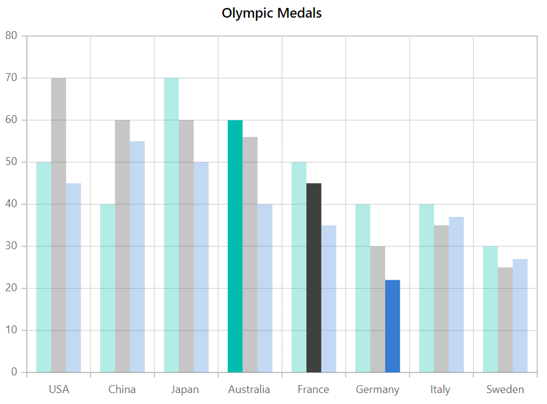
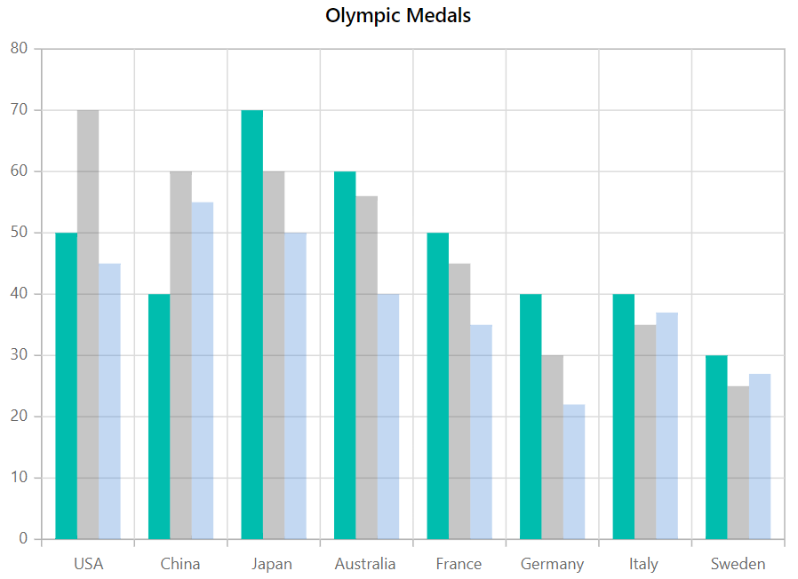
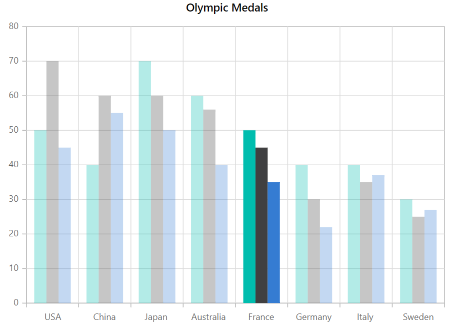

<!-- markdownlint-disable MD036 -->

# Selection in Blazor Charts Component

Chart provides selection support for the series and its data points on mouse click.

>When Mouse is clicked on the data points, the corresponding series legend will also be selected.

Chart provides different type of selection mode for selecting the data. They are,

* None
* Point
* Series
* Cluster
* DragXY
* DragX
* DragY

## Point

 You can select a point, by setting [`SelectionMode`](https://help.syncfusion.com/cr/blazor/Syncfusion.Blazor.Charts.SfChart.html#Syncfusion_Blazor_Charts_SfChart_SelectionMode) to **Point**.

```csharp

@using Syncfusion.Blazor.Charts

<SfChart Title="Olympic Medals" SelectionMode="SelectionMode.Point">
    <ChartPrimaryXAxis ValueType="Syncfusion.Blazor.Charts.ValueType.Category">
    </ChartPrimaryXAxis>

    <ChartSeriesCollection>
        <ChartSeries DataSource="@MedalDetails" XName="Country" YName="Gold" Type="ChartSeriesType.Column">
        </ChartSeries>
        <ChartSeries DataSource="@MedalDetails" XName="Country" YName="Silver" Type="ChartSeriesType.Column">
        </ChartSeries>
        <ChartSeries DataSource="@MedalDetails" XName="Country" YName="Bronze" Type="ChartSeriesType.Column">
        </ChartSeries>
    </ChartSeriesCollection>
</SfChart>

@code{
    public class ChartData
    {
        public string Country { get; set; }
        public double Gold { get; set; }
        public double Silver { get; set; }
        public double Bronze { get; set; }
    }

    public List<ChartData> MedalDetails = new List<ChartData>
{
         new ChartData{ Country= "USA", Gold=50, Silver=70, Bronze=45 },
         new ChartData{ Country="China", Gold=40, Silver= 60, Bronze=55 },
         new ChartData{ Country= "Japan", Gold=70, Silver= 60, Bronze=50 },
         new ChartData{ Country= "Australia", Gold=60, Silver= 56, Bronze=40 },
         new ChartData{ Country= "France", Gold=50, Silver= 45, Bronze=35 },
         new ChartData{ Country= "Germany", Gold=40, Silver=30, Bronze=22 },
         new ChartData{ Country= "Italy", Gold=40, Silver=35, Bronze=37 },
         new ChartData{ Country= "Sweden", Gold=30, Silver=25, Bronze=27 }
    };
}

```



## Series

 You can select a series, by setting [`SelectionMode`](https://help.syncfusion.com/cr/blazor/Syncfusion.Blazor.Charts.SfChart.html#Syncfusion_Blazor_Charts_SfChart_SelectionMode) to **Series**.

```csharp

@using Syncfusion.Blazor.Charts

<SfChart Title="Olympic Medals" SelectionMode="SelectionMode.Series">
    <ChartPrimaryXAxis ValueType="Syncfusion.Blazor.Charts.ValueType.Category">
    </ChartPrimaryXAxis>

    <ChartSeriesCollection>
        <ChartSeries DataSource="@MedalDetails" XName="Country" YName="Gold" Type="ChartSeriesType.Column">
        </ChartSeries>
        <ChartSeries DataSource="@MedalDetails" XName="Country" YName="Silver" Type="ChartSeriesType.Column">
        </ChartSeries>
        <ChartSeries DataSource="@MedalDetails" XName="Country" YName="Bronze" Type="ChartSeriesType.Column">
        </ChartSeries>
    </ChartSeriesCollection>
</SfChart>

@code{
    public class ChartData
    {
        public string Country { get; set; }
        public double Gold { get; set; }
        public double Silver { get; set; }
        public double Bronze { get; set; }
    }

    public List<ChartData> MedalDetails = new List<ChartData>
{
         new ChartData{ Country= "USA", Gold=50, Silver=70, Bronze=45 },
         new ChartData{ Country="China", Gold=40, Silver= 60, Bronze=55 },
         new ChartData{ Country= "Japan", Gold=70, Silver= 60, Bronze=50 },
         new ChartData{ Country= "Australia", Gold=60, Silver= 56, Bronze=40 },
         new ChartData{ Country= "France", Gold=50, Silver= 45, Bronze=35 },
         new ChartData{ Country= "Germany", Gold=40, Silver=30, Bronze=22 },
         new ChartData{ Country= "Italy", Gold=40, Silver=35, Bronze=37 },
         new ChartData{ Country= "Sweden", Gold=30, Silver=25, Bronze=27 }
    };
}

```



## Cluster

You can select the points that corresponds to the same index in all the series, by setting [`SelectionMode`](https://help.syncfusion.com/cr/blazor/Syncfusion.Blazor.Charts.SfChart.html#Syncfusion_Blazor_Charts_SfChart_SelectionMode) to **Cluster**.

```csharp

@using Syncfusion.Blazor.Charts

<SfChart Title="Olympic Medals" SelectionMode="SelectionMode.Cluster">
    <ChartPrimaryXAxis ValueType="Syncfusion.Blazor.Charts.ValueType.Category">
    </ChartPrimaryXAxis>

    <ChartSeriesCollection>
        <ChartSeries DataSource="@MedalDetails" XName="Country" YName="Gold" Type="ChartSeriesType.Column">
        </ChartSeries>
        <ChartSeries DataSource="@MedalDetails" XName="Country" YName="Silver" Type="ChartSeriesType.Column">
        </ChartSeries>
        <ChartSeries DataSource="@MedalDetails" XName="Country" YName="Bronze" Type="ChartSeriesType.Column">
        </ChartSeries>
    </ChartSeriesCollection>
</SfChart>

@code{
    public class ChartData
    {
        public string Country { get; set; }
        public double Gold { get; set; }
        public double Silver { get; set; }
        public double Bronze { get; set; }
    }

    public List<ChartData> MedalDetails = new List<ChartData>
{
         new ChartData{ Country= "USA", Gold=50, Silver=70, Bronze=45 },
         new ChartData{ Country="China", Gold=40, Silver= 60, Bronze=55 },
         new ChartData{ Country= "Japan", Gold=70, Silver= 60, Bronze=50 },
         new ChartData{ Country= "Australia", Gold=60, Silver= 56, Bronze=40 },
         new ChartData{ Country= "France", Gold=50, Silver= 45, Bronze=35 },
         new ChartData{ Country= "Germany", Gold=40, Silver=30, Bronze=22 },
         new ChartData{ Country= "Italy", Gold=40, Silver=35, Bronze=37 },
         new ChartData{ Country= "Sweden", Gold=30, Silver=25, Bronze=27 }
    };
}

```



## Rectangular selection

**DragXY, DragX and DragY**

To fetch the collection of data under a particular region, you have to set [`SelectionMode`](https://help.syncfusion.com/cr/blazor/Syncfusion.Blazor.Charts.SfChart.html#Syncfusion_Blazor_Charts_SfChart_SelectionMode) as **DragXY**.

* DragXY - Allows us to select data with respect to horizontal and vertical axis.
* DragX - Allows us to select data with respect to horizontal axis.
* DragY - Allows us to select data with respect to vertical axis.

The selected data will be returned as an array collection in the `DragComplete` event.

```csharp

@using Syncfusion.Blazor.Charts

<SfChart Title="Olympic Medals" SelectionMode="SelectionMode.DragXY">
    <ChartPrimaryXAxis ValueType="Syncfusion.Blazor.Charts.ValueType.Category">
    </ChartPrimaryXAxis>

    <ChartSeriesCollection>
        <ChartSeries DataSource="@MedalDetails" XName="XValue" Opacity="1" YName="YValue" Type="ChartSeriesType.Scatter">
        </ChartSeries>
    </ChartSeriesCollection>
</SfChart>

@code{
    public class ChartData
    {
        public double XValue { get; set; }
        public double YValue { get; set; }
    };

    public List<ChartData> MedalDetails = new List<ChartData>
{
        new ChartData { XValue = 1971, YValue = 50 },
        new ChartData { XValue = 1972, YValue = 20 },
        new ChartData { XValue = 1973, YValue = 63 },
        new ChartData { XValue = 1974, YValue = 81 },
        new ChartData { XValue = 1975, YValue = 64 },
        new ChartData { XValue = 1976, YValue = 36 },
        new ChartData { XValue = 1977, YValue = 22 },
        new ChartData { XValue = 1978, YValue = 78 },
        new ChartData { XValue = 1979, YValue = 60 },
        new ChartData { XValue = 1980, YValue = 41 },
        new ChartData { XValue = 1981, YValue = 62 },
        new ChartData { XValue = 1982, YValue = 56 },
        new ChartData { XValue = 1983, YValue = 96 },
        new ChartData { XValue = 1984, YValue = 48 },
        new ChartData { XValue = 1985, YValue = 23 },
        new ChartData { XValue = 1986, YValue = 54 },
        new ChartData { XValue = 1987, YValue = 73 },
        new ChartData { XValue = 1988, YValue = 56 },
        new ChartData { XValue = 1989, YValue = 67 },
        new ChartData { XValue = 1990, YValue = 79 },
        new ChartData { XValue = 1991, YValue = 18 },
        new ChartData { XValue = 1992, YValue = 78 },
        new ChartData { XValue = 1993, YValue = 92 },
        new ChartData { XValue = 1994, YValue = 43 },
        new ChartData { XValue = 1995, YValue = 29 },
        new ChartData { XValue = 1996, YValue = 14 },
        new ChartData { XValue = 1997, YValue = 85 },
        new ChartData { XValue = 1998, YValue = 24 },
        new ChartData { XValue = 1999, YValue = 61 },
        new ChartData { XValue = 2000, YValue = 80 },
        new ChartData { XValue = 2001, YValue = 14 },
        new ChartData { XValue = 2002, YValue = 34 },
        new ChartData { XValue = 2003, YValue = 81 },
        new ChartData { XValue = 2004, YValue = 70 },
        new ChartData { XValue = 2005, YValue = 21 },
        new ChartData { XValue = 2006, YValue = 70 },
        new ChartData { XValue = 2007, YValue = 32 },
        new ChartData { XValue = 2008, YValue = 43 },
        new ChartData { XValue = 2009, YValue = 21 },
        new ChartData { XValue = 2010, YValue = 63 },
        new ChartData { XValue = 2011, YValue = 9 },
        new ChartData { XValue = 2012, YValue = 51 },
        new ChartData { XValue = 2013, YValue = 25 },
        new ChartData { XValue = 2014, YValue = 96 },
        new ChartData { XValue = 2015, YValue = 32 }
    };
}

```


## Selection type

You can select multiple points or series, by enabling the [`IsMultiSelect`](https://help.syncfusion.com/cr/blazor/Syncfusion.Blazor.Charts.SfChart.html#Syncfusion_Blazor_Charts_SfChart_IsMultiSelect) property.

```csharp

@using Syncfusion.Blazor.Charts

<SfChart Title="Olympic Medals" SelectionMode="SelectionMode.Series" IsMultiSelect="true">
    <ChartPrimaryXAxis ValueType="Syncfusion.Blazor.Charts.ValueType.Category">
    </ChartPrimaryXAxis>

    <ChartSeriesCollection>
        <ChartSeries DataSource="@MedalDetails" XName="Country" YName="Gold" Type="ChartSeriesType.Column">
        </ChartSeries>
        <ChartSeries DataSource="@MedalDetails" XName="Country" YName="Silver" Type="ChartSeriesType.Column">
        </ChartSeries>
        <ChartSeries DataSource="@MedalDetails" XName="Country" YName="Bronze" Type="ChartSeriesType.Column">
        </ChartSeries>
    </ChartSeriesCollection>
</SfChart>

@code{
    public class ChartData
    {
        public string Country { get; set; }
        public double Gold { get; set; }
        public double Silver { get; set; }
        public double Bronze { get; set; }
    }

    public List<ChartData> MedalDetails = new List<ChartData>
{
         new ChartData{ Country= "USA", Gold=50, Silver=70, Bronze=45 },
         new ChartData{ Country="China", Gold=40, Silver= 60, Bronze=55 },
         new ChartData{ Country= "Japan", Gold=70, Silver= 60, Bronze=50 },
         new ChartData{ Country= "Australia", Gold=60, Silver= 56, Bronze=40 },
         new ChartData{ Country= "France", Gold=50, Silver= 45, Bronze=35 },
         new ChartData{ Country= "Germany", Gold=40, Silver=30, Bronze=22 },
         new ChartData{ Country= "Italy", Gold=40, Silver=35, Bronze=37 },
         new ChartData{ Country= "Sweden", Gold=30, Silver=25, Bronze=27 }
    };
}

```

## Selection on load

You can able to select a point or series programmatically on a chart using
[`SelectedDataIndexes`](https://help.syncfusion.com/cr/blazor/Syncfusion.Blazor.Charts.ChartSelectedDataIndexes.html)
property.

```csharp

@using Syncfusion.Blazor.Charts

<SfChart Title="Olympic Medals" SelectionMode="SelectionMode.Point" IsMultiSelect="true">
    <ChartPrimaryXAxis ValueType="Syncfusion.Blazor.Charts.ValueType.Category">
    </ChartPrimaryXAxis>

    <ChartSelectedDataIndexes>
        <ChartSelectedDataIndex Series="0" Point="1">
        </ChartSelectedDataIndex>
        <ChartSelectedDataIndex Series="1" Point="3">
        </ChartSelectedDataIndex>
    </ChartSelectedDataIndexes>

    <ChartSeriesCollection>
        <ChartSeries DataSource="@MedalDetails" XName="Country" YName="Gold" Type="ChartSeriesType.Column">
        </ChartSeries>
        <ChartSeries DataSource="@MedalDetails" XName="Country" YName="Silver" Type="ChartSeriesType.Column">
        </ChartSeries>
        <ChartSeries DataSource="@MedalDetails" XName="Country" YName="Bronze" Type="ChartSeriesType.Column">
        </ChartSeries>
    </ChartSeriesCollection>
</SfChart>

@code{
    public class ChartData
    {
        public string Country { get; set; }
        public double Gold { get; set; }
        public double Silver { get; set; }
        public double Bronze { get; set; }
    }

    public List<ChartData> MedalDetails = new List<ChartData>
{
         new ChartData{ Country= "USA", Gold=50, Silver=70, Bronze=45 },
         new ChartData{ Country="China", Gold=40, Silver= 60, Bronze=55 },
         new ChartData{ Country= "Japan", Gold=70, Silver= 60, Bronze=50 },
         new ChartData{ Country= "Australia", Gold=60, Silver= 56, Bronze=40 },
         new ChartData{ Country= "France", Gold=50, Silver= 45, Bronze=35 },
         new ChartData{ Country= "Germany", Gold=40, Silver=30, Bronze=22 },
         new ChartData{ Country= "Italy", Gold=40, Silver=35, Bronze=37 },
         new ChartData{ Country= "Sweden", Gold=30, Silver=25, Bronze=27 }
    };
}

```

## Legend Selection

You can able to select a point or series through on legend using
[`ToggleVisibility`](https://help.syncfusion.com/cr/blazor/Syncfusion.Blazor.Charts.ChartLegendSettings.html#Syncfusion_Blazor_Charts_ChartLegendSettings_ToggleVisibility) property.

```csharp

@using Syncfusion.Blazor.Charts

<SfChart Title="Olympic Medals" SelectionMode="SelectionMode.Point">
    <ChartPrimaryXAxis ValueType="Syncfusion.Blazor.Charts.ValueType.Category">
    </ChartPrimaryXAxis>

    <ChartSeriesCollection>
        <ChartSeries DataSource="@MedalDetails" Name="Gold" XName="Country" YName="Gold" Type="ChartSeriesType.Column">
        </ChartSeries>
        <ChartSeries DataSource="@MedalDetails" Name="silver" XName="Country" YName="Silver" Type="ChartSeriesType.Column">
        </ChartSeries>
        <ChartSeries DataSource="@MedalDetails" Name="bronze" XName="Country" YName="Bronze" Type="ChartSeriesType.Column">
        </ChartSeries>
    </ChartSeriesCollection>

    <ChartLegendSettings Visible="true" ToggleVisibility="false">
    </ChartLegendSettings>
</SfChart>

@code{
    public class ChartData
    {
        public string Country { get; set; }
        public double Gold { get; set; }
        public double Silver { get; set; }
        public double Bronze { get; set; }
    }

    public List<ChartData> MedalDetails = new List<ChartData>
{
         new ChartData{ Country= "USA", Gold=50, Silver=70, Bronze=45 },
         new ChartData{ Country="China", Gold=40, Silver= 60, Bronze=55 },
         new ChartData{ Country= "Japan", Gold=70, Silver= 60, Bronze=50 },
         new ChartData{ Country= "Australia", Gold=60, Silver= 56, Bronze=40 },
         new ChartData{ Country= "France", Gold=50, Silver= 45, Bronze=35 },
         new ChartData{ Country= "Germany", Gold=40, Silver=30, Bronze=22 },
         new ChartData{ Country= "Italy", Gold=40, Silver=35, Bronze=37 },
         new ChartData{ Country= "Sweden", Gold=30, Silver=25, Bronze=27 }
    };
}

```

## Customization for selection

You can apply custom style to selected points or series with [`SelectionStyle`](https://help.syncfusion.com/cr/blazor/Syncfusion.Blazor.Charts.ChartSeries.html#Syncfusion_Blazor_Charts_ChartSeries_SelectionStyle)
property.

```csharp

@using Syncfusion.Blazor.Charts

<SfChart Title="Olympic Medals" SelectionMode="SelectionMode.Point">
    <ChartPrimaryXAxis ValueType="Syncfusion.Blazor.Charts.ValueType.Category">
    </ChartPrimaryXAxis>

    <ChartLegendSettings Visible="true" ToggleVisibility="true">
    </ChartLegendSettings>

    <ChartSeriesCollection>
        <ChartSeries DataSource="@MedalDetails" XName="Country" YName="Gold"
                     Type="ChartSeriesType.Column" SelectionStyle="chartSelection1">
        </ChartSeries>
        <ChartSeries DataSource="@MedalDetails" XName="Country" YName="Silver"
                     Type="ChartSeriesType.Column" SelectionStyle="chartSelection2">
        </ChartSeries>
        <ChartSeries DataSource="@MedalDetails" XName="Country" YName="Bronze"
                     Type="ChartSeriesType.Column" SelectionStyle="chartSelection3">
        </ChartSeries>
    </ChartSeriesCollection>
</SfChart>

<style>
    .chartSelection1 {
        fill: red
    }

    .chartSelection2 {
        fill: green
    }

    .chartSelection3 {
        fill: blue
    }
</style>

@code{
    public class ChartData
    {
        public string Country { get; set; }
        public double Gold { get; set; }
        public double Silver { get; set; }
        public double Bronze { get; set; }
    }

    public List<ChartData> MedalDetails = new List<ChartData>
{
         new ChartData{ Country= "USA", Gold=50, Silver=70, Bronze=45 },
         new ChartData{ Country="China", Gold=40, Silver= 60, Bronze=55 },
         new ChartData{ Country= "Japan", Gold=70, Silver= 60, Bronze=50 },
         new ChartData{ Country= "Australia", Gold=60, Silver= 56, Bronze=40 },
         new ChartData{ Country= "France", Gold=50, Silver= 45, Bronze=35 },
         new ChartData{ Country= "Germany", Gold=40, Silver=30, Bronze=22 },
         new ChartData{ Country= "Italy", Gold=40, Silver=35, Bronze=37 },
         new ChartData{ Country= "Sweden", Gold=30, Silver=25, Bronze=27 }
    };
}

```

> Note: You can refer to our [`Blazor Charts`](https://www.syncfusion.com/blazor-components/blazor-charts) feature tour page for its groundbreaking feature representations. You can also explore our [`Blazor Chart example`](https://blazor.syncfusion.com/demos/chart/line?theme=bootstrap4) to knows various chart types and how to represent time-dependent data, showing trends in data at equal intervals.

## See Also

* [Data label](./data-labels)
* [Tooltip](./tool-tip)
* [Marker](./data-markers)