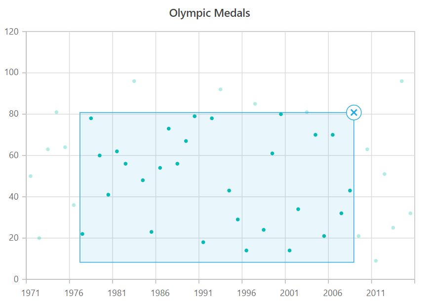

<!-- markdownlint-disable MD036 -->

# Selection in Blazor Charts Component

The chart provides selection support for the series and its data points on mouse or touch action.

N> When clicked on the data points, the corresponding series legend will also be selected.

The chart offers a variety of selection mode for selecting the data. They are,

* None
* Point
* Series
* Cluster
* DragXY
* DragX
* DragY

## Point

When the [SelectionMode](https://help.syncfusion.com/cr/blazor/Syncfusion.Blazor.Charts.SfChart.html#Syncfusion_Blazor_Charts_SfChart_SelectionMode) property is set to **Point**, it allows to select a single point.

```cshtml

@using Syncfusion.Blazor.Charts

<SfChart Title="Olympic Medals" SelectionMode="SelectionMode.Point">
    <ChartPrimaryXAxis ValueType="Syncfusion.Blazor.Charts.ValueType.Category">
    </ChartPrimaryXAxis>

    <ChartSeriesCollection>
        <ChartSeries DataSource="@MedalDetails" XName="Country" YName="Gold" Type="ChartSeriesType.Column">
        </ChartSeries>
        <ChartSeries DataSource="@MedalDetails" XName="Country" YName="Silver" Type="ChartSeriesType.Column">
        </ChartSeries>
        <ChartSeries DataSource="@MedalDetails" XName="Country" YName="Bronze" Type="ChartSeriesType.Column">
        </ChartSeries>
    </ChartSeriesCollection>
</SfChart>

@code{
    public class ChartData
    {
        public string Country { get; set; }
        public double Gold { get; set; }
        public double Silver { get; set; }
        public double Bronze { get; set; }
    }

    public List<ChartData> MedalDetails = new List<ChartData>
	{
        new ChartData{ Country= "USA", Gold=50, Silver=70, Bronze=45 },
        new ChartData{ Country="China", Gold=40, Silver= 60, Bronze=55 },
        new ChartData{ Country= "Japan", Gold=70, Silver= 60, Bronze=50 },
        new ChartData{ Country= "Australia", Gold=60, Silver= 56, Bronze=40 },
        new ChartData{ Country= "France", Gold=50, Silver= 45, Bronze=35 },
        new ChartData{ Country= "Germany", Gold=40, Silver=30, Bronze=22 },
        new ChartData{ Country= "Italy", Gold=40, Silver=35, Bronze=37 },
        new ChartData{ Country= "Sweden", Gold=30, Silver=25, Bronze=27 }
    };
}

```


## Series

When the [SelectionMode](https://help.syncfusion.com/cr/blazor/Syncfusion.Blazor.Charts.SfChart.html#Syncfusion_Blazor_Charts_SfChart_SelectionMode) property is set to **Series**, it allows to select a series.

```cshtml

@using Syncfusion.Blazor.Charts

<SfChart Title="Olympic Medals" SelectionMode="SelectionMode.Series">
    <ChartPrimaryXAxis ValueType="Syncfusion.Blazor.Charts.ValueType.Category">
    </ChartPrimaryXAxis>

    <ChartSeriesCollection>
        <ChartSeries DataSource="@MedalDetails" XName="Country" YName="Gold" Type="ChartSeriesType.Column">
        </ChartSeries>
        <ChartSeries DataSource="@MedalDetails" XName="Country" YName="Silver" Type="ChartSeriesType.Column">
        </ChartSeries>
        <ChartSeries DataSource="@MedalDetails" XName="Country" YName="Bronze" Type="ChartSeriesType.Column">
        </ChartSeries>
    </ChartSeriesCollection>
</SfChart>

@code{
    public class ChartData
    {
        public string Country { get; set; }
        public double Gold { get; set; }
        public double Silver { get; set; }
        public double Bronze { get; set; }
    }

    public List<ChartData> MedalDetails = new List<ChartData>
	{
        new ChartData{ Country= "USA", Gold=50, Silver=70, Bronze=45 },
        new ChartData{ Country="China", Gold=40, Silver= 60, Bronze=55 },
        new ChartData{ Country= "Japan", Gold=70, Silver= 60, Bronze=50 },
        new ChartData{ Country= "Australia", Gold=60, Silver= 56, Bronze=40 },
        new ChartData{ Country= "France", Gold=50, Silver= 45, Bronze=35 },
        new ChartData{ Country= "Germany", Gold=40, Silver=30, Bronze=22 },
        new ChartData{ Country= "Italy", Gold=40, Silver=35, Bronze=37 },
        new ChartData{ Country= "Sweden", Gold=30, Silver=25, Bronze=27 }
    };
}

```


## Cluster

By setting the [SelectionMode](https://help.syncfusion.com/cr/blazor/Syncfusion.Blazor.Charts.SfChart.html#Syncfusion_Blazor_Charts_SfChart_SelectionMode) property to **Cluster**, one can select the points in all series that correspond to the same index.

```cshtml

@using Syncfusion.Blazor.Charts

<SfChart Title="Olympic Medals" SelectionMode="SelectionMode.Cluster">
    <ChartPrimaryXAxis ValueType="Syncfusion.Blazor.Charts.ValueType.Category">
    </ChartPrimaryXAxis>

    <ChartSeriesCollection>
        <ChartSeries DataSource="@MedalDetails" XName="Country" YName="Gold" Type="ChartSeriesType.Column">
        </ChartSeries>
        <ChartSeries DataSource="@MedalDetails" XName="Country" YName="Silver" Type="ChartSeriesType.Column">
        </ChartSeries>
        <ChartSeries DataSource="@MedalDetails" XName="Country" YName="Bronze" Type="ChartSeriesType.Column">
        </ChartSeries>
    </ChartSeriesCollection>
</SfChart>

@code{
    public class ChartData
    {
        public string Country { get; set; }
        public double Gold { get; set; }
        public double Silver { get; set; }
        public double Bronze { get; set; }
    }

    public List<ChartData> MedalDetails = new List<ChartData>
	{
        new ChartData{ Country= "USA", Gold=50, Silver=70, Bronze=45 },
        new ChartData{ Country="China", Gold=40, Silver= 60, Bronze=55 },
        new ChartData{ Country= "Japan", Gold=70, Silver= 60, Bronze=50 },
        new ChartData{ Country= "Australia", Gold=60, Silver= 56, Bronze=40 },
        new ChartData{ Country= "France", Gold=50, Silver= 45, Bronze=35 },
        new ChartData{ Country= "Germany", Gold=40, Silver=30, Bronze=22 },
        new ChartData{ Country= "Italy", Gold=40, Silver=35, Bronze=37 },
        new ChartData{ Country= "Sweden", Gold=30, Silver=25, Bronze=27 }
    };
}

```


## Rectangular selection

**DragXY, DragX and DragY**

Set [SelectionMode](https://help.syncfusion.com/cr/blazor/Syncfusion.Blazor.Charts.SfChart.html#Syncfusion_Blazor_Charts_SfChart_SelectionMode) to **DragXY** to retrieve a group of data under a specific region.

* DragXY - Allows to select data with respect to horizontal and vertical axis.
* DragX - Allows to select data with respect to horizontal axis.
* DragY - Allows to select data with respect to vertical axis.

In the drag complete event, the selected data will be returned as an array collection.

N> To select a rectangular area on a chart using a touch device, quickly double-tap and then drag your finger to define the selection area.

```cshtml

@using Syncfusion.Blazor.Charts

<SfChart Title="Olympic Medals" SelectionMode="SelectionMode.DragXY">
    <ChartPrimaryXAxis ValueType="Syncfusion.Blazor.Charts.ValueType.Category">
    </ChartPrimaryXAxis>

    <ChartSeriesCollection>
        <ChartSeries DataSource="@MedalDetails" XName="XValue" Opacity="1" YName="YValue" Type="ChartSeriesType.Scatter">
        </ChartSeries>
    </ChartSeriesCollection>
</SfChart>

@code{
    public class ChartData
    {
        public double XValue { get; set; }
        public double YValue { get; set; }
    };

    public List<ChartData> MedalDetails = new List<ChartData>
	{
        new ChartData { XValue = 1971, YValue = 50 },
        new ChartData { XValue = 1972, YValue = 20 },
        new ChartData { XValue = 1973, YValue = 63 },
        new ChartData { XValue = 1974, YValue = 81 },
        new ChartData { XValue = 1975, YValue = 64 },
        new ChartData { XValue = 1976, YValue = 36 },
        new ChartData { XValue = 1977, YValue = 22 },
        new ChartData { XValue = 1978, YValue = 78 },
        new ChartData { XValue = 1979, YValue = 60 },
        new ChartData { XValue = 1980, YValue = 41 },
        new ChartData { XValue = 1981, YValue = 62 },
        new ChartData { XValue = 1982, YValue = 56 },
        new ChartData { XValue = 1983, YValue = 96 },
        new ChartData { XValue = 1984, YValue = 48 },
        new ChartData { XValue = 1985, YValue = 23 },
        new ChartData { XValue = 1986, YValue = 54 },
        new ChartData { XValue = 1987, YValue = 73 },
        new ChartData { XValue = 1988, YValue = 56 },
        new ChartData { XValue = 1989, YValue = 67 },
        new ChartData { XValue = 1990, YValue = 79 },
        new ChartData { XValue = 1991, YValue = 18 },
        new ChartData { XValue = 1992, YValue = 78 },
        new ChartData { XValue = 1993, YValue = 92 },
        new ChartData { XValue = 1994, YValue = 43 },
        new ChartData { XValue = 1995, YValue = 29 },
        new ChartData { XValue = 1996, YValue = 14 },
        new ChartData { XValue = 1997, YValue = 85 },
        new ChartData { XValue = 1998, YValue = 24 },
        new ChartData { XValue = 1999, YValue = 61 },
        new ChartData { XValue = 2000, YValue = 80 },
        new ChartData { XValue = 2001, YValue = 14 },
        new ChartData { XValue = 2002, YValue = 34 },
        new ChartData { XValue = 2003, YValue = 81 },
        new ChartData { XValue = 2004, YValue = 70 },
        new ChartData { XValue = 2005, YValue = 21 },
        new ChartData { XValue = 2006, YValue = 70 },
        new ChartData { XValue = 2007, YValue = 32 },
        new ChartData { XValue = 2008, YValue = 43 },
        new ChartData { XValue = 2009, YValue = 21 },
        new ChartData { XValue = 2010, YValue = 63 },
        new ChartData { XValue = 2011, YValue = 9 },
        new ChartData { XValue = 2012, YValue = 51 },
        new ChartData { XValue = 2013, YValue = 25 },
        new ChartData { XValue = 2014, YValue = 96 },
        new ChartData { XValue = 2015, YValue = 32 }
    };
}

```



## Multiple selection

Multiple points or series can be selected by setting the [IsMultiSelect](https://help.syncfusion.com/cr/blazor/Syncfusion.Blazor.Charts.SfChart.html#Syncfusion_Blazor_Charts_SfChart_IsMultiSelect) property to **true**.

```cshtml

@using Syncfusion.Blazor.Charts

<SfChart Title="Olympic Medals" SelectionMode="SelectionMode.Series" IsMultiSelect="true">
    <ChartPrimaryXAxis ValueType="Syncfusion.Blazor.Charts.ValueType.Category">
    </ChartPrimaryXAxis>

    <ChartSeriesCollection>
        <ChartSeries DataSource="@MedalDetails" XName="Country" YName="Gold" Type="ChartSeriesType.Column">
        </ChartSeries>
        <ChartSeries DataSource="@MedalDetails" XName="Country" YName="Silver" Type="ChartSeriesType.Column">
        </ChartSeries>
        <ChartSeries DataSource="@MedalDetails" XName="Country" YName="Bronze" Type="ChartSeriesType.Column">
        </ChartSeries>
    </ChartSeriesCollection>
</SfChart>

@code{
    public class ChartData
    {
        public string Country { get; set; }
        public double Gold { get; set; }
        public double Silver { get; set; }
        public double Bronze { get; set; }
    }

    public List<ChartData> MedalDetails = new List<ChartData>
	{
        new ChartData{ Country= "USA", Gold=50, Silver=70, Bronze=45 },
        new ChartData{ Country="China", Gold=40, Silver= 60, Bronze=55 },
        new ChartData{ Country= "Japan", Gold=70, Silver= 60, Bronze=50 },
        new ChartData{ Country= "Australia", Gold=60, Silver= 56, Bronze=40 },
        new ChartData{ Country= "France", Gold=50, Silver= 45, Bronze=35 },
        new ChartData{ Country= "Germany", Gold=40, Silver=30, Bronze=22 },
        new ChartData{ Country= "Italy", Gold=40, Silver=35, Bronze=37 },
        new ChartData{ Country= "Sweden", Gold=30, Silver=25, Bronze=27 }
    };
}

```


## Selection via code-behind

A point or series can be selected programmatically on a chart using the [SelectedDataIndexes](https://help.syncfusion.com/cr/blazor/Syncfusion.Blazor.Charts.ChartSelectedDataIndexes.html) property.

```cshtml

@using Syncfusion.Blazor.Charts

<SfChart Title="Olympic Medals" SelectionMode="SelectionMode.Point" IsMultiSelect="true">
    <ChartPrimaryXAxis ValueType="Syncfusion.Blazor.Charts.ValueType.Category">
    </ChartPrimaryXAxis>
    <ChartSelectedDataIndexes>
        @foreach (SelectedDataPoint s in Selection)
        {
            <ChartSelectedDataIndex Series="@s.seriesIndex" Point="@s.pointIndex">
            </ChartSelectedDataIndex>
        }
    </ChartSelectedDataIndexes>
    <ChartSeriesCollection>
        <ChartSeries DataSource="@MedalDetails" XName="Country" YName="Gold" Type="ChartSeriesType.Column">
        </ChartSeries>
        <ChartSeries DataSource="@MedalDetails" XName="Country" YName="Silver" Type="ChartSeriesType.Column">
        </ChartSeries>
        <ChartSeries DataSource="@MedalDetails" XName="Country" YName="Bronze" Type="ChartSeriesType.Column">
        </ChartSeries>
    </ChartSeriesCollection>
</SfChart>

@code{
    public List<SelectedDataPoint> Selection = new List<SelectedDataPoint>();
    public class SelectedDataPoint
    {
        public int seriesIndex { get; set; }
        public int pointIndex { get; set; }
    }
    protected override void OnInitialized()
    {
        Selection = new List<SelectedDataPoint>
        {
            new SelectedDataPoint { seriesIndex = 0, pointIndex = 1 },
            new SelectedDataPoint { seriesIndex = 1, pointIndex = 3 }
        };
    }
    public class ChartData
    {
        public string Country { get; set; }
        public double Gold { get; set; }
        public double Silver { get; set; }
        public double Bronze { get; set; }
    }

    public List<ChartData> MedalDetails = new List<ChartData>
	{
        new ChartData{ Country= "USA", Gold=50, Silver=70, Bronze=45 },
        new ChartData{ Country="China", Gold=40, Silver= 60, Bronze=55 },
        new ChartData{ Country= "Japan", Gold=70, Silver= 60, Bronze=50 },
        new ChartData{ Country= "Australia", Gold=60, Silver= 56, Bronze=40 },
        new ChartData{ Country= "France", Gold=50, Silver= 45, Bronze=35 },
        new ChartData{ Country= "Germany", Gold=40, Silver=30, Bronze=22 },
        new ChartData{ Country= "Italy", Gold=40, Silver=35, Bronze=37 },
        new ChartData{ Country= "Sweden", Gold=30, Silver=25, Bronze=27 }
    };
}

```




## Legend Selection

A point or series can be selected through legend using the [ToggleVisibility](https://help.syncfusion.com/cr/blazor/Syncfusion.Blazor.Charts.ChartLegendSettings.html#Syncfusion_Blazor_Charts_ChartLegendSettings_ToggleVisibility) property.

```cshtml

@using Syncfusion.Blazor.Charts

<SfChart Title="Olympic Medals" SelectionMode="SelectionMode.Point">
    <ChartPrimaryXAxis ValueType="Syncfusion.Blazor.Charts.ValueType.Category">
    </ChartPrimaryXAxis>

    <ChartSeriesCollection>
        <ChartSeries DataSource="@MedalDetails" Name="Gold" XName="Country" YName="Gold" Type="ChartSeriesType.Column">
        </ChartSeries>
        <ChartSeries DataSource="@MedalDetails" Name="silver" XName="Country" YName="Silver" Type="ChartSeriesType.Column">
        </ChartSeries>
        <ChartSeries DataSource="@MedalDetails" Name="bronze" XName="Country" YName="Bronze" Type="ChartSeriesType.Column">
        </ChartSeries>
    </ChartSeriesCollection>

    <ChartLegendSettings Visible="true" ToggleVisibility="false">
    </ChartLegendSettings>
</SfChart>

@code{
    public class ChartData
    {
        public string Country { get; set; }
        public double Gold { get; set; }
        public double Silver { get; set; }
        public double Bronze { get; set; }
    }

    public List<ChartData> MedalDetails = new List<ChartData>
	{
        new ChartData{ Country= "USA", Gold=50, Silver=70, Bronze=45 },
        new ChartData{ Country="China", Gold=40, Silver= 60, Bronze=55 },
        new ChartData{ Country= "Japan", Gold=70, Silver= 60, Bronze=50 },
        new ChartData{ Country= "Australia", Gold=60, Silver= 56, Bronze=40 },
        new ChartData{ Country= "France", Gold=50, Silver= 45, Bronze=35 },
        new ChartData{ Country= "Germany", Gold=40, Silver=30, Bronze=22 },
        new ChartData{ Country= "Italy", Gold=40, Silver=35, Bronze=37 },
        new ChartData{ Country= "Sweden", Gold=30, Silver=25, Bronze=27 }
    };
}

```


## Selection customization 

The custom style can be applied to selected points or series using the [SelectionStyle](https://help.syncfusion.com/cr/blazor/Syncfusion.Blazor.Charts.ChartSeries.html#Syncfusion_Blazor_Charts_ChartSeries_SelectionStyle) property.

```cshtml

@using Syncfusion.Blazor.Charts

<SfChart Title="Olympic Medals" SelectionMode="SelectionMode.Point">
    <ChartPrimaryXAxis ValueType="Syncfusion.Blazor.Charts.ValueType.Category">
    </ChartPrimaryXAxis>

    <ChartLegendSettings Visible="true" ToggleVisibility="true">
    </ChartLegendSettings>

    <ChartSeriesCollection>
        <ChartSeries DataSource="@MedalDetails" XName="Country" YName="Gold"
                     Type="ChartSeriesType.Column" SelectionStyle="chartSelection1">
        </ChartSeries>
        <ChartSeries DataSource="@MedalDetails" XName="Country" YName="Silver"
                     Type="ChartSeriesType.Column" SelectionStyle="chartSelection2">
        </ChartSeries>
        <ChartSeries DataSource="@MedalDetails" XName="Country" YName="Bronze"
                     Type="ChartSeriesType.Column" SelectionStyle="chartSelection3">
        </ChartSeries>
    </ChartSeriesCollection>
</SfChart>

<style>
    .chartSelection1 {
        fill: red
    }

    .chartSelection2 {
        fill: green
    }

    .chartSelection3 {
        fill: blue
    }
</style>

@code{
    public class ChartData
    {
        public string Country { get; set; }
        public double Gold { get; set; }
        public double Silver { get; set; }
        public double Bronze { get; set; }
    }

    public List<ChartData> MedalDetails = new List<ChartData>
	{
        new ChartData{ Country= "USA", Gold=50, Silver=70, Bronze=45 },
        new ChartData{ Country="China", Gold=40, Silver= 60, Bronze=55 },
        new ChartData{ Country= "Japan", Gold=70, Silver= 60, Bronze=50 },
        new ChartData{ Country= "Australia", Gold=60, Silver= 56, Bronze=40 },
        new ChartData{ Country= "France", Gold=50, Silver= 45, Bronze=35 },
        new ChartData{ Country= "Germany", Gold=40, Silver=30, Bronze=22 },
        new ChartData{ Country= "Italy", Gold=40, Silver=35, Bronze=37 },
        new ChartData{ Country= "Sweden", Gold=30, Silver=25, Bronze=27 }
    };
}

```


N> Refer to our [Blazor Charts](https://www.syncfusion.com/blazor-components/blazor-charts) feature tour page for its groundbreaking feature representations and also explore our [Blazor Chart Example](https://blazor.syncfusion.com/demos/chart/line?theme=bootstrap5) to know various chart types and how to represent time-dependent data, showing trends at equal intervals.

## See also

* [Data label](./data-labels)
* [Tooltip](./tool-tip)
* [Marker](./data-markers)
