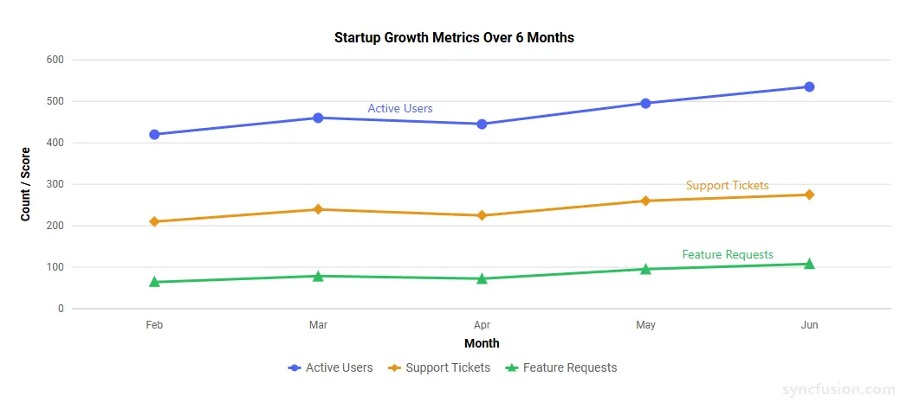
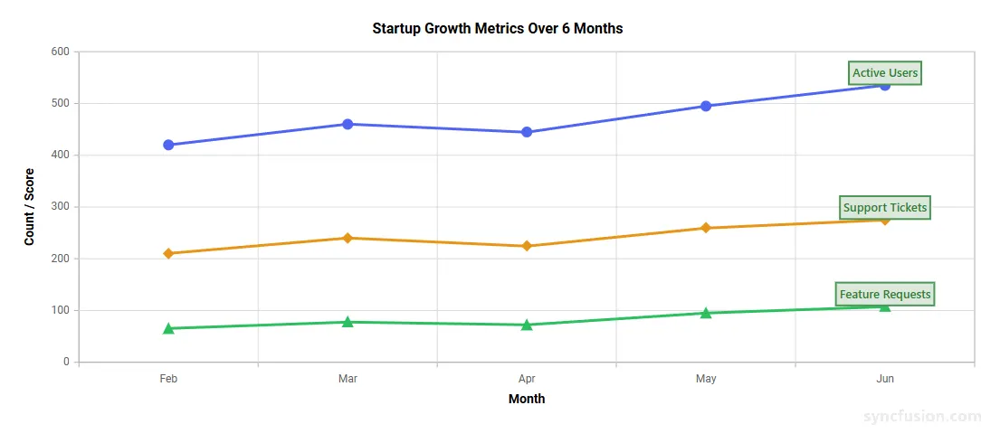

# Series Label in Blazor Charts Component

The Series Label feature displays the name of each series directly within the chart area. This improves readability by helping users identify series inline and reduces the need to rely on the legend.

This feature is especially useful in multi-series visualizations and exported charts where quick in-chart identification is important. It is currently supported for Line, Spline, Area, Column, and Bar series, as well as Polar line and Radar line series. Series labels can be enabled and customized using the `SeriesLabelSettings` property.

## Enable series label

To enable the series label, set the `Visible` property of the `SeriesLabelSettings` configuration to **true** within the series settings.

```cshtml

@using Syncfusion.Blazor.Charts

<SfChart Title="Country Values by Year">
    <ChartPrimaryXAxis ValueType="Syncfusion.Blazor.Charts.ValueType.Category"></ChartPrimaryXAxis>
    <ChartPrimaryYAxis Title="Value"></ChartPrimaryYAxis>
    <ChartLegendSettings Visible="true"></ChartLegendSettings>
    <ChartTooltipSettings Enable="true"></ChartTooltipSettings>
    <ChartSeriesCollection>
        <ChartSeries DataSource="@VietnamData" XName="X" YName="Y"
                     Name="Vietnam" Type="ChartSeriesType.Line" Width="2">
            <ChartMarker Visible="true" Width="7" Height="7"
                         Shape="ChartShape.Rectangle" IsFilled="true">
            </ChartMarker>
            <SeriesLabelSettings Visible="true"> </SeriesLabelSettings>
        </ChartSeries>
        <ChartSeries DataSource="@IndonesiaData" XName="X" YName="Y"
                     Name="Indonesia" Type="ChartSeriesType.Line" Width="2">
            <ChartMarker Visible="true" Width="5" Height="5"
                         Shape="ChartShape.Rectangle" IsFilled="true">
            </ChartMarker>
            <SeriesLabelSettings Visible="true"> </SeriesLabelSettings>
        </ChartSeries>
        <ChartSeries DataSource="@FranceData" XName="X" YName="Y"
                     Name="France" Type="ChartSeriesType.Line" Width="2">
            <ChartMarker Visible="true" Width="5" Height="5"
                         Shape="ChartShape.Rectangle" IsFilled="true">
            </ChartMarker>
            <SeriesLabelSettings Visible="true"> </SeriesLabelSettings>
        </ChartSeries>
        <ChartSeries DataSource="@PolandData" XName="X" YName="Y"
                     Name="Poland" Type="ChartSeriesType.Line" Width="2">
            <ChartMarker Visible="true" Width="5" Height="5"
                         Shape="ChartShape.Rectangle" IsFilled="true">
            </ChartMarker>
            <SeriesLabelSettings Visible="true"> </SeriesLabelSettings>
        </ChartSeries>
        <ChartSeries DataSource="@MexicoData" XName="X" YName="Y"
                     Name="Mexico" Type="ChartSeriesType.Line" Width="2">
            <ChartMarker Visible="true" Width="5" Height="5"
                         Shape="ChartShape.Rectangle" IsFilled="true">
            </ChartMarker>
            <SeriesLabelSettings Visible="true"> </SeriesLabelSettings>
        </ChartSeries>
    </ChartSeriesCollection>
</SfChart>

@code{

   public class ChartData
    {
        public DateTime X { get; set; }
        public double Y { get; set; }
    }
    public List<ChartData> VietnamData = new List<ChartData>
    {
       new ChartData { X = new DateTime(2016, 01, 01), Y = 7.8 },
       new ChartData { X = new DateTime(2017, 01, 01), Y = 10.3 },
       new ChartData { X = new DateTime(2018, 01, 01), Y = 15.5 },
       new ChartData { X = new DateTime(2019, 01, 01), Y = 17.5 },
       new ChartData { X = new DateTime(2020, 01, 01), Y = 19.5 },
       new ChartData { X = new DateTime(2021, 01, 01), Y = 23.0 },
       new ChartData { X = new DateTime(2022, 01, 01), Y = 20.0 },
       new ChartData { X = new DateTime(2023, 01, 01), Y = 19.0 },
       new ChartData { X = new DateTime(2024, 01, 01), Y = 22.1 }
    };
    public List<ChartData> IndonesiaData = new List<ChartData>
    {
       new ChartData { X = new DateTime(2016, 01, 01), Y = 4.8 },
       new ChartData { X = new DateTime(2017, 01, 01), Y = 5.2 },
       new ChartData { X = new DateTime(2018, 01, 01), Y = 6.2 },
       new ChartData { X = new DateTime(2019, 01, 01), Y = 7.8 },
       new ChartData { X = new DateTime(2020, 01, 01), Y = 9.3 },
       new ChartData { X = new DateTime(2021, 01, 01), Y = 14.3 },
       new ChartData { X = new DateTime(2022, 01, 01), Y = 15.6 },
       new ChartData { X = new DateTime(2023, 01, 01), Y = 16.0 },
       new ChartData { X = new DateTime(2024, 01, 01), Y = 17.0 }
    };
    public List<ChartData> FranceData = new List<ChartData>
    {
       new ChartData { X = new DateTime(2016, 01, 01), Y = 14.6 },
       new ChartData { X = new DateTime(2017, 01, 01), Y = 15.5 },
       new ChartData { X = new DateTime(2018, 01, 01), Y = 15.4 },
       new ChartData { X = new DateTime(2019, 01, 01), Y = 14.4 },
       new ChartData { X = new DateTime(2020, 01, 01), Y = 11.6 },
       new ChartData { X = new DateTime(2021, 01, 01), Y = 13.9 },
       new ChartData { X = new DateTime(2022, 01, 01), Y = 12.1 },
       new ChartData { X = new DateTime(2023, 01, 01), Y = 10.0 },
       new ChartData { X = new DateTime(2024, 01, 01), Y = 10.8 }
    };
    public List<ChartData> PolandData = new List<ChartData>
    {
       new ChartData { X = new DateTime(2016, 01, 01), Y = 8.9 },
       new ChartData { X = new DateTime(2017, 01, 01), Y = 10.3 },
       new ChartData { X = new DateTime(2018, 01, 01), Y = 10.8 },
       new ChartData { X = new DateTime(2019, 01, 01), Y = 9.0 },
       new ChartData { X = new DateTime(2020, 01, 01), Y = 7.9 },
       new ChartData { X = new DateTime(2021, 01, 01), Y = 8.5 },
       new ChartData { X = new DateTime(2022, 01, 01), Y = 7.4 },
       new ChartData { X = new DateTime(2023, 01, 01), Y = 6.4 },
       new ChartData { X = new DateTime(2024, 01, 01), Y = 7.1 }
    };
    public List<ChartData> MexicoData = new List<ChartData>
    {
       new ChartData { X = new DateTime(2016, 01, 01), Y = 19.0 },
       new ChartData { X = new DateTime(2017, 01, 01), Y = 20.0 },
       new ChartData { X = new DateTime(2018, 01, 01), Y = 20.2 },
       new ChartData { X = new DateTime(2019, 01, 01), Y = 18.4 },
       new ChartData { X = new DateTime(2020, 01, 01), Y = 16.8 },
       new ChartData { X = new DateTime(2021, 01, 01), Y = 18.5 },
       new ChartData { X = new DateTime(2022, 01, 01), Y = 18.4 },
       new ChartData { X = new DateTime(2023, 01, 01), Y = 16.3 },
       new ChartData { X = new DateTime(2024, 01, 01), Y = 13.7 }
    };
}

```



## Customization

The appearance of the series label can be customized using the following properties.

### SeriesLabelSettings Properties

Configure the main series label appearance:

* `Text`: Sets custom text for the series label. By default, the series name is displayed.
* `Background`: Sets the background color of the series label.
* `Opacity`: Sets the transparency of the series label. The accepted range is from `0` to `1`.
* `ShowOverlapText`: Specifies whether overlapping series labels are allowed.

In the `SeriesLabelBorder`:
* `Color`: Sets the border color of the series label.
* `Width`: Sets the border width of the series label.

In the `SeriesLabelFont`:
* `Size`: Sets the font size of the label text.
* `Color`: Sets the font color of the label text.
* `FontFamily`: Specifies the font family of the label text.
* `FontWeight`: Sets the font weight of the label text.

```cshtml

@using Syncfusion.Blazor.Charts

<SfChart Title="Country Values by Year">
    <ChartPrimaryXAxis ValueType="Syncfusion.Blazor.Charts.ValueType.Category"></ChartPrimaryXAxis>
    <ChartPrimaryYAxis Title="Value"></ChartPrimaryYAxis>
    <ChartLegendSettings Visible="true"></ChartLegendSettings>
    <ChartTooltipSettings Enable="true"></ChartTooltipSettings>
    <ChartSeriesCollection>
        <ChartSeries DataSource="@VietnamData" XName="X" YName="Y"
            Name="Vietnam" Type="ChartSeriesType.Line" Width="2">
            <ChartMarker Visible="true" Width="7" Height="7" Shape="ChartShape.Rectangle"     IsFilled="true">
            </ChartMarker>
            <SeriesLabelSettings Visible="true" Text="Vietnam" Background="#E8F5E9" Opacity="0.9"
                ShowOverlapText="true">
                <SeriesLabelFont Size="12px" FontFamily="Segoe UI" FontWeight="600" Color="#2E7D32" />
                <SeriesLabelBorder Width="2" Color="#2E7D32" />
            </SeriesLabelSettings>
        </ChartSeries>
        <ChartSeries DataSource="@IndonesiaData" XName="X" YName="Y"
            Name="Indonesia" Type="ChartSeriesType.Line" Width="2">
            <ChartMarker Visible="true" Width="5" Height="5" Shape="ChartShape.Rectangle" IsFilled="true">
            </ChartMarker>
            <SeriesLabelSettings Visible="true" Text="Indonesia" Background="#E8F5E9" Opacity="0.9"
                ShowOverlapText="true">
                <SeriesLabelFont Size="12px" FontFamily="Segoe UI" FontWeight="600" Color="#2E7D32" />
                <SeriesLabelBorder Width="2" Color="#2E7D32" />
            </SeriesLabelSettings>
        </ChartSeries>
        <ChartSeries DataSource="@FranceData" XName="X" YName="Y"
            Name="France" Type="ChartSeriesType.Line" Width="2">
            <ChartMarker Visible="true" Width="5" Height="5" Shape="ChartShape.Rectangle" IsFilled="true">
            </ChartMarker>
            <SeriesLabelSettings Visible="true" Text="France" Background="#E8F5E9" Opacity="0.9"  
                ShowOverlapText="true">
                <SeriesLabelFont Size="12px" FontFamily="Segoe UI" FontWeight="600" Color="#2E7D32" />
                <SeriesLabelBorder Width="2" Color="#2E7D32" />
            </SeriesLabelSettings>
        </ChartSeries>
        <ChartSeries DataSource="@PolandData" XName="X" YName="Y"
            Name="Poland" Type="ChartSeriesType.Line" Width="2">
            <ChartMarker Visible="true" Width="5" Height="5" Shape="ChartShape.Rectangle" IsFilled="true">
            </ChartMarker>
            <SeriesLabelSettings Visible="true" Text="Poland" Background="#E8F5E9" Opacity="0.9"
                ShowOverlapText="true">
                <SeriesLabelFont Size="12px" FontFamily="Segoe UI" FontWeight="600" Color="#2E7D32" />
                <SeriesLabelBorder Width="2" Color="#2E7D32" />
            </SeriesLabelSettings>
        </ChartSeries>
        <ChartSeries DataSource="@MexicoData" XName="X" YName="Y"
            Name="Mexico" Type="ChartSeriesType.Line" Width="2">
            <ChartMarker Visible="true" Width="5" Height="5" Shape="ChartShape.Rectangle" IsFilled="true">
            </ChartMarker>
            <SeriesLabelSettings Visible="true" Text="Mexico" Background="#E8F5E9" Opacity="0.9"
                ShowOverlapText="true">
                <SeriesLabelFont Size="12px" FontFamily="Segoe UI" FontWeight="600" Color="#2E7D32" />
                <SeriesLabelBorder Width="2" Color="#2E7D32" />
            </SeriesLabelSettings>
        </ChartSeries>
    </ChartSeriesCollection>
</SfChart>


@code {

    public class ChartData
    {
        public DateTime X { get; set; }
        public double Y { get; set; }
    }
    public List<ChartData> VietnamData = new List<ChartData>
    {
       new ChartData { X = new DateTime(2016, 01, 01), Y = 7.8 },
       new ChartData { X = new DateTime(2017, 01, 01), Y = 10.3 },
       new ChartData { X = new DateTime(2018, 01, 01), Y = 15.5 },
       new ChartData { X = new DateTime(2019, 01, 01), Y = 17.5 },
       new ChartData { X = new DateTime(2020, 01, 01), Y = 19.5 },
       new ChartData { X = new DateTime(2021, 01, 01), Y = 23.0 },
       new ChartData { X = new DateTime(2022, 01, 01), Y = 20.0 },
       new ChartData { X = new DateTime(2023, 01, 01), Y = 19.0 },
       new ChartData { X = new DateTime(2024, 01, 01), Y = 22.1 }
    };
    public List<ChartData> IndonesiaData = new List<ChartData>
    {
       new ChartData { X = new DateTime(2016, 01, 01), Y = 4.8 },
       new ChartData { X = new DateTime(2017, 01, 01), Y = 5.2 },
       new ChartData { X = new DateTime(2018, 01, 01), Y = 6.2 },
       new ChartData { X = new DateTime(2019, 01, 01), Y = 7.8 },
       new ChartData { X = new DateTime(2020, 01, 01), Y = 9.3 },
       new ChartData { X = new DateTime(2021, 01, 01), Y = 14.3 },
       new ChartData { X = new DateTime(2022, 01, 01), Y = 15.6 },
       new ChartData { X = new DateTime(2023, 01, 01), Y = 16.0 },
       new ChartData { X = new DateTime(2024, 01, 01), Y = 17.0 }
    };
    public List<ChartData> FranceData = new List<ChartData>
    {
       new ChartData { X = new DateTime(2016, 01, 01), Y = 14.6 },
       new ChartData { X = new DateTime(2017, 01, 01), Y = 15.5 },
       new ChartData { X = new DateTime(2018, 01, 01), Y = 15.4 },
       new ChartData { X = new DateTime(2019, 01, 01), Y = 14.4 },
       new ChartData { X = new DateTime(2020, 01, 01), Y = 11.6 },
       new ChartData { X = new DateTime(2021, 01, 01), Y = 13.9 },
       new ChartData { X = new DateTime(2022, 01, 01), Y = 12.1 },
       new ChartData { X = new DateTime(2023, 01, 01), Y = 10.0 },
       new ChartData { X = new DateTime(2024, 01, 01), Y = 10.8 }
    };
    public List<ChartData> PolandData = new List<ChartData>
    {
       new ChartData { X = new DateTime(2016, 01, 01), Y = 8.9 },
       new ChartData { X = new DateTime(2017, 01, 01), Y = 10.3 },
       new ChartData { X = new DateTime(2018, 01, 01), Y = 10.8 },
       new ChartData { X = new DateTime(2019, 01, 01), Y = 9.0 },
       new ChartData { X = new DateTime(2020, 01, 01), Y = 7.9 },
       new ChartData { X = new DateTime(2021, 01, 01), Y = 8.5 },
       new ChartData { X = new DateTime(2022, 01, 01), Y = 7.4 },
       new ChartData { X = new DateTime(2023, 01, 01), Y = 6.4 },
       new ChartData { X = new DateTime(2024, 01, 01), Y = 7.1 }
    };
    public List<ChartData> MexicoData = new List<ChartData>
    {
       new ChartData { X = new DateTime(2016, 01, 01), Y = 19.0 },
       new ChartData { X = new DateTime(2017, 01, 01), Y = 20.0 },
       new ChartData { X = new DateTime(2018, 01, 01), Y = 20.2 },
       new ChartData { X = new DateTime(2019, 01, 01), Y = 18.4 },
       new ChartData { X = new DateTime(2020, 01, 01), Y = 16.8 },
       new ChartData { X = new DateTime(2021, 01, 01), Y = 18.5 },
       new ChartData { X = new DateTime(2022, 01, 01), Y = 18.4 },
       new ChartData { X = new DateTime(2023, 01, 01), Y = 16.3 },
       new ChartData { X = new DateTime(2024, 01, 01), Y = 13.7 }
    };
}

```



## See also

* [Data Label](./data-labels)
* [Legend](./legend)

N> Refer to the [Blazor Charts](https://www.syncfusion.com/blazor-components/blazor-charts) feature tour page for its groundbreaking feature representations and also explore the [Blazor Chart Example](https://blazor.syncfusion.com/demos/chart/line?theme=bootstrap5) to know various chart types and how to represent time-dependent data, showing trends at equal intervals.

