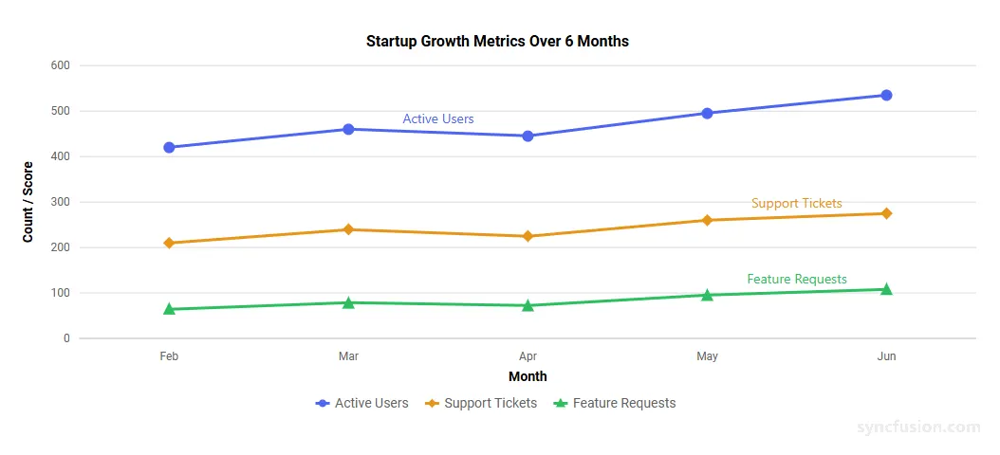
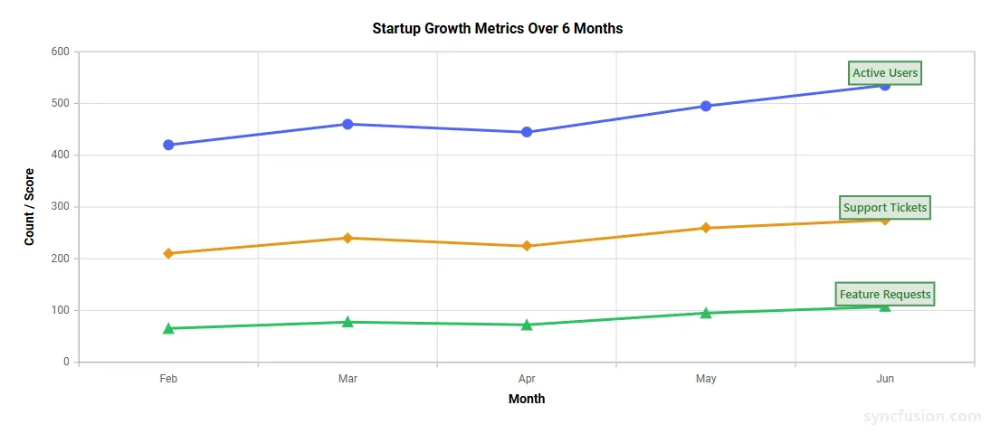

# Blazor Charts Series Label

The series label feature displays the name of each series directly within the chart area. enabling users to identify series without relying on the legend. This is particularly useful for multi-series visualizations and exported charts where clear in-chart identification is required.

Series labels can be enabled and customized using the [`SeriesLabelSettings`](https://help.syncfusion.com/cr/blazor/Syncfusion.Blazor.Charts.SeriesLabelSettings.html) property.

N> **Supported Series Types:** Series labels are available for `Line`, `Area`, `Scatter`, `Column`, `Bar`, `Polar Line`, and `Radar Line` chart types.

N> **Troubleshooting:** If labels do not appear, verify that the `Visible` property is set to `true` and that the chart type is in the supported list above. When labels overlap, set `ShowOverlapText="true"` to keep them visible.

## Enable series labels

To display series labels, set the `Visible` property of `SeriesLabelSettings` to `true` for the required series.

```cshtml

@using Syncfusion.Blazor.Charts

<SfChart Title="Startup Growth Metrics Over 5 Months" Width="100%" Height="450px">
    <ChartLegendSettings Visible="false" />
    <ChartPrimaryXAxis ValueType="Syncfusion.Blazor.Charts.ValueType.Category" Title="Month">
    </ChartPrimaryXAxis>
    <ChartPrimaryYAxis Title="Count / Score">
    </ChartPrimaryYAxis>
    <ChartSeriesCollection>
        <ChartSeries DataSource="@ActiveUsersData" Name="Active Users" XName="Month" YName="Value" Type="ChartSeriesType.Line" Width="3" Fill="#4F65F1">
            <ChartMarker Visible="true" Width="10" Height="10" IsFilled="true" Shape="ChartShape.Circle" />
            <SeriesLabelSettings Visible="true"> </SeriesLabelSettings>
        </ChartSeries>
        <ChartSeries DataSource="@SupportTicketsData" Name="Support Tickets" XName="Month" YName="Value" Type="ChartSeriesType.Line" Width="3" Fill="#E6951A">
            <ChartMarker Visible="true" Width="10" Height="10" IsFilled="true" Shape="ChartShape.Diamond" />
            <SeriesLabelSettings Visible="true"> </SeriesLabelSettings>
        </ChartSeries>
        <ChartSeries DataSource="@FeatureRequestsData" Name="Feature Requests" XName="Month" YName="Value" Type="ChartSeriesType.Line" Width="3" Fill="#2DBE60">
            <ChartMarker Visible="true" Width="10" Height="10" IsFilled="true" Shape="ChartShape.Triangle" />
            <SeriesLabelSettings Visible="true"> </SeriesLabelSettings>
        </ChartSeries>
    </ChartSeriesCollection>
</SfChart>

@code {
    public class MetricData
    {
        public string Month { get; set; }
        public double Value { get; set; }
    }

    public List<MetricData> ActiveUsersData = new()
    {
        new MetricData { Month = "Feb", Value = 420 },
        new MetricData { Month = "Mar", Value = 460 },
        new MetricData { Month = "Apr", Value = 445 },
        new MetricData { Month = "May", Value = 495 },
        new MetricData { Month = "Jun", Value = 535 }
    };

    public List<MetricData> SupportTicketsData = new()
    {
        new MetricData { Month = "Feb", Value = 210 },
        new MetricData { Month = "Mar", Value = 240 },
        new MetricData { Month = "Apr", Value = 225 },
        new MetricData { Month = "May", Value = 260 },
        new MetricData { Month = "Jun", Value = 275 }
    };

    public List<MetricData> FeatureRequestsData = new()
    {
        new MetricData { Month = "Feb", Value = 65 },
        new MetricData { Month = "Mar", Value = 78 },
        new MetricData { Month = "Apr", Value = 72 },
        new MetricData { Month = "May", Value = 95 },
        new MetricData { Month = "Jun", Value = 108 }
    };
}

```

<!-- TODO: Add Blazor Playground sample after release -->


## Customization

You can customize the appearance of the series label using the following properties.

### SeriesLabelSettings 

| Property | Type | Default | Description |
|----------|------|---------|-------------|
| `Visible` | `bool` | `false` | Enables or disables the display of series labels. Set to `true` to display the label for the corresponding series. |
| `Text` | `string` | Series `Name` | Specifies the custom text to be displayed in the series label. If this property is not set, the label displays the corresponding series name by default. |
| `Background` | `string` | `null` | Specifies the background color of the series label. This helps the label stand out clearly within the chart area. |
| `Opacity` | `double` | `1` | Specifies the transparency level of the series label. The accepted range is from 0 to 1, where 0 represents full transparency and 1 represents full opacity. For example, set `Opacity="0.5"` for 50% transparency. |
| `ShowOverlapText` | `bool` | `true` | Determines whether overlapping series labels should be displayed. When `true`, overlapping labels remain visible; when `false`, overlapping labels are hidden. This is useful when labels overlap because the corresponding series are positioned close to one another. |

### SeriesLabelBorder

| Property | Type | Default | Description |
|----------|------|---------|-------------|
| `Color` | `string` | `null` | Specifies the border color of the series label. This can be used to visually separate the label from the chart background. |
| `Width` | `double` | `1` | Specifies the width (in pixels) of the border around the series label. A higher value makes the border more visible. |

### SeriesLabelFont

| Property | Type | Default | Description |
|----------|------|---------|-------------|
| `Size` | `string` | Browser default | Specifies the font size of the label text (e.g., `13px`, `1rem`). |
| `Color` | `string` | Browser default | Specifies the font color of the label text. |
| `FontFamily` | `string` | Browser default | Specifies the font family of the label text. |
| `FontWeight` | `string` | `normal` | Specifies the font weight of the label text. Accepts CSS font-weight keywords (`normal`, `bold`, `bolder`, `lighter`) or numeric values (`100`–`900`). |

The following example overrides the label `Text` to show a custom string and applies background, font, and border styling to each series.

```cshtml

@using Syncfusion.Blazor.Charts

<SfChart Title="Startup Growth Metrics Over 5 Months" Width="100%" Height="450px">
    <ChartLegendSettings Visible="false" />
    <ChartPrimaryXAxis ValueType="Syncfusion.Blazor.Charts.ValueType.Category" Title="Month">
    </ChartPrimaryXAxis>
    <ChartPrimaryYAxis Title="Count / Score">
    </ChartPrimaryYAxis>
    <ChartSeriesCollection>
        <ChartSeries DataSource="@ActiveUsersData" Name="Active Users" XName="Month" YName="Value" Type="ChartSeriesType.Line" Width="3" Fill="#4F65F1">
            <ChartMarker Visible="true" Width="10" Height="10" IsFilled="true" Shape="ChartShape.Circle" />
            <SeriesLabelSettings Visible="true" Text="AU" Background="#DCE8DC" Opacity="1">
                <SeriesLabelFont Size="13px" FontFamily="Segoe UI" FontWeight="600" Color="#2E7D32" />
                <SeriesLabelBorder Width="2" Color="#4A9652" />
            </SeriesLabelSettings>
        </ChartSeries>
        <ChartSeries DataSource="@SupportTicketsData" Name="Support Tickets" XName="Month" YName="Value" Type="ChartSeriesType.Line" Width="3" Fill="#E6951A">
            <ChartMarker Visible="true" Width="10" Height="10" IsFilled="true" Shape="ChartShape.Diamond" />
            <SeriesLabelSettings Visible="true" Background="#DCE8DC">
                <SeriesLabelFont Size="13px" FontFamily="Segoe UI" FontWeight="600" Color="#2E7D32" />
                <SeriesLabelBorder Width="2" Color="#4A9652" />
            </SeriesLabelSettings>
        </ChartSeries>
        <ChartSeries DataSource="@FeatureRequestsData" Name="Feature Requests" XName="Month" YName="Value" Type="ChartSeriesType.Line" Width="3" Fill="#2DBE60">
            <ChartMarker Visible="true" Width="10" Height="10" IsFilled="true" Shape="ChartShape.Triangle" />
            <SeriesLabelSettings Visible="true" Background="#DCE8DC"  Opacity="1">
                <SeriesLabelFont Size="13px" FontFamily="Segoe UI" FontWeight="600" Color="#2E7D32" />
                <SeriesLabelBorder Width="2" Color="#4A9652" />
            </SeriesLabelSettings>
        </ChartSeries>
    </ChartSeriesCollection>
</SfChart>

@code {
    public class MetricData
    {
        public string Month { get; set; }
        public double Value { get; set; }
    }

    public List<MetricData> ActiveUsersData = new()
    {
        new MetricData { Month = "Feb", Value = 420 },
        new MetricData { Month = "Mar", Value = 460 },
        new MetricData { Month = "Apr", Value = 445 },
        new MetricData { Month = "May", Value = 495 },
        new MetricData { Month = "Jun", Value = 535 }
    };

    public List<MetricData> SupportTicketsData = new()
    {
        new MetricData { Month = "Feb", Value = 210 },
        new MetricData { Month = "Mar", Value = 240 },
        new MetricData { Month = "Apr", Value = 225 },
        new MetricData { Month = "May", Value = 260 },
        new MetricData { Month = "Jun", Value = 275 }
    };

    public List<MetricData> FeatureRequestsData = new()
    {
        new MetricData { Month = "Feb", Value = 65 },
        new MetricData { Month = "Mar", Value = 78 },
        new MetricData { Month = "Apr", Value = 72 },
        new MetricData { Month = "May", Value = 95 },
        new MetricData { Month = "Jun", Value = 108 }
    };
}

```



## See also

* [Data Labels](./data-labels)
* [Legend](./legend)

N> Use **series labels** to identify series within the chart area, **data labels** to show point values on the chart, and the **legend** to list all series outside the plot area.

N> Refer to the [Blazor Charts](https://www.syncfusion.com/blazor-components/blazor-charts) feature tour page to explore the available chart features. You can also check the [Blazor Chart Example](https://blazor.syncfusion.com/demos/chart/line?theme=fluent2) to learn how chart types are used to visualize data trends over equal intervals.
