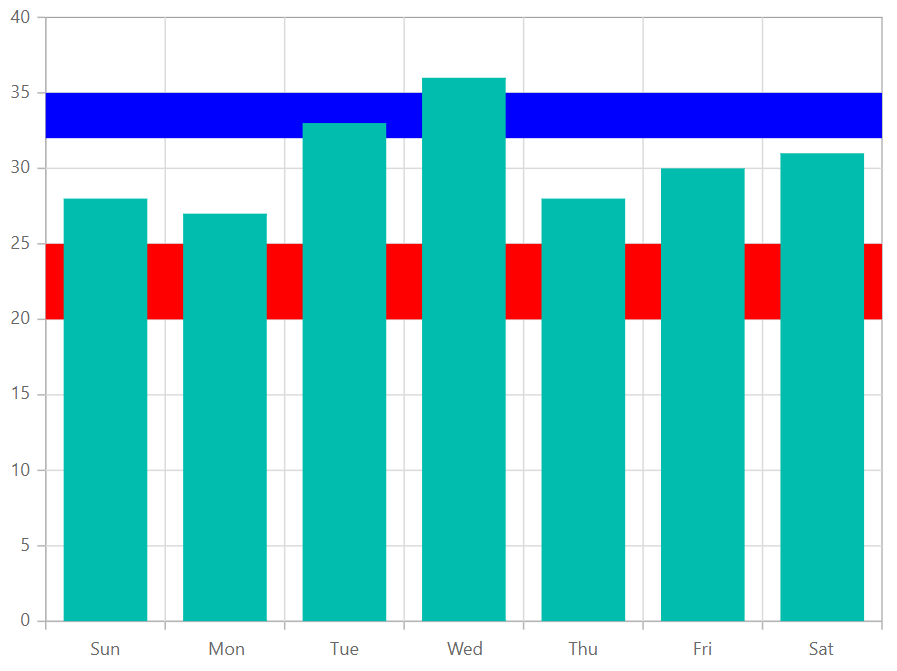
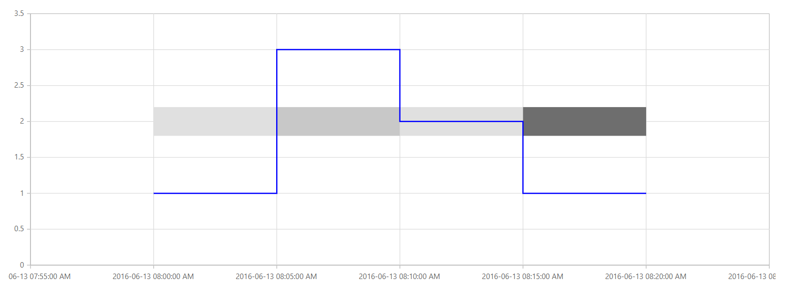

<!-- markdownlint-disable MD036 -->

# Stripline in Blazor Charts Component

<!-- markdownlint-disable MD036 -->

## Horizontal striplines

By adding the [ChartStripline](https://help.syncfusion.com/cr/blazor/Syncfusion.Blazor.Charts.ChartCommonAxis.html#Syncfusion_Blazor_Charts_ChartCommonAxis_StripLines) on the vertical axis, one can create a horizontal stripline. Striplines are drawn in the provided start-to-end range, and an axis can have multiple striplines.

```cshtml

@using Syncfusion.Blazor.Charts

<SfChart>
    <ChartPrimaryXAxis ValueType="Syncfusion.Blazor.Charts.ValueType.Category"/>    

    <ChartPrimaryYAxis>
        <ChartStriplines>
            <ChartStripline Start="20" End="25" Color="red"/>
            <ChartStripline Start="32" End="35" Color="blue"/>
        </ChartStriplines>
    </ChartPrimaryYAxis>

    <ChartSeriesCollection>
        <ChartSeries Type="ChartSeriesType.Column" DataSource="@WeatherReports" XName="X" YName="Y">
        </ChartSeries>
    </ChartSeriesCollection>

</SfChart>

@code{
    public class ChartData
    {
        public string X { get; set; }
        public double Y { get; set; }
    }

    public List<ChartData> WeatherReports = new List<ChartData>
	{
		new ChartData { X = "Sun", Y = 28 },
		new ChartData { X = "Mon", Y = 27 },
		new ChartData { X = "Tue", Y = 33 },
		new ChartData { X = "Wed", Y = 36 },
		new ChartData { X = "Thu", Y = 28 },
		new ChartData { X = "Fri", Y = 30 },
		new ChartData { X = "Sat", Y = 31 }
    };
}

```




## Vertical striplines

By adding the [ChartStripline](https://help.syncfusion.com/cr/blazor/Syncfusion.Blazor.Charts.ChartCommonAxis.html#Syncfusion_Blazor_Charts_ChartCommonAxis_StripLines) on the horizontal axis, one can create a vertical stripline. Striplines are drawn in the provided start-to-end range, and an axis can have multiple striplines.

```cshtml

@using Syncfusion.Blazor.Charts

<SfChart>
    <ChartPrimaryXAxis ValueType="Syncfusion.Blazor.Charts.ValueType.Category">
        <ChartStriplines>
            <ChartStripline Start="2" End="3" Color="#EEFFCC" />
            <ChartStripline Start="4" End="5" Color="pink" />
        </ChartStriplines>
    </ChartPrimaryXAxis>

    <ChartSeriesCollection>
        <ChartSeries Type="ChartSeriesType.Column" DataSource="@WeatherReports" XName="X" YName="Y">
        </ChartSeries>
    </ChartSeriesCollection>
</SfChart>

@code{
    public class ChartData
    {
        public string X { get; set; }
        public double Y { get; set; }
    }

    public List<ChartData> WeatherReports = new List<ChartData>
    {
		new ChartData { X = "Sun", Y = 28 },
		new ChartData { X = "Mon", Y = 27 },
		new ChartData { X = "Tue", Y = 33 },
		new ChartData { X = "Wed", Y = 36 },
		new ChartData { X = "Thu", Y = 28 },
		new ChartData { X = "Fri", Y = 30 },
		new ChartData { X = "Sat", Y = 31 }
    };
}

```



## Striplines customization

The [Start](https://help.syncfusion.com/cr/blazor/Syncfusion.Blazor.Charts.ChartCommonStripLines.html#Syncfusion_Blazor_Charts_ChartCommonStripLines_Start) property in a stripline can be used to customize the starting value in that stripline. The [End](https://help.syncfusion.com/cr/blazor/Syncfusion.Blazor.Charts.ChartCommonStripLines.html#Syncfusion_Blazor_Charts_ChartCommonStripLines_End) property customizes the end value in the same way. Both [Size](https://help.syncfusion.com/cr/blazor/Syncfusion.Blazor.Charts.ChartCommonStripLines.html#Syncfusion_Blazor_Charts_ChartCommonStripLines_Size) and [Border](https://help.syncfusion.com/cr/blazor/Syncfusion.Blazor.Charts.ChartCommonStripLines.html#Syncfusion_Blazor_Charts_ChartCommonStripLines_Border) properties can be used to customize the stripline's size and border. The [ZIndex](https://help.syncfusion.com/cr/blazor/Syncfusion.Blazor.Charts.ChartCommonStripLines.html#Syncfusion_Blazor_Charts_ChartCommonStripLines_ZIndex) property can be used to alter the order of the stripline, determining whether it should be drawn behind or over the series elements.

```cshtml

@using Syncfusion.Blazor.Charts

<SfChart>
    <ChartPrimaryXAxis ValueType="Syncfusion.Blazor.Charts.ValueType.Category">
        <ChartStriplines>
            <ChartStripline StartFromAxis="true" Size="4" ZIndex="ZIndex.Behind" Opacity="0.5" Color="green"/>
        </ChartStriplines>
    </ChartPrimaryXAxis>

    <ChartSeriesCollection>
        <ChartSeries Type="ChartSeriesType.Column" DataSource="@WeatherReports" XName="X" YName="Y">
        </ChartSeries>
    </ChartSeriesCollection>
</SfChart>

@code{

    public class ChartData
    {
        public string X { get; set; }
        public double Y { get; set; }
    }

    public List<ChartData> WeatherReports = new List<ChartData>
	{
		new ChartData { X = "Sun", Y = 28 },
		new ChartData { X = "Mon", Y = 27 },
		new ChartData { X = "Tue", Y = 33 },
		new ChartData { X = "Wed", Y = 36 },
		new ChartData { X = "Thu", Y = 28 },
		new ChartData { X = "Fri", Y = 30 },
		new ChartData { X = "Sat", Y = 31 }
	};
}

```



## Text customization

[TextStyle](https://help.syncfusion.com/cr/blazor/Syncfusion.Blazor.Charts.ChartCommonStripLines.html#Syncfusion_Blazor_Charts_ChartCommonStripLines_TextStyle) and [Rotation](https://help.syncfusion.com/cr/blazor/Syncfusion.Blazor.Charts.ChartCommonStripLines.html#Syncfusion_Blazor_Charts_ChartCommonStripLines_Rotation) properties can be used to customize and rotate the text presented in a stripline. The [HorizontalAlignment](https://help.syncfusion.com/cr/blazor/Syncfusion.Blazor.Charts.ChartCommonStripLines.html#Syncfusion_Blazor_Charts_ChartCommonStripLines_HorizontalAlignment) and [VerticalAlignment](https://help.syncfusion.com/cr/blazor/Syncfusion.Blazor.Charts.ChartCommonStripLines.html#Syncfusion_Blazor_Charts_ChartCommonStripLines_VerticalAlignment) properties can be used to customize the horizontal and vertical alignment of the stripline text.

```cshtml

@using Syncfusion.Blazor.Charts

<SfChart>
    <ChartPrimaryXAxis ValueType="Syncfusion.Blazor.Charts.ValueType.Category">
        <ChartStriplines>
            <ChartStripline StartFromAxis="true" Size="4" ZIndex="ZIndex.Behind" Opacity="0.5" Color="green" Text="Good"
                            HorizontalAlignment="Anchor.Middle" VerticalAlignment="Anchor.Middle">
                <ChartStriplineTextStyle Size="20px" Color="red"/>
            </ChartStripline>
        </ChartStriplines>
    </ChartPrimaryXAxis>

    <ChartSeriesCollection>
        <ChartSeries Type="ChartSeriesType.Column" DataSource="@WeatherReports" XName="X" YName="Y">
        </ChartSeries>
    </ChartSeriesCollection>
</SfChart>

@code{

    public class ChartData
    {
        public string X { get; set; }
        public double Y { get; set; }
    }

    public List<ChartData> WeatherReports = new List<ChartData>
	{
		new ChartData { X = "Sun", Y = 28 },
		new ChartData { X = "Mon", Y = 27 },
		new ChartData { X = "Tue", Y = 33 },
		new ChartData { X = "Wed", Y = 36 },
		new ChartData { X = "Thu", Y = 28 },
		new ChartData { X = "Fri", Y = 30 },
		new ChartData { X = "Sat", Y = 31 }
	};
}

```



## Segmented stripline

To create a stripline in a specific region with respect to a segment (segmented stripline), you can use the [IsSegmented](https://help.syncfusion.com/cr/blazor/Syncfusion.Blazor.Charts.ChartStripline.html#Syncfusion_Blazor_Charts_ChartStripline_IsSegmented) property of the [ChartStripline](https://help.syncfusion.com/cr/blazor/Syncfusion.Blazor.Charts.ChartStripline.html#Syncfusion_Blazor_Charts_ChartStripline__ctor). The start and end values of this type of stripline can be defined through the [SegmentStart](https://help.syncfusion.com/cr/blazor/Syncfusion.Blazor.Charts.ChartStripline.html#Syncfusion_Blazor_Charts_ChartStripline_SegmentStart) and [SegmentEnd](https://help.syncfusion.com/cr/blazor/Syncfusion.Blazor.Charts.ChartStripline.html#Syncfusion_Blazor_Charts_ChartStripline_SegmentEnd) properties. Additionally, you can use the [Color](https://help.syncfusion.com/cr/blazor/Syncfusion.Blazor.Charts.ChartStripline.html#Syncfusion_Blazor_Charts_ChartStripline_Color) property to set the color of the segment and the [SegmentAxisName](https://help.syncfusion.com/cr/blazor/Syncfusion.Blazor.Charts.ChartStripline.html#Syncfusion_Blazor_Charts_ChartStripline_SegmentAxisName) property to specify the axis for the segment stripline.

* [IsSegmented](https://help.syncfusion.com/cr/blazor/Syncfusion.Blazor.Charts.ChartStripline.html#Syncfusion_Blazor_Charts_ChartStripline_IsSegmented) - It is used to enable the segmented stripline.
* [SegmentStart](https://help.syncfusion.com/cr/blazor/Syncfusion.Blazor.Charts.ChartStripline.html#Syncfusion_Blazor_Charts_ChartStripline_SegmentStart) - Used to change the start value of the segment, which corresponds to the associated axis.
* [SegmentEnd](https://help.syncfusion.com/cr/blazor/Syncfusion.Blazor.Charts.ChartStripline.html#Syncfusion_Blazor_Charts_ChartStripline_SegmentEnd) - Used to change the end value of the segment, which also corresponds to the associated axis.
* [SegmentAxisName](https://help.syncfusion.com/cr/blazor/Syncfusion.Blazor.Charts.ChartStripline.html#Syncfusion_Blazor_Charts_ChartStripline_SegmentAxisName) - Used to specify the name of the associated axis.
* [Color](https://help.syncfusion.com/cr/blazor/Syncfusion.Blazor.Charts.ChartStripline.html#Syncfusion_Blazor_Charts_ChartStripline_Color) - Used to customize the color for the stripline.
 

```cshtml

@using Syncfusion.Blazor.Charts

<SfChart>
    <ChartPrimaryXAxis Minimum="@Minimum" Maximum="@Maximum" LabelFormat="yyyy-MM-dd HH:mm:ss tt" Interval="5" IntervalType="IntervalType.Minutes" ValueType="Syncfusion.Blazor.Charts.ValueType.DateTime">
        <ChartStriplines>
            <ChartStripline Start="new DateTime(2016, 06, 13, 08, 00, 00)" End="new DateTime(2016, 06, 13, 08, 05, 00)" Color="#E0E0E0" IsSegmented="true" SegmentStart="1.8" SegmentAxisName="PrimaryYAxis" SegmentEnd="2.2" StartFromAxis="false" />
            <ChartStripline Start="new DateTime(2016, 06, 13, 08, 05, 00)" End="new DateTime(2016, 06, 13, 08, 10, 00)" Color="#C8C8C8" IsSegmented="true" SegmentStart="1.8" SegmentAxisName="PrimaryYAxis" SegmentEnd="2.2" StartFromAxis="false" />
            <ChartStripline Start="new DateTime(2016, 06, 13, 08, 10, 00)" End="new DateTime(2016, 06, 13, 08, 15, 00)" Color="#E0E0E0" IsSegmented="true" SegmentStart="1.8" SegmentAxisName="PrimaryYAxis" SegmentEnd="2.2" StartFromAxis="false" />
            <ChartStripline Start="new DateTime(2016, 06, 13, 08, 15, 00)" End="new DateTime(2016, 06, 13, 08, 20, 00)" Color="#6e6e6e" IsSegmented="true" SegmentStart="1.8" SegmentAxisName="PrimaryYAxis" SegmentEnd="2.2" StartFromAxis="false" />
        </ChartStriplines>
    </ChartPrimaryXAxis>
    <ChartPrimaryYAxis Interval="0.5" Minimum="0" Maximum="3.5"></ChartPrimaryYAxis>
    <ChartSeriesCollection>
        <ChartSeries Fill="blue" DataSource="@StepLineData" Width="2" XName="X" YName="Y" Type="Syncfusion.Blazor.Charts.ChartSeriesType.StepLine">
        </ChartSeries>
    </ChartSeriesCollection>
</SfChart>

@code {
    public DateTime Minimum { get; set; } = new DateTime(2016, 06, 13, 07, 55, 00);
    public DateTime Maximum { get; set; } = new DateTime(2016, 06, 13, 08, 25, 00);

    public class ChartData
    {
        public DateTime X { get; set; }
        public double Y { get; set; }
    }

    public List<ChartData> StepLineData = new List<ChartData>
    {
        new ChartData { X= new DateTime(2016, 06, 13,08,00,00), Y= 1 },
        new ChartData { X= new DateTime(2016, 06, 13,08,05,00), Y= 3 },
        new ChartData { X= new DateTime(2016, 06, 13,08,10,00), Y= 2 },
        new ChartData { X= new DateTime(2016, 06, 13,08,15,00), Y= 1 },
        new ChartData { X= new DateTime(2016, 06, 13,08,20,00), Y= 1 }
    };
}
```




N> Refer to our [Blazor Charts](https://www.syncfusion.com/blazor-components/blazor-charts) feature tour page for its groundbreaking feature representations and also explore our [Blazor Chart Example](https://blazor.syncfusion.com/demos/chart/line?theme=bootstrap5) to know various chart types and how to represent time-dependent data, showing trends at equal intervals.

## See also

* [Data label](./data-labels)
* [Tooltip](./tool-tip)
* [Marker](./data-markers)