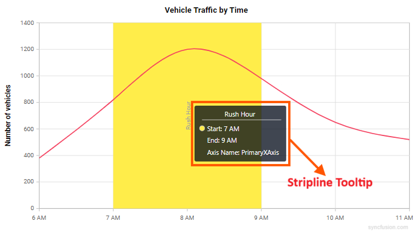
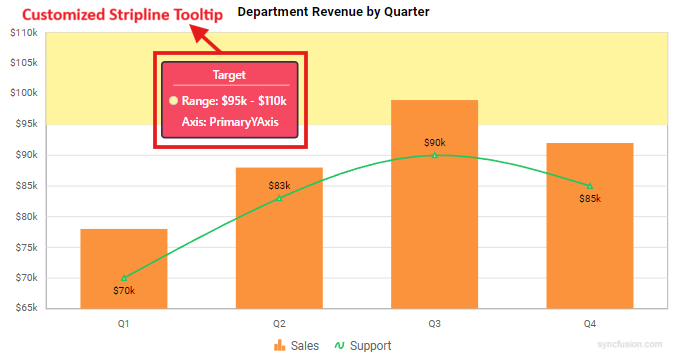

<!-- markdownlint-disable MD036 -->

# Stripline in Blazor Charts Component

<!-- markdownlint-disable MD036 -->

## Horizontal striplines

By adding the [ChartStripline](https://help.syncfusion.com/cr/blazor/Syncfusion.Blazor.Charts.ChartCommonAxis.html#Syncfusion_Blazor_Charts_ChartCommonAxis_StripLines) on the vertical axis, one can create a horizontal stripline. Striplines are drawn in the provided start-to-end range, and an axis can have multiple striplines.

```cshtml

@using Syncfusion.Blazor.Charts

<SfChart>
    <ChartPrimaryXAxis ValueType="Syncfusion.Blazor.Charts.ValueType.Category"/>    

    <ChartPrimaryYAxis>
        <ChartStriplines>
            <ChartStripline Start="20" End="25" Color="red"/>
            <ChartStripline Start="32" End="35" Color="blue"/>
        </ChartStriplines>
    </ChartPrimaryYAxis>

    <ChartSeriesCollection>
        <ChartSeries Type="ChartSeriesType.Column" DataSource="@WeatherReports" XName="X" YName="Y">
        </ChartSeries>
    </ChartSeriesCollection>

</SfChart>

@code{
    public class ChartData
    {
        public string X { get; set; }
        public double Y { get; set; }
    }

    public List<ChartData> WeatherReports = new List<ChartData>
	{
		new ChartData { X = "Sun", Y = 28 },
		new ChartData { X = "Mon", Y = 27 },
		new ChartData { X = "Tue", Y = 33 },
		new ChartData { X = "Wed", Y = 36 },
		new ChartData { X = "Thu", Y = 28 },
		new ChartData { X = "Fri", Y = 30 },
		new ChartData { X = "Sat", Y = 31 }
    };
}

```


## Vertical striplines

By adding the [ChartStripline](https://help.syncfusion.com/cr/blazor/Syncfusion.Blazor.Charts.ChartCommonAxis.html#Syncfusion_Blazor_Charts_ChartCommonAxis_StripLines) on the horizontal axis, one can create a vertical stripline. Striplines are drawn in the provided start-to-end range, and an axis can have multiple striplines.

```cshtml

@using Syncfusion.Blazor.Charts

<SfChart>
    <ChartPrimaryXAxis ValueType="Syncfusion.Blazor.Charts.ValueType.Category">
        <ChartStriplines>
            <ChartStripline Start="2" End="3" Color="#EEFFCC" />
            <ChartStripline Start="4" End="5" Color="pink" />
        </ChartStriplines>
    </ChartPrimaryXAxis>

    <ChartSeriesCollection>
        <ChartSeries Type="ChartSeriesType.Column" DataSource="@WeatherReports" XName="X" YName="Y">
        </ChartSeries>
    </ChartSeriesCollection>
</SfChart>

@code{
    public class ChartData
    {
        public string X { get; set; }
        public double Y { get; set; }
    }

    public List<ChartData> WeatherReports = new List<ChartData>
    {
		new ChartData { X = "Sun", Y = 28 },
		new ChartData { X = "Mon", Y = 27 },
		new ChartData { X = "Tue", Y = 33 },
		new ChartData { X = "Wed", Y = 36 },
		new ChartData { X = "Thu", Y = 28 },
		new ChartData { X = "Fri", Y = 30 },
		new ChartData { X = "Sat", Y = 31 }
    };
}

```


## Striplines customization

The [Start](https://help.syncfusion.com/cr/blazor/Syncfusion.Blazor.Charts.ChartCommonStripLines.html#Syncfusion_Blazor_Charts_ChartCommonStripLines_Start) property in a stripline can be used to customize the starting value in that stripline. The [End](https://help.syncfusion.com/cr/blazor/Syncfusion.Blazor.Charts.ChartCommonStripLines.html#Syncfusion_Blazor_Charts_ChartCommonStripLines_End) property customizes the end value in the same way. Both [Size](https://help.syncfusion.com/cr/blazor/Syncfusion.Blazor.Charts.ChartCommonStripLines.html#Syncfusion_Blazor_Charts_ChartCommonStripLines_Size) and [Border](https://help.syncfusion.com/cr/blazor/Syncfusion.Blazor.Charts.ChartCommonStripLines.html#Syncfusion_Blazor_Charts_ChartCommonStripLines_Border) properties can be used to customize the stripline's size and border. The [ZIndex](https://help.syncfusion.com/cr/blazor/Syncfusion.Blazor.Charts.ChartCommonStripLines.html#Syncfusion_Blazor_Charts_ChartCommonStripLines_ZIndex) property can be used to alter the order of the stripline, determining whether it should be drawn behind or over the series elements.

```cshtml

@using Syncfusion.Blazor.Charts

<SfChart>
    <ChartPrimaryXAxis ValueType="Syncfusion.Blazor.Charts.ValueType.Category">
        <ChartStriplines>
            <ChartStripline StartFromAxis="true" Size="4" ZIndex="ZIndex.Behind" Opacity="0.5" Color="green"/>
        </ChartStriplines>
    </ChartPrimaryXAxis>

    <ChartSeriesCollection>
        <ChartSeries Type="ChartSeriesType.Column" DataSource="@WeatherReports" XName="X" YName="Y">
        </ChartSeries>
    </ChartSeriesCollection>
</SfChart>

@code{

    public class ChartData
    {
        public string X { get; set; }
        public double Y { get; set; }
    }

    public List<ChartData> WeatherReports = new List<ChartData>
	{
		new ChartData { X = "Sun", Y = 28 },
		new ChartData { X = "Mon", Y = 27 },
		new ChartData { X = "Tue", Y = 33 },
		new ChartData { X = "Wed", Y = 36 },
		new ChartData { X = "Thu", Y = 28 },
		new ChartData { X = "Fri", Y = 30 },
		new ChartData { X = "Sat", Y = 31 }
	};
}

```


## Text customization

[TextStyle](https://help.syncfusion.com/cr/blazor/Syncfusion.Blazor.Charts.ChartCommonStripLines.html#Syncfusion_Blazor_Charts_ChartCommonStripLines_TextStyle) and [Rotation](https://help.syncfusion.com/cr/blazor/Syncfusion.Blazor.Charts.ChartCommonStripLines.html#Syncfusion_Blazor_Charts_ChartCommonStripLines_Rotation) properties can be used to customize and rotate the text presented in a stripline. The [HorizontalAlignment](https://help.syncfusion.com/cr/blazor/Syncfusion.Blazor.Charts.ChartCommonStripLines.html#Syncfusion_Blazor_Charts_ChartCommonStripLines_HorizontalAlignment) and [VerticalAlignment](https://help.syncfusion.com/cr/blazor/Syncfusion.Blazor.Charts.ChartCommonStripLines.html#Syncfusion_Blazor_Charts_ChartCommonStripLines_VerticalAlignment) properties can be used to customize the horizontal and vertical alignment of the stripline text.

```cshtml

@using Syncfusion.Blazor.Charts

<SfChart>
    <ChartPrimaryXAxis ValueType="Syncfusion.Blazor.Charts.ValueType.Category">
        <ChartStriplines>
            <ChartStripline StartFromAxis="true" Size="4" ZIndex="ZIndex.Behind" Opacity="0.5" Color="green" Text="Good"
                            HorizontalAlignment="Anchor.Middle" VerticalAlignment="Anchor.Middle">
                <ChartStriplineTextStyle Size="20px" Color="red"/>
            </ChartStripline>
        </ChartStriplines>
    </ChartPrimaryXAxis>

    <ChartSeriesCollection>
        <ChartSeries Type="ChartSeriesType.Column" DataSource="@WeatherReports" XName="X" YName="Y">
        </ChartSeries>
    </ChartSeriesCollection>
</SfChart>

@code{

    public class ChartData
    {
        public string X { get; set; }
        public double Y { get; set; }
    }

    public List<ChartData> WeatherReports = new List<ChartData>
	{
		new ChartData { X = "Sun", Y = 28 },
		new ChartData { X = "Mon", Y = 27 },
		new ChartData { X = "Tue", Y = 33 },
		new ChartData { X = "Wed", Y = 36 },
		new ChartData { X = "Thu", Y = 28 },
		new ChartData { X = "Fri", Y = 30 },
		new ChartData { X = "Sat", Y = 31 }
	};
}

```


## Segmented stripline

To create a stripline in a specific region with respect to a segment (segmented stripline), you can use the [IsSegmented](https://help.syncfusion.com/cr/blazor/Syncfusion.Blazor.Charts.ChartStripline.html#Syncfusion_Blazor_Charts_ChartStripline_IsSegmented) property of the [ChartStripline](https://help.syncfusion.com/cr/blazor/Syncfusion.Blazor.Charts.ChartStripline.html#Syncfusion_Blazor_Charts_ChartStripline__ctor). The start and end values of this type of stripline can be defined through the [SegmentStart](https://help.syncfusion.com/cr/blazor/Syncfusion.Blazor.Charts.ChartStripline.html#Syncfusion_Blazor_Charts_ChartStripline_SegmentStart) and [SegmentEnd](https://help.syncfusion.com/cr/blazor/Syncfusion.Blazor.Charts.ChartStripline.html#Syncfusion_Blazor_Charts_ChartStripline_SegmentEnd) properties. Additionally, you can use the [Color](https://help.syncfusion.com/cr/blazor/Syncfusion.Blazor.Charts.ChartStripline.html#Syncfusion_Blazor_Charts_ChartStripline_Color) property to set the color of the segment and the [SegmentAxisName](https://help.syncfusion.com/cr/blazor/Syncfusion.Blazor.Charts.ChartStripline.html#Syncfusion_Blazor_Charts_ChartStripline_SegmentAxisName) property to specify the axis for the segment stripline.

* [IsSegmented](https://help.syncfusion.com/cr/blazor/Syncfusion.Blazor.Charts.ChartStripline.html#Syncfusion_Blazor_Charts_ChartStripline_IsSegmented) - It is used to enable the segmented stripline.
* [SegmentStart](https://help.syncfusion.com/cr/blazor/Syncfusion.Blazor.Charts.ChartStripline.html#Syncfusion_Blazor_Charts_ChartStripline_SegmentStart) - Used to change the start value of the segment, which corresponds to the associated axis.
* [SegmentEnd](https://help.syncfusion.com/cr/blazor/Syncfusion.Blazor.Charts.ChartStripline.html#Syncfusion_Blazor_Charts_ChartStripline_SegmentEnd) - Used to change the end value of the segment, which also corresponds to the associated axis.
* [SegmentAxisName](https://help.syncfusion.com/cr/blazor/Syncfusion.Blazor.Charts.ChartStripline.html#Syncfusion_Blazor_Charts_ChartStripline_SegmentAxisName) - Used to specify the name of the associated axis.
* [Color](https://help.syncfusion.com/cr/blazor/Syncfusion.Blazor.Charts.ChartStripline.html#Syncfusion_Blazor_Charts_ChartStripline_Color) - Used to customize the color for the stripline.
 

```cshtml

@using Syncfusion.Blazor.Charts

<SfChart>
    <ChartPrimaryXAxis Minimum="@Minimum" Maximum="@Maximum" LabelFormat="yyyy-MM-dd HH:mm:ss tt" Interval="5" IntervalType="IntervalType.Minutes" ValueType="Syncfusion.Blazor.Charts.ValueType.DateTime">
        <ChartStriplines>
            <ChartStripline Start="new DateTime(2016, 06, 13, 08, 00, 00)" End="new DateTime(2016, 06, 13, 08, 05, 00)" Color="#E0E0E0" IsSegmented="true" SegmentStart="1.8" SegmentAxisName="PrimaryYAxis" SegmentEnd="2.2" StartFromAxis="false" />
            <ChartStripline Start="new DateTime(2016, 06, 13, 08, 05, 00)" End="new DateTime(2016, 06, 13, 08, 10, 00)" Color="#C8C8C8" IsSegmented="true" SegmentStart="1.8" SegmentAxisName="PrimaryYAxis" SegmentEnd="2.2" StartFromAxis="false" />
            <ChartStripline Start="new DateTime(2016, 06, 13, 08, 10, 00)" End="new DateTime(2016, 06, 13, 08, 15, 00)" Color="#E0E0E0" IsSegmented="true" SegmentStart="1.8" SegmentAxisName="PrimaryYAxis" SegmentEnd="2.2" StartFromAxis="false" />
            <ChartStripline Start="new DateTime(2016, 06, 13, 08, 15, 00)" End="new DateTime(2016, 06, 13, 08, 20, 00)" Color="#6e6e6e" IsSegmented="true" SegmentStart="1.8" SegmentAxisName="PrimaryYAxis" SegmentEnd="2.2" StartFromAxis="false" />
        </ChartStriplines>
    </ChartPrimaryXAxis>
    <ChartPrimaryYAxis Interval="0.5" Minimum="0" Maximum="3.5"></ChartPrimaryYAxis>
    <ChartSeriesCollection>
        <ChartSeries Fill="blue" DataSource="@StepLineData" Width="2" XName="X" YName="Y" Type="Syncfusion.Blazor.Charts.ChartSeriesType.StepLine">
        </ChartSeries>
    </ChartSeriesCollection>
</SfChart>

@code {
    public DateTime Minimum { get; set; } = new DateTime(2016, 06, 13, 07, 55, 00);
    public DateTime Maximum { get; set; } = new DateTime(2016, 06, 13, 08, 25, 00);

    public class ChartData
    {
        public DateTime X { get; set; }
        public double Y { get; set; }
    }

    public List<ChartData> StepLineData = new List<ChartData>
    {
        new ChartData { X= new DateTime(2016, 06, 13,08,00,00), Y= 1 },
        new ChartData { X= new DateTime(2016, 06, 13,08,05,00), Y= 3 },
        new ChartData { X= new DateTime(2016, 06, 13,08,10,00), Y= 2 },
        new ChartData { X= new DateTime(2016, 06, 13,08,15,00), Y= 1 },
        new ChartData { X= new DateTime(2016, 06, 13,08,20,00), Y= 1 }
    };
}
```


## Stripline tooltip

Stripline tooltips provide additional contextual information on interaction with striplines in the chart. To display a tooltip on a stripline, add the **ChartStriplineTooltip** component inside the desired **ChartStripline** and set the **Enable** property to **true**. It is particularly useful for explaining the significance of specific ranges or thresholds marked by striplines.

### Default stripline tooltip code example:

Below is the simplest way to enable a stripline tooltip using default settings. The tooltip will display on interaction with the stripline.

```cshtml

@using Syncfusion.Blazor.Charts

<SfChart Title="Vehicle Traffic by Time">
    <ChartPrimaryXAxis ValueType="Syncfusion.Blazor.Charts.ValueType.DateTime"
                       IntervalType="IntervalType.Hours"
                       LabelFormat="h tt">
        <ChartStriplines>
            <ChartStripline Start="new DateTime(2024, 01, 01, 07, 00, 00)"
                            End="new DateTime(2024, 01, 01, 09, 00, 00)"
                            Text="Rush Hour"
                            Color="#FFED4A"
                            Visible="true">
                <ChartStriplineTooltip Enable="true"></ChartStriplineTooltip>
            </ChartStripline>
        </ChartStriplines>
    </ChartPrimaryXAxis>

    <ChartPrimaryYAxis Minimum="0" Maximum="1400" Interval="200" Title="Number of vehicles">
    </ChartPrimaryYAxis>

    <ChartSeriesCollection>
        <!-- Vibrant spline series color -->
        <ChartSeries Type="ChartSeriesType.Spline"
                     DataSource="@Traffic"
                     XName="Time"
                     YName="Vehicles"
                     Width="2"
                     Fill="#F43F5E">
        </ChartSeries>
    </ChartSeriesCollection>
</SfChart>

@code {
    public class TrafficPoint
    {
        public DateTime Time { get; set; }
        public double Vehicles { get; set; }
    }

    public List<TrafficPoint> Traffic = new ()
    {
        new TrafficPoint { Time = new DateTime(2024, 01, 01, 06, 00, 00), Vehicles = 380 },
        new TrafficPoint { Time = new DateTime(2024, 01, 01, 07, 00, 00), Vehicles = 820 },
        new TrafficPoint { Time = new DateTime(2024, 01, 01, 08, 00, 00), Vehicles = 1200 },
        new TrafficPoint { Time = new DateTime(2024, 01, 01, 09, 00, 00), Vehicles = 980 },
        new TrafficPoint { Time = new DateTime(2024, 01, 01, 10, 00, 00), Vehicles = 650 },
        new TrafficPoint { Time = new DateTime(2024, 01, 01, 11, 00, 00), Vehicles = 520 }
    };
}

```



### Tooltip customization properties

The stripline tooltip offers comprehensive customization options through the following properties:

- **Enable** - A boolean property that enables or disables the stripline tooltip. Default value is **false**.

- **Header** - Defines the title text displayed at the top of the tooltip.

- **Content** - Allows you to specify custom content for the tooltip body using a format string. The format supports token placeholders that are replaced with corresponding values at runtime. Supported tokens:
  - **${stripline.text}** – The stripline label.
  - **${stripline.start}** – The stripline start value.
  - **${stripline.end}** – The stripline end value.
  - **${axis.name}** – The axis name.
  - **${stripline.segmentStart}** – The stripline segment start value (if applicable).
  - **${stripline.segmentEnd}** – The stripline segment end value (if applicable).
  - **${stripline.segmentAxisName}** – The stripline segment axis name (if applicable).
  - **${stripline.size}** – The stripline size (if applicable).

- **Fill** - Sets the background color of the tooltip. Accepts any valid CSS color value (hex, rgb, rgba, named colors).

- **Opacity** - Controls the transparency level of the tooltip background. Accepts numeric values between 0 (completely transparent) and 1 (completely opaque). The default value is 0.75.

- **ShowHeaderLine** - A boolean property that controls the visibility of the horizontal separator line between the tooltip header and content. Set to **true** to display the line or **false** to hide it.

The **ChartStriplineTooltipTextStyle** component allows you to customize the appearance of text within the tooltip:

- **Size** - Specifies the font size of the tooltip text. Accepts pixel values (e.g., "12px").

- **Color** - Defines the text color. Accepts any valid CSS color value.

- **FontFamily** - Sets the font family for the tooltip text. Accepts standard CSS font family values (e.g., "Arial", "Segoe UI", "Roboto").

- **FontWeight** - Controls the thickness of the text.

The **ChartStriplineTooltipBorder** component enables you to add and customize borders around the tooltip:

- **Width** - Specifies the thickness of the tooltip border in pixels. Accepts numeric values. Default value is **0**.

- **Color** - Defines the color of the tooltip border. Accepts any valid CSS color value.

### Customized stripline tooltip code example:

```cshtml

@using Syncfusion.Blazor.Charts

<SfChart Title="Department Revenue by Quarter">
    <ChartPrimaryXAxis ValueType="Syncfusion.Blazor.Charts.ValueType.Category">
        <ChartAxisMajorGridLines Width="0"></ChartAxisMajorGridLines>
        <ChartAxisMajorTickLines Width="0"></ChartAxisMajorTickLines>
    </ChartPrimaryXAxis>

    <ChartPrimaryYAxis Minimum="65" Maximum="110" Interval="5" LabelFormat="${value}k" RangePadding="Syncfusion.Blazor.Charts.ChartRangePadding.None">
        <ChartAxisMajorTickLines Width="0"></ChartAxisMajorTickLines>
        <ChartStriplines>
            <ChartStripline Start="95" End="110" Text="Target Exceeded" Color="#FFE3B3" HorizontalAlignment="Anchor.Middle" Visible="true">
                <ChartStriplineTextStyle Size="12px" Color="#0b3a66" FontWeight="600"></ChartStriplineTextStyle>
                <ChartStriplineBorder Width="0"></ChartStriplineBorder>
                <ChartStriplineTooltip Enable="true" Header="Target Exceeded">
                    <ChartStriplineTooltipTextStyle Size="12px" FontWeight="500"></ChartStriplineTooltipTextStyle>
                    <ChartStriplineTooltipBorder Width="0"></ChartStriplineTooltipBorder>
                </ChartStriplineTooltip>
            </ChartStripline>
        </ChartStriplines>
    </ChartPrimaryYAxis>

    <ChartSeriesCollection>
        <ChartSeries Name="Sales" Type="ChartSeriesType.Column" DataSource="@SalesData" XName="Quarter" YName="Revenue" ColumnSpacing="0.2" Width="2" Fill="#ef4444">
            <ChartMarker Visible="false"></ChartMarker>
        </ChartSeries>
        <ChartSeries Name="Support" Type="ChartSeriesType.Spline" DataSource="@SupportData" XName="Quarter" YName="Revenue" Width="2" Fill="#3b82f6">
            <ChartMarker Visible="true">
                <ChartDataLabel Visible="true"></ChartDataLabel>
            </ChartMarker>
        </ChartSeries>
    </ChartSeriesCollection>

    <ChartLegendSettings Visible="true" EnableHighlight="true">
    </ChartLegendSettings>
</SfChart>

@code {
    public class RevenuePoint
    {
        public string Quarter { get; set; }
        public double Revenue { get; set; }
    }

    public List<RevenuePoint> SalesData = new ()
    {
        new RevenuePoint { Quarter = "Q1", Revenue = 78 },
        new RevenuePoint { Quarter = "Q2", Revenue = 88 },
        new RevenuePoint { Quarter = "Q3", Revenue = 99 },
        new RevenuePoint { Quarter = "Q4", Revenue = 92 }
    };

    public List<RevenuePoint> SupportData = new ()
    {
        new RevenuePoint { Quarter = "Q1", Revenue = 70 },
        new RevenuePoint { Quarter = "Q2", Revenue = 83 },
        new RevenuePoint { Quarter = "Q3", Revenue = 90 },
        new RevenuePoint { Quarter = "Q4", Revenue = 85 }
    };
}

```



N> Refer to our [Blazor Charts](https://www.syncfusion.com/blazor-components/blazor-charts) feature tour page for its groundbreaking feature representations and also explore our [Blazor Chart Example](https://blazor.syncfusion.com/demos/chart/line?theme=bootstrap5) to know various chart types and how to represent time-dependent data, showing trends at equal intervals.

## See also

* [Data label](./data-labels)
* [Tooltip](./tool-tip)
* [Marker](./data-markers)