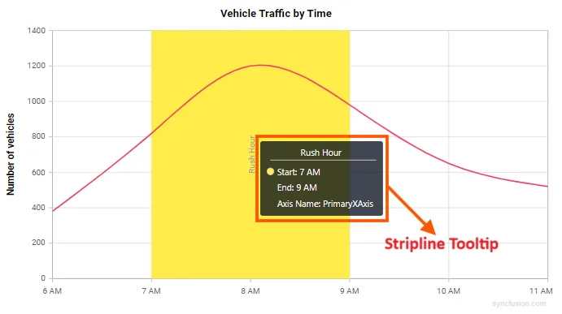
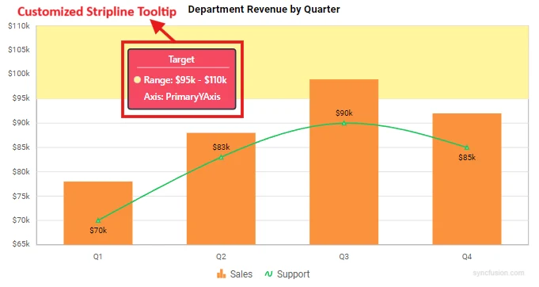

<!-- markdownlint-disable MD036 -->

# Blazor Charts Stripline

## Horizontal striplines

Add a [ChartStripline](https://help.syncfusion.com/cr/blazor/Syncfusion.Blazor.Charts.ChartStripline.html) to the vertical (Y) axis to create a horizontal stripline. Striplines are drawn in the provided start-to-end range, and an axis can have multiple striplines.

```cshtml

@using Syncfusion.Blazor.Charts

<SfChart>
    <ChartPrimaryXAxis ValueType="Syncfusion.Blazor.Charts.ValueType.Category"/>
    <ChartPrimaryYAxis>
        <ChartStriplines>
            <ChartStripline Start="20" End="25" Color="red"/>
            <ChartStripline Start="32" End="35" Color="blue"/>
        </ChartStriplines>
    </ChartPrimaryYAxis>
    <ChartSeriesCollection>
        <ChartSeries Type="ChartSeriesType.Column" DataSource="@WeatherReports" XName="X" YName="Y">
        </ChartSeries>
    </ChartSeriesCollection>
</SfChart>

@code {
    public class ChartData
    {
        public string X { get; set; }
        public double Y { get; set; }
    }

    public List<ChartData> WeatherReports = new List<ChartData>
	{
		new ChartData { X = "Sun", Y = 28 },
		new ChartData { X = "Mon", Y = 27 },
		new ChartData { X = "Tue", Y = 33 },
		new ChartData { X = "Wed", Y = 36 },
		new ChartData { X = "Thu", Y = 28 },
		new ChartData { X = "Fri", Y = 30 },
		new ChartData { X = "Sat", Y = 31 }
	};
}

```


## Vertical striplines

Add a [ChartStripline](https://help.syncfusion.com/cr/blazor/Syncfusion.Blazor.Charts.ChartStripline.html) to the horizontal (X) axis to create a vertical stripline. An axis can have multiple striplines drawn in the provided start-to-end range.

```cshtml

@using Syncfusion.Blazor.Charts

<SfChart>
    <ChartPrimaryXAxis ValueType="Syncfusion.Blazor.Charts.ValueType.Category">
        <ChartStriplines>
            <ChartStripline Start="2" End="3" Color="#EEFFCC" />
            <ChartStripline Start="4" End="5" Color="pink" />
        </ChartStriplines>
    </ChartPrimaryXAxis>

    <ChartSeriesCollection>
        <ChartSeries Type="ChartSeriesType.Column" DataSource="@WeatherReports" XName="X" YName="Y">
        </ChartSeries>
    </ChartSeriesCollection>
</SfChart>

@code {
    public class ChartData
    {
        public string X { get; set; }
        public double Y { get; set; }
    }

    public List<ChartData> WeatherReports = new List<ChartData>
    {
        new ChartData { X = "Sun", Y = 28 },
        new ChartData { X = "Mon", Y = 27 },
        new ChartData { X = "Tue", Y = 33 },
        new ChartData { X = "Wed", Y = 36 },
        new ChartData { X = "Thu", Y = 28 },
        new ChartData { X = "Fri", Y = 30 },
        new ChartData { X = "Sat", Y = 31 }
    };
}

```


## Stripline customization

The [Start](https://help.syncfusion.com/cr/blazor/Syncfusion.Blazor.Charts.ChartStripline.html#Syncfusion_Blazor_Charts_ChartStripline_Start) and [End](https://help.syncfusion.com/cr/blazor/Syncfusion.Blazor.Charts.ChartStripline.html#Syncfusion_Blazor_Charts_ChartStripline_End) properties define the stripline's range. Use [Size](https://help.syncfusion.com/cr/blazor/Syncfusion.Blazor.Charts.ChartStripline.html#Syncfusion_Blazor_Charts_ChartStripline_Size) and [Border](https://help.syncfusion.com/cr/blazor/Syncfusion.Blazor.Charts.ChartStripline.html#Syncfusion_Blazor_Charts_ChartStripline_Border) to customize the stripline's thickness and outline. Set [StartFromAxis](https://help.syncfusion.com/cr/blazor/Syncfusion.Blazor.Charts.ChartStripline.html#Syncfusion_Blazor_Charts_ChartStripline_StartFromAxis) to **true** to anchor the stripline at the axis origin. The [ZIndex](https://help.syncfusion.com/cr/blazor/Syncfusion.Blazor.Charts.ChartStripline.html#Syncfusion_Blazor_Charts_ChartStripline_ZIndex) property controls the rendering order so the stripline is drawn behind or in front of the series elements. [Opacity](https://help.syncfusion.com/cr/blazor/Syncfusion.Blazor.Charts.ChartStripline.html#Syncfusion_Blazor_Charts_ChartStripline_Opacity) controls the background transparency.

```cshtml

@using Syncfusion.Blazor.Charts

<SfChart>
    <ChartPrimaryXAxis ValueType="Syncfusion.Blazor.Charts.ValueType.Category">
        <ChartStriplines>
            <ChartStripline StartFromAxis="true" Size="4" ZIndex="ZIndex.Behind" Opacity="0.5" Color="green"/>
        </ChartStriplines>
    </ChartPrimaryXAxis>

    <ChartSeriesCollection>
        <ChartSeries Type="ChartSeriesType.Column" DataSource="@WeatherReports" XName="X" YName="Y">
        </ChartSeries>
    </ChartSeriesCollection>
</SfChart>

@code {

    public class ChartData
    {
        public string X { get; set; }
        public double Y { get; set; }
    }

    public List<ChartData> WeatherReports = new List<ChartData>
    {
        new ChartData { X = "Sun", Y = 28 },
        new ChartData { X = "Mon", Y = 27 },
        new ChartData { X = "Tue", Y = 33 },
        new ChartData { X = "Wed", Y = 36 },
        new ChartData { X = "Thu", Y = 28 },
        new ChartData { X = "Fri", Y = 30 },
        new ChartData { X = "Sat", Y = 31 }
    };
}

```


## Text customization

Use the [Text](https://help.syncfusion.com/cr/blazor/Syncfusion.Blazor.Charts.ChartStripline.html#Syncfusion_Blazor_Charts_ChartStripline_Text) property to add a label to a stripline. [TextStyle](https://help.syncfusion.com/cr/blazor/Syncfusion.Blazor.Charts.ChartStripline.html#Syncfusion_Blazor_Charts_ChartStripline_TextStyle) customizes the label's appearance, while [Rotation](https://help.syncfusion.com/cr/blazor/Syncfusion.Blazor.Charts.ChartStripline.html#Syncfusion_Blazor_Charts_ChartStripline_Rotation) rotates it. The [HorizontalAlignment](https://help.syncfusion.com/cr/blazor/Syncfusion.Blazor.Charts.ChartStripline.html#Syncfusion_Blazor_Charts_ChartStripline_HorizontalAlignment) and [VerticalAlignment](https://help.syncfusion.com/cr/blazor/Syncfusion.Blazor.Charts.ChartStripline.html#Syncfusion_Blazor_Charts_ChartStripline_VerticalAlignment) properties control the position of the stripline label.

```cshtml

@using Syncfusion.Blazor.Charts

<SfChart>
    <ChartPrimaryXAxis ValueType="Syncfusion.Blazor.Charts.ValueType.Category">
        <ChartStriplines>
            <ChartStripline StartFromAxis="true" Size="4" ZIndex="ZIndex.Behind" Opacity="0.5" Color="green" Text="Good"
                            HorizontalAlignment="Anchor.Middle" VerticalAlignment="Anchor.Middle">
                <ChartStriplineTextStyle Size="20px" Color="red"/>
            </ChartStripline>
        </ChartStriplines>
    </ChartPrimaryXAxis>

    <ChartSeriesCollection>
        <ChartSeries Type="ChartSeriesType.Column" DataSource="@WeatherReports" XName="X" YName="Y">
        </ChartSeries>
    </ChartSeriesCollection>
</SfChart>

@code {

    public class ChartData
    {
        public string X { get; set; }
        public double Y { get; set; }
    }

    public List<ChartData> WeatherReports = new List<ChartData>
    {
        new ChartData { X = "Sun", Y = 28 },
        new ChartData { X = "Mon", Y = 27 },
        new ChartData { X = "Tue", Y = 33 },
        new ChartData { X = "Wed", Y = 36 },
        new ChartData { X = "Thu", Y = 28 },
        new ChartData { X = "Fri", Y = 30 },
        new ChartData { X = "Sat", Y = 31 }
    };
}

```


## Segmented stripline

Use the [IsSegmented](https://help.syncfusion.com/cr/blazor/Syncfusion.Blazor.Charts.ChartStripline.html#Syncfusion_Blazor_Charts_ChartStripline_IsSegmented) property of the [ChartStripline](https://help.syncfusion.com/cr/blazor/Syncfusion.Blazor.Charts.ChartStripline.html) to limit a stripline to a specific segment of the opposite axis.

* [IsSegmented](https://help.syncfusion.com/cr/blazor/Syncfusion.Blazor.Charts.ChartStripline.html#Syncfusion_Blazor_Charts_ChartStripline_IsSegmented) - Enables the segmented stripline.
* [Start](https://help.syncfusion.com/cr/blazor/Syncfusion.Blazor.Charts.ChartStripline.html#Syncfusion_Blazor_Charts_ChartStripline_Start) - Sets the start of the stripline along its host axis.
* [End](https://help.syncfusion.com/cr/blazor/Syncfusion.Blazor.Charts.ChartStripline.html#Syncfusion_Blazor_Charts_ChartStripline_End) - Sets the end of the stripline along its host axis.
* [SegmentStart](https://help.syncfusion.com/cr/blazor/Syncfusion.Blazor.Charts.ChartStripline.html#Syncfusion_Blazor_Charts_ChartStripline_SegmentStart) - Sets the segment start on the axis named in [SegmentAxisName](https://help.syncfusion.com/cr/blazor/Syncfusion.Blazor.Charts.ChartStripline.html#Syncfusion_Blazor_Charts_ChartStripline_SegmentAxisName).
* [SegmentEnd](https://help.syncfusion.com/cr/blazor/Syncfusion.Blazor.Charts.ChartStripline.html#Syncfusion_Blazor_Charts_ChartStripline_SegmentEnd) - Sets the segment end on the axis named in [SegmentAxisName](https://help.syncfusion.com/cr/blazor/Syncfusion.Blazor.Charts.ChartStripline.html#Syncfusion_Blazor_Charts_ChartStripline_SegmentAxisName).
* [SegmentAxisName](https://help.syncfusion.com/cr/blazor/Syncfusion.Blazor.Charts.ChartStripline.html#Syncfusion_Blazor_Charts_ChartStripline_SegmentAxisName) - Specifies the name of the associated axis (for example, **PrimaryYAxis**).
* [Color](https://help.syncfusion.com/cr/blazor/Syncfusion.Blazor.Charts.ChartStripline.html#Syncfusion_Blazor_Charts_ChartStripline_Color) - Sets the color of the segment.
* [StartFromAxis](https://help.syncfusion.com/cr/blazor/Syncfusion.Blazor.Charts.ChartStripline.html#Syncfusion_Blazor_Charts_ChartStripline_StartFromAxis) - When **false**, the stripline is clipped to the segment range instead of running from the axis origin.

```cshtml

@using Syncfusion.Blazor.Charts

<SfChart>
    <ChartPrimaryXAxis Minimum="@Minimum" Maximum="@Maximum" LabelFormat="yyyy-MM-dd HH:mm:ss tt" Interval="5" IntervalType="IntervalType.Minutes" ValueType="Syncfusion.Blazor.Charts.ValueType.DateTime">
        <ChartStriplines>
            <ChartStripline Start="new DateTime(2016, 06, 13, 08, 00, 00)" End="new DateTime(2016, 06, 13, 08, 05, 00)" Color="#E0E0E0" IsSegmented="true" SegmentStart="1.8" SegmentAxisName="PrimaryYAxis" SegmentEnd="2.2" StartFromAxis="false" />
            <ChartStripline Start="new DateTime(2016, 06, 13, 08, 05, 00)" End="new DateTime(2016, 06, 13, 08, 10, 00)" Color="#C8C8C8" IsSegmented="true" SegmentStart="1.8" SegmentAxisName="PrimaryYAxis" SegmentEnd="2.2" StartFromAxis="false" />
            <ChartStripline Start="new DateTime(2016, 06, 13, 08, 10, 00)" End="new DateTime(2016, 06, 13, 08, 15, 00)" Color="#E0E0E0" IsSegmented="true" SegmentStart="1.8" SegmentAxisName="PrimaryYAxis" SegmentEnd="2.2" StartFromAxis="false" />
            <ChartStripline Start="new DateTime(2016, 06, 13, 08, 15, 00)" End="new DateTime(2016, 06, 13, 08, 20, 00)" Color="#6e6e6e" IsSegmented="true" SegmentStart="1.8" SegmentAxisName="PrimaryYAxis" SegmentEnd="2.2" StartFromAxis="false" />
        </ChartStriplines>
    </ChartPrimaryXAxis>
    <ChartPrimaryYAxis Interval="0.5" Minimum="0" Maximum="3.5"></ChartPrimaryYAxis>
    <ChartSeriesCollection>
        <ChartSeries Fill="blue" DataSource="@StepLineData" Width="2" XName="X" YName="Y" Type="ChartSeriesType.StepLine">
        </ChartSeries>
    </ChartSeriesCollection>
</SfChart>

@code {
    public DateTime Minimum { get; set; } = new DateTime(2016, 06, 13, 07, 55, 00);
    public DateTime Maximum { get; set; } = new DateTime(2016, 06, 13, 08, 25, 00);

    public class ChartData
    {
        public DateTime X { get; set; }
        public double Y { get; set; }
    }

    public List<ChartData> StepLineData = new List<ChartData>
    {
        new ChartData { X= new DateTime(2016, 06, 13,08,00,00), Y= 1 },
        new ChartData { X= new DateTime(2016, 06, 13,08,05,00), Y= 3 },
        new ChartData { X= new DateTime(2016, 06, 13,08,10,00), Y= 2 },
        new ChartData { X= new DateTime(2016, 06, 13,08,15,00), Y= 1 },
        new ChartData { X= new DateTime(2016, 06, 13,08,20,00), Y= 1 }
    };
}
```


## Stripline tooltip

Stripline tooltips display contextual information when the user hovers over a stripline. To enable a tooltip, add a [ChartStriplineTooltip](https://help.syncfusion.com/cr/blazor/Syncfusion.Blazor.Charts.ChartStriplineTooltip.html) inside the desired [ChartStripline](https://help.syncfusion.com/cr/blazor/Syncfusion.Blazor.Charts.ChartStripline.html) and set [Enable](https://help.syncfusion.com/cr/blazor/Syncfusion.Blazor.Charts.ChartStriplineTooltip.html#Syncfusion_Blazor_Charts_ChartStriplineTooltip_Enable) to **true**. This is useful for explaining the meaning of specific ranges or thresholds.

### Default stripline tooltip

The following example enables a stripline tooltip with default settings. The tooltip appears when the user hovers over the band.

```cshtml

@using Syncfusion.Blazor.Charts

@* Initialize the Chart to display vehicle traffic by time using a Spline series. *@
<SfChart Title="Vehicle Traffic by Time">
    <ChartPrimaryXAxis ValueType="Syncfusion.Blazor.Charts.ValueType.DateTime"
                       IntervalType="IntervalType.Hours"
                       LabelFormat="h tt">
        <ChartStriplines>

            @* Stripline: visual band marking Rush Hour on the X axis *@
            <ChartStripline Start="new DateTime(2024, 01, 01, 07, 00, 00)"
                            End="new DateTime(2024, 01, 01, 09, 00, 00)"
                            Text="Rush Hour"
                            Color="#FFED4A">

                @* Stripline Tooltip: shown when the user hovers over the band *@
                <ChartStriplineTooltip Enable="true"></ChartStriplineTooltip>
            </ChartStripline>
        </ChartStriplines>
    </ChartPrimaryXAxis>

    <ChartPrimaryYAxis Minimum="0" Maximum="1400" Interval="200" Title="Number of vehicles">
    </ChartPrimaryYAxis>

    <ChartSeriesCollection>
        <ChartSeries Type="ChartSeriesType.Spline"
                     DataSource="@Traffic"
                     XName="Time"
                     YName="Vehicles"
                     Width="2"
                     Fill="#F43F5E">
        </ChartSeries>
    </ChartSeriesCollection>
</SfChart>

@code {
    public class TrafficPoint
    {
        public DateTime Time { get; set; }
        public double Vehicles { get; set; }
    }

    public List<TrafficPoint> Traffic = new ()
    {
        new TrafficPoint { Time = new DateTime(2024, 01, 01, 06, 00, 00), Vehicles = 380 },
        new TrafficPoint { Time = new DateTime(2024, 01, 01, 07, 00, 00), Vehicles = 820 },
        new TrafficPoint { Time = new DateTime(2024, 01, 01, 08, 00, 00), Vehicles = 1200 },
        new TrafficPoint { Time = new DateTime(2024, 01, 01, 09, 00, 00), Vehicles = 980 },
        new TrafficPoint { Time = new DateTime(2024, 01, 01, 10, 00, 00), Vehicles = 650 },
        new TrafficPoint { Time = new DateTime(2024, 01, 01, 11, 00, 00), Vehicles = 520 }
    };
}

```



### Tooltip customization properties

The tooltip supports the following properties:

- [Enable](https://help.syncfusion.com/cr/blazor/Syncfusion.Blazor.Charts.ChartStriplineTooltip.html#Syncfusion_Blazor_Charts_ChartStriplineTooltip_Enable) - Enables or disables the stripline tooltip. Default is `false`.
- [Header](https://help.syncfusion.com/cr/blazor/Syncfusion.Blazor.Charts.ChartStriplineTooltip.html#Syncfusion_Blazor_Charts_ChartStriplineTooltip_Header) - Sets the title text shown at the top of the tooltip.
- [Content](https://help.syncfusion.com/cr/blazor/Syncfusion.Blazor.Charts.ChartStriplineTooltip.html#Syncfusion_Blazor_Charts_ChartStriplineTooltip_Content) - Specifies custom content for the tooltip body using a format string. The format supports token placeholders that are replaced with corresponding values at runtime:
  - **${stripline.text}** – The stripline label.
  - **${stripline.start}** – The stripline start value.
  - **${stripline.end}** – The stripline end value.
  - **${axis.name}** – The axis name.
  - **${stripline.segmentStart}** – The stripline segment start value (if applicable).
  - **${stripline.segmentEnd}** – The stripline segment end value (if applicable).
  - **${stripline.segmentAxisName}** – The stripline segment axis name (if applicable).
  - **${stripline.size}** – The stripline size (if applicable).
- [Fill](https://help.syncfusion.com/cr/blazor/Syncfusion.Blazor.Charts.ChartStriplineTooltip.html#Syncfusion_Blazor_Charts_ChartStriplineTooltip_Fill) - Sets the tooltip background color. Accepts any valid CSS color value (hex, rgb, rgba, or named color).
- [Opacity](https://help.syncfusion.com/cr/blazor/Syncfusion.Blazor.Charts.ChartStriplineTooltip.html#Syncfusion_Blazor_Charts_ChartStriplineTooltip_Opacity) - Sets the tooltip background transparency. Accepts a value between `0` (transparent) and `1` (opaque). Default is `0.75`.
- [ShowHeaderLine](https://help.syncfusion.com/cr/blazor/Syncfusion.Blazor.Charts.ChartStriplineTooltip.html#Syncfusion_Blazor_Charts_ChartStriplineTooltip_ShowHeaderLine) - Shows or hides the horizontal separator between the tooltip header and content.

#### Text style

Use the [ChartStriplineTooltipTextStyle](https://help.syncfusion.com/cr/blazor/Syncfusion.Blazor.Charts.ChartStriplineTooltipTextStyle.html) component to customize the tooltip text:

- [Size](https://help.syncfusion.com/cr/blazor/Syncfusion.Blazor.Charts.ChartStriplineTooltipTextStyle.html#Syncfusion_Blazor_Charts_ChartStriplineTooltipTextStyle_Size) - Font size in pixels (for example, `12px`).
- [Color](https://help.syncfusion.com/cr/blazor/Syncfusion.Blazor.Charts.ChartStriplineTooltipTextStyle.html#Syncfusion_Blazor_Charts_ChartStriplineTooltipTextStyle_Color) - Text color. Accepts any valid CSS color value.
- [FontFamily](https://help.syncfusion.com/cr/blazor/Syncfusion.Blazor.Charts.ChartStriplineTooltipTextStyle.html#Syncfusion_Blazor_Charts_ChartStriplineTooltipTextStyle_FontFamily) - Font family (for example, `Arial`, `Segoe UI`, `Roboto`).
- [FontWeight](https://help.syncfusion.com/cr/blazor/Syncfusion.Blazor.Charts.ChartStriplineTooltipTextStyle.html#Syncfusion_Blazor_Charts_ChartStriplineTooltipTextStyle_FontWeight) - Text thickness.

#### Border

Use the [ChartStriplineTooltipBorder](https://help.syncfusion.com/cr/blazor/Syncfusion.Blazor.Charts.ChartStriplineTooltipBorder.html) component to add and style the tooltip border:

- [Width](https://help.syncfusion.com/cr/blazor/Syncfusion.Blazor.Charts.ChartStriplineTooltipBorder.html#Syncfusion_Blazor_Charts_ChartStriplineTooltipBorder_Width) - Border thickness in pixels. Default is `0`.
- [Color](https://help.syncfusion.com/cr/blazor/Syncfusion.Blazor.Charts.ChartStriplineTooltipBorder.html#Syncfusion_Blazor_Charts_ChartStriplineTooltipBorder_Color) - Border color. Accepts any valid CSS color value.

### Customized stripline tooltip

```cshtml

@using Syncfusion.Blazor.Charts

@* Initialize the Chart to display department revenue by quarter using Column and Spline series. *@
<SfChart Title="Department Revenue by Quarter">
    <ChartPrimaryXAxis ValueType="Syncfusion.Blazor.Charts.ValueType.Category">
        <ChartAxisMajorGridLines Width="0"></ChartAxisMajorGridLines>
        <ChartAxisMajorTickLines Width="0"></ChartAxisMajorTickLines>
    </ChartPrimaryXAxis>

    <ChartPrimaryYAxis Minimum="65" Maximum="110" Interval="5" LabelFormat="${value}k" RangePadding="ChartRangePadding.None">
        <ChartAxisMajorTickLines Width="0"></ChartAxisMajorTickLines>
        <ChartStriplines>

            @* Stripline: Highlights the upper revenue target range from 95k to 110k with text style and border customization. *@
            <ChartStripline Start="95" End="110" Text="Target Band" Color="#FFF59E" HorizontalAlignment="Anchor.Middle">
                <ChartStriplineTextStyle Size="12px" Color="#0b3a66" FontWeight="600"></ChartStriplineTextStyle>
                <ChartStriplineBorder Width="0"></ChartStriplineBorder>

                @* Stripline Tooltip: provides interactive context for the target band on hover *@
                <ChartStriplineTooltip Enable="true"
                                       Header="Target"
                                       Content="Range: ${stripline.start} - ${stripline.end}<br/>Axis: ${axis.name}<br/>Label: ${stripline.text}"
                                       Fill="#F43F5E"
                                       Opacity="0.95"
                                       ShowHeaderLine="true">
                    <ChartStriplineTooltipTextStyle Size="14px" Color="#FFFFFF" FontWeight="600" FontFamily="Segoe UI"></ChartStriplineTooltipTextStyle>
                    <ChartStriplineTooltipBorder Width="2" Color="#1F2937"></ChartStriplineTooltipBorder>
                </ChartStriplineTooltip>
            </ChartStripline>
        </ChartStriplines>
    </ChartPrimaryYAxis>

    <ChartSeriesCollection>
        <ChartSeries Name="Sales" Type="ChartSeriesType.Column" DataSource="@SalesData" XName="Quarter" YName="Revenue" ColumnSpacing="0.2" Width="2" Fill="#FB923C">
            <ChartMarker Visible="false"></ChartMarker>
        </ChartSeries>
        <ChartSeries Name="Support" Type="ChartSeriesType.Spline" DataSource="@SupportData" XName="Quarter" YName="Revenue" Width="2" Fill="#22C55E">
            <ChartMarker Visible="true">
                <ChartDataLabel Visible="true"></ChartDataLabel>
            </ChartMarker>
        </ChartSeries>
    </ChartSeriesCollection>

    <ChartLegendSettings Visible="true" EnableHighlight="true"></ChartLegendSettings>
</SfChart>

@code {
    public class RevenuePoint
    {
        public string Quarter { get; set; }
        public double Revenue { get; set; }
    }

    public List<RevenuePoint> SalesData = new ()
    {
        new RevenuePoint { Quarter = "Q1", Revenue = 78 },
        new RevenuePoint { Quarter = "Q2", Revenue = 88 },
        new RevenuePoint { Quarter = "Q3", Revenue = 99 },
        new RevenuePoint { Quarter = "Q4", Revenue = 92 }
    };

    public List<RevenuePoint> SupportData = new ()
    {
        new RevenuePoint { Quarter = "Q1", Revenue = 70 },
        new RevenuePoint { Quarter = "Q2", Revenue = 83 },
        new RevenuePoint { Quarter = "Q3", Revenue = 90 },
        new RevenuePoint { Quarter = "Q4", Revenue = 85 }
    };
}

```



N> See the [Blazor Charts demo](https://blazor.syncfusion.com/demos/chart/line?theme=fluent2) for striplines combined with other series types, or explore related axis features such as [Multiple panes](./multiple-panes), [Crosshair and trackball](./cross-hair-and-track-ball), and [Chart appearance](./chart-appearance).

## See also

* [Data labels](./data-labels)
* [Tooltip](./tool-tip)
* [Data markers](./data-markers)
* [Multiple panes](./multiple-panes)
* [Crosshair and trackball](./cross-hair-and-track-ball)