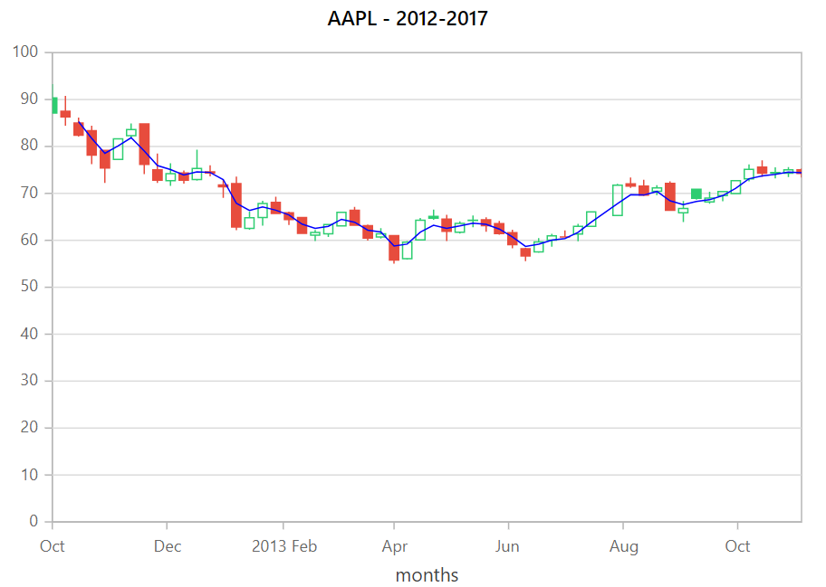
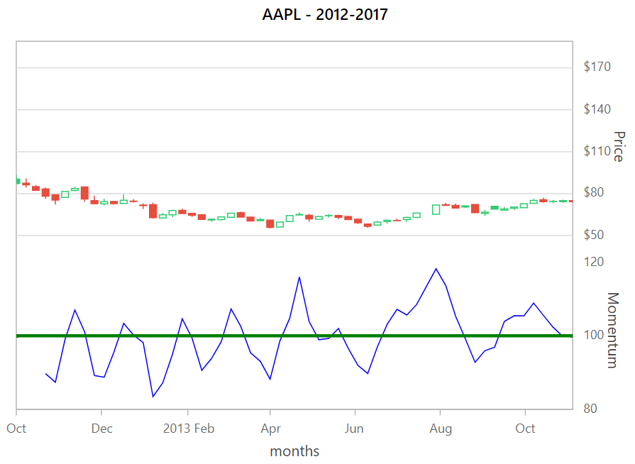
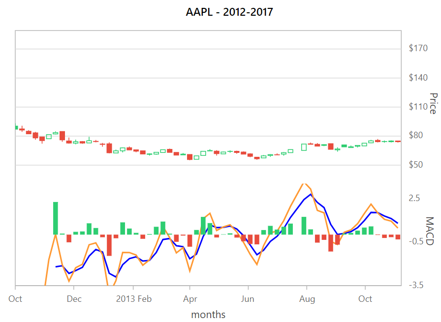
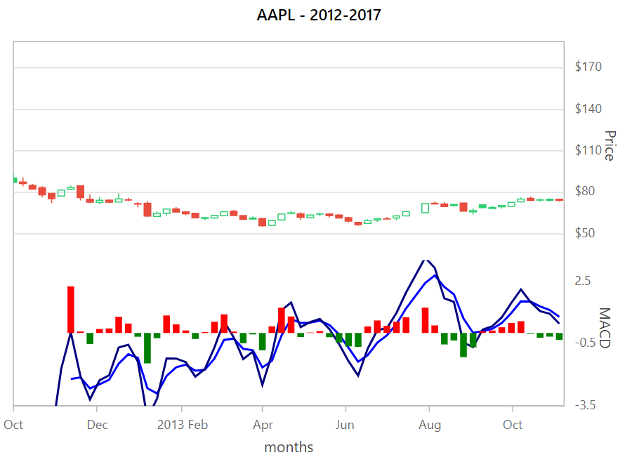
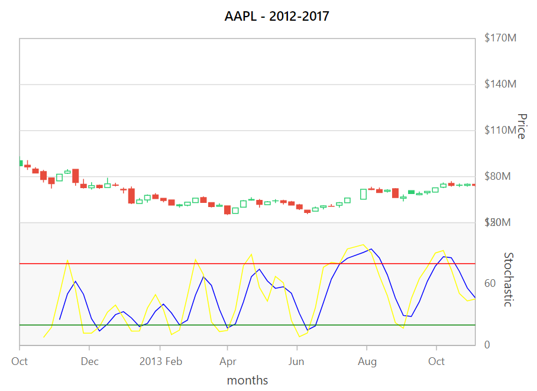
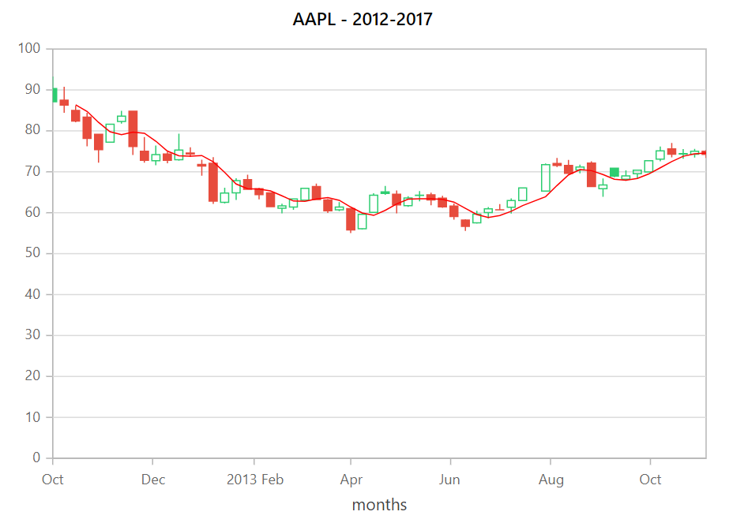

<!-- markdownlint-disable MD036 -->

# Technical Indicators in Blazor Charts Component

A technical indicator is a mathematical calculation that forecasts financial market direction using historical price, volume, or open interest data. There are 10 different types of technical indicators that can be used with the chart.

## Accumulation Distribution

Accumulation Distribution combines price and volume to show how money may be flowing into or out of stock. To render an Accumulation Distribution Indicator, set the indicator [Type](https://help.syncfusion.com/cr/blazor/Syncfusion.Blazor.Charts.TechnicalIndicators.html) as [AccumulationDistribution](https://help.syncfusion.com/cr/blazor/Syncfusion.Blazor.Charts.TechnicalIndicators.html#Syncfusion_Blazor_Charts_TechnicalIndicators_AccumulationDistribution). To calculate the signal line [Volume](https://help.syncfusion.com/cr/blazor/Syncfusion.Blazor.Charts.ChartIndicator.html#Syncfusion_Blazor_Charts_ChartIndicator_Volume) field is additionally added with [DataSource](https://help.syncfusion.com/cr/blazor/Syncfusion.Blazor.Charts.ChartIndicator.html#Syncfusion_Blazor_Charts_ChartIndicator_DataSource).

```cshtml

@using Syncfusion.Blazor.Charts

<SfChart Title="AAPL - 2012-2017">
    <ChartAxes>
        <ChartAxis Name="secondary" OpposedPosition="true" RowIndex="0" Minimum="-7000000000" Maximum="5000000000" Title="Accumulation Distribution" Interval="6000000000"></ChartAxis>
    </ChartAxes>

    <ChartPrimaryXAxis ValueType="Syncfusion.Blazor.Charts.ValueType.DateTime" Title="months" IntervalType="IntervalType.Months">
        <ChartAxisMajorGridLines Width="0"></ChartAxisMajorGridLines>
        <ChartAxisCrosshairTooltip Enable="true"></ChartAxisCrosshairTooltip>
    </ChartPrimaryXAxis>

    <ChartSeriesCollection>
        <ChartSeries DataSource="@StockDetails" Name="Apple Inc" XName="X"  Low="Low" High="High" Close="Close" Volume="Volume" Open="Open"
                     Width="2" Type="ChartSeriesType.Candle">
        </ChartSeries>
    </ChartSeriesCollection>

    <ChartIndicators>
        <ChartIndicator Type="TechnicalIndicators.AccumulationDistribution" Field="FinancialDataFields.Close" SeriesName="Apple Inc" YAxisName="secondary" Fill="#6063ff" Period=3>
        </ChartIndicator>
    </ChartIndicators>
</SfChart>

@code{

    public class Data
    {
        public DateTime X { get; set; }
        public double High { get; set; }
        public double Low { get; set; }
        public double Open { get; set; }
        public double Close { get; set; }
        public double Volume { get; set; }
    }

    public List<Data> StockDetails = new List<Data>
	{
        new Data{X= new DateTime(2012,10,15), Open= 90.3357, High= 93.2557, Low= 87.0885,Close= 87.12,Volume= 646996264},
        new Data{X= new DateTime(2012,10,22), Open= 87.4885, High= 90.7685, Low= 84.4285,Close= 86.2857,Volume= 866040680 },
        new Data{X= new DateTime(2012,10,29), Open= 84.9828, High= 86.1428, Low= 82.1071,Close= 82.4,Volume= 367371310},
        new Data{X= new DateTime(2012,11,05), Open= 83.3593, High= 84.3914, Low= 76.2457,Close= 78.1514,Volume= 919719846},
        new Data{X= new DateTime(2012,11,12), Open= 79.1643, High= 79.2143, Low= 72.25,Close= 75.3825,Volume= 894382149},
        new Data{X= new DateTime(2012,11,19), Open= 77.2443, High= 81.7143, Low= 77.1257,Close= 81.6428,Volume= 527416747},
        new Data{X= new DateTime(2012,11,26), Open= 82.2714, High= 84.8928, Low= 81.7514,Close= 83.6114,Volume= 646467974},
        new Data{X= new DateTime(2012,12,03), Open= 84.8071, High= 84.9414, Low= 74.09,Close= 76.1785,Volume= 980096264},
        new Data{X= new DateTime(2012,12,10), Open= 75, High= 78.5085, Low= 72.2257,Close= 72.8277,Volume= 835016110},
        new Data{X= new DateTime(2012,12,17), Open= 72.7043, High= 76.4143, Low= 71.6043,Close= 74.19,Volume= 726150329},
        new Data{X= new DateTime(2012,12,24), Open= 74.3357, High= 74.8928, Low= 72.0943,Close= 72.7984,Volume= 321104733},
        new Data{X= new DateTime(2012,12,31), Open= 72.9328, High= 79.2857, Low= 72.7143,Close= 75.2857,Volume= 540854882},
        new Data{X= new DateTime(2013,01,07), Open= 74.5714, High= 75.9843, Low= 73.6,Close= 74.3285,Volume= 574594262},
        new Data{X= new DateTime(2013,01,14), Open= 71.8114, High= 72.9643, Low= 69.0543,Close= 71.4285,Volume= 803105621},
        new Data{X= new DateTime(2013,01,21), Open= 72.08, High= 73.57, Low= 62.1428,Close= 62.84,Volume= 971912560},
        new Data{X= new DateTime(2013,01,28), Open= 62.5464, High= 66.0857, Low= 62.2657,Close= 64.8028,Volume= 656549587},
        new Data{X= new DateTime(2013,02,04), Open= 64.8443, High= 68.4014, Low= 63.1428,Close= 67.8543,Volume= 743778993},
        new Data{X= new DateTime(2013,02,11), Open= 68.0714, High= 69.2771, Low= 65.7028,Close= 65.7371,Volume= 585292366},
        new Data{X= new DateTime(2013,02,18), Open= 65.8714, High= 66.1043, Low= 63.26,Close= 64.4014,Volume= 421766997},
        new Data{X= new DateTime(2013,02,25), Open= 64.8357, High= 65.0171, Low= 61.4257,Close= 61.4957,Volume= 582741215},
        new Data{X= new DateTime(2013,03,04), Open= 61.1143, High= 62.2043, Low= 59.8571,Close= 61.6743,Volume= 632856539},
        new Data{X= new DateTime(2013,03,11), Open= 61.3928, High= 63.4614, Low= 60.7343,Close= 63.38,Volume= 572066981},
        new Data{X= new DateTime(2013,03,18), Open= 63.0643, High= 66.0143, Low= 63.0286,Close= 65.9871,Volume= 552156035},
        new Data{X= new DateTime(2013,03,25), Open= 66.3843, High= 67.1357, Low= 63.0886,Close= 63.2371,Volume= 390762517},
        new Data{X= new DateTime(2013,04,01), Open= 63.1286, High= 63.3854, Low= 59.9543,Close= 60.4571,Volume= 505273732},
        new Data{X= new DateTime(2013,04,08), Open= 60.6928, High= 62.57, Low= 60.3557,Close= 61.4,Volume= 387323550},
        new Data{X= new DateTime(2013,04,15), Open= 61, High= 61.1271, Low= 55.0143,Close= 55.79,Volume= 709945604},
        new Data{X= new DateTime(2013,04,22), Open= 56.0914, High= 59.8241, Low= 55.8964,Close= 59.6007,Volume= 787007506},
        new Data{X= new DateTime(2013,04,29), Open= 60.0643, High= 64.7471, Low= 60,Close= 64.2828,Volume= 655020017},
        new Data{X= new DateTime(2013,05,06), Open= 65.1014, High= 66.5357, Low= 64.3543,Close= 64.71,Volume= 545488533},
        new Data{X= new DateTime(2013,05,13), Open= 64.5014, High= 65.4143, Low= 59.8428,Close= 61.8943,Volume= 633706550},
        new Data{X= new DateTime(2013,05,20), Open= 61.7014, High= 64.05, Low= 61.4428,Close= 63.5928,Volume= 494379068},
        new Data{X= new DateTime(2013,05,27), Open= 64.2714, High= 65.3, Low= 62.7714,Close= 64.2478,Volume= 362907830},
        new Data{X= new DateTime(2013,06,03), Open= 64.39, High= 64.9186, Low= 61.8243,Close= 63.1158,Volume= 443249793},
        new Data{X= new DateTime(2013,06,10), Open= 63.5328, High= 64.1541, Low= 61.2143,Close= 61.4357,Volume= 389680092},
        new Data{X= new DateTime(2013,06,17), Open= 61.6343, High= 62.2428, Low= 58.3,Close= 59.0714,Volume= 400384818},
        new Data{X= new DateTime(2013,06,24), Open= 58.2, High= 58.38, Low= 55.5528,Close= 56.6471,Volume= 519314826},
        new Data{X= new DateTime(2013,07,01), Open= 57.5271, High= 60.47, Low= 57.3171,Close= 59.6314,Volume= 343878841},
        new Data{X= new DateTime(2013,07,08), Open= 60.0157, High= 61.3986, Low= 58.6257,Close= 60.93,Volume= 384106977},
        new Data{X= new DateTime(2013,07,15), Open= 60.7157, High= 62.1243, Low= 60.5957,Close= 60.7071,Volume= 286035513},
        new Data{X= new DateTime(2013,07,22), Open= 61.3514, High= 63.5128, Low= 59.8157,Close= 62.9986,Volume= 395816827},
        new Data{X= new DateTime(2013,07,29), Open= 62.9714, High= 66.1214, Low= 62.8857,Close= 66.0771,Volume= 339668858},
        new Data{X= new DateTime(2013,08,12), Open= 65.2657, High= 72.0357, Low= 65.2328,Close= 71.7614,Volume= 711563584},
        new Data{X= new DateTime(2013,08,19), Open= 72.0485, High= 73.3914, Low= 71.1714,Close= 71.5743,Volume= 417119660},
        new Data{X= new DateTime(2013,08,26), Open= 71.5357, High= 72.8857, Low= 69.4286,Close= 69.6023,Volume= 392805888},
        new Data{X= new DateTime(2013,09,02), Open= 70.4428, High= 71.7485, Low= 69.6214,Close= 71.1743,Volume= 317244380},
        new Data{X= new DateTime(2013,09,09), Open= 72.1428, High= 72.56, Low= 66.3857,Close= 66.4143,Volume= 669376320},
        new Data{X= new DateTime(2013,09,16), Open= 65.8571, High= 68.3643, Low= 63.8886,Close= 66.7728,Volume= 625142677},
        new Data{X= new DateTime(2013,09,23), Open= 70.8714, High= 70.9871, Low= 68.6743,Close= 68.9643,Volume= 475274537},
        new Data{X= new DateTime(2013,09,30), Open= 68.1786, High= 70.3357, Low= 67.773,Close= 69.0043,Volume= 368198906},
        new Data{X= new DateTime(2013,10,07), Open= 69.5086, High= 70.5486, Low= 68.3257,Close= 70.4017,Volume= 361437661},
        new Data{X= new DateTime(2013,10,14), Open= 69.9757, High= 72.7514, Low= 69.9071,Close= 72.6985,Volume= 342694379},
        new Data{X= new DateTime(2013,10,21), Open= 73.11, High= 76.1757, Low= 72.5757,Close= 75.1368,Volume= 490458997},
        new Data{X= new DateTime(2013,10,28), Open= 75.5771, High= 77.0357, Low= 73.5057,Close= 74.29,Volume= 508130174},
        new Data{X= new DateTime(2013,11,04), Open= 74.4428, High= 75.555, Low= 73.1971,Close= 74.3657,Volume= 318132218},
        new Data{X= new DateTime(2013,11,11), Open= 74.2843, High= 75.6114, Low= 73.4871,Close= 74.9987,Volume= 306711021},
        new Data{X= new DateTime(2013,11,18), Open= 74.9985, High= 75.3128, Low= 73.3814,Close= 74.2571,Volume= 282778778},
    };
}

```


## Average True Range (ATR)

Average True Range (ATR) measures the stock volatility by comparing the current value with the previous value. To render an Average True Range (ATR) Indicator, set the indicator [Type](https://help.syncfusion.com/cr/blazor/Syncfusion.Blazor.Charts.ChartIndicator.html#Syncfusion_Blazor_Charts_ChartIndicator_Type) as [Atr](https://help.syncfusion.com/cr/blazor/Syncfusion.Blazor.Charts.TechnicalIndicators.html#Syncfusion_Blazor_Charts_TechnicalIndicators_Atr).

```cshtml

@using Syncfusion.Blazor.Charts

<SfChart Title="AAPL - 2012-2017">
    <ChartAxes>
        <ChartAxis Name="secondary" OpposedPosition="true" RowIndex="0" Minimum="-7000000000" Maximum="5000000000" Title="Accumulation Distribution" Interval="6000000000"></ChartAxis>
    </ChartAxes>

    <ChartPrimaryXAxis ValueType="Syncfusion.Blazor.Charts.ValueType.DateTime" Title="months" IntervalType="IntervalType.Months">
        <ChartAxisMajorGridLines Width="0"></ChartAxisMajorGridLines>
        <ChartAxisCrosshairTooltip Enable="true"></ChartAxisCrosshairTooltip>
    </ChartPrimaryXAxis>

    <ChartSeriesCollection>
        <ChartSeries DataSource="@StockDetails" XName="X" YName="Y" Low="Low" High="High" Close="Close" Volume="Volume" Open="Open"
                     Width="2" Name="Apple Inc" Type="ChartSeriesType.Candle">
        </ChartSeries>
    </ChartSeriesCollection>

    <ChartIndicators>
        <ChartIndicator Type="TechnicalIndicators.Atr" Field="FinancialDataFields.Low" SeriesName="Apple Inc" YAxisName="secondary" Fill="#6063ff" Period=3>
        </ChartIndicator>
    </ChartIndicators>
</SfChart>
@code{

    public class Data
    {
        public DateTime X { get; set; }
        public double High { get; set; }
        public double Low { get; set; }
        public double Open { get; set; }
        public double Close { get; set; }
        public double Volume { get; set; }
    }

    public List<Data> StockDetails = new List<Data>
	{
        new Data{X= new DateTime(2012,10,15), Open= 90.3357, High= 93.2557, Low= 87.0885,Close= 87.12,Volume= 646996264},
        new Data{X= new DateTime(2012,10,22), Open= 87.4885, High= 90.7685, Low= 84.4285,Close= 86.2857,Volume= 866040680 },
        new Data{X= new DateTime(2012,10,29), Open= 84.9828, High= 86.1428, Low= 82.1071,Close= 82.4,Volume= 367371310},
        new Data{X= new DateTime(2012,11,05), Open= 83.3593, High= 84.3914, Low= 76.2457,Close= 78.1514,Volume= 919719846},
        new Data{X= new DateTime(2012,11,12), Open= 79.1643, High= 79.2143, Low= 72.25,Close= 75.3825,Volume= 894382149},
        new Data{X= new DateTime(2012,11,19), Open= 77.2443, High= 81.7143, Low= 77.1257,Close= 81.6428,Volume= 527416747},
        new Data{X= new DateTime(2012,11,26), Open= 82.2714, High= 84.8928, Low= 81.7514,Close= 83.6114,Volume= 646467974},
        new Data{X= new DateTime(2012,12,03), Open= 84.8071, High= 84.9414, Low= 74.09,Close= 76.1785,Volume= 980096264},
        new Data{X= new DateTime(2012,12,10), Open= 75, High= 78.5085, Low= 72.2257,Close= 72.8277,Volume= 835016110},
        new Data{X= new DateTime(2012,12,17), Open= 72.7043, High= 76.4143, Low= 71.6043,Close= 74.19,Volume= 726150329},
        new Data{X= new DateTime(2012,12,24), Open= 74.3357, High= 74.8928, Low= 72.0943,Close= 72.7984,Volume= 321104733},
        new Data{X= new DateTime(2012,12,31), Open= 72.9328, High= 79.2857, Low= 72.7143,Close= 75.2857,Volume= 540854882},
        new Data{X= new DateTime(2013,01,07), Open= 74.5714, High= 75.9843, Low= 73.6,Close= 74.3285,Volume= 574594262},
        new Data{X= new DateTime(2013,01,14), Open= 71.8114, High= 72.9643, Low= 69.0543,Close= 71.4285,Volume= 803105621},
        new Data{X= new DateTime(2013,01,21), Open= 72.08, High= 73.57, Low= 62.1428,Close= 62.84,Volume= 971912560},
        new Data{X= new DateTime(2013,01,28), Open= 62.5464, High= 66.0857, Low= 62.2657,Close= 64.8028,Volume= 656549587},
        new Data{X= new DateTime(2013,02,04), Open= 64.8443, High= 68.4014, Low= 63.1428,Close= 67.8543,Volume= 743778993},
        new Data{X= new DateTime(2013,02,11), Open= 68.0714, High= 69.2771, Low= 65.7028,Close= 65.7371,Volume= 585292366},
        new Data{X= new DateTime(2013,02,18), Open= 65.8714, High= 66.1043, Low= 63.26,Close= 64.4014,Volume= 421766997},
        new Data{X= new DateTime(2013,02,25), Open= 64.8357, High= 65.0171, Low= 61.4257,Close= 61.4957,Volume= 582741215},
        new Data{X= new DateTime(2013,03,04), Open= 61.1143, High= 62.2043, Low= 59.8571,Close= 61.6743,Volume= 632856539},
        new Data{X= new DateTime(2013,03,11), Open= 61.3928, High= 63.4614, Low= 60.7343,Close= 63.38,Volume= 572066981},
        new Data{X= new DateTime(2013,03,18), Open= 63.0643, High= 66.0143, Low= 63.0286,Close= 65.9871,Volume= 552156035},
        new Data{X= new DateTime(2013,03,25), Open= 66.3843, High= 67.1357, Low= 63.0886,Close= 63.2371,Volume= 390762517},
        new Data{X= new DateTime(2013,04,01), Open= 63.1286, High= 63.3854, Low= 59.9543,Close= 60.4571,Volume= 505273732},
        new Data{X= new DateTime(2013,04,08), Open= 60.6928, High= 62.57, Low= 60.3557,Close= 61.4,Volume= 387323550},
        new Data{X= new DateTime(2013,04,15), Open= 61, High= 61.1271, Low= 55.0143,Close= 55.79,Volume= 709945604},
        new Data{X= new DateTime(2013,04,22), Open= 56.0914, High= 59.8241, Low= 55.8964,Close= 59.6007,Volume= 787007506},
        new Data{X= new DateTime(2013,04,29), Open= 60.0643, High= 64.7471, Low= 60,Close= 64.2828,Volume= 655020017},
        new Data{X= new DateTime(2013,05,06), Open= 65.1014, High= 66.5357, Low= 64.3543,Close= 64.71,Volume= 545488533},
        new Data{X= new DateTime(2013,05,13), Open= 64.5014, High= 65.4143, Low= 59.8428,Close= 61.8943,Volume= 633706550},
        new Data{X= new DateTime(2013,05,20), Open= 61.7014, High= 64.05, Low= 61.4428,Close= 63.5928,Volume= 494379068},
        new Data{X= new DateTime(2013,05,27), Open= 64.2714, High= 65.3, Low= 62.7714,Close= 64.2478,Volume= 362907830},
        new Data{X= new DateTime(2013,06,03), Open= 64.39, High= 64.9186, Low= 61.8243,Close= 63.1158,Volume= 443249793},
        new Data{X= new DateTime(2013,06,10), Open= 63.5328, High= 64.1541, Low= 61.2143,Close= 61.4357,Volume= 389680092},
        new Data{X= new DateTime(2013,06,17), Open= 61.6343, High= 62.2428, Low= 58.3,Close= 59.0714,Volume= 400384818},
        new Data{X= new DateTime(2013,06,24), Open= 58.2, High= 58.38, Low= 55.5528,Close= 56.6471,Volume= 519314826},
        new Data{X= new DateTime(2013,07,01), Open= 57.5271, High= 60.47, Low= 57.3171,Close= 59.6314,Volume= 343878841},
        new Data{X= new DateTime(2013,07,08), Open= 60.0157, High= 61.3986, Low= 58.6257,Close= 60.93,Volume= 384106977},
        new Data{X= new DateTime(2013,07,15), Open= 60.7157, High= 62.1243, Low= 60.5957,Close= 60.7071,Volume= 286035513},
        new Data{X= new DateTime(2013,07,22), Open= 61.3514, High= 63.5128, Low= 59.8157,Close= 62.9986,Volume= 395816827},
        new Data{X= new DateTime(2013,07,29), Open= 62.9714, High= 66.1214, Low= 62.8857,Close= 66.0771,Volume= 339668858},
        new Data{X= new DateTime(2013,08,12), Open= 65.2657, High= 72.0357, Low= 65.2328,Close= 71.7614,Volume= 711563584},
        new Data{X= new DateTime(2013,08,19), Open= 72.0485, High= 73.3914, Low= 71.1714,Close= 71.5743,Volume= 417119660},
        new Data{X= new DateTime(2013,08,26), Open= 71.5357, High= 72.8857, Low= 69.4286,Close= 69.6023,Volume= 392805888},
        new Data{X= new DateTime(2013,09,02), Open= 70.4428, High= 71.7485, Low= 69.6214,Close= 71.1743,Volume= 317244380},
        new Data{X= new DateTime(2013,09,09), Open= 72.1428, High= 72.56, Low= 66.3857,Close= 66.4143,Volume= 669376320},
        new Data{X= new DateTime(2013,09,16), Open= 65.8571, High= 68.3643, Low= 63.8886,Close= 66.7728,Volume= 625142677},
        new Data{X= new DateTime(2013,09,23), Open= 70.8714, High= 70.9871, Low= 68.6743,Close= 68.9643,Volume= 475274537},
        new Data{X= new DateTime(2013,09,30), Open= 68.1786, High= 70.3357, Low= 67.773,Close= 69.0043,Volume= 368198906},
        new Data{X= new DateTime(2013,10,07), Open= 69.5086, High= 70.5486, Low= 68.3257,Close= 70.4017,Volume= 361437661},
        new Data{X= new DateTime(2013,10,14), Open= 69.9757, High= 72.7514, Low= 69.9071,Close= 72.6985,Volume= 342694379},
        new Data{X= new DateTime(2013,10,21), Open= 73.11, High= 76.1757, Low= 72.5757,Close= 75.1368,Volume= 490458997},
        new Data{X= new DateTime(2013,10,28), Open= 75.5771, High= 77.0357, Low= 73.5057,Close= 74.29,Volume= 508130174},
        new Data{X= new DateTime(2013,11,04), Open= 74.4428, High= 75.555, Low= 73.1971,Close= 74.3657,Volume= 318132218},
        new Data{X= new DateTime(2013,11,11), Open= 74.2843, High= 75.6114, Low= 73.4871,Close= 74.9987,Volume= 306711021},
        new Data{X= new DateTime(2013,11,18), Open= 74.9985, High= 75.3128, Low= 73.3814,Close= 74.2571,Volume= 282778778},
    };
}

```

## Bollinger Bands

A chart overlay that shows the upper and lower limits of normal price movements based on the standard deviation of prices. To render Bollinger Bands, set indicator [Type](https://help.syncfusion.com/cr/blazor/Syncfusion.Blazor.Charts.ChartIndicator.html#Syncfusion_Blazor_Charts_ChartIndicator_Type) as [BollingerBands](https://help.syncfusion.com/cr/blazor/Syncfusion.Blazor.Charts.TechnicalIndicators.html#Syncfusion_Blazor_Charts_TechnicalIndicators_BollingerBands). Bollinger Bands will be represented by three lines - upper line, lower line, and signal line. In Bollinger Bands, default value of the [Period](https://help.syncfusion.com/cr/blazor/Syncfusion.Blazor.Charts.ChartIndicator.html#Syncfusion_Blazor_Charts_ChartIndicator_Period) is **14** and the [StandardDeviations](https://help.syncfusion.com/cr/blazor/Syncfusion.Blazor.Charts.ChartIndicator.html#Syncfusion_Blazor_Charts_ChartIndicator_StandardDeviation) is **2**.

```cshtml

@using Syncfusion.Blazor.Charts

<SfChart Title="AAPL - 2012-2017">
    <ChartPrimaryXAxis ValueType="Syncfusion.Blazor.Charts.ValueType.DateTime" Title="months" IntervalType="IntervalType.Months">
        <ChartAxisMajorGridLines Width="0"></ChartAxisMajorGridLines>
        <ChartAxisCrosshairTooltip Enable="true"></ChartAxisCrosshairTooltip>
    </ChartPrimaryXAxis>

    <ChartSeriesCollection>
        <ChartSeries DataSource="@StockDetails" XName="X" YName="Y" Low="Low" High="High" Close="Close" Volume="Volume" Open="Open"
                     Width="2" Name="Apple Inc" Type="ChartSeriesType.Candle">
        </ChartSeries>
    </ChartSeriesCollection>

    <ChartIndicators>
        <ChartIndicator Type="TechnicalIndicators.BollingerBands" Field="FinancialDataFields.Close" SeriesName="Apple Inc" Fill="#6063ff" Period=3>
            <ChartIndicatorUpperLine Color="Orange"></ChartIndicatorUpperLine>
            <ChartIndicatorLowerLine Color="Yellow"></ChartIndicatorLowerLine>
        </ChartIndicator>
    </ChartIndicators>
</SfChart>
@code{

    public class Data
    {
        public DateTime X { get; set; }
        public double High { get; set; }
        public double Low { get; set; }
        public double Open { get; set; }
        public double Close { get; set; }
        public double Volume { get; set; }
    }

    public List<Data> StockDetails = new List<Data>
	{
        new Data{X= new DateTime(2012,10,15), Open= 90.3357, High= 93.2557, Low= 87.0885,Close= 87.12,Volume= 646996264},
        new Data{X= new DateTime(2012,10,22), Open= 87.4885, High= 90.7685, Low= 84.4285,Close= 86.2857,Volume= 866040680 },
        new Data{X= new DateTime(2012,10,29), Open= 84.9828, High= 86.1428, Low= 82.1071,Close= 82.4,Volume= 367371310},
        new Data{X= new DateTime(2012,11,05), Open= 83.3593, High= 84.3914, Low= 76.2457,Close= 78.1514,Volume= 919719846},
        new Data{X= new DateTime(2012,11,12), Open= 79.1643, High= 79.2143, Low= 72.25,Close= 75.3825,Volume= 894382149},
        new Data{X= new DateTime(2012,11,19), Open= 77.2443, High= 81.7143, Low= 77.1257,Close= 81.6428,Volume= 527416747},
        new Data{X= new DateTime(2012,11,26), Open= 82.2714, High= 84.8928, Low= 81.7514,Close= 83.6114,Volume= 646467974},
        new Data{X= new DateTime(2012,12,03), Open= 84.8071, High= 84.9414, Low= 74.09,Close= 76.1785,Volume= 980096264},
        new Data{X= new DateTime(2012,12,10), Open= 75, High= 78.5085, Low= 72.2257,Close= 72.8277,Volume= 835016110},
        new Data{X= new DateTime(2012,12,17), Open= 72.7043, High= 76.4143, Low= 71.6043,Close= 74.19,Volume= 726150329},
        new Data{X= new DateTime(2012,12,24), Open= 74.3357, High= 74.8928, Low= 72.0943,Close= 72.7984,Volume= 321104733},
        new Data{X= new DateTime(2012,12,31), Open= 72.9328, High= 79.2857, Low= 72.7143,Close= 75.2857,Volume= 540854882},
        new Data{X= new DateTime(2013,01,07), Open= 74.5714, High= 75.9843, Low= 73.6,Close= 74.3285,Volume= 574594262},
        new Data{X= new DateTime(2013,01,14), Open= 71.8114, High= 72.9643, Low= 69.0543,Close= 71.4285,Volume= 803105621},
        new Data{X= new DateTime(2013,01,21), Open= 72.08, High= 73.57, Low= 62.1428,Close= 62.84,Volume= 971912560},
        new Data{X= new DateTime(2013,01,28), Open= 62.5464, High= 66.0857, Low= 62.2657,Close= 64.8028,Volume= 656549587},
        new Data{X= new DateTime(2013,02,04), Open= 64.8443, High= 68.4014, Low= 63.1428,Close= 67.8543,Volume= 743778993},
        new Data{X= new DateTime(2013,02,11), Open= 68.0714, High= 69.2771, Low= 65.7028,Close= 65.7371,Volume= 585292366},
        new Data{X= new DateTime(2013,02,18), Open= 65.8714, High= 66.1043, Low= 63.26,Close= 64.4014,Volume= 421766997},
        new Data{X= new DateTime(2013,02,25), Open= 64.8357, High= 65.0171, Low= 61.4257,Close= 61.4957,Volume= 582741215},
        new Data{X= new DateTime(2013,03,04), Open= 61.1143, High= 62.2043, Low= 59.8571,Close= 61.6743,Volume= 632856539},
        new Data{X= new DateTime(2013,03,11), Open= 61.3928, High= 63.4614, Low= 60.7343,Close= 63.38,Volume= 572066981},
        new Data{X= new DateTime(2013,03,18), Open= 63.0643, High= 66.0143, Low= 63.0286,Close= 65.9871,Volume= 552156035},
        new Data{X= new DateTime(2013,03,25), Open= 66.3843, High= 67.1357, Low= 63.0886,Close= 63.2371,Volume= 390762517},
        new Data{X= new DateTime(2013,04,01), Open= 63.1286, High= 63.3854, Low= 59.9543,Close= 60.4571,Volume= 505273732},
        new Data{X= new DateTime(2013,04,08), Open= 60.6928, High= 62.57, Low= 60.3557,Close= 61.4,Volume= 387323550},
        new Data{X= new DateTime(2013,04,15), Open= 61, High= 61.1271, Low= 55.0143,Close= 55.79,Volume= 709945604},
        new Data{X= new DateTime(2013,04,22), Open= 56.0914, High= 59.8241, Low= 55.8964,Close= 59.6007,Volume= 787007506},
        new Data{X= new DateTime(2013,04,29), Open= 60.0643, High= 64.7471, Low= 60,Close= 64.2828,Volume= 655020017},
        new Data{X= new DateTime(2013,05,06), Open= 65.1014, High= 66.5357, Low= 64.3543,Close= 64.71,Volume= 545488533},
        new Data{X= new DateTime(2013,05,13), Open= 64.5014, High= 65.4143, Low= 59.8428,Close= 61.8943,Volume= 633706550},
        new Data{X= new DateTime(2013,05,20), Open= 61.7014, High= 64.05, Low= 61.4428,Close= 63.5928,Volume= 494379068},
        new Data{X= new DateTime(2013,05,27), Open= 64.2714, High= 65.3, Low= 62.7714,Close= 64.2478,Volume= 362907830},
        new Data{X= new DateTime(2013,06,03), Open= 64.39, High= 64.9186, Low= 61.8243,Close= 63.1158,Volume= 443249793},
        new Data{X= new DateTime(2013,06,10), Open= 63.5328, High= 64.1541, Low= 61.2143,Close= 61.4357,Volume= 389680092},
        new Data{X= new DateTime(2013,06,17), Open= 61.6343, High= 62.2428, Low= 58.3,Close= 59.0714,Volume= 400384818},
        new Data{X= new DateTime(2013,06,24), Open= 58.2, High= 58.38, Low= 55.5528,Close= 56.6471,Volume= 519314826},
        new Data{X= new DateTime(2013,07,01), Open= 57.5271, High= 60.47, Low= 57.3171,Close= 59.6314,Volume= 343878841},
        new Data{X= new DateTime(2013,07,08), Open= 60.0157, High= 61.3986, Low= 58.6257,Close= 60.93,Volume= 384106977},
        new Data{X= new DateTime(2013,07,15), Open= 60.7157, High= 62.1243, Low= 60.5957,Close= 60.7071,Volume= 286035513},
        new Data{X= new DateTime(2013,07,22), Open= 61.3514, High= 63.5128, Low= 59.8157,Close= 62.9986,Volume= 395816827},
        new Data{X= new DateTime(2013,07,29), Open= 62.9714, High= 66.1214, Low= 62.8857,Close= 66.0771,Volume= 339668858},
        new Data{X= new DateTime(2013,08,12), Open= 65.2657, High= 72.0357, Low= 65.2328,Close= 71.7614,Volume= 711563584},
        new Data{X= new DateTime(2013,08,19), Open= 72.0485, High= 73.3914, Low= 71.1714,Close= 71.5743,Volume= 417119660},
        new Data{X= new DateTime(2013,08,26), Open= 71.5357, High= 72.8857, Low= 69.4286,Close= 69.6023,Volume= 392805888},
        new Data{X= new DateTime(2013,09,02), Open= 70.4428, High= 71.7485, Low= 69.6214,Close= 71.1743,Volume= 317244380},
        new Data{X= new DateTime(2013,09,09), Open= 72.1428, High= 72.56, Low= 66.3857,Close= 66.4143,Volume= 669376320},
        new Data{X= new DateTime(2013,09,16), Open= 65.8571, High= 68.3643, Low= 63.8886,Close= 66.7728,Volume= 625142677},
        new Data{X= new DateTime(2013,09,23), Open= 70.8714, High= 70.9871, Low= 68.6743,Close= 68.9643,Volume= 475274537},
        new Data{X= new DateTime(2013,09,30), Open= 68.1786, High= 70.3357, Low= 67.773,Close= 69.0043,Volume= 368198906},
        new Data{X= new DateTime(2013,10,07), Open= 69.5086, High= 70.5486, Low= 68.3257,Close= 70.4017,Volume= 361437661},
        new Data{X= new DateTime(2013,10,14), Open= 69.9757, High= 72.7514, Low= 69.9071,Close= 72.6985,Volume= 342694379},
        new Data{X= new DateTime(2013,10,21), Open= 73.11, High= 76.1757, Low= 72.5757,Close= 75.1368,Volume= 490458997},
        new Data{X= new DateTime(2013,10,28), Open= 75.5771, High= 77.0357, Low= 73.5057,Close= 74.29,Volume= 508130174},
        new Data{X= new DateTime(2013,11,04), Open= 74.4428, High= 75.555, Low= 73.1971,Close= 74.3657,Volume= 318132218},
        new Data{X= new DateTime(2013,11,11), Open= 74.2843, High= 75.6114, Low= 73.4871,Close= 74.9987,Volume= 306711021},
        new Data{X= new DateTime(2013,11,18), Open= 74.9985, High= 75.3128, Low= 73.3814,Close= 74.2571,Volume= 282778778},
    };
}

```


**Customization of Bollinger Bands**

The upper line's [Width](https://help.syncfusion.com/cr/blazor/Syncfusion.Blazor.Charts.ChartIndicatorUpperLine.html#Syncfusion_Blazor_Charts_ChartIndicatorUpperLine_Width) and [Color](https://help.syncfusion.com/cr/blazor/Syncfusion.Blazor.Charts.ChartIndicatorUpperLine.html#Syncfusion_Blazor_Charts_ChartIndicatorUpperLine_Color) can be customized using the [UpperLine](https://help.syncfusion.com/cr/blazor/Syncfusion.Blazor.Charts.ChartIndicator.html#Syncfusion_Blazor_Charts_ChartIndicator_UpperLine) property of the indicator, while the lower line's [Width](https://help.syncfusion.com/cr/blazor/Syncfusion.Blazor.Charts.ChartIndicatorLowerLine.html#Syncfusion_Blazor_Charts_ChartIndicatorLowerLine_Width) and [Color](https://help.syncfusion.com/cr/blazor/Syncfusion.Blazor.Charts.ChartIndicatorLowerLine.html#Syncfusion_Blazor_Charts_ChartIndicatorLowerLine_Color) can be customized using the [LowerLine](https://help.syncfusion.com/cr/blazor/Syncfusion.Blazor.Charts.ChartIndicator.html#Syncfusion_Blazor_Charts_ChartIndicator_LowerLine) property of the indicator.

```cshtml

@using Syncfusion.Blazor.Charts

<SfChart Title="AAPL - 2012-2017">
    <ChartPrimaryXAxis ValueType="Syncfusion.Blazor.Charts.ValueType.DateTime" Title="months" IntervalType="IntervalType.Months">
        <ChartAxisMajorGridLines Width="0"></ChartAxisMajorGridLines>
        <ChartAxisCrosshairTooltip Enable="true"></ChartAxisCrosshairTooltip>
    </ChartPrimaryXAxis>

    <ChartSeriesCollection>
        <ChartSeries DataSource="@StockDetails" XName="X" YName="Y" Low="Low" High="High" Close="Close" Volume="Volume" Open="Open"
                     Width="2" Name="Apple Inc" Type="ChartSeriesType.Candle">
        </ChartSeries>
    </ChartSeriesCollection>

    <ChartIndicators>
        <ChartIndicator Type="TechnicalIndicators.BollingerBands" Field="FinancialDataFields.Close" SeriesName="Apple Inc" Fill="blue" Period=3>
            <ChartIndicatorUpperLine Color="red"></ChartIndicatorUpperLine>
            <ChartIndicatorLowerLine Color="green"></ChartIndicatorLowerLine>
        </ChartIndicator>
    </ChartIndicators>
</SfChart>
@code{

    public class Data
    {
        public DateTime X { get; set; }
        public double High { get; set; }
        public double Low { get; set; }
        public double Open { get; set; }
        public double Close { get; set; }
        public double Volume { get; set; }
    }

    public List<Data> StockDetails = new List<Data>
	{
        new Data{X= new DateTime(2012,10,15), Open= 90.3357, High= 93.2557, Low= 87.0885,Close= 87.12,Volume= 646996264},
        new Data{X= new DateTime(2012,10,22), Open= 87.4885, High= 90.7685, Low= 84.4285,Close= 86.2857,Volume= 866040680 },
        new Data{X= new DateTime(2012,10,29), Open= 84.9828, High= 86.1428, Low= 82.1071,Close= 82.4,Volume= 367371310},
        new Data{X= new DateTime(2012,11,05), Open= 83.3593, High= 84.3914, Low= 76.2457,Close= 78.1514,Volume= 919719846},
        new Data{X= new DateTime(2012,11,12), Open= 79.1643, High= 79.2143, Low= 72.25,Close= 75.3825,Volume= 894382149},
        new Data{X= new DateTime(2012,11,19), Open= 77.2443, High= 81.7143, Low= 77.1257,Close= 81.6428,Volume= 527416747},
        new Data{X= new DateTime(2012,11,26), Open= 82.2714, High= 84.8928, Low= 81.7514,Close= 83.6114,Volume= 646467974},
        new Data{X= new DateTime(2012,12,03), Open= 84.8071, High= 84.9414, Low= 74.09,Close= 76.1785,Volume= 980096264},
        new Data{X= new DateTime(2012,12,10), Open= 75, High= 78.5085, Low= 72.2257,Close= 72.8277,Volume= 835016110},
        new Data{X= new DateTime(2012,12,17), Open= 72.7043, High= 76.4143, Low= 71.6043,Close= 74.19,Volume= 726150329},
        new Data{X= new DateTime(2012,12,24), Open= 74.3357, High= 74.8928, Low= 72.0943,Close= 72.7984,Volume= 321104733},
        new Data{X= new DateTime(2012,12,31), Open= 72.9328, High= 79.2857, Low= 72.7143,Close= 75.2857,Volume= 540854882},
        new Data{X= new DateTime(2013,01,07), Open= 74.5714, High= 75.9843, Low= 73.6,Close= 74.3285,Volume= 574594262},
        new Data{X= new DateTime(2013,01,14), Open= 71.8114, High= 72.9643, Low= 69.0543,Close= 71.4285,Volume= 803105621},
        new Data{X= new DateTime(2013,01,21), Open= 72.08, High= 73.57, Low= 62.1428,Close= 62.84,Volume= 971912560},
        new Data{X= new DateTime(2013,01,28), Open= 62.5464, High= 66.0857, Low= 62.2657,Close= 64.8028,Volume= 656549587},
        new Data{X= new DateTime(2013,02,04), Open= 64.8443, High= 68.4014, Low= 63.1428,Close= 67.8543,Volume= 743778993},
        new Data{X= new DateTime(2013,02,11), Open= 68.0714, High= 69.2771, Low= 65.7028,Close= 65.7371,Volume= 585292366},
        new Data{X= new DateTime(2013,02,18), Open= 65.8714, High= 66.1043, Low= 63.26,Close= 64.4014,Volume= 421766997},
        new Data{X= new DateTime(2013,02,25), Open= 64.8357, High= 65.0171, Low= 61.4257,Close= 61.4957,Volume= 582741215},
        new Data{X= new DateTime(2013,03,04), Open= 61.1143, High= 62.2043, Low= 59.8571,Close= 61.6743,Volume= 632856539},
        new Data{X= new DateTime(2013,03,11), Open= 61.3928, High= 63.4614, Low= 60.7343,Close= 63.38,Volume= 572066981},
        new Data{X= new DateTime(2013,03,18), Open= 63.0643, High= 66.0143, Low= 63.0286,Close= 65.9871,Volume= 552156035},
        new Data{X= new DateTime(2013,03,25), Open= 66.3843, High= 67.1357, Low= 63.0886,Close= 63.2371,Volume= 390762517},
        new Data{X= new DateTime(2013,04,01), Open= 63.1286, High= 63.3854, Low= 59.9543,Close= 60.4571,Volume= 505273732},
        new Data{X= new DateTime(2013,04,08), Open= 60.6928, High= 62.57, Low= 60.3557,Close= 61.4,Volume= 387323550},
        new Data{X= new DateTime(2013,04,15), Open= 61, High= 61.1271, Low= 55.0143,Close= 55.79,Volume= 709945604},
        new Data{X= new DateTime(2013,04,22), Open= 56.0914, High= 59.8241, Low= 55.8964,Close= 59.6007,Volume= 787007506},
        new Data{X= new DateTime(2013,04,29), Open= 60.0643, High= 64.7471, Low= 60,Close= 64.2828,Volume= 655020017},
        new Data{X= new DateTime(2013,05,06), Open= 65.1014, High= 66.5357, Low= 64.3543,Close= 64.71,Volume= 545488533},
        new Data{X= new DateTime(2013,05,13), Open= 64.5014, High= 65.4143, Low= 59.8428,Close= 61.8943,Volume= 633706550},
        new Data{X= new DateTime(2013,05,20), Open= 61.7014, High= 64.05, Low= 61.4428,Close= 63.5928,Volume= 494379068},
        new Data{X= new DateTime(2013,05,27), Open= 64.2714, High= 65.3, Low= 62.7714,Close= 64.2478,Volume= 362907830},
        new Data{X= new DateTime(2013,06,03), Open= 64.39, High= 64.9186, Low= 61.8243,Close= 63.1158,Volume= 443249793},
        new Data{X= new DateTime(2013,06,10), Open= 63.5328, High= 64.1541, Low= 61.2143,Close= 61.4357,Volume= 389680092},
        new Data{X= new DateTime(2013,06,17), Open= 61.6343, High= 62.2428, Low= 58.3,Close= 59.0714,Volume= 400384818},
        new Data{X= new DateTime(2013,06,24), Open= 58.2, High= 58.38, Low= 55.5528,Close= 56.6471,Volume= 519314826},
        new Data{X= new DateTime(2013,07,01), Open= 57.5271, High= 60.47, Low= 57.3171,Close= 59.6314,Volume= 343878841},
        new Data{X= new DateTime(2013,07,08), Open= 60.0157, High= 61.3986, Low= 58.6257,Close= 60.93,Volume= 384106977},
        new Data{X= new DateTime(2013,07,15), Open= 60.7157, High= 62.1243, Low= 60.5957,Close= 60.7071,Volume= 286035513},
        new Data{X= new DateTime(2013,07,22), Open= 61.3514, High= 63.5128, Low= 59.8157,Close= 62.9986,Volume= 395816827},
        new Data{X= new DateTime(2013,07,29), Open= 62.9714, High= 66.1214, Low= 62.8857,Close= 66.0771,Volume= 339668858},
        new Data{X= new DateTime(2013,08,12), Open= 65.2657, High= 72.0357, Low= 65.2328,Close= 71.7614,Volume= 711563584},
        new Data{X= new DateTime(2013,08,19), Open= 72.0485, High= 73.3914, Low= 71.1714,Close= 71.5743,Volume= 417119660},
        new Data{X= new DateTime(2013,08,26), Open= 71.5357, High= 72.8857, Low= 69.4286,Close= 69.6023,Volume= 392805888},
        new Data{X= new DateTime(2013,09,02), Open= 70.4428, High= 71.7485, Low= 69.6214,Close= 71.1743,Volume= 317244380},
        new Data{X= new DateTime(2013,09,09), Open= 72.1428, High= 72.56, Low= 66.3857,Close= 66.4143,Volume= 669376320},
        new Data{X= new DateTime(2013,09,16), Open= 65.8571, High= 68.3643, Low= 63.8886,Close= 66.7728,Volume= 625142677},
        new Data{X= new DateTime(2013,09,23), Open= 70.8714, High= 70.9871, Low= 68.6743,Close= 68.9643,Volume= 475274537},
        new Data{X= new DateTime(2013,09,30), Open= 68.1786, High= 70.3357, Low= 67.773,Close= 69.0043,Volume= 368198906},
        new Data{X= new DateTime(2013,10,07), Open= 69.5086, High= 70.5486, Low= 68.3257,Close= 70.4017,Volume= 361437661},
        new Data{X= new DateTime(2013,10,14), Open= 69.9757, High= 72.7514, Low= 69.9071,Close= 72.6985,Volume= 342694379},
        new Data{X= new DateTime(2013,10,21), Open= 73.11, High= 76.1757, Low= 72.5757,Close= 75.1368,Volume= 490458997},
        new Data{X= new DateTime(2013,10,28), Open= 75.5771, High= 77.0357, Low= 73.5057,Close= 74.29,Volume= 508130174},
        new Data{X= new DateTime(2013,11,04), Open= 74.4428, High= 75.555, Low= 73.1971,Close= 74.3657,Volume= 318132218},
        new Data{X= new DateTime(2013,11,11), Open= 74.2843, High= 75.6114, Low= 73.4871,Close= 74.9987,Volume= 306711021},
        new Data{X= new DateTime(2013,11,18), Open= 74.9985, High= 75.3128, Low= 73.3814,Close= 74.2571,Volume= 282778778},
    };
}

```


## Exponential Moving Average (EMA)

Moving Average Indicators are used to define the direction of the trend. To render an EMA Indicator, set the indicator [Type](https://help.syncfusion.com/cr/blazor/Syncfusion.Blazor.Charts.ChartIndicator.html#Syncfusion_Blazor_Charts_ChartIndicator_Type) as [Ema](https://help.syncfusion.com/cr/blazor/Syncfusion.Blazor.Charts.TechnicalIndicators.html#Syncfusion_Blazor_Charts_TechnicalIndicators_Ema).

```cshtml

@using Syncfusion.Blazor.Charts

<SfChart Title="AAPL - 2012-2017">
    <ChartAxes>
        <ChartAxis Name="secondary" OpposedPosition="true" RowIndex="0" Minimum="-7000000000" Maximum="5000000000"
                   Title="Accumulation Distribution" Interval="6000000000"></ChartAxis>
    </ChartAxes>

    <ChartPrimaryXAxis ValueType="Syncfusion.Blazor.Charts.ValueType.DateTime" Title="months" IntervalType="IntervalType.Months">
        <ChartAxisMajorGridLines Width="0"></ChartAxisMajorGridLines>
        <ChartAxisCrosshairTooltip Enable="true"></ChartAxisCrosshairTooltip>
    </ChartPrimaryXAxis>

    <ChartSeriesCollection>
        <ChartSeries DataSource="@StockDetails" Name="Apple Inc" XName="X" Low="Low" High="High" Close="Close" Volume="Volume" Open="Open"
                     Width="2" Type="ChartSeriesType.Candle">
        </ChartSeries>
    </ChartSeriesCollection>

    <ChartIndicators>
        <ChartIndicator Type="TechnicalIndicators.Ema" Field="FinancialDataFields.Close" SeriesName="Apple Inc" Fill="blue" Period=3>
            <ChartIndicatorUpperLine Color="red"></ChartIndicatorUpperLine>
            <ChartIndicatorLowerLine Color="green"></ChartIndicatorLowerLine>
        </ChartIndicator>
    </ChartIndicators>

    <ChartLegendSettings Visible="false" />
</SfChart>

@code{

    public class Data
    {
        public DateTime X { get; set; }
        public double High { get; set; }
        public double Low { get; set; }
        public double Open { get; set; }
        public double Close { get; set; }
        public double Volume { get; set; }
    }

    public List<Data> StockDetails = new List<Data>
	{
        new Data{X= new DateTime(2012,10,15), Open= 90.3357, High= 93.2557, Low= 87.0885,Close= 87.12,Volume= 646996264},
        new Data{X= new DateTime(2012,10,22), Open= 87.4885, High= 90.7685, Low= 84.4285,Close= 86.2857,Volume= 866040680 },
        new Data{X= new DateTime(2012,10,29), Open= 84.9828, High= 86.1428, Low= 82.1071,Close= 82.4,Volume= 367371310},
        new Data{X= new DateTime(2012,11,05), Open= 83.3593, High= 84.3914, Low= 76.2457,Close= 78.1514,Volume= 919719846},
        new Data{X= new DateTime(2012,11,12), Open= 79.1643, High= 79.2143, Low= 72.25,Close= 75.3825,Volume= 894382149},
        new Data{X= new DateTime(2012,11,19), Open= 77.2443, High= 81.7143, Low= 77.1257,Close= 81.6428,Volume= 527416747},
        new Data{X= new DateTime(2012,11,26), Open= 82.2714, High= 84.8928, Low= 81.7514,Close= 83.6114,Volume= 646467974},
        new Data{X= new DateTime(2012,12,03), Open= 84.8071, High= 84.9414, Low= 74.09,Close= 76.1785,Volume= 980096264},
        new Data{X= new DateTime(2012,12,10), Open= 75, High= 78.5085, Low= 72.2257,Close= 72.8277,Volume= 835016110},
        new Data{X= new DateTime(2012,12,17), Open= 72.7043, High= 76.4143, Low= 71.6043,Close= 74.19,Volume= 726150329},
        new Data{X= new DateTime(2012,12,24), Open= 74.3357, High= 74.8928, Low= 72.0943,Close= 72.7984,Volume= 321104733},
        new Data{X= new DateTime(2012,12,31), Open= 72.9328, High= 79.2857, Low= 72.7143,Close= 75.2857,Volume= 540854882},
        new Data{X= new DateTime(2013,01,07), Open= 74.5714, High= 75.9843, Low= 73.6,Close= 74.3285,Volume= 574594262},
        new Data{X= new DateTime(2013,01,14), Open= 71.8114, High= 72.9643, Low= 69.0543,Close= 71.4285,Volume= 803105621},
        new Data{X= new DateTime(2013,01,21), Open= 72.08, High= 73.57, Low= 62.1428,Close= 62.84,Volume= 971912560},
        new Data{X= new DateTime(2013,01,28), Open= 62.5464, High= 66.0857, Low= 62.2657,Close= 64.8028,Volume= 656549587},
        new Data{X= new DateTime(2013,02,04), Open= 64.8443, High= 68.4014, Low= 63.1428,Close= 67.8543,Volume= 743778993},
        new Data{X= new DateTime(2013,02,11), Open= 68.0714, High= 69.2771, Low= 65.7028,Close= 65.7371,Volume= 585292366},
        new Data{X= new DateTime(2013,02,18), Open= 65.8714, High= 66.1043, Low= 63.26,Close= 64.4014,Volume= 421766997},
        new Data{X= new DateTime(2013,02,25), Open= 64.8357, High= 65.0171, Low= 61.4257,Close= 61.4957,Volume= 582741215},
        new Data{X= new DateTime(2013,03,04), Open= 61.1143, High= 62.2043, Low= 59.8571,Close= 61.6743,Volume= 632856539},
        new Data{X= new DateTime(2013,03,11), Open= 61.3928, High= 63.4614, Low= 60.7343,Close= 63.38,Volume= 572066981},
        new Data{X= new DateTime(2013,03,18), Open= 63.0643, High= 66.0143, Low= 63.0286,Close= 65.9871,Volume= 552156035},
        new Data{X= new DateTime(2013,03,25), Open= 66.3843, High= 67.1357, Low= 63.0886,Close= 63.2371,Volume= 390762517},
        new Data{X= new DateTime(2013,04,01), Open= 63.1286, High= 63.3854, Low= 59.9543,Close= 60.4571,Volume= 505273732},
        new Data{X= new DateTime(2013,04,08), Open= 60.6928, High= 62.57, Low= 60.3557,Close= 61.4,Volume= 387323550},
        new Data{X= new DateTime(2013,04,15), Open= 61, High= 61.1271, Low= 55.0143,Close= 55.79,Volume= 709945604},
        new Data{X= new DateTime(2013,04,22), Open= 56.0914, High= 59.8241, Low= 55.8964,Close= 59.6007,Volume= 787007506},
        new Data{X= new DateTime(2013,04,29), Open= 60.0643, High= 64.7471, Low= 60,Close= 64.2828,Volume= 655020017},
        new Data{X= new DateTime(2013,05,06), Open= 65.1014, High= 66.5357, Low= 64.3543,Close= 64.71,Volume= 545488533},
        new Data{X= new DateTime(2013,05,13), Open= 64.5014, High= 65.4143, Low= 59.8428,Close= 61.8943,Volume= 633706550},
        new Data{X= new DateTime(2013,05,20), Open= 61.7014, High= 64.05, Low= 61.4428,Close= 63.5928,Volume= 494379068},
        new Data{X= new DateTime(2013,05,27), Open= 64.2714, High= 65.3, Low= 62.7714,Close= 64.2478,Volume= 362907830},
        new Data{X= new DateTime(2013,06,03), Open= 64.39, High= 64.9186, Low= 61.8243,Close= 63.1158,Volume= 443249793},
        new Data{X= new DateTime(2013,06,10), Open= 63.5328, High= 64.1541, Low= 61.2143,Close= 61.4357,Volume= 389680092},
        new Data{X= new DateTime(2013,06,17), Open= 61.6343, High= 62.2428, Low= 58.3,Close= 59.0714,Volume= 400384818},
        new Data{X= new DateTime(2013,06,24), Open= 58.2, High= 58.38, Low= 55.5528,Close= 56.6471,Volume= 519314826},
        new Data{X= new DateTime(2013,07,01), Open= 57.5271, High= 60.47, Low= 57.3171,Close= 59.6314,Volume= 343878841},
        new Data{X= new DateTime(2013,07,08), Open= 60.0157, High= 61.3986, Low= 58.6257,Close= 60.93,Volume= 384106977},
        new Data{X= new DateTime(2013,07,15), Open= 60.7157, High= 62.1243, Low= 60.5957,Close= 60.7071,Volume= 286035513},
        new Data{X= new DateTime(2013,07,22), Open= 61.3514, High= 63.5128, Low= 59.8157,Close= 62.9986,Volume= 395816827},
        new Data{X= new DateTime(2013,07,29), Open= 62.9714, High= 66.1214, Low= 62.8857,Close= 66.0771,Volume= 339668858},
        new Data{X= new DateTime(2013,08,12), Open= 65.2657, High= 72.0357, Low= 65.2328,Close= 71.7614,Volume= 711563584},
        new Data{X= new DateTime(2013,08,19), Open= 72.0485, High= 73.3914, Low= 71.1714,Close= 71.5743,Volume= 417119660},
        new Data{X= new DateTime(2013,08,26), Open= 71.5357, High= 72.8857, Low= 69.4286,Close= 69.6023,Volume= 392805888},
        new Data{X= new DateTime(2013,09,02), Open= 70.4428, High= 71.7485, Low= 69.6214,Close= 71.1743,Volume= 317244380},
        new Data{X= new DateTime(2013,09,09), Open= 72.1428, High= 72.56, Low= 66.3857,Close= 66.4143,Volume= 669376320},
        new Data{X= new DateTime(2013,09,16), Open= 65.8571, High= 68.3643, Low= 63.8886,Close= 66.7728,Volume= 625142677},
        new Data{X= new DateTime(2013,09,23), Open= 70.8714, High= 70.9871, Low= 68.6743,Close= 68.9643,Volume= 475274537},
        new Data{X= new DateTime(2013,09,30), Open= 68.1786, High= 70.3357, Low= 67.773,Close= 69.0043,Volume= 368198906},
        new Data{X= new DateTime(2013,10,07), Open= 69.5086, High= 70.5486, Low= 68.3257,Close= 70.4017,Volume= 361437661},
        new Data{X= new DateTime(2013,10,14), Open= 69.9757, High= 72.7514, Low= 69.9071,Close= 72.6985,Volume= 342694379},
        new Data{X= new DateTime(2013,10,21), Open= 73.11, High= 76.1757, Low= 72.5757,Close= 75.1368,Volume= 490458997},
        new Data{X= new DateTime(2013,10,28), Open= 75.5771, High= 77.0357, Low= 73.5057,Close= 74.29,Volume= 508130174},
        new Data{X= new DateTime(2013,11,04), Open= 74.4428, High= 75.555, Low= 73.1971,Close= 74.3657,Volume= 318132218},
        new Data{X= new DateTime(2013,11,11), Open= 74.2843, High= 75.6114, Low= 73.4871,Close= 74.9987,Volume= 306711021},
        new Data{X= new DateTime(2013,11,18), Open= 74.9985, High= 75.3128, Low= 73.3814,Close= 74.2571,Volume= 282778778},
    };
}

```



## Momentum

Momentum shows the speed at which the price of the stock is changing. To render a Momentum Indicator, set the indicator [Type](https://help.syncfusion.com/cr/blazor/Syncfusion.Blazor.Charts.ChartIndicator.html#Syncfusion_Blazor_Charts_ChartIndicator_Type) as [Momentum](https://help.syncfusion.com/cr/blazor/Syncfusion.Blazor.Charts.TechnicalIndicators.html#Syncfusion_Blazor_Charts_TechnicalIndicators_Momentum). Momentum Indicator will be represented by two lines - upper line and signal line. In momentum indicator, the upper band is always render at the value **100**.

```cshtml

@using Syncfusion.Blazor.Charts

<SfChart Title="AAPL - 2012-2017">
    <ChartPrimaryXAxis ValueType="Syncfusion.Blazor.Charts.ValueType.DateTime" Title="months" IntervalType="IntervalType.Months">
        <ChartAxisMajorGridLines Width="0"></ChartAxisMajorGridLines>
        <ChartAxisCrosshairTooltip Enable="true"></ChartAxisCrosshairTooltip>
    </ChartPrimaryXAxis>

    <ChartPrimaryYAxis Title="Price" LabelFormat="${value}" Minimum="50"
                       Maximum="170" PlotOffset="25" Interval="30" RowIndex="1" OpposedPosition="true">
        <ChartAxisMajorTickLines Width="0"></ChartAxisMajorTickLines>
        <ChartAxisLineStyle Width="0"></ChartAxisLineStyle>
    </ChartPrimaryYAxis>

    <ChartAxes>
        <ChartAxis Name="secondary" OpposedPosition="true" RowIndex="0" Interval="20"
                   Minimum="80" Maximum="120" Title="Momentum">
            <ChartAxisLineStyle Width="0"></ChartAxisLineStyle>
            <ChartAxisMajorGridLines Width="0"></ChartAxisMajorGridLines>
            <ChartAxisMajorTickLines Width="0"></ChartAxisMajorTickLines>
        </ChartAxis>
    </ChartAxes>

    <ChartRows>
        <ChartRow Height="40%"></ChartRow>
        <ChartRow Height="60%"></ChartRow>
    </ChartRows>

    <ChartSeriesCollection>
        <ChartSeries DataSource="@StockDetails" XName="X" YName="Y" Low="Low" High="High" Close="Close" Volume="Volume" Open="Open"
                     Width="2" Name="Apple Inc" Type="ChartSeriesType.Candle">
        </ChartSeries>
    </ChartSeriesCollection>

    <ChartIndicators>
        <ChartIndicator Type="TechnicalIndicators.Momentum" Field="FinancialDataFields.Close" SeriesName="Apple Inc" Fill="blue" Period=3 YAxisName="secondary">
        </ChartIndicator>
    </ChartIndicators>

    <ChartLegendSettings Visible="false" />
</SfChart>

@code{

    public class Data
    {
        public DateTime X { get; set; }
        public double High { get; set; }
        public double Low { get; set; }
        public double Open { get; set; }
        public double Close { get; set; }
        public double Volume { get; set; }
    }

    public List<Data> StockDetails = new List<Data>
	{
        new Data{X= new DateTime(2012,10,15), Open= 90.3357, High= 93.2557, Low= 87.0885,Close= 87.12,Volume= 646996264},
        new Data{X= new DateTime(2012,10,22), Open= 87.4885, High= 90.7685, Low= 84.4285,Close= 86.2857,Volume= 866040680 },
        new Data{X= new DateTime(2012,10,29), Open= 84.9828, High= 86.1428, Low= 82.1071,Close= 82.4,Volume= 367371310},
        new Data{X= new DateTime(2012,11,05), Open= 83.3593, High= 84.3914, Low= 76.2457,Close= 78.1514,Volume= 919719846},
        new Data{X= new DateTime(2012,11,12), Open= 79.1643, High= 79.2143, Low= 72.25,Close= 75.3825,Volume= 894382149},
        new Data{X= new DateTime(2012,11,19), Open= 77.2443, High= 81.7143, Low= 77.1257,Close= 81.6428,Volume= 527416747},
        new Data{X= new DateTime(2012,11,26), Open= 82.2714, High= 84.8928, Low= 81.7514,Close= 83.6114,Volume= 646467974},
        new Data{X= new DateTime(2012,12,03), Open= 84.8071, High= 84.9414, Low= 74.09,Close= 76.1785,Volume= 980096264},
        new Data{X= new DateTime(2012,12,10), Open= 75, High= 78.5085, Low= 72.2257,Close= 72.8277,Volume= 835016110},
        new Data{X= new DateTime(2012,12,17), Open= 72.7043, High= 76.4143, Low= 71.6043,Close= 74.19,Volume= 726150329},
        new Data{X= new DateTime(2012,12,24), Open= 74.3357, High= 74.8928, Low= 72.0943,Close= 72.7984,Volume= 321104733},
        new Data{X= new DateTime(2012,12,31), Open= 72.9328, High= 79.2857, Low= 72.7143,Close= 75.2857,Volume= 540854882},
        new Data{X= new DateTime(2013,01,07), Open= 74.5714, High= 75.9843, Low= 73.6,Close= 74.3285,Volume= 574594262},
        new Data{X= new DateTime(2013,01,14), Open= 71.8114, High= 72.9643, Low= 69.0543,Close= 71.4285,Volume= 803105621},
        new Data{X= new DateTime(2013,01,21), Open= 72.08, High= 73.57, Low= 62.1428,Close= 62.84,Volume= 971912560},
        new Data{X= new DateTime(2013,01,28), Open= 62.5464, High= 66.0857, Low= 62.2657,Close= 64.8028,Volume= 656549587},
        new Data{X= new DateTime(2013,02,04), Open= 64.8443, High= 68.4014, Low= 63.1428,Close= 67.8543,Volume= 743778993},
        new Data{X= new DateTime(2013,02,11), Open= 68.0714, High= 69.2771, Low= 65.7028,Close= 65.7371,Volume= 585292366},
        new Data{X= new DateTime(2013,02,18), Open= 65.8714, High= 66.1043, Low= 63.26,Close= 64.4014,Volume= 421766997},
        new Data{X= new DateTime(2013,02,25), Open= 64.8357, High= 65.0171, Low= 61.4257,Close= 61.4957,Volume= 582741215},
        new Data{X= new DateTime(2013,03,04), Open= 61.1143, High= 62.2043, Low= 59.8571,Close= 61.6743,Volume= 632856539},
        new Data{X= new DateTime(2013,03,11), Open= 61.3928, High= 63.4614, Low= 60.7343,Close= 63.38,Volume= 572066981},
        new Data{X= new DateTime(2013,03,18), Open= 63.0643, High= 66.0143, Low= 63.0286,Close= 65.9871,Volume= 552156035},
        new Data{X= new DateTime(2013,03,25), Open= 66.3843, High= 67.1357, Low= 63.0886,Close= 63.2371,Volume= 390762517},
        new Data{X= new DateTime(2013,04,01), Open= 63.1286, High= 63.3854, Low= 59.9543,Close= 60.4571,Volume= 505273732},
        new Data{X= new DateTime(2013,04,08), Open= 60.6928, High= 62.57, Low= 60.3557,Close= 61.4,Volume= 387323550},
        new Data{X= new DateTime(2013,04,15), Open= 61, High= 61.1271, Low= 55.0143,Close= 55.79,Volume= 709945604},
        new Data{X= new DateTime(2013,04,22), Open= 56.0914, High= 59.8241, Low= 55.8964,Close= 59.6007,Volume= 787007506},
        new Data{X= new DateTime(2013,04,29), Open= 60.0643, High= 64.7471, Low= 60,Close= 64.2828,Volume= 655020017},
        new Data{X= new DateTime(2013,05,06), Open= 65.1014, High= 66.5357, Low= 64.3543,Close= 64.71,Volume= 545488533},
        new Data{X= new DateTime(2013,05,13), Open= 64.5014, High= 65.4143, Low= 59.8428,Close= 61.8943,Volume= 633706550},
        new Data{X= new DateTime(2013,05,20), Open= 61.7014, High= 64.05, Low= 61.4428,Close= 63.5928,Volume= 494379068},
        new Data{X= new DateTime(2013,05,27), Open= 64.2714, High= 65.3, Low= 62.7714,Close= 64.2478,Volume= 362907830},
        new Data{X= new DateTime(2013,06,03), Open= 64.39, High= 64.9186, Low= 61.8243,Close= 63.1158,Volume= 443249793},
        new Data{X= new DateTime(2013,06,10), Open= 63.5328, High= 64.1541, Low= 61.2143,Close= 61.4357,Volume= 389680092},
        new Data{X= new DateTime(2013,06,17), Open= 61.6343, High= 62.2428, Low= 58.3,Close= 59.0714,Volume= 400384818},
        new Data{X= new DateTime(2013,06,24), Open= 58.2, High= 58.38, Low= 55.5528,Close= 56.6471,Volume= 519314826},
        new Data{X= new DateTime(2013,07,01), Open= 57.5271, High= 60.47, Low= 57.3171,Close= 59.6314,Volume= 343878841},
        new Data{X= new DateTime(2013,07,08), Open= 60.0157, High= 61.3986, Low= 58.6257,Close= 60.93,Volume= 384106977},
        new Data{X= new DateTime(2013,07,15), Open= 60.7157, High= 62.1243, Low= 60.5957,Close= 60.7071,Volume= 286035513},
        new Data{X= new DateTime(2013,07,22), Open= 61.3514, High= 63.5128, Low= 59.8157,Close= 62.9986,Volume= 395816827},
        new Data{X= new DateTime(2013,07,29), Open= 62.9714, High= 66.1214, Low= 62.8857,Close= 66.0771,Volume= 339668858},
        new Data{X= new DateTime(2013,08,12), Open= 65.2657, High= 72.0357, Low= 65.2328,Close= 71.7614,Volume= 711563584},
        new Data{X= new DateTime(2013,08,19), Open= 72.0485, High= 73.3914, Low= 71.1714,Close= 71.5743,Volume= 417119660},
        new Data{X= new DateTime(2013,08,26), Open= 71.5357, High= 72.8857, Low= 69.4286,Close= 69.6023,Volume= 392805888},
        new Data{X= new DateTime(2013,09,02), Open= 70.4428, High= 71.7485, Low= 69.6214,Close= 71.1743,Volume= 317244380},
        new Data{X= new DateTime(2013,09,09), Open= 72.1428, High= 72.56, Low= 66.3857,Close= 66.4143,Volume= 669376320},
        new Data{X= new DateTime(2013,09,16), Open= 65.8571, High= 68.3643, Low= 63.8886,Close= 66.7728,Volume= 625142677},
        new Data{X= new DateTime(2013,09,23), Open= 70.8714, High= 70.9871, Low= 68.6743,Close= 68.9643,Volume= 475274537},
        new Data{X= new DateTime(2013,09,30), Open= 68.1786, High= 70.3357, Low= 67.773,Close= 69.0043,Volume= 368198906},
        new Data{X= new DateTime(2013,10,07), Open= 69.5086, High= 70.5486, Low= 68.3257,Close= 70.4017,Volume= 361437661},
        new Data{X= new DateTime(2013,10,14), Open= 69.9757, High= 72.7514, Low= 69.9071,Close= 72.6985,Volume= 342694379},
        new Data{X= new DateTime(2013,10,21), Open= 73.11, High= 76.1757, Low= 72.5757,Close= 75.1368,Volume= 490458997},
        new Data{X= new DateTime(2013,10,28), Open= 75.5771, High= 77.0357, Low= 73.5057,Close= 74.29,Volume= 508130174},
        new Data{X= new DateTime(2013,11,04), Open= 74.4428, High= 75.555, Low= 73.1971,Close= 74.3657,Volume= 318132218},
        new Data{X= new DateTime(2013,11,11), Open= 74.2843, High= 75.6114, Low= 73.4871,Close= 74.9987,Volume= 306711021},
        new Data{X= new DateTime(2013,11,18), Open= 74.9985, High= 75.3128, Low= 73.3814,Close= 74.2571,Volume= 282778778},
    };
}

```


**Customization of Momentum Indicator**

The upper line's [Width](https://help.syncfusion.com/cr/blazor/Syncfusion.Blazor.Charts.ChartIndicatorUpperLine.html#Syncfusion_Blazor_Charts_ChartIndicatorUpperLine_Width) and [Color](https://help.syncfusion.com/cr/blazor/Syncfusion.Blazor.Charts.ChartIndicatorUpperLine.html#Syncfusion_Blazor_Charts_ChartIndicatorUpperLine_Color) can be customized using the [UpperLine](https://help.syncfusion.com/cr/blazor/Syncfusion.Blazor.Charts.ChartIndicator.html#Syncfusion_Blazor_Charts_ChartIndicator_UpperLine) property of the indicator.

```cshtml

@using Syncfusion.Blazor.Charts

<SfChart Title="AAPL - 2012-2017">

    <ChartPrimaryXAxis ValueType="Syncfusion.Blazor.Charts.ValueType.DateTime" Title="months" IntervalType="IntervalType.Months">
        <ChartAxisMajorGridLines Width="0"></ChartAxisMajorGridLines>
        <ChartAxisCrosshairTooltip Enable="true"></ChartAxisCrosshairTooltip>
    </ChartPrimaryXAxis>

    <ChartPrimaryYAxis Title="Price" LabelFormat="${value}" Minimum="50"
                       Maximum="170" PlotOffset="25" Interval="30" RowIndex="1" OpposedPosition="true">
        <ChartAxisMajorTickLines Width="0"></ChartAxisMajorTickLines>
        <ChartAxisLineStyle Width="0"></ChartAxisLineStyle>
    </ChartPrimaryYAxis>

    <ChartAxes>
        <ChartAxis Name="secondary" OpposedPosition="true" RowIndex="0" Interval="20"
                   Minimum="80" Maximum="120" Title="Momentum">
            <ChartAxisLineStyle Width="0"></ChartAxisLineStyle>
            <ChartAxisMajorGridLines Width="0"></ChartAxisMajorGridLines>
            <ChartAxisMajorTickLines Width="0"></ChartAxisMajorTickLines>
        </ChartAxis>
    </ChartAxes>

    <ChartRows>
        <ChartRow Height="40%"></ChartRow>
        <ChartRow Height="60%"></ChartRow>
    </ChartRows>

    <ChartSeriesCollection>
        <ChartSeries DataSource="@StockDetails" XName="X" YName="Y" Low="Low" High="High" Close="Close" Volume="Volume" Open="Open"
                     Width="2" Name="Apple Inc" Type="ChartSeriesType.Candle">
        </ChartSeries>
    </ChartSeriesCollection>

    <ChartIndicators>
        <ChartIndicator Type="TechnicalIndicators.Momentum" Field="FinancialDataFields.Close" SeriesName="Apple Inc" Fill="blue" Period=3 YAxisName="secondary">
            <ChartIndicatorUpperLine Color="green" Width="3"></ChartIndicatorUpperLine>
        </ChartIndicator>
    </ChartIndicators>

    <ChartLegendSettings Visible="false" />
</SfChart>

@code{

    public class Data
    {
        public DateTime X { get; set; }
        public double High { get; set; }
        public double Low { get; set; }
        public double Open { get; set; }
        public double Close { get; set; }
        public double Volume { get; set; }
    }

    public List<Data> StockDetails = new List<Data>
	{
        new Data{X= new DateTime(2012,10,15), Open= 90.3357, High= 93.2557, Low= 87.0885,Close= 87.12,Volume= 646996264},
        new Data{X= new DateTime(2012,10,22), Open= 87.4885, High= 90.7685, Low= 84.4285,Close= 86.2857,Volume= 866040680 },
        new Data{X= new DateTime(2012,10,29), Open= 84.9828, High= 86.1428, Low= 82.1071,Close= 82.4,Volume= 367371310},
        new Data{X= new DateTime(2012,11,05), Open= 83.3593, High= 84.3914, Low= 76.2457,Close= 78.1514,Volume= 919719846},
        new Data{X= new DateTime(2012,11,12), Open= 79.1643, High= 79.2143, Low= 72.25,Close= 75.3825,Volume= 894382149},
        new Data{X= new DateTime(2012,11,19), Open= 77.2443, High= 81.7143, Low= 77.1257,Close= 81.6428,Volume= 527416747},
        new Data{X= new DateTime(2012,11,26), Open= 82.2714, High= 84.8928, Low= 81.7514,Close= 83.6114,Volume= 646467974},
        new Data{X= new DateTime(2012,12,03), Open= 84.8071, High= 84.9414, Low= 74.09,Close= 76.1785,Volume= 980096264},
        new Data{X= new DateTime(2012,12,10), Open= 75, High= 78.5085, Low= 72.2257,Close= 72.8277,Volume= 835016110},
        new Data{X= new DateTime(2012,12,17), Open= 72.7043, High= 76.4143, Low= 71.6043,Close= 74.19,Volume= 726150329},
        new Data{X= new DateTime(2012,12,24), Open= 74.3357, High= 74.8928, Low= 72.0943,Close= 72.7984,Volume= 321104733},
        new Data{X= new DateTime(2012,12,31), Open= 72.9328, High= 79.2857, Low= 72.7143,Close= 75.2857,Volume= 540854882},
        new Data{X= new DateTime(2013,01,07), Open= 74.5714, High= 75.9843, Low= 73.6,Close= 74.3285,Volume= 574594262},
        new Data{X= new DateTime(2013,01,14), Open= 71.8114, High= 72.9643, Low= 69.0543,Close= 71.4285,Volume= 803105621},
        new Data{X= new DateTime(2013,01,21), Open= 72.08, High= 73.57, Low= 62.1428,Close= 62.84,Volume= 971912560},
        new Data{X= new DateTime(2013,01,28), Open= 62.5464, High= 66.0857, Low= 62.2657,Close= 64.8028,Volume= 656549587},
        new Data{X= new DateTime(2013,02,04), Open= 64.8443, High= 68.4014, Low= 63.1428,Close= 67.8543,Volume= 743778993},
        new Data{X= new DateTime(2013,02,11), Open= 68.0714, High= 69.2771, Low= 65.7028,Close= 65.7371,Volume= 585292366},
        new Data{X= new DateTime(2013,02,18), Open= 65.8714, High= 66.1043, Low= 63.26,Close= 64.4014,Volume= 421766997},
        new Data{X= new DateTime(2013,02,25), Open= 64.8357, High= 65.0171, Low= 61.4257,Close= 61.4957,Volume= 582741215},
        new Data{X= new DateTime(2013,03,04), Open= 61.1143, High= 62.2043, Low= 59.8571,Close= 61.6743,Volume= 632856539},
        new Data{X= new DateTime(2013,03,11), Open= 61.3928, High= 63.4614, Low= 60.7343,Close= 63.38,Volume= 572066981},
        new Data{X= new DateTime(2013,03,18), Open= 63.0643, High= 66.0143, Low= 63.0286,Close= 65.9871,Volume= 552156035},
        new Data{X= new DateTime(2013,03,25), Open= 66.3843, High= 67.1357, Low= 63.0886,Close= 63.2371,Volume= 390762517},
        new Data{X= new DateTime(2013,04,01), Open= 63.1286, High= 63.3854, Low= 59.9543,Close= 60.4571,Volume= 505273732},
        new Data{X= new DateTime(2013,04,08), Open= 60.6928, High= 62.57, Low= 60.3557,Close= 61.4,Volume= 387323550},
        new Data{X= new DateTime(2013,04,15), Open= 61, High= 61.1271, Low= 55.0143,Close= 55.79,Volume= 709945604},
        new Data{X= new DateTime(2013,04,22), Open= 56.0914, High= 59.8241, Low= 55.8964,Close= 59.6007,Volume= 787007506},
        new Data{X= new DateTime(2013,04,29), Open= 60.0643, High= 64.7471, Low= 60,Close= 64.2828,Volume= 655020017},
        new Data{X= new DateTime(2013,05,06), Open= 65.1014, High= 66.5357, Low= 64.3543,Close= 64.71,Volume= 545488533},
        new Data{X= new DateTime(2013,05,13), Open= 64.5014, High= 65.4143, Low= 59.8428,Close= 61.8943,Volume= 633706550},
        new Data{X= new DateTime(2013,05,20), Open= 61.7014, High= 64.05, Low= 61.4428,Close= 63.5928,Volume= 494379068},
        new Data{X= new DateTime(2013,05,27), Open= 64.2714, High= 65.3, Low= 62.7714,Close= 64.2478,Volume= 362907830},
        new Data{X= new DateTime(2013,06,03), Open= 64.39, High= 64.9186, Low= 61.8243,Close= 63.1158,Volume= 443249793},
        new Data{X= new DateTime(2013,06,10), Open= 63.5328, High= 64.1541, Low= 61.2143,Close= 61.4357,Volume= 389680092},
        new Data{X= new DateTime(2013,06,17), Open= 61.6343, High= 62.2428, Low= 58.3,Close= 59.0714,Volume= 400384818},
        new Data{X= new DateTime(2013,06,24), Open= 58.2, High= 58.38, Low= 55.5528,Close= 56.6471,Volume= 519314826},
        new Data{X= new DateTime(2013,07,01), Open= 57.5271, High= 60.47, Low= 57.3171,Close= 59.6314,Volume= 343878841},
        new Data{X= new DateTime(2013,07,08), Open= 60.0157, High= 61.3986, Low= 58.6257,Close= 60.93,Volume= 384106977},
        new Data{X= new DateTime(2013,07,15), Open= 60.7157, High= 62.1243, Low= 60.5957,Close= 60.7071,Volume= 286035513},
        new Data{X= new DateTime(2013,07,22), Open= 61.3514, High= 63.5128, Low= 59.8157,Close= 62.9986,Volume= 395816827},
        new Data{X= new DateTime(2013,07,29), Open= 62.9714, High= 66.1214, Low= 62.8857,Close= 66.0771,Volume= 339668858},
        new Data{X= new DateTime(2013,08,12), Open= 65.2657, High= 72.0357, Low= 65.2328,Close= 71.7614,Volume= 711563584},
        new Data{X= new DateTime(2013,08,19), Open= 72.0485, High= 73.3914, Low= 71.1714,Close= 71.5743,Volume= 417119660},
        new Data{X= new DateTime(2013,08,26), Open= 71.5357, High= 72.8857, Low= 69.4286,Close= 69.6023,Volume= 392805888},
        new Data{X= new DateTime(2013,09,02), Open= 70.4428, High= 71.7485, Low= 69.6214,Close= 71.1743,Volume= 317244380},
        new Data{X= new DateTime(2013,09,09), Open= 72.1428, High= 72.56, Low= 66.3857,Close= 66.4143,Volume= 669376320},
        new Data{X= new DateTime(2013,09,16), Open= 65.8571, High= 68.3643, Low= 63.8886,Close= 66.7728,Volume= 625142677},
        new Data{X= new DateTime(2013,09,23), Open= 70.8714, High= 70.9871, Low= 68.6743,Close= 68.9643,Volume= 475274537},
        new Data{X= new DateTime(2013,09,30), Open= 68.1786, High= 70.3357, Low= 67.773,Close= 69.0043,Volume= 368198906},
        new Data{X= new DateTime(2013,10,07), Open= 69.5086, High= 70.5486, Low= 68.3257,Close= 70.4017,Volume= 361437661},
        new Data{X= new DateTime(2013,10,14), Open= 69.9757, High= 72.7514, Low= 69.9071,Close= 72.6985,Volume= 342694379},
        new Data{X= new DateTime(2013,10,21), Open= 73.11, High= 76.1757, Low= 72.5757,Close= 75.1368,Volume= 490458997},
        new Data{X= new DateTime(2013,10,28), Open= 75.5771, High= 77.0357, Low= 73.5057,Close= 74.29,Volume= 508130174},
        new Data{X= new DateTime(2013,11,04), Open= 74.4428, High= 75.555, Low= 73.1971,Close= 74.3657,Volume= 318132218},
        new Data{X= new DateTime(2013,11,11), Open= 74.2843, High= 75.6114, Low= 73.4871,Close= 74.9987,Volume= 306711021},
        new Data{X= new DateTime(2013,11,18), Open= 74.9985, High= 75.3128, Low= 73.3814,Close= 74.2571,Volume= 282778778},
    };
}

```



## Moving Average Convergence Divergence (MACD)

Moving Average Convergence Divergence (MACD) is based on the difference between two EMA's. To render a MACD Indicator, set the indicator [Type](https://help.syncfusion.com/cr/blazor/Syncfusion.Blazor.Charts.ChartIndicator.html#Syncfusion_Blazor_Charts_ChartIndicator_Type) as [Macd](https://help.syncfusion.com/cr/blazor/Syncfusion.Blazor.Charts.TechnicalIndicators.html#Syncfusion_Blazor_Charts_TechnicalIndicators_Macd). MACD Indicator will be represented by MACD line, signal line and MACD histogram. MACD histogram is used to differentiate MACD line and signal line.

```cshtml

@using Syncfusion.Blazor.Charts

<SfChart Title="AAPL - 2012-2017">

    <ChartPrimaryXAxis ValueType="Syncfusion.Blazor.Charts.ValueType.DateTime" Title="months" IntervalType="IntervalType.Months">
        <ChartAxisMajorGridLines Width="0"></ChartAxisMajorGridLines>
        <ChartAxisCrosshairTooltip Enable="true"></ChartAxisCrosshairTooltip>
    </ChartPrimaryXAxis>

    <ChartPrimaryYAxis Title="Price" LabelFormat="${value}" Minimum="50"
                       Maximum="170" PlotOffset="25" Interval="30" RowIndex="1" OpposedPosition="true">
        <ChartAxisMajorTickLines Width="0"></ChartAxisMajorTickLines>
        <ChartAxisLineStyle Width="0"></ChartAxisLineStyle>
    </ChartPrimaryYAxis>
    <ChartAxes>
        <ChartAxis Name="secondary" OpposedPosition="true" RowIndex="0" Interval="3"
                   Minimum="-3.5" Maximum="3.5" Title="MACD">
            <ChartAxisLineStyle Width="0"></ChartAxisLineStyle>
            <ChartAxisMajorGridLines Width="0"></ChartAxisMajorGridLines>
            <ChartAxisMajorTickLines Width="0"></ChartAxisMajorTickLines>
        </ChartAxis>
    </ChartAxes>
    <ChartRows>
        <ChartRow Height="40%"></ChartRow>
        <ChartRow Height="60%"></ChartRow>
    </ChartRows>

    <ChartSeriesCollection>
        <ChartSeries DataSource="@StockDetails" XName="X" YName="Y" Low="Low" High="High" Close="Close" Volume="Volume" Open="Open"
                     Width="2" Name="Apple Inc" Type="ChartSeriesType.Candle">
        </ChartSeries>
    </ChartSeriesCollection>

    <ChartIndicators>
        <ChartIndicator Type="TechnicalIndicators.Macd" MacdType="MacdType.Both" SeriesName="Apple Inc" Fill="blue" Period=3 YAxisName="secondary" FastPeriod="5" SlowPeriod="2" Width="2">
        </ChartIndicator>
    </ChartIndicators>
     
    <ChartLegendSettings Visible="false" />
</SfChart>

@code{

    public class Data
    {
        public DateTime X { get; set; }
        public double High { get; set; }
        public double Low { get; set; }
        public double Open { get; set; }
        public double Close { get; set; }
        public double Volume { get; set; }
    }

    public List<Data> StockDetails = new List<Data>
	{
        new Data{X= new DateTime(2012,10,15), Open= 90.3357, High= 93.2557, Low= 87.0885,Close= 87.12,Volume= 646996264},
        new Data{X= new DateTime(2012,10,22), Open= 87.4885, High= 90.7685, Low= 84.4285,Close= 86.2857,Volume= 866040680 },
        new Data{X= new DateTime(2012,10,29), Open= 84.9828, High= 86.1428, Low= 82.1071,Close= 82.4,Volume= 367371310},
        new Data{X= new DateTime(2012,11,05), Open= 83.3593, High= 84.3914, Low= 76.2457,Close= 78.1514,Volume= 919719846},
        new Data{X= new DateTime(2012,11,12), Open= 79.1643, High= 79.2143, Low= 72.25,Close= 75.3825,Volume= 894382149},
        new Data{X= new DateTime(2012,11,19), Open= 77.2443, High= 81.7143, Low= 77.1257,Close= 81.6428,Volume= 527416747},
        new Data{X= new DateTime(2012,11,26), Open= 82.2714, High= 84.8928, Low= 81.7514,Close= 83.6114,Volume= 646467974},
        new Data{X= new DateTime(2012,12,03), Open= 84.8071, High= 84.9414, Low= 74.09,Close= 76.1785,Volume= 980096264},
        new Data{X= new DateTime(2012,12,10), Open= 75, High= 78.5085, Low= 72.2257,Close= 72.8277,Volume= 835016110},
        new Data{X= new DateTime(2012,12,17), Open= 72.7043, High= 76.4143, Low= 71.6043,Close= 74.19,Volume= 726150329},
        new Data{X= new DateTime(2012,12,24), Open= 74.3357, High= 74.8928, Low= 72.0943,Close= 72.7984,Volume= 321104733},
        new Data{X= new DateTime(2012,12,31), Open= 72.9328, High= 79.2857, Low= 72.7143,Close= 75.2857,Volume= 540854882},
        new Data{X= new DateTime(2013,01,07), Open= 74.5714, High= 75.9843, Low= 73.6,Close= 74.3285,Volume= 574594262},
        new Data{X= new DateTime(2013,01,14), Open= 71.8114, High= 72.9643, Low= 69.0543,Close= 71.4285,Volume= 803105621},
        new Data{X= new DateTime(2013,01,21), Open= 72.08, High= 73.57, Low= 62.1428,Close= 62.84,Volume= 971912560},
        new Data{X= new DateTime(2013,01,28), Open= 62.5464, High= 66.0857, Low= 62.2657,Close= 64.8028,Volume= 656549587},
        new Data{X= new DateTime(2013,02,04), Open= 64.8443, High= 68.4014, Low= 63.1428,Close= 67.8543,Volume= 743778993},
        new Data{X= new DateTime(2013,02,11), Open= 68.0714, High= 69.2771, Low= 65.7028,Close= 65.7371,Volume= 585292366},
        new Data{X= new DateTime(2013,02,18), Open= 65.8714, High= 66.1043, Low= 63.26,Close= 64.4014,Volume= 421766997},
        new Data{X= new DateTime(2013,02,25), Open= 64.8357, High= 65.0171, Low= 61.4257,Close= 61.4957,Volume= 582741215},
        new Data{X= new DateTime(2013,03,04), Open= 61.1143, High= 62.2043, Low= 59.8571,Close= 61.6743,Volume= 632856539},
        new Data{X= new DateTime(2013,03,11), Open= 61.3928, High= 63.4614, Low= 60.7343,Close= 63.38,Volume= 572066981},
        new Data{X= new DateTime(2013,03,18), Open= 63.0643, High= 66.0143, Low= 63.0286,Close= 65.9871,Volume= 552156035},
        new Data{X= new DateTime(2013,03,25), Open= 66.3843, High= 67.1357, Low= 63.0886,Close= 63.2371,Volume= 390762517},
        new Data{X= new DateTime(2013,04,01), Open= 63.1286, High= 63.3854, Low= 59.9543,Close= 60.4571,Volume= 505273732},
        new Data{X= new DateTime(2013,04,08), Open= 60.6928, High= 62.57, Low= 60.3557,Close= 61.4,Volume= 387323550},
        new Data{X= new DateTime(2013,04,15), Open= 61, High= 61.1271, Low= 55.0143,Close= 55.79,Volume= 709945604},
        new Data{X= new DateTime(2013,04,22), Open= 56.0914, High= 59.8241, Low= 55.8964,Close= 59.6007,Volume= 787007506},
        new Data{X= new DateTime(2013,04,29), Open= 60.0643, High= 64.7471, Low= 60,Close= 64.2828,Volume= 655020017},
        new Data{X= new DateTime(2013,05,06), Open= 65.1014, High= 66.5357, Low= 64.3543,Close= 64.71,Volume= 545488533},
        new Data{X= new DateTime(2013,05,13), Open= 64.5014, High= 65.4143, Low= 59.8428,Close= 61.8943,Volume= 633706550},
        new Data{X= new DateTime(2013,05,20), Open= 61.7014, High= 64.05, Low= 61.4428,Close= 63.5928,Volume= 494379068},
        new Data{X= new DateTime(2013,05,27), Open= 64.2714, High= 65.3, Low= 62.7714,Close= 64.2478,Volume= 362907830},
        new Data{X= new DateTime(2013,06,03), Open= 64.39, High= 64.9186, Low= 61.8243,Close= 63.1158,Volume= 443249793},
        new Data{X= new DateTime(2013,06,10), Open= 63.5328, High= 64.1541, Low= 61.2143,Close= 61.4357,Volume= 389680092},
        new Data{X= new DateTime(2013,06,17), Open= 61.6343, High= 62.2428, Low= 58.3,Close= 59.0714,Volume= 400384818},
        new Data{X= new DateTime(2013,06,24), Open= 58.2, High= 58.38, Low= 55.5528,Close= 56.6471,Volume= 519314826},
        new Data{X= new DateTime(2013,07,01), Open= 57.5271, High= 60.47, Low= 57.3171,Close= 59.6314,Volume= 343878841},
        new Data{X= new DateTime(2013,07,08), Open= 60.0157, High= 61.3986, Low= 58.6257,Close= 60.93,Volume= 384106977},
        new Data{X= new DateTime(2013,07,15), Open= 60.7157, High= 62.1243, Low= 60.5957,Close= 60.7071,Volume= 286035513},
        new Data{X= new DateTime(2013,07,22), Open= 61.3514, High= 63.5128, Low= 59.8157,Close= 62.9986,Volume= 395816827},
        new Data{X= new DateTime(2013,07,29), Open= 62.9714, High= 66.1214, Low= 62.8857,Close= 66.0771,Volume= 339668858},
        new Data{X= new DateTime(2013,08,12), Open= 65.2657, High= 72.0357, Low= 65.2328,Close= 71.7614,Volume= 711563584},
        new Data{X= new DateTime(2013,08,19), Open= 72.0485, High= 73.3914, Low= 71.1714,Close= 71.5743,Volume= 417119660},
        new Data{X= new DateTime(2013,08,26), Open= 71.5357, High= 72.8857, Low= 69.4286,Close= 69.6023,Volume= 392805888},
        new Data{X= new DateTime(2013,09,02), Open= 70.4428, High= 71.7485, Low= 69.6214,Close= 71.1743,Volume= 317244380},
        new Data{X= new DateTime(2013,09,09), Open= 72.1428, High= 72.56, Low= 66.3857,Close= 66.4143,Volume= 669376320},
        new Data{X= new DateTime(2013,09,16), Open= 65.8571, High= 68.3643, Low= 63.8886,Close= 66.7728,Volume= 625142677},
        new Data{X= new DateTime(2013,09,23), Open= 70.8714, High= 70.9871, Low= 68.6743,Close= 68.9643,Volume= 475274537},
        new Data{X= new DateTime(2013,09,30), Open= 68.1786, High= 70.3357, Low= 67.773,Close= 69.0043,Volume= 368198906},
        new Data{X= new DateTime(2013,10,07), Open= 69.5086, High= 70.5486, Low= 68.3257,Close= 70.4017,Volume= 361437661},
        new Data{X= new DateTime(2013,10,14), Open= 69.9757, High= 72.7514, Low= 69.9071,Close= 72.6985,Volume= 342694379},
        new Data{X= new DateTime(2013,10,21), Open= 73.11, High= 76.1757, Low= 72.5757,Close= 75.1368,Volume= 490458997},
        new Data{X= new DateTime(2013,10,28), Open= 75.5771, High= 77.0357, Low= 73.5057,Close= 74.29,Volume= 508130174},
        new Data{X= new DateTime(2013,11,04), Open= 74.4428, High= 75.555, Low= 73.1971,Close= 74.3657,Volume= 318132218},
        new Data{X= new DateTime(2013,11,11), Open= 74.2843, High= 75.6114, Low= 73.4871,Close= 74.9987,Volume= 306711021},
        new Data{X= new DateTime(2013,11,18), Open= 74.9985, High= 75.3128, Low= 73.3814,Close= 74.2571,Volume= 282778778},
    };
}

```



**Customization of MACD**

The [Width](https://help.syncfusion.com/cr/blazor/Syncfusion.Blazor.Charts.ChartIndicatorMacdLine.html#Syncfusion_Blazor_Charts_ChartIndicatorMacdLine_Width) and [Color](https://help.syncfusion.com/cr/blazor/Syncfusion.Blazor.Charts.ChartIndicatorMacdLine.html#Syncfusion_Blazor_Charts_ChartIndicatorMacdLine_Color) of MacdLine can be customized by using [MacdLine](https://help.syncfusion.com/cr/blazor/Syncfusion.Blazor.Charts.ChartIndicator.html#Syncfusion_Blazor_Charts_ChartIndicator_MacdLine) property. The positive and negative changes of histogram can be customized by [MacdPositiveColor](https://help.syncfusion.com/cr/blazor/Syncfusion.Blazor.Charts.ChartIndicator.html#Syncfusion_Blazor_Charts_ChartIndicator_MacdPositiveColor) and [MacdNegativeColor](https://help.syncfusion.com/cr/blazor/Syncfusion.Blazor.Charts.ChartIndicator.html#Syncfusion_Blazor_Charts_ChartIndicator_MacdNegativeColor) properties. The [MacdType](https://help.syncfusion.com/cr/blazor/Syncfusion.Blazor.Charts.ChartIndicator.html#Syncfusion_Blazor_Charts_ChartIndicator_MacdType) is used to define the type of MACD Indicator. The MACD period can be customized using [SlowPeriod](https://help.syncfusion.com/cr/blazor/Syncfusion.Blazor.Charts.ChartIndicator.html#Syncfusion_Blazor_Charts_ChartIndicator_SlowPeriod) and [FastPeriod](https://help.syncfusion.com/cr/blazor/Syncfusion.Blazor.Charts.ChartIndicator.html#Syncfusion_Blazor_Charts_ChartIndicator_FastPeriod) properties.

```cshtml

@using Syncfusion.Blazor.Charts

<SfChart Title="AAPL - 2012-2017">

    <ChartPrimaryXAxis ValueType="Syncfusion.Blazor.Charts.ValueType.DateTime" Title="months" IntervalType="IntervalType.Months">
        <ChartAxisMajorGridLines Width="0"></ChartAxisMajorGridLines>
        <ChartAxisCrosshairTooltip Enable="true"></ChartAxisCrosshairTooltip>
    </ChartPrimaryXAxis>

    <ChartPrimaryYAxis Title="Price" LabelFormat="${value}" Minimum="50"
                       Maximum="170" PlotOffset="25" Interval="30" RowIndex="1" OpposedPosition="true">
        <ChartAxisMajorTickLines Width="0"></ChartAxisMajorTickLines>
        <ChartAxisLineStyle Width="0"></ChartAxisLineStyle>
    </ChartPrimaryYAxis>

    <ChartAxes>
        <ChartAxis Name="secondary" OpposedPosition="true" RowIndex="0" Interval="3"
                   Minimum="-3.5" Maximum="3.5" Title="MACD">
            <ChartAxisLineStyle Width="0"></ChartAxisLineStyle>
            <ChartAxisMajorGridLines Width="0"></ChartAxisMajorGridLines>
            <ChartAxisMajorTickLines Width="0"></ChartAxisMajorTickLines>
        </ChartAxis>
    </ChartAxes>

    <ChartRows>
        <ChartRow Height="40%"></ChartRow>
        <ChartRow Height="60%"></ChartRow>
    </ChartRows>

    <ChartSeriesCollection>
        <ChartSeries DataSource="@StockDetails" XName="X" YName="Y" Low="Low" High="High" Close="Close" Volume="Volume" Open="Open"
                     Width="2" Name="Apple Inc" Type="ChartSeriesType.Candle">
        </ChartSeries>
    </ChartSeriesCollection>

    <ChartIndicators>
        <ChartIndicator MacdType="MacdType.Both" Type="TechnicalIndicators.Macd" SeriesName="Apple Inc" Fill="blue" Period=3 YAxisName="secondary" FastPeriod="5" SlowPeriod="2" Width="2" MacdPositiveColor="red" MacdNegativeColor="green">
            <ChartIndicatorMacdLine Color="navy"></ChartIndicatorMacdLine>
        </ChartIndicator>
    </ChartIndicators>

    <ChartLegendSettings Visible="false" />
</SfChart>

@code{

    public class Data
    {
        public DateTime X { get; set; }
        public double High { get; set; }
        public double Low { get; set; }
        public double Open { get; set; }
        public double Close { get; set; }
        public double Volume { get; set; }
    }

    public List<Data> StockDetails = new List<Data>
	{
        new Data{X= new DateTime(2012,10,15), Open= 90.3357, High= 93.2557, Low= 87.0885,Close= 87.12,Volume= 646996264},
        new Data{X= new DateTime(2012,10,22), Open= 87.4885, High= 90.7685, Low= 84.4285,Close= 86.2857,Volume= 866040680 },
        new Data{X= new DateTime(2012,10,29), Open= 84.9828, High= 86.1428, Low= 82.1071,Close= 82.4,Volume= 367371310},
        new Data{X= new DateTime(2012,11,05), Open= 83.3593, High= 84.3914, Low= 76.2457,Close= 78.1514,Volume= 919719846},
        new Data{X= new DateTime(2012,11,12), Open= 79.1643, High= 79.2143, Low= 72.25,Close= 75.3825,Volume= 894382149},
        new Data{X= new DateTime(2012,11,19), Open= 77.2443, High= 81.7143, Low= 77.1257,Close= 81.6428,Volume= 527416747},
        new Data{X= new DateTime(2012,11,26), Open= 82.2714, High= 84.8928, Low= 81.7514,Close= 83.6114,Volume= 646467974},
        new Data{X= new DateTime(2012,12,03), Open= 84.8071, High= 84.9414, Low= 74.09,Close= 76.1785,Volume= 980096264},
        new Data{X= new DateTime(2012,12,10), Open= 75, High= 78.5085, Low= 72.2257,Close= 72.8277,Volume= 835016110},
        new Data{X= new DateTime(2012,12,17), Open= 72.7043, High= 76.4143, Low= 71.6043,Close= 74.19,Volume= 726150329},
        new Data{X= new DateTime(2012,12,24), Open= 74.3357, High= 74.8928, Low= 72.0943,Close= 72.7984,Volume= 321104733},
        new Data{X= new DateTime(2012,12,31), Open= 72.9328, High= 79.2857, Low= 72.7143,Close= 75.2857,Volume= 540854882},
        new Data{X= new DateTime(2013,01,07), Open= 74.5714, High= 75.9843, Low= 73.6,Close= 74.3285,Volume= 574594262},
        new Data{X= new DateTime(2013,01,14), Open= 71.8114, High= 72.9643, Low= 69.0543,Close= 71.4285,Volume= 803105621},
        new Data{X= new DateTime(2013,01,21), Open= 72.08, High= 73.57, Low= 62.1428,Close= 62.84,Volume= 971912560},
        new Data{X= new DateTime(2013,01,28), Open= 62.5464, High= 66.0857, Low= 62.2657,Close= 64.8028,Volume= 656549587},
        new Data{X= new DateTime(2013,02,04), Open= 64.8443, High= 68.4014, Low= 63.1428,Close= 67.8543,Volume= 743778993},
        new Data{X= new DateTime(2013,02,11), Open= 68.0714, High= 69.2771, Low= 65.7028,Close= 65.7371,Volume= 585292366},
        new Data{X= new DateTime(2013,02,18), Open= 65.8714, High= 66.1043, Low= 63.26,Close= 64.4014,Volume= 421766997},
        new Data{X= new DateTime(2013,02,25), Open= 64.8357, High= 65.0171, Low= 61.4257,Close= 61.4957,Volume= 582741215},
        new Data{X= new DateTime(2013,03,04), Open= 61.1143, High= 62.2043, Low= 59.8571,Close= 61.6743,Volume= 632856539},
        new Data{X= new DateTime(2013,03,11), Open= 61.3928, High= 63.4614, Low= 60.7343,Close= 63.38,Volume= 572066981},
        new Data{X= new DateTime(2013,03,18), Open= 63.0643, High= 66.0143, Low= 63.0286,Close= 65.9871,Volume= 552156035},
        new Data{X= new DateTime(2013,03,25), Open= 66.3843, High= 67.1357, Low= 63.0886,Close= 63.2371,Volume= 390762517},
        new Data{X= new DateTime(2013,04,01), Open= 63.1286, High= 63.3854, Low= 59.9543,Close= 60.4571,Volume= 505273732},
        new Data{X= new DateTime(2013,04,08), Open= 60.6928, High= 62.57, Low= 60.3557,Close= 61.4,Volume= 387323550},
        new Data{X= new DateTime(2013,04,15), Open= 61, High= 61.1271, Low= 55.0143,Close= 55.79,Volume= 709945604},
        new Data{X= new DateTime(2013,04,22), Open= 56.0914, High= 59.8241, Low= 55.8964,Close= 59.6007,Volume= 787007506},
        new Data{X= new DateTime(2013,04,29), Open= 60.0643, High= 64.7471, Low= 60,Close= 64.2828,Volume= 655020017},
        new Data{X= new DateTime(2013,05,06), Open= 65.1014, High= 66.5357, Low= 64.3543,Close= 64.71,Volume= 545488533},
        new Data{X= new DateTime(2013,05,13), Open= 64.5014, High= 65.4143, Low= 59.8428,Close= 61.8943,Volume= 633706550},
        new Data{X= new DateTime(2013,05,20), Open= 61.7014, High= 64.05, Low= 61.4428,Close= 63.5928,Volume= 494379068},
        new Data{X= new DateTime(2013,05,27), Open= 64.2714, High= 65.3, Low= 62.7714,Close= 64.2478,Volume= 362907830},
        new Data{X= new DateTime(2013,06,03), Open= 64.39, High= 64.9186, Low= 61.8243,Close= 63.1158,Volume= 443249793},
        new Data{X= new DateTime(2013,06,10), Open= 63.5328, High= 64.1541, Low= 61.2143,Close= 61.4357,Volume= 389680092},
        new Data{X= new DateTime(2013,06,17), Open= 61.6343, High= 62.2428, Low= 58.3,Close= 59.0714,Volume= 400384818},
        new Data{X= new DateTime(2013,06,24), Open= 58.2, High= 58.38, Low= 55.5528,Close= 56.6471,Volume= 519314826},
        new Data{X= new DateTime(2013,07,01), Open= 57.5271, High= 60.47, Low= 57.3171,Close= 59.6314,Volume= 343878841},
        new Data{X= new DateTime(2013,07,08), Open= 60.0157, High= 61.3986, Low= 58.6257,Close= 60.93,Volume= 384106977},
        new Data{X= new DateTime(2013,07,15), Open= 60.7157, High= 62.1243, Low= 60.5957,Close= 60.7071,Volume= 286035513},
        new Data{X= new DateTime(2013,07,22), Open= 61.3514, High= 63.5128, Low= 59.8157,Close= 62.9986,Volume= 395816827},
        new Data{X= new DateTime(2013,07,29), Open= 62.9714, High= 66.1214, Low= 62.8857,Close= 66.0771,Volume= 339668858},
        new Data{X= new DateTime(2013,08,12), Open= 65.2657, High= 72.0357, Low= 65.2328,Close= 71.7614,Volume= 711563584},
        new Data{X= new DateTime(2013,08,19), Open= 72.0485, High= 73.3914, Low= 71.1714,Close= 71.5743,Volume= 417119660},
        new Data{X= new DateTime(2013,08,26), Open= 71.5357, High= 72.8857, Low= 69.4286,Close= 69.6023,Volume= 392805888},
        new Data{X= new DateTime(2013,09,02), Open= 70.4428, High= 71.7485, Low= 69.6214,Close= 71.1743,Volume= 317244380},
        new Data{X= new DateTime(2013,09,09), Open= 72.1428, High= 72.56, Low= 66.3857,Close= 66.4143,Volume= 669376320},
        new Data{X= new DateTime(2013,09,16), Open= 65.8571, High= 68.3643, Low= 63.8886,Close= 66.7728,Volume= 625142677},
        new Data{X= new DateTime(2013,09,23), Open= 70.8714, High= 70.9871, Low= 68.6743,Close= 68.9643,Volume= 475274537},
        new Data{X= new DateTime(2013,09,30), Open= 68.1786, High= 70.3357, Low= 67.773,Close= 69.0043,Volume= 368198906},
        new Data{X= new DateTime(2013,10,07), Open= 69.5086, High= 70.5486, Low= 68.3257,Close= 70.4017,Volume= 361437661},
        new Data{X= new DateTime(2013,10,14), Open= 69.9757, High= 72.7514, Low= 69.9071,Close= 72.6985,Volume= 342694379},
        new Data{X= new DateTime(2013,10,21), Open= 73.11, High= 76.1757, Low= 72.5757,Close= 75.1368,Volume= 490458997},
        new Data{X= new DateTime(2013,10,28), Open= 75.5771, High= 77.0357, Low= 73.5057,Close= 74.29,Volume= 508130174},
        new Data{X= new DateTime(2013,11,04), Open= 74.4428, High= 75.555, Low= 73.1971,Close= 74.3657,Volume= 318132218},
        new Data{X= new DateTime(2013,11,11), Open= 74.2843, High= 75.6114, Low= 73.4871,Close= 74.9987,Volume= 306711021},
        new Data{X= new DateTime(2013,11,18), Open= 74.9985, High= 75.3128, Low= 73.3814,Close= 74.2571,Volume= 282778778},
    };
}

```



## Relative Strength Index (RSI)

Relative Strength Index (RSI) shows how strongly a stock is moving in its current direction. To render a RSI Indicator, set the indicator [Type](https://help.syncfusion.com/cr/blazor/Syncfusion.Blazor.Charts.ChartIndicator.html#Syncfusion_Blazor_Charts_ChartIndicator_Type) as [Rsi](https://help.syncfusion.com/cr/blazor/Syncfusion.Blazor.Charts.TechnicalIndicators.html#Syncfusion_Blazor_Charts_TechnicalIndicators_Rsi). An RSI Indicator will be represented by three lines - upper band, lower band and signal line. The upper band and lower band values are customized by [OverBought](https://help.syncfusion.com/cr/blazor/Syncfusion.Blazor.Charts.ChartIndicator.html#Syncfusion_Blazor_Charts_ChartIndicator_OverBought) and [OverSold](https://help.syncfusion.com/cr/blazor/Syncfusion.Blazor.Charts.ChartIndicator.html#Syncfusion_Blazor_Charts_ChartIndicator_OverSold) properties and the signal line is calculated by RSI formula.

```cshtml

@using Syncfusion.Blazor.Charts

<SfChart Title="AAPL - 2012-2017">
    <ChartPrimaryXAxis Title="Months" ValueType="Syncfusion.Blazor.Charts.ValueType.DateTime" IntervalType="IntervalType.Months">
        <ChartAxisMajorGridLines Width="0"></ChartAxisMajorGridLines>
    </ChartPrimaryXAxis>

    <ChartPrimaryYAxis Title="Price" LabelFormat="${value}M" Minimum="50"
                       Maximum="170" Interval="30" RowIndex="1" OpposedPosition="true">
        <ChartAxisMajorTickLines Width="0"></ChartAxisMajorTickLines>
        <ChartAxisLineStyle Width="0"></ChartAxisLineStyle>
    </ChartPrimaryYAxis>

    <ChartAxes>
        <ChartAxis Name="secondary" OpposedPosition="true" RowIndex="0" Interval="60"
                   Minimum="0" Maximum="120" Title="RSI">
            <ChartAxisLineStyle Width="0"></ChartAxisLineStyle>
            <ChartAxisMajorGridLines Width="0"></ChartAxisMajorGridLines>
            <ChartAxisMajorTickLines Width="0"></ChartAxisMajorTickLines>
            <ChartStriplines>
                <ChartStripline ZIndex="ZIndex.Behind" Start="0" End="120" Text="" Color="black" Visible="true" Opacity="0.03"></ChartStripline>
            </ChartStriplines>
        </ChartAxis>
    </ChartAxes>

    <ChartRows>
        <ChartRow Height="40%"></ChartRow>
        <ChartRow Height="60%"></ChartRow>
    </ChartRows>

    <ChartSeriesCollection>
        <ChartSeries DataSource="@StockDetails" XName="X" YName="Y" Low="Low" High="High" Close="Close" Volume="Volume" Open="Open"
                     Width="2" Name="Apple Inc" Type="ChartSeriesType.Candle">
        </ChartSeries>
    </ChartSeriesCollection>

    <ChartIndicators>
        <ChartIndicator Type="TechnicalIndicators.Rsi" SeriesName="Apple Inc" Fill="blue" Period=3 Field="FinancialDataFields.Close"
                        YAxisName="secondary" ShowZones="true" OverBought="70" OverSold="30">
            <ChartIndicatorUpperLine Color="red"></ChartIndicatorUpperLine>
            <ChartIndicatorLowerLine Color="green"></ChartIndicatorLowerLine>
        </ChartIndicator>
    </ChartIndicators>

    <ChartLegendSettings Visible="false" />
</SfChart>

@code{
    public class Data
    {
        public DateTime X { get; set; }
        public double Y { get; set; }
        public double High { get; set; }
        public double Low { get; set; }
        public double Open { get; set; }
        public double Close { get; set; }
        public double Volume { get; set; }
    }

    public List<Data> StockDetails = new List<Data>
	{
        new Data{X= new DateTime(2012,10,15), Open= 90.3357, High= 93.2557, Low= 87.0885,Close= 87.12,Volume= 646996264},
        new Data{X= new DateTime(2012,10,22), Open= 87.4885, High= 90.7685, Low= 84.4285,Close= 86.2857,Volume= 866040680 },
        new Data{X= new DateTime(2012,10,29), Open= 84.9828, High= 86.1428, Low= 82.1071,Close= 82.4,Volume= 367371310},
        new Data{X= new DateTime(2012,11,05), Open= 83.3593, High= 84.3914, Low= 76.2457,Close= 78.1514,Volume= 919719846},
        new Data{X= new DateTime(2012,11,12), Open= 79.1643, High= 79.2143, Low= 72.25,Close= 75.3825,Volume= 894382149},
        new Data{X= new DateTime(2012,11,19), Open= 77.2443, High= 81.7143, Low= 77.1257,Close= 81.6428,Volume= 527416747},
        new Data{X= new DateTime(2012,11,26), Open= 82.2714, High= 84.8928, Low= 81.7514,Close= 83.6114,Volume= 646467974},
        new Data{X= new DateTime(2012,12,03), Open= 84.8071, High= 84.9414, Low= 74.09,Close= 76.1785,Volume= 980096264},
        new Data{X= new DateTime(2012,12,10), Open= 75, High= 78.5085, Low= 72.2257,Close= 72.8277,Volume= 835016110},
        new Data{X= new DateTime(2012,12,17), Open= 72.7043, High= 76.4143, Low= 71.6043,Close= 74.19,Volume= 726150329},
        new Data{X= new DateTime(2012,12,24), Open= 74.3357, High= 74.8928, Low= 72.0943,Close= 72.7984,Volume= 321104733},
        new Data{X= new DateTime(2012,12,31), Open= 72.9328, High= 79.2857, Low= 72.7143,Close= 75.2857,Volume= 540854882},
        new Data{X= new DateTime(2013,01,07), Open= 74.5714, High= 75.9843, Low= 73.6,Close= 74.3285,Volume= 574594262},
        new Data{X= new DateTime(2013,01,14), Open= 71.8114, High= 72.9643, Low= 69.0543,Close= 71.4285,Volume= 803105621},
        new Data{X= new DateTime(2013,01,21), Open= 72.08, High= 73.57, Low= 62.1428,Close= 62.84,Volume= 971912560},
        new Data{X= new DateTime(2013,01,28), Open= 62.5464, High= 66.0857, Low= 62.2657,Close= 64.8028,Volume= 656549587},
        new Data{X= new DateTime(2013,02,04), Open= 64.8443, High= 68.4014, Low= 63.1428,Close= 67.8543,Volume= 743778993},
        new Data{X= new DateTime(2013,02,11), Open= 68.0714, High= 69.2771, Low= 65.7028,Close= 65.7371,Volume= 585292366},
        new Data{X= new DateTime(2013,02,18), Open= 65.8714, High= 66.1043, Low= 63.26,Close= 64.4014,Volume= 421766997},
        new Data{X= new DateTime(2013,02,25), Open= 64.8357, High= 65.0171, Low= 61.4257,Close= 61.4957,Volume= 582741215},
        new Data{X= new DateTime(2013,03,04), Open= 61.1143, High= 62.2043, Low= 59.8571,Close= 61.6743,Volume= 632856539},
        new Data{X= new DateTime(2013,03,11), Open= 61.3928, High= 63.4614, Low= 60.7343,Close= 63.38,Volume= 572066981},
        new Data{X= new DateTime(2013,03,18), Open= 63.0643, High= 66.0143, Low= 63.0286,Close= 65.9871,Volume= 552156035},
        new Data{X= new DateTime(2013,03,25), Open= 66.3843, High= 67.1357, Low= 63.0886,Close= 63.2371,Volume= 390762517},
        new Data{X= new DateTime(2013,04,01), Open= 63.1286, High= 63.3854, Low= 59.9543,Close= 60.4571,Volume= 505273732},
        new Data{X= new DateTime(2013,04,08), Open= 60.6928, High= 62.57, Low= 60.3557,Close= 61.4,Volume= 387323550},
        new Data{X= new DateTime(2013,04,15), Open= 61, High= 61.1271, Low= 55.0143,Close= 55.79,Volume= 709945604},
        new Data{X= new DateTime(2013,04,22), Open= 56.0914, High= 59.8241, Low= 55.8964,Close= 59.6007,Volume= 787007506},
        new Data{X= new DateTime(2013,04,29), Open= 60.0643, High= 64.7471, Low= 60,Close= 64.2828,Volume= 655020017},
        new Data{X= new DateTime(2013,05,06), Open= 65.1014, High= 66.5357, Low= 64.3543,Close= 64.71,Volume= 545488533},
        new Data{X= new DateTime(2013,05,13), Open= 64.5014, High= 65.4143, Low= 59.8428,Close= 61.8943,Volume= 633706550},
        new Data{X= new DateTime(2013,05,20), Open= 61.7014, High= 64.05, Low= 61.4428,Close= 63.5928,Volume= 494379068},
        new Data{X= new DateTime(2013,05,27), Open= 64.2714, High= 65.3, Low= 62.7714,Close= 64.2478,Volume= 362907830},
        new Data{X= new DateTime(2013,06,03), Open= 64.39, High= 64.9186, Low= 61.8243,Close= 63.1158,Volume= 443249793},
        new Data{X= new DateTime(2013,06,10), Open= 63.5328, High= 64.1541, Low= 61.2143,Close= 61.4357,Volume= 389680092},
        new Data{X= new DateTime(2013,06,17), Open= 61.6343, High= 62.2428, Low= 58.3,Close= 59.0714,Volume= 400384818},
        new Data{X= new DateTime(2013,06,24), Open= 58.2, High= 58.38, Low= 55.5528,Close= 56.6471,Volume= 519314826},
        new Data{X= new DateTime(2013,07,01), Open= 57.5271, High= 60.47, Low= 57.3171,Close= 59.6314,Volume= 343878841},
        new Data{X= new DateTime(2013,07,08), Open= 60.0157, High= 61.3986, Low= 58.6257,Close= 60.93,Volume= 384106977},
        new Data{X= new DateTime(2013,07,15), Open= 60.7157, High= 62.1243, Low= 60.5957,Close= 60.7071,Volume= 286035513},
        new Data{X= new DateTime(2013,07,22), Open= 61.3514, High= 63.5128, Low= 59.8157,Close= 62.9986,Volume= 395816827},
        new Data{X= new DateTime(2013,07,29), Open= 62.9714, High= 66.1214, Low= 62.8857,Close= 66.0771,Volume= 339668858},
        new Data{X= new DateTime(2013,08,12), Open= 65.2657, High= 72.0357, Low= 65.2328,Close= 71.7614,Volume= 711563584},
        new Data{X= new DateTime(2013,08,19), Open= 72.0485, High= 73.3914, Low= 71.1714,Close= 71.5743,Volume= 417119660},
        new Data{X= new DateTime(2013,08,26), Open= 71.5357, High= 72.8857, Low= 69.4286,Close= 69.6023,Volume= 392805888},
        new Data{X= new DateTime(2013,09,02), Open= 70.4428, High= 71.7485, Low= 69.6214,Close= 71.1743,Volume= 317244380},
        new Data{X= new DateTime(2013,09,09), Open= 72.1428, High= 72.56, Low= 66.3857,Close= 66.4143,Volume= 669376320},
        new Data{X= new DateTime(2013,09,16), Open= 65.8571, High= 68.3643, Low= 63.8886,Close= 66.7728,Volume= 625142677},
        new Data{X= new DateTime(2013,09,23), Open= 70.8714, High= 70.9871, Low= 68.6743,Close= 68.9643,Volume= 475274537},
        new Data{X= new DateTime(2013,09,30), Open= 68.1786, High= 70.3357, Low= 67.773,Close= 69.0043,Volume= 368198906},
        new Data{X= new DateTime(2013,10,07), Open= 69.5086, High= 70.5486, Low= 68.3257,Close= 70.4017,Volume= 361437661},
        new Data{X= new DateTime(2013,10,14), Open= 69.9757, High= 72.7514, Low= 69.9071,Close= 72.6985,Volume= 342694379},
        new Data{X= new DateTime(2013,10,21), Open= 73.11, High= 76.1757, Low= 72.5757,Close= 75.1368,Volume= 490458997},
        new Data{X= new DateTime(2013,10,28), Open= 75.5771, High= 77.0357, Low= 73.5057,Close= 74.29,Volume= 508130174},
        new Data{X= new DateTime(2013,11,04), Open= 74.4428, High= 75.555, Low= 73.1971,Close= 74.3657,Volume= 318132218},
        new Data{X= new DateTime(2013,11,11), Open= 74.2843, High= 75.6114, Low= 73.4871,Close= 74.9987,Volume= 306711021},
        new Data{X= new DateTime(2013,11,18), Open= 74.9985, High= 75.3128, Low= 73.3814,Close= 74.2571,Volume= 282778778},
    };
}

```


## Simple Moving Average (SMA)

Moving Average Indicators are used to define the direction of the trend. To render a SMA Indicator, set the indicator [Type](https://help.syncfusion.com/cr/blazor/Syncfusion.Blazor.Charts.ChartIndicator.html#Syncfusion_Blazor_Charts_ChartIndicator_Type) as [Sma](https://help.syncfusion.com/cr/blazor/Syncfusion.Blazor.Charts.TechnicalIndicators.html#Syncfusion_Blazor_Charts_TechnicalIndicators_Sma).

```cshtml

@using Syncfusion.Blazor.Charts

<SfChart Title="AAPL - 2012-2017">
    <ChartPrimaryXAxis Title="Months" ValueType="Syncfusion.Blazor.Charts.ValueType.DateTime" IntervalType="IntervalType.Months">
        <ChartAxisMajorGridLines Width="0"></ChartAxisMajorGridLines>
    </ChartPrimaryXAxis>

    <ChartSeriesCollection>
        <ChartSeries DataSource="@StockDetails" XName="X" YName="Y" Low="Low" High="High" Close="Close" Volume="Volume" Open="Open"
                     Width="2" Name="Apple Inc" Type="ChartSeriesType.Candle">
        </ChartSeries>
    </ChartSeriesCollection>

    <ChartIndicators>
        <ChartIndicator Type="TechnicalIndicators.Sma" Field="FinancialDataFields.Close" XName="X" SeriesName="Apple Inc" Fill="blue" Period="2">
            <ChartIndicatorUpperLine Color="red"></ChartIndicatorUpperLine>
            <ChartIndicatorLowerLine Color="green"></ChartIndicatorLowerLine>
        </ChartIndicator>
    </ChartIndicators>

    <ChartLegendSettings Visible="false" />
</SfChart>

@code{
    public class Data
    {
        public DateTime X { get; set; }
        public double Y { get; set; }
        public double High { get; set; }
        public double Low { get; set; }
        public double Open { get; set; }
        public double Close { get; set; }
        public double Volume { get; set; }
    }

    public List<Data> DataSource = new List<Data>
	{
        new Data{X= new DateTime(2012,10,15), Open= 90.3357, High= 93.2557, Low= 87.0885,Close= 87.12,Volume= 646996264},
        new Data{X= new DateTime(2012,10,22), Open= 87.4885, High= 90.7685, Low= 84.4285,Close= 86.2857,Volume= 866040680 },
        new Data{X= new DateTime(2012,10,29), Open= 84.9828, High= 86.1428, Low= 82.1071,Close= 82.4,Volume= 367371310},
        new Data{X= new DateTime(2012,11,05), Open= 83.3593, High= 84.3914, Low= 76.2457,Close= 78.1514,Volume= 919719846},
        new Data{X= new DateTime(2012,11,12), Open= 79.1643, High= 79.2143, Low= 72.25,Close= 75.3825,Volume= 894382149},
        new Data{X= new DateTime(2012,11,19), Open= 77.2443, High= 81.7143, Low= 77.1257,Close= 81.6428,Volume= 527416747},
        new Data{X= new DateTime(2012,11,26), Open= 82.2714, High= 84.8928, Low= 81.7514,Close= 83.6114,Volume= 646467974},
        new Data{X= new DateTime(2012,12,03), Open= 84.8071, High= 84.9414, Low= 74.09,Close= 76.1785,Volume= 980096264},
        new Data{X= new DateTime(2012,12,10), Open= 75, High= 78.5085, Low= 72.2257,Close= 72.8277,Volume= 835016110},
        new Data{X= new DateTime(2012,12,17), Open= 72.7043, High= 76.4143, Low= 71.6043,Close= 74.19,Volume= 726150329},
        new Data{X= new DateTime(2012,12,24), Open= 74.3357, High= 74.8928, Low= 72.0943,Close= 72.7984,Volume= 321104733},
        new Data{X= new DateTime(2012,12,31), Open= 72.9328, High= 79.2857, Low= 72.7143,Close= 75.2857,Volume= 540854882},
        new Data{X= new DateTime(2013,01,07), Open= 74.5714, High= 75.9843, Low= 73.6,Close= 74.3285,Volume= 574594262},
        new Data{X= new DateTime(2013,01,14), Open= 71.8114, High= 72.9643, Low= 69.0543,Close= 71.4285,Volume= 803105621},
        new Data{X= new DateTime(2013,01,21), Open= 72.08, High= 73.57, Low= 62.1428,Close= 62.84,Volume= 971912560},
        new Data{X= new DateTime(2013,01,28), Open= 62.5464, High= 66.0857, Low= 62.2657,Close= 64.8028,Volume= 656549587},
        new Data{X= new DateTime(2013,02,04), Open= 64.8443, High= 68.4014, Low= 63.1428,Close= 67.8543,Volume= 743778993},
        new Data{X= new DateTime(2013,02,11), Open= 68.0714, High= 69.2771, Low= 65.7028,Close= 65.7371,Volume= 585292366},
        new Data{X= new DateTime(2013,02,18), Open= 65.8714, High= 66.1043, Low= 63.26,Close= 64.4014,Volume= 421766997},
        new Data{X= new DateTime(2013,02,25), Open= 64.8357, High= 65.0171, Low= 61.4257,Close= 61.4957,Volume= 582741215},
        new Data{X= new DateTime(2013,03,04), Open= 61.1143, High= 62.2043, Low= 59.8571,Close= 61.6743,Volume= 632856539},
        new Data{X= new DateTime(2013,03,11), Open= 61.3928, High= 63.4614, Low= 60.7343,Close= 63.38,Volume= 572066981},
        new Data{X= new DateTime(2013,03,18), Open= 63.0643, High= 66.0143, Low= 63.0286,Close= 65.9871,Volume= 552156035},
        new Data{X= new DateTime(2013,03,25), Open= 66.3843, High= 67.1357, Low= 63.0886,Close= 63.2371,Volume= 390762517},
        new Data{X= new DateTime(2013,04,01), Open= 63.1286, High= 63.3854, Low= 59.9543,Close= 60.4571,Volume= 505273732},
        new Data{X= new DateTime(2013,04,08), Open= 60.6928, High= 62.57, Low= 60.3557,Close= 61.4,Volume= 387323550},
        new Data{X= new DateTime(2013,04,15), Open= 61, High= 61.1271, Low= 55.0143,Close= 55.79,Volume= 709945604},
        new Data{X= new DateTime(2013,04,22), Open= 56.0914, High= 59.8241, Low= 55.8964,Close= 59.6007,Volume= 787007506},
        new Data{X= new DateTime(2013,04,29), Open= 60.0643, High= 64.7471, Low= 60,Close= 64.2828,Volume= 655020017},
        new Data{X= new DateTime(2013,05,06), Open= 65.1014, High= 66.5357, Low= 64.3543,Close= 64.71,Volume= 545488533},
        new Data{X= new DateTime(2013,05,13), Open= 64.5014, High= 65.4143, Low= 59.8428,Close= 61.8943,Volume= 633706550},
        new Data{X= new DateTime(2013,05,20), Open= 61.7014, High= 64.05, Low= 61.4428,Close= 63.5928,Volume= 494379068},
        new Data{X= new DateTime(2013,05,27), Open= 64.2714, High= 65.3, Low= 62.7714,Close= 64.2478,Volume= 362907830},
        new Data{X= new DateTime(2013,06,03), Open= 64.39, High= 64.9186, Low= 61.8243,Close= 63.1158,Volume= 443249793},
        new Data{X= new DateTime(2013,06,10), Open= 63.5328, High= 64.1541, Low= 61.2143,Close= 61.4357,Volume= 389680092},
        new Data{X= new DateTime(2013,06,17), Open= 61.6343, High= 62.2428, Low= 58.3,Close= 59.0714,Volume= 400384818},
        new Data{X= new DateTime(2013,06,24), Open= 58.2, High= 58.38, Low= 55.5528,Close= 56.6471,Volume= 519314826},
        new Data{X= new DateTime(2013,07,01), Open= 57.5271, High= 60.47, Low= 57.3171,Close= 59.6314,Volume= 343878841},
        new Data{X= new DateTime(2013,07,08), Open= 60.0157, High= 61.3986, Low= 58.6257,Close= 60.93,Volume= 384106977},
        new Data{X= new DateTime(2013,07,15), Open= 60.7157, High= 62.1243, Low= 60.5957,Close= 60.7071,Volume= 286035513},
        new Data{X= new DateTime(2013,07,22), Open= 61.3514, High= 63.5128, Low= 59.8157,Close= 62.9986,Volume= 395816827},
        new Data{X= new DateTime(2013,07,29), Open= 62.9714, High= 66.1214, Low= 62.8857,Close= 66.0771,Volume= 339668858},
        new Data{X= new DateTime(2013,08,12), Open= 65.2657, High= 72.0357, Low= 65.2328,Close= 71.7614,Volume= 711563584},
        new Data{X= new DateTime(2013,08,19), Open= 72.0485, High= 73.3914, Low= 71.1714,Close= 71.5743,Volume= 417119660},
        new Data{X= new DateTime(2013,08,26), Open= 71.5357, High= 72.8857, Low= 69.4286,Close= 69.6023,Volume= 392805888},
        new Data{X= new DateTime(2013,09,02), Open= 70.4428, High= 71.7485, Low= 69.6214,Close= 71.1743,Volume= 317244380},
        new Data{X= new DateTime(2013,09,09), Open= 72.1428, High= 72.56, Low= 66.3857,Close= 66.4143,Volume= 669376320},
        new Data{X= new DateTime(2013,09,16), Open= 65.8571, High= 68.3643, Low= 63.8886,Close= 66.7728,Volume= 625142677},
        new Data{X= new DateTime(2013,09,23), Open= 70.8714, High= 70.9871, Low= 68.6743,Close= 68.9643,Volume= 475274537},
        new Data{X= new DateTime(2013,09,30), Open= 68.1786, High= 70.3357, Low= 67.773,Close= 69.0043,Volume= 368198906},
        new Data{X= new DateTime(2013,10,07), Open= 69.5086, High= 70.5486, Low= 68.3257,Close= 70.4017,Volume= 361437661},
        new Data{X= new DateTime(2013,10,14), Open= 69.9757, High= 72.7514, Low= 69.9071,Close= 72.6985,Volume= 342694379},
        new Data{X= new DateTime(2013,10,21), Open= 73.11, High= 76.1757, Low= 72.5757,Close= 75.1368,Volume= 490458997},
        new Data{X= new DateTime(2013,10,28), Open= 75.5771, High= 77.0357, Low= 73.5057,Close= 74.29,Volume= 508130174},
        new Data{X= new DateTime(2013,11,04), Open= 74.4428, High= 75.555, Low= 73.1971,Close= 74.3657,Volume= 318132218},
        new Data{X= new DateTime(2013,11,11), Open= 74.2843, High= 75.6114, Low= 73.4871,Close= 74.9987,Volume= 306711021},
        new Data{X= new DateTime(2013,11,18), Open= 74.9985, High= 75.3128, Low= 73.3814,Close= 74.2571,Volume= 282778778},
    };
}

```

## Stochastic

Stochastic Indicator is a momentum indicator that compares the particular closing price of a security to the range of its prices over a certain period of time. To render a Stochastic Indicator, set the indicator [Type](https://help.syncfusion.com/cr/blazor/Syncfusion.Blazor.Charts.ChartIndicator.html#Syncfusion_Blazor_Charts_ChartIndicator_Type) as [Stochastic](https://help.syncfusion.com/cr/blazor/Syncfusion.Blazor.Charts.TechnicalIndicators.html#Syncfusion_Blazor_Charts_TechnicalIndicators_Stochastic). Stochastic Indicator will be represented by four lines - upper line, lower line, period line and signal line. In Stochastic Indicator, the upper band value and lower band value is customized by [OverBought](https://help.syncfusion.com/cr/blazor/Syncfusion.Blazor.Charts.ChartIndicator.html#Syncfusion_Blazor_Charts_ChartIndicator_OverBought) and [OverSold](https://help.syncfusion.com/cr/blazor/Syncfusion.Blazor.Charts.ChartIndicator.html#Syncfusion_Blazor_Charts_ChartIndicator_OverSold) properties and the period line and signal line is render based on stochastic formula.

**Customization of Stochastic Indicator**

The **Width** and **Color** of upper line, lower line and period line can be customized by using [UpperLine](https://help.syncfusion.com/cr/blazor/Syncfusion.Blazor.Charts.ChartIndicator.html#Syncfusion_Blazor_Charts_ChartIndicator_UpperLine), [LowerLine](https://help.syncfusion.com/cr/blazor/Syncfusion.Blazor.Charts.ChartIndicator.html#Syncfusion_Blazor_Charts_ChartIndicator_LowerLine), and [PeriodLine](https://help.syncfusion.com/cr/blazor/Syncfusion.Blazor.Charts.ChartIndicator.html#Syncfusion_Blazor_Charts_ChartIndicator_PeriodLine) properties of indicator. To find the average price [KPeriod](https://help.syncfusion.com/cr/blazor/Syncfusion.Blazor.Charts.ChartIndicator.html#Syncfusion_Blazor_Charts_ChartIndicator_KPeriod) and [DPeriod](https://help.syncfusion.com/cr/blazor/Syncfusion.Blazor.Charts.ChartIndicator.html#Syncfusion_Blazor_Charts_ChartIndicator_DPeriod) properties can be used.

```cshtml

@using Syncfusion.Blazor.Charts

<SfChart Title="AAPL - 2012-2017">

    <ChartPrimaryXAxis ValueType="Syncfusion.Blazor.Charts.ValueType.DateTime" Title="months" IntervalType="IntervalType.Months">
        <ChartAxisMajorGridLines Width="0"></ChartAxisMajorGridLines>
        <ChartAxisCrosshairTooltip Enable="true"></ChartAxisCrosshairTooltip>
    </ChartPrimaryXAxis>

    <ChartPrimaryYAxis Title="Price" LabelFormat="${value}M" Minimum="50"
                       Maximum="170" Interval="30" RowIndex="1" OpposedPosition="true">
        <ChartAxisMajorTickLines Width="0"></ChartAxisMajorTickLines>
        <ChartAxisLineStyle Width="0"></ChartAxisLineStyle>
    </ChartPrimaryYAxis>

    <ChartAxes>
        <ChartAxis Name="secondary" OpposedPosition="true" RowIndex="0" Interval="60"
                   Minimum="0" Maximum="120" Title="Stochastic">
            <ChartAxisLineStyle Width="0"></ChartAxisLineStyle>
            <ChartAxisMajorGridLines Width="0"></ChartAxisMajorGridLines>
            <ChartAxisMajorTickLines Width="0"></ChartAxisMajorTickLines>
            <ChartStriplines>
                <ChartStripline ZIndex="ZIndex.Behind" Start="0" End="120" Text="" Color="black" Visible="true" Opacity="0.03"></ChartStripline>
            </ChartStriplines>
        </ChartAxis>
    </ChartAxes>

    <ChartRows>
        <ChartRow Height="40%"></ChartRow>
        <ChartRow Height="60%"></ChartRow>
    </ChartRows>

    <ChartSeriesCollection>
        <ChartSeries DataSource="@StockDetails" XName="X" YName="Y" Low="Low" High="High" Close="Close" Volume="Volume" Open="Open"
                     Width="2" Name="Apple Inc" Type="ChartSeriesType.Candle">
        </ChartSeries>
    </ChartSeriesCollection>

    <ChartIndicators>
        <ChartIndicator Type="TechnicalIndicators.Stochastic" Field="FinancialDataFields.Close" SeriesName="Apple Inc" Fill="blue" Period=3 
                        YAxisName="secondary" KPeriod="2" DPeriod="3" ShowZones="true">
            <ChartIndicatorPeriodLine Color="yellow"></ChartIndicatorPeriodLine>
            <ChartIndicatorUpperLine Color="red"></ChartIndicatorUpperLine>
            <ChartIndicatorLowerLine Color="green"></ChartIndicatorLowerLine>
        </ChartIndicator>
    </ChartIndicators>

    <ChartLegendSettings Visible="false" />
</SfChart>

@code{

    public class Data
    {
        public DateTime X { get; set; }
        public double High { get; set; }
        public double Low { get; set; }
        public double Open { get; set; }
        public double Close { get; set; }
        public double Volume { get; set; }
    }

    public List<Data> StockDetails = new List<Data>
	{
        new Data{X= new DateTime(2012,10,15), Open= 90.3357, High= 93.2557, Low= 87.0885,Close= 87.12,Volume= 646996264},
        new Data{X= new DateTime(2012,10,22), Open= 87.4885, High= 90.7685, Low= 84.4285,Close= 86.2857,Volume= 866040680 },
        new Data{X= new DateTime(2012,10,29), Open= 84.9828, High= 86.1428, Low= 82.1071,Close= 82.4,Volume= 367371310},
        new Data{X= new DateTime(2012,11,05), Open= 83.3593, High= 84.3914, Low= 76.2457,Close= 78.1514,Volume= 919719846},
        new Data{X= new DateTime(2012,11,12), Open= 79.1643, High= 79.2143, Low= 72.25,Close= 75.3825,Volume= 894382149},
        new Data{X= new DateTime(2012,11,19), Open= 77.2443, High= 81.7143, Low= 77.1257,Close= 81.6428,Volume= 527416747},
        new Data{X= new DateTime(2012,11,26), Open= 82.2714, High= 84.8928, Low= 81.7514,Close= 83.6114,Volume= 646467974},
        new Data{X= new DateTime(2012,12,03), Open= 84.8071, High= 84.9414, Low= 74.09,Close= 76.1785,Volume= 980096264},
        new Data{X= new DateTime(2012,12,10), Open= 75, High= 78.5085, Low= 72.2257,Close= 72.8277,Volume= 835016110},
        new Data{X= new DateTime(2012,12,17), Open= 72.7043, High= 76.4143, Low= 71.6043,Close= 74.19,Volume= 726150329},
        new Data{X= new DateTime(2012,12,24), Open= 74.3357, High= 74.8928, Low= 72.0943,Close= 72.7984,Volume= 321104733},
        new Data{X= new DateTime(2012,12,31), Open= 72.9328, High= 79.2857, Low= 72.7143,Close= 75.2857,Volume= 540854882},
        new Data{X= new DateTime(2013,01,07), Open= 74.5714, High= 75.9843, Low= 73.6,Close= 74.3285,Volume= 574594262},
        new Data{X= new DateTime(2013,01,14), Open= 71.8114, High= 72.9643, Low= 69.0543,Close= 71.4285,Volume= 803105621},
        new Data{X= new DateTime(2013,01,21), Open= 72.08, High= 73.57, Low= 62.1428,Close= 62.84,Volume= 971912560},
        new Data{X= new DateTime(2013,01,28), Open= 62.5464, High= 66.0857, Low= 62.2657,Close= 64.8028,Volume= 656549587},
        new Data{X= new DateTime(2013,02,04), Open= 64.8443, High= 68.4014, Low= 63.1428,Close= 67.8543,Volume= 743778993},
        new Data{X= new DateTime(2013,02,11), Open= 68.0714, High= 69.2771, Low= 65.7028,Close= 65.7371,Volume= 585292366},
        new Data{X= new DateTime(2013,02,18), Open= 65.8714, High= 66.1043, Low= 63.26,Close= 64.4014,Volume= 421766997},
        new Data{X= new DateTime(2013,02,25), Open= 64.8357, High= 65.0171, Low= 61.4257,Close= 61.4957,Volume= 582741215},
        new Data{X= new DateTime(2013,03,04), Open= 61.1143, High= 62.2043, Low= 59.8571,Close= 61.6743,Volume= 632856539},
        new Data{X= new DateTime(2013,03,11), Open= 61.3928, High= 63.4614, Low= 60.7343,Close= 63.38,Volume= 572066981},
        new Data{X= new DateTime(2013,03,18), Open= 63.0643, High= 66.0143, Low= 63.0286,Close= 65.9871,Volume= 552156035},
        new Data{X= new DateTime(2013,03,25), Open= 66.3843, High= 67.1357, Low= 63.0886,Close= 63.2371,Volume= 390762517},
        new Data{X= new DateTime(2013,04,01), Open= 63.1286, High= 63.3854, Low= 59.9543,Close= 60.4571,Volume= 505273732},
        new Data{X= new DateTime(2013,04,08), Open= 60.6928, High= 62.57, Low= 60.3557,Close= 61.4,Volume= 387323550},
        new Data{X= new DateTime(2013,04,15), Open= 61, High= 61.1271, Low= 55.0143,Close= 55.79,Volume= 709945604},
        new Data{X= new DateTime(2013,04,22), Open= 56.0914, High= 59.8241, Low= 55.8964,Close= 59.6007,Volume= 787007506},
        new Data{X= new DateTime(2013,04,29), Open= 60.0643, High= 64.7471, Low= 60,Close= 64.2828,Volume= 655020017},
        new Data{X= new DateTime(2013,05,06), Open= 65.1014, High= 66.5357, Low= 64.3543,Close= 64.71,Volume= 545488533},
        new Data{X= new DateTime(2013,05,13), Open= 64.5014, High= 65.4143, Low= 59.8428,Close= 61.8943,Volume= 633706550},
        new Data{X= new DateTime(2013,05,20), Open= 61.7014, High= 64.05, Low= 61.4428,Close= 63.5928,Volume= 494379068},
        new Data{X= new DateTime(2013,05,27), Open= 64.2714, High= 65.3, Low= 62.7714,Close= 64.2478,Volume= 362907830},
        new Data{X= new DateTime(2013,06,03), Open= 64.39, High= 64.9186, Low= 61.8243,Close= 63.1158,Volume= 443249793},
        new Data{X= new DateTime(2013,06,10), Open= 63.5328, High= 64.1541, Low= 61.2143,Close= 61.4357,Volume= 389680092},
        new Data{X= new DateTime(2013,06,17), Open= 61.6343, High= 62.2428, Low= 58.3,Close= 59.0714,Volume= 400384818},
        new Data{X= new DateTime(2013,06,24), Open= 58.2, High= 58.38, Low= 55.5528,Close= 56.6471,Volume= 519314826},
        new Data{X= new DateTime(2013,07,01), Open= 57.5271, High= 60.47, Low= 57.3171,Close= 59.6314,Volume= 343878841},
        new Data{X= new DateTime(2013,07,08), Open= 60.0157, High= 61.3986, Low= 58.6257,Close= 60.93,Volume= 384106977},
        new Data{X= new DateTime(2013,07,15), Open= 60.7157, High= 62.1243, Low= 60.5957,Close= 60.7071,Volume= 286035513},
        new Data{X= new DateTime(2013,07,22), Open= 61.3514, High= 63.5128, Low= 59.8157,Close= 62.9986,Volume= 395816827},
        new Data{X= new DateTime(2013,07,29), Open= 62.9714, High= 66.1214, Low= 62.8857,Close= 66.0771,Volume= 339668858},
        new Data{X= new DateTime(2013,08,12), Open= 65.2657, High= 72.0357, Low= 65.2328,Close= 71.7614,Volume= 711563584},
        new Data{X= new DateTime(2013,08,19), Open= 72.0485, High= 73.3914, Low= 71.1714,Close= 71.5743,Volume= 417119660},
        new Data{X= new DateTime(2013,08,26), Open= 71.5357, High= 72.8857, Low= 69.4286,Close= 69.6023,Volume= 392805888},
        new Data{X= new DateTime(2013,09,02), Open= 70.4428, High= 71.7485, Low= 69.6214,Close= 71.1743,Volume= 317244380},
        new Data{X= new DateTime(2013,09,09), Open= 72.1428, High= 72.56, Low= 66.3857,Close= 66.4143,Volume= 669376320},
        new Data{X= new DateTime(2013,09,16), Open= 65.8571, High= 68.3643, Low= 63.8886,Close= 66.7728,Volume= 625142677},
        new Data{X= new DateTime(2013,09,23), Open= 70.8714, High= 70.9871, Low= 68.6743,Close= 68.9643,Volume= 475274537},
        new Data{X= new DateTime(2013,09,30), Open= 68.1786, High= 70.3357, Low= 67.773,Close= 69.0043,Volume= 368198906},
        new Data{X= new DateTime(2013,10,07), Open= 69.5086, High= 70.5486, Low= 68.3257,Close= 70.4017,Volume= 361437661},
        new Data{X= new DateTime(2013,10,14), Open= 69.9757, High= 72.7514, Low= 69.9071,Close= 72.6985,Volume= 342694379},
        new Data{X= new DateTime(2013,10,21), Open= 73.11, High= 76.1757, Low= 72.5757,Close= 75.1368,Volume= 490458997},
        new Data{X= new DateTime(2013,10,28), Open= 75.5771, High= 77.0357, Low= 73.5057,Close= 74.29,Volume= 508130174},
        new Data{X= new DateTime(2013,11,04), Open= 74.4428, High= 75.555, Low= 73.1971,Close= 74.3657,Volume= 318132218},
        new Data{X= new DateTime(2013,11,11), Open= 74.2843, High= 75.6114, Low= 73.4871,Close= 74.9987,Volume= 306711021},
        new Data{X= new DateTime(2013,11,18), Open= 74.9985, High= 75.3128, Low= 73.3814,Close= 74.2571,Volume= 282778778},
    };
}

```



## Triangular Moving Average (TMA)

Triangular Moving Average (TMA) Indicator is used to define the direction of the trend. To render a TMA Indicator, set the indicator [Type](https://help.syncfusion.com/cr/blazor/Syncfusion.Blazor.Charts.ChartIndicator.html#Syncfusion_Blazor_Charts_ChartIndicator_Type) as [TMA](https://help.syncfusion.com/cr/blazor/Syncfusion.Blazor.Charts.TechnicalIndicators.html#Syncfusion_Blazor_Charts_TechnicalIndicators_Tma).

**Customization of Triangular Moving Average**

[Fill](https://help.syncfusion.com/cr/blazor/Syncfusion.Blazor.Charts.ChartIndicator.html#Syncfusion_Blazor_Charts_ChartIndicator_Fill), [Width](https://help.syncfusion.com/cr/blazor/Syncfusion.Blazor.Charts.ChartIndicator.html#Syncfusion_Blazor_Charts_ChartIndicator_Width) and [DashArray](https://help.syncfusion.com/cr/blazor/Syncfusion.Blazor.Charts.ChartIndicator.html#Syncfusion_Blazor_Charts_ChartIndicator_DashArray) properties are used to customize the **Color**, **Width**, and **Dashes** of the signal line of the indicators. The [Period](https://help.syncfusion.com/cr/blazor/Syncfusion.Blazor.Charts.ChartIndicator.html#Syncfusion_Blazor_Charts_ChartIndicator_Period) property is used to predict the data forecast calculations. The [Field](https://help.syncfusion.com/cr/blazor/Syncfusion.Blazor.Charts.ChartIndicator.html#Syncfusion_Blazor_Charts_ChartIndicator_Field) value is used to the compare the current price with previous price. It is applicable to Bollinger Bands and Moving Averages. The [ShowZones](https://help.syncfusion.com/cr/blazor/Syncfusion.Blazor.Charts.ChartIndicator.html#Syncfusion_Blazor_Charts_ChartIndicator_ShowZones) property is used to show or hide the over bought and over sold regions. It is applicable for RSI and Stochastic indicators.

```cshtml

@using Syncfusion.Blazor.Charts

<SfChart Title="AAPL - 2012-2017">
   
    <ChartPrimaryXAxis ValueType="Syncfusion.Blazor.Charts.ValueType.DateTime" Title="months" IntervalType="IntervalType.Months">
        <ChartAxisMajorGridLines Width="0"></ChartAxisMajorGridLines>
        <ChartAxisCrosshairTooltip Enable="true"></ChartAxisCrosshairTooltip>
    </ChartPrimaryXAxis>

    <ChartSeriesCollection>
        <ChartSeries DataSource="@StockDetails" XName="X" YName="Y" Low="Low" High="High" Close="Close" Volume="Volume" Open="Open"
                     Width="2" Name="Apple Inc" Type="ChartSeriesType.Candle">
        </ChartSeries>
    </ChartSeriesCollection>

    <ChartIndicators>
        <ChartIndicator Type="TechnicalIndicators.Tma" Field="FinancialDataFields.Close" SeriesName="Apple Inc" Fill="red" Period=3>
        </ChartIndicator>
    </ChartIndicators>
</SfChart>
@code{

    public class Data
    {
        public DateTime X { get; set; }
        public double High { get; set; }
        public double Low { get; set; }
        public double Open { get; set; }
        public double Close { get; set; }
        public double Volume { get; set; }
    }

    public List<Data> StockDetails = new List<Data>
	{
        new Data{X= new DateTime(2012,10,15), Open= 90.3357, High= 93.2557, Low= 87.0885,Close= 87.12,Volume= 646996264},
        new Data{X= new DateTime(2012,10,22), Open= 87.4885, High= 90.7685, Low= 84.4285,Close= 86.2857,Volume= 866040680 },
        new Data{X= new DateTime(2012,10,29), Open= 84.9828, High= 86.1428, Low= 82.1071,Close= 82.4,Volume= 367371310},
        new Data{X= new DateTime(2012,11,05), Open= 83.3593, High= 84.3914, Low= 76.2457,Close= 78.1514,Volume= 919719846},
        new Data{X= new DateTime(2012,11,12), Open= 79.1643, High= 79.2143, Low= 72.25,Close= 75.3825,Volume= 894382149},
        new Data{X= new DateTime(2012,11,19), Open= 77.2443, High= 81.7143, Low= 77.1257,Close= 81.6428,Volume= 527416747},
        new Data{X= new DateTime(2012,11,26), Open= 82.2714, High= 84.8928, Low= 81.7514,Close= 83.6114,Volume= 646467974},
        new Data{X= new DateTime(2012,12,03), Open= 84.8071, High= 84.9414, Low= 74.09,Close= 76.1785,Volume= 980096264},
        new Data{X= new DateTime(2012,12,10), Open= 75, High= 78.5085, Low= 72.2257,Close= 72.8277,Volume= 835016110},
        new Data{X= new DateTime(2012,12,17), Open= 72.7043, High= 76.4143, Low= 71.6043,Close= 74.19,Volume= 726150329},
        new Data{X= new DateTime(2012,12,24), Open= 74.3357, High= 74.8928, Low= 72.0943,Close= 72.7984,Volume= 321104733},
        new Data{X= new DateTime(2012,12,31), Open= 72.9328, High= 79.2857, Low= 72.7143,Close= 75.2857,Volume= 540854882},
        new Data{X= new DateTime(2013,01,07), Open= 74.5714, High= 75.9843, Low= 73.6,Close= 74.3285,Volume= 574594262},
        new Data{X= new DateTime(2013,01,14), Open= 71.8114, High= 72.9643, Low= 69.0543,Close= 71.4285,Volume= 803105621},
        new Data{X= new DateTime(2013,01,21), Open= 72.08, High= 73.57, Low= 62.1428,Close= 62.84,Volume= 971912560},
        new Data{X= new DateTime(2013,01,28), Open= 62.5464, High= 66.0857, Low= 62.2657,Close= 64.8028,Volume= 656549587},
        new Data{X= new DateTime(2013,02,04), Open= 64.8443, High= 68.4014, Low= 63.1428,Close= 67.8543,Volume= 743778993},
        new Data{X= new DateTime(2013,02,11), Open= 68.0714, High= 69.2771, Low= 65.7028,Close= 65.7371,Volume= 585292366},
        new Data{X= new DateTime(2013,02,18), Open= 65.8714, High= 66.1043, Low= 63.26,Close= 64.4014,Volume= 421766997},
        new Data{X= new DateTime(2013,02,25), Open= 64.8357, High= 65.0171, Low= 61.4257,Close= 61.4957,Volume= 582741215},
        new Data{X= new DateTime(2013,03,04), Open= 61.1143, High= 62.2043, Low= 59.8571,Close= 61.6743,Volume= 632856539},
        new Data{X= new DateTime(2013,03,11), Open= 61.3928, High= 63.4614, Low= 60.7343,Close= 63.38,Volume= 572066981},
        new Data{X= new DateTime(2013,03,18), Open= 63.0643, High= 66.0143, Low= 63.0286,Close= 65.9871,Volume= 552156035},
        new Data{X= new DateTime(2013,03,25), Open= 66.3843, High= 67.1357, Low= 63.0886,Close= 63.2371,Volume= 390762517},
        new Data{X= new DateTime(2013,04,01), Open= 63.1286, High= 63.3854, Low= 59.9543,Close= 60.4571,Volume= 505273732},
        new Data{X= new DateTime(2013,04,08), Open= 60.6928, High= 62.57, Low= 60.3557,Close= 61.4,Volume= 387323550},
        new Data{X= new DateTime(2013,04,15), Open= 61, High= 61.1271, Low= 55.0143,Close= 55.79,Volume= 709945604},
        new Data{X= new DateTime(2013,04,22), Open= 56.0914, High= 59.8241, Low= 55.8964,Close= 59.6007,Volume= 787007506},
        new Data{X= new DateTime(2013,04,29), Open= 60.0643, High= 64.7471, Low= 60,Close= 64.2828,Volume= 655020017},
        new Data{X= new DateTime(2013,05,06), Open= 65.1014, High= 66.5357, Low= 64.3543,Close= 64.71,Volume= 545488533},
        new Data{X= new DateTime(2013,05,13), Open= 64.5014, High= 65.4143, Low= 59.8428,Close= 61.8943,Volume= 633706550},
        new Data{X= new DateTime(2013,05,20), Open= 61.7014, High= 64.05, Low= 61.4428,Close= 63.5928,Volume= 494379068},
        new Data{X= new DateTime(2013,05,27), Open= 64.2714, High= 65.3, Low= 62.7714,Close= 64.2478,Volume= 362907830},
        new Data{X= new DateTime(2013,06,03), Open= 64.39, High= 64.9186, Low= 61.8243,Close= 63.1158,Volume= 443249793},
        new Data{X= new DateTime(2013,06,10), Open= 63.5328, High= 64.1541, Low= 61.2143,Close= 61.4357,Volume= 389680092},
        new Data{X= new DateTime(2013,06,17), Open= 61.6343, High= 62.2428, Low= 58.3,Close= 59.0714,Volume= 400384818},
        new Data{X= new DateTime(2013,06,24), Open= 58.2, High= 58.38, Low= 55.5528,Close= 56.6471,Volume= 519314826},
        new Data{X= new DateTime(2013,07,01), Open= 57.5271, High= 60.47, Low= 57.3171,Close= 59.6314,Volume= 343878841},
        new Data{X= new DateTime(2013,07,08), Open= 60.0157, High= 61.3986, Low= 58.6257,Close= 60.93,Volume= 384106977},
        new Data{X= new DateTime(2013,07,15), Open= 60.7157, High= 62.1243, Low= 60.5957,Close= 60.7071,Volume= 286035513},
        new Data{X= new DateTime(2013,07,22), Open= 61.3514, High= 63.5128, Low= 59.8157,Close= 62.9986,Volume= 395816827},
        new Data{X= new DateTime(2013,07,29), Open= 62.9714, High= 66.1214, Low= 62.8857,Close= 66.0771,Volume= 339668858},
        new Data{X= new DateTime(2013,08,12), Open= 65.2657, High= 72.0357, Low= 65.2328,Close= 71.7614,Volume= 711563584},
        new Data{X= new DateTime(2013,08,19), Open= 72.0485, High= 73.3914, Low= 71.1714,Close= 71.5743,Volume= 417119660},
        new Data{X= new DateTime(2013,08,26), Open= 71.5357, High= 72.8857, Low= 69.4286,Close= 69.6023,Volume= 392805888},
        new Data{X= new DateTime(2013,09,02), Open= 70.4428, High= 71.7485, Low= 69.6214,Close= 71.1743,Volume= 317244380},
        new Data{X= new DateTime(2013,09,09), Open= 72.1428, High= 72.56, Low= 66.3857,Close= 66.4143,Volume= 669376320},
        new Data{X= new DateTime(2013,09,16), Open= 65.8571, High= 68.3643, Low= 63.8886,Close= 66.7728,Volume= 625142677},
        new Data{X= new DateTime(2013,09,23), Open= 70.8714, High= 70.9871, Low= 68.6743,Close= 68.9643,Volume= 475274537},
        new Data{X= new DateTime(2013,09,30), Open= 68.1786, High= 70.3357, Low= 67.773,Close= 69.0043,Volume= 368198906},
        new Data{X= new DateTime(2013,10,07), Open= 69.5086, High= 70.5486, Low= 68.3257,Close= 70.4017,Volume= 361437661},
        new Data{X= new DateTime(2013,10,14), Open= 69.9757, High= 72.7514, Low= 69.9071,Close= 72.6985,Volume= 342694379},
        new Data{X= new DateTime(2013,10,21), Open= 73.11, High= 76.1757, Low= 72.5757,Close= 75.1368,Volume= 490458997},
        new Data{X= new DateTime(2013,10,28), Open= 75.5771, High= 77.0357, Low= 73.5057,Close= 74.29,Volume= 508130174},
        new Data{X= new DateTime(2013,11,04), Open= 74.4428, High= 75.555, Low= 73.1971,Close= 74.3657,Volume= 318132218},
        new Data{X= new DateTime(2013,11,11), Open= 74.2843, High= 75.6114, Low= 73.4871,Close= 74.9987,Volume= 306711021},
        new Data{X= new DateTime(2013,11,18), Open= 74.9985, High= 75.3128, Low= 73.3814,Close= 74.2571,Volume= 282778778},
    };
}

```



**Data Source**

Usually technical indicators are added along with a financial series. The [SeriesName](https://help.syncfusion.com/cr/blazor/Syncfusion.Blazor.Charts.ChartIndicator.html#Syncfusion_Blazor_Charts_ChartIndicator_SeriesName) identifies the series whose data to be analyzed using indicators.

N> Technical indicators can also be added without series using [DataSource](https://help.syncfusion.com/cr/blazor/Syncfusion.Blazor.Charts.ChartIndicator.html#Syncfusion_Blazor_Charts_ChartIndicator_DataSource) property of indicator.

```cshtml

@using Syncfusion.Blazor.Charts

<SfChart Title="AAPL - 2012-2017">
    <ChartAxes>
        <ChartAxis Name="secondary" OpposedPosition="true" RowIndex="0" Minimum="-7000000000" Maximum="5000000000"
                   Title="Accumulation Distribution" Interval="6000000000">
        </ChartAxis>
    </ChartAxes>

    <ChartPrimaryXAxis ValueType="Syncfusion.Blazor.Charts.ValueType.DateTime" Title="months" IntervalType="IntervalType.Months">
        <ChartAxisMajorGridLines Width="0"></ChartAxisMajorGridLines>
        <ChartAxisCrosshairTooltip Enable="true"></ChartAxisCrosshairTooltip>
    </ChartPrimaryXAxis>

    <ChartIndicators>
        <ChartIndicator DataSource="@StockDetails" Type="TechnicalIndicators.AccumulationDistribution" Field="FinancialDataFields.Close"
                        XName="X" Low="Low" High="High" Close="Close" Volume="Volume" Open="Open" SeriesName="Apple Inc"
                        YAxisName="secondary" Fill="Blue" Period=3>
            <ChartIndicatorAnimation Enable="true"></ChartIndicatorAnimation>
        </ChartIndicator>
    </ChartIndicators>
</SfChart>
@code{

    public class Data
    {
        public DateTime X { get; set; }
        public double High { get; set; }
        public double Low { get; set; }
        public double Open { get; set; }
        public double Close { get; set; }
        public double Volume { get; set; }
    }

    public List<Data> StockDetails = new List<Data>
	{
        new Data{X= new DateTime(2012,10,15), Open= 90.3357, High= 93.2557, Low= 87.0885,Close= 87.12,Volume= 646996264},
        new Data{X= new DateTime(2012,10,22), Open= 87.4885, High= 90.7685, Low= 84.4285,Close= 86.2857,Volume= 866040680 },
        new Data{X= new DateTime(2012,10,29), Open= 84.9828, High= 86.1428, Low= 82.1071,Close= 82.4,Volume= 367371310},
        new Data{X= new DateTime(2012,11,05), Open= 83.3593, High= 84.3914, Low= 76.2457,Close= 78.1514,Volume= 919719846},
        new Data{X= new DateTime(2012,11,12), Open= 79.1643, High= 79.2143, Low= 72.25,Close= 75.3825,Volume= 894382149},
        new Data{X= new DateTime(2012,11,19), Open= 77.2443, High= 81.7143, Low= 77.1257,Close= 81.6428,Volume= 527416747},
        new Data{X= new DateTime(2012,11,26), Open= 82.2714, High= 84.8928, Low= 81.7514,Close= 83.6114,Volume= 646467974},
        new Data{X= new DateTime(2012,12,03), Open= 84.8071, High= 84.9414, Low= 74.09,Close= 76.1785,Volume= 980096264},
        new Data{X= new DateTime(2012,12,10), Open= 75, High= 78.5085, Low= 72.2257,Close= 72.8277,Volume= 835016110},
        new Data{X= new DateTime(2012,12,17), Open= 72.7043, High= 76.4143, Low= 71.6043,Close= 74.19,Volume= 726150329},
        new Data{X= new DateTime(2012,12,24), Open= 74.3357, High= 74.8928, Low= 72.0943,Close= 72.7984,Volume= 321104733},
        new Data{X= new DateTime(2012,12,31), Open= 72.9328, High= 79.2857, Low= 72.7143,Close= 75.2857,Volume= 540854882},
        new Data{X= new DateTime(2013,01,07), Open= 74.5714, High= 75.9843, Low= 73.6,Close= 74.3285,Volume= 574594262},
        new Data{X= new DateTime(2013,01,14), Open= 71.8114, High= 72.9643, Low= 69.0543,Close= 71.4285,Volume= 803105621},
        new Data{X= new DateTime(2013,01,21), Open= 72.08, High= 73.57, Low= 62.1428,Close= 62.84,Volume= 971912560},
        new Data{X= new DateTime(2013,01,28), Open= 62.5464, High= 66.0857, Low= 62.2657,Close= 64.8028,Volume= 656549587},
        new Data{X= new DateTime(2013,02,04), Open= 64.8443, High= 68.4014, Low= 63.1428,Close= 67.8543,Volume= 743778993},
        new Data{X= new DateTime(2013,02,11), Open= 68.0714, High= 69.2771, Low= 65.7028,Close= 65.7371,Volume= 585292366},
        new Data{X= new DateTime(2013,02,18), Open= 65.8714, High= 66.1043, Low= 63.26,Close= 64.4014,Volume= 421766997},
        new Data{X= new DateTime(2013,02,25), Open= 64.8357, High= 65.0171, Low= 61.4257,Close= 61.4957,Volume= 582741215},
        new Data{X= new DateTime(2013,03,04), Open= 61.1143, High= 62.2043, Low= 59.8571,Close= 61.6743,Volume= 632856539},
        new Data{X= new DateTime(2013,03,11), Open= 61.3928, High= 63.4614, Low= 60.7343,Close= 63.38,Volume= 572066981},
        new Data{X= new DateTime(2013,03,18), Open= 63.0643, High= 66.0143, Low= 63.0286,Close= 65.9871,Volume= 552156035},
        new Data{X= new DateTime(2013,03,25), Open= 66.3843, High= 67.1357, Low= 63.0886,Close= 63.2371,Volume= 390762517},
        new Data{X= new DateTime(2013,04,01), Open= 63.1286, High= 63.3854, Low= 59.9543,Close= 60.4571,Volume= 505273732},
        new Data{X= new DateTime(2013,04,08), Open= 60.6928, High= 62.57, Low= 60.3557,Close= 61.4,Volume= 387323550},
        new Data{X= new DateTime(2013,04,15), Open= 61, High= 61.1271, Low= 55.0143,Close= 55.79,Volume= 709945604},
        new Data{X= new DateTime(2013,04,22), Open= 56.0914, High= 59.8241, Low= 55.8964,Close= 59.6007,Volume= 787007506},
        new Data{X= new DateTime(2013,04,29), Open= 60.0643, High= 64.7471, Low= 60,Close= 64.2828,Volume= 655020017},
        new Data{X= new DateTime(2013,05,06), Open= 65.1014, High= 66.5357, Low= 64.3543,Close= 64.71,Volume= 545488533},
        new Data{X= new DateTime(2013,05,13), Open= 64.5014, High= 65.4143, Low= 59.8428,Close= 61.8943,Volume= 633706550},
        new Data{X= new DateTime(2013,05,20), Open= 61.7014, High= 64.05, Low= 61.4428,Close= 63.5928,Volume= 494379068},
        new Data{X= new DateTime(2013,05,27), Open= 64.2714, High= 65.3, Low= 62.7714,Close= 64.2478,Volume= 362907830},
        new Data{X= new DateTime(2013,06,03), Open= 64.39, High= 64.9186, Low= 61.8243,Close= 63.1158,Volume= 443249793},
        new Data{X= new DateTime(2013,06,10), Open= 63.5328, High= 64.1541, Low= 61.2143,Close= 61.4357,Volume= 389680092},
        new Data{X= new DateTime(2013,06,17), Open= 61.6343, High= 62.2428, Low= 58.3,Close= 59.0714,Volume= 400384818},
        new Data{X= new DateTime(2013,06,24), Open= 58.2, High= 58.38, Low= 55.5528,Close= 56.6471,Volume= 519314826},
        new Data{X= new DateTime(2013,07,01), Open= 57.5271, High= 60.47, Low= 57.3171,Close= 59.6314,Volume= 343878841},
        new Data{X= new DateTime(2013,07,08), Open= 60.0157, High= 61.3986, Low= 58.6257,Close= 60.93,Volume= 384106977},
        new Data{X= new DateTime(2013,07,15), Open= 60.7157, High= 62.1243, Low= 60.5957,Close= 60.7071,Volume= 286035513},
        new Data{X= new DateTime(2013,07,22), Open= 61.3514, High= 63.5128, Low= 59.8157,Close= 62.9986,Volume= 395816827},
        new Data{X= new DateTime(2013,07,29), Open= 62.9714, High= 66.1214, Low= 62.8857,Close= 66.0771,Volume= 339668858},
        new Data{X= new DateTime(2013,08,12), Open= 65.2657, High= 72.0357, Low= 65.2328,Close= 71.7614,Volume= 711563584},
        new Data{X= new DateTime(2013,08,19), Open= 72.0485, High= 73.3914, Low= 71.1714,Close= 71.5743,Volume= 417119660},
        new Data{X= new DateTime(2013,08,26), Open= 71.5357, High= 72.8857, Low= 69.4286,Close= 69.6023,Volume= 392805888},
        new Data{X= new DateTime(2013,09,02), Open= 70.4428, High= 71.7485, Low= 69.6214,Close= 71.1743,Volume= 317244380},
        new Data{X= new DateTime(2013,09,09), Open= 72.1428, High= 72.56, Low= 66.3857,Close= 66.4143,Volume= 669376320},
        new Data{X= new DateTime(2013,09,16), Open= 65.8571, High= 68.3643, Low= 63.8886,Close= 66.7728,Volume= 625142677},
        new Data{X= new DateTime(2013,09,23), Open= 70.8714, High= 70.9871, Low= 68.6743,Close= 68.9643,Volume= 475274537},
        new Data{X= new DateTime(2013,09,30), Open= 68.1786, High= 70.3357, Low= 67.773,Close= 69.0043,Volume= 368198906},
        new Data{X= new DateTime(2013,10,07), Open= 69.5086, High= 70.5486, Low= 68.3257,Close= 70.4017,Volume= 361437661},
        new Data{X= new DateTime(2013,10,14), Open= 69.9757, High= 72.7514, Low= 69.9071,Close= 72.6985,Volume= 342694379},
        new Data{X= new DateTime(2013,10,21), Open= 73.11, High= 76.1757, Low= 72.5757,Close= 75.1368,Volume= 490458997},
        new Data{X= new DateTime(2013,10,28), Open= 75.5771, High= 77.0357, Low= 73.5057,Close= 74.29,Volume= 508130174},
        new Data{X= new DateTime(2013,11,04), Open= 74.4428, High= 75.555, Low= 73.1971,Close= 74.3657,Volume= 318132218},
        new Data{X= new DateTime(2013,11,11), Open= 74.2843, High= 75.6114, Low= 73.4871,Close= 74.9987,Volume= 306711021},
        new Data{X= new DateTime(2013,11,18), Open= 74.9985, High= 75.3128, Low= 73.3814,Close= 74.2571,Volume= 282778778},
    };
}

```

N> Refer to our [Blazor Charts](https://www.syncfusion.com/blazor-components/blazor-charts) feature tour page for its groundbreaking feature representations and also explore our [Blazor Chart Example](https://blazor.syncfusion.com/demos/chart/line?theme=bootstrap4) to know various chart types and how to represent time-dependent data, showing trends at equal intervals.

## See also

* [Data label](./data-labels)
* [Tooltip](./tool-tip)
* [Legend](./legend)