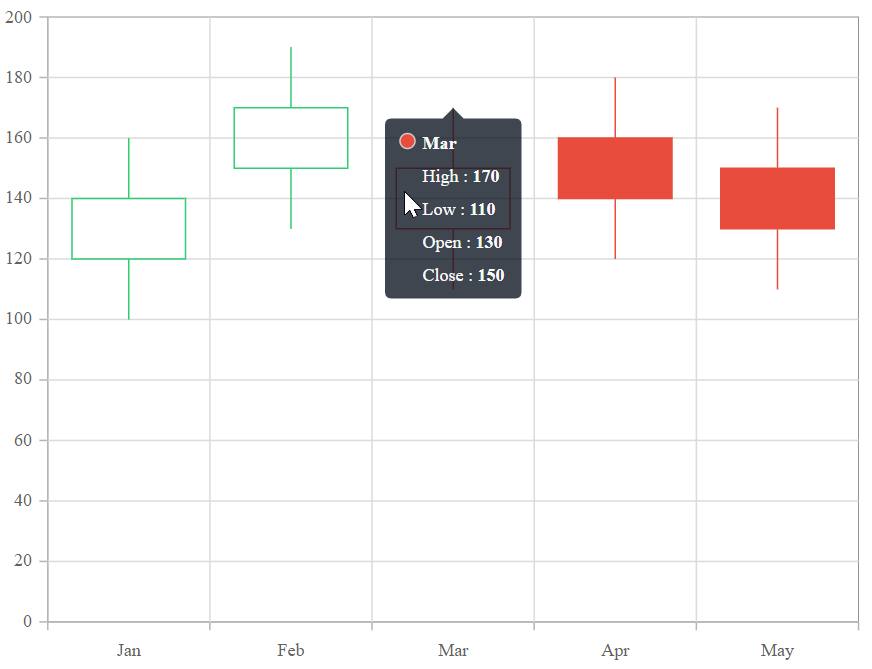
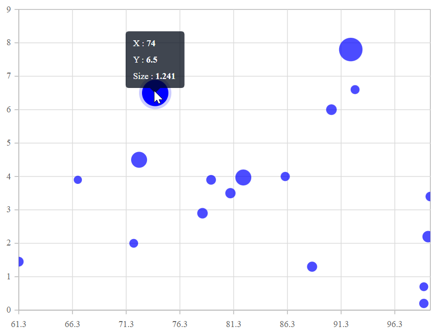
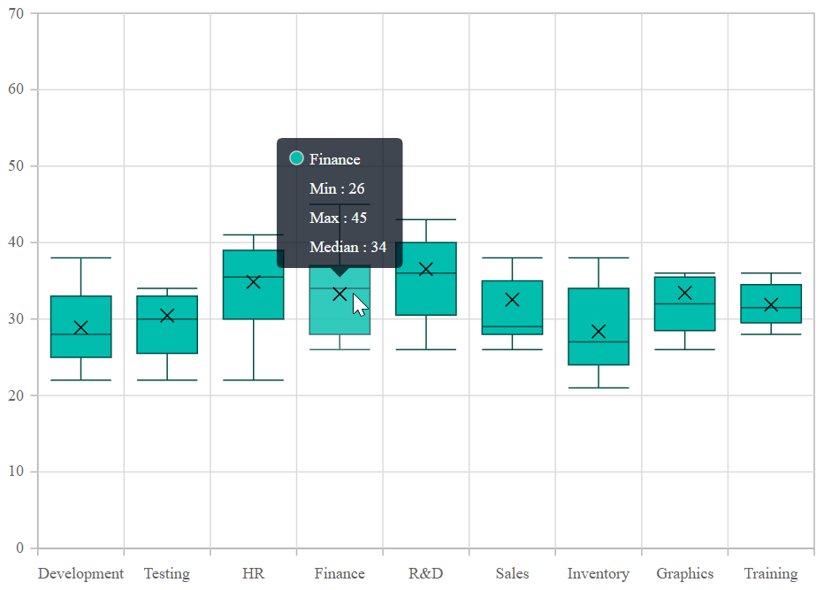

# Tooltip in Blazor Charts Component

<!-- markdownlint-disable MD036 -->

When the mouse is moved over a point on the chart, the tooltip will provide information about that point.

## Enable tooltip

When space constraints prevent displaying information using data labels, the tooltip comes in useful. The [Enable](https://help.syncfusion.com/cr/blazor/Syncfusion.Blazor.Charts.ChartTooltipSettings.html#Syncfusion_Blazor_Charts_ChartTooltipSettings_Enable) property in [ChartTooltipSettings](https://help.syncfusion.com/cr/blazor/Syncfusion.Blazor.Charts.ChartTooltipSettings.html) can be set to **true** to enable the tooltip.

```cshtml

@using Syncfusion.Blazor.Charts

<SfChart Title="Product Sales">
    <ChartPrimaryXAxis ValueType="Syncfusion.Blazor.Charts.ValueType.Category" />

    <ChartPrimaryYAxis LabelFormat="{value}M"  >

    </ChartPrimaryYAxis>

    <ChartTooltipSettings Enable="true"></ChartTooltipSettings>

    <ChartSeriesCollection>
        <ChartSeries DataSource="@SalesReports" Name="Text" XName="X" YName="Y" Type="ChartSeriesType.Column">
        </ChartSeries>
    </ChartSeriesCollection>
</SfChart>

@code{
    public class Data
    {
        public string X { get; set; }
        public double Y { get; set; }
        public string Text { get; set; }
    }

    public List<Data> SalesReports = new List<Data>
	{
       new Data{ X= "Jan", Y= 3, Text= "January" },
       new Data{ X= "Feb", Y= 3.5, Text= "February" },
       new Data{ X= "Mar", Y= 7, Text= "March" },
       new Data{ X= "Apr", Y= 13.5, Text= "April" }
    };
}

```


## Tooltip format

<!-- markdownlint-disable MD013 -->

By default, the tooltip displays information in points for the x and y values. In addition, further information can be displayed in the tooltip. 

### Cartesian Chart

For cartesian type charts like line, column area, etc., you can access series.name, point.x and point.y values in **Format** property. For example, the format **$series.name $point.x** displays series name and point x-value in the tooltip.

```cshtml

@using Syncfusion.Blazor.Charts

<SfChart Title="Product Sales">
    <ChartPrimaryXAxis ValueType="Syncfusion.Blazor.Charts.ValueType.Category" />

    <ChartPrimaryYAxis LabelFormat="{value}M"></ChartPrimaryYAxis>

    <ChartTooltipSettings Enable="true" Header="Sales" Format="<b>${series.name} : ${point.y}</b>"></ChartTooltipSettings>

    <ChartSeriesCollection>
        <ChartSeries DataSource="@SalesReports" Name="Product" XName="X" YName="Y" Type="Syncfusion.Blazor.Charts.ChartSeriesType.Column">
        </ChartSeries>
    </ChartSeriesCollection>
</SfChart>

@code{
    public class Data
    {
        public string X { get; set; }
        public double Y { get; set; }
        public string Text { get; set; }
    }

    public List<Data> SalesReports = new List<Data>
	{
       new Data{ X= "Jan", Y= 3, Text= "January" },
       new Data{ X= "Feb", Y= 3.5, Text= "February" },
       new Data{ X= "Mar", Y= 7, Text= "March" },
       new Data{ X= "Apr", Y= 13.5, Text= "April" }
    };
}

```




### Financial Chart

For financial type charts like candle, hilo, hiloopenclose you can access series.name, point.x, point.high, point.low, point.open, point.close and point.volume in Format property.

```cshtml
@using Syncfusion.Blazor.Charts

<SfChart>
    <ChartPrimaryXAxis ValueType="Syncfusion.Blazor.Charts.ValueType.Category">
    </ChartPrimaryXAxis>
    <ChartTooltipSettings Enable="true" Format="<b>${point.x}</b> <br> High : <b>${point.high}</b> <br> Low : <b>${point.low}</b> <br> Open : <b>${point.open}</b> <br> Close : <b>${point.close}</b>"></ChartTooltipSettings>
    <ChartSeriesCollection>
        <ChartSeries DataSource="@StockDetails" XName="X" High="High" Low="Low" Type="Syncfusion.Blazor.Charts.ChartSeriesType.Candle" Open="Open" Close="Close">
        </ChartSeries>
    </ChartSeriesCollection>
</SfChart>

@code {
    public class Data
    {
        public string X { get; set; }
        public double Y { get; set; }
        public double High { get; set; }
        public double Low { get; set; }
        public double Open { get; set; }
        public double Close { get; set; }
    }

    public List<Data> StockDetails = new List<Data>
    {
        new Data{ X= "Jan", Open= 120, High= 160, Low= 100, Close= 140 },
        new Data{ X= "Feb", Open= 150, High= 190, Low= 130, Close= 170 },
        new Data{ X= "Mar", Open= 130, High= 170, Low= 110, Close= 150 },
        new Data{ X= "Apr", Open= 160, High= 180, Low= 120, Close= 140 },
        new Data{ X= "May", Open= 150, High= 170, Low= 110, Close= 130 }
    };
}
```




### Scatter and Bubble

For scatter and bubble type charts, you can access series.name, point.x, point.y and point.size in Format property.

```cshtml
@using Syncfusion.Blazor.Charts

<SfChart>
    <ChartSeriesCollection>
        <ChartSeries DataSource="@SalesReports" XName="X" YName="Y" Opacity="0.7" Fill="blue" Size="Size" Type="Syncfusion.Blazor.Charts.ChartSeriesType.Bubble">
        </ChartSeries>
    </ChartSeriesCollection>
    <ChartTooltipSettings Enable="true" EnableMarker=false Format="X : <b>${point.x}</b> <br> Y : <b>${point.y}</b> <br> Size : <b>${point.size}</b>"></ChartTooltipSettings>
</SfChart>

@code {
    public class ChartData
    {
        public double X { get; set; }
        public double Y { get; set; }
        public double Size { get; set; }
    }

    public List<ChartData> SalesReports = new List<ChartData>
    {
        new ChartData { X= 92.2, Y= 7.8, Size= 1.347 },
        new ChartData { X= 74, Y= 6.5, Size= 1.241 },
        new ChartData { X= 90.4, Y= 6.0, Size= 0.238 },
        new ChartData { X= 99.4, Y= 2.2, Size= 0.312 },
        new ChartData { X= 88.6, Y= 1.3, Size= 0.197 },
        new ChartData { X= 99, Y= 0.7, Size= 0.0818 },
        new ChartData { X= 72, Y= 2.0, Size= 0.0826 },
        new ChartData { X= 99.6, Y= 3.4, Size= 0.143 },
        new ChartData { X= 99, Y= 0.2, Size= 0.128 },
        new ChartData { X= 86.1, Y= 4.0, Size= 0.115 },
        new ChartData { X= 92.6, Y= 6.6, Size= 0.096 },
        new ChartData { X= 61.3, Y= 1.45, Size= 0.162 },
        new ChartData { X= 82.2, Y= 3.97, Size= 0.7 },
        new ChartData { X= 79.2, Y= 3.9, Size= 0.162 },
        new ChartData { X= 72.5, Y= 4.5, Size= 0.7 },
        new ChartData { X= 81, Y= 3.5, Size= 0.21 },
        new ChartData { X= 66.8, Y= 3.9, Size= 0.028 },
        new ChartData { X= 78.4, Y= 2.9, Size= 0.231 }
    };
}
```




### Other Types

#### Box and Whisker

For box and whisker chart type, you can access point.x, point.minimum, point.maximum and point.median in format. 

```cshtml
@using Syncfusion.Blazor.Charts

<SfChart>
    <ChartPrimaryXAxis ValueType="Syncfusion.Blazor.Charts.ValueType.Category">
    </ChartPrimaryXAxis>
    <ChartSeriesCollection>
        <ChartSeries DataSource="@ExpenseDetails" XName="XValue" YName="YValue" Type="Syncfusion.Blazor.Charts.ChartSeriesType.BoxAndWhisker">
        </ChartSeries>
    </ChartSeriesCollection>
    <ChartTooltipSettings Enable="true" Format=" ${point.x} <br> Min : ${point.minimum} <br> Max : ${point.maximum} <br> Median : ${point.median}"></ChartTooltipSettings>
</SfChart>

@code {
    public class ChartData
    {
        public string XValue { get; set; }
        public double[] YValue { get; set; }
    }
    public List<ChartData> ExpenseDetails = new List<ChartData>
    {
        new ChartData { XValue = "Development", YValue = new double[]{ 22, 22, 23, 25, 25, 25, 26, 27, 27, 28, 28, 29, 30, 32, 34, 32, 34, 36, 35, 38 } },
        new ChartData { XValue = "Testing", YValue = new double[] { 22, 33, 23, 25, 26, 28, 29, 30, 34, 33, 32, 31, 50 }},
        new ChartData { XValue = "HR", YValue = new double[] { 22, 24, 25, 30, 32, 34, 36, 38, 39, 41, 35, 36, 40, 56 } },
        new ChartData { XValue = "Finance", YValue =  new double[] { 26, 27, 28, 30, 32, 34, 35, 37, 35, 37, 45 } },
        new ChartData { XValue = "R&D", YValue = new double[] { 26, 27, 29, 32, 34, 35, 36, 37, 38, 39, 41, 43, 58 } },
        new ChartData { XValue = "Sales", YValue = new double[] { 27, 26, 28, 29, 29, 29, 32, 35, 32, 38, 53 } },
        new ChartData { XValue = "Inventory", YValue = new double[] { 21, 23, 24, 25, 26, 27, 28, 30, 34, 36, 38 } },
        new ChartData { XValue = "Graphics", YValue = new double[] { 26, 28, 29, 30, 32, 33, 35, 36, 52 } },
        new ChartData { XValue = "Training", YValue = new double[] { 28, 29, 30, 31, 32, 34, 35, 36 } }
    };
}
```




#### Histogram

For histogram chart type, you can access point.x, point.minimum and point.maximum in format.

```cshtml
@using Syncfusion.Blazor.Charts

<SfChart Title="Score of Final Examination">
    <ChartArea><ChartAreaBorder Width="0"></ChartAreaBorder></ChartArea>
    <ChartPrimaryXAxis Minimum="0" Maximum="110">
        <ChartAxisMajorGridLines Width="0"></ChartAxisMajorGridLines>
    </ChartPrimaryXAxis>
    <ChartPrimaryYAxis Minimum="0" Maximum="6" Interval="2" Title="Number of Students">
        <ChartAxisMajorGridLines Width="0"></ChartAxisMajorGridLines>
    </ChartPrimaryYAxis>
    <ChartSeriesCollection>
        <ChartSeries DataSource="@ExamScores" YName="Y" Type="Syncfusion.Blazor.Charts.ChartSeriesType.Histogram" BinInterval="20" ShowNormalDistribution="true" ColumnWidth="0.99">
            <ChartMarker Visible="true" Height="10" Width="10">
                <ChartDataLabel Visible="true" Position="Syncfusion.Blazor.Charts.LabelPosition.Top">
                    <ChartDataLabelFont Color="#ffffff" FontWeight="600"></ChartDataLabelFont>
                </ChartDataLabel>
            </ChartMarker>
        </ChartSeries>
    </ChartSeriesCollection>
    <ChartTooltipSettings Enable="true" Format="Score: ${point.x} <br> Minimum : ${point.minimum} <br> Maximum : ${point.maximum}"></ChartTooltipSettings>
</SfChart>

@code {
    public class Data
    {
        public double Y { get; set; }
    }

    public List<Data> ExamScores = new List<Data>
    {
       new Data { Y=5.250},
       new Data { Y=7.750},
       new Data { Y=8.275},
       new Data { Y=9.750},
       new Data { Y=36.250},
       new Data { Y=46.250},
       new Data { Y=56.250},
       new Data { Y=66.500},
       new Data { Y=76.625},
       new Data { Y=80.000},
       new Data { Y=97.750}
    };
}
```





<!-- markdownlint-disable MD013 -->

## Tooltip template

Any HTML elements can be displayed within the tooltip by using the [Template](https://help.syncfusion.com/cr/blazor/Syncfusion.Blazor.Charts.ChartTooltipSettings.html#Syncfusion_Blazor_Charts_ChartTooltipSettings_Template) property of the [ChartTooltipSettings](https://help.syncfusion.com/cr/blazor/Syncfusion.Blazor.Charts.ChartTooltipSettings.html). You can use the **data.X** and **data.Y** as place holders in the HTML element to display x and y values of the corresponding data point.

```cshtml

@using Syncfusion.Blazor.Charts

<SfChart Title="Unemployment Rates 1975-2010">
    <ChartSeriesCollection>
        <ChartSeries DataSource="StepChartValues" Type="ChartSeriesType.StepLine" XName="Year" YName="YValue" Name="China">
            <ChartMarker Visible="true" Width="10" Height="10">
            </ChartMarker>
        </ChartSeries>
    </ChartSeriesCollection>
    <ChartTooltipSettings Enable="true">
        <Template>
            @{
                    var data = context as ChartTooltipInfo;
                    <div>                       
                        <table style="width:100%;  border: 1px solid black;">
                            <tr><th colspan="2" bgcolor="#00FFFF">Unemployment</th></tr>
                            <tr><td bgcolor="#00FFFF">@data.X:</td><td bgcolor="#00FFFF">@data.Y</td></tr>
                        </table>
                    </div>
                }         
        </Template>
    </ChartTooltipSettings>
</SfChart>

@code{
    public List<StepChartData> StepChartValues = new List<StepChartData>
    {
        new StepChartData { Year = "1975", YValue = 16 },
        new StepChartData { Year = "1980", YValue = 12.5 },
        new StepChartData { Year = "1985", YValue = 19 },
        new StepChartData { Year = "1990", YValue = 14.4 },
        new StepChartData { Year = "1995", YValue = 11.5 },
        new StepChartData { Year = "2000", YValue = 14 },
        new StepChartData { Year = "2005", YValue = 10 },
        new StepChartData { Year = "2010", YValue = 16 }
    };

    public class StepChartData
    {
        public string Year { get; set; }
        public double YValue { get; set; }
    }
}

```


## Shared Tooltip template

Any HTML elements can be displayed within the tooltip by using the [Template](https://help.syncfusion.com/cr/blazor/Syncfusion.Blazor.Charts.ChartTooltipSettings.html#Syncfusion_Blazor_Charts_ChartTooltipSettings_Template) property of the [ChartTooltipSettings](https://help.syncfusion.com/cr/blazor/Syncfusion.Blazor.Charts.ChartTooltipSettings.html). You can use the **data.X** and **data.Y** as place holders in the HTML element to display x and y values of the corresponding data point. To show the tooltip for more than one series, enable the [Shared](https://help.syncfusion.com/cr/blazor/Syncfusion.Blazor.Charts.ChartTooltipSettings.html#Syncfusion_Blazor_Charts_ChartTooltipSettings_Shared) property in [ChartTooltipSettings](https://help.syncfusion.com/cr/blazor/Syncfusion.Blazor.Charts.ChartTooltipSettings.html)

```cshtml

@using Syncfusion.Blazor.Charts

<SfChart>
    <ChartArea><ChartAreaBorder Width="0"></ChartAreaBorder></ChartArea>
    <ChartPrimaryXAxis ValueType="Syncfusion.Blazor.Charts.ValueType.DateTime" LabelFormat="yyyy" IntervalType="IntervalType.Years" EdgeLabelPlacement="EdgeLabelPlacement.Shift">
        <ChartAxisMajorGridLines Width="0"></ChartAxisMajorGridLines>
    </ChartPrimaryXAxis>
    <ChartPrimaryYAxis LabelFormat="{value}%" RangePadding="ChartRangePadding.None" Minimum="0" Maximum="100" Interval="20">
        <ChartAxisLineStyle Width="0"></ChartAxisLineStyle>
        <ChartAxisMajorTickLines Width="0"></ChartAxisMajorTickLines>
    </ChartPrimaryYAxis>
    <ChartTooltipSettings Enable="true" Shared="true">
        <Template>
            @{
                var data = context as List<ChartTooltipInfo>;
                <div>
                    <table style="width:100%;  border: 1px solid black;" class="table-borderless">
                        <tr>
                            <th colspan="2" bgcolor="#00FFFF">@data[0].X</th>
                        </tr>
                        <tr>
                            <td bgcolor="#00FFFF">Germany</td>
                            <td bgcolor="#00FFFF">@data[0].Y</td>
                        </tr>
                        <tr>
                            <td bgcolor="#00FFFF">England</td>
                            <td bgcolor="#00FFFF">@data[1].Y</td>
                        </tr>
                    </table>
                </div>
            }
        </Template>
    </ChartTooltipSettings>
    <ChartCrosshairSettings Enable="true" LineType="LineType.Vertical"></ChartCrosshairSettings>
    <ChartSeriesCollection>
        <ChartSeries DataSource="@ChartData" Name="Germany" XName="Period" Width="2"
                     Opacity="1" YName="ENG_InflationRate" Type="ChartSeriesType.Line">
            <ChartMarker Visible="true" Width="10" Height="10">
            </ChartMarker>
        </ChartSeries>
        <ChartSeries DataSource="@ChartData" Name="England" XName="Period" Width="2"
                     Opacity="1" YName="GER_InflationRate" Type="ChartSeriesType.Line">
            <ChartMarker Visible="true" Width="10" Height="10">
            </ChartMarker>
        </ChartSeries>
    </ChartSeriesCollection>
</SfChart>

@code {
    public List<LineChartData> ChartData = new List<LineChartData>
    {
        new LineChartData { Period = new DateTime(2005, 01, 01), ENG_InflationRate = 21, GER_InflationRate = 28 },
        new LineChartData { Period = new DateTime(2006, 01, 01), ENG_InflationRate = 24, GER_InflationRate = 44 },
        new LineChartData { Period = new DateTime(2007, 01, 01), ENG_InflationRate = 36, GER_InflationRate = 48 },
        new LineChartData { Period = new DateTime(2008, 01, 01), ENG_InflationRate = 38, GER_InflationRate = 50 },
        new LineChartData { Period = new DateTime(2009, 01, 01), ENG_InflationRate = 54, GER_InflationRate = 66 },
        new LineChartData { Period = new DateTime(2010, 01, 01), ENG_InflationRate = 57, GER_InflationRate = 78 },
        new LineChartData { Period = new DateTime(2011, 01, 01), ENG_InflationRate = 70, GER_InflationRate = 84 }
    };
    public class LineChartData
    {
        public DateTime Period { get; set; }
        public double ENG_InflationRate { get; set; }
        public double GER_InflationRate { get; set; }
    }
}

```


## Tooltip customization

The [Fill](https://help.syncfusion.com/cr/blazor/Syncfusion.Blazor.Charts.ChartTooltipSettings.html#Syncfusion_Blazor_Charts_ChartTooltipSettings_Fill) and [Border](https://help.syncfusion.com/cr/blazor/Syncfusion.Blazor.Charts.ChartTooltipSettings.html#Syncfusion_Blazor_Charts_ChartTooltipSettings_Border) properties are used to customize the background color and the border of the tooltip respectively. The [ChartTooltipTextStyle](https://help.syncfusion.com/cr/blazor/Syncfusion.Blazor.Charts.ChartTooltipTextStyle.html) is used to customize the tooltip text. The [HighlightColor](https://help.syncfusion.com/cr/blazor/Syncfusion.Blazor.Charts.SfChart.html#Syncfusion_Blazor_Charts_SfChart_HighlightColor) property is used to customize the point color while hovering for tooltip.

```cshtml

@using Syncfusion.Blazor.Charts

<SfChart Title="Product Sales" HighlightColor="red">
    <ChartPrimaryXAxis ValueType="Syncfusion.Blazor.Charts.ValueType.Category" />

    <ChartPrimaryYAxis LabelFormat="{value}M" >

    </ChartPrimaryYAxis>

    <ChartTooltipSettings Enable="true" Fill="gray">
        <ChartTooltipBorder Color="#FF0000"  Width="2"></ChartTooltipBorder>
    </ChartTooltipSettings>

    <ChartSeriesCollection>
        <ChartSeries DataSource="@SalesReports" XName="X" YName="Y" Type="ChartSeriesType.Column">
        </ChartSeries>
    </ChartSeriesCollection>
</SfChart>

@code{
    public class Data
    {
        public string X { get; set; }
        public double Y { get; set; }
        public string Text { get; set; }
    }

    public List<Data> SalesReports = new List<Data>
	{
       new Data{ X= "Jan", Y= 3, Text= "January" },
       new Data{ X= "Feb", Y= 3.5, Text= "February" },
       new Data{ X= "Mar", Y= 7, Text= "March" },
       new Data{ X= "Apr", Y= 13.5, Text= "April" }
    };
}

```


N> Refer to our [Blazor Charts](https://www.syncfusion.com/blazor-components/blazor-charts) feature tour page for its groundbreaking feature representations and also explore our [Blazor Chart Example](https://blazor.syncfusion.com/demos/chart/line?theme=bootstrap4) to know various chart types and how to represent time-dependent data, showing trends at equal intervals.

## See also

* [Data label](./data-labels)
* [Marker](./data-markers)