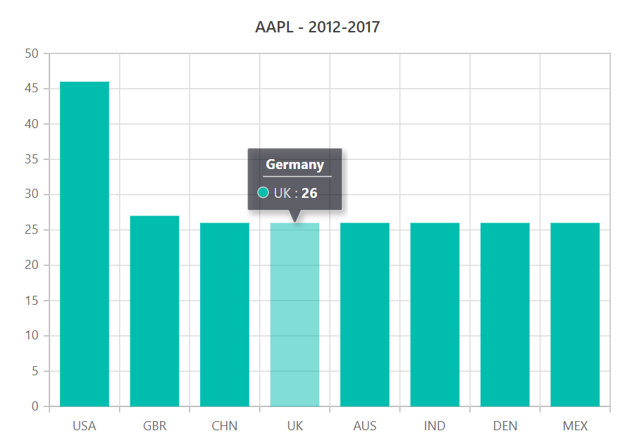
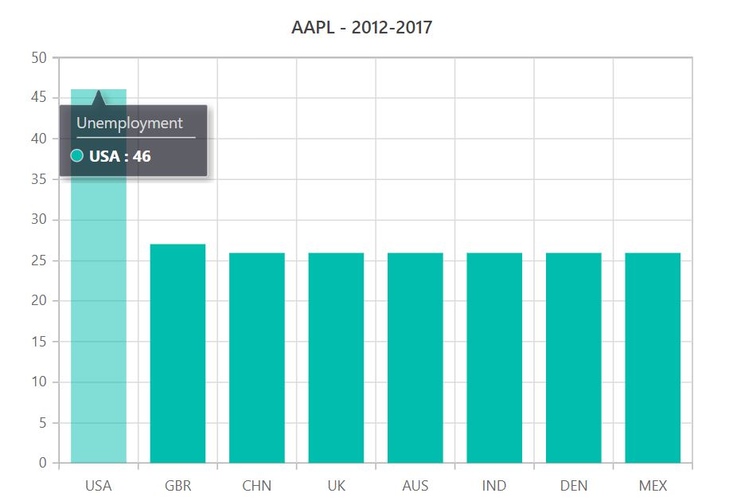
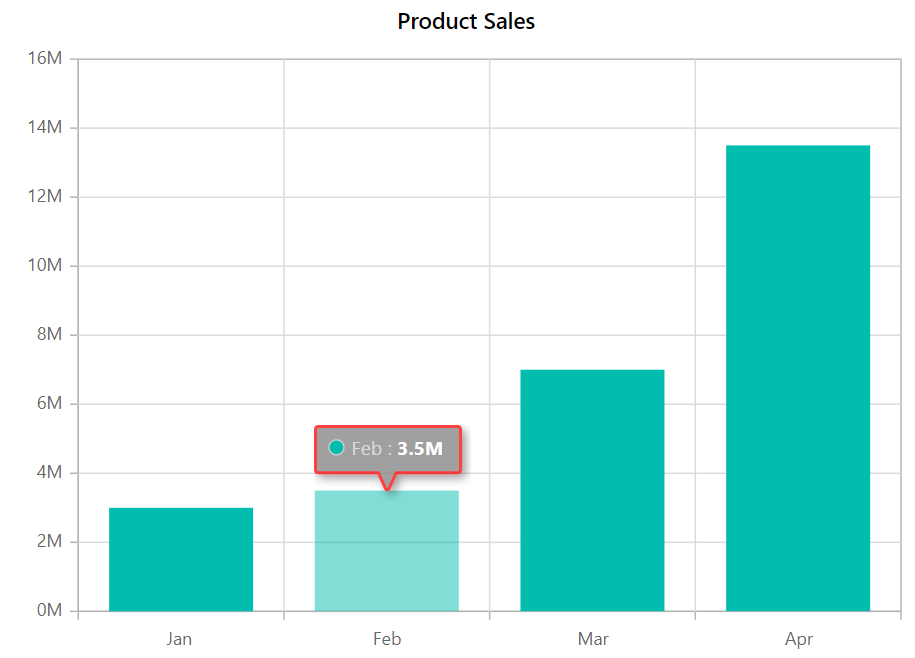

# Tooltip in Blazor Charts Component

<!-- markdownlint-disable MD036 -->

Chart will display details about the points through tooltip, when the mouse is moved over the point.

## Enable Tooltip

The tooltip is useful when you cannot display information by using the data labels due to space constraints.
You can enable tooltip by setting the [`Enable`](https://help.syncfusion.com/cr/blazor/Syncfusion.Blazor.Charts.ChartTooltipSettings.html#Syncfusion_Blazor_Charts_ChartTooltipSettings_Enable) property as **true**
in [`ChartTooltipSettings`](https://help.syncfusion.com/cr/blazor/Syncfusion.Blazor.Charts.ChartTooltipSettings.html).

```csharp

@using Syncfusion.Blazor.Charts

<SfChart>
    <ChartPrimaryXAxis ValueType="Syncfusion.Blazor.Charts.ValueType.Category"></ChartPrimaryXAxis>

    <ChartTooltipSettings Enable="true"></ChartTooltipSettings>

    <ChartSeriesCollection>
        <ChartSeries DataSource="@MedalDetails" XName="X" YName="YValue" Type="ChartSeriesType.Column">
        </ChartSeries>
    </ChartSeriesCollection>
</SfChart>

@code{

    public class ChartData
    {
        public string X { get; set; }
        public double YValue { get; set; }
    }

    public List<ChartData> MedalDetails = new List<ChartData>
    {
        new ChartData { X= "USA", YValue= 46 },
        new ChartData { X= "GBR", YValue= 27 },
        new ChartData { X= "CHN", YValue= 26 },
        new ChartData { X= "UK", YValue= 26 },
        new ChartData { X= "AUS", YValue= 26 },
        new ChartData { X= "IND", YValue= 26 },
        new ChartData { X= "DEN", YValue= 26 },
        new ChartData { X= "MEX", YValue= 26 },
    };
}

```



## Format the Tooltip

<!-- markdownlint-disable MD013 -->

By default, tooltip shows information of x and y value in points. In addition to that, you can show more
information in tooltip. For example the format '${series.name} ${point.x}' shows series name and point x
value.

```csharp

@using Syncfusion.Blazor.Charts

<SfChart Title="AAPL - 2012-2017">
    <ChartPrimaryXAxis ValueType="Syncfusion.Blazor.Charts.ValueType.Category"></ChartPrimaryXAxis>

    <ChartTooltipSettings Enable="true" Header="Unemployment" Format="<b>${point.x} : ${point.y}</b>"></ChartTooltipSettings>

    <ChartSeriesCollection>
        <ChartSeries DataSource="@MedalDetails" XName="X" YName="YValue" Type="ChartSeriesType.Column">
        </ChartSeries>
    </ChartSeriesCollection>
</SfChart>

@code{

    public class ChartData
    {
        public string X { get; set; }
        public double YValue { get; set; }
    }

    public List<ChartData> MedalDetails = new List<ChartData>
    {
        new ChartData { X= "USA", YValue= 46 },
        new ChartData { X= "GBR", YValue= 27 },
        new ChartData { X= "CHN", YValue= 26 },
        new ChartData { X= "UK", YValue= 26 },
        new ChartData { X= "AUS", YValue= 26 },
        new ChartData { X= "IND", YValue= 26 },
        new ChartData { X= "DEN", YValue= 26 },
        new ChartData { X= "MEX", YValue= 26 },
    };
}

```



<!-- markdownlint-disable MD013 -->

## Customize the Appearance of Tooltip

The [`Fill`](https://help.syncfusion.com/cr/blazor/Syncfusion.Blazor.Charts.ChartTooltipSettings.html#Syncfusion_Blazor_Charts_ChartTooltipSettings_Fill)
and [`Border`](https://help.syncfusion.com/cr/blazor/Syncfusion.Blazor.Charts.ChartTooltipSettings.html#Syncfusion_Blazor_Charts_ChartTooltipSettings_Border)
properties are used to customize the background color and border of the tooltip respectively.
The [`TextStyle`](https://help.syncfusion.com/cr/blazor/Syncfusion.Blazor.Charts.ChartTooltipSettings.html#Syncfusion_Blazor_Charts_ChartTooltipSettings_TextStyle)
property in the tooltip is used to customize tooltip text.

```csharp

@using Syncfusion.Blazor.Charts

<SfChart Title="Inflation - Consumer Price">
    <ChartArea><ChartAreaBorder Width="0"></ChartAreaBorder></ChartArea>

    <ChartPrimaryXAxis ValueType="Syncfusion.Blazor.Charts.ValueType.DateTime" LabelFormat="yyyy" IntervalType="IntervalType.Years" EdgeLabelPlacement="EdgeLabelPlacement.Shift">
        <ChartAxisMajorGridLines Width="0"></ChartAxisMajorGridLines>
    </ChartPrimaryXAxis>

    <ChartPrimaryYAxis LabelFormat="{value}%" RangePadding="ChartRangePadding.None" Minimum="0" Maximum="100" Interval="20">
        <ChartAxisLineStyle Width="0"></ChartAxisLineStyle>
        <ChartAxisMajorTickLines Width="0"></ChartAxisMajorTickLines>
    </ChartPrimaryYAxis>

    <ChartTooltipSettings Enable="true" Fill="blue" Format="${series.name} ${point.x} : ${point.y}">
    </ChartTooltipSettings>

    <ChartSeriesCollection>
        <ChartSeries DataSource="@ConsumerDetails" XName="XValue" YName="YValue" Type="ChartSeriesType.Line">
            <ChartMarker Visible="true" Width="10" Height="10">
            </ChartMarker>
        </ChartSeries>
        <ChartSeries DataSource="@ConsumerDetails" XName="XValue" YName="YValue1" Type="ChartSeriesType.Line">
            <ChartMarker Visible="true" Width="10" Height="10">
            </ChartMarker>
        </ChartSeries>
    </ChartSeriesCollection>
</SfChart>

@code{

    public class ChartData
    {
        public DateTime XValue { get; set; }
        public double YValue { get; set; }
        public double YValue1 { get; set; }
    }
    public List<ChartData> ConsumerDetails = new List<ChartData>
    {
        new ChartData { XValue = new DateTime(2005, 01, 01), YValue = 21, YValue1 = 28 },
        new ChartData { XValue = new DateTime(2006, 01, 01), YValue = 24, YValue1 = 44 },
        new ChartData { XValue = new DateTime(2007, 01, 01), YValue = 36, YValue1 = 48 },
        new ChartData { XValue = new DateTime(2008, 01, 01), YValue = 38, YValue1 = 50 },
        new ChartData { XValue = new DateTime(2009, 01, 01), YValue = 54, YValue1 = 66 },
        new ChartData { XValue = new DateTime(2010, 01, 01), YValue = 57, YValue1 = 78 },
        new ChartData { XValue = new DateTime(2011, 01, 01), YValue = 70, YValue1 = 84 },
    };
}

```



> Note: You can refer to our [`Blazor Charts`](https://www.syncfusion.com/blazor-components/blazor-charts) feature tour page for its groundbreaking feature representations. You can also explore our [`Blazor Chart example`](https://blazor.syncfusion.com/demos/chart/line?theme=bootstrap4) to knows various chart types and how to represent time-dependent data, showing trends in data at equal intervals.

## See Also

* [Data label](./data-labels)
* [Marker](./data-markers)