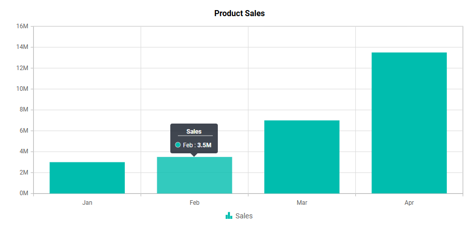
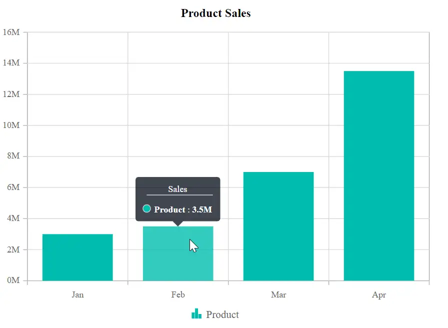
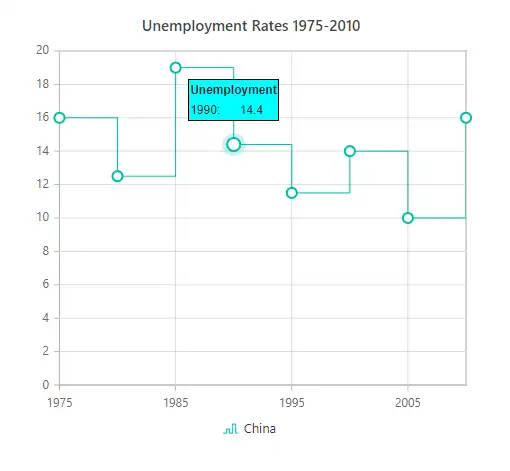
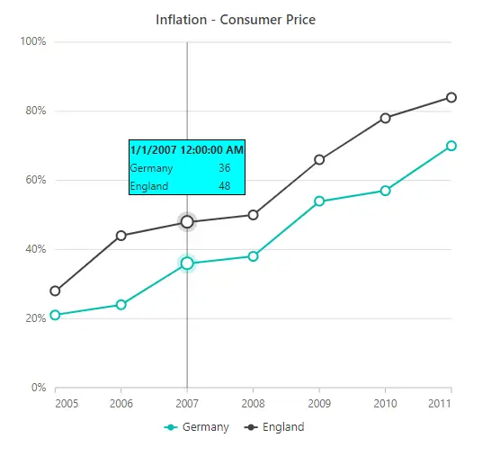
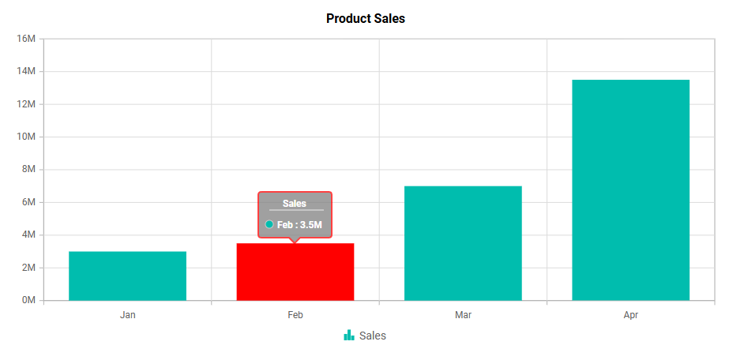

# Blazor Charts Tooltip

<!-- markdownlint-disable MD036 -->

This section covers how to enable, format, template, customize, and highlight tooltips in the Blazor Charts component.

A detailed walkthrough demonstrating how to add and customize tooltips in the chart is presented in the video below.



## Enable tooltip

When space constraints prevent information from being displayed through data labels, tooltips provide an effective alternative. Tooltips can be enabled by setting the [Enable](https://help.syncfusion.com/cr/blazor/Syncfusion.Blazor.Charts.ChartTooltipSettings.html#Syncfusion_Blazor_Charts_ChartTooltipSettings_Enable) property in [ChartTooltipSettings](https://help.syncfusion.com/cr/blazor/Syncfusion.Blazor.Charts.ChartTooltipSettings.html) to **true**.

```cshtml

@using Syncfusion.Blazor.Charts

<SfChart Title="Olympic Medals">
    <ChartPrimaryXAxis Title="Countries" ValueType="Syncfusion.Blazor.Charts.ValueType.Category">
    </ChartPrimaryXAxis>
    <ChartPrimaryYAxis Title="Medal Counts">
    </ChartPrimaryYAxis>
    <ChartSeriesCollection>
        <ChartSeries TooltipMappingName="Text" DataSource="@MedalDetails" XName="X" YName="YValue" Type="ChartSeriesType.Column" />
    </ChartSeriesCollection>
    <ChartTooltipSettings Enable="true" Header="${point.tooltip}"></ChartTooltipSettings>
</SfChart>

@code {
    public class ChartData
    {
        public string X { get; set; }
        public double YValue { get; set; }
        public string Text { get; set; }
    }

    public List<ChartData> MedalDetails = new List<ChartData>
    {
        new ChartData { X = "USA", YValue = 46, Text = "United States" },
        new ChartData { X = "GBR", YValue = 27, Text = "Great Britain" },
        new ChartData { X = "CHN", YValue = 26, Text = "China" },
        new ChartData { X = "UK",  YValue = 26, Text = "United Kingdom" },
        new ChartData { X = "AUS", YValue = 26, Text = "Australia" },
        new ChartData { X = "IND", YValue = 26, Text = "India" },
        new ChartData { X = "DEN", YValue = 26, Text = "Denmark" },
        new ChartData { X = "MEX", YValue = 26, Text = "Mexico" }
    };
}

```



## Tooltip format

By default, the tooltip displays the x and y values of a data point. In addition, further information can be displayed in the tooltip. For example, the format `${series.name} : ${point.y}` displays the series name and point y-value in the tooltip. The format can be specified using the [Format](https://help.syncfusion.com/cr/blazor/Syncfusion.Blazor.Charts.ChartTooltipSettings.html#Syncfusion_Blazor_Charts_ChartTooltipSettings_Format) property in [ChartTooltipSettings](https://help.syncfusion.com/cr/blazor/Syncfusion.Blazor.Charts.ChartTooltipSettings.html). The [Header](https://help.syncfusion.com/cr/blazor/Syncfusion.Blazor.Charts.ChartTooltipSettings.html#Syncfusion_Blazor_Charts_ChartTooltipSettings_Header) property sets a custom header that appears above the formatted content.

```cshtml

@using Syncfusion.Blazor.Charts

<SfChart Title="Product Sales">
    <ChartPrimaryXAxis ValueType="Syncfusion.Blazor.Charts.ValueType.Category" />

    <ChartPrimaryYAxis LabelFormat="{value}M"></ChartPrimaryYAxis>

    <ChartTooltipSettings Enable="true" Header="Sales" Format="<b>${series.name} : ${point.y}</b>"></ChartTooltipSettings>

    <ChartSeriesCollection>
        <ChartSeries DataSource="@SalesReports" Name="Sales" XName="X" YName="Y" Type="ChartSeriesType.Column">
        </ChartSeries>
    </ChartSeriesCollection>
</SfChart>

@code {
    public class ColumnSalesFormatData
    {
        public string X { get; set; }
        public double Y { get; set; }
    }

    public List<ColumnSalesFormatData> SalesReports = new List<ColumnSalesFormatData>
    {
       new ColumnSalesFormatData { X = "Jan", Y = 3 },
       new ColumnSalesFormatData { X = "Feb", Y = 3.5 },
       new ColumnSalesFormatData { X = "Mar", Y = 7 },
       new ColumnSalesFormatData { X = "Apr", Y = 13.5 }
    };
}

```



## Tooltip template

Any HTML elements can be displayed within the tooltip by using the [Template](https://help.syncfusion.com/cr/blazor/Syncfusion.Blazor.Charts.ChartTooltipSettings.html#Syncfusion_Blazor_Charts_ChartTooltipSettings_Template) property of the [ChartTooltipSettings](https://help.syncfusion.com/cr/blazor/Syncfusion.Blazor.Charts.ChartTooltipSettings.html). You can use the **data.X** and **data.Y** as place holders in the HTML element to display x and y values of the corresponding data point.

```cshtml

@using Syncfusion.Blazor.Charts

<SfChart Title="Unemployment Rates 1975-2010">
    <ChartSeriesCollection>
        <ChartSeries DataSource="StepChartValues" Type="ChartSeriesType.StepLine" XName="Year" YName="YValue" Name="China">
            <ChartMarker Visible="true" Width="10" Height="10">
            </ChartMarker>
        </ChartSeries>
    </ChartSeriesCollection>
    <ChartTooltipSettings Enable="true">
        <Template>
            @{
                var data = context as ChartTooltipInfo;
                <div>
                    <table style="width:100%; border: 1px solid black;">
                        <tr><th colspan="2" bgcolor="#00FFFF">Unemployment</th></tr>
                        <tr><td bgcolor="#00FFFF">@data.X:</td><td bgcolor="#00FFFF">@data.Y</td></tr>
                    </table>
                </div>
            }
        </Template>
    </ChartTooltipSettings>
</SfChart>

@code {
    public List<StepChartData> StepChartValues = new List<StepChartData>
    {
        new StepChartData { Year = "1975", YValue = 16 },
        new StepChartData { Year = "1980", YValue = 12.5 },
        new StepChartData { Year = "1985", YValue = 19 },
        new StepChartData { Year = "1990", YValue = 14.4 },
        new StepChartData { Year = "1995", YValue = 11.5 },
        new StepChartData { Year = "2000", YValue = 14 },
        new StepChartData { Year = "2005", YValue = 10 },
        new StepChartData { Year = "2010", YValue = 16 }
    };

    public class StepChartData
    {
        public string Year { get; set; }
        public double YValue { get; set; }
    }
}

```



## Shared tooltip template

The [Template](https://help.syncfusion.com/cr/blazor/Syncfusion.Blazor.Charts.ChartTooltipSettings.html#Syncfusion_Blazor_Charts_ChartTooltipSettings_Template) property of the [ChartTooltipSettings](https://help.syncfusion.com/cr/blazor/Syncfusion.Blazor.Charts.ChartTooltipSettings.html) accepts an HTML fragment that is rendered for each data point. When the [Shared](https://help.syncfusion.com/cr/blazor/Syncfusion.Blazor.Charts.ChartTooltipSettings.html#Syncfusion_Blazor_Charts_ChartTooltipSettings_Shared) property is enabled, the template context is a `List<ChartTooltipInfo>` containing one entry per visible series at the hovered x-value, letting you render a single tooltip that shows values for every series at once.

```cshtml

@using Syncfusion.Blazor.Charts

<SfChart>
    <ChartArea><ChartAreaBorder Width="0"></ChartAreaBorder></ChartArea>
    <ChartPrimaryXAxis ValueType="Syncfusion.Blazor.Charts.ValueType.DateTime" LabelFormat="yyyy" IntervalType="IntervalType.Years" EdgeLabelPlacement="EdgeLabelPlacement.Shift">
        <ChartAxisMajorGridLines Width="0"></ChartAxisMajorGridLines>
    </ChartPrimaryXAxis>
    <ChartPrimaryYAxis LabelFormat="{value}%" RangePadding="ChartRangePadding.None" Minimum="0" Maximum="100" Interval="20">
        <ChartAxisLineStyle Width="0"></ChartAxisLineStyle>
        <ChartAxisMajorTickLines Width="0"></ChartAxisMajorTickLines>
    </ChartPrimaryYAxis>
    <ChartTooltipSettings Enable="true" Shared="true">
        <Template>
            @{
                var data = context as List<ChartTooltipInfo>;
                <div>
                    <table style="width:100%; border: 1px solid black;">
                        <tr>
                            <th colspan="2" bgcolor="#00FFFF">@data[0].X</th>
                        </tr>
                        <tr>
                            <td bgcolor="#00FFFF">Germany</td>
                            <td bgcolor="#00FFFF">@data[0].Y</td>
                        </tr>
                        <tr>
                            <td bgcolor="#00FFFF">England</td>
                            <td bgcolor="#00FFFF">@data[1].Y</td>
                        </tr>
                    </table>
                </div>
            }
        </Template>
    </ChartTooltipSettings>
    <ChartCrosshairSettings Enable="true" LineType="LineType.Vertical"></ChartCrosshairSettings>
    <ChartSeriesCollection>
        <ChartSeries DataSource="@ChartData" Name="Germany" XName="Period" Width="2"
                     Opacity="1" YName="ENG_InflationRate" Type="ChartSeriesType.Line">
            <ChartMarker Visible="true" Width="10" Height="10">
            </ChartMarker>
        </ChartSeries>
        <ChartSeries DataSource="@ChartData" Name="England" XName="Period" Width="2"
                     Opacity="1" YName="GER_InflationRate" Type="ChartSeriesType.Line">
            <ChartMarker Visible="true" Width="10" Height="10">
            </ChartMarker>
        </ChartSeries>
    </ChartSeriesCollection>
</SfChart>

@code {
    public List<LineChartData> ChartData = new List<LineChartData>
    {
        new LineChartData { Period = new DateTime(2005, 01, 01), ENG_InflationRate = 21, GER_InflationRate = 28 },
        new LineChartData { Period = new DateTime(2006, 01, 01), ENG_InflationRate = 24, GER_InflationRate = 44 },
        new LineChartData { Period = new DateTime(2007, 01, 01), ENG_InflationRate = 36, GER_InflationRate = 48 },
        new LineChartData { Period = new DateTime(2008, 01, 01), ENG_InflationRate = 38, GER_InflationRate = 50 },
        new LineChartData { Period = new DateTime(2009, 01, 01), ENG_InflationRate = 54, GER_InflationRate = 66 },
        new LineChartData { Period = new DateTime(2010, 01, 01), ENG_InflationRate = 57, GER_InflationRate = 78 },
        new LineChartData { Period = new DateTime(2011, 01, 01), ENG_InflationRate = 70, GER_InflationRate = 84 }
    };
    public class LineChartData
    {
        public DateTime Period { get; set; }
        public double ENG_InflationRate { get; set; }
        public double GER_InflationRate { get; set; }
    }
}

```



## Tooltip customization

The [Fill](https://help.syncfusion.com/cr/blazor/Syncfusion.Blazor.Charts.ChartTooltipSettings.html#Syncfusion_Blazor_Charts_ChartTooltipSettings_Fill) and [Border](https://help.syncfusion.com/cr/blazor/Syncfusion.Blazor.Charts.ChartTooltipSettings.html#Syncfusion_Blazor_Charts_ChartTooltipSettings_Border) properties customize the background color and border of the tooltip. The [ChartTooltipTextStyle](https://help.syncfusion.com/cr/blazor/Syncfusion.Blazor.Charts.ChartTooltipTextStyle.html) child element customizes the tooltip text (font color, size, and weight). The [HighlightColor](https://help.syncfusion.com/cr/blazor/Syncfusion.Blazor.Charts.SfChart.html#Syncfusion_Blazor_Charts_SfChart_HighlightColor) property of `SfChart` customizes the point color while the tooltip is being hovered.

```cshtml

@using Syncfusion.Blazor.Charts

<SfChart Title="Product Sales" HighlightColor="red">
    <ChartPrimaryXAxis ValueType="Syncfusion.Blazor.Charts.ValueType.Category" />
    <ChartPrimaryYAxis LabelFormat="{value}M"></ChartPrimaryYAxis>
    <ChartTooltipSettings Enable="true" Fill="gray">
        <ChartTooltipBorder Color="#FF0000" Width="2"></ChartTooltipBorder>
        <ChartTooltipTextStyle Color="white" Size="12px" FontWeight="Bold"></ChartTooltipTextStyle>
    </ChartTooltipSettings>
    <ChartSeriesCollection>
        <ChartSeries DataSource="@SalesReports" XName="X" YName="Y" Type="ChartSeriesType.Column">
        </ChartSeries>
    </ChartSeriesCollection>
</SfChart>

@code {
    public class ColumnSalesCustomData
    {
        public string X { get; set; }
        public double Y { get; set; }
        public string Text { get; set; }
    }

    public List<ColumnSalesCustomData> SalesReports = new List<ColumnSalesCustomData>
    {
       new ColumnSalesCustomData { X = "Jan", Y = 3 },
       new ColumnSalesCustomData { X = "Feb", Y = 3.5 },
       new ColumnSalesCustomData { X = "Mar", Y = 7 },
       new ColumnSalesCustomData { X = "Apr", Y = 13.5 }
    };
}

```



## Enable highlight for series with tooltip

By enabling the [EnableHighlight](https://help.syncfusion.com/cr/blazor/Syncfusion.Blazor.Charts.ChartTooltipSettings.html#Syncfusion_Blazor_Charts_ChartTooltipSettings_EnableHighlight) property, all points in the hovered series are highlighted while points in other series are dimmed. This makes it easier to focus on the selected series when multiple series are plotted together.

```cshtml

@using Syncfusion.Blazor.Charts

<SfChart Title="Unemployment Rates 1975-2010">
    <ChartPrimaryXAxis ValueType="Syncfusion.Blazor.Charts.ValueType.Category"></ChartPrimaryXAxis>
    <ChartSeriesCollection>
        <ChartSeries DataSource="StepChartValues" Type="Syncfusion.Blazor.Charts.ChartSeriesType.StepLine" XName="Year" YName="Y" Name="China">
            <ChartMarker Visible="true" Width="10" Height="10">
            </ChartMarker>
        </ChartSeries>
        <ChartSeries DataSource="StepChartValues" Type="Syncfusion.Blazor.Charts.ChartSeriesType.StepLine" XName="Year" YName="Y1" Name="Australia">
            <ChartMarker Visible="true" Width="10" Height="10">
            </ChartMarker>
        </ChartSeries>
        <ChartSeries DataSource="StepChartValues" Type="Syncfusion.Blazor.Charts.ChartSeriesType.StepLine" XName="Year" YName="Y2" Name="Japan">
            <ChartMarker Visible="true" Width="10" Height="10">
            </ChartMarker>
        </ChartSeries>
    </ChartSeriesCollection>
    <ChartTooltipSettings Enable="true" EnableHighlight="true">
    </ChartTooltipSettings>
</SfChart>

@code {
    public List<StepChartData> StepChartValues = new List<StepChartData>
    {
        new StepChartData { Year = "1975", Y = 16, Y1 = 10, Y2 = 4.5 },
        new StepChartData { Year = "1980", Y = 12.5, Y1 = 7.5, Y2 = 5},
        new StepChartData { Year = "1985", Y = 19, Y1 = 11, Y2 = 6.5 },
        new StepChartData { Year = "1990", Y = 14.4, Y1 = 7, Y2 = 4.4 },
        new StepChartData { Year = "1995", Y = 11.5, Y1 = 8, Y2 = 5 },
        new StepChartData { Year = "2000", Y = 14, Y1 = 6, Y2 = 1.5 },
        new StepChartData { Year = "2005", Y = 10, Y1 = 3.5, Y2 = 2.5 },
        new StepChartData { Year = "2010", Y = 16, Y1 = 7, Y2 = 3.7 }
    };

    public class StepChartData
    {
        public string Year { get; set; }
        public double Y { get; set; }
        public double Y1 { get; set; }
        public double Y2 { get; set; }
    }
}

```



## Display tooltip for nearest data point

The [ShowNearestTooltip](https://help.syncfusion.com/cr/blazor/Syncfusion.Blazor.Charts.ChartTooltipSettings.html#Syncfusion_Blazor_Charts_ChartTooltipSettings_ShowNearestTooltip) property of [ChartTooltipSettings](https://help.syncfusion.com/cr/blazor/Syncfusion.Blazor.Charts.ChartTooltipSettings.html) displays the tooltip for the data point nearest to the cursor. It automatically identifies the closest point within a defined interaction zone, which is useful when points are densely packed or overlap.

N> By default, the [ShowNearestTooltip](https://help.syncfusion.com/cr/blazor/Syncfusion.Blazor.Charts.ChartSeries.html#Syncfusion_Blazor_Charts_ChartSeries_ShowNearestTooltip) property of [ChartSeries](https://help.syncfusion.com/cr/blazor/Syncfusion.Blazor.Charts.ChartSeries.html) is set to **false** for all series. Enable it on a specific `ChartSeries` to opt that series in to the nearest-point behavior while leaving the others on the chart-wide default.

```cshtml

@using Syncfusion.Blazor.Charts

<SfChart Title="Unemployment Rates 1975-2010">
    <ChartPrimaryXAxis ValueType="Syncfusion.Blazor.Charts.ValueType.Category"></ChartPrimaryXAxis>
    <ChartSeriesCollection>
        <ChartSeries DataSource="StepChartValues" Type="Syncfusion.Blazor.Charts.ChartSeriesType.StepLine" XName="Year" YName="Y" Name="China" ShowNearestTooltip="true">
            <ChartMarker Visible="true" Width="10" Height="10">
            </ChartMarker>
        </ChartSeries>
        <ChartSeries DataSource="StepChartValues" Type="Syncfusion.Blazor.Charts.ChartSeriesType.StepLine" XName="Year" YName="Y1" Name="Australia">
            <ChartMarker Visible="true" Width="10" Height="10">
            </ChartMarker>
        </ChartSeries>
        <ChartSeries DataSource="StepChartValues" Type="Syncfusion.Blazor.Charts.ChartSeriesType.StepLine" XName="Year" YName="Y2" Name="Japan">
            <ChartMarker Visible="true" Width="10" Height="10">
            </ChartMarker>
        </ChartSeries>
    </ChartSeriesCollection>
    <ChartTooltipSettings Enable="true" ShowNearestTooltip="true">
    </ChartTooltipSettings>
</SfChart>

@code {
    public List<StepChartData> StepChartValues = new List<StepChartData>
    {
        new StepChartData { Year = "1975", Y = 16, Y1 = 10, Y2 = 4.5 },
        new StepChartData { Year = "1980", Y = 12.5, Y1 = 7.5, Y2 = 5},
        new StepChartData { Year = "1985", Y = 19, Y1 = 11, Y2 = 6.5 },
        new StepChartData { Year = "1990", Y = 14.4, Y1 = 7, Y2 = 4.4 },
        new StepChartData { Year = "1995", Y = 11.5, Y1 = 8, Y2 = 5 },
        new StepChartData { Year = "2000", Y = 14, Y1 = 6, Y2 = 1.5 },
        new StepChartData { Year = "2005", Y = 10, Y1 = 3.5, Y2 = 2.5 },
        new StepChartData { Year = "2010", Y = 16, Y1 = 7, Y2 = 3.7 }
    };

    public class StepChartData
    {
        public string Year { get; set; }
        public double Y { get; set; }
        public double Y1 { get; set; }
        public double Y2 { get; set; }
    }
}

```



N> For more chart-type options and live examples, see the [Blazor Charts demo](https://blazor.syncfusion.com/demos/chart/line?theme=fluent2). For getting started with the project setup, refer to the [Getting Started](./getting-started) guide.

## See also

* [Data label](./data-labels)
* [Marker](./data-markers)
* [Crosshair and trackball](./cross-hair-and-track-ball)
* [Selection](./selection)
* [Legend](./legend)