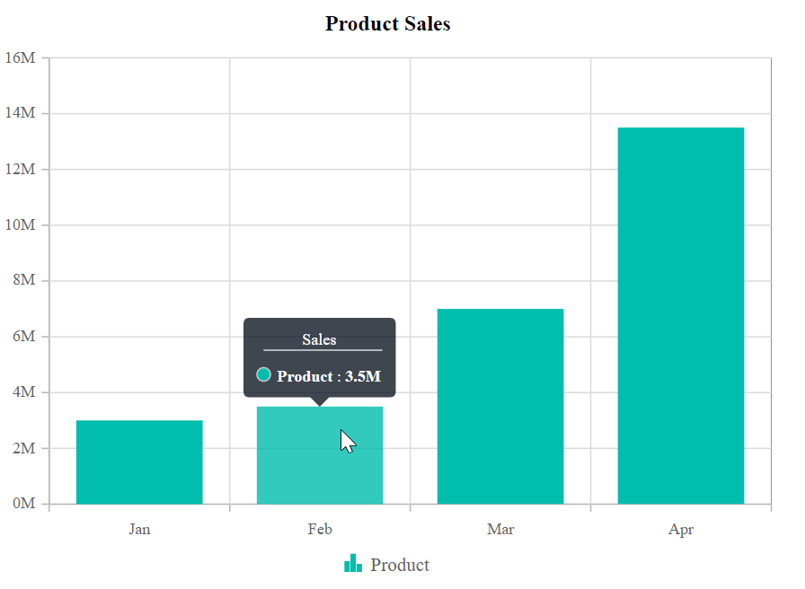
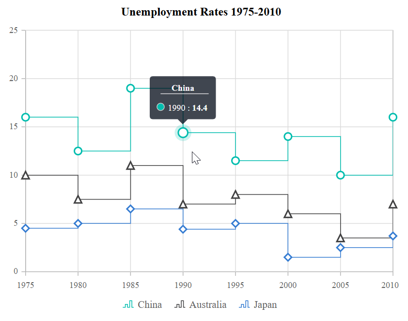

# Tooltip in Blazor Charts Component

<!-- markdownlint-disable MD036 -->

Tooltips in Blazor Charts provide contextual information when hovering over data points, enhancing data interpretation and user interaction.

Watch the following video to learn how to add tooltips to Blazor Charts.



## Enable tooltip

Tooltips are useful when space constraints limit the use of data labels. Enable tooltips by setting the [Enable](https://help.syncfusion.com/cr/blazor/Syncfusion.Blazor.Charts.ChartTooltipSettings.html#Syncfusion_Blazor_Charts_ChartTooltipSettings_Enable) property in [ChartTooltipSettings](https://help.syncfusion.com/cr/blazor/Syncfusion.Blazor.Charts.ChartTooltipSettings.html) to **true**.

```cshtml

@using Syncfusion.Blazor.Charts

<SfChart Title="Product Sales">
    <ChartPrimaryXAxis ValueType="Syncfusion.Blazor.Charts.ValueType.Category" />

    <ChartPrimaryYAxis LabelFormat="{value}M" />

    <ChartTooltipSettings Enable="true" />

    <ChartSeriesCollection>
        <ChartSeries DataSource="@SalesReports" Name="Text" XName="X" YName="Y" Type="ChartSeriesType.Column">
        </ChartSeries>
    </ChartSeriesCollection>
</SfChart>

@code {
    public class Data
    {
        public string X { get; set; }
        public double Y { get; set; }
        public string Text { get; set; }
    }

    public List<Data> SalesReports = new List<Data>
	{
       new Data { X = "Jan", Y = 3, Text = "January" },
       new Data { X = "Feb", Y = 3.5, Text = "February" },
       new Data { X = "Mar", Y = 7, Text = "March" },
       new Data { X = "Apr", Y = 13.5, Text = "April" }
    };
}

```


## Tooltip format

<!-- markdownlint-disable MD013 -->

By default, tooltips display x and y values for each point. You can customize the tooltip to show additional information, such as series name and point values, using the **Format** property.

```cshtml

@using Syncfusion.Blazor.Charts

<SfChart Title="Product Sales">
    <ChartPrimaryXAxis ValueType="Syncfusion.Blazor.Charts.ValueType.Category" />

    <ChartPrimaryYAxis LabelFormat="{value}M" />

    <ChartTooltipSettings Enable="true" Header="Sales" Format="<b>${series.name} : ${point.y}</b>"></ChartTooltipSettings>

    <ChartSeriesCollection>
        <ChartSeries DataSource="@SalesReports" XName="X" YName="Y" Type="ChartSeriesType.Column">
        </ChartSeries>
    </ChartSeriesCollection>
</SfChart>

@code {
    public class Data
    {
        public string X { get; set; }
        public double Y { get; set; }
        public string Text { get; set; }
    }

    public List<Data> SalesReports = new List<Data>
	{
       new Data { X = "Jan", Y = 3, Text = "January" },
       new Data { X = "Feb", Y = 3.5, Text = "February" },
       new Data { X = "Mar", Y = 7, Text = "March" },
       new Data { X = "Apr", Y = 13.5, Text = "April" }
    };
}

```



<!-- markdownlint-disable MD013 -->

## Tooltip template

Display custom HTML elements in the tooltip using the [Template](https://help.syncfusion.com/cr/blazor/Syncfusion.Blazor.Charts.ChartTooltipSettings.html#Syncfusion_Blazor_Charts_ChartTooltipSettings_Template) property. Use **data.X** and **data.Y** placeholders to show corresponding data point values.

```cshtml

@using Syncfusion.Blazor.Charts

<SfChart Title="Unemployment Rates 1975-2010">
    <ChartSeriesCollection>
        <ChartSeries DataSource="StepChartValues" Type="ChartSeriesType.StepLine" XName="Year" YName="YValue" Name="China">
            <ChartMarker Visible="true" Width="10" Height="10">
            </ChartMarker>
        </ChartSeries>
    </ChartSeriesCollection>
    <ChartTooltipSettings Enable="true">
        <Template>
            @{
                    var data = context as ChartTooltipInfo;
                    <div>                       
                        <table style="width:100%;  border: 1px solid black;">
                            <tr><th colspan="2" bgcolor="#00FFFF">Unemployment</th></tr>
                            <tr><td bgcolor="#00FFFF">@data.X:</td><td bgcolor="#00FFFF">@data.Y</td></tr>
                        </table>
                    </div>
                }         
        </Template>
    </ChartTooltipSettings>
</SfChart>

@code {
    public class StepChartData
    {
        public string Year { get; set; }
        public double YValue { get; set; }
    }

    public List<StepChartData> StepChartValues = new List<StepChartData>
    {
        new StepChartData { Year = "1975", YValue = 16 },
        new StepChartData { Year = "1980", YValue = 12.5 },
        new StepChartData { Year = "1985", YValue = 19 },
        new StepChartData { Year = "1990", YValue = 14.4 },
        new StepChartData { Year = "1995", YValue = 11.5 },
        new StepChartData { Year = "2000", YValue = 14 },
        new StepChartData { Year = "2005", YValue = 10 },
        new StepChartData { Year = "2010", YValue = 16 }
    };
}

```


## Shared Tooltip template

To display tooltips for multiple series, enable the [Shared](https://help.syncfusion.com/cr/blazor/Syncfusion.Blazor.Charts.ChartTooltipSettings.html#Syncfusion_Blazor_Charts_ChartTooltipSettings_Shared) property. Use the **Template** property to customize the shared tooltip content for all series.

```cshtml

@using Syncfusion.Blazor.Charts

<SfChart>
    <ChartArea>
        <ChartAreaBorder Width="0" />
    </ChartArea>

    <ChartPrimaryXAxis ValueType="Syncfusion.Blazor.Charts.ValueType.DateTime" LabelFormat="yyyy" IntervalType="IntervalType.Years" EdgeLabelPlacement="EdgeLabelPlacement.Shift">
        <ChartAxisMajorGridLines Width="0"></ChartAxisMajorGridLines>
    </ChartPrimaryXAxis>

    <ChartPrimaryYAxis LabelFormat="{value}%" RangePadding="ChartRangePadding.None" Minimum="0" Maximum="100" Interval="20">
        <ChartAxisLineStyle Width="0"></ChartAxisLineStyle>
        <ChartAxisMajorTickLines Width="0"></ChartAxisMajorTickLines>
    </ChartPrimaryYAxis>

    <ChartTooltipSettings Enable="true" Shared="true">
        <Template>
            @{
                var data = context as List<ChartTooltipInfo>;
                <div>
                    <table style="width:100%;  border: 1px solid black;" class="table-borderless">
                        <tr>
                            <th colspan="2" bgcolor="#00FFFF">@data[0].X</th>
                        </tr>
                        <tr>
                            <td bgcolor="#00FFFF">Germany</td>
                            <td bgcolor="#00FFFF">@data[0].Y</td>
                        </tr>
                        <tr>
                            <td bgcolor="#00FFFF">England</td>
                            <td bgcolor="#00FFFF">@data[1].Y</td>
                        </tr>
                    </table>
                </div>
            }
        </Template>
    </ChartTooltipSettings>

    <ChartCrosshairSettings Enable="true" LineType="LineType.Vertical" />
    <ChartSeriesCollection>
        <ChartSeries DataSource="@ChartData" Name="Germany" XName="Period" Width="2"
                     Opacity="1" YName="ENG_InflationRate" Type="ChartSeriesType.Line">
            <ChartMarker Visible="true" Width="10" Height="10">
            </ChartMarker>
        </ChartSeries>
        <ChartSeries DataSource="@ChartData" Name="England" XName="Period" Width="2"
                     Opacity="1" YName="GER_InflationRate" Type="ChartSeriesType.Line">
            <ChartMarker Visible="true" Width="10" Height="10">
            </ChartMarker>
        </ChartSeries>
    </ChartSeriesCollection>
</SfChart>

@code {
    public class LineChartData
    {
        public DateTime Period { get; set; }
        public double ENG_InflationRate { get; set; }
        public double GER_InflationRate { get; set; }
    }

    public List<LineChartData> ChartData = new List<LineChartData>
    {
        new LineChartData { Period = new DateTime(2005, 01, 01), ENG_InflationRate = 21, GER_InflationRate = 28 },
        new LineChartData { Period = new DateTime(2006, 01, 01), ENG_InflationRate = 24, GER_InflationRate = 44 },
        new LineChartData { Period = new DateTime(2007, 01, 01), ENG_InflationRate = 36, GER_InflationRate = 48 },
        new LineChartData { Period = new DateTime(2008, 01, 01), ENG_InflationRate = 38, GER_InflationRate = 50 },
        new LineChartData { Period = new DateTime(2009, 01, 01), ENG_InflationRate = 54, GER_InflationRate = 66 },
        new LineChartData { Period = new DateTime(2010, 01, 01), ENG_InflationRate = 57, GER_InflationRate = 78 },
        new LineChartData { Period = new DateTime(2011, 01, 01), ENG_InflationRate = 70, GER_InflationRate = 84 }
    };
}

```


## Tooltip customization

Customize the tooltip background and border using the [Fill](https://help.syncfusion.com/cr/blazor/Syncfusion.Blazor.Charts.ChartTooltipSettings.html#Syncfusion_Blazor_Charts_ChartTooltipSettings_Fill) and [Border](https://help.syncfusion.com/cr/blazor/Syncfusion.Blazor.Charts.ChartTooltipSettings.html#Syncfusion_Blazor_Charts_ChartTooltipSettings_Border) properties. Adjust tooltip text style with [ChartTooltipTextStyle](https://help.syncfusion.com/cr/blazor/Syncfusion.Blazor.Charts.ChartTooltipTextStyle.html) and highlight points using the [HighlightColor](https://help.syncfusion.com/cr/blazor/Syncfusion.Blazor.Charts.SfChart.html#Syncfusion_Blazor_Charts_SfChart_HighlightColor) property.

```cshtml

@using Syncfusion.Blazor.Charts

<SfChart Title="Product Sales" HighlightColor="red">
    <ChartPrimaryXAxis ValueType="Syncfusion.Blazor.Charts.ValueType.Category" />

    <ChartPrimaryYAxis LabelFormat="{value}M"/>

    <ChartTooltipSettings Enable="true" Fill="gray">
        <ChartTooltipBorder Color="#FF0000"  Width="2"></ChartTooltipBorder>
    </ChartTooltipSettings>

    <ChartSeriesCollection>
        <ChartSeries DataSource="@SalesReports" XName="X" YName="Y" Type="ChartSeriesType.Column">
        </ChartSeries>
    </ChartSeriesCollection>
</SfChart>

@code {
    public class Data
    {
        public string X { get; set; }
        public double Y { get; set; }
        public string Text { get; set; }
    }

    public List<Data> SalesReports = new List<Data>
	{
       new Data { X = "Jan", Y = 3, Text = "January" },
       new Data { X = "Feb", Y = 3.5, Text = "February" },
       new Data { X = "Mar", Y = 7, Text = "March" },
       new Data { X = "Apr", Y = 13.5, Text = "April" }
    };
}

```


## Enabling highlight for series with tooltip

Enable the [EnableHighlight](https://help.syncfusion.com/cr/blazor/Syncfusion.Blazor.Charts.ChartTooltipSettings.html#Syncfusion_Blazor_Charts_ChartTooltipSettings_EnableHighlight) property to highlight all points in the hovered series and dim other series, improving focus and clarity.

```cshtml

@using Syncfusion.Blazor.Charts

<SfChart Title="Unemployment Rates 1975-2010">
    <ChartSeriesCollection>
        <ChartSeries DataSource="StepChartValues" Type="Syncfusion.Blazor.Charts.ChartSeriesType.StepLine" XName="Year" YName="Y" Name="China">
            <ChartMarker Visible="true" Width="10" Height="10">
            </ChartMarker>
        </ChartSeries>
        <ChartSeries DataSource="StepChartValues" Type="Syncfusion.Blazor.Charts.ChartSeriesType.StepLine" XName="Year" YName="Y1" Name="Australia">
            <ChartMarker Visible="true" Width="10" Height="10">
            </ChartMarker>
        </ChartSeries>
        <ChartSeries DataSource="StepChartValues" Type="Syncfusion.Blazor.Charts.ChartSeriesType.StepLine" XName="Year" YName="Y2" Name="Japan">
            <ChartMarker Visible="true" Width="10" Height="10">
            </ChartMarker>
        </ChartSeries>
    </ChartSeriesCollection>
    <ChartTooltipSettings Enable="true" EnableHighlight="true" />
</SfChart>

@code {
    public class StepChartData
    {
        public string Year { get; set; }
        public double Y { get; set; }
        public double Y1 { get; set; }
        public double Y2 { get; set; }
    }

    public List<StepChartData> StepChartValues = new List<StepChartData>
    {
        new StepChartData { Year = "1975", Y = 16, Y1 = 10, Y2 = 4.5 },
        new StepChartData { Year = "1980", Y = 12.5, Y1 = 7.5, Y2 = 5},
        new StepChartData { Year = "1985", Y = 19, Y1 = 11, Y2 = 6.5 },
        new StepChartData { Year = "1990", Y = 14.4, Y1 = 7, Y2 = 4.4 },
        new StepChartData { Year = "1995", Y = 11.5, Y1 = 8, Y2 = 5 },
        new StepChartData { Year = "2000", Y = 14, Y1 = 6, Y2 = 1.5 },
        new StepChartData { Year = "2005", Y = 10, Y1 = 3.5, Y2 = 2.5 },
        new StepChartData { Year = "2010", Y = 16, Y1 = 7, Y2 = 3.7 }
    };
}

```




## Displaying tooltip for nearest data point

The [ShowNearestTooltip](https://help.syncfusion.com/cr/blazor/Syncfusion.Blazor.Charts.ChartTooltipSettings.html#Syncfusion_Blazor_Charts_ChartTooltipSettings_ShowNearestTooltip) property displays tooltips for the data point closest to the cursor, improving usability in charts with dense or overlapping data.

N> By default, `ShowNearestTooltip` is set to **true** for all series. Disable this property in a specific `ChartSeries` to prevent tooltips for the nearest data point in that series.

```cshtml

@using Syncfusion.Blazor.Charts

<SfChart Title="Unemployment Rates 1975-2010">
    <ChartSeriesCollection>
        <ChartSeries DataSource="StepChartValues" Type="Syncfusion.Blazor.Charts.ChartSeriesType.StepLine" XName="Year" YName="Y" Name="China">
            <ChartMarker Visible="true" Width="10" Height="10">
            </ChartMarker>
        </ChartSeries>
        <ChartSeries DataSource="StepChartValues" Type="Syncfusion.Blazor.Charts.ChartSeriesType.StepLine" XName="Year" YName="Y1" Name="Australia" ShowNearestTooltip="false">
            <ChartMarker Visible="true" Width="10" Height="10">
            </ChartMarker>
        </ChartSeries>
        <ChartSeries DataSource="StepChartValues" Type="Syncfusion.Blazor.Charts.ChartSeriesType.StepLine" XName="Year" YName="Y2" Name="Japan">
            <ChartMarker Visible="true" Width="10" Height="10">
            </ChartMarker>
        </ChartSeries>
    </ChartSeriesCollection>
    <ChartTooltipSettings Enable="true" ShowNearestTooltip="true">
    </ChartTooltipSettings>
</SfChart>

@code {
    public class StepChartData
    {
        public string Year { get; set; }
        public double Y { get; set; }
        public double Y1 { get; set; }
        public double Y2 { get; set; }
    }

    public List<StepChartData> StepChartValues = new List<StepChartData>
    {
        new StepChartData { Year = "1975", Y = 16, Y1 = 10, Y2 = 4.5 },
        new StepChartData { Year = "1980", Y = 12.5, Y1 = 7.5, Y2 = 5},
        new StepChartData { Year = "1985", Y = 19, Y1 = 11, Y2 = 6.5 },
        new StepChartData { Year = "1990", Y = 14.4, Y1 = 7, Y2 = 4.4 },
        new StepChartData { Year = "1995", Y = 11.5, Y1 = 8, Y2 = 5 },
        new StepChartData { Year = "2000", Y = 14, Y1 = 6, Y2 = 1.5 },
        new StepChartData { Year = "2005", Y = 10, Y1 = 3.5, Y2 = 2.5 },
        new StepChartData { Year = "2010", Y = 16, Y1 = 7, Y2 = 3.7 }
    };
}

```




N> Refer to our [Blazor Charts](https://www.syncfusion.com/blazor-components/blazor-charts) feature tour page for its groundbreaking feature representations and also explore our [Blazor Chart Example](https://blazor.syncfusion.com/demos/chart/line?theme=bootstrap5) to know various chart types and how to represent time-dependent data, showing trends at equal intervals.

## See also

* [Data label](./data-labels)
* [Marker](./data-markers)
