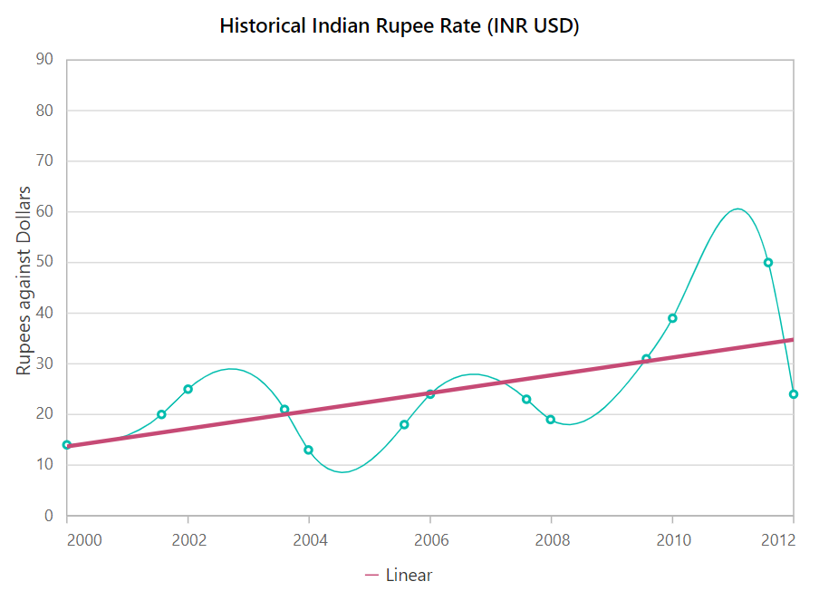

<!-- markdownlint-disable MD036 -->

# Trendlines

Trendlines are used to show the direction and speed of price.

Trendlines can be generated for Cartesian type series (Line, Column, Scatter, Area, Candle, Hilo etc.)
except bar type series. You can add more than one trendline to a series.

Chart supports 6 types of trendlines.

## Linear

A linear trendline is a best fit straight line that is used with simpler data sets. To render a linear trendline,
use trendline [`Type`](https://help.syncfusion.com/cr/blazor/Syncfusion.Blazor.Charts.ChartTrendline.html#Syncfusion_Blazor_Charts_ChartTrendline_Type) as **Linear**.





## Exponential

Exponential trendline is a curved line that is most useful when data values rise or fall
at increasingly higher rates. You cannot create an exponential trendline, if your data contains zero or negative values.

To render a exponential trendline,
use trendline [`Type`](https://help.syncfusion.com/cr/blazor/Syncfusion.Blazor.Charts.ChartTrendline.html#Syncfusion_Blazor_Charts_ChartTrendline_Type) as **Exponential**.





## Logarithmic

A logarithmic trendline is a best-fit curved line that is most useful when the rate of change
in the data increases or decreases quickly and then levels out.

A logarithmic trendline can use negative and/or positive values.

To render a logarithmic trendline, use trendline [`Type`](https://help.syncfusion.com/cr/blazor/Syncfusion.Blazor.Charts.ChartTrendline.html#Syncfusion_Blazor_Charts_ChartTrendline_Type) as **Logarithmic**.





## Polynomial

A polynomial trendline is a curved line that is used when data fluctuates.

To render a polynomial trendline,
use trendline [`Type`](https://help.syncfusion.com/cr/blazor/Syncfusion.Blazor.Charts.ChartTrendline.html#Syncfusion_Blazor_Charts_ChartTrendline_Type) as **Polynomial**.





## Power

A power trendline is a curved line that is best used with data sets that compare measurements that increase at a specific rate.

To render a power trendline, use trendline [`Type`](https://help.syncfusion.com/cr/blazor/Syncfusion.Blazor.Charts.ChartTrendline.html#Syncfusion_Blazor_Charts_ChartTrendline_Type) as **Power**.





## Moving Average

A moving average trendline smoothen out fluctuations in data to show a pattern or trend more clearly.

To render a moving average trendline, use trendline [`Type`](https://help.syncfusion.com/cr/blazor/Syncfusion.Blazor.Charts.ChartTrendline.html#Syncfusion_Blazor_Charts_ChartTrendline_Type) as `MovingAverage`.

[`Period`](https://help.syncfusion.com/cr/blazor/Syncfusion.Blazor.Charts.ChartTrendline.html#Syncfusion_Blazor_Charts_ChartTrendline_Period) property defines the period to find the moving average.





**Customization of Trendlines**

The [`Fill`](https://help.syncfusion.com/cr/blazor/Syncfusion.Blazor.Charts.ChartTrendline.html#Syncfusion_Blazor_Charts_ChartTrendline_Fill)
and [`Width`](https://help.syncfusion.com/cr/blazor/Syncfusion.Blazor.Charts.ChartTrendline.html#Syncfusion_Blazor_Charts_ChartTrendline_Width)
properties are used to customize the appearance of the trendline.

## Forecasting

Trendlines forecasting is the prediction of future/past situations.

Forecasting can be classified into two types as follows

Forward Forecasting and Backward Forecasting

**Forward Forecasting**

The value set for [`ForwardForecast`](https://help.syncfusion.com/cr/blazor/Syncfusion.Blazor.Charts.ChartTrendline.html#Syncfusion_Blazor_Charts_ChartTrendline_ForwardForecast) is used to determine the distance moving towards the future trend.





**Backward Forecasting**

The value set for the [`BackwardForecast`](https://help.syncfusion.com/cr/blazor/Syncfusion.Blazor.Charts.ChartTrendline.html#Syncfusion_Blazor_Charts_ChartTrendline_BackwardForecast) is used to determine the past trends.





> Note: You can refer to our [`Blazor Charts`](https://www.syncfusion.com/blazor-components/blazor-charts) feature tour page for its groundbreaking feature representations. You can also explore our [`Blazor Chart example`](https://blazor.syncfusion.com/demos/chart/line?theme=bootstrap4) to knows various chart types and how to represent time-dependent data, showing trends in data at equal intervals.

## See Also

* [Data label](./data-labels)
* [Tooltip](./tool-tip)
* [Marker](./data-markers)