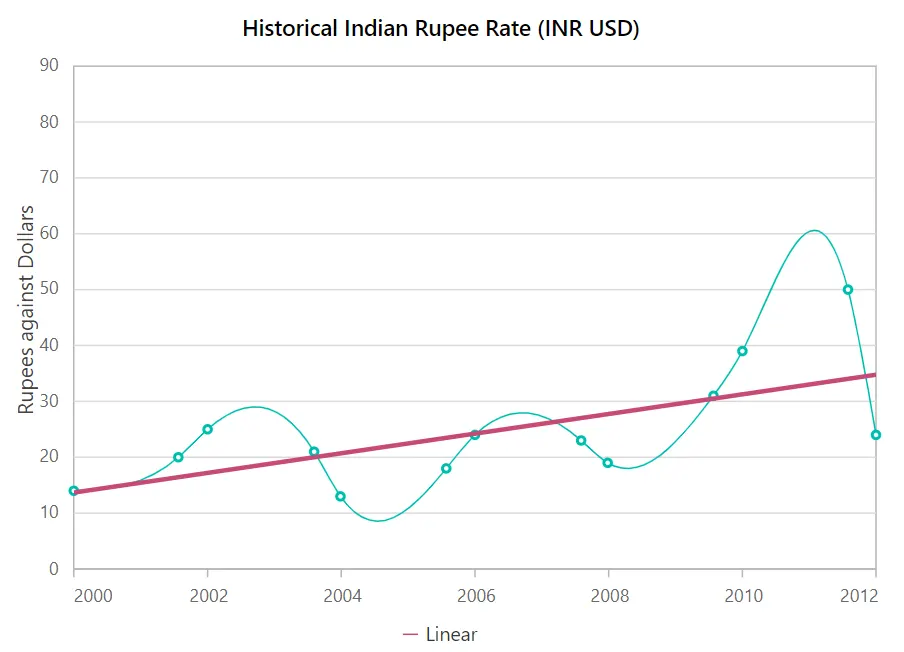
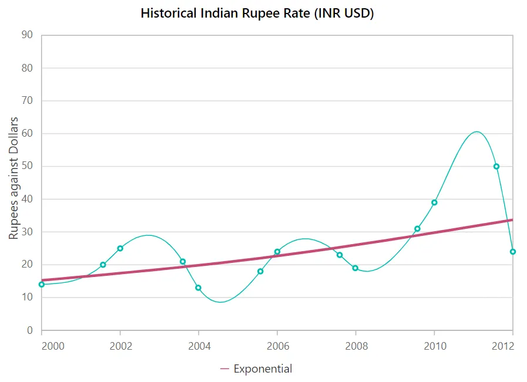
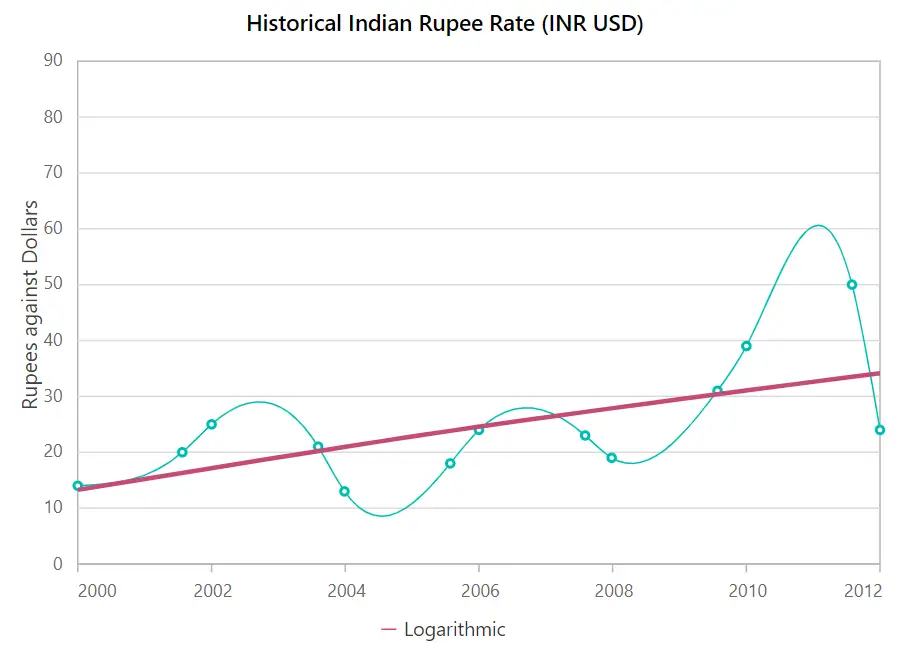
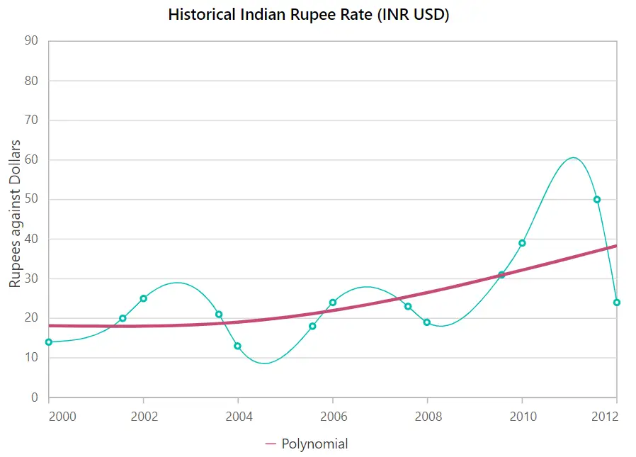
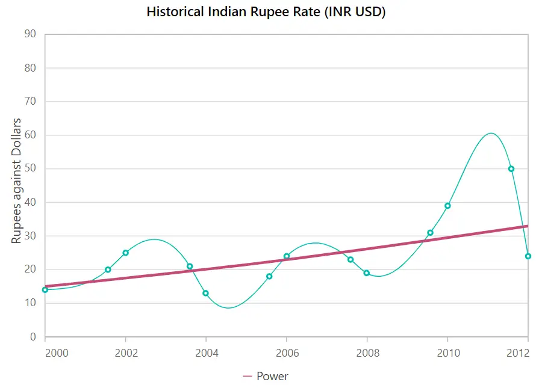
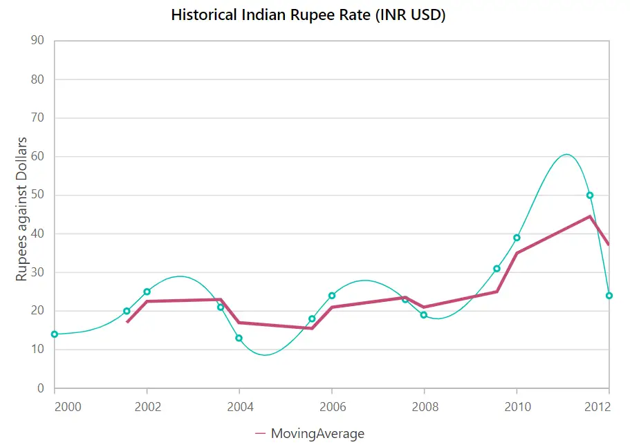
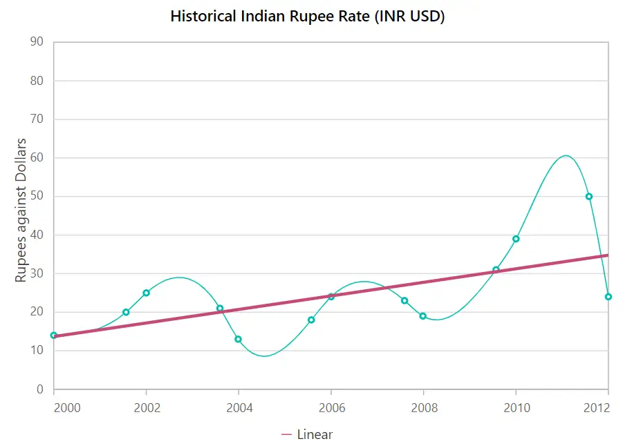
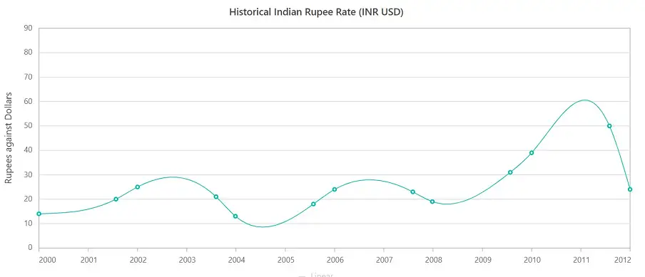

<!-- markdownlint-disable MD036 -->

# Blazor Charts Trendlines

<<<<<<< HEAD
Trendlines are used to show the price's direction and pace. Except for bar series, trendlines can be generated for Cartesian series like Line, Column, Scatter, Area, Candle, Hilo, and so on. In addition, a series can have multiple trendlines. There are six different types of trendlines that can be used on the chart: Linear, Exponential, Logarithmic, Polynomial, Power, and Moving Average.
=======
Trendlines are used to show the price's direction and pace. Except for bar series, trendlines can be generated for Cartesian series like Line, Column, Scatter, Area, Candle, Hilo, and so on. In addition, a series can have multiple trendlines. There are six different types of trendlines that can be used on the chart. They are as follows:
>>>>>>> 655e5219cae0555ffa90c568af9ca098db13f034

## Linear

A linear trendline is a best-fit straight line used with simpler data sets. To render a linear trendline, set the [Type](https://help.syncfusion.com/cr/blazor/Syncfusion.Blazor.Charts.ChartTrendline.html#Syncfusion_Blazor_Charts_ChartTrendline_Type) property to [Linear](https://help.syncfusion.com/cr/blazor/Syncfusion.Blazor.Charts.TrendlineTypes.html#Syncfusion_Blazor_Charts_TrendlineTypes_Linear).

```cshtml

@using Syncfusion.Blazor.Charts

<<<<<<< HEAD
<SfChart Title="Historical Indian Rupee Rate (INR USD)">
=======
<SfChart Title="Historical Indian Rupee Rate (INR USD)">  
>>>>>>> 655e5219cae0555ffa90c568af9ca098db13f034
    <ChartPrimaryXAxis LabelFormat="yyyy" ValueType="Syncfusion.Blazor.Charts.ValueType.DateTime" EdgeLabelPlacement="EdgeLabelPlacement.Shift">
        <ChartAxisMajorGridLines Width="0"></ChartAxisMajorGridLines>
    </ChartPrimaryXAxis>

    <ChartPrimaryYAxis Title="Rupees against Dollars">
        <ChartAxisLineStyle Width="0"></ChartAxisLineStyle>
        <ChartAxisMajorTickLines Width="0"></ChartAxisMajorTickLines>
    </ChartPrimaryYAxis>

    <ChartSeriesCollection>
        <ChartSeries DataSource="@Data" XName="XValue" YName="YValue" Type="ChartSeriesType.Spline">
            <ChartMarker Visible="true">
            </ChartMarker>
            <ChartTrendlines>
                <ChartTrendline Type="TrendlineTypes.Linear" Width="3" Name="Linear" Fill="#C64A75">
                </ChartTrendline>
            </ChartTrendlines>
        </ChartSeries>
    </ChartSeriesCollection>
</SfChart>

<<<<<<< HEAD
@code {
=======
@code{
>>>>>>> 655e5219cae0555ffa90c568af9ca098db13f034
    public class ChartData
    {
        public DateTime XValue { get; set; }
        public double YValue { get; set; }
    }

    public List<ChartData> Data = new List<ChartData>
	{
        new ChartData { XValue = new DateTime(2000, 2, 11), YValue = 14 },
        new ChartData { XValue = new DateTime(2001, 9, 4), YValue = 20 },
        new ChartData { XValue = new DateTime(2002, 2, 11), YValue = 25 },
        new ChartData { XValue = new DateTime(2003, 9, 16), YValue = 21 },
        new ChartData { XValue = new DateTime(2004, 2, 7), YValue = 13},
        new ChartData { XValue = new DateTime(2005, 9, 7), YValue = 18 },
        new ChartData { XValue = new DateTime(2006, 2, 11), YValue = 24 },
        new ChartData { XValue = new DateTime(2007, 9, 14), YValue = 23 },
        new ChartData { XValue = new DateTime(2008, 2, 6), YValue = 19 },
        new ChartData { XValue = new DateTime(2009, 9, 6), YValue = 31 },
        new ChartData { XValue = new DateTime(2010, 2, 11), YValue = 39},
        new ChartData { XValue = new DateTime(2011, 9, 11), YValue = 50 },
        new ChartData { XValue = new DateTime(2012, 2, 11), YValue = 24 },
    };
}

```



## Exponential

<<<<<<< HEAD
An exponential trendline is a curved line that is most useful when data values rise or fall at increasingly higher rates. If the data contains zero or negative values, an exponential trendline cannot be created. To render an exponential trendline, set the [Type](https://help.syncfusion.com/cr/blazor/Syncfusion.Blazor.Charts.ChartTrendline.html#Syncfusion_Blazor_Charts_ChartTrendline_Type) property to [Exponential](https://help.syncfusion.com/cr/blazor/Syncfusion.Blazor.Charts.TrendlineTypes.html#Syncfusion_Blazor_Charts_TrendlineTypes_Exponential).
=======
Exponential trendline is a curved line that is most useful when data values rise or fall at increasingly higher rates. If the data contains zero or negative values, an exponential trendline cannot be created. To render a exponential trendline, set the [Type](https://help.syncfusion.com/cr/blazor/Syncfusion.Blazor.Charts.ChartTrendline.html#Syncfusion_Blazor_Charts_ChartTrendline_Type) property to [Exponential](https://help.syncfusion.com/cr/blazor/Syncfusion.Blazor.Charts.TrendlineTypes.html#Syncfusion_Blazor_Charts_TrendlineTypes_Exponential).
>>>>>>> 655e5219cae0555ffa90c568af9ca098db13f034

```cshtml

@using Syncfusion.Blazor.Charts

<SfChart Title="Historical Indian Rupee Rate (INR USD)">
    <ChartPrimaryXAxis LabelFormat="yyyy" ValueType="Syncfusion.Blazor.Charts.ValueType.DateTime" EdgeLabelPlacement="EdgeLabelPlacement.Shift">
        <ChartAxisMajorGridLines Width="0"></ChartAxisMajorGridLines>
    </ChartPrimaryXAxis>

    <ChartPrimaryYAxis Title="Rupees against Dollars">
        <ChartAxisLineStyle Width="0"></ChartAxisLineStyle>
        <ChartAxisMajorTickLines Width="0"></ChartAxisMajorTickLines>
    </ChartPrimaryYAxis>

    <ChartSeriesCollection>
        <ChartSeries DataSource="@Data" XName="XValue" YName="YValue" Type="ChartSeriesType.Spline">
            <ChartMarker Visible="true">
            </ChartMarker>
            <ChartTrendlines>
                <ChartTrendline Type="TrendlineTypes.Exponential" Width="3" Name="Exponential" Fill="#C64A75">
                </ChartTrendline>
            </ChartTrendlines>
        </ChartSeries>
    </ChartSeriesCollection>
</SfChart>

<<<<<<< HEAD
@code {
=======
@code{
>>>>>>> 655e5219cae0555ffa90c568af9ca098db13f034
    public class ChartData
    {
        public DateTime XValue { get; set; }
        public double YValue { get; set; }
    }

    public List<ChartData> Data = new List<ChartData>
	{
        new ChartData { XValue = new DateTime(2000, 2, 11), YValue = 14 },
        new ChartData { XValue = new DateTime(2001, 9, 4), YValue = 20 },
        new ChartData { XValue = new DateTime(2002, 2, 11), YValue = 25 },
        new ChartData { XValue = new DateTime(2003, 9, 16), YValue = 21 },
        new ChartData { XValue = new DateTime(2004, 2, 7), YValue = 13},
        new ChartData { XValue = new DateTime(2005, 9, 7), YValue = 18 },
        new ChartData { XValue = new DateTime(2006, 2, 11), YValue = 24 },
        new ChartData { XValue = new DateTime(2007, 9, 14), YValue = 23 },
        new ChartData { XValue = new DateTime(2008, 2, 6), YValue = 19 },
        new ChartData { XValue = new DateTime(2009, 9, 6), YValue = 31 },
        new ChartData { XValue = new DateTime(2010, 2, 11), YValue = 39},
        new ChartData { XValue = new DateTime(2011, 9, 11), YValue = 50 },
        new ChartData { XValue = new DateTime(2012, 2, 11), YValue = 24 },
    };
}

```



## Logarithmic

A logarithmic trendline is a best-fit curved line that is most useful when the rate of change in the data increases or decreases quickly and then levels out. Negative and positive numbers can be used in a logarithmic trendline. To render a logarithmic trendline, set the [Type](https://help.syncfusion.com/cr/blazor/Syncfusion.Blazor.Charts.ChartTrendline.html#Syncfusion_Blazor_Charts_ChartTrendline_Type) property to [Logarithmic](https://help.syncfusion.com/cr/blazor/Syncfusion.Blazor.Charts.TrendlineTypes.html#Syncfusion_Blazor_Charts_TrendlineTypes_Logarithmic).

```cshtml

@using Syncfusion.Blazor.Charts

<SfChart Title="Historical Indian Rupee Rate (INR USD)">
    <ChartPrimaryXAxis LabelFormat="yyyy" ValueType="Syncfusion.Blazor.Charts.ValueType.DateTime" EdgeLabelPlacement="EdgeLabelPlacement.Shift">
        <ChartAxisMajorGridLines Width="0"></ChartAxisMajorGridLines>
    </ChartPrimaryXAxis>

    <ChartPrimaryYAxis Title="Rupees against Dollars">
        <ChartAxisLineStyle Width="0"></ChartAxisLineStyle>
        <ChartAxisMajorTickLines Width="0"></ChartAxisMajorTickLines>
    </ChartPrimaryYAxis>

    <ChartSeriesCollection>
        <ChartSeries DataSource="@Data" XName="XValue" YName="YValue" Type="ChartSeriesType.Spline">
            <ChartMarker Visible="true">
            </ChartMarker>
            <ChartTrendlines>
                <ChartTrendline Type="TrendlineTypes.Logarithmic" Width="3" Name="Logarithmic" Fill="#C64A75">
                </ChartTrendline>
            </ChartTrendlines>
        </ChartSeries>
    </ChartSeriesCollection>
</SfChart>

<<<<<<< HEAD
@code {
=======
@code{
>>>>>>> 655e5219cae0555ffa90c568af9ca098db13f034
    public class ChartData
    {
        public DateTime XValue { get; set; }
        public double YValue { get; set; }
    }

    public List<ChartData> Data = new List<ChartData>
	{
        new ChartData { XValue = new DateTime(2000, 2, 11), YValue = 14 },
        new ChartData { XValue = new DateTime(2001, 9, 4), YValue = 20 },
        new ChartData { XValue = new DateTime(2002, 2, 11), YValue = 25 },
        new ChartData { XValue = new DateTime(2003, 9, 16), YValue = 21 },
        new ChartData { XValue = new DateTime(2004, 2, 7), YValue = 13},
        new ChartData { XValue = new DateTime(2005, 9, 7), YValue = 18 },
        new ChartData { XValue = new DateTime(2006, 2, 11), YValue = 24 },
        new ChartData { XValue = new DateTime(2007, 9, 14), YValue = 23 },
        new ChartData { XValue = new DateTime(2008, 2, 6), YValue = 19 },
        new ChartData { XValue = new DateTime(2009, 9, 6), YValue = 31 },
        new ChartData { XValue = new DateTime(2010, 2, 11), YValue = 39},
        new ChartData { XValue = new DateTime(2011, 9, 11), YValue = 50 },
        new ChartData { XValue = new DateTime(2012, 2, 11), YValue = 24 },
    };
}

```



## Polynomial

<<<<<<< HEAD
A polynomial trendline is a curved line that is used when data fluctuates. To render a polynomial trendline, set the [Type](https://help.syncfusion.com/cr/blazor/Syncfusion.Blazor.Charts.ChartTrendline.html#Syncfusion_Blazor_Charts_ChartTrendline_Type) property to [Polynomial](https://help.syncfusion.com/cr/blazor/Syncfusion.Blazor.Charts.TrendlineTypes.html#Syncfusion_Blazor_Charts_TrendlineTypes_Polynomial). The [PolynomialOrder](https://help.syncfusion.com/cr/blazor/Syncfusion.Blazor.Charts.ChartTrendline.html#Syncfusion_Blazor_Charts_ChartTrendline_PolynomialOrder) property controls the degree of the polynomial (default is 2).
=======
A polynomial trendline is a curved line that is used when data fluctuates. To render a polynomial trendline, set the [Type](https://help.syncfusion.com/cr/blazor/Syncfusion.Blazor.Charts.ChartTrendline.html#Syncfusion_Blazor_Charts_ChartTrendline_Type) property to [Polynomial](https://help.syncfusion.com/cr/blazor/Syncfusion.Blazor.Charts.TrendlineTypes.html#Syncfusion_Blazor_Charts_TrendlineTypes_Polynomial).
>>>>>>> 655e5219cae0555ffa90c568af9ca098db13f034

```cshtml

@using Syncfusion.Blazor.Charts

<SfChart Title="Historical Indian Rupee Rate (INR USD)">
    <ChartPrimaryXAxis LabelFormat="yyyy" ValueType="Syncfusion.Blazor.Charts.ValueType.DateTime" EdgeLabelPlacement="EdgeLabelPlacement.Shift">
        <ChartAxisMajorGridLines Width="0"></ChartAxisMajorGridLines>
    </ChartPrimaryXAxis>

    <ChartPrimaryYAxis Title="Rupees against Dollars">
        <ChartAxisLineStyle Width="0"></ChartAxisLineStyle>
        <ChartAxisMajorTickLines Width="0"></ChartAxisMajorTickLines>
    </ChartPrimaryYAxis>

    <ChartSeriesCollection>
        <ChartSeries DataSource="@Data" XName="XValue" YName="YValue" Type="ChartSeriesType.Spline">
            <ChartMarker Visible="true">
            </ChartMarker>
            <ChartTrendlines>
                <ChartTrendline Type="TrendlineTypes.Polynomial" Width="3" Name="Polynomial" Fill="#C64A75">
                </ChartTrendline>
            </ChartTrendlines>
        </ChartSeries>
    </ChartSeriesCollection>
</SfChart>

<<<<<<< HEAD
@code {
=======
@code{
>>>>>>> 655e5219cae0555ffa90c568af9ca098db13f034
    public class ChartData
    {
        public DateTime XValue { get; set; }
        public double YValue { get; set; }
    }

    public List<ChartData> Data = new List<ChartData>
	{
        new ChartData { XValue = new DateTime(2000, 2, 11), YValue = 14 },
        new ChartData { XValue = new DateTime(2001, 9, 4), YValue = 20 },
        new ChartData { XValue = new DateTime(2002, 2, 11), YValue = 25 },
        new ChartData { XValue = new DateTime(2003, 9, 16), YValue = 21 },
        new ChartData { XValue = new DateTime(2004, 2, 7), YValue = 13},
        new ChartData { XValue = new DateTime(2005, 9, 7), YValue = 18 },
        new ChartData { XValue = new DateTime(2006, 2, 11), YValue = 24 },
        new ChartData { XValue = new DateTime(2007, 9, 14), YValue = 23 },
        new ChartData { XValue = new DateTime(2008, 2, 6), YValue = 19 },
        new ChartData { XValue = new DateTime(2009, 9, 6), YValue = 31 },
        new ChartData { XValue = new DateTime(2010, 2, 11), YValue = 39},
        new ChartData { XValue = new DateTime(2011, 9, 11), YValue = 50 },
        new ChartData { XValue = new DateTime(2012, 2, 11), YValue = 24 },
    };
}

```



## Power

A power trendline is a curved line that is best used with data sets that compare measurements that increase at a specific rate. To render a power trendline, set the [Type](https://help.syncfusion.com/cr/blazor/Syncfusion.Blazor.Charts.ChartTrendline.html#Syncfusion_Blazor_Charts_ChartTrendline_Type) property to [Power](https://help.syncfusion.com/cr/blazor/Syncfusion.Blazor.Charts.TrendlineTypes.html#Syncfusion_Blazor_Charts_TrendlineTypes_Power).

```cshtml

@using Syncfusion.Blazor.Charts

<SfChart Title="Historical Indian Rupee Rate (INR USD)">
    <ChartPrimaryXAxis LabelFormat="yyyy" ValueType="Syncfusion.Blazor.Charts.ValueType.DateTime" EdgeLabelPlacement="EdgeLabelPlacement.Shift">
        <ChartAxisMajorGridLines Width="0"></ChartAxisMajorGridLines>
    </ChartPrimaryXAxis>

    <ChartPrimaryYAxis Title="Rupees against Dollars">
        <ChartAxisLineStyle Width="0"></ChartAxisLineStyle>
        <ChartAxisMajorTickLines Width="0"></ChartAxisMajorTickLines>
    </ChartPrimaryYAxis>

    <ChartSeriesCollection>
        <ChartSeries DataSource="@Data" XName="XValue" YName="YValue" Type="ChartSeriesType.Spline">
            <ChartMarker Visible="true">
            </ChartMarker>
            <ChartTrendlines>
                <ChartTrendline Type="TrendlineTypes.Power" Width="3" Name="Power" Fill="#C64A75">
                </ChartTrendline>
            </ChartTrendlines>
        </ChartSeries>
    </ChartSeriesCollection>
</SfChart>

<<<<<<< HEAD
@code {
=======
@code{
>>>>>>> 655e5219cae0555ffa90c568af9ca098db13f034
    public class ChartData
    {
        public DateTime XValue { get; set; }
        public double YValue { get; set; }
    }

    public List<ChartData> Data = new List<ChartData>
	{
        new ChartData { XValue = new DateTime(2000, 2, 11), YValue = 14 },
        new ChartData { XValue = new DateTime(2001, 9, 4), YValue = 20 },
        new ChartData { XValue = new DateTime(2002, 2, 11), YValue = 25 },
        new ChartData { XValue = new DateTime(2003, 9, 16), YValue = 21 },
        new ChartData { XValue = new DateTime(2004, 2, 7), YValue = 13},
        new ChartData { XValue = new DateTime(2005, 9, 7), YValue = 18 },
        new ChartData { XValue = new DateTime(2006, 2, 11), YValue = 24 },
        new ChartData { XValue = new DateTime(2007, 9, 14), YValue = 23 },
        new ChartData { XValue = new DateTime(2008, 2, 6), YValue = 19 },
        new ChartData { XValue = new DateTime(2009, 9, 6), YValue = 31 },
        new ChartData { XValue = new DateTime(2010, 2, 11), YValue = 39},
        new ChartData { XValue = new DateTime(2011, 9, 11), YValue = 50 },
        new ChartData { XValue = new DateTime(2012, 2, 11), YValue = 24 },
    };
}

```



## Moving Average

<<<<<<< HEAD
A moving average trendline smooths out fluctuations in data to show a pattern or trend more clearly. To render a moving average trendline, set the [Type](https://help.syncfusion.com/cr/blazor/Syncfusion.Blazor.Charts.ChartTrendline.html#Syncfusion_Blazor_Charts_ChartTrendline_Type) property to [MovingAverage](https://help.syncfusion.com/cr/blazor/Syncfusion.Blazor.Charts.TrendlineTypes.html#Syncfusion_Blazor_Charts_TrendlineTypes_MovingAverage). The [Period](https://help.syncfusion.com/cr/blazor/Syncfusion.Blazor.Charts.ChartTrendline.html#Syncfusion_Blazor_Charts_ChartTrendline_Period) property specifies how many data points are used to calculate the moving average.
=======
A moving average trendline smoothen out fluctuations in data to show a pattern or trend more clearly. To render a moving average trendline, set the [Type](https://help.syncfusion.com/cr/blazor/Syncfusion.Blazor.Charts.ChartTrendline.html#Syncfusion_Blazor_Charts_ChartTrendline_Type) property to [MovingAverage](https://help.syncfusion.com/cr/blazor/Syncfusion.Blazor.Charts.TrendlineTypes.html#Syncfusion_Blazor_Charts_TrendlineTypes_MovingAverage). The [Period](https://help.syncfusion.com/cr/blazor/Syncfusion.Blazor.Charts.ChartTrendline.html#Syncfusion_Blazor_Charts_ChartTrendline_Period) property specifies how long the moving average should be calculated over.
>>>>>>> 655e5219cae0555ffa90c568af9ca098db13f034

```cshtml

@using Syncfusion.Blazor.Charts

<SfChart Title="Historical Indian Rupee Rate (INR USD)">
    <ChartPrimaryXAxis LabelFormat="yyyy" ValueType="Syncfusion.Blazor.Charts.ValueType.DateTime" EdgeLabelPlacement="EdgeLabelPlacement.Shift">
        <ChartAxisMajorGridLines Width="0"></ChartAxisMajorGridLines>
    </ChartPrimaryXAxis>

    <ChartPrimaryYAxis Title="Rupees against Dollars">
        <ChartAxisLineStyle Width="0"></ChartAxisLineStyle>
        <ChartAxisMajorTickLines Width="0"></ChartAxisMajorTickLines>
    </ChartPrimaryYAxis>

    <ChartSeriesCollection>
        <ChartSeries DataSource="@Data" XName="XValue" YName="YValue" Type="ChartSeriesType.Spline">
            <ChartMarker Visible="true">
            </ChartMarker>
            <ChartTrendlines>
                <ChartTrendline Type="TrendlineTypes.MovingAverage" Width="3" Name="MovingAverage" Fill="#C64A75">
                </ChartTrendline>
            </ChartTrendlines>
        </ChartSeries>
    </ChartSeriesCollection>
</SfChart>

<<<<<<< HEAD
@code {
=======
@code{
>>>>>>> 655e5219cae0555ffa90c568af9ca098db13f034
    public class ChartData
    {
        public DateTime XValue { get; set; }
        public double YValue { get; set; }
    }

    public List<ChartData> Data = new List<ChartData>
	{
        new ChartData { XValue = new DateTime(2000, 2, 11), YValue = 14 },
        new ChartData { XValue = new DateTime(2001, 9, 4), YValue = 20 },
        new ChartData { XValue = new DateTime(2002, 2, 11), YValue = 25 },
        new ChartData { XValue = new DateTime(2003, 9, 16), YValue = 21 },
        new ChartData { XValue = new DateTime(2004, 2, 7), YValue = 13},
        new ChartData { XValue = new DateTime(2005, 9, 7), YValue = 18 },
        new ChartData { XValue = new DateTime(2006, 2, 11), YValue = 24 },
        new ChartData { XValue = new DateTime(2007, 9, 14), YValue = 23 },
        new ChartData { XValue = new DateTime(2008, 2, 6), YValue = 19 },
        new ChartData { XValue = new DateTime(2009, 9, 6), YValue = 31 },
        new ChartData { XValue = new DateTime(2010, 2, 11), YValue = 39},
        new ChartData { XValue = new DateTime(2011, 9, 11), YValue = 50 },
        new ChartData { XValue = new DateTime(2012, 2, 11), YValue = 24 },
    };
}

```



## Forecasting

<<<<<<< HEAD
Trendline forecasting predicts future or past values by extending the trendline beyond the data range. There are two types of forecasting available: forward forecasting and backward forecasting.

### Forward forecasting

The [ForwardForecast](https://help.syncfusion.com/cr/blazor/Syncfusion.Blazor.Charts.ChartTrendline.html#Syncfusion_Blazor_Charts_ChartTrendline_ForwardForecast) property specifies the number of intervals by which the trendline is extrapolated forward.
=======
Trendlines forecasting is the prediction of future/past situations. There are two types of forecasting available: forward forecasting and backward forecasting.

### Forward forecasting

The value set to [ForwardForecast](https://help.syncfusion.com/cr/blazor/Syncfusion.Blazor.Charts.ChartTrendline.html#Syncfusion_Blazor_Charts_ChartTrendline_ForwardForecast) property is used to calculate the distance between the current trend and the future trend.
>>>>>>> 655e5219cae0555ffa90c568af9ca098db13f034

```cshtml

@using Syncfusion.Blazor.Charts

<SfChart Title="Historical Indian Rupee Rate (INR USD)">
    <ChartPrimaryXAxis LabelFormat="yyyy" ValueType="Syncfusion.Blazor.Charts.ValueType.DateTime" EdgeLabelPlacement="EdgeLabelPlacement.Shift">
        <ChartAxisMajorGridLines Width="0"></ChartAxisMajorGridLines>
    </ChartPrimaryXAxis>

    <ChartPrimaryYAxis Title="Rupees against Dollars">
        <ChartAxisLineStyle Width="0"></ChartAxisLineStyle>
        <ChartAxisMajorTickLines Width="0"></ChartAxisMajorTickLines>
    </ChartPrimaryYAxis>

    <ChartSeriesCollection>
        <ChartSeries DataSource="@Data" XName="XValue" YName="YValue" Type="ChartSeriesType.Spline">
            <ChartMarker Visible="true">
            </ChartMarker>
            <ChartTrendlines>
                <ChartTrendline Type="TrendlineTypes.Linear" Width="3" Name="Linear" Fill="#C64A75" ForwardForecast="5">
                </ChartTrendline>
            </ChartTrendlines>
        </ChartSeries>
    </ChartSeriesCollection>
</SfChart>

<<<<<<< HEAD
@code {
=======
@code{
>>>>>>> 655e5219cae0555ffa90c568af9ca098db13f034
    public class ChartData
    {
        public DateTime XValue { get; set; }
        public double YValue { get; set; }
    }

    public List<ChartData> Data = new List<ChartData>
	{
        new ChartData { XValue = new DateTime(2000, 2, 11), YValue = 14 },
        new ChartData { XValue = new DateTime(2001, 9, 4), YValue = 20 },
        new ChartData { XValue = new DateTime(2002, 2, 11), YValue = 25 },
        new ChartData { XValue = new DateTime(2003, 9, 16), YValue = 21 },
        new ChartData { XValue = new DateTime(2004, 2, 7), YValue = 13},
        new ChartData { XValue = new DateTime(2005, 9, 7), YValue = 18 },
        new ChartData { XValue = new DateTime(2006, 2, 11), YValue = 24 },
        new ChartData { XValue = new DateTime(2007, 9, 14), YValue = 23 },
        new ChartData { XValue = new DateTime(2008, 2, 6), YValue = 19 },
        new ChartData { XValue = new DateTime(2009, 9, 6), YValue = 31 },
        new ChartData { XValue = new DateTime(2010, 2, 11), YValue = 39},
        new ChartData { XValue = new DateTime(2011, 9, 11), YValue = 50 },
        new ChartData { XValue = new DateTime(2012, 2, 11), YValue = 24 },
    };
}

```



### Backward forecasting

<<<<<<< HEAD
The [BackwardForecast](https://help.syncfusion.com/cr/blazor/Syncfusion.Blazor.Charts.ChartTrendline.html#Syncfusion_Blazor_Charts_ChartTrendline_BackwardForecast) property specifies the number of intervals by which the trendline is extrapolated backward.
=======
The value set to [BackwardForecast](https://help.syncfusion.com/cr/blazor/Syncfusion.Blazor.Charts.ChartTrendline.html#Syncfusion_Blazor_Charts_ChartTrendline_BackwardForecast) property is used to determine historical trends.
>>>>>>> 655e5219cae0555ffa90c568af9ca098db13f034

```cshtml

@using Syncfusion.Blazor.Charts

<SfChart Title="Historical Indian Rupee Rate (INR USD)">
    <ChartPrimaryXAxis LabelFormat="yyyy" ValueType="Syncfusion.Blazor.Charts.ValueType.DateTime" EdgeLabelPlacement="EdgeLabelPlacement.Shift">
        <ChartAxisMajorGridLines Width="0"></ChartAxisMajorGridLines>
    </ChartPrimaryXAxis>

    <ChartPrimaryYAxis Title="Rupees against Dollars">
        <ChartAxisLineStyle Width="0"></ChartAxisLineStyle>
        <ChartAxisMajorTickLines Width="0"></ChartAxisMajorTickLines>
    </ChartPrimaryYAxis>

    <ChartSeriesCollection>
        <ChartSeries DataSource="@Data" XName="XValue" YName="YValue" Type="ChartSeriesType.Spline">
            <ChartMarker Visible="true">
            </ChartMarker>
            <ChartTrendlines>
                <ChartTrendline Type="TrendlineTypes.Linear" Width="3" Name="Linear" Fill="#C64A75" BackwardForecast="5">
                </ChartTrendline>
            </ChartTrendlines>
        </ChartSeries>
    </ChartSeriesCollection>
</SfChart>

<<<<<<< HEAD
@code {
=======
@code{
>>>>>>> 655e5219cae0555ffa90c568af9ca098db13f034
    public class ChartData
    {
        public DateTime XValue { get; set; }
        public double YValue { get; set; }
    }

    public List<ChartData> Data = new List<ChartData>
	{
        new ChartData { XValue = new DateTime(2000, 2, 11), YValue = 14 },
        new ChartData { XValue = new DateTime(2001, 9, 4), YValue = 20 },
        new ChartData { XValue = new DateTime(2002, 2, 11), YValue = 25 },
        new ChartData { XValue = new DateTime(2003, 9, 16), YValue = 21 },
        new ChartData { XValue = new DateTime(2004, 2, 7), YValue = 13},
        new ChartData { XValue = new DateTime(2005, 9, 7), YValue = 18 },
        new ChartData { XValue = new DateTime(2006, 2, 11), YValue = 24 },
        new ChartData { XValue = new DateTime(2007, 9, 14), YValue = 23 },
        new ChartData { XValue = new DateTime(2008, 2, 6), YValue = 19 },
        new ChartData { XValue = new DateTime(2009, 9, 6), YValue = 31 },
        new ChartData { XValue = new DateTime(2010, 2, 11), YValue = 39},
        new ChartData { XValue = new DateTime(2011, 9, 11), YValue = 50 },
        new ChartData { XValue = new DateTime(2012, 2, 11), YValue = 24 },
    };
}

```


<<<<<<< HEAD
## Customizing trendlines

The [Fill](https://help.syncfusion.com/cr/blazor/Syncfusion.Blazor.Charts.ChartTrendline.html#Syncfusion_Blazor_Charts_ChartTrendline_Fill) and [Width](https://help.syncfusion.com/cr/blazor/Syncfusion.Blazor.Charts.ChartTrendline.html#Syncfusion_Blazor_Charts_ChartTrendline_Width) properties are used to customize the appearance of the trendline. The [DashArray](https://help.syncfusion.com/cr/blazor/Syncfusion.Blazor.Charts.ChartTrendline.html#Syncfusion_Blazor_Charts_ChartTrendline_DashArray) property can be set to render a dashed trendline.

### Show or hide a trendline

Use the trendline [Visible](https://help.syncfusion.com/cr/blazor/Syncfusion.Blazor.Charts.ChartTrendline.html#Syncfusion_Blazor_Charts_ChartTrendline_Visible) property to show or hide the trendline.
=======
## Trendlines customization

The [Fill](https://help.syncfusion.com/cr/blazor/Syncfusion.Blazor.Charts.ChartTrendline.html#Syncfusion_Blazor_Charts_ChartTrendline_Fill) and [Width](https://help.syncfusion.com/cr/blazor/Syncfusion.Blazor.Charts.ChartTrendline.html#Syncfusion_Blazor_Charts_ChartTrendline_Width) properties are used to customize the appearance of the trendline.

N> Refer to the [Blazor Charts](https://www.syncfusion.com/blazor-components/blazor-charts) feature tour page for its groundbreaking feature representations and also explore the [Blazor Chart Example](https://blazor.syncfusion.com/demos/chart/line?theme=fluent2) to know various chart types and how to represent time-dependent data, showing trends at equal intervals.

## Show or hide a trendline

Use the trendline [visible](https://help.syncfusion.com/cr/blazor/Syncfusion.Blazor.Charts.ChartTrendline.html#Syncfusion_Blazor_Charts_ChartTrendline_Visible) property to show or hide the trendline.
>>>>>>> 655e5219cae0555ffa90c568af9ca098db13f034

```cshtml

@using Syncfusion.Blazor.Charts

<<<<<<< HEAD
<SfChart Title="Historical Indian Rupee Rate (INR USD)">
=======
<SfChart Title="Historical Indian Rupee Rate (INR USD)">  
>>>>>>> 655e5219cae0555ffa90c568af9ca098db13f034
    <ChartPrimaryXAxis LabelFormat="yyyy" ValueType="Syncfusion.Blazor.Charts.ValueType.DateTime" EdgeLabelPlacement="EdgeLabelPlacement.Shift">
        <ChartAxisMajorGridLines Width="0"></ChartAxisMajorGridLines>
    </ChartPrimaryXAxis>

    <ChartPrimaryYAxis Title="Rupees against Dollars">
        <ChartAxisLineStyle Width="0"></ChartAxisLineStyle>
        <ChartAxisMajorTickLines Width="0"></ChartAxisMajorTickLines>
    </ChartPrimaryYAxis>

    <ChartSeriesCollection>
        <ChartSeries DataSource="@Data" XName="XValue" YName="YValue" Type="ChartSeriesType.Spline">
            <ChartMarker Visible="true">
            </ChartMarker>
            <ChartTrendlines>
<<<<<<< HEAD
                <ChartTrendline Type="TrendlineTypes.Linear" Width="3" Name="Linear" Fill="#C64A75" Visible="false">
=======
                <ChartTrendline Type="TrendlineTypes.Linear" Width="3" Name="Linear" Fill="#C64A75" Visible= "false">
>>>>>>> 655e5219cae0555ffa90c568af9ca098db13f034
                </ChartTrendline>
            </ChartTrendlines>
        </ChartSeries>
    </ChartSeriesCollection>
</SfChart>

<<<<<<< HEAD
@code {
=======
@code{
>>>>>>> 655e5219cae0555ffa90c568af9ca098db13f034
    public class ChartData
    {
        public DateTime XValue { get; set; }
        public double YValue { get; set; }
    }

    public List<ChartData> Data = new List<ChartData>
	{
        new ChartData { XValue = new DateTime(2000, 2, 11), YValue = 14 },
        new ChartData { XValue = new DateTime(2001, 9, 4), YValue = 20 },
        new ChartData { XValue = new DateTime(2002, 2, 11), YValue = 25 },
        new ChartData { XValue = new DateTime(2003, 9, 16), YValue = 21 },
        new ChartData { XValue = new DateTime(2004, 2, 7), YValue = 13},
        new ChartData { XValue = new DateTime(2005, 9, 7), YValue = 18 },
        new ChartData { XValue = new DateTime(2006, 2, 11), YValue = 24 },
        new ChartData { XValue = new DateTime(2007, 9, 14), YValue = 23 },
        new ChartData { XValue = new DateTime(2008, 2, 6), YValue = 19 },
        new ChartData { XValue = new DateTime(2009, 9, 6), YValue = 31 },
        new ChartData { XValue = new DateTime(2010, 2, 11), YValue = 39},
        new ChartData { XValue = new DateTime(2011, 9, 11), YValue = 50 },
        new ChartData { XValue = new DateTime(2012, 2, 11), YValue = 24 },
    };
}

```



## See also

<<<<<<< HEAD
* [Technical Indicators](./technical-indicators)
* [Data Markers](./data-markers)
* [Tooltip](./tool-tip)
=======
* [Data label](./data-labels)
* [Tooltip](./tool-tip)
* [Marker](./data-markers)
>>>>>>> 655e5219cae0555ffa90c568af9ca098db13f034
