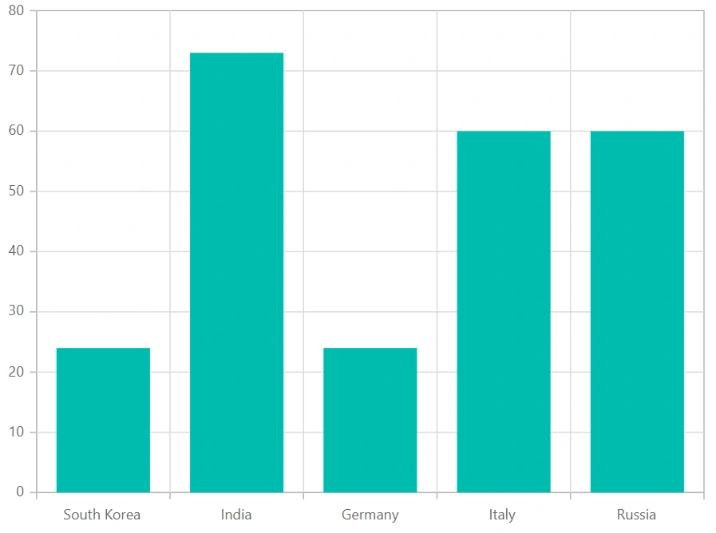
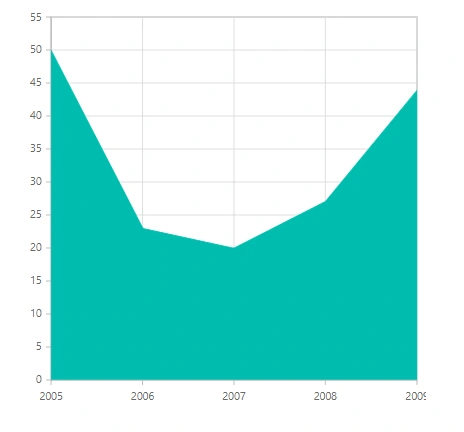

<!-- markdownlint-disable MD036 -->

# Blazor Charts Working with Data

The Chart component supports two primary data binding approaches. Bind a list of business objects directly to the [DataSource](https://help.syncfusion.com/cr/blazor/Syncfusion.Blazor.Charts.ChartSeries.html#Syncfusion_Blazor_Charts_ChartSeries_DataSource) property, or use [SfDataManager](https://help.syncfusion.com/cr/blazor/Syncfusion.Blazor.Data.SfDataManager.html) for RESTful JSON services, OData endpoints, and Web API integration. Map each data field to the [XName](https://help.syncfusion.com/cr/blazor/Syncfusion.Blazor.Charts.ChartSeries.html#Syncfusion_Blazor_Charts_ChartSeries_XName) and [YName](https://help.syncfusion.com/cr/blazor/Syncfusion.Blazor.Charts.ChartSeries.html#Syncfusion_Blazor_Charts_ChartSeries_YName) properties on the series.

It supports the following data binding methods:
* List binding
* Remote data

## List binding

Assign an [IEnumerable](https://learn.microsoft.com/en-us/dotnet/api/system.collections.ienumerable) (such as `List<T>` or `T[]`) directly to the [DataSource](https://help.syncfusion.com/cr/blazor/Syncfusion.Blazor.Charts.ChartSeries.html#Syncfusion_Blazor_Charts_ChartSeries_DataSource) property, or wrap it in an [SfDataManager](https://help.syncfusion.com/cr/blazor/Syncfusion.Blazor.Data.SfDataManager.html) instance when you need client-side operations (sorting, filtering, paging). The data fields are then mapped to the [XName](https://help.syncfusion.com/cr/blazor/Syncfusion.Blazor.Charts.ChartSeries.html#Syncfusion_Blazor_Charts_ChartSeries_XName) and [YName](https://help.syncfusion.com/cr/blazor/Syncfusion.Blazor.Charts.ChartSeries.html#Syncfusion_Blazor_Charts_ChartSeries_YName) properties on the series.

```cshtml
@using Syncfusion.Blazor.Charts

<SfChart Title="Inflation - Consumer Price" Width="60%">
    <ChartPrimaryXAxis IntervalType="IntervalType.Years" LabelFormat="yyyy" ValueType="Syncfusion.Blazor.Charts.ValueType.DateTime">
    </ChartPrimaryXAxis>
    <ChartSeriesCollection>
        <ChartSeries DataSource="@ConsumerReports" XName="XValue" YName="YValue" Type="ChartSeriesType.Line">
        </ChartSeries>
    </ChartSeriesCollection>
</SfChart>

@code {
    public class ChartData
    {
        public DateTime XValue { get; set; }
        public double YValue { get; set; }
    }

    public List<ChartData> ConsumerReports = new List<ChartData>
    {
        new ChartData { XValue = new DateTime(2005, 01, 01), YValue = 21 },
        new ChartData { XValue = new DateTime(2006, 01, 01), YValue = 24 },
        new ChartData { XValue = new DateTime(2007, 01, 01), YValue = 36 },
        new ChartData { XValue = new DateTime(2008, 01, 01), YValue = 38 },
        new ChartData { XValue = new DateTime(2009, 01, 01), YValue = 54 },
        new ChartData { XValue = new DateTime(2010, 01, 01), YValue = 57 },
        new ChartData { XValue = new DateTime(2011, 01, 01), YValue = 70 },
    };
}
```


N> By default, [SfDataManager](https://help.syncfusion.com/cr/blazor/Syncfusion.Blazor.Data.SfDataManager.html) uses **BlazorAdaptor** for list data binding. Use this adaptor when you want client-side sorting, filtering, and paging on a local list.

### ExpandoObject binding

The Chart is strongly typed to a model class. When the data model is not known at compile time, you can bind a list of [ExpandoObject](https://learn.microsoft.com/en-us/dotnet/api/system.dynamic.expandoobject) instances to the [DataSource](https://help.syncfusion.com/cr/blazor/Syncfusion.Blazor.Charts.ChartSeries.html#Syncfusion_Blazor_Charts_ChartSeries_DataSource) property. Set the field names (`X`, `Y`) on each `ExpandoObject` at runtime and reference them in `XName` and `YName`.

```cshtml
@using Syncfusion.Blazor.Charts
@using System.Dynamic

<SfChart>
    <ChartPrimaryXAxis ValueType="Syncfusion.Blazor.Charts.ValueType.Category" />
    <ChartSeriesCollection>
        <ChartSeries DataSource="@MedalDetails" XName="X" YName="Y" Type="ChartSeriesType.Column">
        </ChartSeries>
    </ChartSeriesCollection>
</SfChart>

@code {
    private List<string> countries = new List<string> { "South Korea", "India", "Germany", "Italy", "Russia" };
    private Random randomNum = new Random();
    public List<ExpandoObject> MedalDetails { get; set; } = new List<ExpandoObject>();
    protected override void OnInitialized()
    {
        MedalDetails = Enumerable.Range(0, 5).Select((x) =>
        {
            dynamic d = new ExpandoObject();
            d.X = countries[x];
            d.Y = randomNum.Next(20, 80);
            return d;
        }).Cast<ExpandoObject>().ToList<ExpandoObject>();
    }
}
```



### DynamicObject binding

When you need a custom dynamic model with derived behavior, inherit from [DynamicObject](https://learn.microsoft.com/en-us/dotnet/api/system.dynamic.dynamicobject) and assign a list of that type to the [DataSource](https://help.syncfusion.com/cr/blazor/Syncfusion.Blazor.Charts.ChartSeries.html#Syncfusion_Blazor_Charts_ChartSeries_DataSource) property. The `XName` and `YName` values must match the dynamic member names set on the object.

```cshtml
@using Syncfusion.Blazor.Charts
@using System.Dynamic

<SfChart>
    <ChartPrimaryXAxis ValueType="Syncfusion.Blazor.Charts.ValueType.DateTime"></ChartPrimaryXAxis>
    <ChartPrimaryYAxis></ChartPrimaryYAxis>
    <ChartSeriesCollection>
        <ChartSeries DataSource="@MedalDetails" XName="X" YName="Y" Type="ChartSeriesType.Area"></ChartSeries>
    </ChartSeriesCollection>
</SfChart>

@code {
    private List<DateTime> Dates = new List<DateTime>
    {
        new DateTime(2005, 01, 01), new DateTime(2006, 01, 01),
        new DateTime(2007, 01, 01), new DateTime(2008, 01, 01), new DateTime(2009, 01, 01)
    };
    private Random randomNum = new Random();
    public List<DynamicDictionary> MedalDetails = new List<DynamicDictionary>() { };
    protected override void OnInitialized()
    {
        MedalDetails = Enumerable.Range(0, 5).Select((x) =>
        {
            dynamic d = new DynamicDictionary();
            d.X = Dates[x];
            d.Y = randomNum.Next(20, 80);
            return d;
        }).Cast<DynamicDictionary>().ToList<DynamicDictionary>();
    }
    public class DynamicDictionary : DynamicObject
    {
        Dictionary<string, object> dictionary = new Dictionary<string, object>();

        public override bool TryGetMember(GetMemberBinder binder, out object result)
        {
            string name = binder.Name;
            return dictionary.TryGetValue(name, out result);
        }
        public override bool TrySetMember(SetMemberBinder binder, object value)
        {
            dictionary[binder.Name] = value;
            return true;
        }

        public override System.Collections.Generic.IEnumerable<string> GetDynamicMemberNames()
        {
            return this.dictionary?.Keys;
        }
    }
}
```



## Remote data

Assign service data as an instance of [SfDataManager](https://help.syncfusion.com/cr/blazor/Syncfusion.Blazor.Data.SfDataManager.html) to the [DataSource](https://help.syncfusion.com/cr/blazor/Syncfusion.Blazor.Charts.ChartSeries.html#Syncfusion_Blazor_Charts_ChartSeries_DataSource) property to bind remote data to the chart component. Provide the endpoint Url to communicate with a remote data source.

```cshtml
@using Syncfusion.Blazor.Data
@using Syncfusion.Blazor.Charts

<SfChart>
    <SfDataManager Url="https://services.odata.org/V4/Northwind/Northwind.svc/Orders" Adaptor="Syncfusion.Blazor.Adaptors.ODataV4Adaptor"></SfDataManager>

    <ChartPrimaryXAxis Title="Orders" ValueType="Syncfusion.Blazor.Charts.ValueType.Category"
                       RangePadding="ChartRangePadding.Additional"></ChartPrimaryXAxis>

    <ChartSeriesCollection>
        <ChartSeries XName="OrderID" YName="Freight" Type="ChartSeriesType.Column"></ChartSeries>
    </ChartSeriesCollection>
</SfChart>
```


### Binding with OData services

[OData](https://www.odata.org/documentation/odata-version-3-0/) is a standardized protocol for creating and consuming data. The [SfDataManager](https://help.syncfusion.com/cr/blazor/Syncfusion.Blazor.Data.SfDataManager.html) can retrieve data from an OData v3 endpoint through the `ODataAdaptor`.

```cshtml
@using Syncfusion.Blazor.Data
@using Syncfusion.Blazor.Charts

<SfChart>
    <SfDataManager Url="https://services.odata.org/Northwind/Northwind.svc/Orders" Adaptor="Syncfusion.Blazor.Adaptors.ODataAdaptor"></SfDataManager>

    <ChartPrimaryXAxis ValueType="Syncfusion.Blazor.Charts.ValueType.Category"
                       RangePadding="ChartRangePadding.Additional"></ChartPrimaryXAxis>

    <ChartSeriesCollection>
        <ChartSeries XName="OrderID" YName="Freight" Type="ChartSeriesType.Column"></ChartSeries>
    </ChartSeriesCollection>
</SfChart>
```

### Binding with OData v4 services

The [SfDataManager](https://help.syncfusion.com/cr/blazor/Syncfusion.Blazor.Data.SfDataManager.html) can retrieve and consume OData v4 services, the upgraded version of the OData protocol. Refer to the [OData v4 documentation](https://docs.oasis-open.org/odata/odata/v4.0/errata03/os/complete/part1-protocol/odata-v4.0-errata03-os-part1-protocol-complete.html#_Toc453752197) for additional information. To bind an OData v4 service, use the **ODataV4Adaptor**, as shown in the **Remote data** sample above.

### Web API

The [WebApiAdaptor](https://help.syncfusion.com/cr/blazor/Syncfusion.Blazor.Data.WebApiAdaptor.html) binds a chart to a custom Web API endpoint that returns JSON. The endpoint does not need to follow the OData protocol; the adaptor handles paging, sorting, and filtering on the client.

```cshtml
@using Syncfusion.Blazor.Data
@using Syncfusion.Blazor.Charts

<SfChart>
    <SfDataManager Url="https://blazor.syncfusion.com/services/production/api/Orders" Adaptor="Adaptors.WebApiAdaptor"></SfDataManager>

    <ChartPrimaryXAxis Title="Orders" ValueType="Syncfusion.Blazor.Charts.ValueType.Category"
                       ></ChartPrimaryXAxis>

    <ChartSeriesCollection>
        <ChartSeries XName="OrderID" YName="Freight" Type="ChartSeriesType.Column"></ChartSeries>
    </ChartSeriesCollection>
</SfChart>
```


### Sending additional parameters to the server

To create a data request with a custom parameter, add additional parameters to the [Query](https://help.syncfusion.com/cr/blazor/Syncfusion.Blazor.Charts.ChartSeries.html#Syncfusion_Blazor_Charts_ChartSeries_Query) object and assign it to the chart's Query property.

The following sample code shows how to send parameters using the Query property in the series.

```cshtml
@using Syncfusion.Blazor.Data
@using Syncfusion.Blazor.Charts

<SfChart>
    <SfDataManager Url="https://services.odata.org/V4/Northwind/Northwind.svc/Orders" Adaptor="Adaptors.ODataV4Adaptor"></SfDataManager>

    <ChartPrimaryXAxis Title="Orders" ValueType="Syncfusion.Blazor.Charts.ValueType.Category"
                       RangePadding="ChartRangePadding.Additional"></ChartPrimaryXAxis>

    <ChartSeriesCollection>
        <ChartSeries Query="ChartQuery" XName="OrderID" YName="Freight" Type="ChartSeriesType.Column"></ChartSeries>
    </ChartSeriesCollection>
</SfChart>

@code{
    public Query ChartQuery { get; set; }

    protected override void OnInitialized()
    {
        ChartQuery = new Query().Take(10).Where("Freight", "GreaterThan", 300, false);
    }

}
```


## Entity Framework

Entity Framework acts as a modern object-database mapper for .NET. This section explains how to bind data to the chart component from a **Microsoft SQL Server** database.

### Create DBContext class

To connect to a Microsoft SQL Server database, the first step is to construct a `DbContext` class named **OrderContext**. The connection string is read from `appsettings.json` (key `ConnectionStrings:OrderContext`) so that the same code works in every environment.

```csharp
using System;
using System.Collections.Generic;
using System.Linq;
using System.Threading.Tasks;
using Microsoft.EntityFrameworkCore;
using System.ComponentModel.DataAnnotations;
using EFChart.Data;

namespace EFChart.Data
{
    public class OrderContext : DbContext
    {
        public virtual DbSet<Order> Orders { get; set; }

        protected override void OnConfiguring(DbContextOptionsBuilder optionsBuilder)
        {
            if (!optionsBuilder.IsConfigured)
            {
                // Configures the context to connect to a Microsoft SQL Serve database
                optionsBuilder.UseSqlServer(@"Data Source=(LocalDB)\MSSQLLocalDB;AttachDbFilename='D:\blazor\EFTreeMap\App_Data\NORTHWND.MDF';Integrated Security=True;Connect Timeout=30");
            }
        }
    }

    public class Order
    {
        [Key]
        public int? OrderID { get; set; }
        [Required]
        public string CustomerID { get; set; }
        [Required]
        public int EmployeeID { get; set; }
    }
}
```

### Create data access layer to perform data operation

Then construct a class named **OrderDataAccessLayer** that serves as the data access layer for retrieving records from the database table.

```csharp
using Microsoft.EntityFrameworkCore;
using System;
using System.Collections.Generic;
using System.Linq;
using System.Threading.Tasks;
using static BlazorApp1.Data.OrderContext;
using EFChart.Data;

namespace EFChart.Data
{
    public class OrderDataAccessLayer
    {
        OrderContext db = new OrderContext();

        //To Get all Orders details
        public DbSet<Order> GetAllOrders()
        {
            try
            {
                return db.Orders;
            }
            catch
            {
                throw;
            }
        }
    }
}
```

### Creating Web API Controller

Create a Web API controller so the chart can receive data directly from Entity Framework.

```csharp
using System;
using System.Collections;
using System.Collections.Generic;
using System.Linq;
using System.Threading.Tasks;
using Microsoft.AspNetCore.Http;
using Microsoft.AspNetCore.Mvc;
using Microsoft.Extensions.Primitives;
using static BlazorApp1.Data.OrderContext;
using EFChart.Data;

namespace EFChart.Controller
{
    [Route("api/[controller]")]
    [ApiController]
    public class DefaultController : ControllerBase
    {
        OrderDataAccessLayer db = new OrderDataAccessLayer();
        [HttpGet]
        public object Get()
        {
            IQueryable<Order> data = db.GetAllOrders().AsQueryable();
            var count = data.Count();
            var queryString = Request.Query;
            if (queryString.Keys.Contains("$inlinecount"))
            {
                StringValues Skip;
                StringValues Take;
                int skip = (queryString.TryGetValue("$skip", out Skip)) ? Convert.ToInt32(Skip[0]) : 0;
                int top = (queryString.TryGetValue("$top", out Take)) ? Convert.ToInt32(Take[0]) : data.Count();
                return new { Items = data.Skip(skip).Take(top), Count = count };
            }
            else
            {
                return data;
            }
        }
    }
}
```

### Add Web API Controller services in Startup.cs

As shown below, open the **Startup.cs** file and add the services and endpoints necessary for Web API Controller.

```csharp
using EFChart.Data;
using Newtonsoft.Json.Serialization;

namespace BlazorApplication
{
    public class Startup
    {
        ....
        ....
        public void ConfigureServices(IServiceCollection services)
        {
            ....
            ....
            services.AddSingleton<OrderDataAccessLayer>();

            // Adds services for controllers to the specified Microsoft.Extensions.DependencyInjection.IServiceCollection.
            services.AddControllers().AddNewtonsoftJson(options =>
            {
                options.SerializerSettings.ContractResolver = new DefaultContractResolver();
            });
        }

        public void Configure(IApplicationBuilder app, IWebHostEnvironment env)
        {
            ....
            ....
            app.UseEndpoints(endpoints =>
            {
                // Adds endpoints for controller actions to the Microsoft.AspNetCore.Routing.IEndpointRouteBuilder
                endpoints.MapDefaultControllerRoute();
                .....
                .....
            });
        }
    }
}
```

### Configure chart component

Use the [DataSource](https://help.syncfusion.com/cr/blazor/Syncfusion.Blazor.Charts.SfChart.html#Syncfusion_Blazor_Charts_SfChart_DataSource) property or [SfDataManager](https://help.syncfusion.com/cr/blazor/Syncfusion.Blazor.Data.SfDataManager.html) to bind data to the chart.

For instance, to bind data directly from the data access layer class **OrderDataAccessLayer**, assign the [DataSource](https://help.syncfusion.com/cr/blazor/Syncfusion.Blazor.Charts.SfChart.html#Syncfusion_Blazor_Charts_SfChart_DataSource) property to be **OrderData.GetAllOrders()**.

```cshtml

@using EFChart.Data;
@inject OrderDataAccessLayer OrderData;

@using Syncfusion.Blazor.Charts

<SfChart DataSource="@OrderData.GetAllOrders()">
    <ChartPrimaryXAxis ValueType="Syncfusion.Blazor.Charts.ValueType.Category"></ChartPrimaryXAxis>
    <ChartSeriesCollection>
        <ChartSeries XName="CustomerID" YName="OrderID" Type="ChartSeriesType.Column"></ChartSeries>
    </ChartSeriesCollection>
</SfChart>
```

On the other hand, to configure the chart using Web API, provide the appropriate endpoint Url within [SfDataManager](https://help.syncfusion.com/cr/blazor/Syncfusion.Blazor.Data.SfDataManager.html) along with [Adaptor](https://help.syncfusion.com/cr/blazor/Syncfusion.Blazor.DataManager.html#Syncfusion_Blazor_DataManager_Adaptor). In order to interact with the Web API and consume data from the Entity Framework effectively, [WebApiAdaptor](https://help.syncfusion.com/cr/blazor/Syncfusion.Blazor.Data.WebApiAdaptor.html) must be used.

```cshtml
@using Syncfusion.Blazor.Charts
@using Syncfusion.Blazor.Data

<SfChart>
    <SfDataManager Url="api/Default" Adaptor="Syncfusion.Blazor.Adaptors.WebApiAdaptor"></SfDataManager>
    <ChartPrimaryXAxis ValueType="Syncfusion.Blazor.Charts.ValueType.Category"></ChartPrimaryXAxis>
    <ChartPrimaryYAxis Title="Freight"></ChartPrimaryYAxis>
    <ChartSeriesCollection>
        <ChartSeries XName="CustomerID" YName="OrderID" Type="ChartSeriesType.Column"></ChartSeries>
    </ChartSeriesCollection>
</SfChart>
```

## Observable collection

The [ObservableCollection&lt;T&gt;](https://learn.microsoft.com/en-us/dotnet/api/system.collections.objectmodel.observablecollection-1) raises change notifications through [INotifyCollectionChanged](https://learn.microsoft.com/en-us/dotnet/api/system.collections.specialized.inotifycollectionchanged) and [INotifyPropertyChanged](https://learn.microsoft.com/en-us/dotnet/api/system.componentmodel.inotifypropertychanged) whenever items are added, removed, replaced, moved, or the collection is cleared. The chart subscribes to those notifications and re-renders the affected points.

N> `ObservableCollection<T>` change notifications are delivered on the thread that mutates the collection. On `InteractiveServer` (SignalR) the UI is updated via the circuit; on `InteractiveWebAssembly` the browser re-renders locally. The collection must be mutated only after the component is initialized (use `OnInitialized` or later) to avoid re-entrant renders.

```cshtml
@using Syncfusion.Blazor.Charts
@using System.Collections.ObjectModel;

<SfChart Title="Olympic Medal Counts - RIO" Width="450px">
    <ChartArea><ChartAreaBorder Width="0"></ChartAreaBorder></ChartArea>
    <ChartPrimaryXAxis ValueType="Syncfusion.Blazor.Charts.ValueType.Category" Interval="1">
        <ChartAxisMajorGridLines Width="0"></ChartAxisMajorGridLines>
        <ChartAxisMajorTickLines Width="0"></ChartAxisMajorTickLines>
    </ChartPrimaryXAxis>
    <ChartPrimaryYAxis Title="Medal Count" Maximum="50" Interval="10">
        <ChartAxisMajorTickLines Width="0"></ChartAxisMajorTickLines>
        <ChartAxisLineStyle Width="0"></ChartAxisLineStyle>
    </ChartPrimaryYAxis>
    <ChartSeriesCollection>
        <ChartSeries TooltipMappingName="MappingName" DataSource="@ChartPoints" XName="Country" YName="GoldMedal" Name="Gold" Type="ChartSeriesType.Column">
        </ChartSeries>
    </ChartSeriesCollection>
</SfChart>

@code {
    public ObservableCollection<ColumnChartData> ChartPoints { get; set; } = new();

    public class ColumnChartData
    {
        public string Country { get; set; } = string.Empty;
        public double GoldMedal { get; set; }
        public string MappingName => $"{Country}: {GoldMedal}";

        public static ObservableCollection<ColumnChartData> GetData() =>
            new()
            {
                new ColumnChartData { Country = "GBR", GoldMedal = 27 },
                new ColumnChartData { Country = "CHN", GoldMedal = 26 },
                new ColumnChartData { Country = "AUS", GoldMedal = 8 },
                new ColumnChartData { Country = "RUS", GoldMedal = 19 }
            };
    }

    protected override void OnInitialized()
    {
        ChartPoints = ColumnChartData.GetData();
    }
}
```


## Empty points

Empty points are data points whose Y value is `null` or `double.NaN`. Empty points can be customized with the [EmptyPointSettings](https://help.syncfusion.com/cr/blazor/Syncfusion.Blazor.Charts.ChartSeries.html#Syncfusion_Blazor_Charts_ChartSeries_EmptyPointSettings) on the series. The default empty-point [Mode](https://help.syncfusion.com/cr/blazor/Syncfusion.Blazor.Charts.ChartEmptyPointSettings.html#Syncfusion_Blazor_Charts_ChartEmptyPointSettings_Mode) is [Gap](https://help.syncfusion.com/cr/blazor/Syncfusion.Blazor.Charts.EmptyPointMode.html#Syncfusion_Blazor_Charts_EmptyPointMode_Gap).

The available `EmptyPointMode` values are:

| Mode | Behavior |
|------|----------|
| `Gap` | The point is skipped; a gap appears in the series. |
| `Zero` | The empty point is plotted as 0. |
| `Average` | The point is plotted as the average of its neighbors. |
| `Drop` | The point is dropped and the series connects across it. |

```cshtml

@using Syncfusion.Blazor.Charts

<SfChart>
    <ChartPrimaryXAxis ValueType="Syncfusion.Blazor.Charts.ValueType.Category">
    </ChartPrimaryXAxis>

    <ChartSeriesCollection>
        <ChartSeries DataSource="@SalesReports" XName="Month" YName="Sales" Type="ChartSeriesType.Column">
            <ChartEmptyPointSettings Fill="blue" Mode="@Mode">
            </ChartEmptyPointSettings>
        </ChartSeries>
    </ChartSeriesCollection>
</SfChart>

@code{
    public class ChartData
    {
        public string Month { get; set; }
        public double? Sales { get; set; }
    }

    public EmptyPointMode Mode = EmptyPointMode.Average;

    public List<ChartData> SalesReports = new List<ChartData>
    {
        new ChartData { Month = "Jan", Sales = 35 },
        new ChartData { Month = "Feb", Sales = 28 },
        new ChartData { Month = "Mar", Sales = double.NaN },
        new ChartData { Month = "Apr", Sales = 32 },
        new ChartData { Month = "May", Sales = 40 },
        new ChartData { Month = "Jun", Sales = 32 },
        new ChartData { Month = "Jul", Sales = 35 },
        new ChartData { Month = "Aug", Sales = double.NaN },
        new ChartData { Month = "Sep", Sales = 38 },
        new ChartData { Month = "Oct", Sales = 30 },
        new ChartData { Month = "Nov", Sales = 25 },
        new ChartData { Month = "Dec", Sales = 32 }
    };
}

```


### Customizing empty point

The [Fill](https://help.syncfusion.com/cr/blazor/Syncfusion.Blazor.Charts.ChartEmptyPointSettings.html#Syncfusion_Blazor_Charts_ChartEmptyPointSettings_Fill) property specifies the color of [EmptyPointSettings](https://help.syncfusion.com/cr/blazor/Syncfusion.Blazor.Charts.ChartSeries.html#Syncfusion_Blazor_Charts_ChartSeries_EmptyPointSettings). The nested [ChartEmptyPointBorder](https://help.syncfusion.com/cr/blazor/Syncfusion.Blazor.Charts.ChartEmptyPointSettings.html#Syncfusion_Blazor_Charts_ChartEmptyPointSettings_Border) sets the [Color](https://help.syncfusion.com/cr/blazor/Syncfusion.Blazor.Charts.ChartEmptyPointBorder.html#Syncfusion_Blazor_Charts_ChartEmptyPointBorder_Color) and [Width](https://help.syncfusion.com/cr/blazor/Syncfusion.Blazor.Charts.ChartEmptyPointBorder.html#Syncfusion_Blazor_Charts_ChartEmptyPointBorder_Width) of the empty-point border.

```cshtml
@using Syncfusion.Blazor.Charts

<SfChart>
    <ChartPrimaryXAxis ValueType="Syncfusion.Blazor.Charts.ValueType.Category">
    </ChartPrimaryXAxis>

    <ChartSeriesCollection>
        <ChartSeries DataSource="@SalesReports" XName="Month" YName="Sales" Type="ChartSeriesType.Column">
            <ChartEmptyPointSettings Fill="red" Mode="@Mode">
                <ChartEmptyPointBorder Color="black" Width="2"></ChartEmptyPointBorder>
            </ChartEmptyPointSettings>
        </ChartSeries>
    </ChartSeriesCollection>
</SfChart>

@code {
    public class ChartData
    {
        public string Month { get; set; } = string.Empty;
        public double? Sales { get; set; }
    }

    public EmptyPointMode Mode = EmptyPointMode.Average;

    public List<ChartData> SalesReports = new List<ChartData>
    {
        new ChartData { Month = "Jan", Sales = 35 },
        new ChartData { Month = "Feb", Sales = 28 },
        new ChartData { Month = "Mar", Sales = double.NaN },
        new ChartData { Month = "Apr", Sales = 32 },
        new ChartData { Month = "May", Sales = 40 },
        new ChartData { Month = "Jun", Sales = 32 },
        new ChartData { Month = "Jul", Sales = 35 },
        new ChartData { Month = "Aug", Sales = double.NaN },
        new ChartData { Month = "Sep", Sales = 38 },
        new ChartData { Month = "Oct", Sales = 30 },
        new ChartData { Month = "Nov", Sales = 25 },
        new ChartData { Month = "Dec", Sales = 32 }
    };
}

```


## Handling No Data

When no data is available to render in the chart, the [NoDataTemplate](https://help.syncfusion.com/cr/blazor/Syncfusion.Blazor.Charts.SfChart.html#Syncfusion_Blazor_Charts_SfChart_NoDataTemplate) property can be used to display a custom layout within the chart area. This layout may include a message indicating the absence of data, a relevant image, or a button to initiate data loading. Styled text, images, or interactive elements can be incorporated to maintain design consistency and improve user guidance. Once data becomes available, the chart automatically updates to display the appropriate visualization.

```cshtml
@using Syncfusion.Blazor.Charts
@using Syncfusion.Blazor.Buttons

<SfChart @ref="chart" Width="80%" Title="Milk Production in US - 2025" SubTitle="Jan 2025 - Apr 2025">
    <NoDataTemplate>
    <div class="noDataTemplateContainerStyle" style="border: 2px solid orange; display: row-flex; align-items: center; justify-content: center; align-content: center; white-space: normal; text-align: center; width: inherit; height: inherit; font-weight: bolder; font-size: medium;">
        <div style="font-size:15px; margin-bottom:10px"><strong>No data available to display.</strong></div>
        <SfButton IconCss="e-icons e-refresh" OnClick="LoadData">Load Data</SfButton>
    </div>
</NoDataTemplate>
    <ChildContent>
        <ChartPrimaryXAxis ValueType="Syncfusion.Blazor.Charts.ValueType.Category" />
        <ChartSeriesCollection>
            <ChartSeries DataSource="@SalesReports" XName="Month" YName="Value" Type="Syncfusion.Blazor.Charts.ChartSeriesType.Column">
                <ChartMarker>
                    <ChartDataLabel Visible="true" Name="Text"/>
                </ChartMarker>
            </ChartSeries>
        </ChartSeriesCollection>
    </ChildContent>
</SfChart>

<style>
    .noDataTemplateContainerStyle {
        background-color: #fafafa;
        color: #000000;
    }
</style>

@code {
    private SfChart chart;
    public List<Data> SalesReports { get; set; } = new();

    public class Data
    {
        public string Month { get; set; } = string.Empty;
        public double Value { get; set; }
        public string Text { get; set; } = string.Empty;
    }

    private void LoadData()
    {
        SalesReports = new List<Data>
        {
            new Data { Month = "Jan", Value = 3, Text = "January" },
            new Data { Month = "Feb", Value = 3.5, Text = "February" },
            new Data { Month = "Mar", Value = 7, Text = "March" },
            new Data { Month = "Apr", Value = 13.5, Text = "April" }
        };
        if (chart != null)
        {
            chart.RefreshAsync();
        }
    }
}
```

N> `NoDataTemplate` is rendered instead of the chart area whenever `DataSource` is null or empty. Once you assign a non-empty collection and call `RefreshAsync`, the chart re-renders automatically. See [Data label](./data-labels) for label formatting options.



## See also

* [Data label](./data-labels)
* [Tooltip](./tool-tip)
* [Marker](./data-markers)
* [Live chart](./live-chart)
* [Lazy loading](./lazy-loading)
* [Chart annotations](./chart-annotations)