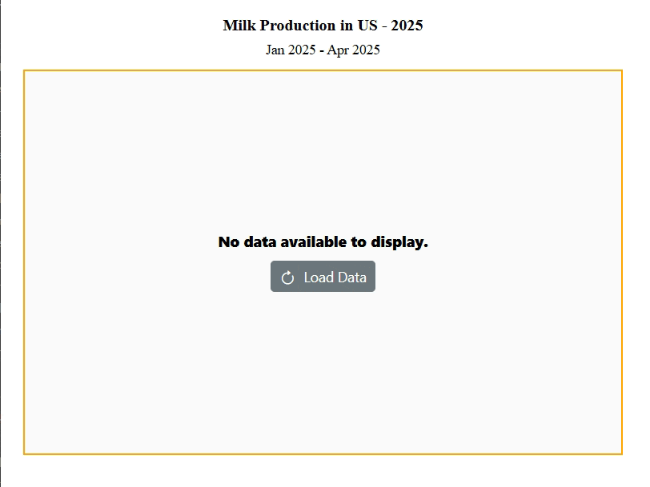

<!-- markdownlint-disable MD036 -->

# Working with Data in Blazor Charts Component

The Chart supports data binding through the [SfDataManager](https://help.syncfusion.com/cr/blazor/Syncfusion.Blazor.Data.SfDataManager.html), which works with both RESTful JSON services and IEnumerable sources. The [DataSource](https://help.syncfusion.com/cr/blazor/Syncfusion.Blazor.Charts.ChartSeries.html#Syncfusion_Blazor_Charts_ChartSeries_DataSource) can be assigned either a list of business objects or an instance of SfDataManager configured for remote data operations.

It supports the following data binding methods:
* List binding
* Remote data

## List binding

An IEnumerable instance can be assigned to the [DataSource](https://help.syncfusion.com/cr/blazor/Syncfusion.Blazor.Charts.ChartSeries.html#Syncfusion_Blazor_Charts_ChartSeries_DataSource) property. Alternatively, the list can be provided via [SfDataManager](https://help.syncfusion.com/cr/blazor/Syncfusion.Blazor.Data.SfDataManager.html). Map fields to the [XName](https://help.syncfusion.com/cr/blazor/Syncfusion.Blazor.Charts.ChartSeries.html#Syncfusion_Blazor_Charts_ChartSeries_XName) and [YName](https://help.syncfusion.com/cr/blazor/Syncfusion.Blazor.Charts.ChartSeries.html#Syncfusion_Blazor_Charts_ChartSeries_YName) properties.

```cshtml

@using Syncfusion.Blazor.Charts

<SfChart Title="Inflation - Consumer Price" Width="60%">
    <ChartPrimaryXAxis IntervalType="IntervalType.Years" LabelFormat="yyyy" ValueType="Syncfusion.Blazor.Charts.ValueType.DateTime">
    </ChartPrimaryXAxis>
	<ChartSeriesCollection>
        <ChartSeries DataSource="@ConsumerReports" XName="XValue" YName="YValue" Type="ChartSeriesType.Line">
        </ChartSeries>
    </ChartSeriesCollection>
</SfChart>

@code{
    public class ChartData
    {
        public DateTime XValue { get; set; }
        public double YValue { get; set; }
    }

    public List<ChartData> ConsumerReports = new List<ChartData>
    {
		new ChartData { XValue = new DateTime(2005, 01, 01), YValue = 21 },
		new ChartData { XValue = new DateTime(2006, 01, 01), YValue = 24 },
		new ChartData { XValue = new DateTime(2007, 01, 01), YValue = 36 },
		new ChartData { XValue = new DateTime(2008, 01, 01), YValue = 38 },
		new ChartData { XValue = new DateTime(2009, 01, 01), YValue = 54 },
		new ChartData { XValue = new DateTime(2010, 01, 01), YValue = 57 },
		new ChartData { XValue = new DateTime(2011, 01, 01), YValue = 70 },
	};
}

```



N> By default, [SfDataManager](https://help.syncfusion.com/cr/blazor/Syncfusion.Blazor.Data.SfDataManager.html) uses the **BlazorAdaptor** for list data binding.

### ExpandoObject binding

The Chart is a generic component strongly typed to a model. When the model type is not known at compile time, data can be provided as a list of **ExpandoObject**. Assign the list to the [DataSource](https://help.syncfusion.com/cr/blazor/Syncfusion.Blazor.Charts.ChartSeries.html#Syncfusion_Blazor_Charts_ChartSeries_DataSource) property.

```cshtml
@using Syncfusion.Blazor.Charts
@using System.Dynamic

<SfChart>
    <ChartPrimaryXAxis ValueType="Syncfusion.Blazor.Charts.ValueType.Category" />
    <ChartSeriesCollection>
        <ChartSeries DataSource="@MedalDetails" XName="X" YName="Y" Type="ChartSeriesType.Column">
        </ChartSeries>
    </ChartSeriesCollection>
</SfChart>

@code{
    private List<string> countries = new List<string> { "South Korea", "India", "Germany", "Italy", "Russia" };
    private Random randomNum = new Random();
    public List<ExpandoObject> MedalDetails { get; set; } = new List<ExpandoObject>();
    protected override void OnInitialized()
    {
        MedalDetails = Enumerable.Range(0, 5).Select((x) =>
        {
            dynamic d = new ExpandoObject();
            d.X = countries[x];
            d.Y = randomNum.Next(20, 80);
            return d;
        }).Cast<ExpandoObject>().ToList<ExpandoObject>();
    }
}
```


### DynamicObject binding

When the model type is unknown, the Chart also supports **DynamicObject**. Assign the list of dynamic objects to the [DataSource](https://help.syncfusion.com/cr/blazor/Syncfusion.Blazor.Charts.ChartSeries.html#Syncfusion_Blazor_Charts_ChartSeries_DataSource) property.

```cshtml
@using Syncfusion.Blazor.Charts
@using System.Dynamic

<SfChart>
    <ChartPrimaryXAxis ValueType="Syncfusion.Blazor.Charts.ValueType.DateTime"></ChartPrimaryXAxis>
    <ChartPrimaryYAxis></ChartPrimaryYAxis>
    <ChartSeriesCollection>
        <ChartSeries DataSource="MedalDetails" XName="X" YName="Y" Type="ChartSeriesType.Area"></ChartSeries>
    </ChartSeriesCollection>
</SfChart>

@code{
    private List<DateTime> Dates = new List<DateTime> { 
        new DateTime(2005, 01, 01), 
        new DateTime(2006, 01, 01), 
        new DateTime(2007, 01, 01), 
        new DateTime(2008, 01, 01), 
        new DateTime(2009, 01, 01), 
        new DateTime(2010, 01, 01), 
        new DateTime(2011, 01, 01) 
    };
    public DateTime[] Value = new DateTime[] { new DateTime(2006, 01, 01), new DateTime(2008, 01, 01) };
    private Random randomNum = new Random();
    public List<DynamicDictionary> MedalDetails = new List<DynamicDictionary>() { };
    protected override void OnInitialized()
    {
        MedalDetails = Enumerable.Range(0, 5).Select((x) =>
        {
            dynamic d = new DynamicDictionary();
            d.X = Dates[x];
            d.Y = randomNum.Next(20, 80);
            return d;
        }).Cast<DynamicDictionary>().ToList<DynamicDictionary>();
    }
    public class DynamicDictionary : DynamicObject
    {
        Dictionary<string, object> dictionary = new Dictionary<string, object>();

        public override bool TryGetMember(GetMemberBinder binder, out object result)
        {
            string name = binder.Name;
            return dictionary.TryGetValue(name, out result);
        }
        public override bool TrySetMember(SetMemberBinder binder, object value)
        {
            dictionary[binder.Name] = value;
            return true;
        }

        public override System.Collections.Generic.IEnumerable<string> GetDynamicMemberNames()
        {
            return this.dictionary?.Keys;
        }
    }
}
```


## Remote data

Assign service data as an instance of [SfDataManager](https://help.syncfusion.com/cr/blazor/Syncfusion.Blazor.Data.SfDataManager.html) to the [DataSource](https://help.syncfusion.com/cr/blazor/Syncfusion.Blazor.Charts.ChartSeries.html#Syncfusion_Blazor_Charts_ChartSeries_DataSource) property to bind remote data. Provide the endpoint URL of the service to enable communication with the remote source.

```cshtml

@using Syncfusion.Blazor.Data
@using Syncfusion.Blazor.Charts
@using System.Dynamic

<SfChart>
    <SfDataManager Url="https://services.odata.org/V4/Northwind/Northwind.svc/Orders" Adaptor="Adaptors.ODataV4Adaptor"></SfDataManager>

    <ChartPrimaryXAxis Title="Orders" ValueType="Syncfusion.Blazor.Charts.ValueType.Category"
                       RangePadding="ChartRangePadding.Additional"></ChartPrimaryXAxis>

    <ChartSeriesCollection>
        <ChartSeries XName="OrderID" YName="Freight" Type="ChartSeriesType.Column"></ChartSeries>
    </ChartSeriesCollection>
</SfChart>

```


### Binding with OData services

[OData](https://www.odata.org/documentation/odata-version-3-0/) is a standardized protocol for creating and consuming data. The [SfDataManager](https://help.syncfusion.com/cr/blazor/Syncfusion.Blazor.Data.SfDataManager.html) can retrieve data from an OData service. For OData v3 services, configure the appropriate adaptor.

### Binding with OData v4 services

The [SfDataManager](https://help.syncfusion.com/cr/blazor/Syncfusion.Blazor.Data.SfDataManager.html) can retrieve and consume OData v4 services, the successor to OData v3. Refer to the [OData documentation](https://docs.oasis-open.org/odata/odata/v4.0/errata03/os/complete/part1-protocol/odata-v4.0-errata03-os-part1-protocol-complete.html#_Toc453752197) for details. To bind an OData v4 service, use the **ODataV4Adaptor**.

### Web API

The [WebApiAdaptor](https://help.syncfusion.com/cr/blazor/Syncfusion.Blazor.Data.WebApiAdaptor.html) can bind a chart to a Web API endpoint.

```cshtml
@using Syncfusion.Blazor.Data
@using Syncfusion.Blazor.Charts

<SfChart>
    <SfDataManager Url="https://blazor.syncfusion.com/services/production/api/Orders" Adaptor="Adaptors.WebApiAdaptor"></SfDataManager>

    <ChartPrimaryXAxis Title="Orders" ValueType="Syncfusion.Blazor.Charts.ValueType.Category"
                       ></ChartPrimaryXAxis>

    <ChartSeriesCollection>
        <ChartSeries XName="OrderID" YName="Freight" Type="ChartSeriesType.Column"></ChartSeries>
    </ChartSeriesCollection>
</SfChart>
```


### Sending additional parameters to the server

To include custom parameters in a data request, add them to the [Query](https://help.syncfusion.com/cr/blazor/Syncfusion.Blazor.Charts.ChartSeries.html#Syncfusion_Blazor_Charts_ChartSeries_Query) object and assign it to the chart's Query property.

The following example shows how to send parameters using the Query property on the series.

```cshtml
@using Syncfusion.Blazor.Data
@using Syncfusion.Blazor.Charts

<SfChart>
    <SfDataManager Url="https://services.odata.org/V4/Northwind/Northwind.svc/Orders" Adaptor="Adaptors.ODataV4Adaptor"></SfDataManager>

    <ChartPrimaryXAxis Title="Orders" ValueType="Syncfusion.Blazor.Charts.ValueType.Category"
                       RangePadding="ChartRangePadding.Additional"></ChartPrimaryXAxis>

    <ChartSeriesCollection>
        <ChartSeries Query="ChartQuery" XName="OrderID" YName="Freight" Type="ChartSeriesType.Column"></ChartSeries>
    </ChartSeriesCollection>
</SfChart>

@code{
    public Query ChartQuery { get; set; }

    protected override void OnInitialized()
    {
        ChartQuery = new Query().Take(10).Where("Freight", "GreaterThan", 300, false);
    }

}
```

## Entity Framework

Entity Framework is an object-relational mapper (ORM) for .NET. This section demonstrates binding data to the chart from a **Microsoft SQL Server** database.

### Create DBContext class

To connect to SQL Server, create a DBContext class named **OrderContext**.

```csharp
using System;
using System.Collections.Generic;
using System.Linq;
using System.Threading.Tasks;
using Microsoft.EntityFrameworkCore;
using System.ComponentModel.DataAnnotations;
using EFChart.Data;

namespace EFChart.Data
{
    public class OrderContext : DbContext
    {
        public virtual DbSet<Order> Orders { get; set; }

        protected override void OnConfiguring(DbContextOptionsBuilder optionsBuilder)
        {
            if (!optionsBuilder.IsConfigured)
            {
                // Configures the context to connect to a Microsoft SQL Server database
                optionsBuilder.UseSqlServer(@"Data Source=(LocalDB)\MSSQLLocalDB;AttachDbFilename='D:\blazor\EFTreeMap\App_Data\NORTHWND.MDF';Integrated Security=True;Connect Timeout=30");
            }
        }
    }

    public class Order
    {
        [Key]
        public int? OrderID { get; set; }
        [Required]
        public string CustomerID { get; set; }
        [Required]
        public int EmployeeID { get; set; }
    }
}

```

### Create data access layer to perform data operation

Create a class named **OrderDataAccessLayer** to retrieve records from the database table.

```csharp
using Microsoft.EntityFrameworkCore;
using System;
using System.Collections.Generic;
using System.Linq;
using System.Threading.Tasks;
using static BlazorApp1.Data.OrderContext;
using EFChart.Data;

namespace EFChart.Data
{
    public class OrderDataAccessLayer
    {
        OrderContext db = new OrderContext();

        //To Get all Orders details
        public DbSet<Order> GetAllOrders()
        {
            try
            {
                return db.Orders;
            }
            catch
            {
                throw;
            }
        }
    }
}

```

### Creating Web API Controller

Create a Web API controller to allow the chart to receive data directly from Entity Framework.

```csharp
using System;
using System.Collections;
using System.Collections.Generic;
using System.Linq;
using System.Threading.Tasks;
using Microsoft.AspNetCore.Http;
using Microsoft.AspNetCore.Mvc;
using Microsoft.Extensions.Primitives;
using static BlazorApp1.Data.OrderContext;
using EFChart.Data;

namespace EFChart.Controller
{
    [Route("api/[controller]")]
    [ApiController]
    public class DefaultController : ControllerBase
    {
        OrderDataAccessLayer db = new OrderDataAccessLayer();
        [HttpGet]
        public object Get()
        {
            IQueryable<Order> data = db.GetAllOrders().AsQueryable();
            var count = data.Count();
            var queryString = Request.Query;
            if (queryString.Keys.Contains("$inlinecount"))
            {
                StringValues Skip;
                StringValues Take;
                int skip = (queryString.TryGetValue("$skip", out Skip)) ? Convert.ToInt32(Skip[0]) : 0;
                int top = (queryString.TryGetValue("$top", out Take)) ? Convert.ToInt32(Take[0]) : data.Count();
                return new { Items = data.Skip(skip).Take(top), Count = count };
            }
            else
            {
                return data;
            }
        }
    }
}

```

### Add Web API Controller services in Startup.cs

Open Startup.cs and add the required services and endpoints for the Web API controller.

```csharp
using EFChart.Data;
using Newtonsoft.Json.Serialization;

namespace BlazorApplication
{
    public class Startup
    {
        ....
        ....
        public void ConfigureServices(IServiceCollection services)
        {
            ....
            ....
            services.AddSingleton<OrderDataAccessLayer>();

            // Adds services for controllers to the specified Microsoft.Extensions.DependencyInjection.IServiceCollection.
            services.AddControllers().AddNewtonsoftJson(options =>
            {
                options.SerializerSettings.ContractResolver = new DefaultContractResolver();
            });
        }

        public void Configure(IApplicationBuilder app, IWebHostEnvironment env)
        {
            ....
            ....
            app.UseEndpoints(endpoints =>
            {
                // Adds endpoints for controller actions to the Microsoft.AspNetCore.Routing.IEndpointRouteBuilder
                endpoints.MapDefaultControllerRoute();
                .....
                .....
            });
        }
    }
}
```

### Configure chart component

Use the [DataSource](https://help.syncfusion.com/cr/blazor/Syncfusion.Blazor.Charts.SfChart.html#Syncfusion_Blazor_Charts_SfChart_DataSource) property or [SfDataManager](https://help.syncfusion.com/cr/blazor/Syncfusion.Blazor.Data.SfDataManager.html) to bind data to the chart.

To bind data directly from the OrderDataAccessLayer, set the [DataSource](https://help.syncfusion.com/cr/blazor/Syncfusion.Blazor.Charts.SfChart.html#Syncfusion_Blazor_Charts_SfChart_DataSource) property to **OrderData.GetAllOrders()**.

```cshtml

@using EFChart.Data;
@inject OrderDataAccessLayer OrderData;

@using Syncfusion.Blazor.Charts

<SfChart DataSource="@OrderData.GetAllOrders()">
    <ChartPrimaryXAxis ValueType="Syncfusion.Blazor.Charts.ValueType.Category">
    </ChartPrimaryXAxis>
    <ChartSeriesCollection>
    <ChartSeries XName="CustomerID" YName="OrderID" Type="ChartSeriesType.Column">
    </ChartSeries>
    </ChartSeriesCollection>
</SfChart>
```

To bind data using a Web API, provide the endpoint URL in [SfDataManager](https://help.syncfusion.com/cr/blazor/Syncfusion.Blazor.Data.SfDataManager.html) and set the [Adaptor](https://help.syncfusion.com/cr/blazor/Syncfusion.Blazor.DataManager.html#Syncfusion_Blazor_DataManager_Adaptor). Use [WebApiAdaptor](https://help.syncfusion.com/cr/blazor/Syncfusion.Blazor.Data.WebApiAdaptor.html) to interact with the Web API and consume Entity Framework data.

```cshtml
@using Syncfusion.Blazor.Charts
@using Syncfusion.Blazor.Data

<SfChart>
        <SfDataManager Url="api/Default" Adaptor="Syncfusion.Blazor.Adaptors.WebApiAdaptor">
        </SfDataManager>
        <ChartPrimaryXAxis ValueType="Syncfusion.Blazor.Charts.ValueType.Category">
        </ChartPrimaryXAxis>
        <ChartSeriesCollection>
            <ChartSeries XName="CustomerID" YName="OrderID" Type="ChartSeriesType.Column">
            </ChartSeries>
        </ChartSeriesCollection>
</SfChart>

```

## Observable collection

The [ObservableCollection](https://learn.microsoft.com/en-us/dotnet/api/system.collections.objectmodel.observablecollection-1?view=net-6.0) class provides change notifications when items are added, removed, or moved. The [INotifyCollectionChanged](https://learn.microsoft.com/en-us/dotnet/api/system.collections.specialized.inotifycollectionchanged?view=net-6.0) implementation raises events when these dynamic changes occur.

```cshtml

@using Syncfusion.Blazor.Charts
@using System.Collections.ObjectModel;

<SfChart @ref="ChartObj" Title="Olympic Medal Counts - RIO" Width="450px">
    <ChartArea><ChartAreaBorder Width="0"></ChartAreaBorder></ChartArea>
    <ChartPrimaryXAxis ValueType="Syncfusion.Blazor.Charts.ValueType.Category" Interval="1">
        <ChartAxisMajorGridLines Width="0"></ChartAxisMajorGridLines>
        <ChartAxisMajorTickLines Width="0"></ChartAxisMajorTickLines>
    </ChartPrimaryXAxis>
    <ChartPrimaryYAxis Title="Medal Count" Maximum="50" Interval="10">
        <ChartAxisMajorTickLines Width="0"></ChartAxisMajorTickLines>
        <ChartAxisLineStyle Width="0"></ChartAxisLineStyle>
    </ChartPrimaryYAxis>
    <ChartSeriesCollection>
        <ChartSeries TooltipMappingName="MappingName" DataSource="@ChartPoints" XName="Country" YName="GoldMedal" Name="Gold" ColumnSpacing="0.1" Type="ChartSeriesType.Column">
        </ChartSeries>
    </ChartSeriesCollection>
</SfChart>

@code {
    SfChart ChartObj;

    public ObservableCollection<ColumnChartData> ChartPoints { get; set; }

    public class ColumnChartData
    {
        public string Country { get; set; }
        public double GoldMedal { get; set; }
        public static ObservableCollection<ColumnChartData> GetData()
        {
            ObservableCollection<ColumnChartData> ChartPoints = new ObservableCollection<ColumnChartData>()
            {
                new ColumnChartData { Country = "GBR", GoldMedal = 27 },
                new ColumnChartData { Country = "CHN", GoldMedal = 26 },
                new ColumnChartData { Country = "AUS", GoldMedal = 8 },
                new ColumnChartData { Country = "RUS", GoldMedal = 19 }
            };
            return ChartPoints;
        }
    }
    protected override void OnInitialized()
    {
        this.ChartPoints = ColumnChartData.GetData();
    }
}

```



## Empty points

Empty points are data points with NaN values. Customize them using [EmptyPointSettings](https://help.syncfusion.com/cr/blazor/Syncfusion.Blazor.Charts.ChartSeries.html#Syncfusion_Blazor_Charts_ChartSeries_EmptyPointSettings). The default empty-point [Mode](https://help.syncfusion.com/cr/blazor/Syncfusion.Blazor.Charts.ChartEmptyPointSettings.html#Syncfusion_Blazor_Charts_ChartEmptyPointSettings_Mode) is [Gap](https://help.syncfusion.com/cr/blazor/Syncfusion.Blazor.Charts.EmptyPointMode.html#Syncfusion_Blazor_Charts_EmptyPointMode_Gap).

```cshtml

@using Syncfusion.Blazor.Charts

<SfChart>
    <ChartPrimaryXAxis ValueType="Syncfusion.Blazor.Charts.ValueType.Category">
    </ChartPrimaryXAxis>

    <ChartSeriesCollection>
        <ChartSeries DataSource="@SalesReports" XName="Month" YName="Sales" Type="ChartSeriesType.Column">
            <ChartEmptyPointSettings Fill="blue" Mode="@Mode">
            </ChartEmptyPointSettings>
        </ChartSeries>
    </ChartSeriesCollection>
</SfChart>

@code{
    public class ChartData
    {
        public string Month { get; set; }
        public Nullable<double> Sales { get; set; }
    }

    public EmptyPointMode Mode = EmptyPointMode.Average;

    public List<ChartData> SalesReports = new List<ChartData>
    {
        new ChartData{ Month= "Jan", Sales= 35 },
        new ChartData{ Month= "Feb", Sales= 28 },
        new ChartData{ Month= "Mar", Sales= double.NaN },
        new ChartData{ Month= "Apr", Sales= 32 },
        new ChartData{ Month= "May", Sales= 40 },
        new ChartData{ Month= "Jun", Sales= 32 },
        new ChartData{ Month= "Jul", Sales= 35 },
        new ChartData{ Month= "Aug", Sales= double.NaN },
        new ChartData{ Month= "Sep", Sales= 38 },
        new ChartData{ Month= "Oct", Sales= 30 },
        new ChartData{ Month= "Nov", Sales= 25 },
        new ChartData{ Month= "Dec", Sales= 32 }
    };
}

```


**Customizing empty point**

The [Fill](https://help.syncfusion.com/cr/blazor/Syncfusion.Blazor.Charts.ChartEmptyPointSettings.html#Syncfusion_Blazor_Charts_ChartEmptyPointSettings_Fill) property sets the color for [EmptyPointSettings](https://help.syncfusion.com/cr/blazor/Syncfusion.Blazor.Charts.ChartSeries.html#Syncfusion_Blazor_Charts_ChartSeries_EmptyPointSettings). Use [ChartEmptyPointBorder](https://help.syncfusion.com/cr/blazor/Syncfusion.Blazor.Charts.ChartEmptyPointSettings.html#Syncfusion_Blazor_Charts_ChartEmptyPointSettings_Border) to configure border [Color](https://help.syncfusion.com/cr/blazor/Syncfusion.Blazor.Charts.ChartEmptyPointBorder.html#Syncfusion_Blazor_Charts_ChartEmptyPointBorder_Color) and [Width](https://help.syncfusion.com/cr/blazor/Syncfusion.Blazor.Charts.ChartEmptyPointBorder.html#Syncfusion_Blazor_Charts_ChartEmptyPointBorder_Width).

```cshtml

@using Syncfusion.Blazor.Charts

<SfChart>
    <ChartPrimaryXAxis ValueType="Syncfusion.Blazor.Charts.ValueType.Category">
    </ChartPrimaryXAxis>

    <ChartSeriesCollection>
        <ChartSeries DataSource="@SalesReports" XName="Month" YName="Sales" Type="ChartSeriesType.Column">
            <ChartEmptyPointSettings Fill="red"  Mode="@Mode">
                <ChartEmptyPointBorder Color="black" Width="2"></ChartEmptyPointBorder>
            </ChartEmptyPointSettings>
        </ChartSeries>
    </ChartSeriesCollection>
</SfChart>

@code{
    public class ChartData
    {
        public string Month { get; set; }
        public Nullable<double> Sales { get; set; }
    }

    public EmptyPointMode Mode = EmptyPointMode.Average;

    public List<ChartData> SalesReports = new List<ChartData>
    {
        new ChartData{ Month= "Jan", Sales= 35 },
        new ChartData{ Month= "Feb", Sales= 28 },
        new ChartData{ Month= "Mar", Sales= double.NaN },
        new ChartData{ Month= "Apr", Sales= 32 },
        new ChartData{ Month= "May", Sales= 40 },
        new ChartData{ Month= "Jun", Sales= 32 },
        new ChartData{ Month= "Jul", Sales= 35 },
        new ChartData{ Month= "Aug", Sales= double.NaN },
        new ChartData{ Month= "Sep", Sales= 38 },
        new ChartData{ Month= "Oct", Sales= 30 },
        new ChartData{ Month= "Nov", Sales= 25 },
        new ChartData{ Month= "Dec", Sales= 32 }
    };
}

```



## Handling No Data

When no data is available to render, use the [NoDataTemplate](https://help.syncfusion.com/cr/blazor/Syncfusion.Blazor.Charts.SfChart.html#Syncfusion_Blazor_Charts_SfChart_NoDataTemplate) property to display a custom layout within the chart area. This layout can show a message, an image, or a button to initiate data loading. When data becomes available, the chart updates automatically to render the visualization.

```cshtml

@using Syncfusion.Blazor.Charts
@using Syncfusion.Blazor.Buttons

<SfChart @ref="chart" Width="80%" Title="Milk Production in US - 2025" SubTitle="Jan 2025 - Apr 2025">
    <NoDataTemplate>
    <div class="noDataTemplateContainerStyle" style="border: 2px solid orange; display: row-flex; align-items: center; justify-content: center; align-content: center; white-space: normal; text-align: center; width: inherit; height: inherit; font-weight: bolder; font-size: medium;">
        <div style="font-size:15px; margin-bottom:10px"><strong>No data available to display.</strong></div>
        <SfButton IconCss="e-icons e-refresh" OnClick="LoadData">Load Data</SfButton>
    </div>
</NoDataTemplate>
    <ChildContent>
        <ChartPrimaryXAxis ValueType="Syncfusion.Blazor.Charts.ValueType.Category" />
        <ChartSeriesCollection>
            <ChartSeries DataSource="@SalesReports" XName="Month" YName="Value" Type="Syncfusion.Blazor.Charts.ChartSeriesType.Column">
                <ChartMarker>
                    <ChartDataLabel Visible="true" Name="Text"/>
                </ChartMarker>
            </ChartSeries>
        </ChartSeriesCollection>
    </ChildContent>
</SfChart>

<style>
    .noDataTemplateContainerStyle {
        background-color: #fafafa;
        color: #000000;
    }
</style>

@code {
    private SfChart chart;
    public class Data
    {
        public string Month { get; set; }
        public double Value { get; set; }
        public string Text { get; set; }
    }
    public List<Data> SalesReports = new List<Data>();
    private void LoadData()
    {
        SalesReports = new List<Data>
        {
            new Data { Month = "Jan", Value = 3, Text = "January" },
            new Data { Month = "Feb", Value = 3.5, Text = "February" },
            new Data { Month = "Mar", Value = 7, Text = "March" },
            new Data { Month = "Apr", Value = 13.5, Text = "April" }
        };
        if (chart != null)
        chart.RefreshAsync();
    }
}

```




N> Refer to the [Blazor Charts](https://www.syncfusion.com/blazor-components/blazor-charts) feature tour and the [Blazor Chart example](https://blazor.syncfusion.com/demos/chart/line?theme=bootstrap5) to explore chart types and time-dependent data scenarios.

## See also

* [Data label](./data-labels)
* [Tooltip](./tool-tip)
* [Marker](./data-markers)
