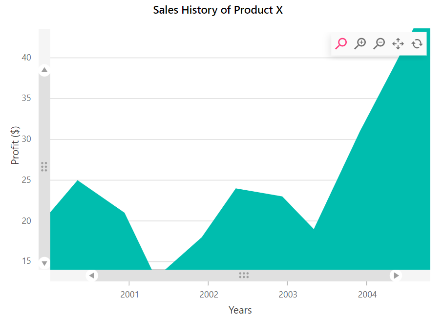

# Zooming in Blazor Charts Component

## Enable Zooming

Chart can be zoomed in three ways.

* Selection - By setting [`EnableSelectionZooming`](https://help.syncfusion.com/cr/blazor/Syncfusion.Blazor.Charts.ChartZoomSettings.html#Syncfusion_Blazor_Charts_ChartZoomSettings_EnableSelectionZooming) property to **true**
  in [`ChartZoomSettings`](https://help.syncfusion.com/cr/blazor/Syncfusion.Blazor.Charts.ChartTooltipSettings.html), you can zoom the chart by using the rubber band selection.
* MouseWheel - By setting [`EnableMouseWheelZooming`](https://help.syncfusion.com/cr/blazor/Syncfusion.Blazor.Charts.ChartZoomSettings.html#Syncfusion_Blazor_Charts_ChartZoomSettings_EnableMouseWheelZooming) property to **true**
  in [`ChartZoomSettings`](https://help.syncfusion.com/cr/blazor/Syncfusion.Blazor.Charts.ChartTooltipSettings.html), you can zoomin and zoomout the chart by scrolling the mouse wheel.
* Pinch - By setting  [`EnablePinchZooming`](https://help.syncfusion.com/cr/blazor/Syncfusion.Blazor.Charts.ChartZoomSettings.html#Syncfusion_Blazor_Charts_ChartZoomSettings_EnablePinchZooming) property to **true** in [`ChartZoomSettings`](https://help.syncfusion.com/cr/blazor/Syncfusion.Blazor.Charts.ChartTooltipSettings.html),
  you can zoom the chart through pinch gesture in touch enabled devices.

 >Pinch zooming is supported only in browsers that support multi-touch gestures. Currently IE11, Chrome and Opera browsers support multi-touch in desktop devices.

```csharp

@using Syncfusion.Blazor.Charts

<SfChart Title="Sales History of Product X">
    <ChartPrimaryXAxis ValueType="Syncfusion.Blazor.Charts.ValueType.Category"></ChartPrimaryXAxis>

    <ChartZoomSettings EnableMouseWheelZooming="true" EnablePinchZooming="true" EnableSelectionZooming="true"></ChartZoomSettings>

    <ChartSeriesCollection>
        <ChartSeries DataSource="@SalesReports" XName="X" YName="YValue" Type="ChartSeriesType.Column"></ChartSeries>
    </ChartSeriesCollection>
</SfChart>

@code{
    public class ChartData
    {
        public string X { get; set; }
        public double YValue { get; set; }
    }


    public List<ChartData> SalesReports = new List<ChartData>
    {
        new ChartData { X= "USA", YValue= 46 },
        new ChartData { X= "GBR", YValue= 27 },
        new ChartData { X= "CHN", YValue= 26 },
        new ChartData { X= "UK", YValue= 26 },
        new ChartData { X= "AUS", YValue= 26 },
        new ChartData { X= "IND", YValue= 26 },
        new ChartData { X= "DEN", YValue= 26 },
        new ChartData { X= "MEX", YValue= 26 },
    };
}

```


After zooming the chart, a zooming toolbar will appear with `Zoom`,`ZoomIn`, `ZoomOut`, `Pan` and `Reset` buttons.
Selecting the Pan option will allow to pan the chart and selecting the Reset option will reset the zoomed chart.

## Modes

The [`Mode`](https://help.syncfusion.com/cr/blazor/Syncfusion.Blazor.Charts.ChartZoomSettings.html#Syncfusion_Blazor_Charts_ChartZoomSettings_Mode) property in ZoomSettings specifies whether the chart is
allowed to scale along the horizontal axis or vertical axis. The default value of the mode is XY (both axis).

There are three types of mode.

* X - Allows us to zoom the chart horizontally.
* Y - Allows us to zoom the chart vertically.
* XY - Allows us to zoom the chart both vertically and horizontally.

```csharp

@using Syncfusion.Blazor.Charts

<SfChart Title="Sales History of Product X">
    <ChartPrimaryXAxis ValueType="Syncfusion.Blazor.Charts.ValueType.Category"></ChartPrimaryXAxis>

    <ChartZoomSettings EnableSelectionZooming="true" Mode="ZoomMode.X"></ChartZoomSettings>

    <ChartSeriesCollection>
        <ChartSeries DataSource="@SalesReports" XName="X" YName="YValue" Type="ChartSeriesType.Column"></ChartSeries>
    </ChartSeriesCollection>
</SfChart>

@code{
    public class ChartData
    {
        public string X { get; set; }
        public double YValue { get; set; }
    }


    public List<ChartData> SalesReports = new List<ChartData>
    {
        new ChartData { X= "USA", YValue= 46 },
        new ChartData { X= "GBR", YValue= 27 },
        new ChartData { X= "CHN", YValue= 26 },
        new ChartData { X= "UK", YValue= 26 },
        new ChartData { X= "AUS", YValue= 26 },
        new ChartData { X= "IND", YValue= 26 },
        new ChartData { X= "DEN", YValue= 26 },
        new ChartData { X= "MEX", YValue= 26 },
    };
}

```

## Toolbar

By default, zoomin, zoomout, pan and reset buttons will be displayed for zoomed chart. You can customize to show your desire tools in the toolbar using [`ToolbarItems`](https://help.syncfusion.com/cr/blazor/Syncfusion.Blazor.Charts.ChartZoomSettings.html#Syncfusion_Blazor_Charts_ChartZoomSettings_ToolbarItems)
property.

```csharp

@using Syncfusion.Blazor.Charts

<SfChart>
    <ChartPrimaryXAxis ValueType="Syncfusion.Blazor.Charts.ValueType.Category"></ChartPrimaryXAxis>

    <ChartZoomSettings EnableSelectionZooming="true" EnableMouseWheelZooming="true"
                       EnablePinchZooming="true" ToolbarItems="@ToolbarItem">
    </ChartZoomSettings>

    <ChartSeriesCollection>
        <ChartSeries DataSource="@SalesReports" XName="X" YName="Y" Type="ChartSeriesType.Area">
        </ChartSeries>
    </ChartSeriesCollection>
</SfChart>

@code{
    public List<ToolbarItems> ToolbarItem = new List<ToolbarItems>() { ToolbarItems.Zoom, ToolbarItems.Reset, ToolbarItems.Pan };
    public class ChartData
    {
        public string X { get; set; }
        public double Y { get; set; }
        public string Color { get; set; }
    }
    public List<ChartData> SalesReports = new List<ChartData>
   {
     new ChartData { X= "South Korea", Y= 39.4, Color="red" },
     new ChartData { X= "India", Y= 61.3, Color="green" },
     new ChartData { X= "Pakistan", Y= 20.4, Color="#ff0097" },
     new ChartData { X= "Germany", Y= 65.1, Color="crimson" },
     new ChartData { X= "Australia", Y= 15.8, Color="blue" },
     new ChartData { X= "Italy", Y= 29.2, Color="darkorange" },
    };
}


```

## Enable pan

Using [`EnablePan`](https://help.syncfusion.com/cr/blazor/Syncfusion.Blazor.Charts.ChartZoomSettings.html#Syncfusion_Blazor_Charts_ChartZoomSettings_EnablePan)
property you can able to pan the zoomed chart without help of toolbar items.

```csharp

@using Syncfusion.Blazor.Charts

<SfChart Title="Sales History of Product X">
    <ChartPrimaryXAxis ValueType="Syncfusion.Blazor.Charts.ValueType.Category" ZoomFactor="0.2" ZoomPosition="0.6"></ChartPrimaryXAxis>

    <ChartZoomSettings EnableSelectionZooming="true" EnablePan="true"></ChartZoomSettings>

    <ChartSeriesCollection>
        <ChartSeries DataSource="@SalesReports" XName="X" YName="YValue" Type="ChartSeriesType.Column"></ChartSeries>
    </ChartSeriesCollection>
</SfChart>

@code{
    public class ChartData
    {
        public string X { get; set; }
        public double YValue { get; set; }
    }


    public List<ChartData> SalesReports = new List<ChartData>
{
        new ChartData { X= "USA", YValue= 46 },
        new ChartData { X= "GBR", YValue= 27 },
        new ChartData { X= "CHN", YValue= 26 },
        new ChartData { X= "UK", YValue= 26 },
        new ChartData { X= "AUS", YValue= 26 },
        new ChartData { X= "IND", YValue= 26 },
        new ChartData { X= "DEN", YValue= 26 },
        new ChartData { X= "MEX", YValue= 26 },
    };
}

```

## Enable Scrollbar

Using [`EnableScrollbar`](https://help.syncfusion.com/cr/blazor/Syncfusion.Blazor.Charts.ChartZoomSettings.html#Syncfusion_Blazor_Charts_ChartZoomSettings_EnableScrollbar) property, you can able to add scrollbar for zoomed chart. Using this scrollbar, you can pan or zoom the chart.

```csharp

@using Syncfusion.Blazor.Charts

<SfChart Title="Sales History of Product X">
    <ChartPrimaryXAxis Title="Years" ValueType="Syncfusion.Blazor.Charts.ValueType.DateTime"
                       Skeleton="yMMM" EdgeLabelPlacement="EdgeLabelPlacement.Shift">
        <ChartAxisMajorGridLines Width="0"></ChartAxisMajorGridLines>
    </ChartPrimaryXAxis>

    <ChartPrimaryYAxis Title="Profit ($)" RangePadding="ChartRangePadding.None">
        <ChartAxisLineStyle Width="0"></ChartAxisLineStyle>
        <ChartAxisMajorTickLines Width="0"></ChartAxisMajorTickLines>
    </ChartPrimaryYAxis>

    <ChartLegendSettings Visible="false"></ChartLegendSettings>

    <ChartZoomSettings EnableMouseWheelZooming="true" EnableScrollbar="true" EnablePinchZooming="true"
                       EnableSelectionZooming="true"></ChartZoomSettings>

    <ChartSeriesCollection>
        <ChartSeries DataSource="@SalesReports" Name="Warmest" XName="XValue" Width="2" Opacity="1"
                     YName="YValue" Type="ChartSeriesType.Area" Fill="url(#gradient-chart)">
            <ChartSeriesBorder Width="0.5" Color="#00bdae"></ChartSeriesBorder>
        </ChartSeries>
    </ChartSeriesCollection>

    <ChartArea>
        <ChartAreaBorder Width="0"></ChartAreaBorder>
    </ChartArea>
</SfChart>

@code {

    public class ChartData
    {
        public DateTime XValue { get; set; }
        public double YValue { get; set; }
    }
    public List<ChartData> SalesReports = new List<ChartData>
{
        new ChartData { XValue = new DateTime(2000, 02, 11), YValue = 14 },
        new ChartData { XValue = new DateTime(2000, 09, 04), YValue = 20 },
        new ChartData { XValue = new DateTime(2001, 02, 11), YValue = 25 },
        new ChartData { XValue = new DateTime(2001, 09, 16), YValue = 21 },
        new ChartData { XValue = new DateTime(2002, 02, 07), YValue = 13 },
        new ChartData { XValue = new DateTime(2002, 09, 07), YValue = 18 },
        new ChartData { XValue = new DateTime(2003, 02, 11), YValue = 24 },
        new ChartData { XValue = new DateTime(2003, 09, 14), YValue = 23 },
        new ChartData { XValue = new DateTime(2004, 02, 06), YValue = 19 },
        new ChartData { XValue = new DateTime(2004, 09, 06), YValue = 31, },
        new ChartData { XValue = new DateTime(2005, 02, 11), YValue = 39 },
        new ChartData { XValue = new DateTime(2005, 09, 11), YValue = 50 },
        new ChartData { XValue = new DateTime(2006, 02, 11), YValue = 24 },
    };

}
<svg style="height: 0">
    <defs>
        <linearGradient id="gradient-chart" x1="0" x2="0" y1="0" y2="1">
            <stop offset="0" />
            <stop offset="1" />
        </linearGradient>
    </defs>
</svg>
<style>

    #gradient-chart stop {
        stop-color: #BDEDE9;
    }

        #gradient-chart stop[offset="0"] {
            stop-opacity: 0.75;
        }

        #gradient-chart stop[offset="1"] {
            stop-opacity: 0;
        }
</style>


```



## Auto interval on zooming

By using [`EnableAutoIntervalOnZooming`](https://help.syncfusion.com/cr/blazor/Syncfusion.Blazor.Charts.ChartCommonAxis.html#Syncfusion_Blazor_Charts_ChartCommonAxis_EnableAutoIntervalOnZooming) property,
the axis interval will get calculated automatically with respect to the zoomed range.

```csharp

@using Syncfusion.Blazor.Charts

<SfChart Title="Sales History of Product X">
    <ChartPrimaryXAxis ValueType="Syncfusion.Blazor.Charts.ValueType.Category" EnableAutoIntervalOnZooming="true"></ChartPrimaryXAxis>

    <ChartZoomSettings EnableSelectionZooming="true"></ChartZoomSettings>

    <ChartSeriesCollection>
        <ChartSeries DataSource="@SalesReports" XName="X" YName="YValue" Type="ChartSeriesType.Column"></ChartSeries>
    </ChartSeriesCollection>
</SfChart>

@code{
    public class ChartData
    {
        public string X { get; set; }
        public double YValue { get; set; }
    }


    public List<ChartData> SalesReports = new List<ChartData>
{
        new ChartData { X= "USA", YValue= 46 },
        new ChartData { X= "GBR", YValue= 27 },
        new ChartData { X= "CHN", YValue= 26 },
        new ChartData { X= "UK", YValue= 26 },
        new ChartData { X= "AUS", YValue= 26 },
        new ChartData { X= "IND", YValue= 26 },
        new ChartData { X= "DEN", YValue= 26 },
        new ChartData { X= "MEX", YValue= 26 },
    };
}

```

> Note: You can refer to our [`Blazor Charts`](https://www.syncfusion.com/blazor-components/blazor-charts) feature tour page for its groundbreaking feature representations. You can also explore our [`Blazor Chart example`](https://blazor.syncfusion.com/demos/chart/line?theme=bootstrap4) to knows various chart types and how to represent time-dependent data, showing trends in data at equal intervals.

## See Also

* [Data label](./data-labels)
* [Legend](./legend)
* [Marker](./data-markers)