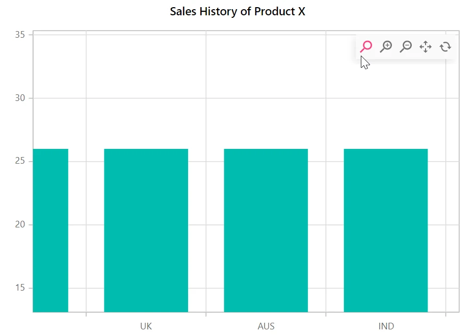
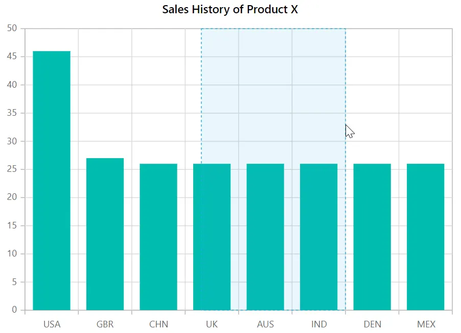
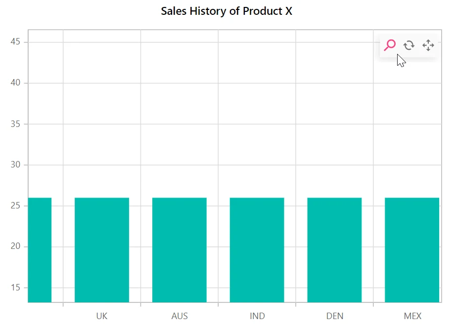
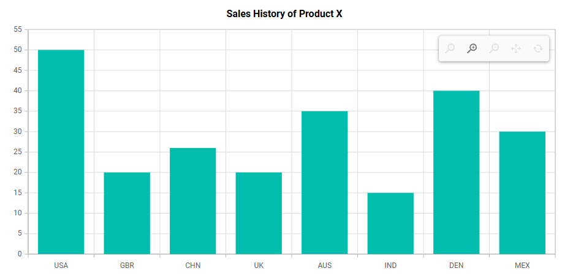
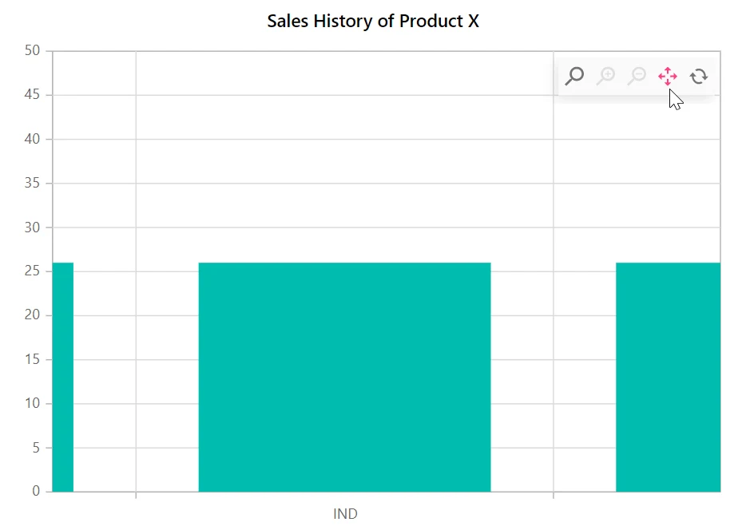
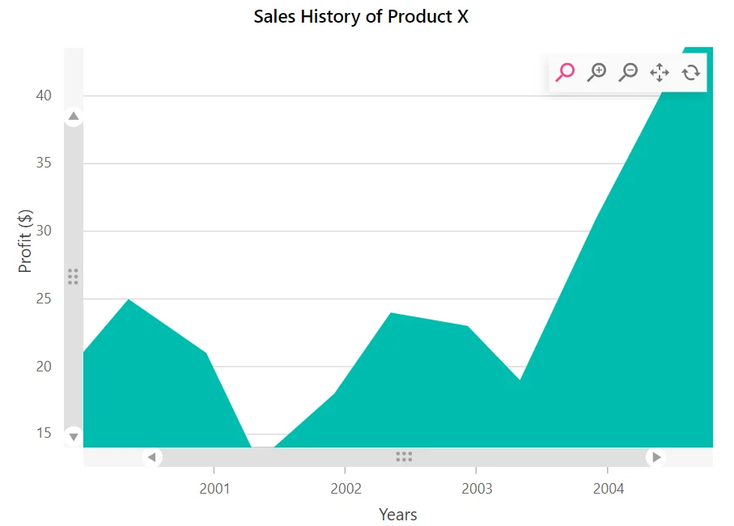
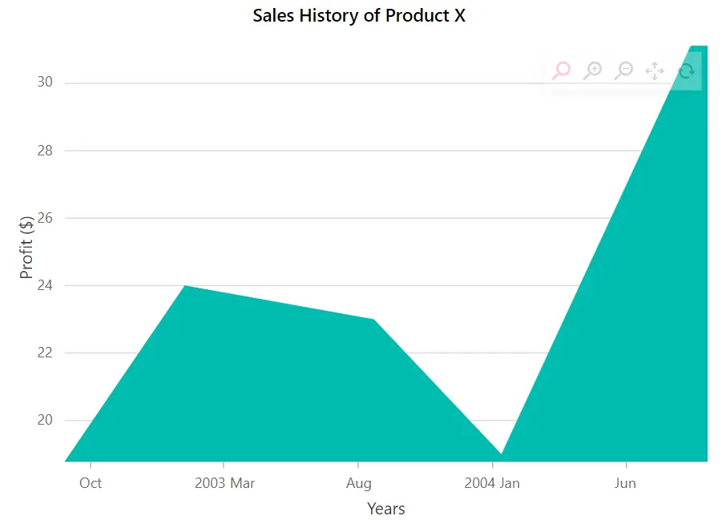

# Blazor Charts Zooming and Panning

The following video walks through configuring and using zooming and panning in the [Blazor Charts](https://www.syncfusion.com/blazor-components/blazor-charts).



## Enable zooming

The chart can be zoomed in three different ways.

* Selection - By setting [EnableSelectionZooming](https://help.syncfusion.com/cr/blazor/Syncfusion.Blazor.Charts.ChartZoomSettings.html#Syncfusion_Blazor_Charts_ChartZoomSettings_EnableSelectionZooming) property to **true** in [ChartZoomSettings](https://help.syncfusion.com/cr/blazor/Syncfusion.Blazor.Charts.ChartZoomSettings.html), the chart can be zoomed using the rubber band selection.
* Mouse Wheel - By setting [EnableMouseWheelZooming](https://help.syncfusion.com/cr/blazor/Syncfusion.Blazor.Charts.ChartZoomSettings.html#Syncfusion_Blazor_Charts_ChartZoomSettings_EnableMouseWheelZooming) property to **true** in [ChartZoomSettings](https://help.syncfusion.com/cr/blazor/Syncfusion.Blazor.Charts.ChartZoomSettings.html), the chart can be zoomed-in and zoomed-out by scrolling the mouse wheel.
* Pinch - By setting [EnablePinchZooming](https://help.syncfusion.com/cr/blazor/Syncfusion.Blazor.Charts.ChartZoomSettings.html#Syncfusion_Blazor_Charts_ChartZoomSettings_EnablePinchZooming) property to **true** in [ChartZoomSettings](https://help.syncfusion.com/cr/blazor/Syncfusion.Blazor.Charts.ChartZoomSettings.html), the chart can be zoomed through pinch gesture on touch-enabled devices.

 N>
 * Pinch zooming is only usable in browsers that support multi-touch gestures.
 * To zoom into a rectangular area on a touch device, double-tap and drag to define the zoom region. This gesture is provided by selection zooming.

```cshtml
@using Syncfusion.Blazor.Charts

<SfChart Title="Sales History of Product X">
    <ChartPrimaryXAxis ValueType="Syncfusion.Blazor.Charts.ValueType.Category"></ChartPrimaryXAxis>

    <ChartZoomSettings EnableMouseWheelZooming="true" EnablePinchZooming="true" EnableSelectionZooming="true"></ChartZoomSettings>

    <ChartSeriesCollection>
        <ChartSeries DataSource="@SalesReports" XName="X" YName="YValue" Type="ChartSeriesType.Column"></ChartSeries>
    </ChartSeriesCollection>
</SfChart>

@code {
    public class ChartDataZooming
    {
        public string X { get; set; }
        public double YValue { get; set; }
    }

    public List<ChartDataZooming> SalesReports = new List<ChartDataZooming>
    {
        new ChartDataZooming { X = "USA", YValue = 46 },
        new ChartDataZooming { X = "GBR", YValue = 27 },
        new ChartDataZooming { X = "CHN", YValue = 26 },
        new ChartDataZooming { X = "UK", YValue = 26 },
        new ChartDataZooming { X = "AUS", YValue = 26 },
        new ChartDataZooming { X = "IND", YValue = 26 },
        new ChartDataZooming { X = "DEN", YValue = 26 },
        new ChartDataZooming { X = "MEX", YValue = 26 },
    };
}
```



A zooming toolbar will show after zooming the chart, featuring options for **Zoom**, **Zoom In**, **Zoom Out**, **Pan**, and **Reset**. The **Pan** option allows you to pan the chart, while the **Reset** option allows you to reset the zoomed chart.

## Modes

The [Mode](https://help.syncfusion.com/cr/blazor/Syncfusion.Blazor.Charts.ChartZoomSettings.html#Syncfusion_Blazor_Charts_ChartZoomSettings_Mode) property in [ChartZoomSettings](https://help.syncfusion.com/cr/blazor/Syncfusion.Blazor.Charts.ChartZoomSettings.html) determines whether the chart can scale along the horizontal or vertical axes. The default value of the mode is **XY** (both axes).

There are three types of modes.

* **X** - Zoom the chart horizontally.
* **Y** - Zoom the chart vertically.
* **XY** - Zoom the chart both vertically and horizontally.

```cshtml
@using Syncfusion.Blazor.Charts

<SfChart Title="Sales History of Product X">
    <ChartPrimaryXAxis ValueType="Syncfusion.Blazor.Charts.ValueType.Category"></ChartPrimaryXAxis>

    <ChartZoomSettings EnableSelectionZooming="true" Mode="ZoomMode.X"></ChartZoomSettings>

    <ChartSeriesCollection>
        <ChartSeries DataSource="@SalesReports" XName="X" YName="YValue" Type="ChartSeriesType.Column"></ChartSeries>
    </ChartSeriesCollection>
</SfChart>

@code {
    public class ChartDataMode
    {
        public string X { get; set; }
        public double YValue { get; set; }
    }

    public List<ChartDataMode> SalesReports = new List<ChartDataMode>
    {
        new ChartDataMode { X = "USA", YValue = 46 },
        new ChartDataMode { X = "GBR", YValue = 27 },
        new ChartDataMode { X = "CHN", YValue = 26 },
        new ChartDataMode { X = "UK", YValue = 26 },
        new ChartDataMode { X = "AUS", YValue = 26 },
        new ChartDataMode { X = "IND", YValue = 26 },
        new ChartDataMode { X = "DEN", YValue = 26 },
        new ChartDataMode { X = "MEX", YValue = 26 },
    };
}
```



## Toolbar

By default, zoom in, zoom out, pan, and reset buttons are available in the toolbar for zoomed charts. The [ToolbarItems](https://help.syncfusion.com/cr/blazor/Syncfusion.Blazor.Charts.ChartZoomSettings.html#Syncfusion_Blazor_Charts_ChartZoomSettings_ToolbarItems) property specifies which tools should be displayed in the toolbar.

```cshtml
@using Syncfusion.Blazor.Charts

<SfChart Title="Sales History of Product X">
    <ChartPrimaryXAxis ValueType="ValueType.Category"></ChartPrimaryXAxis>

    <ChartZoomSettings EnableSelectionZooming="true" EnableMouseWheelZooming="true"
                       EnablePinchZooming="true" ToolbarItems="@ToolbarItem">
    </ChartZoomSettings>

    <ChartSeriesCollection>
        <ChartSeries DataSource="@SalesReports" XName="X" YName="YValue" Type="ChartSeriesType.Column"></ChartSeries>
    </ChartSeriesCollection>
</SfChart>

@code {
    public List<ToolbarItems> ToolbarItem = new List<ToolbarItems>() { ToolbarItems.Zoom, ToolbarItems.Reset, ToolbarItems.Pan };

    public class ChartDataToolbar
    {
        public string X { get; set; }
        public double YValue { get; set; }
    }

    public List<ChartDataToolbar> SalesReports = new List<ChartDataToolbar>
    {
        new ChartDataToolbar { X = "USA", YValue = 46 },
        new ChartDataToolbar { X = "GBR", YValue = 27 },
        new ChartDataToolbar { X = "CHN", YValue = 26 },
        new ChartDataToolbar { X = "UK", YValue = 26 },
        new ChartDataToolbar { X = "AUS", YValue = 26 },
        new ChartDataToolbar { X = "IND", YValue = 26 },
        new ChartDataToolbar { X = "DEN", YValue = 26 },
        new ChartDataToolbar { X = "MEX", YValue = 26 },
    };
}
```



### Toolbar display mode

By default, the zooming toolbar appears only when the chart is zoomed. However, you can display a zooming toolbar in the chart during the initial load by setting the [ToolbarDisplayMode](https://help.syncfusion.com/cr/blazor/Syncfusion.Blazor.Charts.ChartZoomSettings.html#Syncfusion_Blazor_Charts_ChartZoomSettings_ToolbarDisplayMode) to [ToolbarMode.Always](https://help.syncfusion.com/cr/blazor/Syncfusion.Blazor.Charts.ToolbarMode.html#Syncfusion_Blazor_Charts_ToolbarMode_Always).

```cshtml
@using Syncfusion.Blazor.Charts

<SfChart>
    <ChartPrimaryXAxis ValueType="Syncfusion.Blazor.Charts.ValueType.Category"></ChartPrimaryXAxis>
    <ChartZoomSettings EnableSelectionZooming="true" EnableMouseWheelZooming="true" EnablePinchZooming="true" ToolbarDisplayMode="ToolbarMode.Always">
    </ChartZoomSettings>
    <ChartSeriesCollection>
        <ChartSeries DataSource="@SalesReports" XName="X" YName="YValue" Type="ChartSeriesType.Column"></ChartSeries>
    </ChartSeriesCollection>
</SfChart>

@code {
    public class ChartDataDisplayMode
    {
        public string X { get; set; }
        public double YValue { get; set; }
    }

    public List<ChartDataDisplayMode> SalesReports = new List<ChartDataDisplayMode>
    {
        new ChartDataDisplayMode { X = "USA", YValue = 50 },
        new ChartDataDisplayMode { X = "GBR", YValue = 20 },
        new ChartDataDisplayMode { X = "CHN", YValue = 26 },
        new ChartDataDisplayMode { X = "UK", YValue = 20 },
        new ChartDataDisplayMode { X = "AUS", YValue = 35 },
        new ChartDataDisplayMode { X = "IND", YValue = 15 },
        new ChartDataDisplayMode { X = "DEN", YValue = 40 },
        new ChartDataDisplayMode { X = "MEX", YValue = 30 },
    };
}
```



### Toolbar positioning

The zoom toolbar in the chart can be repositioned using the [ChartZoomToolbarPosition](https://help.syncfusion.com/cr/blazor/Syncfusion.Blazor.Charts.ChartZoomToolbarPosition.html), allowing for flexible alignment and placement. It supports horizontal alignments (Left, Center, and Right) using the [HorizontalAlign](https://help.syncfusion.com/cr/blazor/Syncfusion.Blazor.Charts.ChartZoomToolbarPosition.html#Syncfusion_Blazor_Charts_ChartZoomToolbarPosition_HorizontalAlign) property, and vertical alignments (Top, Middle, and Bottom) using the [VerticalAlign](https://help.syncfusion.com/cr/blazor/Syncfusion.Blazor.Charts.ChartZoomToolbarPosition.html#Syncfusion_Blazor_Charts_ChartZoomToolbarPosition_VerticalAlign) property. By default, `HorizontalAlign` and `VerticalAlign` are set to **Right** and **Top** respectively. Additionally, for more precise positioning, you can specify custom coordinates using the [X](https://help.syncfusion.com/cr/blazor/Syncfusion.Blazor.Charts.ChartZoomToolbarPosition.html#Syncfusion_Blazor_Charts_ChartZoomToolbarPosition_X) and [Y](https://help.syncfusion.com/cr/blazor/Syncfusion.Blazor.Charts.ChartZoomToolbarPosition.html#Syncfusion_Blazor_Charts_ChartZoomToolbarPosition_Y) properties.

```cshtml
@using Syncfusion.Blazor.Charts

<SfChart Title="Sales History of Product X">
    <ChartPrimaryXAxis ValueType="Syncfusion.Blazor.Charts.ValueType.Category"></ChartPrimaryXAxis>

    <ChartSeriesCollection>
        <ChartSeries DataSource="@SalesReports" XName="X" YName="YValue" Type="ChartSeriesType.Column"></ChartSeries>
    </ChartSeriesCollection>

    <ChartZoomSettings EnableSelectionZooming="true" EnableMouseWheelZooming="true" EnablePinchZooming="true" ToolbarDisplayMode="ToolbarMode.Always">
        <ChartZoomToolbarPosition HorizontalAlign="HorizontalAlign.Left" VerticalAlign="VerticalAlign.Top" X="10" Y="5">
        </ChartZoomToolbarPosition>
    </ChartZoomSettings>
</SfChart>

@code {
    public class ChartDataPositioning
    {
        public string X { get; set; }
        public double YValue { get; set; }
    }

    public List<ChartDataPositioning> SalesReports = new List<ChartDataPositioning>
    {
        new ChartDataPositioning { X = "USA", YValue = 50 },
        new ChartDataPositioning { X = "GBR", YValue = 20 },
        new ChartDataPositioning { X = "CHN", YValue = 26 },
        new ChartDataPositioning { X = "UK", YValue = 20 },
        new ChartDataPositioning { X = "AUS", YValue = 35 },
        new ChartDataPositioning { X = "IND", YValue = 15 },
        new ChartDataPositioning { X = "DEN", YValue = 40 },
        new ChartDataPositioning { X = "MEX", YValue = 30 },
    };
}
```


## Enable pan

The [EnablePan](https://help.syncfusion.com/cr/blazor/Syncfusion.Blazor.Charts.ChartZoomSettings.html#Syncfusion_Blazor_Charts_ChartZoomSettings_EnablePan) property allows panning of the zoomed chart without using toolbar controls. The [ZoomFactor](https://help.syncfusion.com/cr/blazor/Syncfusion.Blazor.Charts.ChartAxis.html#Syncfusion_Blazor_Charts_ChartAxis_ZoomFactor) and [ZoomPosition](https://help.syncfusion.com/cr/blazor/Syncfusion.Blazor.Charts.ChartAxis.html#Syncfusion_Blazor_Charts_ChartAxis_ZoomPosition) properties on the axis set the initial zoomed range so the chart loads in a pre-zoomed state that can then be panned.

```cshtml
@using Syncfusion.Blazor.Charts

<SfChart Title="Sales History of Product X">
    <ChartPrimaryXAxis ValueType="Syncfusion.Blazor.Charts.ValueType.Category" ZoomFactor="0.2" ZoomPosition="0.6"></ChartPrimaryXAxis>

    <ChartZoomSettings EnableSelectionZooming="true" EnablePan="true"></ChartZoomSettings>

    <ChartSeriesCollection>
        <ChartSeries DataSource="@SalesReports" XName="X" YName="YValue" Type="ChartSeriesType.Column"></ChartSeries>
    </ChartSeriesCollection>
</SfChart>

@code {
    public class ChartDataPan
    {
        public string X { get; set; }
        public double YValue { get; set; }
    }

    public List<ChartDataPan> SalesReports = new List<ChartDataPan>
    {
        new ChartDataPan { X = "USA", YValue = 46 },
        new ChartDataPan { X = "GBR", YValue = 27 },
        new ChartDataPan { X = "CHN", YValue = 26 },
        new ChartDataPan { X = "UK", YValue = 26 },
        new ChartDataPan { X = "AUS", YValue = 26 },
        new ChartDataPan { X = "IND", YValue = 26 },
        new ChartDataPan { X = "DEN", YValue = 26 },
        new ChartDataPan { X = "MEX", YValue = 26 },
    };
}
```



## Scrollbar

Scrollbars are active when the chart is zoomed, providing flexible navigation options for the expanded chart view.

### Enabling scrollbar

The [EnableScrollbar](https://help.syncfusion.com/cr/blazor/Syncfusion.Blazor.Charts.ChartZoomSettings.html#Syncfusion_Blazor_Charts_ChartZoomSettings_EnableScrollbar) property can be used to add a scrollbar to a zoomed chart. The scrollbar can be used to pan or zoom the chart.

```cshtml
@using Syncfusion.Blazor.Charts

<SfChart Title="Sales History of Product X">
    <ChartPrimaryXAxis Title="Years" ValueType="ValueType.DateTime" EdgeLabelPlacement="EdgeLabelPlacement.Shift">
        <ChartAxisMajorGridLines Width="0"></ChartAxisMajorGridLines>
    </ChartPrimaryXAxis>

    <ChartPrimaryYAxis Title="Profit ($)" RangePadding="ChartRangePadding.None">
        <ChartAxisLineStyle Width="0"></ChartAxisLineStyle>
        <ChartAxisMajorTickLines Width="0"></ChartAxisMajorTickLines>
    </ChartPrimaryYAxis>

    <ChartLegendSettings Visible="false"></ChartLegendSettings>

    <ChartZoomSettings EnableMouseWheelZooming="true" EnableScrollbar="true" EnablePinchZooming="true"
                       EnableSelectionZooming="true"></ChartZoomSettings>

    <ChartSeriesCollection>
        <ChartSeries DataSource="@SalesReports" Name="Sales" XName="XValue" Width="2" Opacity="1"
                     YName="YValue" Type="ChartSeriesType.Area">
        </ChartSeries>
    </ChartSeriesCollection>

    <ChartArea>
        <ChartAreaBorder Width="0"></ChartAreaBorder>
    </ChartArea>
</SfChart>

@code {
    public class ChartDataScroll
    {
        public DateTime XValue { get; set; }
        public double YValue { get; set; }
    }

    public List<ChartDataScroll> SalesReports = new List<ChartDataScroll>
    {
        new ChartDataScroll { XValue = new DateTime(2000, 02, 11), YValue = 14 },
        new ChartDataScroll { XValue = new DateTime(2000, 09, 04), YValue = 20 },
        new ChartDataScroll { XValue = new DateTime(2001, 02, 11), YValue = 25 },
        new ChartDataScroll { XValue = new DateTime(2001, 09, 16), YValue = 21 },
        new ChartDataScroll { XValue = new DateTime(2002, 02, 07), YValue = 13 },
        new ChartDataScroll { XValue = new DateTime(2002, 09, 07), YValue = 18 },
        new ChartDataScroll { XValue = new DateTime(2003, 02, 11), YValue = 24 },
        new ChartDataScroll { XValue = new DateTime(2003, 09, 14), YValue = 23 },
        new ChartDataScroll { XValue = new DateTime(2004, 02, 06), YValue = 19 },
        new ChartDataScroll { XValue = new DateTime(2004, 09, 06), YValue = 31 },
        new ChartDataScroll { XValue = new DateTime(2005, 02, 11), YValue = 39 },
        new ChartDataScroll { XValue = new DateTime(2005, 09, 11), YValue = 50 },
        new ChartDataScroll { XValue = new DateTime(2006, 02, 11), YValue = 24 },
    };
}
```



### Scrollbar positioning

The [Position](https://help.syncfusion.com/cr/blazor/Syncfusion.Blazor.Charts.ChartCommonScrollbarSettings.html#Syncfusion_Blazor_Charts_ChartCommonScrollbarSettings_Position) property in [ChartAxisScrollbarSettings](https://help.syncfusion.com/cr/blazor/Syncfusion.Blazor.Charts.ChartAxisScrollbarSettings.html) allows users to specify their preferred scrollbar location. By default, both vertical and horizontal scrollbars are rendered near their respective axes, with the `Position` property value set to [PlaceNextToAxisLine](https://help.syncfusion.com/cr/blazor/Syncfusion.Blazor.Charts.ScrollbarPosition.html#Syncfusion_Blazor_Charts_ScrollbarPosition_PlaceNextToAxisLine). Users can set [Left](https://help.syncfusion.com/cr/blazor/Syncfusion.Blazor.Charts.ScrollbarPosition.html#Syncfusion_Blazor_Charts_ScrollbarPosition_Left) or [Right](https://help.syncfusion.com/cr/blazor/Syncfusion.Blazor.Charts.ScrollbarPosition.html#Syncfusion_Blazor_Charts_ScrollbarPosition_Right) to position the vertical scrollbar and [Top](https://help.syncfusion.com/cr/blazor/Syncfusion.Blazor.Charts.ScrollbarPosition.html#Syncfusion_Blazor_Charts_ScrollbarPosition_Top) or [Bottom](https://help.syncfusion.com/cr/blazor/Syncfusion.Blazor.Charts.ScrollbarPosition.html#Syncfusion_Blazor_Charts_ScrollbarPosition_Bottom) to position the horizontal scrollbar.

```cshtml
@using Syncfusion.Blazor.Charts

<SfChart Title="Sales History of Product X">
    <ChartPrimaryXAxis Title="Years" ValueType="Syncfusion.Blazor.Charts.ValueType.DateTime"
                       EdgeLabelPlacement="EdgeLabelPlacement.Shift">
        <ChartAxisMajorGridLines Width="0"></ChartAxisMajorGridLines>
        <ChartAxisScrollbarSettings PointsLength="1000" Position="ScrollbarPosition.Bottom" />
    </ChartPrimaryXAxis>
    <ChartPrimaryYAxis Title="Profit ($)" RangePadding="ChartRangePadding.None">
        <ChartAxisLineStyle Width="0"></ChartAxisLineStyle>
        <ChartAxisMajorTickLines Width="0"></ChartAxisMajorTickLines>
        <ChartAxisScrollbarSettings PointsLength="1000" Position="ScrollbarPosition.Right" />
    </ChartPrimaryYAxis>
    <ChartSeriesCollection>
        <ChartSeries DataSource="@SalesReports" Name="Sales" XName="XValue" Width="2" Opacity="1"
                     YName="YValue" Type="ChartSeriesType.Area">
        </ChartSeries>
    </ChartSeriesCollection>
    <ChartArea>
        <ChartAreaBorder Width="0"></ChartAreaBorder>
    </ChartArea>
    <ChartZoomSettings EnableMouseWheelZooming="true" EnableScrollbar="true" EnablePinchZooming="true"
                       EnableSelectionZooming="true"></ChartZoomSettings>
    <ChartLegendSettings Visible="false"></ChartLegendSettings>

</SfChart>

@code {
    public class ChartDataScrollPosition
    {
        public DateTime XValue { get; set; }
        public double YValue { get; set; }
    }

    public List<ChartDataScrollPosition> SalesReports = new List<ChartDataScrollPosition>
    {
        new ChartDataScrollPosition { XValue = new DateTime(2000, 02, 11), YValue = 14 },
        new ChartDataScrollPosition { XValue = new DateTime(2000, 09, 04), YValue = 20 },
        new ChartDataScrollPosition { XValue = new DateTime(2001, 02, 11), YValue = 25 },
        new ChartDataScrollPosition { XValue = new DateTime(2001, 09, 16), YValue = 21 },
        new ChartDataScrollPosition { XValue = new DateTime(2002, 02, 07), YValue = 13 },
        new ChartDataScrollPosition { XValue = new DateTime(2002, 09, 07), YValue = 18 },
        new ChartDataScrollPosition { XValue = new DateTime(2003, 02, 11), YValue = 24 },
        new ChartDataScrollPosition { XValue = new DateTime(2003, 09, 14), YValue = 23 },
        new ChartDataScrollPosition { XValue = new DateTime(2004, 02, 06), YValue = 19 },
        new ChartDataScrollPosition { XValue = new DateTime(2004, 09, 06), YValue = 31 },
        new ChartDataScrollPosition { XValue = new DateTime(2005, 02, 11), YValue = 39 },
        new ChartDataScrollPosition { XValue = new DateTime(2005, 09, 11), YValue = 50 },
        new ChartDataScrollPosition { XValue = new DateTime(2006, 02, 11), YValue = 24 },
    };
}
```


### Customization

Scrollbar appearance and behavior are customizable using [ChartAxisScrollbarSettings](https://help.syncfusion.com/cr/blazor/Syncfusion.Blazor.Charts.ChartAxisScrollbarSettings.html):

- [TrackColor](https://help.syncfusion.com/cr/blazor/Syncfusion.Blazor.Charts.ChartCommonScrollbarSettings.html#Syncfusion_Blazor_Charts_ChartCommonScrollbarSettings_TrackColor): Specifies the track color.
- [TrackRadius](https://help.syncfusion.com/cr/blazor/Syncfusion.Blazor.Charts.ChartCommonScrollbarSettings.html#Syncfusion_Blazor_Charts_ChartCommonScrollbarSettings_TrackRadius): Specifies the track corner radius.
- [ScrollbarColor](https://help.syncfusion.com/cr/blazor/Syncfusion.Blazor.Charts.ChartCommonScrollbarSettings.html#Syncfusion_Blazor_Charts_ChartCommonScrollbarSettings_ScrollbarColor): Specifies the scrollbar color.
- [ScrollbarRadius](https://help.syncfusion.com/cr/blazor/Syncfusion.Blazor.Charts.ChartCommonScrollbarSettings.html#Syncfusion_Blazor_Charts_ChartCommonScrollbarSettings_ScrollbarRadius): Specifies the scrollbar corner radius.
- [GripColor](https://help.syncfusion.com/cr/blazor/Syncfusion.Blazor.Charts.ChartCommonScrollbarSettings.html#Syncfusion_Blazor_Charts_ChartCommonScrollbarSettings_GripColor): Specifies the grip color. The grip is the draggable handle (thumb) within the scrollbar used to move the visible range.
- [Height](https://help.syncfusion.com/cr/blazor/Syncfusion.Blazor.Charts.ChartCommonScrollbarSettings.html#Syncfusion_Blazor_Charts_ChartCommonScrollbarSettings_Height): Specifies the scrollbar height.
- [PointsLength](https://help.syncfusion.com/cr/blazor/Syncfusion.Blazor.Charts.ChartCommonScrollbarSettings.html#Syncfusion_Blazor_Charts_ChartCommonScrollbarSettings_PointsLength): Specifies the number of data points represented by the scrollbar thumb. This is most useful for `DateTime` axes with many points; for category or numeric axes the thumb size is derived from the data length.
- [EnableZoom](https://help.syncfusion.com/cr/blazor/Syncfusion.Blazor.Charts.ChartCommonScrollbarSettings.html#Syncfusion_Blazor_Charts_ChartCommonScrollbarSettings_EnableZoom): Enables or disables zooming via the scrollbar. When enabled, zoom-in/out arrows appear at the scrollbar ends; when disabled, the arrows are hidden and scrollbar zooming is unavailable.

```cshtml
@using Syncfusion.Blazor.Charts

<SfChart Title="Sales History of Product X">
    <ChartPrimaryXAxis Title="Year">
        <ChartAxisMajorGridLines Width="0"></ChartAxisMajorGridLines>
        <ChartAxisScrollbarSettings PointsLength="1000" Height="16" EnableZoom="true"
             TrackRadius="8" ScrollbarRadius="8" GripColor="#9e9e9e" TrackColor="#f5f5f5" ScrollbarColor="#e0e0e0" />
    </ChartPrimaryXAxis>

    <ChartPrimaryYAxis Title="Profit ($)" RangePadding="ChartRangePadding.None">
        <ChartAxisLineStyle Width="0"></ChartAxisLineStyle>
        <ChartAxisMajorTickLines Width="0"></ChartAxisMajorTickLines>
        <ChartAxisScrollbarSettings PointsLength="1000" Height="16" EnableZoom="true"
             TrackRadius="8" ScrollbarRadius="8" GripColor="#9e9e9e" TrackColor="#f5f5f5" ScrollbarColor="#e0e0e0" />
    </ChartPrimaryYAxis>

    <ChartLegendSettings Visible="false"></ChartLegendSettings>

    <ChartZoomSettings EnableMouseWheelZooming="true" EnableScrollbar="true" EnablePinchZooming="true"
        EnableSelectionZooming="true"></ChartZoomSettings>

    <ChartSeriesCollection>
        <ChartSeries DataSource="@SalesDetails" XName="X" YName="Y" Type="ChartSeriesType.Area">
        </ChartSeries>
    </ChartSeriesCollection>

</SfChart>

@code {
    public class ChartDataCustomization
    {
        public double X { get; set; }
        public double Y { get; set; }
    }

    public List<ChartDataCustomization> SalesDetails = new List<ChartDataCustomization>
    {
        new ChartDataCustomization { X = 1900, Y = 4 },
        new ChartDataCustomization { X = 1920, Y = 3.0 },
        new ChartDataCustomization { X = 1940, Y = 3.8 },
        new ChartDataCustomization { X = 1960, Y = 3.4 },
        new ChartDataCustomization { X = 2000, Y = 3.9 }
    };
}
```


## Auto interval on zooming

The axis interval will be calculated automatically with respect to the zoomed range, if the [EnableAutoIntervalOnZooming](https://help.syncfusion.com/cr/blazor/Syncfusion.Blazor.Charts.ChartAxis.html#Syncfusion_Blazor_Charts_ChartAxis_EnableAutoIntervalOnZooming) property is set to **true**.

```cshtml
@using Syncfusion.Blazor.Charts

<SfChart Title="Sales History of Product X">
    <ChartPrimaryXAxis Title="Years" ValueType="Syncfusion.Blazor.Charts.ValueType.DateTime"
                       Skeleton="yMMM" EdgeLabelPlacement="EdgeLabelPlacement.Shift" EnableAutoIntervalOnZooming="true">
        <ChartAxisMajorGridLines Width="0"></ChartAxisMajorGridLines>
    </ChartPrimaryXAxis>

    <ChartPrimaryYAxis Title="Profit ($)" RangePadding="ChartRangePadding.None">
        <ChartAxisLineStyle Width="0"></ChartAxisLineStyle>
        <ChartAxisMajorTickLines Width="0"></ChartAxisMajorTickLines>
    </ChartPrimaryYAxis>

    <ChartLegendSettings Visible="false"></ChartLegendSettings>

    <ChartZoomSettings EnableMouseWheelZooming="true" EnablePinchZooming="true"
                       EnableSelectionZooming="true"></ChartZoomSettings>

    <ChartSeriesCollection>
        <ChartSeries DataSource="@SalesReports" Name="Sales" XName="XValue" Width="2" Opacity="1"
                     YName="YValue" Type="ChartSeriesType.Area">
        </ChartSeries>
    </ChartSeriesCollection>

    <ChartArea>
        <ChartAreaBorder Width="0"></ChartAreaBorder>
    </ChartArea>
</SfChart>

@code {
    public class ChartDataAutoInterval
    {
        public DateTime XValue { get; set; }
        public double YValue { get; set; }
    }

    public List<ChartDataAutoInterval> SalesReports = new List<ChartDataAutoInterval>
    {
        new ChartDataAutoInterval { XValue = new DateTime(2000, 02, 11), YValue = 14 },
        new ChartDataAutoInterval { XValue = new DateTime(2000, 09, 04), YValue = 20 },
        new ChartDataAutoInterval { XValue = new DateTime(2001, 02, 11), YValue = 25 },
        new ChartDataAutoInterval { XValue = new DateTime(2001, 09, 16), YValue = 21 },
        new ChartDataAutoInterval { XValue = new DateTime(2002, 02, 07), YValue = 13 },
        new ChartDataAutoInterval { XValue = new DateTime(2002, 09, 07), YValue = 18 },
        new ChartDataAutoInterval { XValue = new DateTime(2003, 02, 11), YValue = 24 },
        new ChartDataAutoInterval { XValue = new DateTime(2003, 09, 14), YValue = 23 },
        new ChartDataAutoInterval { XValue = new DateTime(2004, 02, 06), YValue = 19 },
        new ChartDataAutoInterval { XValue = new DateTime(2004, 09, 06), YValue = 31 },
        new ChartDataAutoInterval { XValue = new DateTime(2005, 02, 11), YValue = 39 },
        new ChartDataAutoInterval { XValue = new DateTime(2005, 09, 11), YValue = 50 },
        new ChartDataAutoInterval { XValue = new DateTime(2006, 02, 11), YValue = 24 },
    };
}
```



N> For more chart types and time-dependent data samples, see the [Blazor Charts live demo](https://blazor.syncfusion.com/demos/chart/line?theme=fluent2) and the [Blazor Charts feature tour](https://www.syncfusion.com/blazor-components/blazor-charts).

## See also

* [Data label](./data-labels)
* [Legend](./legend)
* [Marker](./data-markers)
* [Reset zoom in secondary axes](https://support.syncfusion.com/kb/article/21322/how-to-reset-zoom-in-blazor-chart-with-secondary-axes)