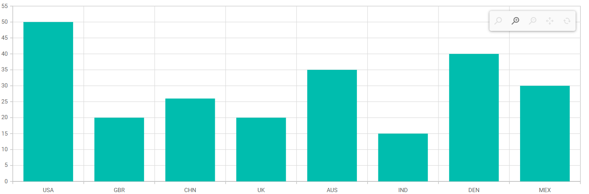

# Zooming in Blazor Charts Component

## Enable zooming

The chart can be zoomed in three different ways.

* Selection - By setting [EnableSelectionZooming](https://help.syncfusion.com/cr/blazor/Syncfusion.Blazor.Charts.ChartZoomSettings.html#Syncfusion_Blazor_Charts_ChartZoomSettings_EnableSelectionZooming) property to **true** in [ChartZoomSettings](https://help.syncfusion.com/cr/blazor/Syncfusion.Blazor.Charts.ChartZoomSettings.html), the chart can be zoomed using the rubber band selection.
* Mouse Wheel - By setting [EnableMouseWheelZooming](https://help.syncfusion.com/cr/blazor/Syncfusion.Blazor.Charts.ChartZoomSettings.html#Syncfusion_Blazor_Charts_ChartZoomSettings_EnableMouseWheelZooming) property to **true** in [ChartZoomSettings](https://help.syncfusion.com/cr/blazor/Syncfusion.Blazor.Charts.ChartZoomSettings.html), the chart can be zoomed-in and zoomed-out by scrolling the mouse wheel.
* Pinch - By setting [EnablePinchZooming](https://help.syncfusion.com/cr/blazor/Syncfusion.Blazor.Charts.ChartZoomSettings.html#Syncfusion_Blazor_Charts_ChartZoomSettings_EnablePinchZooming) property to **true** in [ChartZoomSettings](https://help.syncfusion.com/cr/blazor/Syncfusion.Blazor.Charts.ChartZoomSettings.html), the chart can be zoomed through pinch gesture in touch enabled devices.

 N> 
 * Pinch zooming is only usable in browsers that support multi-touch gestures.
 * To initiate a rectangular selection gesture on a device, you must touch the screen, hold your touch, and then drag to define the area for zooming on the chart.

```cshtml

@using Syncfusion.Blazor.Charts

<SfChart Title="Sales History of Product X">
    <ChartPrimaryXAxis ValueType="Syncfusion.Blazor.Charts.ValueType.Category"></ChartPrimaryXAxis>

    <ChartZoomSettings EnableMouseWheelZooming="true" EnablePinchZooming="true" EnableSelectionZooming="true"></ChartZoomSettings>

    <ChartSeriesCollection>
        <ChartSeries DataSource="@SalesReports" XName="X" YName="YValue" Type="ChartSeriesType.Column"></ChartSeries>
    </ChartSeriesCollection>
</SfChart>

@code{
    public class ChartData
    {
        public string X { get; set; }
        public double YValue { get; set; }
    }


    public List<ChartData> SalesReports = new List<ChartData>
    {
        new ChartData { X= "USA", YValue= 46 },
        new ChartData { X= "GBR", YValue= 27 },
        new ChartData { X= "CHN", YValue= 26 },
        new ChartData { X= "UK", YValue= 26 },
        new ChartData { X= "AUS", YValue= 26 },
        new ChartData { X= "IND", YValue= 26 },
        new ChartData { X= "DEN", YValue= 26 },
        new ChartData { X= "MEX", YValue= 26 },
    };
}

```


A zooming toolbar will show after zooming the chart, featuring options for **Zoom**, **Zoom In**, **Zoom Out**, **Pan**, and **Reset**. The **Pan** option allows you to pan the chart, while the **Reset** option allows you to reset the zoomed chart.

## Modes

The [Mode](https://help.syncfusion.com/cr/blazor/Syncfusion.Blazor.Charts.ChartZoomSettings.html#Syncfusion_Blazor_Charts_ChartZoomSettings_Mode) property in [ChartZoomSettings](https://help.syncfusion.com/cr/blazor/Syncfusion.Blazor.Charts.ChartZoomSettings.html) determines whether the chart can scale along the horizontal or vertical axes. The default value of the mode is XY (both axis).

There are three types of modes.

* X - Allows us to zoom the chart horizontally.
* Y - Allows us to zoom the chart vertically.
* XY - Allows us to zoom the chart both vertically and horizontally.

```cshtml

@using Syncfusion.Blazor.Charts

<SfChart Title="Sales History of Product X">
    <ChartPrimaryXAxis ValueType="Syncfusion.Blazor.Charts.ValueType.Category"></ChartPrimaryXAxis>

    <ChartZoomSettings EnableSelectionZooming="true" Mode="ZoomMode.X"></ChartZoomSettings>

    <ChartSeriesCollection>
        <ChartSeries DataSource="@SalesReports" XName="X" YName="YValue" Type="ChartSeriesType.Column"></ChartSeries>
    </ChartSeriesCollection>
</SfChart>

@code{
    public class ChartData
    {
        public string X { get; set; }
        public double YValue { get; set; }
    }

    public List<ChartData> SalesReports = new List<ChartData>
    {
        new ChartData { X= "USA", YValue= 46 },
        new ChartData { X= "GBR", YValue= 27 },
        new ChartData { X= "CHN", YValue= 26 },
        new ChartData { X= "UK", YValue= 26 },
        new ChartData { X= "AUS", YValue= 26 },
        new ChartData { X= "IND", YValue= 26 },
        new ChartData { X= "DEN", YValue= 26 },
        new ChartData { X= "MEX", YValue= 26 },
    };
}

```


## Toolbar

By default, zoom in, zoom out, pan, and reset buttons are available in the toolbar for zoomed charts. The [ToolbarItems](https://help.syncfusion.com/cr/blazor/Syncfusion.Blazor.Charts.ChartZoomSettings.html#Syncfusion_Blazor_Charts_ChartZoomSettings_ToolbarItems) property specifies which tools should be displayed in the toolbar.

```cshtml

@using Syncfusion.Blazor.Charts

<SfChart  Title="Sales History of Product X">
    <ChartPrimaryXAxis ValueType="Syncfusion.Blazor.Charts.ValueType.Category"></ChartPrimaryXAxis>

    <ChartZoomSettings EnableSelectionZooming="true" EnableMouseWheelZooming="true"
                       EnablePinchZooming="true" ToolbarItems="@ToolbarItem">
    </ChartZoomSettings>

    <ChartSeriesCollection>
        <ChartSeries DataSource="@SalesReports" XName="X" YName="YValue" Type="ChartSeriesType.Column"></ChartSeries>
    </ChartSeriesCollection>
</SfChart>

@code{
    public List<ToolbarItems> ToolbarItem = new List<ToolbarItems>() { ToolbarItems.Zoom, ToolbarItems.Reset, ToolbarItems.Pan };
	
    public class ChartData
    {
        public string X { get; set; }
        public double YValue { get; set; }
    }

    public List<ChartData> SalesReports = new List<ChartData>
    {
        new ChartData { X= "USA", YValue= 46 },
        new ChartData { X= "GBR", YValue= 27 },
        new ChartData { X= "CHN", YValue= 26 },
        new ChartData { X= "UK", YValue= 26 },
        new ChartData { X= "AUS", YValue= 26 },
        new ChartData { X= "IND", YValue= 26 },
        new ChartData { X= "DEN", YValue= 26 },
        new ChartData { X= "MEX", YValue= 26 },
    };
}

```


### Toolbar display mode

By default, the zooming toolbar appears only when the chart is zoomed. However, you can display a zooming toolbar in the chart during the initial load by setting the [ToolbarDisplayMode](https://help.syncfusion.com/cr/blazor/Syncfusion.Blazor.Charts.ChartZoomSettings.html#Syncfusion_Blazor_Charts_ChartZoomSettings_ToolbarDisplayMode) to [ToolbarMode.Always](https://help.syncfusion.com/cr/blazor/Syncfusion.Blazor.Charts.ToolbarMode.html#Syncfusion_Blazor_Charts_ToolbarMode_Always).

```cshtml

@using Syncfusion.Blazor.Charts

<SfChart>
    <ChartPrimaryXAxis ValueType="Syncfusion.Blazor.Charts.ValueType.Category"></ChartPrimaryXAxis>
    <ChartZoomSettings EnableSelectionZooming="true" EnableMouseWheelZooming="true" EnablePinchZooming="true"  ToolbarDisplayMode="ToolbarMode.Always">
    </ChartZoomSettings>
    <ChartSeriesCollection>
        <ChartSeries DataSource="@SalesReports" XName="X" YName="YValue" Type="ChartSeriesType.Column"></ChartSeries>
    </ChartSeriesCollection>
</SfChart>

@code {

    public class ChartData1
    {
        public string X { get; set; }
        public double YValue { get; set; }
    }

    public List<ChartData1> SalesReports = new List<ChartData1>
    {
        new ChartData1 { X= "USA", YValue= 50 },
        new ChartData1 { X= "GBR", YValue= 20 },
        new ChartData1 { X= "CHN", YValue= 26 },
        new ChartData1 { X= "UK", YValue= 20 },
        new ChartData1 { X= "AUS", YValue= 35 },
        new ChartData1 { X= "IND", YValue= 15 },
        new ChartData1 { X= "DEN", YValue= 40 },
        new ChartData1 { X= "MEX", YValue= 30 },
    };
}
```



## Enable pan

By using the [EnablePan](https://help.syncfusion.com/cr/blazor/Syncfusion.Blazor.Charts.ChartZoomSettings.html#Syncfusion_Blazor_Charts_ChartZoomSettings_EnablePan) property, one can pan the zoomed chart without the help of toolbar items.

```cshtml

@using Syncfusion.Blazor.Charts

<SfChart Title="Sales History of Product X">
    <ChartPrimaryXAxis ValueType="Syncfusion.Blazor.Charts.ValueType.Category" ZoomFactor="0.2" ZoomPosition="0.6"></ChartPrimaryXAxis>

    <ChartZoomSettings EnableSelectionZooming="true" EnablePan="true"></ChartZoomSettings>

    <ChartSeriesCollection>
        <ChartSeries DataSource="@SalesReports" XName="X" YName="YValue" Type="ChartSeriesType.Column"></ChartSeries>
    </ChartSeriesCollection>
</SfChart>

@code{
    public class ChartData
    {
        public string X { get; set; }
        public double YValue { get; set; }
    }

    public List<ChartData> SalesReports = new List<ChartData>
	{
        new ChartData { X= "USA", YValue= 46 },
        new ChartData { X= "GBR", YValue= 27 },
        new ChartData { X= "CHN", YValue= 26 },
        new ChartData { X= "UK", YValue= 26 },
        new ChartData { X= "AUS", YValue= 26 },
        new ChartData { X= "IND", YValue= 26 },
        new ChartData { X= "DEN", YValue= 26 },
        new ChartData { X= "MEX", YValue= 26 },
    };
}

```


## Enable scrollbar

The [EnableScrollbar](https://help.syncfusion.com/cr/blazor/Syncfusion.Blazor.Charts.ChartZoomSettings.html#Syncfusion_Blazor_Charts_ChartZoomSettings_EnableScrollbar) property can be used to add a scrollbar to a zoomed chart. The chart can be panned or zoomed using this scrollbar.

```cshtml

@using Syncfusion.Blazor.Charts

<SfChart Title="Sales History of Product X">
    <ChartPrimaryXAxis Title="Years" ValueType="Syncfusion.Blazor.Charts.ValueType.DateTime"
                       Skeleton="yMMM" EdgeLabelPlacement="EdgeLabelPlacement.Shift">
        <ChartAxisMajorGridLines Width="0"></ChartAxisMajorGridLines>
    </ChartPrimaryXAxis>

    <ChartPrimaryYAxis Title="Profit ($)" RangePadding="ChartRangePadding.None">
        <ChartAxisLineStyle Width="0"></ChartAxisLineStyle>
        <ChartAxisMajorTickLines Width="0"></ChartAxisMajorTickLines>
    </ChartPrimaryYAxis>

    <ChartLegendSettings Visible="false"></ChartLegendSettings>

    <ChartZoomSettings EnableMouseWheelZooming="true" EnableScrollbar="true" EnablePinchZooming="true"
                       EnableSelectionZooming="true"></ChartZoomSettings>

    <ChartSeriesCollection>
        <ChartSeries DataSource="@SalesReports" Name="Warmest" XName="XValue" Width="2" Opacity="1"
                     YName="YValue" Type="ChartSeriesType.Area">
        </ChartSeries>
    </ChartSeriesCollection>

    <ChartArea>
        <ChartAreaBorder Width="0"></ChartAreaBorder>
    </ChartArea>
</SfChart>

@code {

    public class ChartData
    {
        public DateTime XValue { get; set; }
        public double YValue { get; set; }
    }

    public List<ChartData> SalesReports = new List<ChartData>
	{
        new ChartData { XValue = new DateTime(2000, 02, 11), YValue = 14 },
        new ChartData { XValue = new DateTime(2000, 09, 04), YValue = 20 },
        new ChartData { XValue = new DateTime(2001, 02, 11), YValue = 25 },
        new ChartData { XValue = new DateTime(2001, 09, 16), YValue = 21 },
        new ChartData { XValue = new DateTime(2002, 02, 07), YValue = 13 },
        new ChartData { XValue = new DateTime(2002, 09, 07), YValue = 18 },
        new ChartData { XValue = new DateTime(2003, 02, 11), YValue = 24 },
        new ChartData { XValue = new DateTime(2003, 09, 14), YValue = 23 },
        new ChartData { XValue = new DateTime(2004, 02, 06), YValue = 19 },
        new ChartData { XValue = new DateTime(2004, 09, 06), YValue = 31 },
        new ChartData { XValue = new DateTime(2005, 02, 11), YValue = 39 },
        new ChartData { XValue = new DateTime(2005, 09, 11), YValue = 50 },
        new ChartData { XValue = new DateTime(2006, 02, 11), YValue = 24 },
    };
}

```


## Auto interval on zooming

The axis interval will be calculated automatically with respect to the zoomed range, if the [EnableAutoIntervalOnZooming](https://help.syncfusion.com/cr/blazor/Syncfusion.Blazor.Charts.ChartCommonAxis.html#Syncfusion_Blazor_Charts_ChartCommonAxis_EnableAutoIntervalOnZooming) property is set to **true**.

```cshtml

@using Syncfusion.Blazor.Charts

<SfChart Title="Sales History of Product X">
    <ChartPrimaryXAxis Title="Years" ValueType="Syncfusion.Blazor.Charts.ValueType.DateTime"
                       Skeleton="yMMM" EdgeLabelPlacement="EdgeLabelPlacement.Shift" EnableAutoIntervalOnZooming="true">
        <ChartAxisMajorGridLines Width="0"></ChartAxisMajorGridLines>
    </ChartPrimaryXAxis>

    <ChartPrimaryYAxis Title="Profit ($)" RangePadding="ChartRangePadding.None">
        <ChartAxisLineStyle Width="0"></ChartAxisLineStyle>
        <ChartAxisMajorTickLines Width="0"></ChartAxisMajorTickLines>
    </ChartPrimaryYAxis>

    <ChartLegendSettings Visible="false"></ChartLegendSettings>

    <ChartZoomSettings EnableMouseWheelZooming="true" EnablePinchZooming="true"
                       EnableSelectionZooming="true"></ChartZoomSettings>

    <ChartSeriesCollection>
        <ChartSeries DataSource="@SalesReports" Name="Warmest" XName="XValue" Width="2" Opacity="1"
                     YName="YValue" Type="ChartSeriesType.Area">
        </ChartSeries>
    </ChartSeriesCollection>

    <ChartArea>
        <ChartAreaBorder Width="0"></ChartAreaBorder>
    </ChartArea>
</SfChart>

@code {

    public class ChartData
    {
        public DateTime XValue { get; set; }
        public double YValue { get; set; }
    }
	
    public List<ChartData> SalesReports = new List<ChartData>
	{
        new ChartData { XValue = new DateTime(2000, 02, 11), YValue = 14 },
        new ChartData { XValue = new DateTime(2000, 09, 04), YValue = 20 },
        new ChartData { XValue = new DateTime(2001, 02, 11), YValue = 25 },
        new ChartData { XValue = new DateTime(2001, 09, 16), YValue = 21 },
        new ChartData { XValue = new DateTime(2002, 02, 07), YValue = 13 },
        new ChartData { XValue = new DateTime(2002, 09, 07), YValue = 18 },
        new ChartData { XValue = new DateTime(2003, 02, 11), YValue = 24 },
        new ChartData { XValue = new DateTime(2003, 09, 14), YValue = 23 },
        new ChartData { XValue = new DateTime(2004, 02, 06), YValue = 19 },
        new ChartData { XValue = new DateTime(2004, 09, 06), YValue = 31 },
        new ChartData { XValue = new DateTime(2005, 02, 11), YValue = 39 },
        new ChartData { XValue = new DateTime(2005, 09, 11), YValue = 50 },
        new ChartData { XValue = new DateTime(2006, 02, 11), YValue = 24 },
    };
}

```


N> Refer to our [Blazor Charts](https://www.syncfusion.com/blazor-components/blazor-charts) feature tour page for its groundbreaking feature representations and also explore our [Blazor Chart Example](https://blazor.syncfusion.com/demos/chart/line?theme=bootstrap5) to know various chart types and how to represent time-dependent data, showing trends at equal intervals.

## See Also

* [Data label](./data-labels)
* [Legend](./legend)
* [Marker](./data-markers)