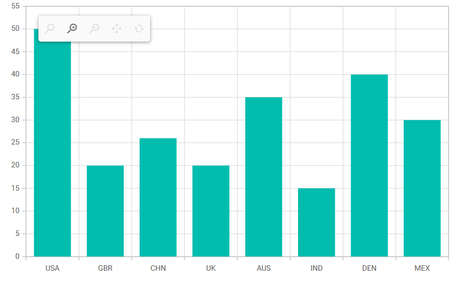
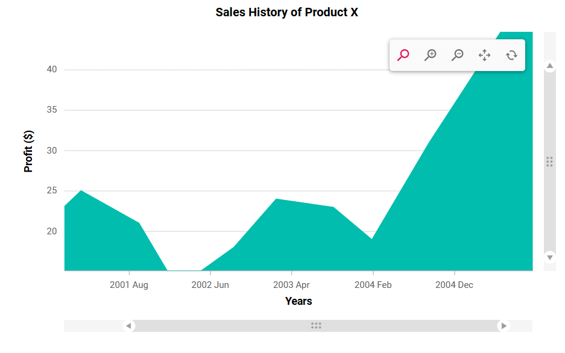

# Zooming in Blazor Charts Component
Zooming and panning in Blazor Charts allow users to explore data in detail and interact with chart elements efficiently.

Watch the following video to learn how to zoom and pan in Blazor Charts.



## Enable zooming

Blazor Charts support three zooming methods:

* Selection: Enable rubber band selection by setting [EnableSelectionZooming](https://help.syncfusion.com/cr/blazor/Syncfusion.Blazor.Charts.ChartZoomSettings.html#Syncfusion_Blazor_Charts_ChartZoomSettings_EnableSelectionZooming) to **true** in [ChartZoomSettings](https://help.syncfusion.com/cr/blazor/Syncfusion.Blazor.Charts.ChartZoomSettings.html).
* Mouse Wheel: Enable mouse wheel zooming by setting [EnableMouseWheelZooming](https://help.syncfusion.com/cr/blazor/Syncfusion.Blazor.Charts.ChartZoomSettings.html#Syncfusion_Blazor_Charts_ChartZoomSettings_EnableMouseWheelZooming) to **true**.
* Pinch: Enable pinch zooming for touch devices by setting [EnablePinchZooming](https://help.syncfusion.com/cr/blazor/Syncfusion.Blazor.Charts.ChartZoomSettings.html#Syncfusion_Blazor_Charts_ChartZoomSettings_EnablePinchZooming) to **true**.

N> Pinch zooming is available only in browsers supporting multi-touch gestures. To zoom on a touch device, double-tap quickly and drag to define the zoom area.

```cshtml

@using Syncfusion.Blazor.Charts

<SfChart Title="Sales History of Product X">
    <ChartPrimaryXAxis ValueType="Syncfusion.Blazor.Charts.ValueType.Category" />

    <ChartZoomSettings EnableMouseWheelZooming="true" EnablePinchZooming="true" EnableSelectionZooming="true"></ChartZoomSettings>

    <ChartSeriesCollection>
        <ChartSeries DataSource="@SalesReports" XName="X" YName="YValue" Type="ChartSeriesType.Column"></ChartSeries>
    </ChartSeriesCollection>
</SfChart>

@code {
    public class ChartData
    {
        public string X { get; set; }
        public double YValue { get; set; }
    }

    public List<ChartData> SalesReports = new List<ChartData>
    {
        new ChartData { X = "USA", YValue = 46 },
        new ChartData { X = "GBR", YValue = 27 },
        new ChartData { X = "CHN", YValue = 26 },
        new ChartData { X = "UK", YValue = 26 },
        new ChartData { X = "AUS", YValue = 26 },
        new ChartData { X = "IND", YValue = 26 },
        new ChartData { X = "DEN", YValue = 26 },
        new ChartData { X = "MEX", YValue = 26 }
    };
}

```


After zooming, a toolbar appears with options for **Zoom**, **Zoom In**, **Zoom Out**, **Pan**, and **Reset**. Use **Pan** to move the chart and **Reset** to restore the original view.

## Modes

The [Mode](https://help.syncfusion.com/cr/blazor/Syncfusion.Blazor.Charts.ChartZoomSettings.html#Syncfusion_Blazor_Charts_ChartZoomSettings_Mode) property in [ChartZoomSettings](https://help.syncfusion.com/cr/blazor/Syncfusion.Blazor.Charts.ChartZoomSettings.html) controls zooming direction:

* X - Zoom horizontally
* Y - Zoom vertically
* XY - Zoom both axes (default)

```cshtml

@using Syncfusion.Blazor.Charts

<SfChart Title="Sales History of Product X">
    <ChartPrimaryXAxis ValueType="Syncfusion.Blazor.Charts.ValueType.Category" />

    <ChartZoomSettings EnableSelectionZooming="true" Mode="ZoomMode.X"></ChartZoomSettings>

    <ChartSeriesCollection>
        <ChartSeries DataSource="@SalesReports" XName="X" YName="YValue" Type="ChartSeriesType.Column"></ChartSeries>
    </ChartSeriesCollection>
</SfChart>

@code {
    public class ChartData
    {
        public string X { get; set; }
        public double YValue { get; set; }
    }

    public List<ChartData> SalesReports = new List<ChartData>
    {
        new ChartData { X = "USA", YValue = 46 },
        new ChartData { X = "GBR", YValue = 27 },
        new ChartData { X = "CHN", YValue = 26 },
        new ChartData { X = "UK", YValue = 26 },
        new ChartData { X = "AUS", YValue = 26 },
        new ChartData { X = "IND", YValue = 26 },
        new ChartData { X = "DEN", YValue = 26 },
        new ChartData { X = "MEX", YValue = 26 }
    };
}

```


## Toolbar

By default, the zoomed chart displays toolbar buttons for zooming, panning, and resetting. Use the [ToolbarItems](https://help.syncfusion.com/cr/blazor/Syncfusion.Blazor.Charts.ChartZoomSettings.html#Syncfusion_Blazor_Charts_ChartZoomSettings_ToolbarItems) property to specify which tools appear.

```cshtml

@using Syncfusion.Blazor.Charts

<SfChart  Title="Sales History of Product X">
    <ChartPrimaryXAxis ValueType="Syncfusion.Blazor.Charts.ValueType.Category" />

    <ChartZoomSettings EnableSelectionZooming="true" EnableMouseWheelZooming="true"
                       EnablePinchZooming="true" ToolbarItems="@ToolbarItem">
    </ChartZoomSettings>

    <ChartSeriesCollection>
        <ChartSeries DataSource="@SalesReports" XName="X" YName="YValue" Type="ChartSeriesType.Column"></ChartSeries>
    </ChartSeriesCollection>
</SfChart>

@code {
    public List<ToolbarItems> ToolbarItem = new List<ToolbarItems>() { ToolbarItems.Zoom, ToolbarItems.Reset, ToolbarItems.Pan };
	
    public class ChartData
    {
        public string X { get; set; }
        public double YValue { get; set; }
    }

    public List<ChartData> SalesReports = new List<ChartData>
    {
        new ChartData { X = "USA", YValue = 46 },
        new ChartData { X = "GBR", YValue = 27 },
        new ChartData { X = "CHN", YValue = 26 },
        new ChartData { X = "UK", YValue = 26 },
        new ChartData { X = "AUS", YValue = 26 },
        new ChartData { X = "IND", YValue = 26 },
        new ChartData { X = "DEN", YValue = 26 },
        new ChartData { X = "MEX", YValue = 26 }
    };
}

```


### Toolbar display mode

The zooming toolbar appears only after zooming by default. To display it on initial load, set [ToolbarDisplayMode](https://help.syncfusion.com/cr/blazor/Syncfusion.Blazor.Charts.ChartZoomSettings.html#Syncfusion_Blazor_Charts_ChartZoomSettings_ToolbarDisplayMode) to [ToolbarMode.Always](https://help.syncfusion.com/cr/blazor/Syncfusion.Blazor.Charts.ToolbarMode.html#Syncfusion_Blazor_Charts_ToolbarMode_Always).

```cshtml

@using Syncfusion.Blazor.Charts

<SfChart>
    <ChartPrimaryXAxis ValueType="Syncfusion.Blazor.Charts.ValueType.Category" />
    <ChartZoomSettings EnableSelectionZooming="true" EnableMouseWheelZooming="true" EnablePinchZooming="true"  ToolbarDisplayMode="ToolbarMode.Always">
    </ChartZoomSettings>
    <ChartSeriesCollection>
        <ChartSeries DataSource="@SalesReports" XName="X" YName="YValue" Type="ChartSeriesType.Column"></ChartSeries>
    </ChartSeriesCollection>
</SfChart>

@code {

    public class ChartData
    {
        public string X { get; set; }
        public double YValue { get; set; }
    }

    public List<ChartData> SalesReports = new List<ChartData>
    {
        new ChartData { X = "USA", YValue = 46 },
        new ChartData { X = "GBR", YValue = 27 },
        new ChartData { X = "CHN", YValue = 26 },
        new ChartData { X = "UK", YValue = 26 },
        new ChartData { X = "AUS", YValue = 26 },
        new ChartData { X = "IND", YValue = 26 },
        new ChartData { X = "DEN", YValue = 26 },
        new ChartData { X = "MEX", YValue = 26 }
    };
}

```


### Toolbar positioning

Reposition the zoom toolbar using [ChartZoomToolbarPosition](https://help.syncfusion.com/cr/blazor/Syncfusion.Blazor.Charts.ChartZoomToolbarPosition.html). Set [HorizontalAlign](https://help.syncfusion.com/cr/blazor/Syncfusion.Blazor.Charts.ChartZoomToolbarPosition.html#Syncfusion_Blazor_Charts_ChartZoomToolbarPosition_HorizontalAlign) and [VerticalAlign](https://help.syncfusion.com/cr/blazor/Syncfusion.Blazor.Charts.ChartZoomToolbarPosition.html#Syncfusion_Blazor_Charts_ChartZoomToolbarPosition_VerticalAlign) for alignment, or use [X](https://help.syncfusion.com/cr/blazor/Syncfusion.Blazor.Charts.ChartZoomToolbarPosition.html#Syncfusion_Blazor_Charts_ChartZoomToolbarPosition_X) and [Y](https://help.syncfusion.com/cr/blazor/Syncfusion.Blazor.Charts.ChartZoomToolbarPosition.html#Syncfusion_Blazor_Charts_ChartZoomToolbarPosition_Y) for custom coordinates.

```cshtml

@using Syncfusion.Blazor.Charts

<SfChart>
    <ChartPrimaryXAxis ValueType="Syncfusion.Blazor.Charts.ValueType.Category" />

    <ChartSeriesCollection>
        <ChartSeries DataSource="@SalesReports" XName="X" YName="YValue" Type="ChartSeriesType.Column"></ChartSeries>
    </ChartSeriesCollection>

    <ChartZoomSettings EnableSelectionZooming="true" EnableMouseWheelZooming="true" EnablePinchZooming="true" ToolbarDisplayMode="ToolbarMode.Always">
        <ChartZoomToolbarPosition HorizontalAlign="Syncfusion.Blazor.Charts.HorizontalAlign.Left" VerticalAlign="Syncfusion.Blazor.Charts.VerticalAlign.Top" X="10" Y="5">
        </ChartZoomToolbarPosition>
    </ChartZoomSettings>
</SfChart>

@code {
    public class ChartData
    {
        public string X { get; set; }
        public double YValue { get; set; }
    }

    public List<ChartData> SalesReports = new List<ChartData>
    {
        new ChartData { X = "USA", YValue = 46 },
        new ChartData { X = "GBR", YValue = 27 },
        new ChartData { X = "CHN", YValue = 26 },
        new ChartData { X = "UK", YValue = 26 },
        new ChartData { X = "AUS", YValue = 26 },
        new ChartData { X = "IND", YValue = 26 },
        new ChartData { X = "DEN", YValue = 26 },
        new ChartData { X = "MEX", YValue = 26 }
    };
}

```




## Enable pan

Enable panning by setting [EnablePan](https://help.syncfusion.com/cr/blazor/Syncfusion.Blazor.Charts.ChartZoomSettings.html#Syncfusion_Blazor_Charts_ChartZoomSettings_EnablePan) to **true**. This allows users to pan the zoomed chart without using toolbar items.

```cshtml

@using Syncfusion.Blazor.Charts

<SfChart Title="Sales History of Product X">
    <ChartPrimaryXAxis ValueType="Syncfusion.Blazor.Charts.ValueType.Category" ZoomFactor="0.2" ZoomPosition="0.6"></ChartPrimaryXAxis>

    <ChartZoomSettings EnableSelectionZooming="true" EnablePan="true"></ChartZoomSettings>

    <ChartSeriesCollection>
        <ChartSeries DataSource="@SalesReports" XName="X" YName="YValue" Type="ChartSeriesType.Column"></ChartSeries>
    </ChartSeriesCollection>
</SfChart>

@code {
    public class ChartData
    {
        public string X { get; set; }
        public double YValue { get; set; }
    }

    public List<ChartData> SalesReports = new List<ChartData>
	{
        new ChartData { X = "USA", YValue = 46 },
        new ChartData { X = "GBR", YValue = 27 },
        new ChartData { X = "CHN", YValue = 26 },
        new ChartData { X = "UK", YValue = 26 },
        new ChartData { X = "AUS", YValue = 26 },
        new ChartData { X = "IND", YValue = 26 },
        new ChartData { X = "DEN", YValue = 26 },
        new ChartData { X = "MEX", YValue = 26 }
    };
}

```


## Scrollbar

Scrollbars provide navigation for zoomed charts.

### Enabling scrollbar

Add a scrollbar to a zoomed chart by setting [EnableScrollbar](https://help.syncfusion.com/cr/blazor/Syncfusion.Blazor.Charts.ChartZoomSettings.html#Syncfusion_Blazor_Charts_ChartZoomSettings_EnableScrollbar) to **true**. Use the scrollbar to pan or zoom the chart.

```cshtml

@using Syncfusion.Blazor.Charts

<SfChart Title="Sales History of Product X">
    <ChartPrimaryXAxis Title="Years" ValueType="Syncfusion.Blazor.Charts.ValueType.DateTime"
                       Skeleton="yMMM" EdgeLabelPlacement="EdgeLabelPlacement.Shift">
        <ChartAxisMajorGridLines Width="0"></ChartAxisMajorGridLines>
    </ChartPrimaryXAxis>

    <ChartPrimaryYAxis Title="Profit ($)" RangePadding="ChartRangePadding.None">
        <ChartAxisLineStyle Width="0"></ChartAxisLineStyle>
        <ChartAxisMajorTickLines Width="0"></ChartAxisMajorTickLines>
    </ChartPrimaryYAxis>

    <ChartLegendSettings Visible="false"></ChartLegendSettings>

    <ChartZoomSettings EnableMouseWheelZooming="true" EnableScrollbar="true" EnablePinchZooming="true"
                       EnableSelectionZooming="true"></ChartZoomSettings>

    <ChartSeriesCollection>
        <ChartSeries DataSource="@SalesReports" Name="Warmest" XName="XValue" Width="2" Opacity="1"
                     YName="YValue" Type="ChartSeriesType.Area">
        </ChartSeries>
    </ChartSeriesCollection>

    <ChartArea>
        <ChartAreaBorder Width="0"></ChartAreaBorder>
    </ChartArea>
</SfChart>

@code {
    public class ChartData
    {
        public DateTime XValue { get; set; }
        public double YValue { get; set; }
    }

    public List<ChartData> SalesReports = new List<ChartData>
	{
        new ChartData { XValue = new DateTime(2000, 02, 11), YValue = 14 },
        new ChartData { XValue = new DateTime(2000, 09, 04), YValue = 20 },
        new ChartData { XValue = new DateTime(2001, 02, 11), YValue = 25 },
        new ChartData { XValue = new DateTime(2001, 09, 16), YValue = 21 },
        new ChartData { XValue = new DateTime(2002, 02, 07), YValue = 13 },
        new ChartData { XValue = new DateTime(2002, 09, 07), YValue = 18 },
        new ChartData { XValue = new DateTime(2003, 02, 11), YValue = 24 },
        new ChartData { XValue = new DateTime(2003, 09, 14), YValue = 23 },
        new ChartData { XValue = new DateTime(2004, 02, 06), YValue = 19 },
        new ChartData { XValue = new DateTime(2004, 09, 06), YValue = 31 },
        new ChartData { XValue = new DateTime(2005, 02, 11), YValue = 39 },
        new ChartData { XValue = new DateTime(2005, 09, 11), YValue = 50 },
        new ChartData { XValue = new DateTime(2006, 02, 11), YValue = 24 }
    };
}

```


### Scrollbar positioning

Set the [Position](https://help.syncfusion.com/cr/blazor/Syncfusion.Blazor.Charts.ChartCommonScrollbarSettings.html#Syncfusion_Blazor_Charts_ChartCommonScrollbarSettings_Position) property in [ChartAxisScrollbarSettings](https://help.syncfusion.com/cr/blazor/Syncfusion.Blazor.Charts.ChartAxisScrollbarSettings.html) to specify scrollbar location. By default, scrollbars are placed near their axes. Use [Left](https://help.syncfusion.com/cr/blazor/Syncfusion.Blazor.Charts.ScrollbarPosition.html#Syncfusion_Blazor_Charts_ScrollbarPosition_Left), [Right](https://help.syncfusion.com/cr/blazor/Syncfusion.Blazor.Charts.ScrollbarPosition.html#Syncfusion_Blazor_Charts_ScrollbarPosition_Right), [Top](https://help.syncfusion.com/cr/blazor/Syncfusion.Blazor.Charts.ScrollbarPosition.html#Syncfusion_Blazor_Charts_ScrollbarPosition_Top), or [Bottom](https://help.syncfusion.com/cr/blazor/Syncfusion.Blazor.Charts.ScrollbarPosition.html#Syncfusion_Blazor_Charts_ScrollbarPosition_Bottom) for custom placement.

```cshtml

@using Syncfusion.Blazor.Charts

<SfChart Title="Sales History of Product X">
    <ChartPrimaryXAxis Title="Years" ValueType="Syncfusion.Blazor.Charts.ValueType.DateTime"
                       EdgeLabelPlacement="EdgeLabelPlacement.Shift">
        <ChartAxisMajorGridLines Width="0"></ChartAxisMajorGridLines>
        <ChartAxisScrollbarSettings Enable="false" PointsLength="1000" Position="ScrollbarPosition.Bottom" />
    </ChartPrimaryXAxis>

    <ChartPrimaryYAxis Title="Profit ($)" RangePadding="ChartRangePadding.None">
        <ChartAxisLineStyle Width="0"></ChartAxisLineStyle>
        <ChartAxisMajorTickLines Width="0"></ChartAxisMajorTickLines>
        <ChartAxisScrollbarSettings Enable="false" PointsLength="1000" Position="ScrollbarPosition.Right" />
    </ChartPrimaryYAxis>

    <ChartSeriesCollection>
        <ChartSeries DataSource="@SalesReports" Name="Warmest" XName="XValue" Width="2" Opacity="1"
                     YName="YValue" Type="Syncfusion.Blazor.Charts.ChartSeriesType.Area">
        </ChartSeries>
    </ChartSeriesCollection>

    <ChartArea>
        <ChartAreaBorder Width="0"></ChartAreaBorder>
    </ChartArea>

    <ChartZoomSettings EnableMouseWheelZooming="true" EnableScrollbar="true" EnablePinchZooming="true"
                       EnableSelectionZooming="true"></ChartZoomSettings>
    <ChartLegendSettings Visible="false"></ChartLegendSettings>

</SfChart>

@code {
    public class ChartData
    {
        public DateTime XValue { get; set; }
        public double YValue { get; set; }
    }

    public List<ChartData> SalesReports = new List<ChartData>
    {
        new ChartData { XValue = new DateTime(2000, 02, 11), YValue = 14 },
        new ChartData { XValue = new DateTime(2000, 09, 04), YValue = 20 },
        new ChartData { XValue = new DateTime(2001, 02, 11), YValue = 25 },
        new ChartData { XValue = new DateTime(2001, 09, 16), YValue = 21 },
        new ChartData { XValue = new DateTime(2002, 02, 07), YValue = 13 },
        new ChartData { XValue = new DateTime(2002, 09, 07), YValue = 18 },
        new ChartData { XValue = new DateTime(2003, 02, 11), YValue = 24 },
        new ChartData { XValue = new DateTime(2003, 09, 14), YValue = 23 },
        new ChartData { XValue = new DateTime(2004, 02, 06), YValue = 19 },
        new ChartData { XValue = new DateTime(2004, 09, 06), YValue = 31 },
        new ChartData { XValue = new DateTime(2005, 02, 11), YValue = 39 },
        new ChartData { XValue = new DateTime(2005, 09, 11), YValue = 50 },
        new ChartData { XValue = new DateTime(2006, 02, 11), YValue = 24 }
    };
}

```




### Customization

Customize scrollbar appearance and behavior using [ChartAxisScrollbarSettings](https://help.syncfusion.com/cr/blazor/Syncfusion.Blazor.Charts.ChartAxisScrollbarSettings.html):

- [TrackColor](https://help.syncfusion.com/cr/blazor/Syncfusion.Blazor.Charts.ChartCommonScrollbarSettings.html#Syncfusion_Blazor_Charts_ChartCommonScrollbarSettings_TrackColor): Specifies the track color.
- [TrackRadius](https://help.syncfusion.com/cr/blazor/Syncfusion.Blazor.Charts.ChartCommonScrollbarSettings.html#Syncfusion_Blazor_Charts_ChartCommonScrollbarSettings_TrackRadius): Specifies the track corner radius.
- [ScrollbarColor](https://help.syncfusion.com/cr/blazor/Syncfusion.Blazor.Charts.ChartCommonScrollbarSettings.html#Syncfusion_Blazor_Charts_ChartCommonScrollbarSettings_ScrollbarColor): Specifies the scrollbar color.
- [ScrollbarRadius](https://help.syncfusion.com/cr/blazor/Syncfusion.Blazor.Charts.ChartCommonScrollbarSettings.html#Syncfusion_Blazor_Charts_ChartCommonScrollbarSettings_ScrollbarRadius): Specifies the scrollbar corner radius.
- [GripColor](https://help.syncfusion.com/cr/blazor/Syncfusion.Blazor.Charts.ChartCommonScrollbarSettings.html#Syncfusion_Blazor_Charts_ChartCommonScrollbarSettings_GripColor): Specifies the grip color.
- [Height](https://help.syncfusion.com/cr/blazor/Syncfusion.Blazor.Charts.ChartCommonScrollbarSettings.html#Syncfusion_Blazor_Charts_ChartCommonScrollbarSettings_Height): Specifies the scrollbar height.
- [EnableZoom](https://help.syncfusion.com/cr/blazor/Syncfusion.Blazor.Charts.ChartCommonScrollbarSettings.html#Syncfusion_Blazor_Charts_ChartCommonScrollbarSettings_EnableZoom): Enable or disable zooming via the scrollbar.

```cshtml

@using Syncfusion.Blazor.Charts

<SfChart Title="Sales History of Product X" >
    <ChartPrimaryXAxis Title="Years" EdgeLabelPlacement="EdgeLabelPlacement.Shift">
        <ChartAxisMajorGridLines Width="0"></ChartAxisMajorGridLines>
        <ChartAxisScrollbarSettings Enable="false" PointsLength="1000" Height="16" EnableZoom="true"
             TrackRadius="8" ScrollbarRadius="8" GripColor="#9e9e9e" TrackColor="#f5f5f5" ScrollbarColor="#e0e0e0" />
    </ChartPrimaryXAxis>

    <ChartPrimaryYAxis Title="Profit ($)" RangePadding="ChartRangePadding.None">
        <ChartAxisLineStyle Width="0"></ChartAxisLineStyle>
        <ChartAxisMajorTickLines Width="0"></ChartAxisMajorTickLines>
        <ChartAxisScrollbarSettings Enable="false" PointsLength="1000" Height="16" EnableZoom="true"
             TrackRadius="8" ScrollbarRadius="8" GripColor="#9e9e9e" TrackColor="#f5f5f5" ScrollbarColor="#e0e0e0" />
    </ChartPrimaryYAxis>

    <ChartLegendSettings Visible="false" />

    <ChartZoomSettings EnableMouseWheelZooming="true" EnableScrollbar="true" EnablePinchZooming="true"
        EnableSelectionZooming="true"></ChartZoomSettings>

    <ChartSeriesCollection>
        <ChartSeries DataSource="@SalesDetails" XName="X" YName="Y" Type="Syncfusion.Blazor.Charts.ChartSeriesType.Area">
        </ChartSeries>
    </ChartSeriesCollection>

</SfChart>

@code {
    public class ChartData
    {
        public double X { get; set; }
        public double Y { get; set; }
    }

    public List<ChartData> SalesDetails = new List<ChartData>
    {
        new ChartData { X = 1900, Y = 4 },
        new ChartData { X = 1920, Y = 3.0 },
        new ChartData { X = 1940, Y = 3.8 },
        new ChartData { X = 1960, Y = 3.4 },
        new ChartData { X = 2000, Y = 3.9 }
    };
}

```



## Auto interval on zooming

Set [EnableAutoIntervalOnZooming](https://help.syncfusion.com/cr/blazor/Syncfusion.Blazor.Charts.ChartAxis.html#Syncfusion_Blazor_Charts_ChartAxis_EnableAutoIntervalOnZooming) to **true** to automatically calculate axis intervals based on the zoomed range.

```cshtml

@using Syncfusion.Blazor.Charts

<SfChart Title="Sales History of Product X">
    <ChartPrimaryXAxis Title="Years" ValueType="Syncfusion.Blazor.Charts.ValueType.DateTime"
                       Skeleton="yMMM" EdgeLabelPlacement="EdgeLabelPlacement.Shift" EnableAutoIntervalOnZooming="true">
        <ChartAxisMajorGridLines Width="0"></ChartAxisMajorGridLines>
    </ChartPrimaryXAxis>

    <ChartPrimaryYAxis Title="Profit ($)" RangePadding="ChartRangePadding.None">
        <ChartAxisLineStyle Width="0"></ChartAxisLineStyle>
        <ChartAxisMajorTickLines Width="0"></ChartAxisMajorTickLines>
    </ChartPrimaryYAxis>

    <ChartLegendSettings Visible="false" />

    <ChartZoomSettings EnableMouseWheelZooming="true" EnablePinchZooming="true"
                       EnableSelectionZooming="true"></ChartZoomSettings>

    <ChartSeriesCollection>
        <ChartSeries DataSource="@SalesReports" Name="Warmest" XName="XValue" Width="2" Opacity="1"
                     YName="YValue" Type="ChartSeriesType.Area">
        </ChartSeries>
    </ChartSeriesCollection>

    <ChartArea>
        <ChartAreaBorder Width="0"></ChartAreaBorder>
    </ChartArea>
</SfChart>

@code {
    public class ChartData
    {
        public DateTime XValue { get; set; }
        public double YValue { get; set; }
    }
	
    public List<ChartData> SalesReports = new List<ChartData>
	{
        new ChartData { XValue = new DateTime(2000, 02, 11), YValue = 14 },
        new ChartData { XValue = new DateTime(2000, 09, 04), YValue = 20 },
        new ChartData { XValue = new DateTime(2001, 02, 11), YValue = 25 },
        new ChartData { XValue = new DateTime(2001, 09, 16), YValue = 21 },
        new ChartData { XValue = new DateTime(2002, 02, 07), YValue = 13 },
        new ChartData { XValue = new DateTime(2002, 09, 07), YValue = 18 },
        new ChartData { XValue = new DateTime(2003, 02, 11), YValue = 24 },
        new ChartData { XValue = new DateTime(2003, 09, 14), YValue = 23 },
        new ChartData { XValue = new DateTime(2004, 02, 06), YValue = 19 },
        new ChartData { XValue = new DateTime(2004, 09, 06), YValue = 31 },
        new ChartData { XValue = new DateTime(2005, 02, 11), YValue = 39 },
        new ChartData { XValue = new DateTime(2005, 09, 11), YValue = 50 },
        new ChartData { XValue = new DateTime(2006, 02, 11), YValue = 24 }
    };
}

```


N> Refer to our [Blazor Charts](https://www.syncfusion.com/blazor-components/blazor-charts) feature tour page for its groundbreaking feature representations and also explore our [Blazor Chart Example](https://blazor.syncfusion.com/demos/chart/line?theme=bootstrap5) to know various chart types and how to represent time-dependent data, showing trends at equal intervals.

## See Also

* [Data label](./data-labels)
* [Legend](./legend)
* [Marker](./data-markers)
* [Reset Zoom in Secondary Axes](https://support.syncfusion.com/kb/article/21322/how-to-reset-zoom-in-blazor-chart-with-secondary-axes)