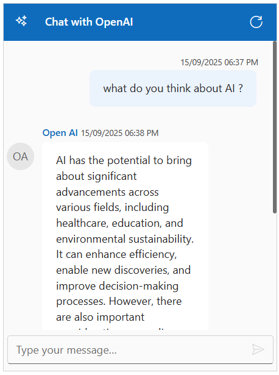

# Integration of Azure OpenAI With Blazor Chat UI component

The Syncfusion Chat UI supports integration with [Azure Open AI](https://microsoft.github.io/PartnerResources/skilling/ai-ml-academy/resources/openai), enabling advanced conversational AI features in your applications.

## Prerequisites

-  An Azure account with access to `Azure Open AI` services and a generated API key.
- Syncfusion Chat UI for Blazor `Syncfusion.Blazor.InteractiveChat` installed in the project

## Getting Started with the Chat UI Component

Before integrating Azure OpenAI, ensure the Syncfusion Chat UI component renders correctly in the application:

[Blazor Getting Started Guide](../getting-started)

## Install Dependencies

Install the Syncfusion Blazor package in the application.

```bash

Nuget\Install-Package Syncfusion.Blazor.InteractiveChat

```

Install the `Open AI` and `Markdig` nuget packages in the application.

```bash

NuGet\Install-Package OpenAI
NuGet\Install-Package Azure.AI.OpenAI
NuGet\Install-Package Azure.Core
Nuget\Install-Package Markdig

```

Note: The sample below uses HttpClient directly and does not require the Azure/OpenAI SDKs.

## Configure Azure Open AI

1. Log in to the [Azure Portal](https://portal.azure.com/#home) and navigate to your Azure Open AI resource.

2. Under Resource Management, select Keys and Endpoint to retrieve your API key and endpoint URL. 

3. Copy the API key, endpoint, and deployment name (e.g., gpt-4o-mini). Ensure the API version (e.g., 2024-07-01-preview) matches your resource configuration.

4. Store these values securely, as they will be used in your application.

> `Security Note`: expose your API key in client-side code for production applications. Use a server-side proxy or environment variables to manage sensitive information securely.

## Integration Azure OpenAI with Chat UI

- Configure your Azure OpenAI endpoint, API key, and deployment name in your **Program.cs** (or using your preferred configuration mechanism).

- Register the service for dependency injection.

- Inject and use the service in your Razor component.




@using Blazor_ChatUI_AI.Components.Services
@using Syncfusion.Blazor.InteractiveChat
@using Syncfusion.Blazor.Navigations
@inject AzureOpenAIService OpenAIService

<div class="chatui-container" style="height: 450px; width:450px;">
    <SfChatUI ID="chatUser" HeaderText="Chat with OpenAI" HeaderIconCss="e-icons e-ai-chat" User="CurrentUserModel" Messages="ChatUserMessages" MessageSend="@MessageSend" TypingUsers="@typingUsers">
        <ChildContent>
            <HeaderToolbar ItemClicked="@ToolbarItemClicked">
                <HeaderToolbarItem Type="ItemType.Spacer"></HeaderToolbarItem>
                <HeaderToolbarItem IconCss="e-icons e-refresh" Tooltip="Clear Chat" />
            </HeaderToolbar>
        </ChildContent>
        <EmptyChatTemplate>
            <div class="emptychat-content">
                <h3><span class="e-icons e-comment-show"></span></h3>
                <div class="emptyChatText" style="font-size: 16px;">Just a second, we're preparing your chat...</div>
            </div>
        </EmptyChatTemplate>
    </SfChatUI>
</div>

@code {
    private static UserModel CurrentUserModel = new UserModel() { ID = "User1", User = "You" };
    private static UserModel OpenAIModel = new UserModel() { ID = "User2", User = "OpenAI" };

    private List<ChatMessage> ChatUserMessages = new List<ChatMessage>();
    private List<UserModel> typingUsers = new();

    private async Task MessageSend(ChatMessageSendEventArgs args)
    {
        typingUsers = new List<UserModel> { OpenAIModel };
        string response = await OpenAIService.GetChatResponseAsync(args.Message.Text);
        ChatUserMessages.Add(new ChatMessage()
        {
            ID = Guid.NewGuid().ToString(),
            Text = response,
            Author = OpenAIModel
        });
        typingUsers.Clear();
    }

    private async Task ToolbarItemClicked()
    {
        ChatUserMessages.Clear();
        StateHasChanged();
    }
}




using System.Net.Http.Json;
using System.Text.Json;
using Markdig;
using System.Text.RegularExpressions;

namespace Blazor_ChatUI_AI.Components.Services
{
    public class AzureOpenAIService
    {
        private readonly HttpClient _httpClient;
        private readonly string _endpoint;
        private readonly string _apiKey;
        private readonly string _deploymentName;

        public AzureOpenAIService(HttpClient httpClient, string endpoint, string apiKey, string deploymentName)
        {
            _httpClient = httpClient;
            _endpoint = endpoint;
            _apiKey = apiKey;
            _deploymentName = deploymentName;
        }

        public async Task<string> GetChatResponseAsync(string prompt)
        {
            var request = new
            {
                messages = new[] { new { role = "user", content = prompt } },
                max_tokens = 500,
            };

            var url = $"{_endpoint}/openai/deployments/{_deploymentName}/chat/completions?api-version=2024-02-15-preview";
            _httpClient.DefaultRequestHeaders.Add("api-key", _apiKey);

            try
            {
                var response = await _httpClient.PostAsJsonAsync(url, request);

                if (response.IsSuccessStatusCode)
                {
                    var responseContent = await response.Content.ReadAsStringAsync();
                    using var jsonDocument = JsonDocument.Parse(responseContent);
                    var choices = jsonDocument.RootElement.GetProperty("choices");

                    if (choices.GetArrayLength() > 0)
                    {
                        var content = choices[0].GetProperty("message").GetProperty("content").GetString();
                        var htmlContent = Markdown.ToHtml(content);
                        htmlContent = Regex.Replace(htmlContent, @"\s+", " ").Trim();
                        return htmlContent; // Return the full response
                    }
                    else
                    {
                        return "Error: No choices returned in the response.";
                    }
                }
                else
                {
                    return $"Error: {await response.Content.ReadAsStringAsync()}";
                }
            }
            catch (Exception ex)
            {
                return $"Error: {ex.Message}";
            }
        }
    }
}




var endpoint = "https://azure-testresource.openai.azure.com";
var apiKey = "<Your API Key>"; // Replace with your API key;
var deploymentName = "gpt-4o-mini";




