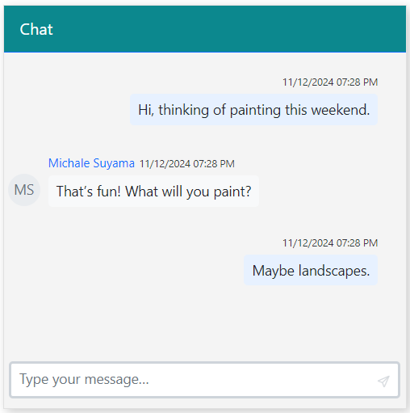

# Appearance in Blazor Chat UI component

This article explains how to customize the appearance of the Blazor Chat UI component using its built-in properties. The following customization options are available:

- Placeholder Text: Update the default input field text to provide clearer guidance or match the application's context.

- Dimensions: Configure the component's height and width to align with the layout and design requirements.

- Custom Styles: Apply custom CSS classes or inline styles to personalize the visual presentation and ensure consistency with the overall UI theme.

These customization features enable developers to deliver a user-friendly chat experience within Blazor applications.

## Setting the placeholder

To define the placeholder text for the message input, use the [Placeholder](https://help.syncfusion.com/cr/blazor/Syncfusion.Blazor.InteractiveChat.SfChatUI.html#Syncfusion_Blazor_InteractiveChat_SfChatUI_Placeholder) property. The default value is `Type your message…`.

The following example demonstrates how to set a custom placeholder.

```cshtml

@using Syncfusion.Blazor.InteractiveChat

<div style="height: 400px; width: 400px;">
    <SfChatUI Placeholder="Start typing..." User="CurrentUserModel" Messages="ChatUserMessages"></SfChatUI>
</div>

@code {
    private static UserModel CurrentUserModel = new UserModel() { ID = "User1", User = "Albert" };
    private static UserModel MichaleUserModel = new UserModel() { ID = "User2", User = "Michale Suyama" };

    private List<ChatMessage> ChatUserMessages = new List<ChatMessage>()
    {
        new ChatMessage() { Text = "Hi, thinking of painting this weekend.", Author = CurrentUserModel },
        new ChatMessage() { Text = "That’s fun! What will you paint?", Author = MichaleUserModel },
        new ChatMessage() { Text = "Maybe landscapes.", Author = CurrentUserModel }
    };
}

```


## Setting the width

To specify the width of the Chat UI component, use the [Width](https://help.syncfusion.com/cr/blazor/Syncfusion.Blazor.InteractiveChat.SfChatUI.html#Syncfusion_Blazor_InteractiveChat_SfChatUI_Width) property. The default value is `100%`.

```cshtml

@using Syncfusion.Blazor.InteractiveChat

<div style="height: 400px;">
    <SfChatUI Width="400px" User="CurrentUserModel" Messages="ChatUserMessages"></SfChatUI>
</div>

@code {
    private static UserModel CurrentUserModel = new UserModel() { ID = "User1", User = "Albert" };
    private static UserModel MichaleUserModel = new UserModel() { ID = "User2", User = "Michale Suyama" };

    private List<ChatMessage> ChatUserMessages = new List<ChatMessage>()
    {
        new ChatMessage() { Text = "Hi, thinking of painting this weekend.", Author = CurrentUserModel },
        new ChatMessage() { Text = "That’s fun! What will you paint?", Author = MichaleUserModel },
        new ChatMessage() { Text = "Maybe landscapes.", Author = CurrentUserModel }
    };
}

```


## Setting the height

To specify the height of the Chat UI component, use the [Height](https://help.syncfusion.com/cr/blazor/Syncfusion.Blazor.InteractiveChat.SfChatUI.html#Syncfusion_Blazor_InteractiveChat_SfChatUI_Height) property. The default value is `100%`.

```cshtml

@using Syncfusion.Blazor.InteractiveChat

<div style="width: 400px;">
    <SfChatUI Height="400px" User="CurrentUserModel" Messages="ChatUserMessages"></SfChatUI>
</div>

@code {
    private static UserModel CurrentUserModel = new UserModel() { ID = "User1", User = "Albert" };
    private static UserModel MichaleUserModel = new UserModel() { ID = "User2", User = "Michale Suyama" };

    private List<ChatMessage> ChatUserMessages = new List<ChatMessage>()
    {
        new ChatMessage() { Text = "Hi, thinking of painting this weekend.", Author = CurrentUserModel },
        new ChatMessage() { Text = "That’s fun! What will you paint?", Author = MichaleUserModel },
        new ChatMessage() { Text = "Maybe landscapes.", Author = CurrentUserModel }
    };
}

```


## Applying a custom CSS class

To apply custom styling to the Chat UI component, use the [CssClass](https://help.syncfusion.com/cr/blazor/Syncfusion.Blazor.InteractiveChat.SfChatUI.html#Syncfusion_Blazor_InteractiveChat_SfChatUI_CssClass) property. This allows you to override default styles and create a unique appearance.

The following example demonstrates how to apply a custom CSS class named `custom-container` to modify the component's background, border, and header.

```cshtml

@using Syncfusion.Blazor.InteractiveChat

<div style="height: 400px; width: 400px;">
    <SfChatUI CssClass="custom-container" User="CurrentUserModel" Messages="ChatUserMessages"></SfChatUI>
</div>

@code {
    private static UserModel CurrentUserModel = new UserModel() { ID = "User1", User = "Albert" };
    private static UserModel MichaleUserModel = new UserModel() { ID = "User2", User = "Michale Suyama" };

    private List<ChatMessage> ChatUserMessages = new List<ChatMessage>()
    {
        new ChatMessage() { Text = "Hi, thinking of painting this weekend.", Author = CurrentUserModel },
        new ChatMessage() { Text = "That’s fun! What will you paint?", Author = MichaleUserModel },
        new ChatMessage() { Text = "Maybe landscapes.", Author = CurrentUserModel }
    };
}

<style>
    .custom-container {
        border-color: #e0e0e0;
        background-color: #f4f4f4;
        box-shadow: 3px 3px 10px 0px rgba(0, 0, 0, 0.2);
    }

    .custom-container .e-chat-header {
        background: #0c888e;
    }

    .custom-container .e-footer .e-input-group {
        border: 3px solid #bde0e2;
    }
</style>

```


