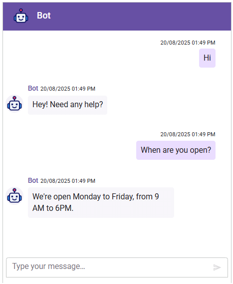

# Integrate Google Dialogflow with Blazor Chat UI component

The Chat UI component integrates with [Google Dialogflow](https://cloud.google.com/dialogflow/docs) to enable advanced conversational AI features in your Blazor applications. The component acts as a user interface for a support bot, where user prompts are sent to the Dialogflow service via API calls, providing natural language understanding and context-aware responses.

## Prerequisites

Before starting, ensure you have the following:

* **Google Account**: To access [Google Dialogflow](https://cloud.google.com/dialogflow/docs) and [Google Cloud Console](https://console.cloud.google.com/).

* **Syncfusion Chat UI**: Package [Syncfusion Blazor package](https://www.nuget.org/packages/Syncfusion.Blazor.InteractiveChat) installed.

* Dialogflow Service Account with the `Dialogflow API Client` role and its JSON key file.

## Set Up the Chat UI component

Follow the Syncfusion Chat UI Getting Started guide to configure and render the Chat UI component in the application and that prerequisites are met.

## Install Dependencies

* Install backend dependencies for Dialogflow and server setup using NuGet:

```bash

dotnet add package Google.Cloud.Dialogflow.V2
dotnet add package Newtonsoft.Json

```

## Set Up the Dialogflow Agent

1. In the Dialogflow Console, create an agent, set a name (e.g., MyChatBot), and configure the default language (e.g., English - en).

2. Add intents with training phrases and responses (e.g., greetings, FAQs). Test using the Dialogflow simulator.

3. In the Google Cloud Console, go to APIs & Services > Credentials, create a service account with the Dialogflow API Client role, and download the JSON key file.

> `Security Note`: Never commit the JSON key file to version component. Use environment variables or a secret manager (e.g., Google Cloud Secret Manager) for production.

## Configure Backend API

In a Blazor application, create a minimal API endpoint to handle Dialogflow requests. Add the following to `Program.cs`:




using Google.Cloud.Dialogflow.V2;
using Google.Apis.Auth.OAuth2;
using Syncfusion.Blazor;

var builder = WebApplication.CreateBuilder(args);

// Add services...
builder.Services.AddRazorPages();
builder.Services.AddServerSideBlazor();

var app = builder.Build();

// Configure the HTTP request pipeline...
app.MapRazorPages();
app.MapBlazorHub();
app.MapFallbackToPage("/_Host");

// Minimal API for Dialogflow requests
app.MapPost("/api/chat/message", async ([FromBody] MessageRequest request) =>
{
    var credential = GoogleCredential.FromFile("service-acct.json");
    var sessionsClient = SessionsClient.Create(credential.ToChannelCredentials());
    var projectId = builder.Configuration["DialogflowProjectId"]; // Add to appsettings.json or extract from JSON

    var sessionId = request.SessionId ?? "default-session";
    var session = SessionName.FromProjectSession(projectId, sessionId);
    var queryInput = new QueryInput
    {
        Text = new TextInput
        {
            Text = request.Text,
            LanguageCode = "en-US"
        }
    };

    try
    {
        var response = await sessionsClient.DetectIntentAsync(new DetectIntentRequest { Session = session.ToString(), QueryInput = queryInput });
        var reply = response.QueryResult.FulfillmentText;
        return Results.Ok(new { reply });
    }
    catch (Exception ex)
    {
        return Results.Problem("Error connecting to Dialogflow.", ex, statusCode: 500);
    }
});

app.Run();

public class MessageRequest
{
    public string Text { get; set; } = string.Empty;
    public string SessionId { get; set; } = string.Empty;
}




Add the project ID to `appsettings.json` (extract from the JSON key file if needed):

```bash

{
  "DialogflowProjectId": "your-dialogflow-project-id"
}

```

> Use a unique `sessionId` (e.g., Guid) for each user to maintain conversation context.

## Configure Message Send

Use the `MessageSend` event of the `SfChatUI` component to handle message exchanges. Each time a user sends a message, this event will be invoked with details of the sent message.

### Forward Message to Backend

In the `MessageSend` event handler, send a POST request to your backend API endpoint (`/api/chat/message`). The backend forwards the message to Dialogflow and returns the response.

### Displaying Bot Response

* Use the `AddMessageAsync` method (via a reference to the component) to programmatically add the bot's reply to the Chat UI.

* Create or modify a Razor component (`e.g., Pages/Chat.razor`) to integrate the Syncfusion Chat UI with the Dialogflow backend:




@using Syncfusion.Blazor.InteractiveChat
@using System.Net.Http.Json

<div style="height: 400px; width: 400px;">
    <SfChatUI @ref="ChatUI" HeaderText="Bot" HeaderIconCss="e-header-icon" User="CurrentUserModel" MessageSend="OnMessageSend">
    </SfChatUI>
</div>

<style>
    .e-header-icon {
        background-image: url('https://ej2.syncfusion.com/demos/src/chat-ui/images/bot.png');
        background-size: cover;
    }
</style>

@code {
    private SfChatUI ChatUI { get; set; } = default!;
    private UserModel CurrentUserModel = new() { ID = "user1", User = "Albert" };
    private UserModel BotUserModel = new() { ID = "user2", User = "Bot", AvatarUrl = "https://ej2.syncfusion.com/demos/src/chat-ui/images/bot.png" };
    private string currentUserId = "user1";
    private readonly HttpClient httpClient = new();

    private async Task OnMessageSend(MessageSendEventArgs args)
    {
        // The user message will be added automatically after this event
        // Send to backend
        var request = new { text = args.Message.Text, sessionId = currentUserId };
        try
        {
            var response = await httpClient.PostAsJsonAsync("/api/chat/message", request);
            if (response.IsSuccessStatusCode)
            {
                var data = await response.Content.ReadFromJsonAsync<dynamic>();
                // Add bot's reply
                await ChatUI.AddMessageAsync(new ChatMessage { Text = data.reply.ToString(), Author = BotUserModel });
            }
            else
            {
                await ChatUI.AddMessageAsync(new ChatMessage { Text = "Sorry, I couldn't contact the server.", Author = BotUserModel });
            }
        }
        catch (Exception)
        {
            await ChatUI.AddMessageAsync(new ChatMessage { Text = "Sorry, I couldn't contact the server.", Author = BotUserModel });
        }
        args.Cancel = true; // Prevent default send if needed, but user message is already added
    }
}




> Ensure Syncfusion scripts and styles are included in `_Host.cshtml` (Blazor Server) or `index.html` (Blazor WebAssembly) as per the getting started guide.

## Run and Test

### Start the Application

* Run the project using `dotnet run` or Visual Studio. 
* Open your app in the browser (e.g., `http://localhost:port`) to chat with your dialogflow-powered bot.



## Troubleshooting:

* `Permission Denied`: Ensure the service account has the `Dialogflow API Client` role in the Google Cloud Console.
* `CORS Error`: If using separate origins, configure CORS in Web.config (e.g., add custom headers under <system.webServer>).
* `No Response`: Test intents in the Dialogflow Console simulator to ensure they are configured correctly.
* `Quota Exceeded`: Check Dialogflow API quotas in the Google Cloud Console.
* `Network Issues`: Confirm the application is running and the frontend is pointing to the correct API URL.
* `Invalid Credentials`: Verify the service account JSON or configuration settings are correctly set up.