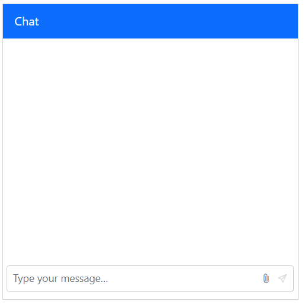
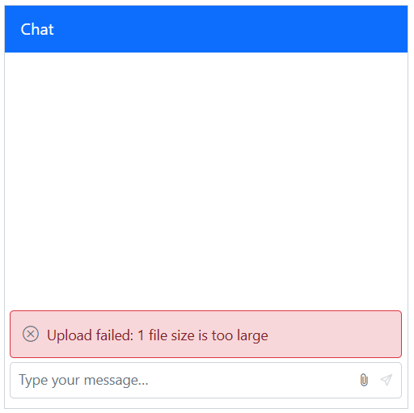
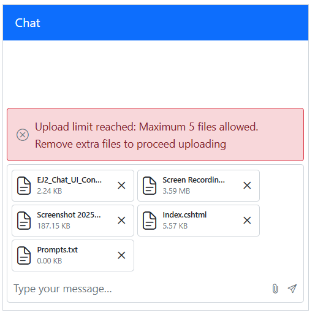
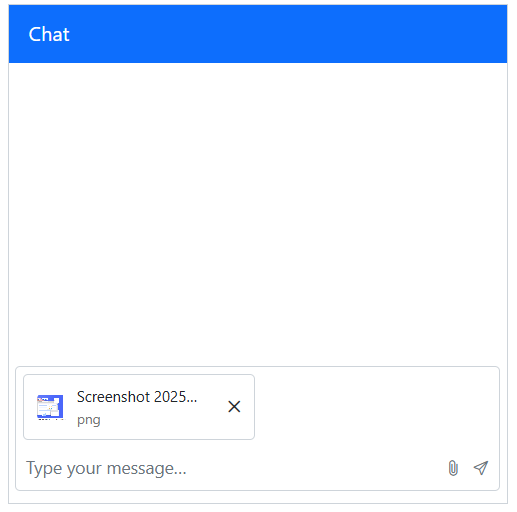
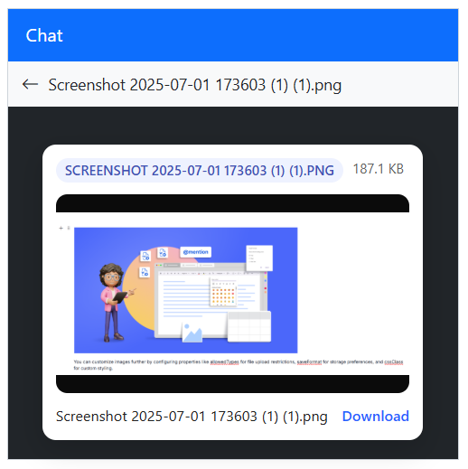

# File Attachments in Blazor Chat UI component

The `Attachment` support in Chat UI enables the users to upload and send files (images, documents, and more) alongside messages for richer, more contextual conversations. This enhances the interaction by allowing users to provide additional context through files.

You can use the [ChatUIAttachment](https://help.syncfusion.com/cr/blazor/Syncfusion.Blazor.InteractiveChat.ChatUIAttachment.html) tag directive to configure the attachments in the Chat UI.

## Enable file attachments

Enable file attachment support by setting the [Enable](https://help.syncfusion.com/cr/blazor/Syncfusion.Blazor.InteractiveChat.ChatUIAttachment.html#Syncfusion_Blazor_InteractiveChat_ChatUIAttachment_Enable) property to `true`. By default, it is `false`.

```cshtml

@using Syncfusion.Blazor.InteractiveChat

<div style="height: 400px; width: 400px;">
    <SfChatUI>
        <ChatUIAttachment Enable>
        </ChatUIAttachment>
    </SfChatUI>
</div>

```



### Setting saveUrl and removeUrl

Set the [SaveUrl](https://help.syncfusion.com/cr/blazor/Syncfusion.Blazor.InteractiveChat.ChatUIAttachment.html#Syncfusion_Blazor_InteractiveChat_ChatUIAttachment_SaveUrl) and [RemoveUrl](https://help.syncfusion.com/cr/blazor/Syncfusion.Blazor.InteractiveChat.ChatUIAttachment.html#Syncfusion_Blazor_InteractiveChat_ChatUIAttachment_RemoveUrl) properties to specify server endpoints for handling file uploads and removals. The [SaveUrl](https://help.syncfusion.com/cr/blazor/Syncfusion.Blazor.InteractiveChat.ChatUIAttachment.html#Syncfusion_Blazor_InteractiveChat_ChatUIAttachment_SaveUrl) processes file uploads, while the [RemoveUrl](https://help.syncfusion.com/cr/blazor/Syncfusion.Blazor.InteractiveChat.ChatUIAttachment.html#Syncfusion_Blazor_InteractiveChat_ChatUIAttachment_RemoveUrl) handles file deletion requests.

```cshtml

@using Syncfusion.Blazor.InteractiveChat

<div style="height: 400px; width: 400px;">
    <SfChatUI>
        <ChatUIAttachment Enable SaveUrl="@SaveUrl" RemoveUrl="@RemoveUrl">
        </ChatUIAttachment>
    </SfChatUI>
</div>

@code {

    private string SaveUrl = "https://blazor.syncfusion.com/services/production/api/FileUploader/Save";
    private string RemoveUrl = "https://blazor.syncfusion.com/services/production/api/FileUploader/Remove";
}

```

## Setting file type

You can use the [AllowedFileTypes](https://help.syncfusion.com/cr/blazor/Syncfusion.Blazor.InteractiveChat.ChatUIAttachment.html#Syncfusion_Blazor_InteractiveChat_ChatUIAttachment_AllowedFileTypes) property to specify which file types users can upload. This property accepts file extensions (e.g., '.pdf', '.docx') or MIME types to control the types of files that can be attached.

```cshtml

@using Syncfusion.Blazor.InteractiveChat

<div style="height: 400px; width: 400px;">
    <SfChatUI>
        <ChatUIAttachment Enable AllowedFileTypes=".pdf" SaveUrl="@SaveUrl" RemoveUrl="@RemoveUrl">
        </ChatUIAttachment>
    </SfChatUI>
</div>

@code {

    private string SaveUrl = "https://blazor.syncfusion.com/services/production/api/FileUploader/Save";
    private string RemoveUrl = "https://blazor.syncfusion.com/services/production/api/FileUploader/Remove";
}

```

## Setting file size

Configure the [MaxFileSize](https://help.syncfusion.com/cr/blazor/Syncfusion.Blazor.InteractiveChat.ChatUIAttachment.html#Syncfusion_Blazor_InteractiveChat_ChatUIAttachment_MaxFileSize) property to define the maximum file size allowed for uploads. Specify the size in bytes. The default value is `30000000` bytes (approximately 30 MB). Files exceeding this limit will not be uploaded.

```cshtml

@using Syncfusion.Blazor.InteractiveChat

<div style="height: 400px; width: 400px;">
    <SfChatUI>
        <ChatUIAttachment Enable MaxFileSize="4000000" SaveUrl="@SaveUrl" RemoveUrl="@RemoveUrl">
        </ChatUIAttachment>
    </SfChatUI>
</div>

@code {

    private string SaveUrl = "https://blazor.syncfusion.com/services/production/api/FileUploader/Save";
    private string RemoveUrl = "https://blazor.syncfusion.com/services/production/api/FileUploader/Remove";
}

```



## Setting save format

Control the format used to send files to the server using the [SaveFormat](https://help.syncfusion.com/cr/blazor/Syncfusion.Blazor.InteractiveChat.ChatUIAttachment.html#Syncfusion_Blazor_InteractiveChat_ChatUIAttachment_SaveFormat) property when path is not set. It does not change how files are uploaded. The default value is `Blob`.

 - `Blob`: Used for fast, memory‑efficient local previews.
 - `Base64`: Reads the file as a Base64 data URL, useful when you need an inline data URL.

 ```cshtml

@using Syncfusion.Blazor.InteractiveChat

<div style="height: 400px; width: 400px;">
    <SfChatUI>
        <ChatUIAttachment Enable SaveFormat="SaveFormat.Base64" SaveUrl="@SaveUrl" RemoveUrl="@RemoveUrl">
        </ChatUIAttachment>
    </SfChatUI>
</div>

@code {

    private string SaveUrl = "https://blazor.syncfusion.com/services/production/api/FileUploader/Save";
    private string RemoveUrl = "https://blazor.syncfusion.com/services/production/api/FileUploader/Remove";
}

```

 ## Setting server path

The [Path](https://help.syncfusion.com/cr/blazor/Syncfusion.Blazor.InteractiveChat.ChatUIAttachment.html#Syncfusion_Blazor_InteractiveChat_ChatUIAttachment_Path) property specifies the public base URL where uploaded files are (or will be) hosted. When this property is set, it takes precedence over the value defined in [SaveFormat](https://help.syncfusion.com/cr/blazor/Syncfusion.Blazor.InteractiveChat.ChatUIAttachment.html#Syncfusion_Blazor_InteractiveChat_ChatUIAttachment_SaveFormat). This means that even if saveFormat includes a different location or structure for storing files, the path property will be used it for generating the file URL.

```cshtml

@using Syncfusion.Blazor.InteractiveChat

<div style="height: 400px; width: 400px;">
    <SfChatUI>
        <ChatUIAttachment Enable Path="D:/CustomPathLocation" SaveUrl="@SaveUrl" RemoveUrl="@RemoveUrl">
        </ChatUIAttachment>
    </SfChatUI>
</div>

@code {

    private string SaveUrl = "https://blazor.syncfusion.com/services/production/api/FileUploader/Save";
    private string RemoveUrl = "https://blazor.syncfusion.com/services/production/api/FileUploader/Remove";
}

```

## Enabling drag-and-drop

Toggle drag-and-drop support for attachments via [AllowDragAndDrop](https://help.syncfusion.com/cr/blazor/Syncfusion.Blazor.InteractiveChat.ChatUIAttachment.html#Syncfusion_Blazor_InteractiveChat_ChatUIAttachment_AllowDragAndDrop) property. The default value is `true`.

```cshtml

@using Syncfusion.Blazor.InteractiveChat

<div style="height: 400px; width: 400px;">
    <SfChatUI>
        <ChatUIAttachment Enable AllowDragAndDrop="false" SaveUrl="@SaveUrl" RemoveUrl="@RemoveUrl">
        </ChatUIAttachment>
    </SfChatUI>
</div>

@code {

    private string SaveUrl = "https://blazor.syncfusion.com/services/production/api/FileUploader/Save";
    private string RemoveUrl = "https://blazor.syncfusion.com/services/production/api/FileUploader/Remove";
}

```

## Setting maximum count

Restrict how many files can be attached at once using [MaximumCount](https://help.syncfusion.com/cr/blazor/Syncfusion.Blazor.InteractiveChat.ChatUIAttachment.html#Syncfusion_Blazor_InteractiveChat_ChatUIAttachment_MaximumCount) property. The default value is `10`. If users select more than the allowed count, the maximum count reached error will be displayed.

```cshtml

@using Syncfusion.Blazor.InteractiveChat

<div style="height: 400px; width: 400px;">
    <SfChatUI>
        <ChatUIAttachment Enable MaximumCount="5" SaveUrl="@SaveUrl" RemoveUrl="@RemoveUrl">
        </ChatUIAttachment>
    </SfChatUI>
</div>

@code {

    private string SaveUrl = "https://blazor.syncfusion.com/services/production/api/FileUploader/Save";
    private string RemoveUrl = "https://blazor.syncfusion.com/services/production/api/FileUploader/Remove";
}

```



## Templates

### Customizing the file preview

Provide a custom UI for previewing selected files using [PreviewTemplate](https://help.syncfusion.com/cr/blazor/Syncfusion.Blazor.InteractiveChat.SfChatUI.html#Syncfusion_Blazor_InteractiveChat_SfChatUI_PreviewTemplate) tag directive under `SfChatUI` component tag. Use this to render thumbnails, filenames, progress, remove buttons, or any additional metadata prior to sending.

### Customizing the attachments

Control how attachments appear inside message bubbles with [AttachmentTemplate](https://help.syncfusion.com/cr/blazor/Syncfusion.Blazor.InteractiveChat.ChatUIAttachment.html#Syncfusion_Blazor_InteractiveChat_ChatUIAttachment_AttachmentTemplate) tag directive under [ChatUIAttachment](https://help.syncfusion.com/cr/blazor/Syncfusion.Blazor.InteractiveChat.ChatUIAttachment.html)  tag directive. Use this to tailor the display of images, documents, or custom file types once the message is posted.

```cshtml

@using Syncfusion.Blazor.InteractiveChat

<div style="height: 400px; width: 400px;">
    <SfChatUI CssClass="chat-attachment-template">
        <ChildContent>
            <ChatUIAttachment Enable SaveUrl="@SaveUrl" RemoveUrl="@RemoveUrl">
                <AttachmentTemplate>
                    @{
                        var file = context.SelectedFile;
                        var isImage = !!(file != null && file.RawFile != null && file.MimeContentType.StartsWith("image/"));
                        var isVideo = !!(file != null && file.RawFile != null && file.MimeContentType.StartsWith("video/"));
                    }
                    <div class="c-attach">
                        <div class="c-attach-thumb">
                            @if(isImage)
                            {
                                
                            }
                            else if(isVideo)
                            {
                                <span class="e-icons e-video"></span>
                            }
                            else
                            {
                                <span class="e-icons e-chat-file-icon"></span>
                            }
                        </div>
                        <div class="c-attach-body">
                            <div class="c-attach-name" title=@file?.Name>@file?.Name</div>
                            <div class="c-attach-meta">@(file?.Type)</div>
                        </div>
                    </div>
                </AttachmentTemplate>
            </ChatUIAttachment>
        </ChildContent>
        <PreviewTemplate>
            @{
                var file = context.SelectedFile;
                var type = file?.MimeContentType.ToLower();
                var isImage = type.StartsWith("image/");
                var isVideo = type.StartsWith("video/");
                var sizeBytes = file?.Size;
                var humanSize = sizeBytes < 1024 ? $"{sizeBytes}B" : sizeBytes < 1024 * 1024 ? $"{(sizeBytes / 1024):F1} KB" : $"{(sizeBytes / (1024 * 1024)):F1} MB";
                var ext = file?.Name.ToUpper();
            }
            <div class="c-preview--card">
                <div class="c-preview-card">
                    <div class="c-badge-row">
                        <span class="c-badge">@ext</span>
                        <span>@humanSize</span>
                    </div>

                    <div class="c-media-frame">
                        @if (isImage)
                        {
                            
                        }
                        else if (isVideo)
                        {
                            <video class="c-media-video"
                                   controls
                                   disablePictureInPicture
                                   playsInline
                                   preload="metadata"
                                   title=@file.Name>
                                <source src=@file.FileSource type=@type />
                            </video>                            
                        }
                        else
                        {
                            <div>No media content to display</div>
                        }
                    </div>
                    <div class="c-caption">
                        <span class="c-name" title=@file.Name>@file.Name</span>
                        <a class="c-btn-link"
                           href=@file.FileSource
                           target="_blank"
                           rel="noopener noreferrer"
                           download=@file.Name>
                            Download
                        </a>
                    </div>
                </div>
            </div>
        </PreviewTemplate>
    </SfChatUI>
</div>

@code {

    private string SaveUrl = "https://blazor.syncfusion.com/services/production/api/FileUploader/Save";
    private string RemoveUrl = "https://blazor.syncfusion.com/services/production/api/FileUploader/Remove";
}

<style>

    /* Attachment template styles */
    .chat-attachment-template .c-attach {
        display: flex;
        align-items: center;
        gap: 8px;
        padding: 8px 10px;
        border-radius: 8px;
    }

    .chat-attachment-template .c-attach-thumb {
        width: 24px;
        height: 24px;
        border-radius: 6px;
        overflow: hidden;
    }

    .chat-attachment-template .c-attach-name {
        width: 100px;
        text-overflow: ellipsis;
        overflow: hidden;
        white-space: nowrap;
    }

    .chat-attachment-template .c-attach-img {
        width: 100%;
        height: 100%;
        object-fit: cover;
    }

    .chat-attachment-template .c-attach-meta {
        font-size: 11px;
        color: #757575;
    }

    .chat-attachment-template .e-footer .e-chat-drop-area .e-chat-uploaded-file-item {
        width: auto;
        max-width: fit-content;
    }

    /* Preview template styles*/

    /* Center a compact white card inside the dark preview overlay */
    .chat-attachment-template .c-preview--card {
        display: grid;
        place-items: center;
        width: 100%;
        height: 100%;
        padding: 12px;
        box-sizing: border-box;
    }

    .chat-attachment-template .c-preview-card {
        background: #fff;
        border-radius: 12px;
        box-shadow: 0 8px 24px rgba(0,0,0,0.16);
        padding: 12px;
        display: grid;
        gap: 10px;
    }

    /* Small info row (type + size) */
    .chat-attachment-template .c-badge-row {
        display: flex;
        gap: 8px;
        font-size: 12px;
        color: #616161;
    }

    .chat-attachment-template .c-badge {
        padding: 2px 8px;
        border-radius: 999px;
        background: #eef2ff;
        color: #3f51b5;
        font-weight: 600;
    }

    /* Media area with tidy aspect */
    .chat-attachment-template .c-media-frame {
        background: #0b0b0b;
        border-radius: 10px;
        overflow: hidden;
        aspect-ratio: 16/9;
        display: grid;
        place-items: center;
        font-size: large;
        font-weight: 900;
        color: azure;
    }

    .chat-attachment-template .c-media-img, .c-media-video {
        width: 100%;
        height: 100%;
        object-fit: contain;
    }

    /* Caption with ellipsis and a small action */
    .chat-attachment-template .c-caption {
        display: flex;
        align-items: center;
        justify-content: space-between;
        gap: 12px;
    }

    .chat-attachment-template .c-name {
        min-width: 0;
        flex: 1 1 auto;
        white-space: nowrap;
        overflow: hidden;
        text-overflow: ellipsis;
        font-size: 13px;
        color: #212121;
    }

    .chat-attachment-template .c-btn-link {
        font-size: 13px;
        color: #2962ff;
        text-decoration: none;
        font-weight: 600;
    }

    .chat-attachment-template .e-preview-template {
        position: absolute;
        bottom: 5px;
        width: min-content;
    }

</style>

```




