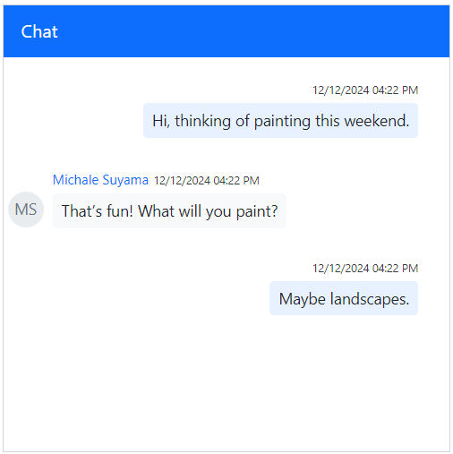

# Footer in the Blazor Chat Component

The Blazor Chat component includes a footer that serves as the primary user interaction area, typically containing the message input field and send button.

## Show or hide the footer

The chat footer is visible by default. You can control its visibility using the [ShowFooter](https://help.syncfusion.com/cr/blazor/Syncfusion.Blazor.InteractiveChat.SfChatUI.html#Syncfusion_Blazor_InteractiveChat_SfChatUI_ShowFooter) boolean property. Setting this property to `false` will hide the entire footer, including the text input and send button.

```cshtml

@using Syncfusion.Blazor.InteractiveChat

<div style="height: 400px; width: 400px;">
    <SfChatUI ShowFooter="false" User="CurrentUserModel" Messages="ChatUserMessages"></SfChatUI>
</div>

@code {
    private static UserModel CurrentUserModel = new UserModel() { ID = "User1", User = "Albert" };
    private static UserModel MichaleUserModel = new UserModel() { ID = "User2", User = "Michale Suyama" };

    private List<ChatMessage> ChatUserMessages = new List<ChatMessage>()
    {
        new ChatMessage() { Text = "Hi, thinking of painting this weekend.", Author = CurrentUserModel },
        new ChatMessage() { Text = "That’s fun! What will you paint?", Author = MichaleUserModel },
        new ChatMessage() { Text = "Maybe landscapes.", Author = CurrentUserModel }
    };
}

```



## Footer template 

> Refer to the [Templates](./templates#footer-template) section for more details about the Footer template.
