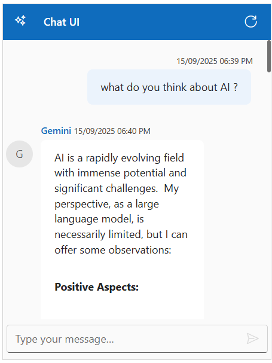

# Integration of Gemini AI With Blazor Chat UI Component

The Syncfusion  Chat UI supports integration with [Gemini](Gemini API quickstart  |  Google AI for Developers), enabling advanced conversational AI features in your applications.

## Getting Started with the Chat UI Component

Before integrating Gemini AI, ensure that the Syncfusion Chat UI is correctly rendered in your application:

[ Blazor Getting Started Guide](../getting-started)

## Prerequisites

* Google account to generate API key on accessing `Gemini AI`
* Syncfusion Chat UI for Blazor `Syncfusion.Blazor.InteractiveChat` installed in your project.  

## Install Syncfusion<sup style="font-size:70%">&reg;</sup> Blazor InteractiveChat and Themes NuGet in the App

* Press <kbd>Ctrl</kbd>+<kbd>`</kbd> to open the integrated terminal in Visual Studio Code.
* Ensure you’re in the project root directory where your `.csproj` file is located.
* Run the following command to install a [Syncfusion.Blazor.InteractiveChat](https://www.nuget.org/packages/Syncfusion.Blazor.InteractiveChat) and [Syncfusion.Blazor.Themes](https://www.nuget.org/packages/Syncfusion.Blazor.Themes/) NuGet package and ensure all dependencies are installed.





dotnet add package Syncfusion.Blazor.InteractiveChat -v {{ site.releaseversion }}
dotnet add package Syncfusion.Blazor.Themes -v {{ site.releaseversion }}
dotnet restore





N> Syncfusion<sup style="font-size:70%">&reg;</sup> Blazor components are available in [nuget.org](https://www.nuget.org/packages?q=syncfusion.blazor). Refer to [NuGet packages](https://blazor.syncfusion.com/documentation/nuget-packages) topic for available NuGet packages list with component details.





## Generate API Key

1. Go to [Google AI Studio](https://aistudio.google.com/app/apikey) and sign in with your Google account. If you don’t have one, create a new account.

2. Once logged in, click on `Get API Key` from the left-hand menu or the top-right corner of the dashboard.

3. Click the `Create API Key` button. You’ll be prompted to either select an existing Google Cloud project or create a new one. Choose the appropriate option and proceed. 

4. After selecting or creating a project, your API key will be generated and displayed. Copy the key and store it securely, as it will only be shown once.

> `Security Note`: Never commit the API key to version control. Use environment variables or a secret manager for production.

##  Integration Gemini AI with Chat UI

> Add your generated `API Key` at the line 

```bash

const string GeminiApiKey = 'Place your API key here'; 

```




<div style="height: 400px; width: 400px;">
    <SfChatUI ID="chatUI" User="currentUser" HeaderText="Chat UI" HeaderIconCss="e-icons e-ai-chat" Messages="@Messages" MessageSend="OnMessageSend" TypingUsers="@typingUsers">
        <ChildContent>
            <HeaderToolbar ItemClicked="@ToolbarItemClicked">
                <HeaderToolbarItem Type="ItemType.Spacer"></HeaderToolbarItem>
                <HeaderToolbarItem IconCss="e-icons e-refresh" Tooltip="Clear Chat" />
            </HeaderToolbar>
        </ChildContent>
        <EmptyChatTemplate>
            <div class="emptychat-content">
                <h3><span class="e-icons e-comment-show"></span></h3>
                <div class="emptyChatText" style="font-size: 16px;">Just a second, we're preparing your chat...</div>
            </div>
        </EmptyChatTemplate>
    </SfChatUI>
</div>

@code {
    private UserModel currentUser = new() { ID = "user1", User = "You" };
    private UserModel aiUser = new() { ID = "ai", User = "Gemini" };
    private List<ChatMessage> Messages { get; set; } = new();
    private List<UserModel> typingUsers = new();

    private async Task OnMessageSend(ChatMessageSendEventArgs args)
    {
        typingUsers = new List<UserModel> { aiUser };
        StateHasChanged();

        try
        {
            await Task.Delay(500);
            var userPrompt = args.Message.Text ?? "hi";

            const string GeminiApiKey = "";
            var url = $"https://generativelanguage.googleapis.com/v1beta/models/gemini-1.5-flash:generateContent?key={GeminiApiKey}";
            var requestBody = new
            {
                contents = new[] { new { parts = new[] { new { text = userPrompt } } } }
            };
            var json = JsonSerializer.Serialize(requestBody);
            var httpContent = new StringContent(json, Encoding.UTF8, "application/json");
            var response = await HttpClient.PostAsync(url, httpContent);
            response.EnsureSuccessStatusCode();
            var resultJson = await response.Content.ReadAsStringAsync();
            using var jsonDoc = JsonDocument.Parse(resultJson);
            var responseText = jsonDoc.RootElement
                .GetProperty("candidates")[0]
                .GetProperty("content")
                .GetProperty("parts")[0]
                .GetProperty("text")
                .GetString();
            var pipeline = new MarkdownPipelineBuilder()
                .UseAdvancedExtensions() // Includes tables, lists, etc.
                .UsePipeTables()         // Explicitly handle pipe tables
                .UseTaskLists()          // Enable checkbox-style task lists
                .Build();
            Messages.Add(new ChatMessage { Text = Markdown.ToHtml(responseText,pipeline), Author = aiUser });
        }
        catch (Exception ex)
        {
            Console.WriteLine($"Error fetching Gemini response: {ex.Message}");
            Messages.Add(new ChatMessage { Text = "Error generating response. Please try again.", Author = aiUser });
            StateHasChanged();
        }
        finally
        {
            typingUsers.Clear();
            StateHasChanged();
        }
    }

    private void ToolbarItemClicked(ChatToolbarItemClickedEventArgs args)
    {
        Messages.Clear();
        StateHasChanged();
    }
}




