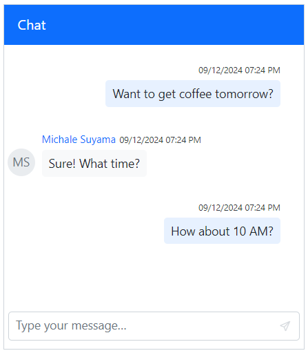

# Getting Started with Blazor Chat UI in a Blazor Web App

This section explains how to add the [Blazor Chat UI](https://www.syncfusion.com/blazor-components/blazor-chat-ui) component to your Blazor Web App using [Visual Studio](https://visualstudio.microsoft.com/vs/) or Visual Studio Code.

To get started quickly with the Blazor Chat UI component, refer to the following video guide:







## Prerequisites

* [System requirements for Blazor components](https://blazor.syncfusion.com/documentation/system-requirements)

## Create a New Blazor Web App in Visual Studio

A **Blazor Web App** can be created using Visual Studio 2022 with either the official [Microsoft Templates](https://learn.microsoft.com/en-us/aspnet/core/blazor/tooling?view=aspnetcore-8.0&pivots=vs) or the [Syncfusion<sup style="font-size:70%">&reg;</sup> Blazor Extension](https://blazor.syncfusion.com/documentation/visual-studio-integration/template-studio).

Ensure you configure the appropriate [Interactive render mode](https://learn.microsoft.com/en-us/aspnet/core/blazor/components/render-modes?view=aspnetcore-8.0#render-modes) and [Interactivity location](https://learn.microsoft.com/en-us/aspnet/core/blazor/tooling?view=aspnetcore-8.0&pivots=vs) when creating the Blazor Web Application.

## Install Syncfusion<sup style="font-size:70%">&reg;</sup> Blazor InteractiveChat and Themes NuGet in the App

To add the **Blazor Chat UI** component to your app, open the NuGet package manager in Visual Studio (*Tools → NuGet Package Manager → Manage NuGet Packages for Solution*), then search for and install `Syncfusion.Blazor.InteractiveChat` and [Syncfusion.Blazor.Themes](https://www.nuget.org/packages/Syncfusion.Blazor.Themes/).

If you utilize `WebAssembly or Auto` render modes in the Blazor Web App need to be install Syncfusion<sup style="font-size:70%">&reg;</sup> Blazor components NuGet packages within the client project.

Alternatively, the required packages can be installed using the Package Manager Console commands.




Install-Package Syncfusion.Blazor.InteractiveChat -Version {{ site.releaseversion }}
Install-Package Syncfusion.Blazor.Themes -Version {{ site.releaseversion }}




N> Syncfusion<sup style="font-size:70%">&reg;</sup> Blazor components are available at [nuget.org](https://www.nuget.org/packages?q=syncfusion.blazor). Refer to the [NuGet packages](https://blazor.syncfusion.com/documentation/nuget-packages) documentation for a complete list of available packages.





## Prerequisites

* [System requirements for Blazor components](https://blazor.syncfusion.com/documentation/system-requirements)

## Create a New Blazor Web App in Visual Studio Code

A **Blazor Web App** can be created using Visual Studio code with either the official [Microsoft Templates](https://learn.microsoft.com/en-us/aspnet/core/blazor/tooling?view=aspnetcore-8.0&pivots=vsc) or the [Syncfusion<sup style="font-size:70%">&reg;</sup> Blazor Extension](https://blazor.syncfusion.com/documentation/visual-studio-code-integration/create-project).

To ensure proper functionality of a Blazor Web App, configure the appropriate [Interactive render mode](https://learn.microsoft.com/en-us/aspnet/core/blazor/components/render-modes?view=aspnetcore-8.0#render-modes) and [Interactivity location](https://learn.microsoft.com/en-us/aspnet/core/blazor/tooling?view=aspnetcore-8.0&pivots=vsc) during application setup.

For example, to create a Blazor Web App with `Auto` interactive render mode, use the following commands:




dotnet new blazor -o BlazorWebApp -int Auto
cd BlazorWebApp
cd BlazorWebApp.Client




N> For more information on creating a **Blazor Web App** with various interactive modes and locations, refer to this [link](https://blazor.syncfusion.com/documentation/getting-started/blazor-web-app?tabcontent=visual-studio-code#render-interactive-modes).

## Install Syncfusion<sup style="font-size:70%">&reg;</sup> Blazor InteractiveChat and Themes NuGet in the App

If you utilize `WebAssembly` or `Auto` render modes in the Blazor Web App need to be install Syncfusion<sup style="font-size:70%">&reg;</sup> Blazor components NuGet packages within the client project.

* Press <kbd>Ctrl</kbd>+<kbd>`</kbd> to open the integrated terminal in Visual Studio Code.
* Ensure you’re in the project root directory where your `.csproj` file is located.
* Run the following command to install a [Syncfusion.Blazor.InteractiveChat](https://www.nuget.org/packages/Syncfusion.Blazor.InteractiveChat) and [Syncfusion.Blazor.Themes](https://www.nuget.org/packages/Syncfusion.Blazor.Themes/) NuGet package and ensure all dependencies are installed.





dotnet add package Syncfusion.Blazor.InteractiveChat -v {{ site.releaseversion }}
dotnet add package Syncfusion.Blazor.Themes -v {{ site.releaseversion }}
dotnet restore





N> Syncfusion<sup style="font-size:70%">&reg;</sup> Blazor components are available at [nuget.org](https://www.nuget.org/packages?q=syncfusion.blazor). Refer to the [NuGet packages](https://blazor.syncfusion.com/documentation/nuget-packages) documentation for a complete list of available packages.





## Register Syncfusion<sup style="font-size:70%">&reg;</sup> Blazor Service

First, import the `Syncfusion.Blazor` and `Syncfusion.Blazor.InteractiveChat` namespace.

*   **WebAssembly or Auto Mode**: Open the `~/_Imports.razor` file from the `.Client` project.
*   **Server Mode**: Open the `~/_Imports.razor` file located in the main project's `Components` folder.




@using Syncfusion.Blazor
@using Syncfusion.Blazor.InteractiveChat




Next, register the Syncfusion<sup style="font-size:70%">&reg;</sup> Blazor service in your **~/Program.cs** file.

If the **Interactive Render Mode** is set to `WebAssembly` or `Auto`, the Syncfusion<sup style="font-size:70%">&reg;</sup> Blazor service must be registered in both **~/Program.cs** files of the Blazor Web App.




...
...
using Syncfusion.Blazor;

var builder = WebApplication.CreateBuilder(args);

// Add services to the container.
builder.Services.AddRazorComponents()
    .AddInteractiveServerComponents()
    .AddInteractiveWebAssemblyComponents();
builder.Services.AddSyncfusionBlazor();

var app = builder.Build();
....




...
using Syncfusion.Blazor;

var builder = WebAssemblyHostBuilder.CreateDefault(args);
builder.Services.AddSyncfusionBlazor();

await builder.Build().RunAsync();




If the **Interactive Render Mode** is set to `Server`, your project will contain a single **~/Program.cs** file. So, you should register the Syncfusion<sup style="font-size:70%">&reg;</sup> Blazor Service only in that **~/Program.cs** file.




...
using Syncfusion.Blazor;

var builder = WebApplication.CreateBuilder(args);

// Add services to the container.
builder.Services.AddRazorComponents()
    .AddInteractiveServerComponents();
builder.Services.AddSyncfusionBlazor();

var app = builder.Build();
....




## Add Stylesheet and Script Resources

The theme stylesheet and script can be accessed from NuGet through [Static Web Assets](https://blazor.syncfusion.com/documentation/appearance/themes#static-web-assets). Include the stylesheet reference in the `<head>` section and the script reference at the end of the `<body>` in the **~/Components/App.razor** file as shown below:

```html
<head>
    ....
    <link href="_content/Syncfusion.Blazor.Themes/bootstrap5.css" rel="stylesheet" />
</head>

<body>
    ....
    <script src="_content/Syncfusion.Blazor.Core/scripts/syncfusion-blazor.min.js" type="text/javascript"></script>
</body>
```

N> Check out the [Blazor Themes](https://blazor.syncfusion.com/documentation/appearance/themes) topic to discover various methods ([Static Web Assets](https://blazor.syncfusion.com/documentation/appearance/themes#static-web-assets), [CDN](https://blazor.syncfusion.com/documentation/appearance/themes#cdn-reference), and [CRG](https://blazor.syncfusion.com/documentation/common/custom-resource-generator)) for referencing themes in your Blazor application. Also, check out the [Adding Script Reference](https://blazor.syncfusion.com/documentation/common/adding-script-references) topic to learn different approaches for adding script references in your Blazor application.

## Add Syncfusion<sup style="font-size:70%">&reg;</sup> Blazor Chat UI Component

Add the Syncfusion<sup style="font-size:70%">&reg;</sup> Blazor Chat UI component in the **~Pages/.razor** file. If an interactivity location as `Per page/component` in the web app, define a render mode at the top of the `~Pages/.razor` component, as follows:

| Interactivity Location | Render Mode | Code Example |
| --- | --- | --- |
| Per page/component | Auto | `@rendermode InteractiveAuto` |
| | WebAssembly | `@rendermode InteractiveWebAssembly` |
| | Server | `@rendermode InteractiveServer` |

N> If the **Interactivity Location** is set to `Global`, the **Render Mode** is configured globally in the `App.razor` file and does not need to be specified on each component.




@* desired render mode define here *@
@rendermode InteractiveAuto







<div style="height: 400px; width: 400px;">
    <SfChatUI></SfChatUI>
</div>






Press <kbd>Ctrl</kbd>+<kbd>F5</kbd> (Windows) or <kbd>⌘</kbd>+<kbd>F5</kbd> (macOS) to launch the application. The Syncfusion<sup style="font-size:70%">&reg;</sup> Blazor Chat UI component will be rendered in your browser.


## Configure Messages and User

Use the [Messages](https://help.syncfusion.com/cr/blazor/Syncfusion.Blazor.InteractiveChat.SfChatUI.html#Syncfusion_Blazor_InteractiveChat_SfChatUI_Messages) property to populate the chat with an initial set of messages and the [User](https://help.syncfusion.com/cr/blazor/Syncfusion.Blazor.InteractiveChat.SfChatUI.html#Syncfusion_Blazor_InteractiveChat_SfChatUI_User) property to define the current user.




<div style="height: 400px; width: 400px;">
    <SfChatUI ID="chatUser" User="CurrentUserModel" Messages="ChatUserMessages"></SfChatUI>
</div>

@code {
    private static UserModel CurrentUserModel = new UserModel() { ID = "User1", User = "Albert" };
    private static UserModel MichaleUserModel = new UserModel() { ID = "User2", User = "Michale Suyama" };

    private List<ChatMessage> ChatUserMessages = new List<ChatMessage>()
    {
        new ChatMessage() { Text = "Want to get coffee tomorrow?", Author = CurrentUserModel },
        new ChatMessage() { Text = "Sure! What time?", Author = MichaleUserModel },
        new ChatMessage() { Text = "How about 10 AM?", Author = CurrentUserModel }
    };
}



 



