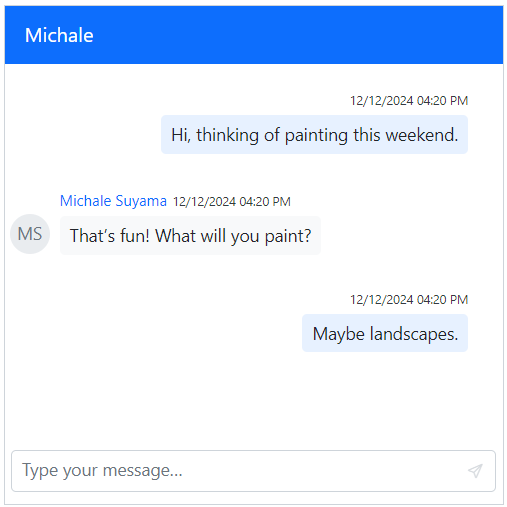
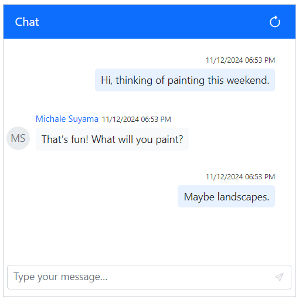
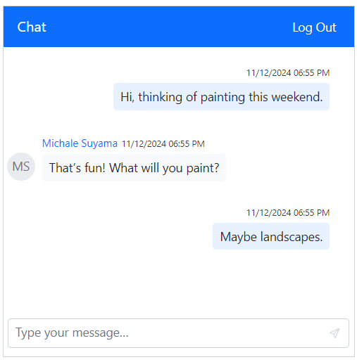

# Header in Blazor Chat UI component

## Show or hide header

You can use [ShowHeader](https://help.syncfusion.com/cr/blazor/Syncfusion.Blazor.InteractiveChat.SfChatUI.html#Syncfusion_Blazor_InteractiveChat_SfChatUI_ShowHeader) property to enable or disable the chat header. It contains the following options [HeaderText](https://help.syncfusion.com/cr/blazor/Syncfusion.Blazor.InteractiveChat.SfChatUI.html#Syncfusion_Blazor_InteractiveChat_SfChatUI_HeaderText) and [HeaderIconCss](https://help.syncfusion.com/cr/blazor/Syncfusion.Blazor.InteractiveChat.SfChatUI.html#Syncfusion_Blazor_InteractiveChat_SfChatUI_HeaderIconCss).

```cshtml

@using Syncfusion.Blazor.InteractiveChat

<div style="height: 400px; width: 400px;">
    <SfChatUI HeaderText="Michale" HeaderIconCss="e-icons e-people" ShowHeader="false" User="CurrentUserModel" Messages="ChatUserMessages"></SfChatUI>
</div>

@code {
    private static UserModel CurrentUserModel = new UserModel() { ID = "User1", User = "Albert" };
    private static UserModel MichaleUserModel = new UserModel() { ID = "User2", User = "Michale Suyama" };

    private List<ChatMessage> ChatUserMessages = new List<ChatMessage>()
    {
        new ChatMessage() { Text = "Hi, thinking of painting this weekend.", Author = CurrentUserModel },
        new ChatMessage() { Text = "That’s fun! What will you paint?", Author = MichaleUserModel },
        new ChatMessage() { Text = "Maybe landscapes.", Author = CurrentUserModel }
    };
}

```


### Setting header text

You can use the [HeaderText](https://help.syncfusion.com/cr/blazor/Syncfusion.Blazor.InteractiveChat.SfChatUI.html#Syncfusion_Blazor_InteractiveChat_SfChatUI_HeaderText) property to display the text that appears in the header, which indicates the current username or the group name providing the context for the conversation.

```cshtml

@using Syncfusion.Blazor.InteractiveChat

<div style="height: 400px; width: 400px;">
    <SfChatUI HeaderText="Michale" User="CurrentUserModel" Messages="ChatUserMessages"></SfChatUI>
</div>

@code {
    private static UserModel CurrentUserModel = new UserModel() { ID = "User1", User = "Albert" };
    private static UserModel MichaleUserModel = new UserModel() { ID = "User2", User = "Michale Suyama" };

    private List<ChatMessage> ChatUserMessages = new List<ChatMessage>()
    {
        new ChatMessage() { Text = "Hi, thinking of painting this weekend.", Author = CurrentUserModel },
        new ChatMessage() { Text = "That’s fun! What will you paint?", Author = MichaleUserModel },
        new ChatMessage() { Text = "Maybe landscapes.", Author = CurrentUserModel }
    };
}

```



### Setting header icon CSS

You can use the [HeaderIconCss](https://help.syncfusion.com/cr/blazor/Syncfusion.Blazor.InteractiveChat.SfChatUI.html#Syncfusion_Blazor_InteractiveChat_SfChatUI_HeaderIconCss) property to customize the styling of the header icon.

```cshtml

@using Syncfusion.Blazor.InteractiveChat

<div style="height: 400px; width: 400px;">
    <SfChatUI HeaderIconCss="e-icons e-people" User="CurrentUserModel" Messages="ChatUserMessages"></SfChatUI>
</div>

@code {
    private static UserModel CurrentUserModel = new UserModel() { ID = "User1", User = "Albert" };
    private static UserModel MichaleUserModel = new UserModel() { ID = "User2", User = "Michale Suyama" };

    private List<ChatMessage> ChatUserMessages = new List<ChatMessage>()
    {
        new ChatMessage() { Text = "Hi, thinking of painting this weekend.", Author = CurrentUserModel },
        new ChatMessage() { Text = "That’s fun! What will you paint?", Author = MichaleUserModel },
        new ChatMessage() { Text = "Maybe landscapes.", Author = CurrentUserModel }
    };
}

<style>
    #chatui-header .e-header .e-header-icon {
        display: flex;
    }
</style>

```


## Toolbar

You can render the Chat UI toolbar items by using the [HeaderToolbar](https://help.syncfusion.com/cr/blazor/Syncfusion.Blazor.InteractiveChat.HeaderToolbar.html), [HeaderToolbarItem](https://help.syncfusion.com/cr/blazor/Syncfusion.Blazor.InteractiveChat.HeaderToolbarItem.html) tag directives.

### Setting items

Items can be constructed with the following built-in command types or item template.

#### Adding icon CSS

You can customize the header toolbar icons by using the [IconCss](https://help.syncfusion.com/cr/blazor/Syncfusion.Blazor.InteractiveChat.HeaderToolbarItem.html#Syncfusion_Blazor_InteractiveChat_HeaderToolbarItem_IconCss) property.

```cshtml

@using Syncfusion.Blazor.InteractiveChat
@using Syncfusion.Blazor.Navigations

<div style="height: 400px; width: 400px;">
    <SfChatUI User="CurrentUserModel" Messages="ChatUserMessages">
        <HeaderToolbar>
            <HeaderToolbarItem Type="ItemType.Spacer"></HeaderToolbarItem>
            <HeaderToolbarItem IconCss="e-icons e-menu"></HeaderToolbarItem>
        </HeaderToolbar>
    </SfChatUI>
</div>

@code {
    private static UserModel CurrentUserModel = new UserModel() { ID = "User1", User = "Albert" };
    private static UserModel MichaleUserModel = new UserModel() { ID = "User2", User = "Michale Suyama" };

    private List<ChatMessage> ChatUserMessages = new List<ChatMessage>()
    {
        new ChatMessage() { Text = "Hi, thinking of painting this weekend.", Author = CurrentUserModel },
        new ChatMessage() { Text = "That’s fun! What will you paint?", Author = MichaleUserModel },
        new ChatMessage() { Text = "Maybe landscapes.", Author = CurrentUserModel }
    };
}

```


#### Setting item type

You can change the header toolbar item type by using the [Type](https://help.syncfusion.com/cr/blazor/Syncfusion.Blazor.InteractiveChat.HeaderToolbarItem.html#Syncfusion_Blazor_InteractiveChat_HeaderToolbarItem_Type) property. The `Type` supports four types of items such as `Button`, `Separator`, `Spacer` and `Input`. By default, the type is `Button`.

In the following example, header toolbar item type is set as `Button`.

```cshtml

@using Syncfusion.Blazor.InteractiveChat
@using Syncfusion.Blazor.Navigations

<div style="height: 400px; width: 400px;">
    <SfChatUI User="CurrentUserModel" Messages="ChatUserMessages">
        <HeaderToolbar>
            <HeaderToolbarItem Type="ItemType.Spacer"></HeaderToolbarItem>
            <HeaderToolbarItem Type="ItemType.Button" IconCss="e-icons e-refresh"></HeaderToolbarItem>
        </HeaderToolbar>
    </SfChatUI>
</div>

@code {
    private static UserModel CurrentUserModel = new UserModel() { ID = "User1", User = "Albert" };
    private static UserModel MichaleUserModel = new UserModel() { ID = "User2", User = "Michale Suyama" };

    private List<ChatMessage> ChatUserMessages = new List<ChatMessage>()
    {
        new ChatMessage() { Text = "Hi, thinking of painting this weekend.", Author = CurrentUserModel },
        new ChatMessage() { Text = "That’s fun! What will you paint?", Author = MichaleUserModel },
        new ChatMessage() { Text = "Maybe landscapes.", Author = CurrentUserModel }
    };
}

```



#### Setting text

You can use the [Text](https://help.syncfusion.com/cr/blazor/Syncfusion.Blazor.InteractiveChat.HeaderToolbarItem.html#Syncfusion_Blazor_InteractiveChat_HeaderToolbarItem_Text) property to set the text for the header toolbar item.

```cshtml

@using Syncfusion.Blazor.InteractiveChat
@using Syncfusion.Blazor.Navigations

<div style="height: 400px; width: 400px;">
    <SfChatUI User="CurrentUserModel" Messages="ChatUserMessages">
        <HeaderToolbar>
            <HeaderToolbarItem Type="ItemType.Spacer"></HeaderToolbarItem>
            <HeaderToolbarItem Text="Log Out"></HeaderToolbarItem>
        </HeaderToolbar>
    </SfChatUI>
</div>

@code {
    private static UserModel CurrentUserModel = new UserModel() { ID = "User1", User = "Albert" };
    private static UserModel MichaleUserModel = new UserModel() { ID = "User2", User = "Michale Suyama" };

    private List<ChatMessage> ChatUserMessages = new List<ChatMessage>()
    {
        new ChatMessage() { Text = "Hi, thinking of painting this weekend.", Author = CurrentUserModel },
        new ChatMessage() { Text = "That’s fun! What will you paint?", Author = MichaleUserModel },
        new ChatMessage() { Text = "Maybe landscapes.", Author = CurrentUserModel }
    };
}

```



#### Show or hide toolbar item

You can use the [Visible](https://help.syncfusion.com/cr/blazor/Syncfusion.Blazor.InteractiveChat.HeaderToolbarItem.html#Syncfusion_Blazor_InteractiveChat_HeaderToolbarItem_Visible) property to specify whether to show or hide the header toolbar item. By default, its value is `true`.

```cshtml

@using Syncfusion.Blazor.InteractiveChat
@using Syncfusion.Blazor.Navigations

<div style="height: 400px; width: 400px;">
    <SfChatUI User="CurrentUserModel" Messages="ChatUserMessages">
        <HeaderToolbar>
            <HeaderToolbarItem Type="ItemType.Spacer"></HeaderToolbarItem>
            <HeaderToolbarItem Type="ItemType.Button" IconCss="e-icons e-refresh" Visible=false></HeaderToolbarItem>
            <HeaderToolbarItem Type="ItemType.Button" IconCss="e-icons e-user"></HeaderToolbarItem>
        </HeaderToolbar>
    </SfChatUI>
</div>

@code {
    private static UserModel CurrentUserModel = new UserModel() { ID = "User1", User = "Albert" };
    private static UserModel MichaleUserModel = new UserModel() { ID = "User2", User = "Michale Suyama" };

    private List<ChatMessage> ChatUserMessages = new List<ChatMessage>()
    {
        new ChatMessage() { Text = "Hi, thinking of painting this weekend.", Author = CurrentUserModel },
        new ChatMessage() { Text = "That’s fun! What will you paint?", Author = MichaleUserModel },
        new ChatMessage() { Text = "Maybe landscapes.", Author = CurrentUserModel }
    };
}

```


#### Setting disabled

You can use the [Disabled](https://help.syncfusion.com/cr/blazor/Syncfusion.Blazor.InteractiveChat.HeaderToolbarItem.html#Syncfusion_Blazor_InteractiveChat_HeaderToolbarItem_Disabled) property to disable the header toolbar item. By default, its value is `false`.

```cshtml

@using Syncfusion.Blazor.InteractiveChat
@using Syncfusion.Blazor.Navigations

<div style="height: 400px; width: 400px;">
    <SfChatUI User="CurrentUserModel" Messages="ChatUserMessages">
        <HeaderToolbar>
            <HeaderToolbarItem Type="ItemType.Spacer"></HeaderToolbarItem>
            <HeaderToolbarItem Type="ItemType.Button" IconCss="e-icons e-refresh" Disabled=true></HeaderToolbarItem>
            <HeaderToolbarItem Type="ItemType.Button" IconCss="e-icons e-user"></HeaderToolbarItem>
        </HeaderToolbar>
    </SfChatUI>
</div>

@code {
    private static UserModel CurrentUserModel = new UserModel() { ID = "User1", User = "Albert" };
    private static UserModel MichaleUserModel = new UserModel() { ID = "User2", User = "Michale Suyama" };

    private List<ChatMessage> ChatUserMessages = new List<ChatMessage>()
    {
        new ChatMessage() { Text = "Hi, thinking of painting this weekend.", Author = CurrentUserModel },
        new ChatMessage() { Text = "That’s fun! What will you paint?", Author = MichaleUserModel },
        new ChatMessage() { Text = "Maybe landscapes.", Author = CurrentUserModel }
    };
}

```


#### Setting tooltip text

You can use the [Tooltip](https://help.syncfusion.com/cr/blazor/Syncfusion.Blazor.InteractiveChat.HeaderToolbarItem.html#Syncfusion_Blazor_InteractiveChat_HeaderToolbarItem_Tooltip) property to specify the tooltip text to be displayed on hovering the header toolbar item.

```cshtml

@using Syncfusion.Blazor.InteractiveChat
@using Syncfusion.Blazor.Navigations

<div style="height: 400px; width: 400px;">
    <SfChatUI User="CurrentUserModel" Messages="ChatUserMessages">
        <HeaderToolbar>
            <HeaderToolbarItem Type="ItemType.Spacer"></HeaderToolbarItem>
            <HeaderToolbarItem Type="ItemType.Button" IconCss="e-icons e-refresh" Tooltip="Refresh"></HeaderToolbarItem>
        </HeaderToolbar>
    </SfChatUI>
</div>

@code {
    private static UserModel CurrentUserModel = new UserModel() { ID = "User1", User = "Albert" };
    private static UserModel MichaleUserModel = new UserModel() { ID = "User2", User = "Michale Suyama" };

    private List<ChatMessage> ChatUserMessages = new List<ChatMessage>()
    {
        new ChatMessage() { Text = "Hi, thinking of painting this weekend.", Author = CurrentUserModel },
        new ChatMessage() { Text = "That’s fun! What will you paint?", Author = MichaleUserModel },
        new ChatMessage() { Text = "Maybe landscapes.", Author = CurrentUserModel }
    };
}

```


#### Setting CSS Class

You can use the [CssClass](https://help.syncfusion.com/cr/blazor/Syncfusion.Blazor.InteractiveChat.HeaderToolbarItem.html#Syncfusion_Blazor_InteractiveChat_HeaderToolbarItem_CssClass) property to customize the header toolbar item.

```cshtml

@using Syncfusion.Blazor.InteractiveChat
@using Syncfusion.Blazor.Navigations

<div style="height: 400px; width: 400px;">
    <SfChatUI User="CurrentUserModel" Messages="ChatUserMessages">
        <HeaderToolbar>
            <HeaderToolbarItem Type="ItemType.Spacer"></HeaderToolbarItem>
            <HeaderToolbarItem Type="ItemType.Button" IconCss="e-icons e-user" CssClass="custom-btn"></HeaderToolbarItem>
        </HeaderToolbar>
    </SfChatUI>
</div>

@code {
    private static UserModel CurrentUserModel = new UserModel() { ID = "User1", User = "Albert" };
    private static UserModel MichaleUserModel = new UserModel() { ID = "User2", User = "Michale Suyama" };

    private List<ChatMessage> ChatUserMessages = new List<ChatMessage>()
    {
        new ChatMessage() { Text = "Hi, thinking of painting this weekend.", Author = CurrentUserModel },
        new ChatMessage() { Text = "That’s fun! What will you paint?", Author = MichaleUserModel },
        new ChatMessage() { Text = "Maybe landscapes.", Author = CurrentUserModel }
    };
}

<style>
    .custom-btn .e-user::before {
        color: white;
        font-size: 15px;
    }

    .custom-btn.e-toolbar-item button.e-tbar-btn {
        border: 2px solid white;
    }
</style>

```


#### Enabling tab key navigation in toolbar

You can use the [TabIndex](https://help.syncfusion.com/cr/blazor/Syncfusion.Blazor.InteractiveChat.HeaderToolbarItem.html#Syncfusion_Blazor_InteractiveChat_HeaderToolbarItem_TabIndex) property of a header toolbar item to enable tab key navigation for the item. By default, the user can switch between items using the arrow keys, but the `TabIndex` property allows you to switch between items using the `Tab` and `Shift+Tab` keys as well.

To use the `TabIndex` property, set it for each Toolbar item which you want to enable tab key navigation. The `TabIndex` property should be set to a positive integer value. A value of `0` or a negative value will disable tab key navigation for the item.

For example, to enable tab key navigation for two Toolbar items you can use the following code:

```cshtml

@using Syncfusion.Blazor.InteractiveChat
@using Syncfusion.Blazor.Navigations

<div style="height: 400px; width: 400px;">
    <SfChatUI>
        <HeaderToolbar>
            <HeaderToolbarItem Text="Item 1" TabIndex="1"></HeaderToolbarItem>
            <HeaderToolbarItem Text="Item 2" TabIndex="2"></HeaderToolbarItem>
        </HeaderToolbar>
    </SfChatUI>
</div>

```

With the above code, the user can switch between the two Toolbar items using the Tab and Shift+Tab keys, in addition to using the arrow keys. The items will be navigated in the order specified by the `TabIndex` values.

If you set the `TabIndex` value to 0 for all Toolbar items, tab key navigation will be based on the element order rather than the `TabIndex` values. For example:

```cshtml

@using Syncfusion.Blazor.InteractiveChat
@using Syncfusion.Blazor.Navigations

<div style="height: 400px; width: 400px;">
    <SfChatUI>
        <HeaderToolbar>
            <HeaderToolbarItem Text="Item 1" TabIndex="0"></HeaderToolbarItem>
            <HeaderToolbarItem Text="Item 2" TabIndex="0"></HeaderToolbarItem>
        </HeaderToolbar>
    </SfChatUI>
</div>

```

In this case, the user can switch between the two Toolbar items using the Tab and Shift+Tab keys, and the items will be navigated in the order in which they appear in the DOM.

#### Setting template

You can use the [Template](https://help.syncfusion.com/cr/blazor/Syncfusion.Blazor.InteractiveChat.HeaderToolbarItem.html#Syncfusion_Blazor_InteractiveChat_HeaderToolbarItem_Template) tag directive to add custom header toolbar item in the Chat UI component. Template property can be given as the `HTML element` or `RenderFragment`.

```cshtml

@using Syncfusion.Blazor.InteractiveChat
@using Syncfusion.Blazor.Navigations
@using Syncfusion.Blazor.SplitButtons

<div style="height: 400px; width: 400px;">
    <SfChatUI User="CurrentUserModel" Messages="ChatUserMessages">
        <HeaderToolbar>
            <HeaderToolbarItem Type="ItemType.Spacer"></HeaderToolbarItem>
            <HeaderToolbarItem Type="ItemType.Input">
                <Template>
                    <SfDropDownButton IconCss="e-icons e-menu" Content="Menu" CssClass="custom-dropdown">
                        <DropDownMenuItems>
                            <DropDownMenuItem Text="Info"></DropDownMenuItem>
                            <DropDownMenuItem Text="Search"></DropDownMenuItem>
                            <DropDownMenuItem Text="Add to list"></DropDownMenuItem>
                            <DropDownMenuItem Text="Mute"></DropDownMenuItem>
                        </DropDownMenuItems>
                    </SfDropDownButton>
                </Template>
            </HeaderToolbarItem>
        </HeaderToolbar>
    </SfChatUI>
</div>

@code {
    private static UserModel CurrentUserModel = new UserModel() { ID = "User1", User = "Albert" };
    private static UserModel MichaleUserModel = new UserModel() { ID = "User2", User = "Michale Suyama" };

    private List<ChatMessage> ChatUserMessages = new List<ChatMessage>()
    {
        new ChatMessage() { Text = "Hi, thinking of painting this weekend.", Author = CurrentUserModel },
        new ChatMessage() { Text = "That’s fun! What will you paint?", Author = MichaleUserModel },
        new ChatMessage() { Text = "Maybe landscapes.", Author = CurrentUserModel }
    };
}

<style>
    .custom-dropdown.e-dropdown-popup ul {
        min-width: 100px;
    }
</style>

```


### Item clicked

You can define [ItemClicked](https://help.syncfusion.com/cr/blazor/Syncfusion.Blazor.InteractiveChat.HeaderToolbar.html#Syncfusion_Blazor_InteractiveChat_HeaderToolbar_ItemClicked) event in the [HeaderToolbar](https://help.syncfusion.com/cr/blazor/Syncfusion.Blazor.InteractiveChat.HeaderToolbar.html) tag directive which will be triggered when the header toolbar item is clicked.

```cshtml

@using Syncfusion.Blazor.InteractiveChat
@using Syncfusion.Blazor.Navigations

<div style="height: 400px; width: 400px;">
    <SfChatUI>
        <HeaderToolbar ItemClicked="ToolbarItemClicked">
            <HeaderToolbarItem Type="ItemType.Spacer"></HeaderToolbarItem>
            <HeaderToolbarItem Type="ItemType.Button" IconCss="e-icons e-refresh"></HeaderToolbarItem>
        </HeaderToolbar>
    </SfChatUI>
</div>

@code {
    private void ToolbarItemClicked(ChatToolbarItemClickedEventArgs args)
    {
        // Your required action here
    }
}

```
