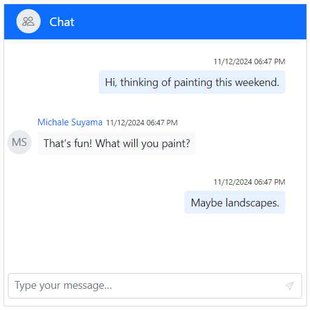
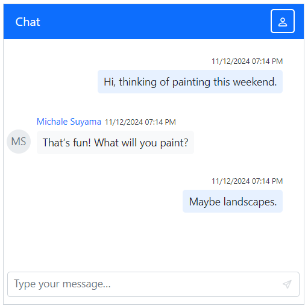
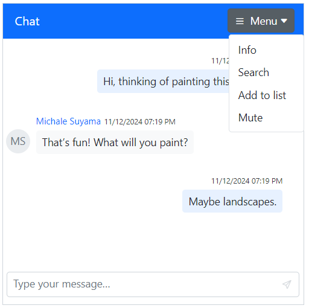

# Header in Blazor Chat UI Component

## Show or hide header

The [ShowHeader](https://help.syncfusion.com/cr/blazor/Syncfusion.Blazor.InteractiveChat.SfChatUI.html#Syncfusion_Blazor_InteractiveChat_SfChatUI_ShowHeader) property allows you to control the visibility of the chat header. When enabled, the header can display text and an icon, which are configured using the [HeaderText](https://help.syncfusion.com/cr/blazor/Syncfusion.Blazor.InteractiveChat.SfChatUI.html#Syncfusion_Blazor_InteractiveChat_SfChatUI_HeaderText) and [HeaderIconCss](https://help.syncfusion.com/cr/blazor/Syncfusion.Blazor.InteractiveChat.SfChatUI.html#Syncfusion_Blazor_InteractiveChat_SfChatUI_HeaderIconCss) properties, respectively.

```cshtml

@using Syncfusion.Blazor.InteractiveChat

<div style="height: 400px; width: 400px;">
    <SfChatUI HeaderText="Michale" HeaderIconCss="e-icons e-people" ShowHeader="false" User="CurrentUserModel" Messages="ChatUserMessages"></SfChatUI>
</div>

@code {
    private static UserModel CurrentUserModel = new UserModel() { ID = "User1", User = "Albert" };
    private static UserModel MichaleUserModel = new UserModel() { ID = "User2", User = "Michale Suyama" };

    private List<ChatMessage> ChatUserMessages = new List<ChatMessage>()
    {
        new ChatMessage() { Text = "Hi, thinking of painting this weekend.", Author = CurrentUserModel },
        new ChatMessage() { Text = "That’s fun! What will you paint?", Author = MichaleUserModel },
        new ChatMessage() { Text = "Maybe landscapes.", Author = CurrentUserModel }
    };
}

```


### Setting header text

Use the [HeaderText](https://help.syncfusion.com/cr/blazor/Syncfusion.Blazor.InteractiveChat.SfChatUI.html#Syncfusion_Blazor_InteractiveChat_SfChatUI_HeaderText) property to set the text that appears in the header. This typically displays the current username or group name to provide context for the conversation.

```cshtml

@using Syncfusion.Blazor.InteractiveChat

<div style="height: 400px; width: 400px;">
    <SfChatUI HeaderText="Michale" User="CurrentUserModel" Messages="ChatUserMessages"></SfChatUI>
</div>

@code {
    private static UserModel CurrentUserModel = new UserModel() { ID = "User1", User = "Albert" };
    private static UserModel MichaleUserModel = new UserModel() { ID = "User2", User = "Michale Suyama" };

    private List<ChatMessage> ChatUserMessages = new List<ChatMessage>()
    {
        new ChatMessage() { Text = "Hi, thinking of painting this weekend.", Author = CurrentUserModel },
        new ChatMessage() { Text = "That’s fun! What will you paint?", Author = MichaleUserModel },
        new ChatMessage() { Text = "Maybe landscapes.", Author = CurrentUserModel }
    };
}

```


### Setting header icon CSS

The [HeaderIconCss](https://help.syncfusion.com/cr/blazor/Syncfusion.Blazor.InteractiveChat.SfChatUI.html#Syncfusion_Blazor_InteractiveChat_SfChatUI_HeaderIconCss) property allows you to customize the styling of the header icon.

```cshtml

@using Syncfusion.Blazor.InteractiveChat

<div style="height: 400px; width: 400px;">
    <SfChatUI HeaderIconCss="e-icons e-people" User="CurrentUserModel" Messages="ChatUserMessages"></SfChatUI>
</div>

@code {
    private static UserModel CurrentUserModel = new UserModel() { ID = "User1", User = "Albert" };
    private static UserModel MichaleUserModel = new UserModel() { ID = "User2", User = "Michale Suyama" };

    private List<ChatMessage> ChatUserMessages = new List<ChatMessage>()
    {
        new ChatMessage() { Text = "Hi, thinking of painting this weekend.", Author = CurrentUserModel },
        new ChatMessage() { Text = "That’s fun! What will you paint?", Author = MichaleUserModel },
        new ChatMessage() { Text = "Maybe landscapes.", Author = CurrentUserModel }
    };
}

```



## Toolbar

You can render items in the Chat UI header's toolbar by using the [HeaderToolbar](https://help.syncfusion.com/cr/blazor/Syncfusion.Blazor.InteractiveChat.HeaderToolbar.html) and [HeaderToolbarItem](https://help.syncfusion.com/cr/blazor/Syncfusion.Blazor.InteractiveChat.HeaderToolbarItem.html) tag directives.

### Setting items

Items can be configured using built-in command types or a custom item template, as detailed in the following sections.

#### Adding icon CSS

Customize the header toolbar icons by using the [IconCss](https://help.syncfusion.com/cr/blazor/Syncfusion.Blazor.InteractiveChat.HeaderToolbarItem.html#Syncfusion_Blazor_InteractiveChat_HeaderToolbarItem_IconCss) property.

```cshtml

@using Syncfusion.Blazor.InteractiveChat
@using Syncfusion.Blazor.Navigations

<div style="height: 400px; width: 400px;">
    <SfChatUI User="CurrentUserModel" Messages="ChatUserMessages">
        <HeaderToolbar>
            <HeaderToolbarItem Type="ItemType.Spacer"></HeaderToolbarItem>
            <HeaderToolbarItem IconCss="e-icons e-menu"></HeaderToolbarItem>
        </HeaderToolbar>
    </SfChatUI>
</div>

@code {
    private static UserModel CurrentUserModel = new UserModel() { ID = "User1", User = "Albert" };
    private static UserModel MichaleUserModel = new UserModel() { ID = "User2", User = "Michale Suyama" };

    private List<ChatMessage> ChatUserMessages = new List<ChatMessage>()
    {
        new ChatMessage() { Text = "Hi, thinking of painting this weekend.", Author = CurrentUserModel },
        new ChatMessage() { Text = "That’s fun! What will you paint?", Author = MichaleUserModel },
        new ChatMessage() { Text = "Maybe landscapes.", Author = CurrentUserModel }
    };
}

```


#### Setting item type

To change the header toolbar item type, use the [Type](https://help.syncfusion.com/cr/blazor/Syncfusion.Blazor.InteractiveChat.HeaderToolbarItem.html#Syncfusion_Blazor_InteractiveChat_HeaderToolbarItem_Type) property. The `Type` property supports four item types: `Button`, `Separator`, `Spacer`, and `Input`. The default type is `Button`.

In the following example, a header toolbar item type is set to `Button`.

```cshtml

@using Syncfusion.Blazor.InteractiveChat
@using Syncfusion.Blazor.Navigations

<div style="height: 400px; width: 400px;">
    <SfChatUI User="CurrentUserModel" Messages="ChatUserMessages">
        <HeaderToolbar>
            <HeaderToolbarItem Type="ItemType.Spacer"></HeaderToolbarItem>
            <HeaderToolbarItem Type="ItemType.Button" IconCss="e-icons e-refresh"></HeaderToolbarItem>
        </HeaderToolbar>
    </SfChatUI>
</div>

@code {
    private static UserModel CurrentUserModel = new UserModel() { ID = "User1", User = "Albert" };
    private static UserModel MichaleUserModel = new UserModel() { ID = "User2", User = "Michale Suyama" };

    private List<ChatMessage> ChatUserMessages = new List<ChatMessage>()
    {
        new ChatMessage() { Text = "Hi, thinking of painting this weekend.", Author = CurrentUserModel },
        new ChatMessage() { Text = "That’s fun! What will you paint?", Author = MichaleUserModel },
        new ChatMessage() { Text = "Maybe landscapes.", Author = CurrentUserModel }
    };
}

```


#### Setting text

The [Text](https://help.syncfusion.com/cr/blazor/Syncfusion.Blazor.InteractiveChat.HeaderToolbarItem.html#Syncfusion_Blazor_InteractiveChat_HeaderToolbarItem_Text) property sets the display text for a header toolbar item.

```cshtml

@using Syncfusion.Blazor.InteractiveChat
@using Syncfusion.Blazor.Navigations

<div style="height: 400px; width: 400px;">
    <SfChatUI User="CurrentUserModel" Messages="ChatUserMessages">
        <HeaderToolbar>
            <HeaderToolbarItem Type="ItemType.Spacer"></HeaderToolbarItem>
            <HeaderToolbarItem Text="Log Out"></HeaderToolbarItem>
        </HeaderToolbar>
    </SfChatUI>
</div>

@code {
    private static UserModel CurrentUserModel = new UserModel() { ID = "User1", User = "Albert" };
    private static UserModel MichaleUserModel = new UserModel() { ID = "User2", User = "Michale Suyama" };

    private List<ChatMessage> ChatUserMessages = new List<ChatMessage>()
    {
        new ChatMessage() { Text = "Hi, thinking of painting this weekend.", Author = CurrentUserModel },
        new ChatMessage() { Text = "That’s fun! What will you paint?", Author = MichaleUserModel },
        new ChatMessage() { Text = "Maybe landscapes.", Author = CurrentUserModel }
    };
}

```


#### Show or hide toolbar item

Use the [Visible](https://help.syncfusion.com/cr/blazor/Syncfusion.Blazor.InteractiveChat.HeaderToolbarItem.html#Syncfusion_Blazor_InteractiveChat_HeaderToolbarItem_Visible) property to specify whether a header toolbar item is shown or hidden. Its default value is `true`.

```cshtml

@using Syncfusion.Blazor.InteractiveChat
@using Syncfusion.Blazor.Navigations

<div style="height: 400px; width: 400px;">
    <SfChatUI User="CurrentUserModel" Messages="ChatUserMessages">
        <HeaderToolbar>
            <HeaderToolbarItem Type="ItemType.Spacer"></HeaderToolbarItem>
            <HeaderToolbarItem Type="ItemType.Button" IconCss="e-icons e-refresh" Visible=false></HeaderToolbarItem>
            <HeaderToolbarItem Type="ItemType.Button" IconCss="e-icons e-user"></HeaderToolbarItem>
        </HeaderToolbar>
    </SfChatUI>
</div>

@code {
    private static UserModel CurrentUserModel = new UserModel() { ID = "User1", User = "Albert" };
    private static UserModel MichaleUserModel = new UserModel() { ID = "User2", User = "Michale Suyama" };

    private List<ChatMessage> ChatUserMessages = new List<ChatMessage>()
    {
        new ChatMessage() { Text = "Hi, thinking of painting this weekend.", Author = CurrentUserModel },
        new ChatMessage() { Text = "That’s fun! What will you paint?", Author = MichaleUserModel },
        new ChatMessage() { Text = "Maybe landscapes.", Author = CurrentUserModel }
    };
}

```


#### Setting disabled

The [Disabled](https://help.syncfusion.com/cr/blazor/Syncfusion.Blazor.InteractiveChat.HeaderToolbarItem.html#Syncfusion_Blazor_InteractiveChat_HeaderToolbarItem_Disabled) property allows you to disable a header toolbar item. Its default value is `false`.

```cshtml

@using Syncfusion.Blazor.InteractiveChat
@using Syncfusion.Blazor.Navigations

<div style="height: 400px; width: 400px;">
    <SfChatUI User="CurrentUserModel" Messages="ChatUserMessages">
        <HeaderToolbar>
            <HeaderToolbarItem Type="ItemType.Spacer"></HeaderToolbarItem>
            <HeaderToolbarItem Type="ItemType.Button" IconCss="e-icons e-refresh" Disabled=true></HeaderToolbarItem>
            <HeaderToolbarItem Type="ItemType.Button" IconCss="e-icons e-user"></HeaderToolbarItem>
        </HeaderToolbar>
    </SfChatUI>
</div>

@code {
    private static UserModel CurrentUserModel = new UserModel() { ID = "User1", User = "Albert" };
    private static UserModel MichaleUserModel = new UserModel() { ID = "User2", User = "Michale Suyama" };

    private List<ChatMessage> ChatUserMessages = new List<ChatMessage>()
    {
        new ChatMessage() { Text = "Hi, thinking of painting this weekend.", Author = CurrentUserModel },
        new ChatMessage() { Text = "That’s fun! What will you paint?", Author = MichaleUserModel },
        new ChatMessage() { Text = "Maybe landscapes.", Author = CurrentUserModel }
    };
}

```


#### Setting tooltip text

Use the [Tooltip](https://help.syncfusion.com/cr/blazor/Syncfusion.Blazor.InteractiveChat.HeaderToolbarItem.html#Syncfusion_Blazor_InteractiveChat_HeaderToolbarItem_Tooltip) property to specify the tooltip text that displays when hovering over a header toolbar item.

```cshtml

@using Syncfusion.Blazor.InteractiveChat
@using Syncfusion.Blazor.Navigations

<div style="height: 400px; width: 400px;">
    <SfChatUI User="CurrentUserModel" Messages="ChatUserMessages">
        <HeaderToolbar>
            <HeaderToolbarItem Type="ItemType.Spacer"></HeaderToolbarItem>
            <HeaderToolbarItem Type="ItemType.Button" IconCss="e-icons e-refresh" Tooltip="Refresh"></HeaderToolbarItem>
        </HeaderToolbar>
    </SfChatUI>
</div>

@code {
    private static UserModel CurrentUserModel = new UserModel() { ID = "User1", User = "Albert" };
    private static UserModel MichaleUserModel = new UserModel() { ID = "User2", User = "Michale Suyama" };

    private List<ChatMessage> ChatUserMessages = new List<ChatMessage>()
    {
        new ChatMessage() { Text = "Hi, thinking of painting this weekend.", Author = CurrentUserModel },
        new ChatMessage() { Text = "That’s fun! What will you paint?", Author = MichaleUserModel },
        new ChatMessage() { Text = "Maybe landscapes.", Author = CurrentUserModel }
    };
}

```


#### Setting CSS Class

The [CssClass](https://help.syncfusion.com/cr/blazor/Syncfusion.Blazor.InteractiveChat.HeaderToolbarItem.html#Syncfusion_Blazor_InteractiveChat_HeaderToolbarItem_CssClass) property allows you to apply a custom CSS class to a header toolbar item for further styling.

```cshtml

@using Syncfusion.Blazor.InteractiveChat
@using Syncfusion.Blazor.Navigations

<div style="height: 400px; width: 400px;">
    <SfChatUI User="CurrentUserModel" Messages="ChatUserMessages">
        <HeaderToolbar>
            <HeaderToolbarItem Type="ItemType.Spacer"></HeaderToolbarItem>
            <HeaderToolbarItem Type="ItemType.Button" IconCss="e-icons e-user" CssClass="custom-btn"></HeaderToolbarItem>
        </HeaderToolbar>
    </SfChatUI>
</div>

@code {
    private static UserModel CurrentUserModel = new UserModel() { ID = "User1", User = "Albert" };
    private static UserModel MichaleUserModel = new UserModel() { ID = "User2", User = "Michale Suyama" };

    private List<ChatMessage> ChatUserMessages = new List<ChatMessage>()
    {
        new ChatMessage() { Text = "Hi, thinking of painting this weekend.", Author = CurrentUserModel },
        new ChatMessage() { Text = "That’s fun! What will you paint?", Author = MichaleUserModel },
        new ChatMessage() { Text = "Maybe landscapes.", Author = CurrentUserModel }
    };
}

<style>
    .custom-btn .e-user::before {
        color: white;
        font-size: 15px;
    }

    .custom-btn.e-toolbar-item button.e-tbar-btn {
        border: 2px solid white;
    }
</style>

```



#### Enabling tab key navigation in toolbar

Set the [TabIndex](https://help.syncfusion.com/cr/blazor/Syncfusion.Blazor.InteractiveChat.HeaderToolbarItem.html#Syncfusion_Blazor_InteractiveChat_HeaderToolbarItem_TabIndex) property of a header toolbar item to enable tab key navigation for the item. By default, the user can switch between items using the arrow keys, but the `TabIndex` property allows you to switch between items using the `Tab` and `Shift+Tab` keys as well.

To use the `TabIndex` property, set it for each Toolbar item which you want to enable tab key navigation. The `TabIndex` property should be set to a positive integer value. A value of `0` or a negative value will disable tab key navigation for the item.

To enable `Tab` key navigation for two toolbar items, use the following code:

```cshtml

@using Syncfusion.Blazor.InteractiveChat
@using Syncfusion.Blazor.Navigations

<div style="height: 400px; width: 400px;">
    <SfChatUI>
        <HeaderToolbar>
            <HeaderToolbarItem Text="Item 1" TabIndex="1"></HeaderToolbarItem>
            <HeaderToolbarItem Text="Item 2" TabIndex="2"></HeaderToolbarItem>
        </HeaderToolbar>
    </SfChatUI>
</div>

```

With the above configuration, the user can switch between the two toolbar items using the `Tab` and `Shift+Tab` keys, and the items will be navigated in the order specified by their `TabIndex` values.

If the `TabIndex` is set to 0 for all toolbar items, tab key navigation will be based on the element order in the DOM.

```cshtml

@using Syncfusion.Blazor.InteractiveChat
@using Syncfusion.Blazor.Navigations

<div style="height: 400px; width: 400px;">
    <SfChatUI>
        <HeaderToolbar>
            <HeaderToolbarItem Text="Item 1" TabIndex="0"></HeaderToolbarItem>
            <HeaderToolbarItem Text="Item 2" TabIndex="0"></HeaderToolbarItem>
        </HeaderToolbar>
    </SfChatUI>
</div>

```

In this case, the user can navigate between the two items using the `Tab` and `Shift+Tab` keys in the order they appear in the DOM.

#### Setting template

Use the [Template](https://help.syncfusion.com/cr/blazor/Syncfusion.Blazor.InteractiveChat.HeaderToolbarItem.html#Syncfusion_Blazor_InteractiveChat_HeaderToolbarItem_Template) tag directive to render a custom component or HTML element as a header toolbar item. Template property can be given as the `HTML element` or `RenderFragment`.

```cshtml

@using Syncfusion.Blazor.InteractiveChat
@using Syncfusion.Blazor.Navigations
@using Syncfusion.Blazor.SplitButtons

<div style="height: 400px; width: 400px;">
    <SfChatUI User="CurrentUserModel" Messages="ChatUserMessages">
        <HeaderToolbar>
            <HeaderToolbarItem Type="ItemType.Spacer"></HeaderToolbarItem>
            <HeaderToolbarItem Type="ItemType.Input">
                <Template>
                    <SfDropDownButton IconCss="e-icons e-menu" Content="Menu" CssClass="custom-dropdown">
                        <DropDownMenuItems>
                            <DropDownMenuItem Text="Info"></DropDownMenuItem>
                            <DropDownMenuItem Text="Search"></DropDownMenuItem>
                            <DropDownMenuItem Text="Add to list"></DropDownMenuItem>
                            <DropDownMenuItem Text="Mute"></DropDownMenuItem>
                        </DropDownMenuItems>
                    </SfDropDownButton>
                </Template>
            </HeaderToolbarItem>
        </HeaderToolbar>
    </SfChatUI>
</div>

@code {
    private static UserModel CurrentUserModel = new UserModel() { ID = "User1", User = "Albert" };
    private static UserModel MichaleUserModel = new UserModel() { ID = "User2", User = "Michale Suyama" };

    private List<ChatMessage> ChatUserMessages = new List<ChatMessage>()
    {
        new ChatMessage() { Text = "Hi, thinking of painting this weekend.", Author = CurrentUserModel },
        new ChatMessage() { Text = "That’s fun! What will you paint?", Author = MichaleUserModel },
        new ChatMessage() { Text = "Maybe landscapes.", Author = CurrentUserModel }
    };
}

<style>
    .custom-dropdown.e-dropdown-popup ul {
        min-width: 100px;
    }
</style>

```



### Item clicked

Define the [ItemClicked](https://help.syncfusion.com/cr/blazor/Syncfusion.Blazor.InteractiveChat.HeaderToolbar.html#Syncfusion_Blazor_InteractiveChat_HeaderToolbar_ItemClicked) event handle for the [HeaderToolbar](https://help.syncfusion.com/cr/blazor/Syncfusion.Blazor.InteractiveChat.HeaderToolbar.html) tag directive which will be triggered when the header toolbar item is clicked.

```cshtml

@using Syncfusion.Blazor.InteractiveChat
@using Syncfusion.Blazor.Navigations

<div style="height: 400px; width: 400px;">
    <SfChatUI>
        <HeaderToolbar ItemClicked="ToolbarItemClicked">
            <HeaderToolbarItem Type="ItemType.Spacer"></HeaderToolbarItem>
            <HeaderToolbarItem Type="ItemType.Button" IconCss="e-icons e-refresh"></HeaderToolbarItem>
        </HeaderToolbar>
    </SfChatUI>
</div>

@code {
    private void ToolbarItemClicked(ChatToolbarItemClickedEventArgs args)
    {
        // Your required action here
    }
}

```