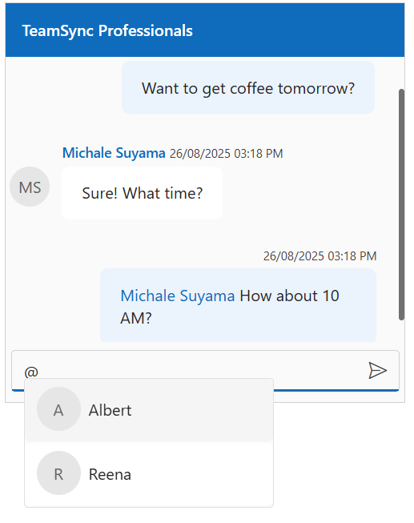
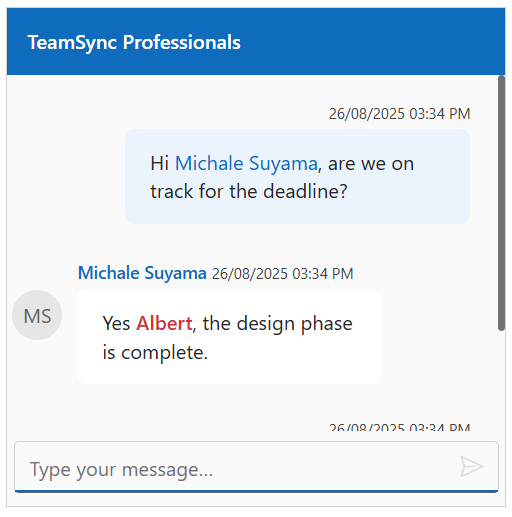

# Mention Integration in Blazor Chat UI component

The Syncfusion<sup style="font-size:70%">&reg;</sup> Chat UI allows users to mention others in messages using the `@` character, which displays a dropdown for selecting users. The following sections explain how to configure mentions.

## Configure Mention Users

Use the [MentionUsers](https://help.syncfusion.com/cr/blazor/Syncfusion.Blazor.InteractiveChat.SfChatUI.html#Syncfusion_Blazor_InteractiveChat_SfChatUI_MentionUsers) property to define a list of users for the mention suggestion popup.

```cshtml
@using Syncfusion.Blazor.InteractiveChat

<div style="height: 400px; width: 400px;">
    <SfChatUI User="CurrentUserModel" Messages="ChatUserMessages" MentionUsers="MentionUsers" HeaderText="TeamSync Professionals"></SfChatUI>
</div>

@code {
    private static UserModel CurrentUserModel = new UserModel() { ID = "User1", User = "Albert" };
    private static UserModel MichaleUserModel = new UserModel() { ID = "User2", User = "Michale Suyama" };
    private static UserModel ReenaUserModel = new UserModel() { ID = "custom-user", User = "Reena" };
    private List<UserModel> MentionUsers = new List<UserModel>()
    {
        CurrentUserModel,
        ReenaUserModel
    };

    private List<ChatMessage> ChatUserMessages = new List<ChatMessage>()
    {
        new ChatMessage() { Text = "Want to get coffee tomorrow?", Author = CurrentUserModel },
        new ChatMessage() { Text = "Sure! What time?", Author = MichaleUserModel },
        new ChatMessage() { Text = "{0} How about 10 AM?", Author = CurrentUserModel, MentionUsers = new List<UserModel>() { MichaleUserModel } }
    };
}

```



## Customize the Mention trigger character

Use the [MentionChar](https://help.syncfusion.com/cr/blazor/Syncfusion.Blazor.InteractiveChat.SfChatUI.html#Syncfusion_Blazor_InteractiveChat_SfChatUI_MentionChar) property to customize the character that triggers the mention popup. The default value is `@`.

```cshtml

@using Syncfusion.Blazor.InteractiveChat

<div style="height: 400px; width: 400px;">
    <SfChatUI User="CurrentUserModel" Messages="ChatUserMessages" MentionUsers="MentionUsers" HeaderText="TeamSync Professionals" MentionChar="MentionCharacter"></SfChatUI>
</div>

@code {
    private static UserModel CurrentUserModel = new UserModel() { ID = "User1", User = "Albert" };
    private static UserModel MichaleUserModel = new UserModel() { ID = "User2", User = "Michale Suyama" };
    private static UserModel ReenaUserModel = new UserModel() { ID = "custom-user", User = "Reena" };
    private List<UserModel> MentionUsers = new List<UserModel>()
    {
        CurrentUserModel,
        ReenaUserModel
    };
    private char MentionCharacter { get; set; } = '/';
    private List<ChatMessage> ChatUserMessages = new List<ChatMessage>()
    {
        new ChatMessage() { Text = "Want to get coffee tomorrow?", Author = CurrentUserModel },
        new ChatMessage() { Text = "Sure! What time?", Author = MichaleUserModel },
        new ChatMessage() { Text = "{0} How about 10 AM?", Author = CurrentUserModel, MentionUsers = new List<UserModel>() { MichaleUserModel } }
    };
}

```


## Predefined Mentions in Messages

Use the [Text](https://help.syncfusion.com/cr/blazor/Syncfusion.Blazor.InteractiveChat.ChatMessage.html#Syncfusion_Blazor_InteractiveChat_ChatMessage_Text) property in the [ChatMessage](https://help.syncfusion.com/cr/blazor/Syncfusion.Blazor.InteractiveChat.ChatMessage.html#Syncfusion_Blazor_InteractiveChat_ChatMessage) to include predefined mentions in chat messages. The mentions logic maps placeholders like `{0}` and `{1}` to users listed in the message's `MentionUsers` property.

> The `MentionUsers` property in a message contains a list of users, mapped by their order where `{0}` is replaced by the first user, `{1}` by the second, and so on. If a placeholder's index is out of bounds (e.g., using `{5}` with only two users), the placeholder text itself (e.g., `{5}`) is displayed.

```cshtml

@using Syncfusion.Blazor.InteractiveChat

<div style="height: 400px; width: 400px;">
    <SfChatUI User="CurrentUserModel" Messages="ChatUserMessages" HeaderText="TeamSync Professionals"></SfChatUI>
</div>

@code {
    private static UserModel CurrentUserModel = new UserModel() { ID = "user1", User = "Albert" };
    private static UserModel MichaleUserModel = new UserModel() { ID = "user2", User = "Michale Suyama" };

    private List<ChatMessage> ChatUserMessages = new List<ChatMessage>()
    {
        new ChatMessage() {
            Author = CurrentUserModel,
            Text = "Hi {0}, are we on track for the deadline?",
            MentionUsers = new List<UserModel>() { MichaleUserModel }
        },
        new ChatMessage() { Author = MichaleUserModel, Text = "Yes {0}, the design phase is complete.", MentionUsers = new List<UserModel>() { CurrentUserModel }},
        new ChatMessage() { Author = CurrentUserModel, Text = "I’ll review it and send feedback by today." }
    };
}

```



## Configure mentionSelect

Use the [ValueSelecting](https://help.syncfusion.com/cr/blazor/Syncfusion.Blazor.InteractiveChat.SfChatUI.html#Syncfusion_Blazor_InteractiveChat_SfChatUI_ValueSelecting) event to execute custom logic when a user is selected from the mention dropdown. The event provides access to the selected user’s details.

```cshtml

@using Syncfusion.Blazor.InteractiveChat
@using Syncfusion.Blazor.DropDowns

<div style="height: 400px; width: 400px;">
    <SfChatUI ID="mentionSelect" MentionUsers="MentionUsers" ValueSelecting="ValueSelecting"></SfChatUI>
</div>

@code {
    private static UserModel CurrentUserModel = new UserModel() { ID = "user1", User = "Albert" };
    private static UserModel MichaleUserModel = new UserModel() { ID = "user2", User = "Michale Suyama" };

    private List<UserModel> MentionUsers = new List<UserModel>()
    {
        CurrentUserModel,
        MichaleUserModel
    };

    private void ValueSelecting(MentionValueSelectingEventArgs<UserModel> args)
    {
        // Your required action here
    }
}

```