# Messages in Blazor Chat UI component

The Chat UI allows to add messages using the [Messages](https://help.syncfusion.com/cr/blazor/Syncfusion.Blazor.InteractiveChat.SfChatUI.html#Syncfusion_Blazor_InteractiveChat_SfChatUI_Messages) property. The message collection stores all the messages being sent and received.

## Configure messages

You can use the [Text](https://help.syncfusion.com/cr/blazor/Syncfusion.Blazor.InteractiveChat.ChatMessage.html#Syncfusion_Blazor_InteractiveChat_ChatMessage_Text) property to add message content for the user. Each message can be configured with options such as id, text, author, timestamp, and more.

```cshtml

@using Syncfusion.Blazor.InteractiveChat

<div style="height: 400px; width: 400px;">
    <SfChatUI ID="chatUser" User="CurrentUserModel" Messages="ChatUserMessages"></SfChatUI>
</div>

@code {
    private static UserModel CurrentUserModel = new UserModel() { ID = "User1", User = "Albert" };
    private static UserModel MichaleUserModel = new UserModel() { ID = "User2", User = "Michale Suyama" };

    private List<ChatMessage> ChatUserMessages = new List<ChatMessage>()
    {
        new ChatMessage() { Text = "Hi, thinking of painting this weekend.", Author = CurrentUserModel },
        new ChatMessage() { Text = "That’s fun! What will you paint?", Author = MichaleUserModel },
        new ChatMessage() { Text = "Maybe landscapes.", Author = CurrentUserModel }
    };
}

```

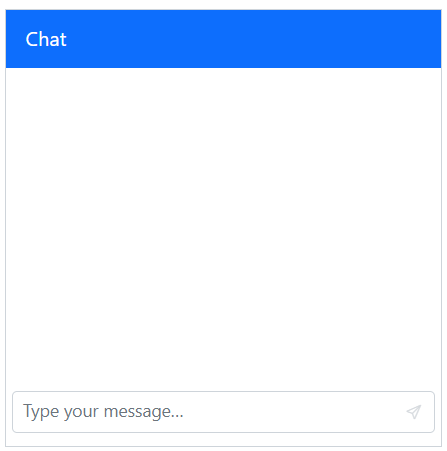

### Define current user

You can use the [Author](https://help.syncfusion.com/cr/blazor/Syncfusion.Blazor.InteractiveChat.ChatMessage.html#Syncfusion_Blazor_InteractiveChat_ChatMessage_Author) property to identify the current user of the chat. Each user can be configured with options such as id, user, avatarUrl, and more.

> You can use the [User](https://help.syncfusion.com/cr/blazor/Syncfusion.Blazor.InteractiveChat.UserModel.html#Syncfusion_Blazor_InteractiveChat_UserModel_User) property to display the user name and [ID](https://help.syncfusion.com/cr/blazor/Syncfusion.Blazor.InteractiveChat.UserModel.html#Syncfusion_Blazor_InteractiveChat_UserModel_ID) property is necessary to differentiate between the multiple users.

```cshtml

@using Syncfusion.Blazor.InteractiveChat

<div style="height: 400px; width: 400px;">
    <SfChatUI ID="chatUser" User="CurrentUserModel" Messages="ChatUserMessages"></SfChatUI>
</div>

@code {
    private static UserModel CurrentUserModel = new UserModel() { ID = "User1", User = "Albert" };
    private static UserModel MichaleUserModel = new UserModel() { ID = "User2", User = "Michale Suyama" };

    private List<ChatMessage> ChatUserMessages = new List<ChatMessage>()
    {
        new ChatMessage() { Text = "Hi, thinking of painting this weekend.", Author = CurrentUserModel },
        new ChatMessage() { Text = "That’s fun! What will you paint?", Author = MichaleUserModel },
        new ChatMessage() { Text = "Maybe landscapes.", Author = CurrentUserModel }
    };
}

```

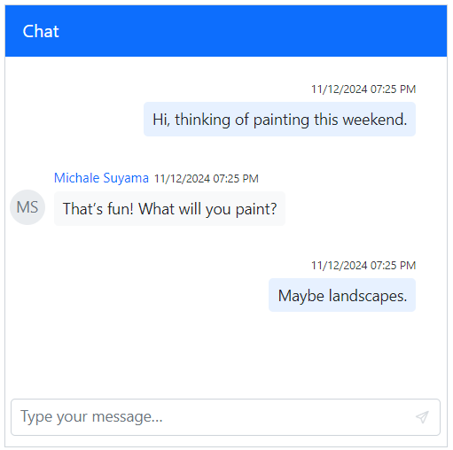

#### Setting avatar URL

You can use the [AvatarUrl](https://help.syncfusion.com/cr/blazor/Syncfusion.Blazor.InteractiveChat.UserModel.html#Syncfusion_Blazor_InteractiveChat_UserModel_AvatarUrl) property to define the image URL’s for the user avatar. If no URL is provided, fallback initials of the first and last name from the user’s name will be used.

```cshtml

@using Syncfusion.Blazor.InteractiveChat

<div style="height: 400px; width: 400px;">
    <SfChatUI ID="chatUser" User="CurrentUserModel" Messages="ChatUserMessages"></SfChatUI>
</div>

@code {
    private static UserModel CurrentUserModel = new UserModel() { ID = "User1", User = "Albert" };
    private static UserModel MichaleUserModel = new UserModel() { ID = "User2", User = "Michale Suyama", AvatarUrl = "" };//Provide the URL for the image here.
    private List<ChatMessage> ChatUserMessages = new List<ChatMessage>()
    {
        new ChatMessage() { Text = "Hi, thinking of painting this weekend.", Author = CurrentUserModel },
        new ChatMessage() { Text = "That’s fun! What will you paint?", Author = MichaleUserModel },
        new ChatMessage() { Text = "Maybe landscapes.", Author = CurrentUserModel }
    };
}

```

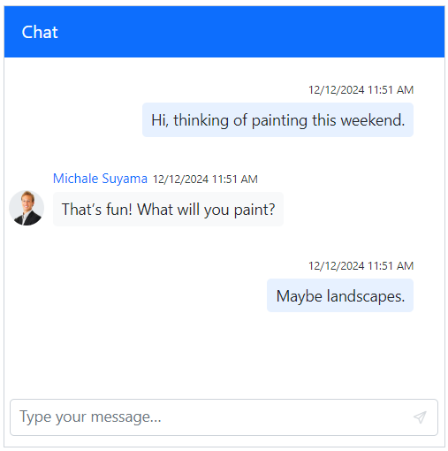

#### Setting avatar background color

You can use the [AvatarBgColor](https://help.syncfusion.com/cr/blazor/Syncfusion.Blazor.InteractiveChat.UserModel.html#Syncfusion_Blazor_InteractiveChat_UserModel_AvatarBgColor) property to set a specific background color for user avatars using hexadecimal values. If no color is set, a custom background color is set based on specified theme.

```cshtml

@using Syncfusion.Blazor.InteractiveChat

<div style="height: 400px; width: 400px;">
    <SfChatUI ID="chatUser" User="CurrentUserModel" Messages="ChatUserMessages"></SfChatUI>
</div>

@code {
    private static UserModel CurrentUserModel = new UserModel() { ID = "User1", User = "Albert" };
    private static UserModel MichaleUserModel = new UserModel() { ID = "User2", User = "Michale Suyama", AvatarBgColor = "#ccc9f7" };
    private List<ChatMessage> ChatUserMessages = new List<ChatMessage>()
    {
        new ChatMessage() { Text = "Hi, thinking of painting this weekend.", Author = CurrentUserModel },
        new ChatMessage() { Text = "That’s fun! What will you paint?", Author = MichaleUserModel },
        new ChatMessage() { Text = "Maybe landscapes.", Author = CurrentUserModel }
    };
}

```

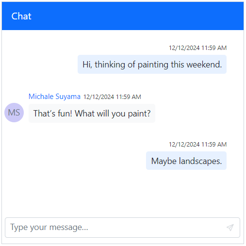

#### Setting CSS class

You can use the [CssClass](https://help.syncfusion.com/cr/blazor/Syncfusion.Blazor.InteractiveChat.UserModel.html#Syncfusion_Blazor_InteractiveChat_UserModel_CssClass) property to customize the appearance of the chat user.

```cshtml

@using Syncfusion.Blazor.InteractiveChat

<div style="height: 400px; width: 400px;">
    <SfChatUI ID="chatUser" User="CurrentUserModel" Messages="ChatUserMessages"></SfChatUI>
</div>

@code {
    private static UserModel CurrentUserModel = new UserModel() { ID = "User1", User = "Albert" };
    private static UserModel MichaleUserModel = new UserModel() { ID = "User2", User = "Michale Suyama", CssClass = "custom-user" };

    private List<ChatMessage> ChatUserMessages = new List<ChatMessage>()
    {
        new ChatMessage() { Text = "Hi, thinking of painting this weekend.", Author = CurrentUserModel },
        new ChatMessage() { Text = "That’s fun! What will you paint?", Author = MichaleUserModel },
        new ChatMessage() { Text = "Maybe landscapes.", Author = CurrentUserModel }
    };
}

<style>
    .e-chat-ui .e-message-icon.custom-user {
        background-color: #416fbd;
        color: white;
        border-radius: 5px;
    }
</style>

```

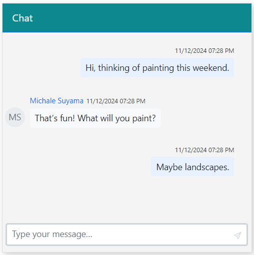

### Define timestamp

You can use the [Timestamp](https://help.syncfusion.com/cr/blazor/Syncfusion.Blazor.InteractiveChat.ChatMessage.html#Syncfusion_Blazor_InteractiveChat_ChatMessage_Timestamp) property to indicate the date and time of each message being sent. By default it is set to the current date and time when the message is sent.

```cshtml

@using Syncfusion.Blazor.InteractiveChat

<div style="height: 400px; width: 400px;">
    <SfChatUI ID="chatUser" User="CurrentUserModel" ShowTimestamp="false" Messages="ChatUserMessages"></SfChatUI>
</div>

@code {
    private static UserModel CurrentUserModel = new UserModel() { ID = "User1", User = "Albert" };
    private static UserModel MichaleUserModel = new UserModel() { ID = "User2", User = "Michale Suyama" };

    private List<ChatMessage> ChatUserMessages = new List<ChatMessage>()
    {
        new ChatMessage() { Text = "Hi, thinking of painting this weekend.", Author = CurrentUserModel, Timestamp = new DateTime(2024,12,25,7,30,0) },
        new ChatMessage() { Text = "That’s fun! What will you paint?", Author = MichaleUserModel, Timestamp = new DateTime(2024,12,25,8,0,0) },
        new ChatMessage() { Text = "Maybe landscapes.", Author = CurrentUserModel, Timestamp = new DateTime(2024,12,25,11,0,0) }
    };
}

```

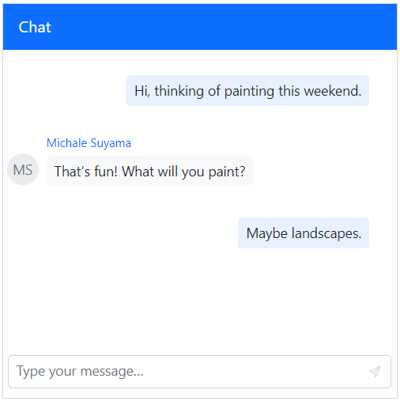

#### Setting timestamp format

You can use the [TimestampFormat](https://help.syncfusion.com/cr/blazor/Syncfusion.Blazor.InteractiveChat.ChatMessage.html#Syncfusion_Blazor_InteractiveChat_ChatMessage_TimestampFormat) to display specific time format for the timestamp. The default format is `dd/MM/yyyy hh:mm tt`, but this can be customized to meet different localization and display needs.

```cshtml

@using Syncfusion.Blazor.InteractiveChat

<div style="height: 400px; width: 400px;">
    <SfChatUI ID="chatUser" User="CurrentUserModel" Messages="ChatUserMessages"></SfChatUI>
</div>

@code {
    private static UserModel CurrentUserModel = new UserModel() { ID = "User1", User = "Albert" };
    private static UserModel MichaleUserModel = new UserModel() { ID = "User2", User = "Michale Suyama" };

    private List<ChatMessage> ChatUserMessages = new List<ChatMessage>()
    {
        new ChatMessage() { Text = "Hi, thinking of painting this weekend.", Author = CurrentUserModel },
        new ChatMessage() { Text = "That’s fun! What will you paint?", Author = MichaleUserModel, TimestampFormat = "MMMM hh:mm tt" },
        new ChatMessage() { Text = "Maybe landscapes.", Author = CurrentUserModel }
    };
}

```

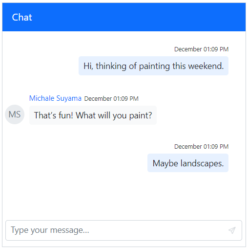

### Define message status

You can use the status property to update the status for the message(e.g., sent, received, read). It helps in managing message delivery and read receipts within the chat interface. 

#### Setting icon CSS

You can use the [IconCss](https://help.syncfusion.com/cr/blazor/Syncfusion.Blazor.InteractiveChat.MessageStatusModel.html#Syncfusion_Blazor_InteractiveChat_MessageStatusModel_IconCss) property to update the styling of status icons associated with messages, aiding visual differentiation between statuses.

```cshtml

@using Syncfusion.Blazor.InteractiveChat

<div style="height: 400px; width: 400px;">
    <SfChatUI ID="chatUser" User="CurrentUserModel" Messages="ChatUserMessages"></SfChatUI>
</div>

@code {
    private static UserModel CurrentUserModel = new UserModel() { ID = "User1", User = "Albert" };
    private static UserModel MichaleUserModel = new UserModel() { ID = "User2", User = "Michale Suyama" };
    
    private List<ChatMessage> ChatUserMessages = new List<ChatMessage>()
    {
        new ChatMessage() { Text = "Hi, thinking of painting this weekend.", Author = CurrentUserModel },
        new ChatMessage() { Text = "That’s fun! What will you paint?", Author = MichaleUserModel },
        new ChatMessage() {
            Text = "Maybe landscapes.",
            Author = CurrentUserModel,
            Status= new MessageStatusModel() {
                IconCss = "e-icons e-chat-seen"
            }
        }
    };
}

```

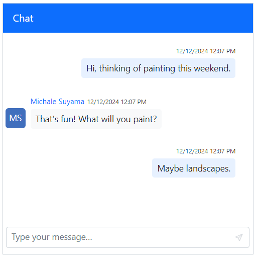

#### Setting text

You can use the [Text](https://help.syncfusion.com/cr/blazor/Syncfusion.Blazor.InteractiveChat.MessageStatusModel.html#Syncfusion_Blazor_InteractiveChat_MessageStatusModel_Text) property to provide information about the messages through descriptive text, providing users with the context of the message.

```cshtml

@using Syncfusion.Blazor.InteractiveChat

<div style="height: 400px; width: 400px;">
    <SfChatUI ID="chatUser" User="CurrentUserModel" Messages="ChatUserMessages"></SfChatUI>
</div>

@code {
    private static UserModel CurrentUserModel = new UserModel() { ID = "User1", User = "Albert" };
    private static UserModel MichaleUserModel = new UserModel() { ID = "User2", User = "Michale Suyama" };
    
    private List<ChatMessage> ChatUserMessages = new List<ChatMessage>()
    {
        new ChatMessage() { Text = "Hi, thinking of painting this weekend.", Author = CurrentUserModel },
        new ChatMessage() { Text = "That’s fun! What will you paint?", Author = MichaleUserModel },
        new ChatMessage() {
            Text = "Maybe landscapes.",
            Author = CurrentUserModel,
            Status= new MessageStatusModel() {
                Text = "Seen"
            }
        }
    };
}

```

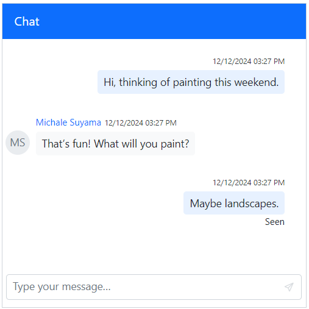

#### Setting tooltip

You can use the [Tooltip](https://help.syncfusion.com/cr/blazor/Syncfusion.Blazor.InteractiveChat.MessageStatusModel.html#Syncfusion_Blazor_InteractiveChat_MessageStatusModel_Tooltip) property to provide information about the messages by tooltips while hovering the status icon, providing users with additional data upon hovering.

```cshtml

@using Syncfusion.Blazor.InteractiveChat

<div style="height: 400px; width: 400px;">
    <SfChatUI ID="chatUser" User="CurrentUserModel" Messages="ChatUserMessages"></SfChatUI>
</div>

@code {
    private static UserModel CurrentUserModel = new UserModel() { ID = "User1", User = "Albert" };
    private static UserModel MichaleUserModel = new UserModel() { ID = "User2", User = "Michale Suyama" };
    
    private List<ChatMessage> ChatUserMessages = new List<ChatMessage>()
    {
        new ChatMessage() { Text = "Hi, thinking of painting this weekend.", Author = CurrentUserModel },
        new ChatMessage() { Text = "That’s fun! What will you paint?", Author = MichaleUserModel },
        new ChatMessage() {
            Text = "Maybe landscapes.",
            Author = CurrentUserModel,
            Status= new MessageStatusModel() {
                IconCss = "e-icons e-chat-seen",
                Tooltip = "Seen"
            }
        }
    };
}

```

### Setting auto scroll

You can use the [AutoScrollToBottom](https://help.syncfusion.com/cr/blazor/Syncfusion.Blazor.InteractiveChat.SfChatUI.html#Syncfusion_Blazor_InteractiveChat_SfChatUI_AutoScrollToBottom) property to automatically scroll the chats when a new message is received in a conversation. By default, the value is false, requires manual scrolling or the FAB button to quick access to the bottom of the view. 

- By default, it scrolls to bottom for each message being sent or when the scroll is maintained at the bottom in the chat, in order to prevent the automatic scroll for different user messages you can use the `AutoScrollToBottom` property.

```cshtml

@using Syncfusion.Blazor.InteractiveChat

<div style="height: 400px; width: 400px;">
    <SfChatUI ID="chatUser" User="CurrentUserModel" AutoScrollToBottom="true" Messages="ChatUserMessages"></SfChatUI>
</div>

@code {
    private static UserModel CurrentUserModel = new UserModel() { ID = "User1", User = "Albert" };
    private static UserModel MichaleUserModel = new UserModel() { ID = "User2", User = "Michale Suyama" };

    private List<ChatMessage> ChatUserMessages = new List<ChatMessage>()
    {
        new ChatMessage() { Text = "Want to get coffee tomorrow?", Author = CurrentUserModel },
        new ChatMessage() { Text = "Sure! What time?", Author = MichaleUserModel },
        new ChatMessage() { Text = "How about 10 AM?", Author = CurrentUserModel },
        new ChatMessage() { Text = "Perfect.", Author = MichaleUserModel },
        new ChatMessage() { Text = "See you!", Author = CurrentUserModel },
        new ChatMessage() { Text = "Bye!", Author = MichaleUserModel }
    };
}

```

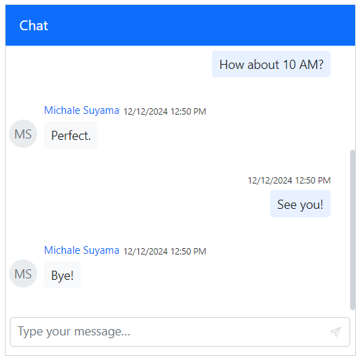

### Setting suggestions 

You can use the [Suggestions](https://help.syncfusion.com/cr/blazor/Syncfusion.Blazor.InteractiveChat.SfChatUI.html#Syncfusion_Blazor_InteractiveChat_SfChatUI_Suggestions) property, to add the suggestions in both initial and on-demand which help users to quick-reply options above the input field.

```cshtml

@using Syncfusion.Blazor.InteractiveChat

<div style="height: 400px; width: 400px;">
    <SfChatUI ID="chatUser" User="CurrentUserModel" Messages="ChatUserMessages" Suggestions="Suggestions"></SfChatUI>
</div>

@code {
    private static UserModel CurrentUserModel = new UserModel() { ID = "User1", User = "Albert" };
    private static UserModel MichaleUserModel = new UserModel() { ID = "User2", User = "Michale Suyama" };
    private List<string> Suggestions = new List<string>() { "Landscapes", "Portrait" };

    private List<ChatMessage> ChatUserMessages = new List<ChatMessage>()
    {
        new ChatMessage() { Text = "Hi, thinking of painting this weekend.", Author = CurrentUserModel },
        new ChatMessage() { Text = "That’s fun! What will you paint?", Author = MichaleUserModel }
    };
}

```

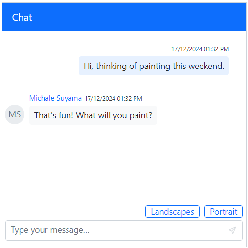
