# Messages in Blazor Chat UI component

The Chat UI allows to add messages using the [Messages](https://help.syncfusion.com/cr/blazor/Syncfusion.Blazor.InteractiveChat.SfChatUI.html#Syncfusion_Blazor_InteractiveChat_SfChatUI_Messages) property. The message collection stores all the messages being sent and received.

## Configure messages

You can use the [Text](https://help.syncfusion.com/cr/blazor/Syncfusion.Blazor.InteractiveChat.ChatMessage.html#Syncfusion_Blazor_InteractiveChat_ChatMessage_Text) property to add message content for the user. Each message can be configured with options such as id, text, author, timestamp, and more.

```cshtml

@using Syncfusion.Blazor.InteractiveChat

<div style="height: 400px; width: 400px;">
    <SfChatUI ID="chatUser" User="CurrentUserModel" Messages="ChatUserMessages"></SfChatUI>
</div>

@code {
    private static UserModel CurrentUserModel = new UserModel() { ID = "User1", User = "Albert" };
    private static UserModel MichaleUserModel = new UserModel() { ID = "User2", User = "Michale Suyama" };

    private List<ChatMessage> ChatUserMessages = new List<ChatMessage>()
    {
        new ChatMessage() { Text = "Hi, thinking of painting this weekend.", Author = CurrentUserModel },
        new ChatMessage() { Text = "That’s fun! What will you paint?", Author = MichaleUserModel },
        new ChatMessage() { Text = "Maybe landscapes.", Author = CurrentUserModel }
    };
}

```

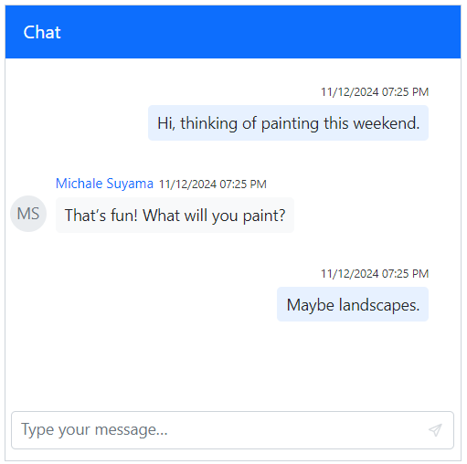

### Define current user

You can use the [Author](https://help.syncfusion.com/cr/blazor/Syncfusion.Blazor.InteractiveChat.ChatMessage.html#Syncfusion_Blazor_InteractiveChat_ChatMessage_Author) property to identify the current user of the chat. Each user can be configured with options such as id, user, avatarUrl, and more.

> You can use the [User](https://help.syncfusion.com/cr/blazor/Syncfusion.Blazor.InteractiveChat.UserModel.html#Syncfusion_Blazor_InteractiveChat_UserModel_User) property to display the user name and [ID](https://help.syncfusion.com/cr/blazor/Syncfusion.Blazor.InteractiveChat.UserModel.html#Syncfusion_Blazor_InteractiveChat_UserModel_ID) property is necessary to differentiate between the multiple users.

```cshtml

@using Syncfusion.Blazor.InteractiveChat

<div style="height: 400px; width: 400px;">
    <SfChatUI ID="chatUser" User="CurrentUserModel" Messages="ChatUserMessages"></SfChatUI>
</div>

@code {
    private static UserModel CurrentUserModel = new UserModel() { ID = "User1", User = "Albert" };
    private static UserModel MichaleUserModel = new UserModel() { ID = "User2", User = "Michale Suyama" };

    private List<ChatMessage> ChatUserMessages = new List<ChatMessage>()
    {
        new ChatMessage() { Text = "Hi, thinking of painting this weekend.", Author = CurrentUserModel },
        new ChatMessage() { Text = "That’s fun! What will you paint?", Author = MichaleUserModel },
        new ChatMessage() { Text = "Maybe landscapes.", Author = CurrentUserModel }
    };
}

```


#### Setting avatar URL

You can use the [AvatarUrl](https://help.syncfusion.com/cr/blazor/Syncfusion.Blazor.InteractiveChat.UserModel.html#Syncfusion_Blazor_InteractiveChat_UserModel_AvatarUrl) property to define the image URL’s for the user avatar. If no URL is provided, fallback initials of the first and last name from the user’s name will be used.

```cshtml

@using Syncfusion.Blazor.InteractiveChat

<div style="height: 400px; width: 400px;">
    <SfChatUI ID="chatUser" User="CurrentUserModel" Messages="ChatUserMessages"></SfChatUI>
</div>

@code {
    private static UserModel CurrentUserModel = new UserModel() { ID = "User1", User = "Albert" };
    private static UserModel MichaleUserModel = new UserModel() { ID = "User2", User = "Michale Suyama", AvatarUrl = "" };//Provide the URL for the image here.
    private List<ChatMessage> ChatUserMessages = new List<ChatMessage>()
    {
        new ChatMessage() { Text = "Hi, thinking of painting this weekend.", Author = CurrentUserModel },
        new ChatMessage() { Text = "That’s fun! What will you paint?", Author = MichaleUserModel },
        new ChatMessage() { Text = "Maybe landscapes.", Author = CurrentUserModel }
    };
}

```

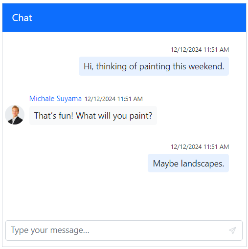

#### Setting avatar background color

You can use the [AvatarBgColor](https://help.syncfusion.com/cr/blazor/Syncfusion.Blazor.InteractiveChat.UserModel.html#Syncfusion_Blazor_InteractiveChat_UserModel_AvatarBgColor) property to set a specific background color for user avatars using hexadecimal values. If no color is set, a custom background color is set based on specified theme.

```cshtml

@using Syncfusion.Blazor.InteractiveChat

<div style="height: 400px; width: 400px;">
    <SfChatUI ID="chatUser" User="CurrentUserModel" Messages="ChatUserMessages"></SfChatUI>
</div>

@code {
    private static UserModel CurrentUserModel = new UserModel() { ID = "User1", User = "Albert" };
    private static UserModel MichaleUserModel = new UserModel() { ID = "User2", User = "Michale Suyama", AvatarBgColor = "#ccc9f7" };
    private List<ChatMessage> ChatUserMessages = new List<ChatMessage>()
    {
        new ChatMessage() { Text = "Hi, thinking of painting this weekend.", Author = CurrentUserModel },
        new ChatMessage() { Text = "That’s fun! What will you paint?", Author = MichaleUserModel },
        new ChatMessage() { Text = "Maybe landscapes.", Author = CurrentUserModel }
    };
}

```

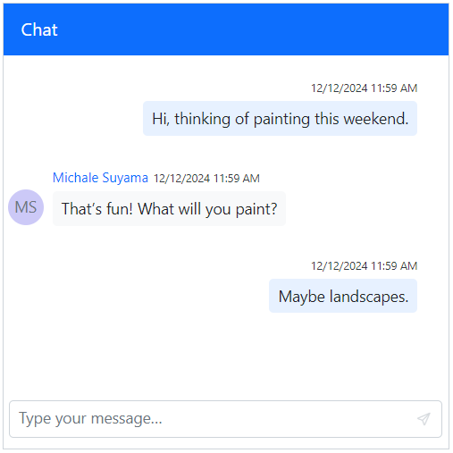

#### Setting CSS class

You can use the [CssClass](https://help.syncfusion.com/cr/blazor/Syncfusion.Blazor.InteractiveChat.UserModel.html#Syncfusion_Blazor_InteractiveChat_UserModel_CssClass) property to customize the appearance of the chat user.

```cshtml

@using Syncfusion.Blazor.InteractiveChat

<div style="height: 400px; width: 400px;">
    <SfChatUI ID="chatUser" User="CurrentUserModel" Messages="ChatUserMessages"></SfChatUI>
</div>

@code {
    private static UserModel CurrentUserModel = new UserModel() { ID = "User1", User = "Albert" };
    private static UserModel MichaleUserModel = new UserModel() { ID = "User2", User = "Michale Suyama", CssClass = "custom-user" };

    private List<ChatMessage> ChatUserMessages = new List<ChatMessage>()
    {
        new ChatMessage() { Text = "Hi, thinking of painting this weekend.", Author = CurrentUserModel },
        new ChatMessage() { Text = "That’s fun! What will you paint?", Author = MichaleUserModel },
        new ChatMessage() { Text = "Maybe landscapes.", Author = CurrentUserModel }
    };
}

<style>
    .e-chat-ui .e-message-icon.custom-user {
        background-color: #416fbd;
        color: white;
        border-radius: 5px;
    }
</style>

```


#### Setting status icon css

You can use the [StatusIconCss](https://help.syncfusion.com/cr/blazor/Syncfusion.Blazor.InteractiveChat.UserModel.html#Syncfusion_Blazor_InteractiveChat_UserModel_StatusIconCss) property to identify the user's presence, including online, offline, busy, and away status in the Chat UI.

The following are the predefined status styles that can be defined using the `StatusIconCss` property.

| Status | Icon class |
| ------------ | -------------- |
| `Available` | `e-user-online` |
| `Away` | `e-user-away` |
| `Busy` | `e-user-busy` |
| `Offline` | `e-user-offline` |

```cshtml
@using Syncfusion.Blazor.InteractiveChat

<div style="height: 400px; width: 400px;">
    <SfChatUI ID="chatUser" User="CurrentUserModel" Messages="ChatUserMessages"></SfChatUI>
</div>

@code {
    private static UserModel CurrentUserModel = new UserModel() { ID = "User1", User = "Albert", StatusIconCss = "e-icons e-user-online" };
    private static UserModel MichaleUserModel = new UserModel() { ID = "User2", User = "Michale Suyama", StatusIconCss = "e-icons e-user-away" };

    private List<ChatMessage> ChatUserMessages = new List<ChatMessage>()
    {
        new ChatMessage() { Text = "Hi Michale, are we on track for the deadline?", Author = CurrentUserModel },
        new ChatMessage() { Text = "Yes, the design phase is complete.", Author = MichaleUserModel },
        new ChatMessage() { Text = "I’ll review it and send feedback by today.", Author = CurrentUserModel }
    };
}

```

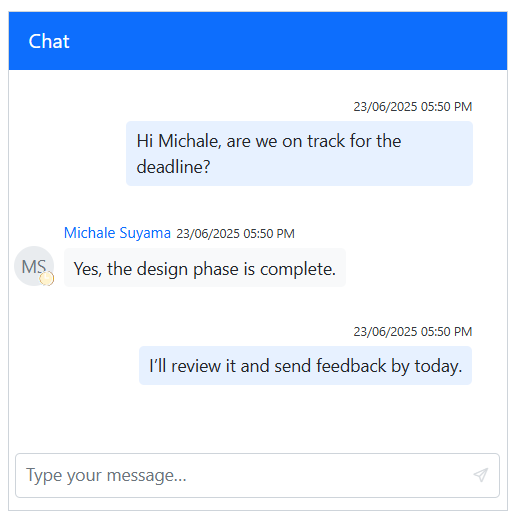

### Define timestamp

You can use the [Timestamp](https://help.syncfusion.com/cr/blazor/Syncfusion.Blazor.InteractiveChat.ChatMessage.html#Syncfusion_Blazor_InteractiveChat_ChatMessage_Timestamp) property to indicate the date and time of each message being sent. By default it is set to the current date and time when the message is sent.

```cshtml

@using Syncfusion.Blazor.InteractiveChat

<div style="height: 400px; width: 400px;">
    <SfChatUI ID="chatUser" User="CurrentUserModel" ShowTimestamp="false" Messages="ChatUserMessages"></SfChatUI>
</div>

@code {
    private static UserModel CurrentUserModel = new UserModel() { ID = "User1", User = "Albert" };
    private static UserModel MichaleUserModel = new UserModel() { ID = "User2", User = "Michale Suyama" };

    private List<ChatMessage> ChatUserMessages = new List<ChatMessage>()
    {
        new ChatMessage() { Text = "Hi, thinking of painting this weekend.", Author = CurrentUserModel, Timestamp = new DateTime(2024,12,25,7,30,0) },
        new ChatMessage() { Text = "That’s fun! What will you paint?", Author = MichaleUserModel, Timestamp = new DateTime(2024,12,25,8,0,0) },
        new ChatMessage() { Text = "Maybe landscapes.", Author = CurrentUserModel, Timestamp = new DateTime(2024,12,25,11,0,0) }
    };
}

```

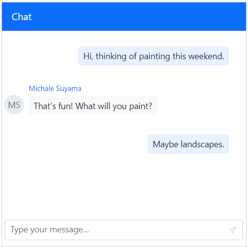

#### Setting timestamp format

You can use the [TimestampFormat](https://help.syncfusion.com/cr/blazor/Syncfusion.Blazor.InteractiveChat.ChatMessage.html#Syncfusion_Blazor_InteractiveChat_ChatMessage_TimestampFormat) to display specific time format for the timestamp. The default format is `dd/MM/yyyy hh:mm tt`, but this can be customized to meet different localization and display needs.

```cshtml

@using Syncfusion.Blazor.InteractiveChat

<div style="height: 400px; width: 400px;">
    <SfChatUI ID="chatUser" User="CurrentUserModel" Messages="ChatUserMessages"></SfChatUI>
</div>

@code {
    private static UserModel CurrentUserModel = new UserModel() { ID = "User1", User = "Albert" };
    private static UserModel MichaleUserModel = new UserModel() { ID = "User2", User = "Michale Suyama" };

    private List<ChatMessage> ChatUserMessages = new List<ChatMessage>()
    {
        new ChatMessage() { Text = "Hi, thinking of painting this weekend.", Author = CurrentUserModel },
        new ChatMessage() { Text = "That’s fun! What will you paint?", Author = MichaleUserModel, TimestampFormat = "MMMM hh:mm tt" },
        new ChatMessage() { Text = "Maybe landscapes.", Author = CurrentUserModel }
    };
}

```

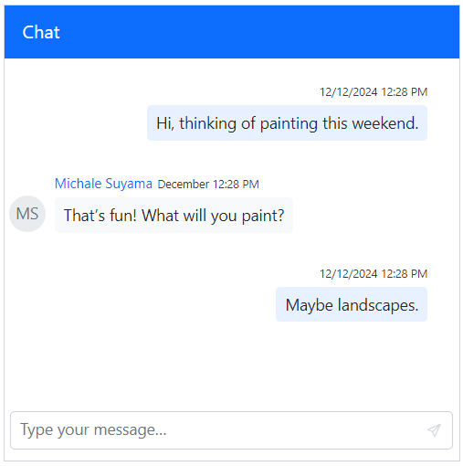

### Define message status

You can use the status property to update the status for the message(e.g., sent, received, read). It helps in managing message delivery and read receipts within the chat interface. 

#### Setting icon CSS

You can use the [IconCss](https://help.syncfusion.com/cr/blazor/Syncfusion.Blazor.InteractiveChat.MessageStatusModel.html#Syncfusion_Blazor_InteractiveChat_MessageStatusModel_IconCss) property to update the styling of status icons associated with messages, aiding visual differentiation between statuses.

```cshtml

@using Syncfusion.Blazor.InteractiveChat

<div style="height: 400px; width: 400px;">
    <SfChatUI ID="chatUser" User="CurrentUserModel" Messages="ChatUserMessages"></SfChatUI>
</div>

@code {
    private static UserModel CurrentUserModel = new UserModel() { ID = "User1", User = "Albert" };
    private static UserModel MichaleUserModel = new UserModel() { ID = "User2", User = "Michale Suyama" };
    
    private List<ChatMessage> ChatUserMessages = new List<ChatMessage>()
    {
        new ChatMessage() { Text = "Hi, thinking of painting this weekend.", Author = CurrentUserModel },
        new ChatMessage() { Text = "That’s fun! What will you paint?", Author = MichaleUserModel },
        new ChatMessage() {
            Text = "Maybe landscapes.",
            Author = CurrentUserModel,
            Status= new MessageStatusModel() {
                IconCss = "e-icons e-chat-seen"
            }
        }
    };
}

```

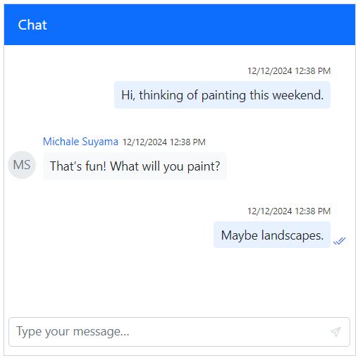

#### Setting text

You can use the [Text](https://help.syncfusion.com/cr/blazor/Syncfusion.Blazor.InteractiveChat.MessageStatusModel.html#Syncfusion_Blazor_InteractiveChat_MessageStatusModel_Text) property to provide information about the messages through descriptive text, providing users with the context of the message.

```cshtml

@using Syncfusion.Blazor.InteractiveChat

<div style="height: 400px; width: 400px;">
    <SfChatUI ID="chatUser" User="CurrentUserModel" Messages="ChatUserMessages"></SfChatUI>
</div>

@code {
    private static UserModel CurrentUserModel = new UserModel() { ID = "User1", User = "Albert" };
    private static UserModel MichaleUserModel = new UserModel() { ID = "User2", User = "Michale Suyama" };
    
    private List<ChatMessage> ChatUserMessages = new List<ChatMessage>()
    {
        new ChatMessage() { Text = "Hi, thinking of painting this weekend.", Author = CurrentUserModel },
        new ChatMessage() { Text = "That’s fun! What will you paint?", Author = MichaleUserModel },
        new ChatMessage() {
            Text = "Maybe landscapes.",
            Author = CurrentUserModel,
            Status= new MessageStatusModel() {
                Text = "Seen"
            }
        }
    };
}

```

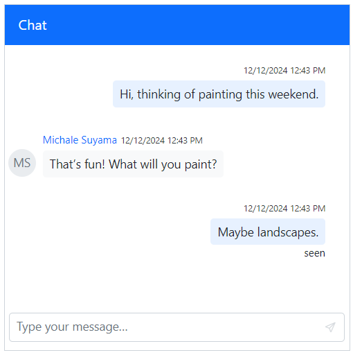

#### Setting tooltip

You can use the [Tooltip](https://help.syncfusion.com/cr/blazor/Syncfusion.Blazor.InteractiveChat.MessageStatusModel.html#Syncfusion_Blazor_InteractiveChat_MessageStatusModel_Tooltip) property to provide information about the messages by tooltips while hovering the status icon, providing users with additional data upon hovering.

```cshtml

@using Syncfusion.Blazor.InteractiveChat

<div style="height: 400px; width: 400px;">
    <SfChatUI ID="chatUser" User="CurrentUserModel" Messages="ChatUserMessages"></SfChatUI>
</div>

@code {
    private static UserModel CurrentUserModel = new UserModel() { ID = "User1", User = "Albert" };
    private static UserModel MichaleUserModel = new UserModel() { ID = "User2", User = "Michale Suyama" };
    
    private List<ChatMessage> ChatUserMessages = new List<ChatMessage>()
    {
        new ChatMessage() { Text = "Hi, thinking of painting this weekend.", Author = CurrentUserModel },
        new ChatMessage() { Text = "That’s fun! What will you paint?", Author = MichaleUserModel },
        new ChatMessage() {
            Text = "Maybe landscapes.",
            Author = CurrentUserModel,
            Status= new MessageStatusModel() {
                IconCss = "e-icons e-chat-seen",
                Tooltip = "Seen"
            }
        }
    };
}

```

### Setting pinned

You can use the [IsPinned](https://help.syncfusion.com/cr/blazor/Syncfusion.Blazor.InteractiveChat.ChatMessage.html#Syncfusion_Blazor_InteractiveChat_ChatMessage_IsPinned) property to highlight the important message in the chat. Once a message is pinned, you can access the options menu to continue the chat or unpin it.

```cshtml

@using Syncfusion.Blazor.InteractiveChat

<div style="height: 400px; width: 400px;">
    <SfChatUI ID="chatUser" User="CurrentUserModel" Messages="ChatUserMessages"></SfChatUI>
</div>

@code {
    private static UserModel CurrentUserModel = new UserModel() { ID = "User1", User = "Albert" };
    private static UserModel MichaleUserModel = new UserModel() { ID = "User2", User = "Michale Suyama" };

    private List<ChatMessage> ChatUserMessages = new List<ChatMessage>()
    {
        new ChatMessage() { Text = "Hi Michale, are we on track for the deadline?", Author = CurrentUserModel },
        new ChatMessage() { Text = "Yes, the design phase is complete.", Author = MichaleUserModel },
        new ChatMessage() { Text = "I’ll review it and send feedback by today.", Author = CurrentUserModel, IsPinned = true }
    };
}

```

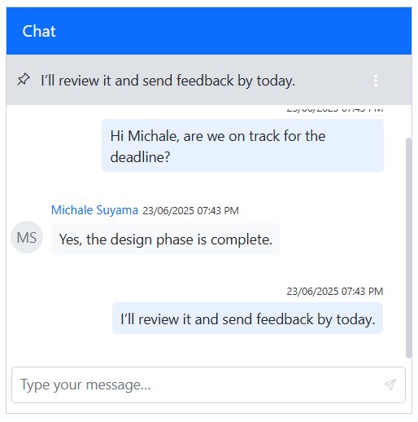

### Setting reply to

You can use the [RepliedTo](https://help.syncfusion.com/cr/blazor/Syncfusion.Blazor.InteractiveChat.ChatMessage.html#Syncfusion_Blazor_InteractiveChat_ChatMessage_RepliedTo) property to respond to the original message preserving context and creating a threaded conversation.

```cshtml

@using Syncfusion.Blazor.InteractiveChat

<div style="height: 400px; width: 400px;">
    <SfChatUI ID="chatUser" User="CurrentUserModel" Messages="ChatUserMessages"></SfChatUI>
</div>

@code {
    private static UserModel CurrentUserModel = new UserModel() { ID = "User1", User = "Albert" };
    private static UserModel MichaleUserModel = new UserModel() { ID = "User2", User = "Michale Suyama" };

    private List<ChatMessage> ChatUserMessages = new List<ChatMessage>()
    {
        new ChatMessage() { Text = "Hi Michale, are we on track for the deadline?", Author = CurrentUserModel, ID = "msg1" },
        new ChatMessage() { Text = "Yes, the design phase is complete.", Author = MichaleUserModel, ID = "msg2" },
        new ChatMessage() {
            Text = "I’ll review it and send feedback by today.",
            Author = CurrentUserModel,
            ID = "msg3",
            RepliedTo = new MessageReplyModel()
            {
                Text = "Yes, the design phase is complete.",
                User = MichaleUserModel,
                MessageID = "msg2"
            }
        }
    };
}

```

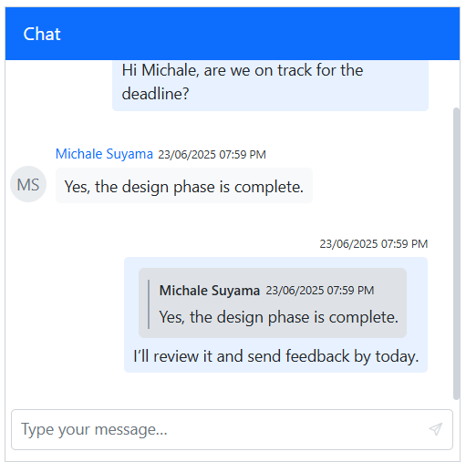

### Setting forward

You can use the [IsForwarded](https://help.syncfusion.com/cr/blazor/Syncfusion.Blazor.InteractiveChat.ChatMessage.html#Syncfusion_Blazor_InteractiveChat_ChatMessage_IsForwarded) property to specify the user when the message is forwarded.

```cshtml

@using Syncfusion.Blazor.InteractiveChat

<div style="height: 400px; width: 400px;">
    <SfChatUI ID="chatUser" User="CurrentUserModel" Messages="ChatUserMessages"></SfChatUI>
</div>

@code {
    private static UserModel CurrentUserModel = new UserModel() { ID = "User1", User = "Albert" };
    private static UserModel MichaleUserModel = new UserModel() { ID = "User2", User = "Michale Suyama" };

    private List<ChatMessage> ChatUserMessages = new List<ChatMessage>()
    {
        new ChatMessage() { Text = "Hi Michale, are we on track for the deadline?", Author = CurrentUserModel },
        new ChatMessage() { Text = "Yes, the design phase is complete.", Author = MichaleUserModel },
        new ChatMessage() { Text = "I’ll review it and send feedback by today.", Author = CurrentUserModel, IsForwarded = true }
    };
}

```

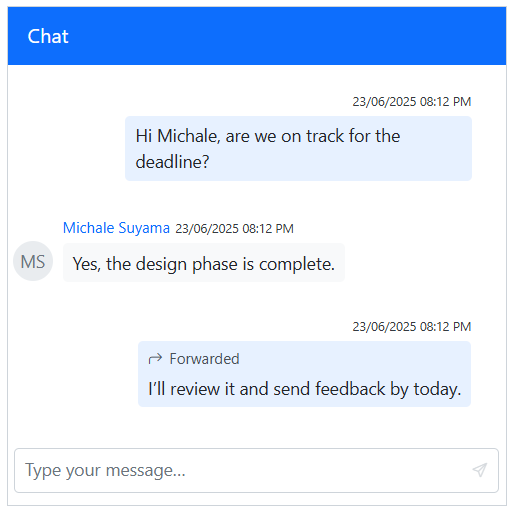

### Setting auto scroll

You can use the [AutoScrollToBottom](https://help.syncfusion.com/cr/blazor/Syncfusion.Blazor.InteractiveChat.SfChatUI.html#Syncfusion_Blazor_InteractiveChat_SfChatUI_AutoScrollToBottom) property to automatically scroll the chats when a new message is received in a conversation. By default, the value is false, requires manual scrolling or the FAB button to quick access to the bottom of the view. 

- By default, it scrolls to bottom for each message being sent or when the scroll is maintained at the bottom in the chat, in order to prevent the automatic scroll for different user messages you can use the `AutoScrollToBottom` property.

```cshtml

@using Syncfusion.Blazor.InteractiveChat

<div style="height: 400px; width: 400px;">
    <SfChatUI ID="chatUser" User="CurrentUserModel" AutoScrollToBottom="true" Messages="ChatUserMessages"></SfChatUI>
</div>

@code {
    private static UserModel CurrentUserModel = new UserModel() { ID = "User1", User = "Albert" };
    private static UserModel MichaleUserModel = new UserModel() { ID = "User2", User = "Michale Suyama" };

    private List<ChatMessage> ChatUserMessages = new List<ChatMessage>()
    {
        new ChatMessage() { Text = "Want to get coffee tomorrow?", Author = CurrentUserModel },
        new ChatMessage() { Text = "Sure! What time?", Author = MichaleUserModel },
        new ChatMessage() { Text = "How about 10 AM?", Author = CurrentUserModel },
        new ChatMessage() { Text = "Perfect.", Author = MichaleUserModel },
        new ChatMessage() { Text = "See you!", Author = CurrentUserModel },
        new ChatMessage() { Text = "Bye!", Author = MichaleUserModel }
    };
}

```

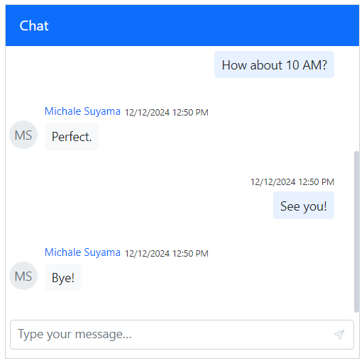

### Setting suggestions 

You can use the [Suggestions](https://help.syncfusion.com/cr/blazor/Syncfusion.Blazor.InteractiveChat.SfChatUI.html#Syncfusion_Blazor_InteractiveChat_SfChatUI_Suggestions) property, to add the suggestions in both initial and on-demand which help users to quick-reply options above the input field.

```cshtml

@using Syncfusion.Blazor.InteractiveChat

<div style="height: 400px; width: 400px;">
    <SfChatUI ID="chatUser" User="CurrentUserModel" Messages="ChatUserMessages" Suggestions="Suggestions"></SfChatUI>
</div>

@code {
    private static UserModel CurrentUserModel = new UserModel() { ID = "User1", User = "Albert" };
    private static UserModel MichaleUserModel = new UserModel() { ID = "User2", User = "Michale Suyama" };
    private List<string> Suggestions = new List<string>() { "Landscapes", "Portrait" };

    private List<ChatMessage> ChatUserMessages = new List<ChatMessage>()
    {
        new ChatMessage() { Text = "Hi, thinking of painting this weekend.", Author = CurrentUserModel },
        new ChatMessage() { Text = "That’s fun! What will you paint?", Author = MichaleUserModel }
    };
}

```

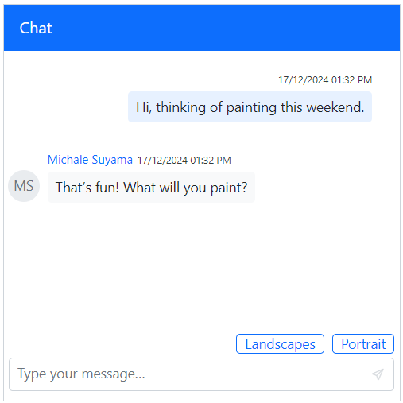

## Setting compact mode

You can use the `EnableCompactMode` property to align all messages to the left in the chat for creating a streamlined layout ideal for group conversations or space-constrained interfaces. By default, the value is `false`.

```cshtml

@using Syncfusion.Blazor.InteractiveChat

<div style="height: 400px; width: 400px;">
    <SfChatUI ID="chatUser" User="CurrentUserModel" Messages="ChatUserMessages" EnableCompactMode="true"></SfChatUI>
</div>

@code {
    private static UserModel CurrentUserModel = new UserModel() { ID = "User1", User = "Albert" };
    private static UserModel MichaleUserModel = new UserModel() { ID = "User2", User = "Michale Suyama" };

    private List<ChatMessage> ChatUserMessages = new List<ChatMessage>()
    {
        new ChatMessage() { Text = "Hi Michale, are we on track for the deadline?", Author = CurrentUserModel },
        new ChatMessage() { Text = "Yes, the design phase is complete.", Author = MichaleUserModel },
        new ChatMessage() { Text = "I’ll review it and send feedback by today.", Author = CurrentUserModel }
    };
}

```

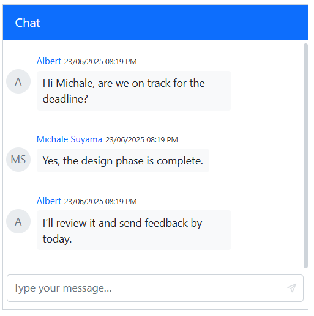

## Configure message options

You can customize the message toolbar items by using the `MessageToolbar`, `MessageToolbarItem` tag directives for richer chat experience in the Chat UI. By default, the message options available are `Copy`, `Reply`, `Pin`, and `Delete`.

### Copying a message

You can copy the message item to quickly duplicate the message, by using the toolbar copy icon in the message options.

### Deleting a message

You can delete a message item to remove it from the chat conversation, by using the toolbar trash icon in the message options.

### Setting width

You can use the `Width` property to set width of the `MessageToolbar` tag directive of Chat UI. By default, the value is `100%`.

```cshtml

@using Syncfusion.Blazor.InteractiveChat

<div style="height: 400px; width: 400px;">
    <SfChatUI ID="chatUser" User="CurrentUserModel" Messages="ChatUserMessages">
        <ChildContent>
            <MessageToolbar Width="50%">
            </MessageToolbar>
        </ChildContent>
    </SfChatUI>
</div>

@code {
    private static UserModel CurrentUserModel = new UserModel() { ID = "User1", User = "Albert" };
    private static UserModel MichaleUserModel = new UserModel() { ID = "User2", User = "Michale Suyama" };

    private List<ChatMessage> ChatUserMessages = new List<ChatMessage>()
    {
        new ChatMessage() { Text = "Hi Michale, are we on track for the deadline?", Author = CurrentUserModel },
        new ChatMessage() { Text = "Yes, the design phase is complete.", Author = MichaleUserModel },
        new ChatMessage() { Text = "I’ll review it and send feedback by today.", Author = CurrentUserModel }
    };
}

```

### Setting items

You can use the `MessageToolbarItem` tag directive to specify the toolbar item in the `MessageToolbar` of Chat UI.

```cshtml

@using Syncfusion.Blazor.InteractiveChat

<div style="height: 400px; width: 400px;">
    <SfChatUI ID="chatUser" User="CurrentUserModel" Messages="ChatUserMessages">
        <ChildContent>
            <MessageToolbar>
                <MessageToolbarItem IconCss="e-icons e-chat-forward" Tooltip="Forward"></MessageToolbarItem>
                <MessageToolbarItem IconCss="e-icons e-chat-copy" Tooltip="Copy"></MessageToolbarItem>
                <MessageToolbarItem IconCss="e-icons e-chat-reply" Tooltip="Reply"></MessageToolbarItem>
                <MessageToolbarItem IconCss="e-icons e-chat-pin" Tooltip="Pin"></MessageToolbarItem>
                <MessageToolbarItem IconCss="e-icons e-chat-trash" Tooltip="Delete"></MessageToolbarItem>
            </MessageToolbar>
        </ChildContent>
    </SfChatUI>
</div>

@code {
    private static UserModel CurrentUserModel = new UserModel() { ID = "User1", User = "Albert" };
    private static UserModel MichaleUserModel = new UserModel() { ID = "User2", User = "Michale Suyama" };

    private List<ChatMessage> ChatUserMessages = new List<ChatMessage>()
    {
        new ChatMessage() { Text = "Hi Michale, are we on track for the deadline?", Author = CurrentUserModel },
        new ChatMessage() { Text = "Yes, the design phase is complete.", Author = MichaleUserModel },
        new ChatMessage() { Text = "I’ll review it and send feedback by today.", Author = CurrentUserModel }
    };
}

```

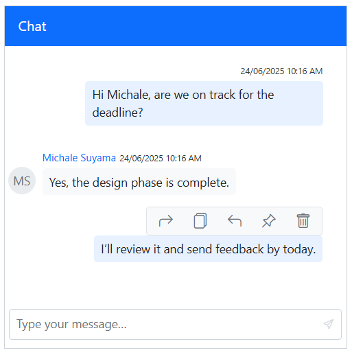

### Setting itemClick

You can use the `itemClicked` event when the toolbar item is clicked in the `MessageToolbar` of Chat UI.

```cshtml

@using Syncfusion.Blazor.InteractiveChat

<div style="height: 400px; width: 400px;">
    <SfChatUI @ref="ChatUIInstance" ID="chatUser" User="CurrentUserModel" Messages="ChatUserMessages">
        <ChildContent>
            <MessageToolbar ItemClicked="MessageToolbarClicked">
                <MessageToolbarItem IconCss="e-icons e-chat-forward" Tooltip="Forward"></MessageToolbarItem>
                <MessageToolbarItem IconCss="e-icons e-chat-copy" Tooltip="Copy"></MessageToolbarItem>
                <MessageToolbarItem IconCss="e-icons e-chat-reply" Tooltip="Reply"></MessageToolbarItem>
                <MessageToolbarItem IconCss="e-icons e-chat-pin" Tooltip="Pin"></MessageToolbarItem>
                <MessageToolbarItem IconCss="e-icons e-chat-trash" Tooltip="Delete"></MessageToolbarItem>
            </MessageToolbar>
        </ChildContent>
    </SfChatUI>
</div>

@code {
    private static UserModel CurrentUserModel = new UserModel() { ID = "User1", User = "Albert" };
    private static UserModel MichaleUserModel = new UserModel() { ID = "User2", User = "Michale Suyama" };
    private SfChatUI ChatUIInstance { get; set; }

    private void MessageToolbarClicked(MessageToolbarItemClickedEventArgs args)
    {
        if (args.Item.IconCss == "e-icons e-chat-forward")
        {
            var newMessageObj = new ChatMessage()
            {
                Text = args.Message.Text,
                ID = "chat-message-" + (ChatUIInstance.Messages.Count + 1).ToString(),
                Author = args.Message.Author,
                IsForwarded = true,
                Status = args.Message.Status,
                Timestamp = args.Message.Timestamp,
                TimestampFormat = args.Message.TimestampFormat,
                IsPinned = args.Message.IsPinned,
                RepliedTo = args.Message.RepliedTo
            };
            ChatUIInstance.Messages.Add(newMessageObj);
        }
    }
    private List<ChatMessage> ChatUserMessages = new List<ChatMessage>()
    {
        new ChatMessage() { Text = "Hi Michale, are we on track for the deadline?", Author = CurrentUserModel },
        new ChatMessage() { Text = "Yes, the design phase is complete.", Author = MichaleUserModel },
        new ChatMessage() { Text = "I’ll review it and send feedback by today.", Author = CurrentUserModel }
    };
}

```
## Displaying the markdown content

The Syncfusion ChatUI supports `Markdown` formatting for messages, enabling rich text capabilities such as bold, italic, links, and more.

### Prerequisites

- `Markdig` for parsing Markdown (installed via NuGet):

  ```bash
  
  dotnet add package Markdig

  ```

### Supported markdown formats

The ChatUI leverages the `Markdig` library to support the following Markdown formats:

- **Bold**: ** text ** or __ text __ 
- *Italic*: * text * or _ text _ 
- [Links](url): [Link text] (url)
- Lists: - Item or 1. item
- Code: 'code' or code 

For full list refer to the  [Markdig documentation](https://www.nuget.org/packages/Markdig).

### Configuring Markdown

By integrating the [Markdig](https://www.nuget.org/packages/Markdig) library, you can parse Markdown text to enhance the chat experience. The [Text](https://help.syncfusion.com/cr/blazor/Syncfusion.Blazor.InteractiveChat.ChatMessage.html#Syncfusion_Blazor_InteractiveChat_ChatMessage_Text) property of each message can accept HTML generated from Markdown, allowing for formatted text display.

```cshtml

@using Syncfusion.Blazor.InteractiveChat
@using Markdig

<div class="control-section chat-ui">
    <div class="markdown-chatui">
        <SfChatUI @ref="ChatUI"
                  User="@currentUserModel"
                  Messages="@chatMessages"
                  HeaderText="@headerText"
                  Suggestions="@(suggestions.Select(s => s.DisplayText).ToList())"
                  MessageSend="HandleMessageSend"
                  ShowTimeBreak="true">
        </SfChatUI>
    </div>
</div>

<style>
    .markdown-chatui {
        height: 380px;
        width: 450px;
        margin: 0 auto;
    }
     .markdown-chatui p {
        margin: 0;
        display: inline-block;
    }
    @@media only screen and (max-width: 850px) {
        .markdown-chatui {
            width: 80%;
        }
    }
</style>

@code {
    private SfChatUI ChatUI { get; set; }
    private string headerText = "Chat UI with Markdown";
    private UserModel currentUserModel =  GetMarkdownUser("user1", "Albert");
    private UserModel michaleUserModel =  GetMarkdownUser("user2", "Michale Suyama");
    private List<ChatMessage> chatMessages = new List<ChatMessage>();
    private List<Suggestion> suggestions = new List<Suggestion>
    {
        new Suggestion
        {
            DisplayText = "Share quick link",
            MarkdownText = "Check out our [project dashboard](https://dashboard.example.com) for updates!"
        },
        new Suggestion
        {
            DisplayText = "Emphasize priority",
            MarkdownText = "This is **high priority** and needs _immediate attention_."
        }
    };

    protected override void OnInitialized()
    {
        chatMessages.Add(new ChatMessage
            {
                Author = currentUserModel,
                Text = RenderMarkdown("Hey Michale, did you review the _new API documentation_?"),
                Timestamp = DateTime.UtcNow.AddMinutes(-5)
            });
        chatMessages.Add(new ChatMessage
            {
                Author = michaleUserModel,
                Text = RenderMarkdown("Yes! The **endpoint specifications** look great. Check the [integration guide](https://api.example.com/docs) when you get a chance."),
                Timestamp = DateTime.UtcNow.AddMinutes(-5)
            });
    }

    private async Task HandleMessageSend(ChatMessageSendEventArgs args)
    {
        if (string.IsNullOrEmpty(args.Message.Text))
        {
            return;
        }
        args.Cancel = true; 
        var suggestion = suggestions.FirstOrDefault(s => s.DisplayText == args.Message.Text);
        var messageText = suggestion != null ? suggestion.MarkdownText : args.Message.Text;

        var newMessage = new ChatMessage
            {
                Text = RenderMarkdown(messageText),
                Author = currentUserModel,
                Timestamp = DateTime.Now
            };

        chatMessages.Add(newMessage);
        await InvokeAsync(StateHasChanged); 
    }

    private string RenderMarkdown(string markdownText)
    {
        var pipeline = new MarkdownPipelineBuilder().UseAdvancedExtensions().Build();
        return Markdig.Markdown.ToHtml(markdownText, pipeline);
    }

    public static UserModel GetMarkdownUser(string Id, string Username)
    {
        return new UserModel()
            {
                ID = Id,
                User = Username
            };
    }

    private class Suggestion
    {
        public string DisplayText { get; set; } = string.Empty;
        public string MarkdownText { get; set; } = string.Empty;
    }
}

```

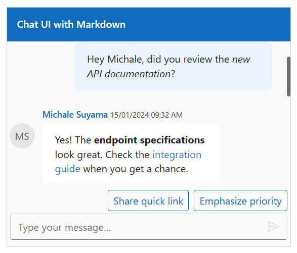