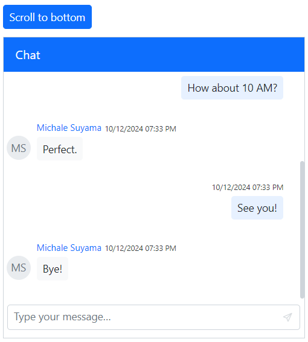

# Methods in Blazor Chat UI component

## Edit message

The [UpdateMessageAsync](https://help.syncfusion.com/cr/blazor/Syncfusion.Blazor.InteractiveChat.SfChatUI.html#Syncfusion_Blazor_InteractiveChat_SfChatUI_UpdateMessageAsync_Syncfusion_Blazor_InteractiveChat_ChatMessage_System_String_) method programmatically updates a message in the chat history. To identify the message to be modified, its unique ID must be provided. This is useful for implementing features like editing or correcting sent messages.

```cshtml

<div style="height: 400px; width: 400px;">
    <button @onclick="UpdateMessage" class="e-btn e-primary" style="margin-bottom: 10px">Update Message</button>
    <SfChatUI @ref="@ChatUser" ID="chatUser" User="CurrentUserModel" Messages="ChatUserMessages"></SfChatUI>
</div>

@code {
    private SfChatUI ChatUser;
    private static UserModel CurrentUserModel = new UserModel() { ID = "User1", User = "Albert" };
    private static UserModel MichaleUserModel = new UserModel() { ID = "User2", User = "Michale Suyama" };

    private List<ChatMessage> ChatUserMessages = new List<ChatMessage>()
    {
        new ChatMessage() { ID = "msg1", Text = "Hi, thinking of painting this weekend.", Author = CurrentUserModel },
        new ChatMessage() { Text = "That’s fun! What will you paint?", Author = MichaleUserModel },
        new ChatMessage() { Text = "Maybe landscapes.", Author = CurrentUserModel }
    };

    private async void UpdateMessage()
    {
        await ChatUser.UpdateMessageAsync(new ChatMessage() { Text = "Hi Michale, thinking of painting today.", Author = CurrentUserModel }, "msg1");
    }
}

```


## Scroll to bottom

The [ScrollToBottomAsync](https://help.syncfusion.com/cr/blazor/Syncfusion.Blazor.InteractiveChat.SfChatUI.html#Syncfusion_Blazor_InteractiveChat_SfChatUI_ScrollToBottomAsync) method programmatically scrolls the chat view to the most recent message. This ensures that newly added content is immediately visible to the user.

```cshtml

@using Syncfusion.Blazor.InteractiveChat

<div style="height: 400px; width: 400px;">
    <button @onclick="ScrollToBottom" class="e-btn e-primary" style="margin-bottom: 10px">Scroll to bottom</button>
    <SfChatUI @ref="@ChatUser" ID="chatUser" User="CurrentUserModel" Messages="ChatUserMessages"></SfChatUI>
</div>

@code {
    private SfChatUI ChatUser;
    private static UserModel CurrentUserModel = new UserModel() { ID = "User1", User = "Albert" };
    private static UserModel MichaleUserModel = new UserModel() { ID = "User2", User = "Michale Suyama" };

    private List<ChatMessage> ChatUserMessages = new List<ChatMessage>()
    {
        new ChatMessage() { Text = "Want to get coffee tomorrow?", Author = CurrentUserModel },
        new ChatMessage() { Text = "Sure! What time?", Author = MichaleUserModel },
        new ChatMessage() { Text = "How about 10 AM?", Author = CurrentUserModel },
        new ChatMessage() { Text = "Perfect.", Author = MichaleUserModel },
        new ChatMessage() { Text = "See you!", Author = CurrentUserModel },
        new ChatMessage() { Text = "Bye!", Author = MichaleUserModel }
    };

    private async void ScrollToBottom()
    {
        await ChatUser.ScrollToBottomAsync();
    }
}

```


