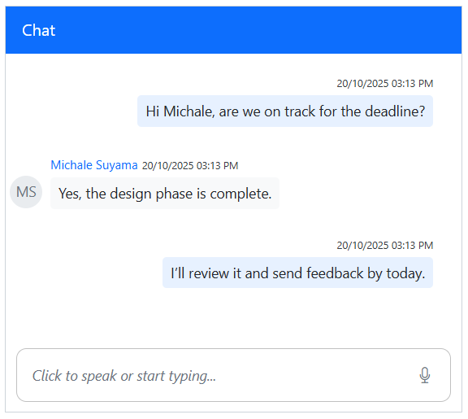

# Speech-to-Text in Blazor Chat UI

The Syncfusion Blazor Chat UI component integrates `Speech-to-Text` functionality through the browser's [Web Speech API](https://developer.mozilla.org/en-US/docs/Web/API/Web_Speech_API). This enables the conversion of spoken words into text using the device's microphone, allowing users to interact with the Chat UI through voice input.

## Configure Speech-to-Text

To enable Speech-to-Text functionality in the Blazor Chat UI component, update the `Home.razor` file to incorporate the Web Speech API.

The [SpeechToText](https://blazor.syncfusion.com/documentation/speech-to-text/getting-started-web-app) component listens to audio input from the device’s microphone, transcribes spoken words into text, and updates the Chat UI’s editable footer with the recognized text. Once the transcription appears in the footer, users can send it as a message to others.

### Configuration Options

* **[`Language`](https://help.syncfusion.com/cr/blazor/Syncfusion.Blazor.Inputs.SfSpeechToText.html#Syncfusion_Blazor_Inputs_SfSpeechToText_Language)**: Specifies the language for speech recognition. For example:

    * `en-US` for American English
    * `fr-FR` for French

* **[`AllowInterimResults`](https://help.syncfusion.com/cr/blazor/Syncfusion.Blazor.Inputs.SfSpeechToText.html#Syncfusion_Blazor_Inputs_SfSpeechToText_AllowInterimResults)**: Set to `true` to receive real-time (interim) recognition results, or `false` to receive only final results.

The `speechtotext.js` file handles operations related to the content of the editable footer, such as checking for meaningful input, clearing existing text, and updating the content with the transcribed value. Meanwhile, the `speechtotext.css` file styles the Chat UI layout and ensures the component remains responsive across different screen sizes and devices.




@using Syncfusion.Blazor.InteractiveChat
@using Syncfusion.Blazor.Buttons
@using Syncfusion.Blazor.Inputs
@inject IJSRuntime JSRuntime

    <SfChatUI @ref="chatUI" ID="chatUser" AutoScrollToBottom=true User="CurrentUserModel" Messages="ChatUserMessages">
        <FooterTemplate>
            

                
@ChatUIFooterValue

                

                    <SfSpeechToText ID="speechToText" TranscriptChanging="@OnTranscriptChange" SpeechRecognitionStopped="@HandleStopRecognition"
                    CssClass="@($"e-flat {SpeechToTextCssClass}")" Disabled="@DisabledState"></SfSpeechToText>
                    <SfButton ID="chatui-sendButton" IconCss="e-assist-send e-icons" CssClass="@ButtonCssClass" @onclick="SendButtonClicked"></SfButton>
                

            

        </FooterTemplate>
    </SfChatUI>

@code {
    private SfChatUI chatUI;
    private static UserModel CurrentUserModel = new UserModel() { ID = "User1", User = "Albert" };
    private static UserModel MichaleUserModel = new UserModel() { ID = "User2", User = "Michale Suyama" };
    private string ChatUIFooterValue = String.Empty;
    private ElementReference EditableDiv;
    private string FooterContent = String.Empty;
    private string SpeechToTextCssClass = "visible";
    private string ButtonCssClass = String.Empty;
    private bool DisabledState = false;

    private List<ChatMessage> ChatUserMessages = new List<ChatMessage>()
    {
        new ChatMessage() { Text = "Hi Michale, are we on track for the deadline?", Author = CurrentUserModel },
        new ChatMessage() { Text = "Yes, the design phase is complete.", Author = MichaleUserModel },
        new ChatMessage() { Text = "I’ll review it and send feedback by today.", Author = CurrentUserModel }
    };

    private async void OnTranscriptChange(TranscriptChangeEventArgs args)
    {
        ChatUIFooterValue = args.Transcript;
        await JSRuntime.InvokeVoidAsync("updateContentEditableDiv", EditableDiv, ChatUIFooterValue);
        await InvokeAsync(StateHasChanged);
    }
    private async Task UpdateContent()
    {
        FooterContent = await JSRuntime.InvokeAsync<String>("isFooterContainsValue", EditableDiv);
        ToggleVisibility();
    }
    private async Task HandleStopRecognition()
    {
        FooterContent = ChatUIFooterValue;
        ToggleVisibility();
        await InvokeAsync(StateHasChanged);
    }
    private void ToggleVisibility()
    {
        ButtonCssClass = string.IsNullOrWhiteSpace(FooterContent) ? "" : "visible";
        SpeechToTextCssClass = string.IsNullOrWhiteSpace(FooterContent) ? "visible" : "";
    }

    private async Task SendButtonClicked()
    {
        chatUI.Messages.Add(new ChatMessage() { Text = FooterContent, Author = CurrentUserModel });
        ChatUIFooterValue = String.Empty;
        await JSRuntime.InvokeVoidAsync("emptyFooterValue", EditableDiv);
        await UpdateContent();
        ToggleVisibility();
    }
    private async Task OnKeyDown(KeyboardEventArgs e)
    {
        if (e.Key == "Enter" && !e.ShiftKey)
        {
            await SendButtonClicked();
        }
    }
}





// Checks if the content editable element contains meaningful text and cleans up.
function isFooterContainsValue(elementref) {
    if (!elementref.innerText.trim() !== '') {
        if ((elementref.innerHTML === ' ' || elementref.innerHTML.trim() === '')) {
            elementref.innerHTML = '';
        }
    }
    return elementref.innerText || "";
}
// Clears the text content of a content editable element.
function emptyFooterValue(elementref) {
    if (elementref) {
        elementref.innerText = "";
    }
}
// Updates the text content of a content editable element with a specified value.
function updateContentEditableDiv(element, value) {
    if (element) {
        element.innerText = value;
    }
}





.integration-speechtotext {
  height: 400px;
  width: 450px;
  margin: 0 auto;
}

.integration-speechtotext #chatui-sendButton {
  width: 40px;
  height: 40px;
  font-size: 15px;
  border: none;
  background: none;
  cursor: pointer;
}

.integration-speechtotext #speechToText.visible,
.integration-speechtotext #chatui-sendButton.visible {
  display: inline-block;
}

.integration-speechtotext #speechToText,
.integration-speechtotext #chatui-sendButton {
  display: none;
}

@@media only screen and (max-width: 750px) {
  .integration-speechtotext {
    width: 100%;
  }
}

.integration-speechtotext .e-footer-wrapper {
  display: flex;
  border: 1px solid #c1c1c1;
  margin: 5px 5px 0 5px;
  border-radius: 10px;
  padding: 5px;
}

.integration-speechtotext .content-editor {
  width: 100%;
  overflow-y: auto;
  font-size: 14px;
  min-height: 20px;
  max-height: 150px;
  padding: 10px;
}

.integration-speechtotext .content-editor[contentEditable='true']:empty:before {
  content: attr(placeholder);
  color: #6b7280;
  font-style: italic;
}

.integration-speechtotext .option-container {
  align-self: flex-end;
}





## Error Handling

The `SpeechToText` component provides events to handle errors that may occur during speech recognition. For more information, refer to the [Error Handling](https://blazor.syncfusion.com/documentation/speech-to-text/speech-recognition#error-handling) section in the documentation.

## Browser Compatibility

The `SpeechToText` component relies on the [Speech Recognition API](https://developer.mozilla.org/en-US/docs/Web/API/SpeechRecognition), which has limited browser support. Refer to the [Browser Compatibility](https://blazor.syncfusion.com/documentation/speech-to-text/speech-recognition#browser-support) section for detailed information.

## See Also

* [Messages](./messages)
