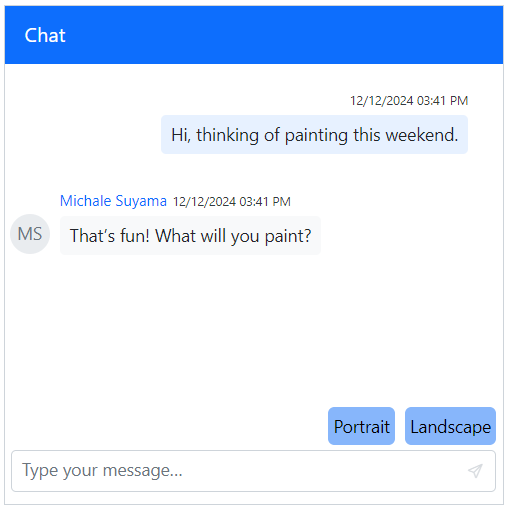

# Templates in Blazor Chat UI component

The Chat UI component offers several templates for customizing the appearance of the message interface, typing indicator, and footer. These templates provide the flexibility to create a unique and personalized chat experience.

## Empty chat template

The [EmptyChatTemplate](https://help.syncfusion.com/cr/blazor/Syncfusion.Blazor.InteractiveChat.SfChatUI.html#Syncfusion_Blazor_InteractiveChat_SfChatUI_EmptyChatTemplate) allows for the customization of the chat interface when no messages are displayed. Personalized content, such as a welcome message or an image, can be added to create an engaging experience for users starting a conversation.

```cshtml

@using Syncfusion.Blazor.InteractiveChat

<div style="height: 400px; width: 400px;">
    <SfChatUI>
        <EmptyChatTemplate>
            <div class="empty-chat-text">
                <h4><span class="e-icons e-comment-show"></span></h4>
                <h4>No Messages Yet</h4>
                <p>Start a conversation to see your messages here.</p>
            </div>
        </EmptyChatTemplate>
    </SfChatUI>
</div>

<style>
    .empty-chat-text {
        font-size: 15px;
        text-align: center;
        margin-top: 90px;
    }
</style>

```


## Message template

Customize the appearance of each chat message using the [MessageTemplate](https://help.syncfusion.com/cr/blazor/Syncfusion.Blazor.InteractiveChat.SfChatUI.html#Syncfusion_Blazor_InteractiveChat_SfChatUI_MessageTemplate) tag. This allows for modifying text styling, layout, and other design elements to ensure a personalized chat experience. The template context includes `Message` and `Index` items.

```cshtml

@using Syncfusion.Blazor.InteractiveChat

<div class="template-chatui" style="height: 400px; width: 400px;">
    <SfChatUI ID="chatUser" User="CurrentUserModel" Messages="ChatUserMessages">
        <MessageTemplate>
            <div class="message-items e-card">
                <div class="message-text">@((MarkupString)context.Message.Text)</div>
            </div>
        </MessageTemplate>
    </SfChatUI>
</div>

@code {
    private static UserModel CurrentUserModel = new UserModel() { ID = "User1", User = "Albert" };
    private static UserModel MichaleUserModel = new UserModel() { ID = "User2", User = "Michale Suyama" };

    private List<ChatMessage> ChatUserMessages = new List<ChatMessage>()
    {
        new ChatMessage() { Text = "Hi, thinking of painting this weekend.", Author = CurrentUserModel },
        new ChatMessage() { Text = "That’s fun! What will you paint?", Author = MichaleUserModel },
        new ChatMessage() { Text = "Maybe landscapes.", Author = CurrentUserModel }
    };
}

<style>
    .template-chatui .e-right .message-items {
        border-radius: 16px 16px 2px 16px;
        background-color: #c5ffbf;
    }

    .template-chatui .e-left .message-items {
        border-radius: 16px 16px 16px 2px;
        background-color: #f5f5f5;
    }

    .template-chatui .message-items {
        padding: 5px;
    }
</style>

```


## Time break template

The [TimeBreakTemplate](https://help.syncfusion.com/cr/blazor/Syncfusion.Blazor.InteractiveChat.SfChatUI.html#Syncfusion_Blazor_InteractiveChat_SfChatUI_TimeBreakTemplate) tag can be used to customize the display of time separators, such as showing "Today," "Yesterday," or specific dates. This enhances conversation organization by clearly separating messages based on time, improving readability. The template context includes the current [MessageDate](https://help.syncfusion.com/cr/blazor/Syncfusion.Blazor.InteractiveChat.TimeBreakTemplateContext.html#Syncfusion_Blazor_InteractiveChat_TimeBreakTemplateContext_MessageDate).

```cshtml

@using Syncfusion.Blazor.InteractiveChat

<div class="template-chatui" style="height: 400px; width: 400px;">
    <SfChatUI ID="chatUser" User="CurrentUserModel" Messages="ChatUserMessages" ShowTimeBreak="true">
        <TimeBreakTemplate>
            <div class="timebreak-wrapper">@(context.MessageDate.Value)</div>
        </TimeBreakTemplate>
    </SfChatUI>
</div>

@code {
    private static UserModel CurrentUserModel = new UserModel() { ID = "User1", User = "Albert" };
    private static UserModel MichaleUserModel = new UserModel() { ID = "User2", User = "Michale Suyama" };

    private List<ChatMessage> ChatUserMessages = new List<ChatMessage>()
    {
        new ChatMessage() { Text = "Hi, thinking of painting this weekend.", Author = CurrentUserModel, Timestamp = new DateTime(2024,12,25,7,30,0) },
        new ChatMessage() { Text = "That’s fun! What will you paint?", Author = MichaleUserModel, Timestamp = new DateTime(2024,12,25,8,0,0) },
        new ChatMessage() { Text = "Maybe landscapes.", Author = CurrentUserModel, Timestamp = new DateTime(2024,12,25,11,0,0) }
    };
}

<style>
    .template-chatui .timebreak-wrapper {
        background-color: #6495ed;
        color: #ffffff;
        border-radius: 5px;
        padding: 2px;
    }
</style>

```


## Typing indicator template

The [TypingUsersTemplate](https://help.syncfusion.com/cr/blazor/Syncfusion.Blazor.InteractiveChat.SfChatUI.html#Syncfusion_Blazor_InteractiveChat_SfChatUI_TypingUsersTemplate) tag directive is used to customize the display for users who are currently typing. It allows for unique styling and positioning of the typing indicator, enhancing the user experience. The template context includes a list of [Users](https://help.syncfusion.com/cr/blazor/Syncfusion.Blazor.InteractiveChat.TypingUsersTemplateContext.html#Syncfusion_Blazor_InteractiveChat_TypingUsersTemplateContext_Users) who are typing.

```cshtml

@using Syncfusion.Blazor.InteractiveChat

<div class="template-chatui" style="height: 400px; width: 400px;">
    <SfChatUI ID="chatUser" User="CurrentUserModel" Messages="ChatUserMessages" TypingUsers="TypingUsers">
        <TypingUsersTemplate>
            <div class="typing-wrapper">
                @for (int i = 0; i < context.Users.Count; i++)
                {
                    if (i == context.Users.Count - 1 && i > 0)
                    {
                        <span>and </span>
                    }
                    <span class="typing-user">@context.Users[i].User</span>
                }
                <span> are typing...</span>
            </div>
        </TypingUsersTemplate>
    </SfChatUI>
</div>

@code {
    private static UserModel CurrentUserModel = new UserModel() { ID = "User1", User = "Albert" };
    private static UserModel MichaleUserModel = new UserModel() { ID = "User2", User = "Michale Suyama" };
    private static UserModel ReenaUserModel = new UserModel() { ID = "User2", User = "Reena" };
    private List<UserModel> TypingUsers = new List<UserModel>() { MichaleUserModel, ReenaUserModel };

    private List<ChatMessage> ChatUserMessages = new List<ChatMessage>()
    {
        new ChatMessage() { Text = "Hi, thinking of painting this weekend.", Author = CurrentUserModel },
        new ChatMessage() { Text = "That’s fun! What will you paint?", Author = MichaleUserModel },
        new ChatMessage() { Text = "Maybe landscapes.", Author = CurrentUserModel }
    };
}

<style>
    .typing-wrapper {
        display: flex;
        gap: 4px;
        align-items: center;
        font-family: Arial, sans-serif;
        font-size: 14px;
        color: #555;
        margin: 5px 0;
    }

    .typing-user {
        font-weight: bold;
        color: #0078d4;
    }

</style>

```


## Suggestion template

The [SuggestionTemplate](https://help.syncfusion.com/cr/blazor/Syncfusion.Blazor.InteractiveChat.SfChatUI.html#Syncfusion_Blazor_InteractiveChat_SfChatUI_SuggestionTemplate) tag is used for customizing the quick reply suggestions that appear above the input field. This can help create visually appealing and functional suggestion layouts. The template's context includes [Suggestion](https://help.syncfusion.com/cr/blazor/Syncfusion.Blazor.InteractiveChat.SuggestionTemplateContext.html#Syncfusion_Blazor_InteractiveChat_SuggestionTemplateContext_Suggestions) and [Index](https://help.syncfusion.com/cr/blazor/Syncfusion.Blazor.InteractiveChat.SuggestionTemplateContext.html#Syncfusion_Blazor_InteractiveChat_SuggestionTemplateContext_Index) items.

```cshtml

@using Syncfusion.Blazor.InteractiveChat

<div class="template-chatui" style="height: 400px; width: 400px;">
    <SfChatUI ID="chatUser" User="CurrentUserModel" Messages="ChatUserMessages" Suggestions="@Suggestions">
        <SuggestionTemplate>
            <div class='suggestion-item active'>
                <div class="content">@context.Suggestions</div>
            </div>
        </SuggestionTemplate>
    </SfChatUI>
</div>

@code {
    private static UserModel CurrentUserModel = new UserModel() { ID = "User1", User = "Albert" };
    private static UserModel MichaleUserModel = new UserModel() { ID = "User2", User = "Michale Suyama" };
    private List<string> Suggestions = new List<string>() { "Portrait", "Landscape" };

    private List<ChatMessage> ChatUserMessages = new List<ChatMessage>()
    {
        new ChatMessage() { Text = "Hi, thinking of painting this weekend.", Author = CurrentUserModel },
        new ChatMessage() { Text = "That’s fun! What will you paint?", Author = MichaleUserModel }
    };
}

<style>
    .template-chatui .e-suggestion-list li {
        padding: 0;
        border: none;
        box-shadow: none;
    }

    .template-chatui .suggestion-item {
        display: flex;
        align-items: center;
        background-color: #87b6fb;
        color: black;
        padding: 4px;
        gap: 5px;
        height: 30px;
        border-radius: 5px;
    }

    .template-chatui .suggestion-item .content {
        padding: 0;
        text-overflow: ellipsis;
        white-space: nowrap;
        overflow: hidden;
    }
</style>

```



## Footer template

Define a custom footer and manage message send actions with a personalized design by using the [FooterTemplate](https://help.syncfusion.com/cr/blazor/Syncfusion.Blazor.InteractiveChat.SfChatUI.html#Syncfusion_Blazor_InteractiveChat_SfChatUI_FooterTemplate) tag. This flexibility allows for the creation of unique footers that meet specific application needs.

```cshtml

@using Syncfusion.Blazor.InteractiveChat

<div class="template-chatui" style="height: 400px; width: 400px;">
    <SfChatUI @ref="ChatUI" ID="chatUser" User="CurrentUserModel" Messages="ChatUserMessages">
        <FooterTemplate>
            <div class="custom-footer">
                <input id="textArea" @bind="textAreaValue" class="e-input" placeholder="Type your message"></input>
                <button id="sendPrompt" @onclick="AddMessage" class="e-btn e-primary e-icons e-send"></button>
            </div>
        </FooterTemplate>
    </SfChatUI>
</div>

@code {
    private SfChatUI ChatUI;
    private static UserModel CurrentUserModel = new UserModel() { ID = "User1", User = "Albert" };
    private static UserModel MichaleUserModel = new UserModel() { ID = "User2", User = "Michale Suyama" };
    private string textAreaValue = string.Empty;

    private void AddMessage()
    {
        if (!string.IsNullOrEmpty(textAreaValue))
        {
            var value = textAreaValue;
            textAreaValue = String.Empty;
            ChatUI.Messages.Add(new ChatMessage() { Text = value, Author = CurrentUserModel });
        }
    }

    private List<ChatMessage> ChatUserMessages = new List<ChatMessage>()
    {
        new ChatMessage() { Text = "Hi, thinking of painting this weekend.", Author = CurrentUserModel },
        new ChatMessage() { Text = "That’s fun! What will you paint?", Author = MichaleUserModel },
        new ChatMessage() { Text = "Maybe landscapes.", Author = CurrentUserModel }
    };
}

<style>
    .template-chatui .e-chat-ui .e-footer {
        margin: unset;
        align-self: auto;
    }
    .custom-footer {
        display: flex;
        gap: 10px;
        padding: 10px;
        background-color: transparent;
    }

    #textArea {
        width: 100%;
        border-radius: 5px;
        border: 1px solid #ccc;
    }
</style>

```


