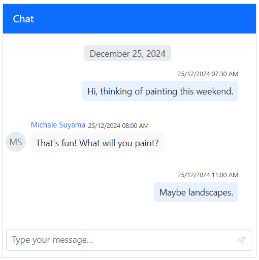

# Time break in Blazor Chat UI component

## Show or hide time break

You can use the [ShowTimeBreak](https://help.syncfusion.com/cr/blazor/Syncfusion.Blazor.InteractiveChat.SfChatUI.html#Syncfusion_Blazor_InteractiveChat_SfChatUI_ShowTimeBreak) property to display date-wise separations between all the messages which enhances the readability and message organizing. The default value is `false`, indicating time breaks are disabled unless it is enabled.

```cshtml

@using Syncfusion.Blazor.InteractiveChat

<div style="height: 400px; width: 400px;">
    <SfChatUI ID="chatUser" ShowTimeBreak="true" User="CurrentUserModel" Messages="ChatUserMessages"></SfChatUI>
</div>

@code {
    private static UserModel CurrentUserModel = new UserModel() { ID = "User1", User = "Albert" };
    private static UserModel MichaleUserModel = new UserModel() { ID = "User2", User = "Michale Suyama" };
    
    private List<ChatMessage> ChatUserMessages = new List<ChatMessage>()
    {
        new ChatMessage() { Text = "Hi, thinking of painting this weekend.", Author = CurrentUserModel, Timestamp = new DateTime(2024,12,25,7,30,0) },
        new ChatMessage() { Text = "That’s fun! What will you paint?", Author = MichaleUserModel, Timestamp = new DateTime(2024,12,25,8,0,0) },
        new ChatMessage() { Text = "Maybe landscapes.", Author = CurrentUserModel, Timestamp = new DateTime(2024,12,25,11,0,0) }
    };
}

```



## Time break template

> Refer to the [Templates](./templates#time-break-template) section for more details about the Time break template.
