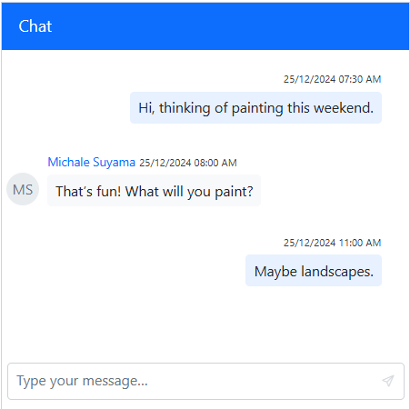

# Timestamp in Blazor Chat UI component

This section explains how to customize the timestamp display in the Syncfusion Blazor Chat component.

## Show or hide timestamp

The [ShowTimestamp](https://help.syncfusion.com/cr/blazor/Syncfusion.Blazor.InteractiveChat.SfChatUI.html#Syncfusion_Blazor_InteractiveChat_SfChatUI_ShowTimestamp) property enables or disables the timestamp for all messages, which indicates the date and time they were sent. By default, this property is set to `true`.

The [Timestamp](https://help.syncfusion.com/cr/blazor/Syncfusion.Blazor.InteractiveChat.ChatMessage.html#Syncfusion_Blazor_InteractiveChat_ChatMessage_Timestamp) property in the `ChatMessage` class specifies the date and time for each message. If not set, it defaults to the current system time when the message is created.

```cshtml

@using Syncfusion.Blazor.InteractiveChat

<div style="height: 400px; width: 400px;">
    <SfChatUI ID="chatUser" User="CurrentUserModel" ShowTimestamp="true" Messages="ChatUserMessages"></SfChatUI>
</div>

@code {
    private static UserModel CurrentUserModel = new UserModel() { ID = "User1", User = "Albert" };
    private static UserModel MichaleUserModel = new UserModel() { ID = "User2", User = "Michale Suyama" };

    private List<ChatMessage> ChatUserMessages = new List<ChatMessage>()
    {
        new ChatMessage() { Text = "Hi, thinking of painting this weekend.", Author = CurrentUserModel, Timestamp = new DateTime(2024,12,25,7,30,0) },
        new ChatMessage() { Text = "That’s fun! What will you paint?", Author = MichaleUserModel, Timestamp = new DateTime(2024,12,25,8,0,0) },
        new ChatMessage() { Text = "Maybe landscapes.", Author = CurrentUserModel, Timestamp = new DateTime(2024,12,25,11,0,0) }
    };
}

```



## Setting timestamp format

The [TimestampFormat](https://help.syncfusion.com/cr/blazor/Syncfusion.Blazor.InteractiveChat.SfChatUI.html#Syncfusion_Blazor_InteractiveChat_SfChatUI_TimestampFormat) property allows you to customize the display format for message timestamps. The default format is `dd/MM/yyyy hh:mm tt`.

```cshtml

@using Syncfusion.Blazor.InteractiveChat

<div style="height: 400px; width: 400px;">
    <SfChatUI ID="chatUser" User="CurrentUserModel" TimestampFormat="MMMM hh:mm tt" Messages="ChatUserMessages"></SfChatUI>
</div>

@code {
    private static UserModel CurrentUserModel = new UserModel() { ID = "User1", User = "Albert" };
    private static UserModel MichaleUserModel = new UserModel() { ID = "User2", User = "Michale Suyama" };

    private List<ChatMessage> ChatUserMessages = new List<ChatMessage>()
    {
        new ChatMessage() { Text = "Hi, thinking of painting this weekend.", Author = CurrentUserModel },
        new ChatMessage() { Text = "That’s fun! What will you paint?", Author = MichaleUserModel },
        new ChatMessage() { Text = "Maybe landscapes.", Author = CurrentUserModel }
    };
}

```


