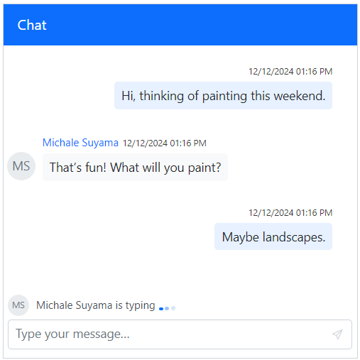

# Typing Indicator in Blazor Chat Component

## Show or hide typing indicator

Use the [TypingUsers](https://help.syncfusion.com/cr/blazor/Syncfusion.Blazor.InteractiveChat.SfChatUI.html#Syncfusion_Blazor_InteractiveChat_SfChatUI_TypingUsers) property to display an indicator when other participants are typing. The indicator is automatically removed when the `TypingUsers` list is empty.

The `TypingUsers` property accepts a list of [UserModel](https://help.syncfusion.com/cr/blazor/Syncfusion.Blazor.InteractiveChat.UserModel.html) objects. This list can be updated dynamically to show or hide the typing indicator for specific users.

```cshtml

@using Syncfusion.Blazor.InteractiveChat

<div style="height: 400px; width: 400px;">
    <SfChatUI ID="chatUser" User="CurrentUserModel" TypingUsers="TypingUsers" Messages="ChatUserMessages"></SfChatUI>
</div>

@code {
    private static UserModel CurrentUserModel = new UserModel() { ID = "User1", User = "Albert" };
    private static UserModel MichaleUserModel = new UserModel() { ID = "User2", User = "Michale Suyama" };
    private List<UserModel> TypingUsers = new List<UserModel>() { MichaleUserModel };

    private List<ChatMessage> ChatUserMessages = new List<ChatMessage>()
    {
        new ChatMessage() { Text = "Hi, thinking of painting this weekend.", Author = CurrentUserModel },
        new ChatMessage() { Text = "That’s fun! What will you paint?", Author = MichaleUserModel },
        new ChatMessage() { Text = "Maybe landscapes.", Author = CurrentUserModel }
    };
}

```



## Typing indicator template 

The appearance of the typing indicator can be customized using a template. For more details, refer to the [Templates](./templates#typing-indicator-template) section.
