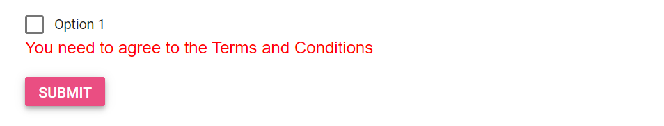

# Model Binding in Blazor CheckBox Component

To get started quickly with model binding in the Blazor CheckBox component, watch the following video:



This section demonstrates model binding with EditForm and DataAnnotations using the Syncfusion SfCheckBox component. In Blazor, a form is strongly typed when an EditForm is bound to a model instance, allowing component parameters to bind to model properties and participate in validation. For an overview of the component, see the CheckBox documentation (https://blazor.syncfusion.com/documentation/checkbox/).

In this example, the Checked property of SfCheckBox is two-way bound with @bind-Checked to a bool property on the model. The form uses DataAnnotationsValidator and displays a ValidationMessage when validation fails. Learn more in the following Microsoft articles: EditForm (https://learn.microsoft.com/aspnet/core/blazor/forms-and-input-components), DataAnnotationsValidator (https://learn.microsoft.com/aspnet/core/blazor/forms-and-input-components#data-annotations-validation), and ValidationMessage (https://learn.microsoft.com/aspnet/core/blazor/forms-and-input-components#validation-support).

Because Required does not validate bool values, the Range(true, true) attribute is used to require a checked state—commonly used for “Terms and Conditions” acceptance. See RequiredAttribute (https://learn.microsoft.com/dotnet/api/system.componentmodel.dataannotations.requiredattribute) and data annotations validation in Blazor forms (https://learn.microsoft.com/aspnet/core/blazor/forms-and-input-components#data-annotations-validation).

In this sample, select the option and select Submit to post the selected value in the CheckBox. When the value is not checked, a validation message appears below the CheckBox.

```csharp

@using Syncfusion.Blazor.Buttons
@using System.ComponentModel.DataAnnotations

<EditForm Model="Annotate">
    <DataAnnotationsValidator></DataAnnotationsValidator>
    <div class="form-group">
        <SfCheckBox Label="Option 1" @bind-Checked="@Annotate.Check"></SfCheckBox>
        <ValidationMessage For="@(() => Annotate.Check)" />
    </div>
    <SfButton HtmlAttributes="@Submit" Content="Submit"></SfButton>
</EditForm>

@code {
    public Annotation Annotate = new Annotation();
    public class Annotation
    {
        [Range(typeof(bool), "true", "true", ErrorMessage = "You need to agree to the Terms and Conditions")]
        public bool Check { get; set; }
    }
    public Dictionary<string, object> Submit = new Dictionary<string, object>()
    {
        { "type", "submit"}
    };
}

```


