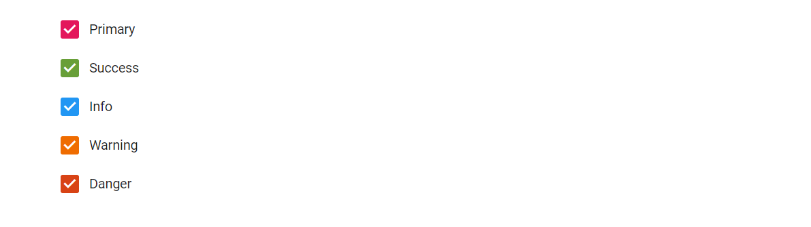

# Customized Checkbox in Blazor CheckBox Component

## Customize checkbox appearance

You can customize the appearance of the Checkbox component using the CSS rules. Define own CSS rules according to your requirement and assign the class name to the
[CssClass](https://help.syncfusion.com/cr/blazor/Syncfusion.Blazor.Buttons.SfCheckBox-1.html) property.

The background and border color of the Checkbox is customized through the custom classes to create primary, success, warning, and danger info type of checkbox.

```cshtml
@using Syncfusion.Blazor.Buttons

<SfCheckBox @bind-Checked="isPrimaryChecked" Label="Primary" CssClass="e-primary"></SfCheckBox><br />
<SfCheckBox @bind-Checked="isSuccessChecked" Label="Success" CssClass="e-success"></SfCheckBox><br />
<SfCheckBox @bind-Checked="isInfoChecked" Label="Info" CssClass="e-info"></SfCheckBox><br />
<SfCheckBox @bind-Checked="isWarningChecked" Label="Warning" CssClass="e-warning"></SfCheckBox><br />
<SfCheckBox @bind-Checked="isDangerChecked" Label="Danger" CssClass="e-danger"></SfCheckBox>

@code {
    private bool isPrimaryChecked = true;
    private bool isSuccessChecked = true;
    private bool isInfoChecked = true;
    private bool isWarningChecked = true;
    private bool isDangerChecked = true;
}

<style>
    .e-checkbox-wrapper.e-primary:hover .e-frame.e-check { /* csslint allow: adjoining-classes */
        background-color: #e03872;
    }

    .e-checkbox-wrapper.e-success .e-frame.e-check,
    .e-checkbox-wrapper.e-success .e-checkbox:focus + .e-frame.e-check { /* csslint allow: adjoining-classes */
        background-color: #689f38;
    }

    .e-checkbox-wrapper.e-success:hover .e-frame.e-check { /* csslint allow: adjoining-classes */
        background-color: #449d44;
    }

    .e-checkbox-wrapper.e-info .e-frame.e-check,
    .e-checkbox-wrapper.e-info .e-checkbox:focus + .e-frame.e-check { /* csslint allow: adjoining-classes */
        background-color: #2196f3;
    }

    .e-checkbox-wrapper.e-info:hover .e-frame.e-check { /* csslint allow: adjoining-classes */
         background-color: #0b7dda;
    }

    .e-checkbox-wrapper.e-warning .e-frame.e-check,
    .e-checkbox-wrapper.e-warning .e-checkbox:focus + .e-frame.e-check { /* csslint allow: adjoining-classes */
        background-color: #ef6c00;
    }

    .e-checkbox-wrapper.e-warning:hover .e-frame.e-check { /* csslint allow: adjoining-classes */
        background-color: #cc5c00;
    }

    .e-checkbox-wrapper.e-danger .e-frame.e-check,
    .e-checkbox-wrapper.e-danger .e-checkbox:focus + .e-frame.e-check { /* csslint allow: adjoining-classes */
        background-color: #d84315;
    }

    .e-checkbox-wrapper.e-danger:hover .e-frame.e-check { /* csslint allow: adjoining-classes */
        background-color: #ba3912;
    }
</style>

```




## Customize width and height

The height and width of the Checkbox component can be customized by setting `height` and `width` properties in `styles`

The following section explains about how to customize the height and width of the Checkbox component.

```cshtml
@using Syncfusion.Blazor.Buttons

<SfCheckBox CssClass="e-customsize" Label="Default" @bind-Checked="isChecked"></SfCheckBox>

@code {
    private bool isChecked = true;
}

<style>
        .e-customsize.e-checkbox-wrapper .e-frame {
            height: 30px;
            width: 30px;
            padding: 8px 0;
        }

        .e-customsize.e-checkbox-wrapper .e-check {
            font-size: 20px;
        }

        .e-customsize.e-checkbox-wrapper .e-ripple-container {
            height: 52px;
            top: -11px;
            width: 47px;
        }

        .e-customsize.e-checkbox-wrapper .e-label {
            line-height: 30px;
            font-size: 20px;
        }
</style>

```



## Custom frame

Checkbox frame can be customized as per the requirement by adding CSS rules.

In the following example, to-do list is displayed with round checkbox by changing `border-radius` as `100%` by adding `e-custom` class.

```cshtml
@using Syncfusion.Blazor.Buttons

<SfCheckBox Label="Buy Groceries" @bind-Checked="isChecked" CssClass="e-custom"></SfCheckBox><br />
<SfCheckBox Label="Pay Rent" @bind-Checked="isRentChecked" CssClass="e-custom"></SfCheckBox><br />
<SfCheckBox Label="Make Dinner" @bind-Checked="isDinnerChecked" CssClass="e-custom"></SfCheckBox><br />
<SfCheckBox Label="Finish To-do List Article" @bind-Checked="isArticleChecked" CssClass="e-custom"></SfCheckBox>

@code {
    private bool isChecked = true;
    private bool isRentChecked = true;
    private bool isDinnerChecked = false;
    private bool isArticleChecked = false;
}

<style>
        .e-custom .e-frame {
            border-radius: 100%;
        }

        .e-checkicon.e-checkbox-wrapper .e-frame.e-check::before {
            content: '\e77d';
        }

        .e-checkicon.e-checkbox-wrapper .e-check {
            font-size: 8.5px;
        }

        .e-checkicon.e-checkbox-wrapper .e-frame.e-check {
            background-color: white;
            border-color: grey;
            color: grey;
        }

        .e-checkicon.e-checkbox-wrapper:hover .e-frame.e-check {
            background-color: white;
            border-color: grey;
            color: grey;
        }

        .e-checkicon.e-checkbox-wrapper .e-checkbox:focus + .e-frame.e-check {
            background-color: white;
            border-color: grey;
            box-shadow: none;
            color: grey;
        }
</style>

```



## Custom check icon

Checkbox check icon can be customized as per the requirement by adding CSS rules.

In the following example, the check icon can be customized by changing check icon content, background and border color in focus and hovered states by adding `e-checkicon` class.

```cshtml
@using Syncfusion.Blazor.Buttons

<SfCheckBox Label="Buy Groceries" @bind-Checked="isChecked" CssClass="e-checkicon"></SfCheckBox><br />
<SfCheckBox Label="Pay Rent"  @bind-Checked="isRentChecked" CssClass="e-checkicon"></SfCheckBox><br />
<SfCheckBox Label="Make Dinner" @bind-Checked="isDinnerChecked" CssClass="e-checkicon"></SfCheckBox><br />
<SfCheckBox Label="Finish To-do List Article" @bind-Checked="isArticleChecked" CssClass="e-checkicon"></SfCheckBox>

@code {
    private bool isChecked = true;
    private bool isRentChecked = true;
    private bool isDinnerChecked = true;
    private bool isArticleChecked = false;
}

<style>
    .e-checkicon.e-checkbox-wrapper .e-frame.e-check::before {
        content: '\e682';
    }
    .e-checkicon.e-checkbox-wrapper .e-check {
        font-size: 12px;
    }
    .e-checkicon.e-checkbox-wrapper .e-frame.e-check,
    .e-checkicon.e-checkbox-wrapper:hover .e-frame.e-check {
        background-color: white;
        border-color: grey;
        color: grey;
    }
    .e-checkicon.e-checkbox-wrapper .e-checkbox:focus + .e-frame.e-check {
        background-color: white;
        border-color: grey;
        box-shadow: none;
        color: grey;
    }
    .e-checkicon.e-checkbox-wrapper .e-ripple-element {
        background: grey;
    }
</style>

```


