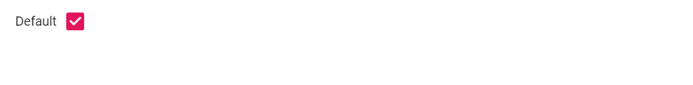

# Right-To-Left

Checkbox component has RTL support. This can be achieved by setting [`EnableRtl`](https://help.syncfusion.com/cr/blazor/Syncfusion.Blazor.Buttons.SfCheckBox-1.html) as `true`.

The following example illustrates how to enable right-to-left support in Checkbox component.

```cshtml
@using Syncfusion.Blazor.Buttons

<SfCheckBox Label="Default" @bind-Checked="isChecked" EnableRtl="true"></SfCheckBox>

@code {
    private bool isChecked = true;
}

```

Output be like

