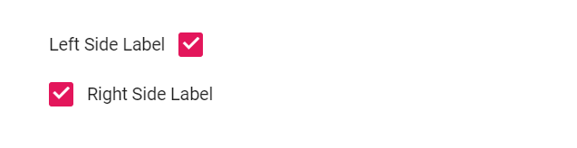

# Label and Size in Blazor CheckBox Component

This topic describes how to configure captions with Label and LabelPosition and how to switch between the available CheckBox sizes.

## Label

The [Blazor CheckBox](https://www.syncfusion.com/blazor-components/blazor-checkbox) caption is set with the [Label](https://help.syncfusion.com/cr/blazor/Syncfusion.Blazor.Buttons.SfCheckBox-1.html#Syncfusion_Blazor_Buttons_SfCheckBox_1_Label) property, which also provides the accessible name. Control the caption placement before or after the box using [LabelPosition](https://help.syncfusion.com/cr/blazor/Syncfusion.Blazor.Buttons.SfCheckBox-1.html#Syncfusion_Blazor_Buttons_SfCheckBox_1_LabelPosition).

```cshtml
@using Syncfusion.Blazor.Buttons

<SfCheckBox Label="Left Side Label" LabelPosition="LabelPosition.Before" @bind-Checked="isLeftChecked"></SfCheckBox><br />
<SfCheckBox Label="Right Side Label" LabelPosition="LabelPosition.After" @bind-Checked="isRightChecked"></SfCheckBox>

@code {
    private bool isLeftChecked = true;
    private bool isRightChecked = true;
}

```




## Size

The CheckBox supports two sizes: default and small. To render a small CheckBox, set the [CssClass](https://help.syncfusion.com/cr/blazor/Syncfusion.Blazor.Buttons.SfCheckBox-1.html) property to e-small. Visual appearance may vary by theme.

```cshtml
@using Syncfusion.Blazor.Buttons

<SfCheckBox @bind-Checked="isSmallChecked" Label="Small" CssClass="e-small"></SfCheckBox><br />
<SfCheckBox @bind-Checked="isDefaultChecked" Label="Default"></SfCheckBox>

@code {
    private bool isSmallChecked = true;
     private bool isDefaultChecked = true;
}

<style>
    .e-checkbox-wrapper {
        margin-top: 18px;
    }
</style>

```



## See also

* [Checkbox customization](./how-to/customized-checkbox)