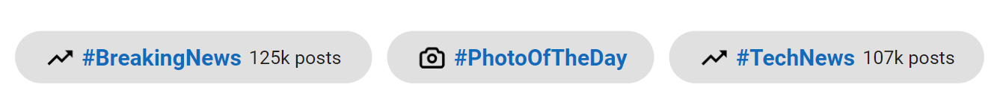

# Customization in Blazor Chip Component

This section explains how to customize the Chip component, including predefined styles, leading icons and avatars, trailing icons, and templates.

## Styles

The Chip component provides predefined visual styles that can be applied using the [`CssClass`](https://help.syncfusion.com/cr/blazor/Syncfusion.Blazor.Buttons.SfChip.html#Syncfusion_Blazor_Buttons_SfChip_CssClass) property. Apply `CssClass` on:
- SfChip: to affect all chips in the list
- ChipItem: to style a specific chip

| Class | Description |
| -------- | -------- |
| e-primary | Represents a primary chip. |
| e-success | Represents a positive chip. |
| e-info | Represents an informative chip. |
| e-warning | Represents a chip that requires caution. |
| e-danger | Represents a negative or destructive chip. |

```cshtml
@using Syncfusion.Blazor.Buttons
<SfChip>
    <ChipItems>
        <ChipItem Text="Default"></ChipItem>
        <ChipItem Text="Primary" CssClass="e-primary"></ChipItem>
        <ChipItem Text="Success" CssClass="e-success"></ChipItem>
        <ChipItem Text="Info" CssClass="e-info"></ChipItem>
        <ChipItem Text="Warning" CssClass="e-warning"></ChipItem>
        <ChipItem Text="Danger" CssClass="e-danger"></ChipItem>
    </ChipItems>
</SfChip>

```




N> Multiple style classes can be combined (for example, `e-outline e-primary`) to achieve the desired appearance.

## Leading icon

Add and customize a leading icon for a chip using the [`LeadingIconCss`](https://help.syncfusion.com/cr/blazor/Syncfusion.Blazor.Buttons.ChipItem.html#Syncfusion_Blazor_Buttons_ChipItem_LeadingIconCss) property.

```cshtml
@using Syncfusion.Blazor.Buttons
<SfChip ID="chip-avatar" EnableDelete="true">
    <ChipItems>
        <ChipItem Text="Anne" LeadingIconCss="anne"></ChipItem>
        <ChipItem Text="Janet" LeadingIconCss="janet"></ChipItem>
        <ChipItem Text="Laura" LeadingIconCss="laura"></ChipItem>
        <ChipItem Text="Margaret" LeadingIconCss="margaret"></ChipItem>
    </ChipItems>
</SfChip>

<style>
    #chip-avatar .anne {
        background-image: url('https://ej2.syncfusion.com/demos/src/chips/images/anne.png')
    }

    #chip-avatar .margaret {
        background-image: url('https://ej2.syncfusion.com/demos/src/chips/images/margaret.png')
    }

    #chip-avatar .laura {
        background-image: url('https://ej2.syncfusion.com/demos/src/chips/images/laura.png')
    }

    #chip-avatar .janet {
        background-image: url('https://ej2.syncfusion.com/demos/src/chips/images/janet.png')
    }
</style>

```




N> Ensure that each icon has clear text content in the chip (`Text`) for accessible names. When using decorative icons, consider appropriate CSS background images and contrast.

## Avatar

Display an avatar as the leading visual using the [`LeadingIconCss`](https://help.syncfusion.com/cr/blazor/Syncfusion.Blazor.Buttons.ChipItem.html#Syncfusion_Blazor_Buttons_ChipItem_LeadingIconCss) property.

```csharp

<SfChip EnableDelete="true" CssClass="e-leading-avatar">
    <ChipItems>
        <ChipItem Text="Andrew" LeadingIconCss="andrew"></ChipItem>
        <ChipItem Text="Janet" LeadingIconCss="janet"></ChipItem>
        <ChipItem Text="Laura" LeadingIconCss="laura"></ChipItem>
        <ChipItem Text="Margaret" LeadingIconCss="margaret"></ChipItem>
    </ChipItems>
</SfChip>

<style>
    .e-chip-avatar.andrew {
        background-image: url('https://ej2.syncfusion.com/demos/src/chips/images/andrew.png')
    }

    .e-chip-avatar.margaret {
        background-image: url('https://ej2.syncfusion.com/demos/src/chips/images/margaret.png')
    }

    .e-chip-avatar.laura {
        background-image: url('https://ej2.syncfusion.com/demos/src/chips/images/laura.png')
    }

    .e-chip-avatar.janet {
        background-image: url('https://ej2.syncfusion.com/demos/src/chips/images/janet.png')
    }
</style>

```



N> Avatars are typically circular thumbnails. Provide meaningful chip text or an `aria-label` if the avatar conveys essential context.

## Leading content

Show text content inside the leading avatar area using the [`LeadingText`](https://help.syncfusion.com/cr/blazor/Syncfusion.Blazor.Buttons.ChipItem.html#Syncfusion_Blazor_Buttons_ChipItem_LeadingText) property (for example, user initials).

```cshtml
@using Syncfusion.Blazor.Buttons
<SfChip EnableDelete="true" CssClass="e-leading-avatar">
    <ChipItems>
        <ChipItem Text="Andrew" LeadingText="A"></ChipItem>
        <ChipItem Text="Janet" LeadingText="J"></ChipItem>
        <ChipItem Text="Laura" LeadingText="L"></ChipItem>
        <ChipItem Text="Margaret" LeadingText="M"></ChipItem>
    </ChipItems>
</SfChip>

```



## Trailing icon

Add and customize a trailing icon for a chip using the [`TrailingIconCss`](https://help.syncfusion.com/cr/blazor/Syncfusion.Blazor.Buttons.ChipItem.html#Syncfusion_Blazor_Buttons_ChipItem_TrailingIconCss) property (commonly used for secondary actions, such as delete).

```cshtml
@using Syncfusion.Blazor.Buttons
<SfChip>
    <ChipItems>
        <ChipItem Text="Andrew" TrailingIconCss="e-dlt-btn"></ChipItem>
        <ChipItem Text="Janet" TrailingIconCss="e-dlt-btn"></ChipItem>
        <ChipItem Text="Laura" TrailingIconCss="e-dlt-btn"></ChipItem>
        <ChipItem Text="Margaret" TrailingIconCss="e-dlt-btn"></ChipItem>
    </ChipItems>
</SfChip>

```




N> Deletable chips can also be configured using `EnableDelete="true"`. Ensure the trailing icon and delete affordance do not conflict.

## Outline chip

An outline chip has a visible border and a transparent background. Apply the outline style using the [`CssClass`](https://help.syncfusion.com/cr/blazor/Syncfusion.Blazor.Buttons.SfChip.html#Syncfusion_Blazor_Buttons_SfChip_CssClass) property.

```cshtml
@using Syncfusion.Blazor.Buttons
<SfChip EnableDelete="true">
    <ChipItems>
        <ChipItem CssClass="e-outline" Text="Andrew"></ChipItem>
        <ChipItem CssClass="e-outline" Text="Janet"></ChipItem>
        <ChipItem CssClass="e-outline" Text="Laura"></ChipItem>
        <ChipItem CssClass="e-outline" Text="Margaret"></ChipItem>
    </ChipItems>
</SfChip>

```



## Template

The ChipItem `Template` property enables full control over the chip’s layout and content. Custom HTML elements, icons, links, or additional content can be provided via the [Template](https://help.syncfusion.com/cr/blazor/Syncfusion.Blazor.Buttons.ChipItem.html#Syncfusion_Blazor_Buttons_ChipItem_Template) property or as direct child content of the [ChipItem](https://help.syncfusion.com/cr/blazor/Syncfusion.Blazor.Buttons.ChipItem.html#Syncfusion_Blazor_Buttons_ChipItem).

The following example customizes the layout and design by adding direct child content inside each `ChipItem`.

```cshtml

@using Syncfusion.Blazor.Buttons

<SfChip id="customTemplate">
    <ChipItems>
        <ChipItem LeadingIconCss="trendingIcon">
            <a href="https://timesofindia.indiatimes.com/news" target="_blank" class="anchorElement">#BreakingNews</a>
            <span class="textElement">125k posts</span>
        </ChipItem>
        <ChipItem LeadingIconCss="cameraIcon">
            <a href="https://blog.google/products/photos/" target="_blank" class="anchorElement">#PhotoOfTheDay</a>
        </ChipItem>
        <ChipItem LeadingIconCss="trendingIcon">
            <a href="https://indianexpress.com/section/technology/" target="_blank" class="anchorElement">#TechNews</a>
            <span class="textElement">107k posts</span>
        </ChipItem>
    </ChipItems>
</SfChip>

<style>

    #customTemplate .e-chip .trendingIcon {
        margin: 4px 0 4px 6px;
        width: 16px;
        height: 16px;
        background-image: url("data:image/svg+xml;utf8;base64,PHN2ZyB4bWxucz0iaHR0cDovL3d3dy53My5vcmcvMjAwMC9zdmciIGhlaWdodD0iNDgiIHdpZHRoPSI0OCI+PHBhdGggZD0ibTMyIDEyIDQuNTkgNC41OS05Ljc2IDkuNzUtOC04TDQgMzMuMTcgNi44MyAzNmwxMi0xMiA4IDggMTIuNTgtMTIuNTlMNDQgMjRWMTJ6Ii8+PHBhdGggZD0iTTAgMGg0OHY0OEgweiIgZmlsbD0ibm9uZSIvPjwvc3ZnPg==");
    }

    #customTemplate .e-chip .cameraIcon {
        margin: 4px 0 4px 6px;
        width: 16px;
        height: 16px;
        background-image: url("data:image/svg+xml;utf8;base64,PHN2ZyB4bWxucz0iaHR0cDovL3d3dy53My5vcmcvMjAwMC9zdmciIHZpZXdCb3g9IjAgMCAyNCAyNCI+PHBhdGggZD0iTTE5LDYuNUgxNy43MmwtLjMyLTFhMywzLDAsMCwwLTIuODQtMkg5LjQ0QTMsMywwLDAsMCw2LjYsNS41NWwtLjMyLDFINWEzLDMsMCwwLDAtMywzdjhhMywzLDAsMCwwLDMsM0gxOWEzLDMsMCwwLDAsMy0zdi04QTMsMywwLDAsMCwxOSw2LjVabTEsMTFhMSwxLDAsMCwxLTEsMUg1YTEsMSwwLDAsMS0xLTF2LThhMSwxLDAsMCwxLDEtMUg3YTEsMSwwLDAsMCwxLS42OGwuNTQtMS42NGExLDEsMCwwLDEsLjk1LS42OGg1LjEyYTEsMSwwLDAsMSwuOTUuNjhsLjU0LDEuNjRBMSwxLDAsMCwwLDE3LDguNWgyYTEsMSwwLDAsMSwxLDFabS04LTlhNCw0LDAsMSwwLDQsNEE0LDQsMCwwLDAsMTIsOC41Wm0wLDZhMiwyLDAsMSwxLDItMkEyLDIsMCwwLDEsMTIsMTQuNVoiLz48L3N2Zz4=");
    }

    #customTemplate .e-chip .anchorElement {
        margin: 0 4px;
        font-weight:600;
        height: 16px;
        line-height:16px;
        font-size: 12px;
        color: #0F6CBD;
        text-decoration: none;
    }

    #customTemplate .e-chip .textElement {
        font-weight: 400;
        height: 14px;
        line-height: 14px;
        font-size: 10px;
        margin-right: 6px;
    }
</style>

```



N> When adding interactive elements (links, buttons) inside chip templates, ensure keyboard focus order, accessible names, and sufficient contrast are maintained.