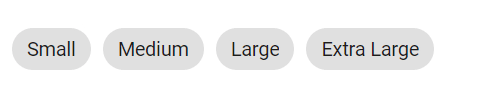
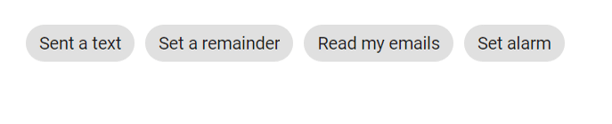

# Types in Blazor Chip Component

The Chip component supports the following types:

* Input Chip
* Choice Chip
* Filter Chip
* Action Chip

## Input Chip

An input chip holds information in a compact form, often representing user input or a selected value. It can include avatars or icons alongside text.

```cshtml
@using Syncfusion.Blazor.Buttons
<SfChip>
    <ChipItems>
        <ChipItem Text="Anne" LeadingIconUrl="https://ej2.syncfusion.com/demos/src/chips/images/andrew.png"></ChipItem>
        <ChipItem Text="Janet" LeadingIconUrl="https://ej2.syncfusion.com/demos/src/chips/images/janet.png"></ChipItem>
        <ChipItem Text="Laura" LeadingIconUrl="https://ej2.syncfusion.com/demos/src/chips/images/laura.png"></ChipItem>
        <ChipItem Text="Margaret" LeadingIconUrl="https://ej2.syncfusion.com/demos/src/chips/images/margaret.png"></ChipItem>
    </ChipItems>
</SfChip>

```




## Choice Chip

A choice chip allows selecting a single chip from a set. Enable this behavior by setting the [`Selection`](https://help.syncfusion.com/cr/blazor/Syncfusion.Blazor.Buttons.SfChip.html#Syncfusion_Blazor_Buttons_SfChip_Selection) property to `Single`.

```cshtml
@using Syncfusion.Blazor.Buttons
<SfChip Selection="SelectionType.Single">
    <ChipItems>
        <ChipItem Text="Small"></ChipItem>
        <ChipItem Text="Medium"></ChipItem>
        <ChipItem Text="Large"></ChipItem>
        <ChipItem Text="Extra Large"></ChipItem>
    </ChipItems>
</SfChip>

```





## Filter Chip

A filter chip allows selecting multiple chips from a set. Enable this behavior by setting the [`Selection`](https://help.syncfusion.com/cr/blazor/Syncfusion.Blazor.Buttons.SfChip.html#Syncfusion_Blazor_Buttons_SfChip_Selection) property to `Multiple`.

```cshtml
@using Syncfusion.Blazor.Buttons
<SfChip Selection="SelectionType.Multiple">
    <ChipItems>
        <ChipItem Text="Chai"></ChipItem>
        <ChipItem Text="Chang"></ChipItem>
        <ChipItem Text="Aniseed Syrup"></ChipItem>
        <ChipItem Text="Ikura"></ChipItem>
    </ChipItems>
</SfChip>

```




## Action Chip

An action chip triggers actions such as click or delete. Use the [`OnClick`](https://help.syncfusion.com/cr/blazor/Syncfusion.Blazor.Buttons.ChipEvents.html#Syncfusion_Blazor_Buttons_ChipEvents_OnClick) or [`OnDelete`](https://help.syncfusion.com/cr/blazor/Syncfusion.Blazor.Buttons.ChipEvents.html#Syncfusion_Blazor_Buttons_ChipEvents_OnDelete) events to respond to user interactions.

```cshtml
@using Syncfusion.Blazor.Buttons
<SfChip>
    <ChipEvents OnClick="@OnClick"></ChipEvents>
    <ChipItems>
        <ChipItem Text="Sent a text"></ChipItem>
        <ChipItem Text="Set a remainder"></ChipItem>
        <ChipItem Text="Read my emails"></ChipItem>
        <ChipItem Text="Set alarm"></ChipItem>
    </ChipItems>
</SfChip>

<div>@ChipText</div>

@code
{
    public string ChipText = "";
    private void OnClick(Syncfusion.Blazor.Buttons.ChipEventArgs args)
    {
        ChipText = args.Text;
        this.StateHasChanged();
    }
}

```




### Deletable Chip

Deletable Chip allows you to delete a chip from Chip/ChipItems. It can be enabled by setting the [`EnableDelete`](https://help.syncfusion.com/cr/blazor/Syncfusion.Blazor.Buttons.SfChip.html#Syncfusion_Blazor_Buttons_SfChip_EnableDelete) property to `true`.

```cshtml
@using Syncfusion.Blazor.Buttons
<SfChip EnableDelete="true">
    <ChipItems>
        <ChipItem Text="Sent a text"></ChipItem>
        <ChipItem Text="Set a remainder"></ChipItem>
        <ChipItem Text="Read my emails"></ChipItem>
        <ChipItem Text="Set alarm"></ChipItem>
    </ChipItems>
</SfChip>

```
