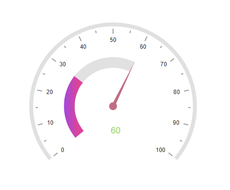

# Animation in Blazor Circular Gauge Component

All elements of the Circular Gauge including axis line, ticks, labels, ranges, pointers and annotations can be animated sequentially using the [AnimationDuration](https://help.syncfusion.com/cr/blazor/Syncfusion.Blazor.CircularGauge.SfCircularGauge.html#Syncfusion_Blazor_CircularGauge_SfCircularGauge_AnimationDuration) property. Animation is enabled when `AnimationDuration` is set to a value in milliseconds, providing smooth rendering. A value of **0** (the default) disables animation. When enabled, the component animates in the following order:

1. The axis line animates in the rendering direction (clockwise or counterclockwise).
2. Each tick line and label animates.
3. If present, ranges animate.
4. If present, pointers animate in the same manner as [pointer animation](https://blazor.syncfusion.com/documentation/circular-gauge/pointers#pointer-animation).
5. If present, annotations animate.

The animation of the Circular Gauge is demonstrated in the following example.

```cshtml

@using Syncfusion.Blazor.CircularGauge;

<SfCircularGauge AnimationDuration="2000">
    <CircularGaugeAxes>
        <CircularGaugeAxis Radius="80%" StartAngle="230" EndAngle="130">
            <CircularGaugeAxisLabelStyle Offset="-1">
                <CircularGaugeAxisLabelFont FontFamily="inherit"></CircularGaugeAxisLabelFont>
            </CircularGaugeAxisLabelStyle>
            <CircularGaugeAxisLineStyle Width="8" Color="#E0E0E0" />
            <CircularGaugeAxisMajorTicks Offset="5" />
            <CircularGaugeAxisMinorTicks Offset="5" />
            <CircularGaugePointers>
                <CircularGaugePointer Value=60 Radius="60%" PointerWidth="7" Color="#c06c84">
                    <CircularGaugePointerAnimation Duration="500" />
                    <CircularGaugeCap Radius="8" Color="#c06c84">
                        <CircularGaugeCapBorder Width="0" />
                    </CircularGaugeCap>
                    <CircularGaugeNeedleTail Length="0%" />
                </CircularGaugePointer>
            </CircularGaugePointers>
        <CircularGaugeRanges>
            <CircularGaugeRange Color="#E63B86" Start="0" End="30" StartWidth="22" EndWidth="22" Radius="60%">
                <LinearGradient StartValue="0%" EndValue="100%">
                    <ColorStops>
                        <ColorStop Opacity="1" Offset="0%" Color="#9e40dc" />
                        <ColorStop Opacity="1" Offset="70%" Color="#d93c95" />
                    </ColorStops>
                </LinearGradient>
            </CircularGaugeRange>
            <CircularGaugeRange Color="#E0E0E0" Start="30" End="60" StartWidth="22" EndWidth="22" Radius="60%" />
        </CircularGaugeRanges>
        <CircularGaugeAnnotations>
            <CircularGaugeAnnotation Angle="165" Radius="35%" ZIndex="1">
                <ContentTemplate>
                    <div style="font-size:18px;margin-left: -20px;margin-top: -12px; color:#9DD55A">60</div>
                </ContentTemplate>
            </CircularGaugeAnnotation>
        </CircularGaugeAnnotations>
        </CircularGaugeAxis>
    </CircularGaugeAxes>
</SfCircularGauge>
    
```



N> Refer to the [pointer animation](https://blazor.syncfusion.com/documentation/circular-gauge/pointers#pointer-animation) to enable only pointer animation.
